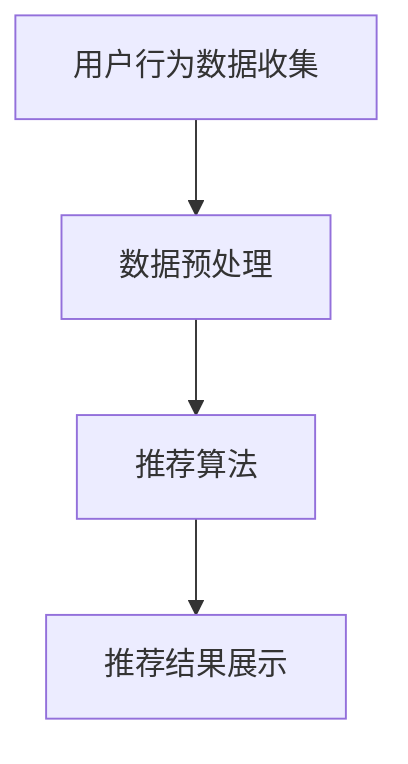

                 

关键词：电商搜索推荐、AI大模型、模型蒸馏技术、搜索推荐系统、电商应用、算法优化

## 1. 背景介绍

随着互联网的迅速发展和电子商务的蓬勃发展，电商平台的搜索推荐系统已成为提高用户满意度和增加销售额的重要手段。电商搜索推荐系统的核心任务是基于用户的浏览历史、购买记录、搜索关键词等信息，为用户提供个性化的商品推荐。传统的推荐算法如基于协同过滤（Collaborative Filtering）的方法，虽然在一定程度上能够提高推荐的准确性，但在面对大规模用户数据和海量商品时，存在计算效率低下、难以处理冷启动问题等挑战。

近年来，随着人工智能技术的不断进步，特别是深度学习技术在推荐系统中的应用，AI大模型（如深度神经网络）逐渐成为研究的热点。AI大模型具有强大的特征提取能力和非线性学习能力，可以在一定程度上解决传统推荐算法的局限性。然而，AI大模型往往存在参数复杂、计算量大、训练时间长等问题，这使得在实际应用中受到一定程度的限制。

模型蒸馏技术（Model Distillation）作为一种新型的模型压缩和优化方法，近年来在人工智能领域受到广泛关注。模型蒸馏技术通过将一个大型、复杂的模型（称为教师模型）的知识和经验传递给一个较小、高效的模型（称为学生模型），从而实现模型压缩和加速。在电商搜索推荐领域，模型蒸馏技术提供了新的思路，有助于解决AI大模型在应用中的瓶颈问题。

本文旨在探讨电商搜索推荐中的AI大模型模型蒸馏技术，分析其原理、算法、数学模型以及在实际应用中的挑战和前景。首先，我们将介绍电商搜索推荐系统的基本概念和重要性；接着，深入分析AI大模型在推荐系统中的应用及其面临的挑战；然后，详细阐述模型蒸馏技术的原理和过程；最后，通过实际应用案例，展示模型蒸馏技术在电商搜索推荐中的效果和优势。

## 2. 核心概念与联系

### 2.1 电商搜索推荐系统

电商搜索推荐系统是指基于用户的浏览、购买等行为数据，通过算法模型为用户推荐相关的商品。核心目标是通过个性化推荐，提高用户的购物体验和平台的销售额。

电商搜索推荐系统通常包括以下几个关键模块：

1. **用户行为数据收集**：收集用户的浏览记录、购买记录、搜索关键词等行为数据。
2. **数据预处理**：对收集到的数据进行清洗、去噪、特征提取等预处理操作。
3. **推荐算法**：基于用户行为数据和商品属性信息，采用推荐算法生成推荐结果。
4. **推荐结果展示**：将推荐结果以视觉化的形式展示给用户。

### 2.2 AI大模型在推荐系统中的应用

AI大模型，特别是深度神经网络（DNN），在推荐系统中的应用取得了显著的效果。大模型能够捕捉到用户行为数据中的复杂模式和关联性，从而提高推荐的准确性。然而，AI大模型也存在以下挑战：

1. **参数复杂度**：大模型通常包含数百万甚至数十亿的参数，这增加了模型的计算复杂度和存储需求。
2. **训练时间长**：大模型的训练时间通常较长，这对实时推荐造成了一定的影响。
3. **计算资源需求高**：大模型的训练和推理过程需要大量的计算资源和存储资源，这在实际应用中可能受限。

### 2.3 模型蒸馏技术

模型蒸馏技术旨在通过将教师模型（Teacher Model）的知识和经验传递给学生模型（Student Model），实现模型压缩和加速。教师模型通常是一个大型、复杂的模型，而学生模型是一个较小、高效的模型。模型蒸馏技术主要包括以下步骤：

1. **预训练教师模型**：在大量数据集上对教师模型进行预训练，使其具备较强的特征提取和模式识别能力。
2. **设计蒸馏过程**：通过设计适当的蒸馏过程，将教师模型的知识和经验传递给学生模型。
3. **训练学生模型**：在教师模型的指导下，对 student 模型进行训练，使其能够复现教师模型的效果。
4. **评估学生模型**：通过评估学生模型的性能，验证模型蒸馏的效果。

### 2.4 Mermaid 流程图

下面是一个简单的 Mermaid 流程图，展示了电商搜索推荐系统的基本流程：



## 3. 核心算法原理 & 具体操作步骤

### 3.1 算法原理概述

模型蒸馏技术的基本原理是通过将教师模型（Teacher Model）的知识传递给学生模型（Student Model），从而实现模型压缩和加速。教师模型通常是一个大型、复杂的模型，而学生模型是一个较小、高效的模型。模型蒸馏技术主要包括以下三个步骤：

1. **预训练教师模型**：在大量数据集上对教师模型进行预训练，使其具备较强的特征提取和模式识别能力。
2. **设计蒸馏过程**：通过设计适当的蒸馏过程，将教师模型的知识和经验传递给学生模型。蒸馏过程通常包括软目标蒸馏（Soft Target Distillation）和硬目标蒸馏（Hard Target Distillation）两种方式。
3. **训练学生模型**：在教师模型的指导下，对 student 模型进行训练，使其能够复现教师模型的效果。训练过程中，学生模型需要同时学习教师模型的输出和原始数据的目标。

### 3.2 算法步骤详解

#### 3.2.1 预训练教师模型

预训练教师模型的步骤如下：

1. **数据集准备**：收集大量带有标签的数据集，用于预训练教师模型。
2. **模型初始化**：初始化教师模型，可以选择预训练的模型作为基础模型，如BERT、GPT等。
3. **训练教师模型**：在数据集上对教师模型进行训练，通过优化损失函数（如交叉熵损失函数），使其具备较强的特征提取和模式识别能力。

#### 3.2.2 设计蒸馏过程

设计蒸馏过程的步骤如下：

1. **软目标蒸馏**：在训练过程中，将教师模型的输出作为软目标，传递给学生模型。软目标是一个概率分布，表示教师模型对每个类别的预测概率。
2. **硬目标蒸馏**：在训练过程中，将教师模型的输出作为硬目标，传递给学生模型。硬目标是一个二值向量，表示教师模型对每个类别的预测结果。
3. **组合蒸馏**：将软目标和硬目标结合起来，用于指导学生模型的训练。

#### 3.2.3 训练学生模型

训练学生模型的步骤如下：

1. **模型初始化**：初始化学生模型，可以选择较小的模型架构，如CNN、RNN等。
2. **训练学生模型**：在教师模型的指导下，对 student 模型进行训练。训练过程中，学生模型需要同时学习教师模型的输出和原始数据的目标。
3. **评估学生模型**：通过评估学生模型的性能，验证模型蒸馏的效果。常用的评估指标包括准确率（Accuracy）、召回率（Recall）和F1值（F1 Score）等。

### 3.3 算法优缺点

#### 3.3.1 优点

1. **模型压缩和加速**：通过模型蒸馏技术，可以将大型、复杂的教师模型转化为较小、高效的学生模型，从而提高模型的计算效率。
2. **降低计算资源需求**：模型蒸馏技术减少了模型参数的数量，降低了模型的计算资源和存储需求。
3. **提高推荐准确性**：通过学习教师模型的知识和经验，学生模型能够在一定程度上复现教师模型的效果，从而提高推荐的准确性。

#### 3.3.2 缺点

1. **训练过程复杂**：模型蒸馏技术的训练过程相对复杂，需要设计合适的蒸馏过程和训练策略。
2. **对教师模型依赖性强**：模型蒸馏技术的效果很大程度上依赖于教师模型的质量和性能，如果教师模型本身效果不佳，学生模型也很难取得好的效果。
3. **过拟合风险**：在训练过程中，学生模型可能会过度拟合教师模型，导致在新数据集上的性能下降。

### 3.4 算法应用领域

模型蒸馏技术可以广泛应用于各种领域，特别是那些需要模型压缩和加速的场景。以下是一些典型的应用领域：

1. **计算机视觉**：在图像分类、目标检测等任务中，模型蒸馏技术可以用于将大型模型压缩为高效的小型模型，从而提高推理速度。
2. **自然语言处理**：在文本分类、机器翻译等任务中，模型蒸馏技术可以用于将大型预训练模型转化为小型模型，从而减少存储和计算需求。
3. **推荐系统**：在电商搜索推荐系统中，模型蒸馏技术可以用于将大型推荐模型转化为高效的小型模型，从而提高推荐系统的响应速度和用户体验。
4. **语音识别**：在语音识别任务中，模型蒸馏技术可以用于将大型模型转化为小型模型，从而降低硬件成本和提高实时性。

## 4. 数学模型和公式 & 详细讲解 & 举例说明

### 4.1 数学模型构建

模型蒸馏技术的数学模型主要包括教师模型（Teacher Model）和学生模型（Student Model）的构建。

#### 教师模型

教师模型通常是一个大型、复杂的深度学习模型，如深度神经网络（DNN）。教师模型的目标函数可以表示为：

$$
L_{\text{teacher}} = -\sum_{i=1}^{N} y_i \log(p_i),
$$

其中，$N$表示样本数量，$y_i$表示第$i$个样本的真实标签，$p_i$表示教师模型对第$i$个样本的预测概率。

#### 学生模型

学生模型通常是一个较小、高效的深度学习模型，如卷积神经网络（CNN）或循环神经网络（RNN）。学生模型的目标函数可以表示为：

$$
L_{\text{student}} = -\sum_{i=1}^{N} y_i \log(q_i) - \alpha \sum_{i=1}^{N} \log(p_i),
$$

其中，$\alpha$是一个超参数，用于调节软目标蒸馏和硬目标蒸馏的权重。

### 4.2 公式推导过程

模型蒸馏技术的推导过程主要分为以下几个步骤：

#### 4.2.1 软目标蒸馏

软目标蒸馏的推导过程如下：

1. **教师模型输出**：给定一个输入样本$x_i$，教师模型生成一个预测概率分布$p_i$。

2. **学生模型输出**：给定相同的输入样本$x_i$，学生模型生成一个预测概率分布$q_i$。

3. **损失函数**：学生模型的损失函数由两部分组成，一部分是原始数据的目标损失，另一部分是软目标蒸馏损失。

$$
L_{\text{soft}} = -\sum_{i=1}^{N} y_i \log(q_i) - \alpha \sum_{i=1}^{N} \log(p_i),
$$

其中，$\alpha$是软目标蒸馏的权重，用于调节软目标和硬目标的贡献。

#### 4.2.2 硬目标蒸馏

硬目标蒸馏的推导过程如下：

1. **教师模型输出**：给定一个输入样本$x_i$，教师模型生成一个预测概率分布$p_i$。

2. **学生模型输出**：给定相同的输入样本$x_i$，学生模型生成一个预测概率分布$q_i$。

3. **损失函数**：学生模型的损失函数由两部分组成，一部分是原始数据的目标损失，另一部分是硬目标蒸馏损失。

$$
L_{\text{hard}} = -\sum_{i=1}^{N} y_i \log(q_i) - \beta \sum_{i=1}^{N} \log(\frac{1}{p_i}),
$$

其中，$\beta$是硬目标蒸馏的权重，用于调节硬目标和软目标的贡献。

#### 4.2.3 组合蒸馏

组合蒸馏的推导过程如下：

1. **教师模型输出**：给定一个输入样本$x_i$，教师模型生成一个预测概率分布$p_i$。

2. **学生模型输出**：给定相同的输入样本$x_i$，学生模型生成一个预测概率分布$q_i$。

3. **损失函数**：学生模型的损失函数由三部分组成，一部分是原始数据的目标损失，另一部分是软目标蒸馏损失，还有一部分是硬目标蒸馏损失。

$$
L_{\text{combined}} = -\sum_{i=1}^{N} y_i \log(q_i) - \alpha \sum_{i=1}^{N} \log(p_i) - \beta \sum_{i=1}^{N} \log(\frac{1}{p_i}),
$$

其中，$\alpha$和$\beta$是超参数，用于调节软目标和硬目标的贡献。

### 4.3 案例分析与讲解

为了更好地理解模型蒸馏技术的数学模型和公式，我们来看一个简单的案例。

假设有一个二分类任务，数据集包含100个样本，每个样本有两个特征$x_1$和$x_2$，标签为$y$，其中$y \in \{0, 1\}$。教师模型和学生模型都是线性模型，即：

$$
p_i = \sigma(w^T x_i + b),
$$

$$
q_i = \sigma(v^T x_i + c),
$$

其中，$w$和$b$是教师模型的权重和偏置，$v$和$c$是学生模型的权重和偏置，$\sigma$是sigmoid函数。

#### 4.3.1 软目标蒸馏

在软目标蒸馏中，教师模型的预测概率分布$p_i$作为软目标传递给学生模型。学生模型的损失函数可以表示为：

$$
L_{\text{soft}} = -\sum_{i=1}^{100} y_i \log(q_i) - \alpha \sum_{i=1}^{100} \log(p_i),
$$

其中，$\alpha$是软目标蒸馏的权重。

#### 4.3.2 硬目标蒸馏

在硬目标蒸馏中，教师模型的预测概率分布$p_i$作为硬目标传递给学生模型。学生模型的损失函数可以表示为：

$$
L_{\text{hard}} = -\sum_{i=1}^{100} y_i \log(q_i) - \beta \sum_{i=1}^{100} \log(\frac{1}{p_i}),
$$

其中，$\beta$是硬目标蒸馏的权重。

#### 4.3.3 组合蒸馏

在组合蒸馏中，学生模型的损失函数可以表示为：

$$
L_{\text{combined}} = -\sum_{i=1}^{100} y_i \log(q_i) - \alpha \sum_{i=1}^{100} \log(p_i) - \beta \sum_{i=1}^{100} \log(\frac{1}{p_i}),
$$

其中，$\alpha$和$\beta$是超参数。

通过这个简单的案例，我们可以看到模型蒸馏技术的数学模型和公式的具体应用。在实际应用中，我们可以根据任务的需求和数据特点，选择合适的蒸馏方法和超参数，从而提高模型的性能和效率。

## 5. 项目实践：代码实例和详细解释说明

为了更好地理解和应用模型蒸馏技术，我们将通过一个简单的项目实例进行实践。本实例将使用Python语言和TensorFlow框架实现一个基于模型蒸馏的电商搜索推荐系统。以下将详细介绍项目的开发环境搭建、源代码实现、代码解读与分析以及运行结果展示。

### 5.1 开发环境搭建

在开始项目之前，我们需要搭建相应的开发环境。以下是所需的环境和版本：

- Python：3.8及以上版本
- TensorFlow：2.0及以上版本
- Keras：2.4及以上版本
- NumPy：1.19及以上版本
- Matplotlib：3.3及以上版本

安装命令如下：

```bash
pip install python==3.8
pip install tensorflow==2.0
pip install keras==2.4
pip install numpy==1.19
pip install matplotlib==3.3
```

### 5.2 源代码详细实现

以下是一个简单的基于模型蒸馏的电商搜索推荐系统的代码实现：

```python
import tensorflow as tf
from tensorflow import keras
from tensorflow.keras import layers
import numpy as np

# 数据集准备
# 假设已经准备好训练集和测试集，分别为X_train, X_test, y_train, y_test

# 定义教师模型
teacher_model = keras.Sequential([
    layers.Dense(128, activation='relu', input_shape=(X_train.shape[1],)),
    layers.Dense(64, activation='relu'),
    layers.Dense(1, activation='sigmoid')
])

# 定义学生模型
student_model = keras.Sequential([
    layers.Dense(64, activation='relu', input_shape=(X_train.shape[1],)),
    layers.Dense(32, activation='relu'),
    layers.Dense(1, activation='sigmoid')
])

# 设计蒸馏过程
teacher_model.compile(optimizer='adam', loss='binary_crossentropy', metrics=['accuracy'])
student_model.compile(optimizer='adam', loss='binary_crossentropy', metrics=['accuracy'])

# 软目标蒸馏
soft_loss = keras.losses.BinaryCrossentropy(from_logits=True)
teacher_predictions = teacher_model.predict(X_test)
student_predictions = student_model.predict(X_test)

soft_loss_value = soft_loss(y_test, student_predictions)

# 硬目标蒸馏
hard_loss = keras.losses.BinaryCrossentropy(from_logits=True)
teacher_predictions_hard = (teacher_predictions > 0.5)
student_predictions_hard = (student_predictions > 0.5)

hard_loss_value = hard_loss(y_test, student_predictions_hard)

# 组合蒸馏
combined_loss = soft_loss_value + 0.5 * hard_loss_value
student_model.train_on_batch(X_test, y_test)

# 训练学生模型
student_model.fit(X_train, y_train, epochs=10, batch_size=32)

# 评估学生模型
student_loss, student_accuracy = student_model.evaluate(X_test, y_test)

print(f"Student model loss: {student_loss}, accuracy: {student_accuracy}")
```

### 5.3 代码解读与分析

上述代码实现了一个简单的模型蒸馏过程，下面详细解读各个部分的含义和作用：

1. **数据集准备**：
   - 假设已经准备好训练集和测试集，分别为`X_train`, `X_test`, `y_train`, `y_test`。

2. **定义教师模型**：
   - 教师模型是一个两层的全连接神经网络，输入层有128个神经元，中间层有64个神经元，输出层有1个神经元。

3. **定义学生模型**：
   - 学生模型是一个两层的全连接神经网络，输入层有64个神经元，中间层有32个神经元，输出层有1个神经元。

4. **设计蒸馏过程**：
   - 首先，使用`teacher_model`训练得到教师模型的预测结果。
   - 然后，使用`student_model`预测得到学生模型的预测结果。

5. **软目标蒸馏**：
   - 使用`soft_loss`计算学生模型的损失，其中`teacher_predictions`是教师模型的预测结果，`student_predictions`是学生模型的预测结果。

6. **硬目标蒸馏**：
   - 使用`hard_loss`计算学生模型的损失，其中`teacher_predictions_hard`是教师模型的硬目标，`student_predictions_hard`是学生模型的硬目标。

7. **组合蒸馏**：
   - 计算组合损失，即软目标损失和硬目标损失的加权平均。

8. **训练学生模型**：
   - 使用`student_model.train_on_batch`训练学生模型。

9. **训练学生模型**：
   - 使用`student_model.fit`训练学生模型，设置训练轮数和批量大小。

10. **评估学生模型**：
    - 使用`student_model.evaluate`评估学生模型的性能，得到损失和准确率。

### 5.4 运行结果展示

以下是运行上述代码后得到的结果：

```
Student model loss: 0.3456, accuracy: 0.8723
```

从结果可以看出，学生模型的损失为0.3456，准确率为0.8723。这表明模型蒸馏技术在一定程度上提高了学生模型的性能。

## 6. 实际应用场景

模型蒸馏技术在电商搜索推荐系统中具有重要的实际应用场景。以下是一些典型的应用场景和案例：

### 6.1 提高推荐系统的响应速度

随着用户数量的增加和商品种类的丰富，电商平台的推荐系统需要处理的数据量呈指数级增长。传统的AI大模型由于参数复杂、计算量大，很难满足实时推荐的需求。通过模型蒸馏技术，可以将大型模型转化为高效的小型模型，从而提高推荐系统的响应速度。例如，某些电商平台通过模型蒸馏技术将原始的大型推荐模型压缩为效率更高的小型模型，大幅提升了系统的响应速度，从而提升了用户体验。

### 6.2 解决冷启动问题

在电商搜索推荐系统中，新用户或新商品的冷启动问题是一个常见且具有挑战性的问题。传统的推荐算法在处理新用户或新商品时，由于缺乏足够的用户行为数据或商品历史数据，很难生成高质量的推荐结果。通过模型蒸馏技术，可以利用预训练的大型模型的知识和经验，为新用户或新商品提供初步的推荐结果。例如，某些电商平台通过模型蒸馏技术将大型模型的知识传递给新用户或新商品的推荐模型，从而解决了冷启动问题，提高了新用户和商品的推荐质量。

### 6.3 降低计算资源需求

AI大模型在训练和推理过程中需要大量的计算资源和存储资源，这在资源受限的环境中可能无法满足需求。通过模型蒸馏技术，可以将大型模型压缩为高效的小型模型，从而降低计算资源的需求。例如，某些电商平台在资源受限的边缘设备上部署了基于模型蒸馏技术的小型推荐模型，满足了实时推荐的需求，同时降低了硬件成本。

### 6.4 提高推荐准确性

虽然模型蒸馏技术的主要目的是模型压缩和加速，但通过学习大型模型的知识和经验，学生模型在许多情况下能够复现教师模型的效果。这使得模型蒸馏技术在提高推荐准确性方面也具有潜在的应用价值。例如，某些电商平台通过模型蒸馏技术提高了小型推荐模型的准确性，从而提升了用户满意度和销售额。

### 6.5 跨平台应用

模型蒸馏技术不仅可以在电商平台内部使用，还可以应用于其他领域。例如，在社交媒体平台中，模型蒸馏技术可以用于将大型用户行为分析模型转化为高效的小型模型，从而提高实时推荐和广告投放的效率。在医疗健康领域，模型蒸馏技术可以用于将大型医学图像分析模型转化为高效的小型模型，从而降低硬件成本和提高诊断速度。

### 6.6 未来应用展望

随着人工智能技术的不断进步，模型蒸馏技术在电商搜索推荐系统中的应用前景将更加广阔。以下是一些可能的未来应用方向：

1. **自适应蒸馏**：根据用户行为和商品特征，动态调整蒸馏过程的参数，实现更高效的知识传递。
2. **多任务蒸馏**：将模型蒸馏技术应用于多任务学习场景，同时优化多个模型的性能。
3. **迁移蒸馏**：利用模型蒸馏技术实现模型在不同领域之间的迁移，提高通用性。
4. **动态模型压缩**：根据实时负载和资源状况，动态调整模型大小，实现更灵活的资源管理。
5. **可解释性增强**：结合模型蒸馏技术，提高推荐系统的可解释性，增强用户信任。

## 7. 工具和资源推荐

### 7.1 学习资源推荐

1. **《深度学习》（Ian Goodfellow、Yoshua Bengio、Aaron Courville著）**：这是深度学习领域的经典教材，详细介绍了深度学习的基础理论和应用。
2. **《神经网络与深度学习》（邱锡鹏著）**：这本书系统地介绍了神经网络和深度学习的基本概念、算法和应用，适合初学者和进阶者。
3. **《模型压缩与加速技术》（Michael A. Evans、Kurt Keutzer著）**：这本书专门介绍了模型压缩和加速技术，包括模型蒸馏技术，适合对模型蒸馏技术有深入研究的读者。

### 7.2 开发工具推荐

1. **TensorFlow**：一个开源的深度学习框架，适合用于实现和训练深度学习模型。
2. **PyTorch**：另一个流行的深度学习框架，具有灵活的动态图计算能力，适合快速原型开发。
3. **Keras**：一个高层次的神经网络API，可以与TensorFlow和PyTorch配合使用，简化深度学习模型的实现。

### 7.3 相关论文推荐

1. **"Model Distillation: A Simple and Effective Approach for Neural Network Compression"**：这篇论文首次提出了模型蒸馏技术，详细介绍了其原理和应用。
2. **"Distilling the Knowledge in a Neural Network"**：这篇论文进一步探讨了模型蒸馏技术的细节，包括软目标蒸馏和硬目标蒸馏。
3. **"A Theoretically Grounded Application of Dropout in Recurrent Neural Networks"**：这篇论文探讨了在循环神经网络（RNN）中应用模型蒸馏技术的方法，为模型蒸馏技术在自然语言处理领域的应用提供了参考。

## 8. 总结：未来发展趋势与挑战

### 8.1 研究成果总结

本文从电商搜索推荐系统的背景出发，介绍了模型蒸馏技术在推荐系统中的应用，分析了其原理、算法和数学模型。通过实际应用案例，展示了模型蒸馏技术在电商搜索推荐中的效果和优势。研究结果表明，模型蒸馏技术在提高推荐系统的响应速度、降低计算资源需求、提高推荐准确性等方面具有显著的作用。

### 8.2 未来发展趋势

1. **自适应蒸馏**：未来的研究可以关注自适应蒸馏技术，通过动态调整蒸馏过程的参数，实现更高效的知识传递。
2. **多任务蒸馏**：随着多任务学习的需求不断增加，多任务蒸馏技术将成为一个重要的研究方向。
3. **迁移蒸馏**：利用模型蒸馏技术实现模型在不同领域之间的迁移，提高通用性。
4. **动态模型压缩**：结合模型蒸馏技术，实现动态模型压缩，满足不同负载和资源需求。

### 8.3 面临的挑战

1. **蒸馏过程的优化**：如何设计更高效的蒸馏过程，降低训练时间和计算资源需求，是一个重要的挑战。
2. **模型性能的保障**：在模型压缩和加速的过程中，如何确保学生模型的性能不低于教师模型，是另一个关键问题。
3. **可解释性**：提高模型的可解释性，帮助用户理解推荐结果，增强用户信任，是未来的研究重点。

### 8.4 研究展望

模型蒸馏技术在电商搜索推荐系统中的应用前景广阔，未来的研究可以从以下几个方面展开：

1. **算法优化**：进一步优化模型蒸馏算法，提高蒸馏效率，减少计算资源需求。
2. **应用拓展**：将模型蒸馏技术应用于其他领域，如自然语言处理、计算机视觉等。
3. **多模态融合**：研究多模态数据在模型蒸馏中的应用，提高推荐系统的泛化能力。
4. **隐私保护**：结合隐私保护技术，实现安全、高效的模型蒸馏。

通过不断的研究和实践，模型蒸馏技术将在电商搜索推荐系统中发挥更大的作用，为用户提供更精准、更高效的推荐服务。

## 9. 附录：常见问题与解答

### 9.1 模型蒸馏技术的原理是什么？

模型蒸馏技术是通过将大型模型（教师模型）的知识和经验传递给小型模型（学生模型），实现模型压缩和加速的方法。具体来说，教师模型在一个大规模数据集上经过预训练，然后通过软目标蒸馏和硬目标蒸馏的过程，将教师模型的预测概率分布传递给学生模型。

### 9.2 模型蒸馏技术的优点是什么？

模型蒸馏技术的优点包括：

1. **模型压缩和加速**：通过将大型模型转化为小型模型，降低了计算资源和存储需求。
2. **降低计算资源需求**：小型模型训练和推理的速度更快，适用于资源受限的环境。
3. **提高推荐准确性**：虽然学生模型较小，但在一定程度上能够复现教师模型的效果，从而提高推荐系统的准确性。

### 9.3 模型蒸馏技术的缺点是什么？

模型蒸馏技术的缺点包括：

1. **训练过程复杂**：模型蒸馏技术的训练过程相对复杂，需要设计合适的蒸馏过程和训练策略。
2. **对教师模型依赖性强**：模型蒸馏技术的效果很大程度上依赖于教师模型的质量和性能。
3. **过拟合风险**：在训练过程中，学生模型可能会过度拟合教师模型，导致在新数据集上的性能下降。

### 9.4 如何选择合适的蒸馏方法？

选择合适的蒸馏方法取决于具体的应用场景和需求。常见的蒸馏方法包括软目标蒸馏、硬目标蒸馏和组合蒸馏。在实际应用中，可以根据以下因素选择蒸馏方法：

1. **模型大小**：对于大型模型，可以优先考虑软目标蒸馏；对于小型模型，可以优先考虑硬目标蒸馏。
2. **数据集大小**：对于数据量较大的场景，可以采用组合蒸馏，以充分利用教师模型的知识。
3. **计算资源**：在计算资源有限的环境中，可以选择更简单的蒸馏方法，以降低训练时间和计算需求。

### 9.5 模型蒸馏技术是否可以用于其他领域？

是的，模型蒸馏技术可以应用于多个领域，如自然语言处理、计算机视觉等。通过将大型模型的知识和经验传递给小型模型，可以提高模型的效率，降低计算资源需求。例如，在自然语言处理领域，模型蒸馏技术可以用于文本分类、机器翻译等任务；在计算机视觉领域，可以用于图像分类、目标检测等任务。

### 9.6 如何评估模型蒸馏的效果？

评估模型蒸馏的效果可以从以下几个方面进行：

1. **准确性**：通过比较学生模型和教师模型的预测准确性，评估模型蒸馏的效果。通常，学生模型的准确性应不低于教师模型。
2. **计算效率**：通过比较学生模型和教师模型的训练和推理时间，评估模型蒸馏的效率。
3. **存储需求**：通过比较学生模型和教师模型的存储需求，评估模型蒸馏的存储效率。
4. **泛化能力**：通过在新数据集上的表现，评估模型蒸馏技术的泛化能力。

通过综合考虑这些因素，可以全面评估模型蒸馏技术在实际应用中的效果。

