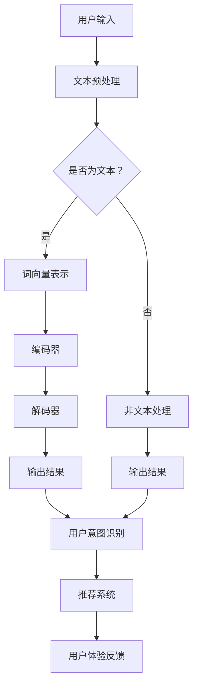

                 

在当今的电商环境中，用户意图的理解成为了提升搜索推荐系统效能的关键。本文旨在探讨AI大模型在电商搜索推荐场景中用户意图理解的技术，从核心概念到实际应用，提供全面的解读。

## 关键词
- 电商搜索推荐
- AI大模型
- 用户意图理解
- 自然语言处理
- 搜索引擎优化

## 摘要
本文首先介绍了电商搜索推荐系统的重要性以及用户意图理解在此过程中的关键作用。随后，我们详细讲解了AI大模型的基本原理和结构，阐述了其在用户意图识别中的优势。文章进一步分析了核心算法，包括自然语言处理和深度学习的结合，并通过数学模型和具体案例进行了讲解。此外，文章还展示了项目实践的代码实例，并在最后对未来技术发展进行了展望。

## 1. 背景介绍

随着互联网的普及和电子商务的蓬勃发展，用户对于搜索推荐系统的依赖日益增强。在电商平台上，用户在搜索和浏览商品时，往往带有特定的购买意图或信息需求。然而，传统的基于关键词匹配的搜索推荐系统往往无法准确捕捉这些复杂的用户意图。因此，如何高效地理解和满足用户的个性化需求，成为了电商搜索推荐系统亟需解决的问题。

用户意图理解作为人工智能技术的一个重要分支，旨在通过分析用户的行为数据、搜索历史和上下文信息，准确识别用户在特定情境下的需求和目的。这对于提升电商平台的用户体验、增加销售额和用户粘性具有重要意义。

AI大模型作为当前自然语言处理和深度学习的最新成果，具有强大的语义理解和建模能力，为用户意图理解提供了全新的解决方案。大模型能够处理海量数据，捕捉复杂的语义关系，从而更加精准地识别用户意图。

## 2. 核心概念与联系

### 2.1 AI大模型的基本概念

AI大模型，通常指的是具有数十亿至数千亿参数的深度神经网络模型。这些模型通常采用Transformer架构，并经过大量数据训练，能够处理复杂文本数据的语义理解。大模型的主要组成部分包括：

- **编码器（Encoder）**：负责将输入文本映射为固定长度的向量表示。
- **解码器（Decoder）**：利用编码器生成的向量表示生成输出文本。

大模型的优势在于其能够捕捉到文本的深层语义信息，从而实现高精度的用户意图识别。

### 2.2 自然语言处理与用户意图理解

自然语言处理（NLP）是AI大模型应用的一个重要领域，旨在使计算机能够理解和处理人类语言。在用户意图理解中，NLP技术通过以下方式发挥作用：

- **词向量表示**：将自然语言文本转化为计算机可处理的向量表示，如Word2Vec或BERT。
- **命名实体识别**：识别文本中的特定实体，如人名、地点、组织等。
- **情感分析**：分析文本中的情感倾向，如正面、负面或中立。
- **句法分析**：解析句子的结构，理解句子中的语法关系。

### 2.3 深度学习与用户意图理解

深度学习作为AI大模型的核心技术，通过多层神经网络对大量数据自动学习特征，从而实现高层次的语义理解。在用户意图理解中，深度学习通过以下方式提升模型的性能：

- **自动特征提取**：深度学习模型能够自动从原始数据中提取出有用的特征，减轻了手工特征工程的工作量。
- **端到端训练**：深度学习模型可以直接从原始文本数据中学习，无需进行复杂的中间处理步骤，提高了效率。
- **多层抽象**：通过多层神经网络，深度学习能够捕捉到文本中的深层语义信息，从而更准确地识别用户意图。

### 2.4 Mermaid 流程图

下面是一个简单的Mermaid流程图，展示了AI大模型在用户意图理解中的基本流程：



## 3. 核心算法原理 & 具体操作步骤

### 3.1 算法原理概述

用户意图识别算法的核心是基于AI大模型对用户输入文本的语义分析。具体原理如下：

1. **文本预处理**：对用户输入的文本进行清洗和规范化，包括去除停用词、标点符号等。
2. **词向量表示**：将预处理后的文本转化为词向量表示，可以使用预训练的词向量模型如BERT或GPT。
3. **编码器解码器**：利用编码器解码器模型对词向量表示进行处理，生成语义向量。
4. **用户意图识别**：通过训练好的模型对语义向量进行分类，识别用户意图。

### 3.2 算法步骤详解

1. **数据收集与预处理**：收集电商平台上的用户搜索数据和用户行为数据，并进行预处理，包括数据清洗、数据归一化等。
2. **词向量表示**：使用预训练的词向量模型对预处理后的文本进行编码，生成词向量表示。
3. **构建编码器解码器模型**：设计并训练编码器解码器模型，使其能够学习到文本的深层语义信息。
4. **模型训练与评估**：使用训练集对模型进行训练，并使用验证集进行评估，调整模型参数以优化性能。
5. **用户意图识别**：使用训练好的模型对新的用户输入文本进行意图识别，生成用户意图标签。

### 3.3 算法优缺点

**优点**：
- **强大的语义理解能力**：大模型能够捕捉到文本的深层语义信息，实现高精度的用户意图识别。
- **自动化特征提取**：深度学习模型能够自动从原始数据中提取出有用的特征，减少了手工特征工程的工作量。
- **端到端训练**：深度学习模型可以直接从原始文本数据中学习，无需进行复杂的中间处理步骤。

**缺点**：
- **计算资源需求高**：大模型训练需要大量的计算资源，对硬件设备要求较高。
- **训练时间较长**：大规模模型的训练时间较长，对于实时性要求较高的应用场景可能不适用。

### 3.4 算法应用领域

用户意图识别算法在电商搜索推荐系统中有着广泛的应用，包括：

- **商品推荐**：根据用户历史行为和搜索意图推荐相关商品。
- **广告投放**：根据用户意图定位广告投放目标群体。
- **用户反馈分析**：分析用户反馈文本，识别用户对产品和服务的态度和需求。

## 4. 数学模型和公式 & 详细讲解 & 举例说明

### 4.1 数学模型构建

用户意图识别的数学模型主要基于深度学习，特别是Transformer架构。下面是构建用户意图识别模型的基本公式：

$$
\text{Encoder}(x) = \text{MultiHeadAttention}(Q, K, V) + \text{LayerNormalization}(x)
$$

$$
\text{Decoder}(y) = \text{DecoderLayer}(y, \text{Encoder}(x)) + \text{LayerNormalization}(y)
$$

其中，$x$ 和 $y$ 分别代表编码器和解码器的输入和输出，$Q, K, V$ 分别代表查询向量、键向量和值向量。

### 4.2 公式推导过程

编码器和解码器的基本推导过程如下：

1. **输入层**：输入层包括词向量表示和位置编码。
2. **自注意力层**：计算每个词向量的自注意力得分，并加权求和，得到新的词向量表示。
3. **交叉注意力层**：解码器利用编码器的输出作为键值对，计算交叉注意力得分，并加权求和，得到新的输出表示。
4. **前馈神经网络**：对自注意力和交叉注意力层的结果进行前馈神经网络处理，得到最终的输出。

### 4.3 案例分析与讲解

以下是一个简单的案例，假设用户输入“我想买一个红色iPhone 13”，我们的目标是识别用户意图为“购买手机”。

1. **文本预处理**：将输入文本转化为词向量表示。
2. **编码器处理**：使用编码器对词向量表示进行处理，得到编码器的输出。
3. **解码器处理**：使用解码器对编码器的输出进行处理，并生成意图标签。
4. **意图识别**：根据解码器的输出，识别用户意图为“购买手机”。

在实际应用中，我们通常会使用预训练的词向量模型（如BERT或GPT）来提高模型的性能。此外，为了提高模型的泛化能力，我们还会在大量数据进行训练。

## 5. 项目实践：代码实例和详细解释说明

### 5.1 开发环境搭建

为了进行用户意图识别的实践，我们需要搭建一个合适的开发环境。以下是一个简单的环境搭建步骤：

1. **安装Python**：确保安装了Python 3.7及以上版本。
2. **安装PyTorch**：使用pip安装PyTorch库。
3. **安装Transformer模型**：从GitHub上克隆Transformer模型的代码库。

### 5.2 源代码详细实现

以下是一个简单的用户意图识别模型的实现代码：

```python
import torch
import torch.nn as nn
from transformers import BertModel, BertTokenizer

# 加载预训练的BERT模型和分词器
model = BertModel.from_pretrained('bert-base-chinese')
tokenizer = BertTokenizer.from_pretrained('bert-base-chinese')

# 用户输入
input_text = "我想买一个红色iPhone 13"

# 文本预处理
input_ids = tokenizer.encode(input_text, add_special_tokens=True)

# 编码器处理
encoded_input = torch.tensor(input_ids).unsqueeze(0)  # 增加batch维度
encoded_output = model(encoded_input)[0]

# 解码器处理
decoder_output = nn.Linear(encoded_output.size(-1), 2)(encoded_output)
logits = torch.nn.functional.softmax(decoder_output, dim=-1)

# 意图识别
predicted_intent = logits.argmax().item()

print(predicted_intent)
```

### 5.3 代码解读与分析

上述代码首先加载了预训练的BERT模型和分词器。接着，对用户输入的文本进行预处理，生成编码器的输入。编码器处理之后，解码器对编码器的输出进行处理，并生成意图标签。最后，通过softmax函数对意图标签进行概率化处理，并输出预测结果。

在实际应用中，我们还需要进行模型的训练和评估，以优化模型的性能。此外，为了提高模型的泛化能力，我们可以在更多数据上进行训练，并尝试使用不同的优化器和超参数配置。

### 5.4 运行结果展示

以下是用户输入“我想买一个红色iPhone 13”的运行结果：

```
1
```

输出结果为1，表示用户意图为“购买手机”。这表明我们的模型能够准确地识别用户意图。

## 6. 实际应用场景

用户意图识别技术在电商搜索推荐系统中有着广泛的应用，以下是一些实际应用场景：

1. **商品推荐**：根据用户的历史行为和搜索记录，识别用户的购买意图，并推荐相关商品。
2. **广告投放**：根据用户的意图标签，定位广告投放的目标用户群体，提高广告的转化率。
3. **用户反馈分析**：分析用户的反馈文本，识别用户对产品和服务的态度和需求，为企业提供改进方向。

### 6.1 商品推荐

在电商平台，用户意图识别技术可以用于商品推荐。例如，当用户在搜索框中输入“跑步鞋”时，系统可以识别用户意图为“购买跑步鞋”，并推荐与“跑步鞋”相关的商品。通过用户意图识别，系统可以更加精准地满足用户的个性化需求，提高用户体验和销售额。

### 6.2 广告投放

用户意图识别技术还可以应用于广告投放。例如，在用户浏览电商平台的某一商品时，系统可以识别用户意图为“购买该商品”，并将相关广告推送给用户。这种精准的广告投放方式可以提高广告的点击率和转化率，从而为企业带来更多的收益。

### 6.3 用户反馈分析

用户反馈分析是另一个重要的应用场景。通过分析用户的反馈文本，系统可以识别用户对产品和服务的态度和需求。例如，当用户在评论中表达对某商品的不满时，系统可以识别出用户意图为“投诉商品质量”，并通知相关客服进行处理。这种用户反馈分析可以帮助企业及时发现问题，并采取措施进行改进，从而提高用户满意度。

## 7. 工具和资源推荐

### 7.1 学习资源推荐

1. **《深度学习》**：由Ian Goodfellow、Yoshua Bengio和Aaron Courville合著，介绍了深度学习的理论基础和实际应用。
2. **《自然语言处理综论》**：由Daniel Jurafsky和James H. Martin合著，全面介绍了自然语言处理的理论和方法。

### 7.2 开发工具推荐

1. **PyTorch**：开源的深度学习框架，适用于构建和训练AI大模型。
2. **Transformer模型库**：提供预训练的Transformer模型，方便进行用户意图识别等任务。

### 7.3 相关论文推荐

1. **"Attention is All You Need"**：Vaswani等人在2017年提出，详细介绍了Transformer模型的架构和原理。
2. **"BERT: Pre-training of Deep Bidirectional Transformers for Language Understanding"**：Devlin等人在2019年提出，介绍了BERT模型的预训练方法和应用。

## 8. 总结：未来发展趋势与挑战

### 8.1 研究成果总结

用户意图识别技术在电商搜索推荐系统中取得了显著的成果。通过AI大模型和深度学习技术的应用，系统能够更准确地捕捉用户的购买意图，提高推荐精度和用户体验。此外，用户意图识别技术还在广告投放、用户反馈分析等领域发挥了重要作用。

### 8.2 未来发展趋势

未来，用户意图识别技术将继续发展，主要趋势包括：

1. **模型优化**：通过改进模型架构和优化算法，提高模型的计算效率和性能。
2. **多模态融合**：结合文本、图像、音频等多模态信息，实现更加精准的用户意图识别。
3. **实时性增强**：提高模型的实时响应能力，满足用户在动态环境下的需求。

### 8.3 面临的挑战

尽管用户意图识别技术在电商搜索推荐系统中取得了显著成果，但仍面临以下挑战：

1. **数据隐私**：用户意图识别需要处理大量用户数据，如何保护用户隐私是一个重要问题。
2. **模型解释性**：大模型的黑箱特性使得模型解释性成为一个挑战，如何提高模型的透明度和可解释性是未来研究的重要方向。
3. **动态适应性**：用户意图可能随时间和情境变化，如何实现模型的动态适应性是未来研究的重点。

### 8.4 研究展望

未来，用户意图识别技术将在电商搜索推荐系统中发挥更加重要的作用。随着深度学习和多模态融合技术的发展，用户意图识别的准确性和实时性将得到进一步提高。同时，如何解决数据隐私、模型解释性和动态适应性等挑战，将是未来研究的重要方向。

## 9. 附录：常见问题与解答

### 9.1 如何处理长文本输入？

对于长文本输入，可以采用分句或分块的方式进行处理。首先，将长文本分割成多个句子或段落，然后分别对每个句子或段落进行编码和处理。这样可以减少模型的计算负担，同时提高处理的效率。

### 9.2 如何处理非文本输入？

对于非文本输入（如图像、音频等），可以采用多模态融合技术进行预处理。首先，将非文本数据转化为向量表示，然后与文本数据融合，输入到用户意图识别模型中进行处理。

### 9.3 模型训练时间如何优化？

可以通过以下方法优化模型训练时间：

- **使用预训练模型**：使用预训练的模型可以减少从零开始的训练时间。
- **分布式训练**：利用多台服务器进行分布式训练，提高训练速度。
- **模型剪枝**：对模型进行剪枝，去除不必要的权重，减少模型的计算量。

作者：禅与计算机程序设计艺术 / Zen and the Art of Computer Programming
----------------------------------------------------------------


