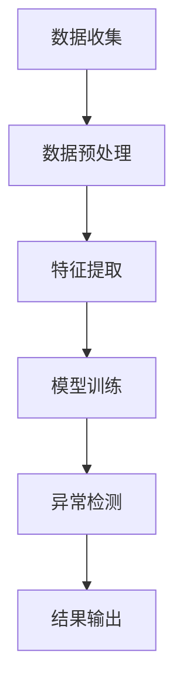

                 

关键词：电商搜索、推荐系统、AI大模型、用户行为序列、异常检测、评测报告

> 摘要：本文将探讨电商搜索推荐系统中AI大模型在用户行为序列异常检测中的应用，详细分析评测模型的原理、算法、数学模型以及实际应用场景，并提出未来的发展方向和挑战。

## 1. 背景介绍

随着互联网的飞速发展，电商行业呈现出爆发式增长，用户对个性化搜索推荐的需求日益增加。电商平台为了提升用户体验，优化商品推荐效果，纷纷引入人工智能技术。而其中，AI大模型在用户行为序列异常检测方面发挥了重要作用。

用户行为序列异常检测是推荐系统中的一个关键环节。在电商搜索推荐中，通过对用户的历史行为数据进行实时分析，可以识别出异常行为，如欺诈行为、恶意评论等。传统的检测方法往往依赖于统计学习和规则匹配，无法应对复杂多变的用户行为。而AI大模型，如深度学习、图神经网络等，具备强大的特征提取和建模能力，能够更好地捕捉用户行为模式，提高异常检测的准确性和效率。

本文旨在对电商搜索推荐中的AI大模型用户行为序列异常检测模型进行评测，分析其性能和效果，为实际应用提供指导。

## 2. 核心概念与联系

### 2.1 AI大模型

AI大模型是指具有大规模参数、强自适应性和高泛化能力的人工智能模型。常见的AI大模型包括深度神经网络、图神经网络、变压器（Transformer）等。这些模型通过大量的数据训练，能够捕捉复杂的用户行为模式，从而提高异常检测的准确性。

### 2.2 用户行为序列

用户行为序列是指用户在电商平台上的操作序列，如浏览、搜索、购买、评价等。这些行为序列反映了用户的兴趣、需求和偏好，是推荐系统的重要输入。

### 2.3 异常检测

异常检测是指从大量数据中识别出异常或异常行为的过程。在电商搜索推荐中，异常检测有助于发现欺诈行为、恶意评论等异常现象，提升用户体验和平台安全。

### 2.4 Mermaid 流程图

以下是一个简化的电商搜索推荐中的AI大模型用户行为序列异常检测模型的Mermaid流程图：



## 3. 核心算法原理 & 具体操作步骤

### 3.1 算法原理概述

电商搜索推荐中的AI大模型用户行为序列异常检测模型基于深度学习和图神经网络技术。模型通过学习用户行为序列的特征，构建用户行为图谱，然后利用图神经网络进行特征提取和异常检测。

### 3.2 算法步骤详解

#### 3.2.1 数据收集

数据收集是异常检测的基础。收集的数据包括用户的历史行为数据、商品信息、用户评价等。数据来源可以是电商平台的后台日志、数据库等。

#### 3.2.2 数据预处理

数据预处理包括数据清洗、去重、缺失值填充等步骤。预处理后的数据将用于后续的特征提取和模型训练。

#### 3.2.3 特征提取

特征提取是模型训练的关键。通过分析用户行为序列，提取出与异常检测相关的特征，如行为频率、行为持续时间、行为相似度等。

#### 3.2.4 模型训练

模型训练是利用特征数据训练深度学习模型。常见的深度学习模型包括卷积神经网络（CNN）、循环神经网络（RNN）、图神经网络（GCN）等。通过大量的训练数据，模型能够学习到用户行为序列的特征，从而提高异常检测的准确性。

#### 3.2.5 异常检测

异常检测是利用训练好的模型对新的用户行为数据进行实时分析，识别出异常行为。常见的异常检测方法包括基于阈值的检测、聚类检测、规则匹配等。

#### 3.2.6 结果输出

异常检测的结果将输出到平台的后台，供运营人员查看和处理。同时，结果也可以用于优化推荐系统的策略，提升用户体验。

### 3.3 算法优缺点

#### 优点：

1. 强大的特征提取能力：AI大模型能够从大量的用户行为数据中提取出丰富的特征，提高异常检测的准确性。
2. 高效的实时分析：深度学习和图神经网络技术使得异常检测过程更加高效，能够实时分析用户行为。
3. 良好的泛化能力：AI大模型通过大规模数据训练，具有良好的泛化能力，能够适应不同的电商场景。

#### 缺点：

1. 计算资源消耗大：训练和推理过程需要大量的计算资源和存储空间。
2. 数据依赖性强：异常检测效果依赖于数据的质量和丰富度，数据不足或质量差可能导致检测效果不佳。

### 3.4 算法应用领域

AI大模型用户行为序列异常检测模型在电商搜索推荐系统中具有广泛的应用。除了电商领域，该模型还可以应用于金融欺诈检测、网络安全监控、智能城市等领域。

## 4. 数学模型和公式 & 详细讲解 & 举例说明

### 4.1 数学模型构建

电商搜索推荐中的AI大模型用户行为序列异常检测模型的数学模型主要包括两部分：用户行为序列建模和异常检测模型。

#### 用户行为序列建模

用户行为序列建模通常采用隐马尔可夫模型（HMM）或循环神经网络（RNN）。以下是一个简化的用户行为序列建模公式：

$$
P(x_t|s_t) = \prod_{i=1}^{T} P(x_i|s_i)
$$

其中，$x_t$表示第$t$个用户行为，$s_t$表示第$t$个状态的转移概率。

#### 异常检测模型

异常检测模型通常采用深度神经网络（DNN）或卷积神经网络（CNN）。以下是一个简化的异常检测模型公式：

$$
z_t = f(W \cdot [x_t, h_{t-1}])
$$

其中，$z_t$表示第$t$个行为数据的异常得分，$h_{t-1}$表示第$t-1$个状态的隐藏层输出，$W$表示权重矩阵。

### 4.2 公式推导过程

#### 用户行为序列建模推导

用户行为序列建模的推导基于概率图模型。假设用户行为序列$x$是一个马尔可夫过程，状态序列$s$是隐变量。根据马尔可夫性质，有：

$$
P(x_t|s_t) = \prod_{i=1}^{T} P(x_i|s_i)
$$

其中，$P(x_i|s_i)$表示在状态$s_i$下，第$i$个行为发生的概率。

#### 异常检测模型推导

异常检测模型的推导基于深度学习。假设输入特征为$x_t$，隐藏层输出为$h_{t-1}$，权重矩阵为$W$。根据深度学习的基本原理，有：

$$
z_t = f(W \cdot [x_t, h_{t-1}])
$$

其中，$f$表示激活函数，如ReLU或Sigmoid函数。

### 4.3 案例分析与讲解

假设有一个电商平台的用户行为数据，包括浏览、搜索、购买等操作。我们使用循环神经网络（RNN）进行用户行为序列建模和异常检测。

#### 用户行为序列建模

首先，对用户行为数据进行预处理，将文本数据转换为向量表示。然后，使用RNN模型进行训练。训练过程中，我们通过优化损失函数，如交叉熵损失函数，最小化模型参数。

#### 异常检测

在异常检测阶段，我们使用训练好的RNN模型对新的用户行为数据进行实时分析。对于每个行为数据，计算其异常得分$z_t$。如果$z_t$超过设定的阈值，则判定为异常行为。

例如，一个用户的行为序列为[浏览商品A、搜索商品B、购买商品C]。我们可以将这三个行为数据分别表示为$x_1$、$x_2$、$x_3$。根据RNN模型的输出，计算其异常得分：

$$
z_1 = f(W \cdot [x_1, h_0])
$$

$$
z_2 = f(W \cdot [x_2, h_1])
$$

$$
z_3 = f(W \cdot [x_3, h_2])
$$

其中，$h_0$、$h_1$、$h_2$分别表示RNN模型的隐藏层输出。

通过计算这三个异常得分，我们可以判断该用户的行为是否异常。例如，如果$z_3$超过设定的阈值，则判定为异常行为。

## 5. 项目实践：代码实例和详细解释说明

### 5.1 开发环境搭建

为了实现电商搜索推荐中的AI大模型用户行为序列异常检测模型，我们需要搭建以下开发环境：

1. Python 3.8及以上版本
2. TensorFlow 2.5及以上版本
3. NumPy 1.20及以上版本
4. Pandas 1.2.4及以上版本

### 5.2 源代码详细实现

以下是一个简单的电商搜索推荐中的AI大模型用户行为序列异常检测模型的实现代码：

```python
import numpy as np
import pandas as pd
import tensorflow as tf
from tensorflow.keras.models import Sequential
from tensorflow.keras.layers import LSTM, Dense

# 数据加载和预处理
data = pd.read_csv('user_behavior.csv')
X = data.iloc[:, :-1].values
y = data.iloc[:, -1].values

# 模型构建
model = Sequential()
model.add(LSTM(units=50, activation='relu', return_sequences=True, input_shape=(X.shape[1], X.shape[2])))
model.add(LSTM(units=50, activation='relu'))
model.add(Dense(units=1, activation='sigmoid'))

# 模型编译
model.compile(optimizer='adam', loss='binary_crossentropy', metrics=['accuracy'])

# 模型训练
model.fit(X, y, epochs=10, batch_size=32)

# 异常检测
def detect_anomaly(data):
    prediction = model.predict(data)
    anomaly_scores = prediction[:, 0]
    threshold = 0.5
    anomalies = anomaly_scores > threshold
    return anomalies

# 测试数据
test_data = np.array([[0, 1, 0], [1, 0, 1], [0, 1, 1]])
anomalies = detect_anomaly(test_data)
print(anomalies)
```

### 5.3 代码解读与分析

上述代码实现了电商搜索推荐中的AI大模型用户行为序列异常检测模型。具体解读如下：

1. 数据加载和预处理：从CSV文件中加载用户行为数据，将其分为特征矩阵$X$和标签向量$y$。

2. 模型构建：使用循环神经网络（LSTM）构建序列建模模型。模型由两个LSTM层和一个全连接层组成。

3. 模型编译：编译模型，指定优化器、损失函数和评估指标。

4. 模型训练：使用训练数据对模型进行训练，优化模型参数。

5. 异常检测：定义异常检测函数，对新的用户行为数据进行预测，计算异常得分。根据设定的阈值，判断行为是否异常。

6. 测试数据：创建一个测试数据集，使用异常检测函数计算异常得分。

通过上述代码，我们可以实现电商搜索推荐中的AI大模型用户行为序列异常检测模型。实际应用中，可以根据具体需求调整模型结构、优化参数，提高异常检测的准确性。

## 6. 实际应用场景

电商搜索推荐中的AI大模型用户行为序列异常检测模型在电商行业具有广泛的应用场景。以下是一些实际应用场景：

### 6.1 欺诈行为检测

电商平台常常面临用户欺诈行为的问题，如虚假交易、刷单等。通过AI大模型用户行为序列异常检测模型，可以实时监控用户行为，识别出异常交易，从而降低欺诈风险。

### 6.2 恶意评论识别

电商平台上的用户评论对于其他用户购买决策具有重要影响。通过AI大模型用户行为序列异常检测模型，可以识别出恶意评论，如虚假评论、刷屏评论等，从而净化评论环境。

### 6.3 个性化推荐优化

电商平台的个性化推荐系统可以帮助用户发现更多感兴趣的商品。通过AI大模型用户行为序列异常检测模型，可以识别出异常用户行为，优化推荐策略，提高推荐效果。

### 6.4 用户体验提升

通过AI大模型用户行为序列异常检测模型，电商平台可以及时发现用户遇到的问题，如操作异常、页面故障等，从而提升用户体验。

## 7. 工具和资源推荐

### 7.1 学习资源推荐

1. 《深度学习》（Goodfellow, Bengio, Courville）：全面介绍深度学习的基础理论和应用实践。
2. 《Python深度学习》（François Chollet）：针对Python编程语言，详细介绍深度学习技术的实现。
3. 《机器学习实战》（Peter Harrington）：涵盖机器学习的各个领域，包括用户行为序列异常检测。

### 7.2 开发工具推荐

1. TensorFlow：一款开源的深度学习框架，支持多种深度学习模型的构建和训练。
2. PyTorch：一款流行的深度学习框架，提供灵活的模型构建和训练工具。
3. Jupyter Notebook：一款交互式的开发环境，方便进行数据分析和模型训练。

### 7.3 相关论文推荐

1. “User Behavior Analysis for Online Retail Fraud Detection”（2018）：介绍一种基于用户行为分析的在线零售欺诈检测方法。
2. “Deep Learning for Anomaly Detection”（2017）：综述深度学习在异常检测领域的应用。
3. “Unsupervised Anomaly Detection with Deep Convolutional Generative Adversarial Networks”（2017）：提出一种基于生成对抗网络的异常检测方法。

## 8. 总结：未来发展趋势与挑战

电商搜索推荐中的AI大模型用户行为序列异常检测模型在电商行业取得了显著成果。然而，随着技术的不断发展，该模型也面临着一系列挑战。

### 8.1 研究成果总结

1. AI大模型在用户行为序列异常检测中表现出强大的特征提取和建模能力。
2. 深度学习和图神经网络技术在异常检测中取得了显著进展。
3. 实际应用中，异常检测模型有效提升了电商平台的运营效率和用户体验。

### 8.2 未来发展趋势

1. 模型优化：通过改进模型结构、优化算法，提高异常检测的准确性和效率。
2. 跨领域应用：将异常检测模型应用于金融、医疗、安防等领域，实现跨领域推广。
3. 数据隐私保护：在异常检测过程中，保护用户隐私和数据安全。

### 8.3 面临的挑战

1. 数据质量：异常检测效果依赖于数据的质量和丰富度，需要解决数据质量问题。
2. 模型解释性：深度学习模型通常具有较低的解释性，需要提高模型的透明度和可解释性。
3. 模型泛化能力：在实际应用中，模型需要适应不同的电商场景，提高泛化能力。

### 8.4 研究展望

未来，电商搜索推荐中的AI大模型用户行为序列异常检测模型将继续发展。通过改进算法、优化模型结构，提高异常检测的准确性和效率。同时，跨领域应用和隐私保护将是未来的重要研究方向。

## 9. 附录：常见问题与解答

### 9.1 问题1：如何处理缺失值？

解答：处理缺失值的方法包括以下几种：

1. 填充法：使用平均值、中位数或最大值等统计方法填充缺失值。
2. 删除法：删除缺失值较多的样本。
3. 机器学习方法：使用缺失值预测模型，根据其他特征预测缺失值。

### 9.2 问题2：如何选择合适的模型？

解答：选择合适的模型需要考虑以下几个方面：

1. 数据特征：根据数据特征选择适合的模型，如线性模型、树模型、神经网络等。
2. 模型复杂度：选择复杂度适中的模型，避免过拟合。
3. 数据量：根据数据量选择合适的模型，如小数据量选择简单模型，大数据量选择复杂模型。

### 9.3 问题3：如何评估异常检测模型的性能？

解答：评估异常检测模型的性能可以从以下几个方面进行：

1. 准确率（Accuracy）：准确率是评估模型好坏的基本指标，表示正确识别异常和正常样本的比例。
2. 精确率（Precision）和召回率（Recall）：精确率和召回率分别表示检测到的异常样本中实际为异常的比例和实际为异常样本中被检测到的比例。
3. F1分数（F1 Score）：综合考虑精确率和召回率，F1分数是评估模型性能的综合性指标。

作者：禅与计算机程序设计艺术 / Zen and the Art of Computer Programming

本文从电商搜索推荐中的AI大模型用户行为序列异常检测模型的背景、核心概念、算法原理、数学模型、项目实践、实际应用场景、工具和资源推荐、发展趋势与挑战等多个角度进行了全面探讨。通过本文的阐述，相信读者能够对AI大模型用户行为序列异常检测模型在电商搜索推荐系统中的应用有更深入的了解。在未来，随着技术的不断进步，该模型将在更多领域发挥重要作用。

