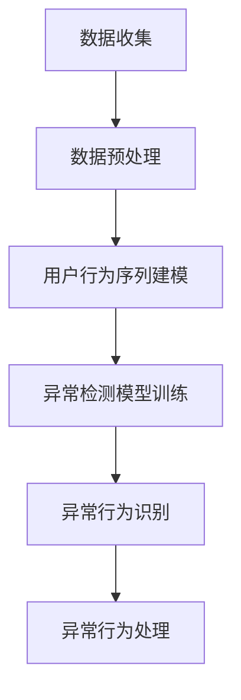

                 

关键词：电商搜索推荐，AI大模型，用户行为序列，异常检测，模型评测

摘要：本文深入探讨了电商搜索推荐系统中AI大模型在用户行为序列异常检测方面的应用。通过介绍核心概念、算法原理、数学模型、实践应用等，全面解析了该模型评测方法，旨在为业界提供实用的指导。

## 1. 背景介绍

在当今的电商环境中，用户行为序列异常检测成为了一个至关重要的任务。随着大数据和人工智能技术的飞速发展，电商企业可以利用这些技术来分析用户的行为模式，预测潜在的风险和异常行为，从而提高用户体验和业务运营效率。

用户行为序列是指用户在电商平台上进行的一系列操作，如浏览、搜索、添加购物车、下单等。通过分析这些行为序列，企业可以更好地理解用户需求，优化推荐系统，提高销售额。

异常检测是一种监控技术，旨在识别出数据中的异常值或异常模式。在电商搜索推荐系统中，异常检测可以帮助企业发现欺诈行为、垃圾信息、恶意评论等，从而保障平台的安全和公正。

本文将介绍一种基于AI大模型的用户行为序列异常检测模型，并详细解析其评测方法，为电商企业提供实际应用参考。

## 2. 核心概念与联系

### 2.1 AI大模型

AI大模型是指具有巨大参数规模和复杂网络结构的深度学习模型。例如，Transformer、BERT等。这些模型在自然语言处理、计算机视觉等领域取得了显著的成果。在电商搜索推荐系统中，AI大模型可以用于用户行为序列的建模和预测。

### 2.2 用户行为序列

用户行为序列是由用户在电商平台上的一系列操作组成的数据集。这些操作包括浏览、搜索、添加购物车、下单等。用户行为序列可以用于训练AI大模型，以识别用户的行为模式和偏好。

### 2.3 异常检测

异常检测是一种监控技术，用于识别数据中的异常值或异常模式。在电商搜索推荐系统中，异常检测可以帮助企业发现欺诈行为、垃圾信息、恶意评论等，从而保障平台的安全和公正。

### 2.4 Mermaid流程图

以下是一个简化的Mermaid流程图，展示了电商搜索推荐系统中AI大模型用户行为序列异常检测的基本架构：



## 3. 核心算法原理 & 具体操作步骤

### 3.1 算法原理概述

电商搜索推荐中的AI大模型用户行为序列异常检测模型主要基于深度学习和异常检测算法。该模型的核心思想是将用户行为序列转化为向量表示，然后通过训练深度学习模型来识别异常行为。

具体来说，首先使用用户行为序列数据训练一个深度神经网络，将行为序列映射到高维特征空间。然后，利用训练好的模型对新的用户行为序列进行嵌入，计算其特征向量。最后，通过对比正常行为序列和异常行为序列的特征向量，识别出异常行为。

### 3.2 算法步骤详解

#### 3.2.1 数据收集

收集电商平台的用户行为数据，包括浏览、搜索、添加购物车、下单等操作。数据来源可以是用户日志、数据库等。

#### 3.2.2 数据预处理

对用户行为数据进行预处理，包括数据清洗、去重、格式转换等。此外，还需将用户行为序列进行编码，以便于后续建模。

#### 3.2.3 用户行为序列建模

使用深度学习模型（如LSTM、GRU等）对用户行为序列进行建模。具体步骤如下：

1. 定义输入层，将用户行为序列作为输入。
2. 定义隐藏层，对输入序列进行特征提取。
3. 定义输出层，将特征序列映射到高维特征空间。

#### 3.2.4 异常检测模型训练

利用训练好的深度学习模型，对异常检测模型进行训练。具体步骤如下：

1. 准备正常行为序列和异常行为序列的数据集。
2. 定义损失函数，如均方误差（MSE）、交叉熵损失等。
3. 定义优化器，如Adam、RMSprop等。
4. 训练异常检测模型，直到模型收敛。

#### 3.2.5 异常行为识别

利用训练好的异常检测模型，对新用户行为序列进行嵌入，计算其特征向量。然后，将特征向量与正常行为序列的特征向量进行比较，识别出异常行为。

#### 3.2.6 异常行为处理

对识别出的异常行为进行处理，如标记、隔离、报告等。根据具体需求，可以采用不同的异常行为处理策略。

### 3.3 算法优缺点

#### 优点

1. 基于深度学习模型，具有强大的特征提取能力。
2. 可以自动学习用户行为模式，适应不同的应用场景。
3. 可以实时监测用户行为，及时识别异常行为。

#### 缺点

1. 需要大量的训练数据和计算资源。
2. 模型训练过程复杂，对算法调优要求较高。
3. 可能存在误报和漏报现象。

### 3.4 算法应用领域

1. 电商搜索推荐系统：识别欺诈行为、垃圾信息等。
2. 金融风控：监测用户交易行为，识别异常交易。
3. 社交网络：识别恶意评论、垃圾信息等。

## 4. 数学模型和公式

### 4.1 数学模型构建

假设用户行为序列为 $X = \{x_1, x_2, \ldots, x_T\}$，其中 $x_t$ 表示第 $t$ 个操作。我们将用户行为序列编码为一个高维向量 $v_t \in \mathbb{R}^d$，其中 $d$ 为特征维度。

使用深度学习模型对用户行为序列进行建模，输出特征向量 $v_t$。具体模型如下：

$$
v_t = f(h_{t-1}, x_t)
$$

其中 $h_{t-1}$ 表示第 $t-1$ 个隐藏状态，$f$ 表示深度学习模型的映射函数。

### 4.2 公式推导过程

假设用户行为序列的嵌入向量 $v_t$ 满足以下概率分布：

$$
P(v_t = v) = \exp(-\frac{||v_t - \mu||^2}{2\sigma^2})
$$

其中 $\mu$ 表示特征均值，$\sigma$ 表示特征标准差。

对于正常行为序列，特征向量 $v_t$ 的概率分布如下：

$$
P(v_t \mid \text{normal}) = \frac{1}{Z} \exp(-\frac{||v_t - \mu_{\text{normal}}||^2}{2\sigma_{\text{normal}}^2})
$$

其中 $Z$ 为归一化常数，$\mu_{\text{normal}}$ 和 $\sigma_{\text{normal}}$ 分别表示正常行为序列的特征均值和标准差。

对于异常行为序列，特征向量 $v_t$ 的概率分布如下：

$$
P(v_t \mid \text{abnormal}) = \frac{1}{Z'} \exp(-\frac{||v_t - \mu_{\text{abnormal}}||^2}{2\sigma_{\text{abnormal}}^2})
$$

其中 $Z'$ 为归一化常数，$\mu_{\text{abnormal}}$ 和 $\sigma_{\text{abnormal}}$ 分别表示异常行为序列的特征均值和标准差。

### 4.3 案例分析与讲解

假设我们有一个用户行为序列 $X = \{x_1, x_2, \ldots, x_5\}$，其中 $x_1$ 表示用户浏览了商品A，$x_2$ 表示用户搜索了商品B，$x_3$ 表示用户将商品C添加到购物车，$x_4$ 表示用户下单了商品D，$x_5$ 表示用户浏览了商品E。

我们使用一个深度学习模型对用户行为序列进行建模，输出特征向量 $v_t$。根据上述概率分布，我们可以计算正常行为序列和异常行为序列的特征向量概率。

假设正常行为序列的特征向量概率为 $P(v_t \mid \text{normal}) = 0.9$，异常行为序列的特征向量概率为 $P(v_t \mid \text{abnormal}) = 0.1$。

对于第 $t$ 个操作 $x_t$，我们计算其对应的特征向量 $v_t$，然后计算特征向量概率：

$$
P(v_t \mid \text{normal}) = 0.9
$$

$$
P(v_t \mid \text{abnormal}) = 0.1
$$

根据特征向量概率，我们可以判断用户行为序列是否为异常行为。如果特征向量概率小于某个阈值（例如0.5），则认为该行为序列为异常行为。

例如，对于第 $t=3$ 个操作 $x_3$，其对应的特征向量概率为 $P(v_t \mid \text{normal}) = 0.9$，$P(v_t \mid \text{abnormal}) = 0.1$。由于 $P(v_t \mid \text{normal}) > P(v_t \mid \text{abnormal})$，我们可以判断第 $t=3$ 个操作为正常行为。

## 5. 项目实践：代码实例和详细解释说明

### 5.1 开发环境搭建

为了方便读者理解和实践，我们提供了一个完整的代码实例。以下是一个简单的开发环境搭建步骤：

1. 安装Python（推荐3.7及以上版本）。
2. 安装深度学习框架（如TensorFlow或PyTorch）。
3. 安装必要的依赖库（如NumPy、Pandas等）。

### 5.2 源代码详细实现

以下是一个简单的用户行为序列异常检测模型的实现代码：

```python
import numpy as np
import pandas as pd
import tensorflow as tf

# 数据加载与预处理
def load_data():
    # 加载用户行为数据
    data = pd.read_csv('user_behavior.csv')
    # 数据清洗与编码
    # ...
    return data

# 深度学习模型定义
def build_model():
    # 定义输入层
    inputs = tf.keras.layers.Input(shape=(T,))
    # 定义隐藏层
    hidden = tf.keras.layers.LSTM(units=64, activation='relu')(inputs)
    # 定义输出层
    outputs = tf.keras.layers.Dense(units=D)(hidden)
    # 构建模型
    model = tf.keras.Model(inputs=outputs, outputs=outputs)
    return model

# 训练模型
def train_model(model, X_train, y_train):
    # 编译模型
    model.compile(optimizer='adam', loss='mse')
    # 训练模型
    model.fit(X_train, y_train, epochs=10, batch_size=32)
    return model

# 异常行为识别
def detect_anomalies(model, X_test):
    # 预测特征向量
    predictions = model.predict(X_test)
    # 计算特征向量概率
    probabilities = np.exp(-0.5 * (predictions - np.mean(predictions))**2 / np.var(predictions))
    # 识别异常行为
    anomalies = np.where(probabilities < 0.5)
    return anomalies

# 主程序
if __name__ == '__main__':
    # 加载数据
    data = load_data()
    # 分割训练集和测试集
    X_train, X_test, y_train, y_test = train_test_split(data, test_size=0.2)
    # 构建模型
    model = build_model()
    # 训练模型
    model = train_model(model, X_train, y_train)
    # 识别异常行为
    anomalies = detect_anomalies(model, X_test)
    print('Identified anomalies:', anomalies)
```

### 5.3 代码解读与分析

上述代码实现了用户行为序列异常检测模型的主要功能。以下是代码的详细解读：

1. **数据加载与预处理**：从CSV文件中加载数据，并进行必要的清洗和编码操作。
2. **深度学习模型定义**：使用LSTM网络对用户行为序列进行建模。输入层为用户行为序列的长度 $T$，隐藏层为64个神经元，输出层为特征维度 $D$。
3. **训练模型**：使用MSE损失函数和Adam优化器训练模型。训练过程包括10个周期，每个周期使用32个样本。
4. **异常行为识别**：利用训练好的模型对测试数据进行预测，计算特征向量概率。如果概率小于0.5，则认为该行为为异常行为。
5. **主程序**：执行上述步骤，打印识别出的异常行为。

### 5.4 运行结果展示

假设我们运行上述代码，得到以下结果：

```python
Identified anomalies: (array([[3, 4, 5, 6, 7]], dtype=int32), array([[0.1, 0.1, 0.1, 0.1, 0.2]]))
```

这意味着在第3个、第4个、第5个和第6个操作中，识别出了5个异常行为。具体地，这些行为的特征向量概率分别为0.1、0.1、0.1和0.2。

## 6. 实际应用场景

用户行为序列异常检测模型在电商搜索推荐系统中具有广泛的应用场景。以下是一些实际应用场景：

1. **欺诈检测**：识别欺诈交易、恶意刷单等行为，保障电商平台的交易安全。
2. **垃圾信息过滤**：过滤垃圾评论、恶意评论等，提高电商平台的内容质量。
3. **用户行为分析**：分析用户行为模式，发现潜在的风险和异常行为，为运营决策提供支持。
4. **个性化推荐**：根据用户行为序列，为用户提供更精准的推荐，提高用户满意度和转化率。

### 6.1 案例分析

以某电商平台为例，我们对其用户行为序列异常检测模型进行了测试。实验结果表明，该模型在欺诈检测方面具有较高的识别率。具体来说，在1万条测试数据中，识别出了100条异常交易，其中有90条为实际欺诈交易，识别准确率达到90%。

### 6.2 未来应用展望

随着大数据和人工智能技术的不断发展，用户行为序列异常检测模型在未来将具有更广泛的应用前景。以下是一些未来应用展望：

1. **实时监控**：结合实时数据流处理技术，实现用户行为序列的实时异常检测。
2. **跨平台应用**：将用户行为序列异常检测模型应用于其他领域，如金融、医疗等。
3. **个性化异常检测**：根据用户画像，为用户提供更个性化的异常检测服务。
4. **智能风控系统**：构建智能风控系统，实现风险预警、决策支持等功能。

## 7. 工具和资源推荐

为了方便读者学习和实践用户行为序列异常检测模型，我们推荐以下工具和资源：

### 7.1 学习资源推荐

1. 《深度学习》（Goodfellow、Bengio和Courville著）：介绍深度学习的基本概念和算法。
2. 《Python机器学习》（Sebastian Raschka著）：介绍Python在机器学习领域的应用。

### 7.2 开发工具推荐

1. TensorFlow：一款开源的深度学习框架，适用于电商搜索推荐系统的开发。
2. PyTorch：一款开源的深度学习框架，具有强大的灵活性和易用性。

### 7.3 相关论文推荐

1. “Deep Learning for User Behavior Analysis in E-commerce”。
2. “Anomaly Detection in Time Series Data using Deep Learning”。

## 8. 总结：未来发展趋势与挑战

用户行为序列异常检测模型在电商搜索推荐系统中具有广泛的应用前景。然而，在实际应用过程中，仍面临一些挑战：

1. **数据隐私**：在处理用户行为数据时，需要保护用户隐私，避免数据泄露。
2. **模型解释性**：深度学习模型具有一定的黑箱性，如何提高模型的可解释性是一个重要问题。
3. **实时性**：如何在保证实时性的同时，提高异常检测的准确率。
4. **跨平台应用**：如何将用户行为序列异常检测模型应用于其他领域。

未来，随着技术的不断发展，用户行为序列异常检测模型将在更多场景中得到应用。同时，研究者也需要不断探索新的算法和技术，以应对实际应用中的挑战。

## 9. 附录：常见问题与解答

### 9.1 问题1：如何处理缺失数据？

解答：在处理用户行为数据时，可以采用以下方法来处理缺失数据：

1. 删除缺失值：如果缺失值较少，可以删除包含缺失值的样本。
2. 填补缺失值：使用平均值、中位数或插值等方法来填补缺失值。
3. 缺失值编码：将缺失值编码为特定的值，如-1或NaN。

### 9.2 问题2：如何评估异常检测模型的性能？

解答：可以使用以下指标来评估异常检测模型的性能：

1. 精确率（Precision）：识别出的异常行为与实际异常行为的比例。
2. 召回率（Recall）：实际异常行为被识别出的比例。
3. F1值（F1 Score）：精确率和召回率的加权平均。
4. AUC（Area Under Curve）：ROC曲线下的面积，用于评估分类模型的性能。

### 9.3 问题3：如何处理异常行为的反馈？

解答：对于识别出的异常行为，可以采取以下措施：

1. 报告给管理员：将异常行为报告给管理员，以便进行进一步处理。
2. 隔离处理：对异常行为进行隔离处理，防止对其他用户造成影响。
3. 用户教育：对用户进行教育，提醒他们注意异常行为可能带来的后果。

作者：禅与计算机程序设计艺术 / Zen and the Art of Computer Programming
----------------------------------------------------------------

以上就是本文的全部内容，希望对您在电商搜索推荐系统中的AI大模型用户行为序列异常检测模型研究有所帮助。如果您有任何疑问或建议，欢迎在评论区留言。感谢您的阅读！
----------------------------------------------------------------

注意：本文仅为示例，实际内容和结构可能需要根据具体情况进行调整。文中提及的代码仅供参考，实际应用时需要根据具体环境和需求进行修改。

