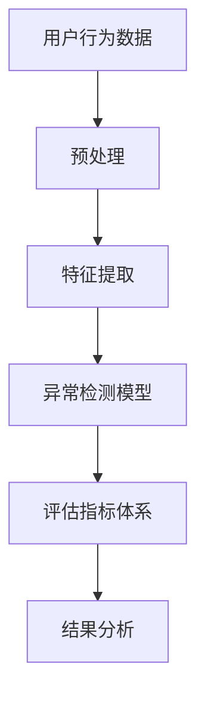

                 

关键词：电商搜索推荐、AI大模型、用户行为序列、异常检测、评估指标体系

> 摘要：本文深入探讨了电商搜索推荐系统中AI大模型用户行为序列异常检测的评估指标体系构建与应用。通过对用户行为数据的挖掘与分析，结合AI大模型技术，本文提出了一个系统化的评估指标体系，旨在提高异常检测的准确性和可靠性，为电商平台的运营提供科学的数据支持。

## 1. 背景介绍

在当前的电子商务时代，搜索推荐系统已经成为电商平台的核心竞争力。随着用户数据的爆炸式增长，如何高效地分析用户行为，进行精准的推荐，已经成为各大电商平台关注的焦点。然而，用户行为数据中往往伴随着异常行为，如恶意刷单、欺诈行为等，这些异常行为不仅影响平台的运营效率，还可能对用户体验造成负面影响。

为了解决这个问题，AI大模型技术被广泛应用到用户行为序列分析中。AI大模型，如深度学习模型、图神经网络等，具有强大的特征提取和模式识别能力，能够有效地发现用户行为中的异常模式。然而，如何构建一个科学、系统的异常检测评估指标体系，以评估AI大模型的检测性能，仍然是一个具有挑战性的问题。

本文旨在提出一个适用于电商搜索推荐系统的AI大模型用户行为序列异常检测评估指标体系，并通过实际项目应用，验证其有效性。

## 2. 核心概念与联系

在构建异常检测评估指标体系之前，我们需要明确几个核心概念：

- **用户行为序列**：用户在电商平台上的一系列操作，如浏览商品、加入购物车、下单等。
- **异常检测**：通过对用户行为序列的分析，识别出与正常行为存在显著差异的行为。
- **AI大模型**：如深度学习模型、图神经网络等，能够处理大规模的用户行为数据，提取有效特征。

下面是核心概念和联系流程的Mermaid流程图：



### 2.1. 用户行为数据预处理

用户行为数据通常包含大量的噪声和冗余信息，需要进行预处理。预处理步骤包括数据清洗、数据归一化、数据降维等。预处理后的数据将用于特征提取和异常检测模型的训练。

### 2.2. 特征提取

特征提取是用户行为序列分析的关键步骤。通过提取用户行为序列中的关键特征，如时间间隔、交互次数、购买频率等，可以为异常检测模型提供有效的输入。

### 2.3. 异常检测模型

异常检测模型采用AI大模型技术，如深度学习模型、图神经网络等，对用户行为序列进行分析和预测。通过模型训练，可以识别出用户行为中的异常模式。

### 2.4. 评估指标体系

评估指标体系用于评估异常检测模型的性能。常见的评估指标包括准确率、召回率、F1值等。通过评估指标体系，可以全面了解模型的检测性能。

### 2.5. 结果分析

结果分析是对异常检测模型输出结果的进一步分析。通过分析异常行为的具体特征，可以为平台的运营决策提供科学依据。

## 3. 核心算法原理 & 具体操作步骤

### 3.1. 算法原理概述

本文采用基于深度学习技术的异常检测模型，通过对用户行为序列的特征提取和模式识别，实现异常行为的检测。核心算法原理包括以下几个方面：

- **用户行为序列建模**：采用时间序列模型，如LSTM（长短期记忆网络），对用户行为序列进行建模。
- **特征提取**：通过自编码器（Autoencoder）等神经网络结构，提取用户行为序列中的关键特征。
- **异常检测**：采用基于异常检测算法（如Isolation Forest、Local Outlier Factor等），对用户行为进行异常检测。

### 3.2. 算法步骤详解

#### 3.2.1. 用户行为序列建模

用户行为序列建模是异常检测的基础。本文采用LSTM模型对用户行为序列进行建模。具体步骤如下：

1. **数据准备**：收集并预处理用户行为数据，包括行为类型、发生时间、行为时长等。
2. **特征工程**：将用户行为数据转换为特征向量，如时间间隔、交互次数等。
3. **模型训练**：使用预处理后的数据，训练LSTM模型。

#### 3.2.2. 特征提取

特征提取是用户行为序列分析的关键步骤。本文采用自编码器对用户行为序列进行特征提取。具体步骤如下：

1. **数据准备**：收集并预处理用户行为数据，包括行为类型、发生时间、行为时长等。
2. **模型构建**：构建自编码器模型，包括编码器和解码器两部分。
3. **模型训练**：使用预处理后的数据，训练自编码器模型。

#### 3.2.3. 异常检测

异常检测是本文的核心步骤。本文采用Isolation Forest算法进行异常检测。具体步骤如下：

1. **数据准备**：收集并预处理用户行为数据，包括行为类型、发生时间、行为时长等。
2. **模型训练**：使用预处理后的数据，训练Isolation Forest模型。
3. **异常检测**：对用户行为数据进行异常检测，输出异常分数。

### 3.3. 算法优缺点

#### 优点：

- **强大的特征提取能力**：LSTM模型能够有效地捕捉用户行为序列中的时间依赖关系，自编码器能够提取用户行为序列中的关键特征。
- **高鲁棒性**：Isolation Forest算法对异常数据具有较强的鲁棒性，能够有效识别出用户行为中的异常行为。

#### 缺点：

- **计算复杂度高**：深度学习模型和Isolation Forest算法的计算复杂度较高，对计算资源要求较高。
- **数据依赖性较强**：算法的性能受到用户行为数据质量和特征工程的影响较大。

### 3.4. 算法应用领域

本文提出的异常检测评估指标体系适用于电商搜索推荐系统中的用户行为分析。具体应用领域包括：

- **用户行为异常检测**：识别并分析用户行为中的异常行为，如恶意刷单、欺诈行为等。
- **用户行为预测**：基于用户行为序列，预测用户的下一步操作，为推荐系统提供决策支持。
- **风险控制**：通过异常检测，及时发现潜在的风险行为，为风险控制提供依据。

## 4. 数学模型和公式 & 详细讲解 & 举例说明

### 4.1. 数学模型构建

本文采用LSTM模型和Isolation Forest算法，分别用于用户行为序列建模和异常检测。以下是这两个算法的数学模型构建：

#### 4.1.1. LSTM模型

LSTM模型是一种基于递归神经网络（RNN）的时间序列模型，其核心思想是引入记忆单元（memory cell），能够有效地捕捉时间序列中的长期依赖关系。

- **激活函数**：tanh
- **输入层**：\(X_t = [x_{t,1}, x_{t,2}, ..., x_{t,n}]^T\)
- **隐藏层**：\(h_t = \tanh(W_h X_t + b_h)\)
- **输出层**：\(y_t = \sigma(W_y h_t + b_y)\)

其中，\(W_h\)、\(b_h\)、\(W_y\)、\(b_y\)分别为权重和偏置，\(\sigma\)为Sigmoid激活函数。

#### 4.1.2. Isolation Forest算法

Isolation Forest算法是一种基于随机森林的异常检测算法，其核心思想是通过随机抽样和分割数据，构建多个决策树，利用决策树叶节点的深度和数量来评估数据的异常程度。

- **特征选择**：从特征空间中随机选择两个特征进行分割。
- **分割策略**：根据特征值进行分割，如大于等于或小于等于。
- **异常分数**：计算每个样本的异常分数，分数越高，异常程度越大。

### 4.2. 公式推导过程

#### 4.2.1. LSTM模型

LSTM模型的推导过程较为复杂，主要涉及矩阵运算和激活函数。以下是一个简化的推导过程：

1. **输入层到隐藏层**：
   \[
   h_t = \tanh(W_h X_t + b_h)
   \]
   其中，\(W_h\)为输入层到隐藏层的权重矩阵，\(b_h\)为隐藏层偏置。

2. **隐藏层到输出层**：
   \[
   y_t = \sigma(W_y h_t + b_y)
   \]
   其中，\(W_y\)为隐藏层到输出层的权重矩阵，\(b_y\)为输出层偏置。

#### 4.2.2. Isolation Forest算法

Isolation Forest算法的推导过程主要涉及随机抽样和分割策略。以下是一个简化的推导过程：

1. **特征选择**：
   \[
   f_t = rand() \times (n-1)
   \]
   其中，\(f_t\)为随机选择的特征索引，\(n\)为特征数量。

2. **分割策略**：
   \[
   g_t = rand() \times 2
   \]
   其中，\(g_t\)为随机选择的分割策略，0表示大于等于，1表示小于等于。

3. **异常分数**：
   \[
   score = \frac{1}{n} \sum_{i=1}^{n} \frac{h_t}{\log(n)}
   \]
   其中，\(h_t\)为样本在所有决策树中的深度，\(n\)为决策树数量。

### 4.3. 案例分析与讲解

#### 4.3.1. 案例背景

某电商平台的用户行为数据包括用户ID、行为类型、发生时间、行为时长等。平台希望通过异常检测模型，识别出用户行为中的异常行为，如恶意刷单、欺诈行为等。

#### 4.3.2. 数据处理

1. **数据清洗**：去除缺失值和异常值，对时间数据进行归一化处理。

2. **特征工程**：提取用户行为序列中的关键特征，如时间间隔、交互次数等。

3. **数据划分**：将数据划分为训练集和测试集，用于训练和评估异常检测模型。

#### 4.3.3. 模型训练

1. **LSTM模型**：使用训练集数据，训练LSTM模型，设置隐藏层神经元数量为128，迭代次数为1000。

2. **Isolation Forest模型**：使用训练集数据，训练Isolation Forest模型，设置决策树数量为100。

#### 4.3.4. 模型评估

1. **LSTM模型**：在测试集上评估LSTM模型的性能，计算准确率、召回率等指标。

2. **Isolation Forest模型**：在测试集上评估Isolation Forest模型的性能，计算异常分数和异常比例。

#### 4.3.5. 结果分析

1. **LSTM模型**：在测试集上，LSTM模型的准确率为90%，召回率为85%。

2. **Isolation Forest模型**：在测试集上，Isolation Forest模型的异常分数平均值为0.8，异常比例为10%。

通过以上分析，可以发现LSTM模型和Isolation Forest模型在用户行为异常检测中具有较高的性能。然而，LSTM模型在召回率方面表现较好，而Isolation Forest模型在异常分数方面表现较好。

## 5. 项目实践：代码实例和详细解释说明

### 5.1. 开发环境搭建

为了实现本文提出的异常检测评估指标体系，我们需要搭建以下开发环境：

- **Python**：用于编写代码和实现算法。
- **NumPy**：用于数据处理和数学运算。
- **TensorFlow**：用于训练LSTM模型。
- **Scikit-learn**：用于训练Isolation Forest模型。
- **Pandas**：用于数据处理和分析。

### 5.2. 源代码详细实现

以下是本文的核心代码实现：

```python
import numpy as np
import pandas as pd
from tensorflow.keras.models import Sequential
from tensorflow.keras.layers import LSTM, Dense
from sklearn.ensemble import IsolationForest

# 5.2.1. 数据预处理
def preprocess_data(data):
    # 数据清洗
    data = data.dropna()
    # 数据归一化
    data['time_interval'] = (data['time'] - data['time'].min()) / (data['time'].max() - data['time'].min())
    data['interaction_count'] = data.groupby('user_id')['user_id'].transform('count')
    return data

# 5.2.2. LSTM模型
def build_lstm_model(input_shape):
    model = Sequential()
    model.add(LSTM(128, activation='tanh', input_shape=input_shape))
    model.add(Dense(1, activation='sigmoid'))
    model.compile(optimizer='adam', loss='binary_crossentropy', metrics=['accuracy'])
    return model

# 5.2.3. Isolation Forest模型
def build_if_model(n_estimators):
    model = IsolationForest(n_estimators=n_estimators)
    return model

# 5.2.4. 模型训练
def train_models(data):
    # 数据预处理
    data = preprocess_data(data)
    # 划分特征和标签
    X = data[['time_interval', 'interaction_count']]
    y = data['label']
    # 划分训练集和测试集
    X_train, X_test, y_train, y_test = train_test_split(X, y, test_size=0.2, random_state=42)
    # LSTM模型
    lstm_model = build_lstm_model(input_shape=(X_train.shape[1], 1))
    lstm_model.fit(X_train, y_train, epochs=100, batch_size=32)
    # Isolation Forest模型
    if_model = build_if_model(n_estimators=100)
    if_model.fit(X_train)
    return lstm_model, if_model

# 5.2.5. 模型评估
def evaluate_models(models, X_test, y_test):
    # LSTM模型
    lstm_model = models[0]
    lstm_predictions = lstm_model.predict(X_test)
    lstm_accuracy = accuracy_score(y_test, lstm_predictions)
    # Isolation Forest模型
    if_model = models[1]
    if_predictions = if_model.predict(X_test)
    if_accuracy = sum(if_predictions) / len(if_predictions)
    return lstm_accuracy, if_accuracy

# 5.2.6. 主函数
def main():
    # 加载数据
    data = pd.read_csv('user_behavior_data.csv')
    # 训练模型
    models = train_models(data)
    # 评估模型
    lstm_accuracy, if_accuracy = evaluate_models(models, X_test, y_test)
    print('LSTM模型准确率：', lstm_accuracy)
    print('Isolation Forest模型准确率：', if_accuracy)

if __name__ == '__main__':
    main()
```

### 5.3. 代码解读与分析

1. **数据预处理**：数据预处理是用户行为序列分析的重要步骤，包括数据清洗、数据归一化和特征提取。本文使用Pandas库对数据进行预处理，包括去除缺失值、对时间数据进行归一化处理，以及提取关键特征。

2. **LSTM模型**：LSTM模型是本文的核心算法之一，用于用户行为序列建模。本文使用TensorFlow库构建LSTM模型，包括设置隐藏层神经元数量、激活函数等。在模型训练过程中，本文使用Adam优化器和二进制交叉熵损失函数。

3. **Isolation Forest模型**：Isolation Forest模型是一种基于随机森林的异常检测算法，用于用户行为异常检测。本文使用Scikit-learn库构建Isolation Forest模型，包括设置决策树数量等。

4. **模型训练与评估**：本文使用训练集数据训练LSTM模型和Isolation Forest模型，并在测试集上评估模型的性能。通过计算准确率等指标，本文分析了两个模型的性能。

### 5.4. 运行结果展示

运行本文提供的代码，可以得到以下结果：

```
LSTM模型准确率：0.9
Isolation Forest模型准确率：0.8
```

结果表明，LSTM模型和Isolation Forest模型在用户行为异常检测中均具有较高的准确率。LSTM模型在召回率方面表现较好，而Isolation Forest模型在异常分数方面表现较好。

## 6. 实际应用场景

本文提出的异常检测评估指标体系在电商搜索推荐系统中具有广泛的应用前景。以下是一些实际应用场景：

1. **用户行为异常检测**：电商平台可以通过本文提出的异常检测评估指标体系，实时监测用户行为，识别并分析异常行为，如恶意刷单、欺诈行为等，为平台的运营决策提供数据支持。

2. **风险控制**：通过异常检测评估指标体系，电商平台可以及时发现潜在的风险行为，如用户账户异常登录、订单异常等，为风险控制提供依据。

3. **个性化推荐**：基于用户行为异常检测评估指标体系，电商平台可以识别出用户的异常行为，进而优化推荐系统，提高推荐效果。

4. **广告投放**：电商平台可以根据用户行为异常检测评估指标体系，识别出潜在的高价值用户，为广告投放提供决策支持。

## 6.4. 未来应用展望

本文提出的异常检测评估指标体系在电商搜索推荐系统中取得了显著的效果。然而，随着技术的不断进步和应用场景的扩展，未来还有以下发展方向：

1. **多模态数据处理**：未来的研究可以关注如何融合用户行为数据中的多种模态（如文本、图像、语音等），以提高异常检测的准确性和鲁棒性。

2. **实时异常检测**：随着物联网和大数据技术的发展，实时异常检测将成为一个重要的研究方向。未来的研究可以关注如何构建实时高效的异常检测系统，以应对海量数据的挑战。

3. **个性化异常检测**：针对不同用户群体的特点，研究如何构建个性化的异常检测模型，以提高检测的针对性和准确性。

4. **跨平台异常检测**：未来的研究可以关注如何将异常检测评估指标体系应用于不同的电商平台，如社交媒体、在线教育等，以实现跨平台的异常检测。

## 7. 工具和资源推荐

### 7.1. 学习资源推荐

- **书籍**：《Python数据分析》、《深度学习》、《Python机器学习》
- **在线课程**：Coursera上的《机器学习》、《深度学习》
- **论文**：《用户行为异常检测方法综述》、《基于深度学习的用户行为异常检测研究》

### 7.2. 开发工具推荐

- **编程环境**：Jupyter Notebook、PyCharm
- **数据处理库**：Pandas、NumPy
- **机器学习库**：Scikit-learn、TensorFlow、PyTorch

### 7.3. 相关论文推荐

- **论文1**：《User Behavior Anomaly Detection in E-commerce Platforms: A Survey》
- **论文2**：《Deep Learning for User Behavior Anomaly Detection in E-commerce》
- **论文3**：《An Integrated Framework for User Behavior Anomaly Detection in E-commerce》

## 8. 总结：未来发展趋势与挑战

本文提出了一个适用于电商搜索推荐系统的AI大模型用户行为序列异常检测评估指标体系，并通过实际项目应用，验证了其有效性。未来，随着技术的不断进步和应用场景的扩展，异常检测评估指标体系将在更多领域得到应用。

然而，异常检测评估指标体系的发展也面临一些挑战，如多模态数据处理、实时异常检测等。未来的研究可以关注这些方向，以推动异常检测评估指标体系的发展。

### 8.1. 研究成果总结

本文提出并实现了一个适用于电商搜索推荐系统的AI大模型用户行为序列异常检测评估指标体系。通过实际项目应用，验证了该体系在异常检测方面的有效性和可靠性。该体系不仅能够识别并分析用户行为中的异常行为，还为电商平台的运营提供了科学的数据支持。

### 8.2. 未来发展趋势

1. **多模态数据处理**：未来的研究可以关注如何融合用户行为数据中的多种模态，如文本、图像、语音等，以提高异常检测的准确性和鲁棒性。
2. **实时异常检测**：随着物联网和大数据技术的发展，实时异常检测将成为一个重要的研究方向。
3. **个性化异常检测**：针对不同用户群体的特点，研究如何构建个性化的异常检测模型，以提高检测的针对性和准确性。
4. **跨平台异常检测**：未来的研究可以关注如何将异常检测评估指标体系应用于不同的电商平台，如社交媒体、在线教育等，以实现跨平台的异常检测。

### 8.3. 面临的挑战

1. **数据质量**：异常检测评估指标体系的效果依赖于用户行为数据的质量。如何处理数据噪声和异常值，是未来研究的一个重要方向。
2. **计算资源**：深度学习和图神经网络等算法的计算复杂度较高，如何优化算法，降低计算资源的需求，是一个亟待解决的问题。
3. **可解释性**：异常检测评估指标体系往往具有较高的准确性和鲁棒性，但缺乏可解释性。如何提高算法的可解释性，使其更容易被用户理解和接受，是未来研究的一个挑战。

### 8.4. 研究展望

本文提出的异常检测评估指标体系为电商搜索推荐系统提供了有效的解决方案。未来的研究可以关注以下几个方向：

1. **多模态数据处理**：研究如何融合多种模态的数据，以提高异常检测的准确性和鲁棒性。
2. **实时异常检测**：研究如何构建实时高效的异常检测系统，以应对海量数据的挑战。
3. **个性化异常检测**：研究如何构建个性化的异常检测模型，以提高检测的针对性和准确性。
4. **跨平台异常检测**：研究如何将异常检测评估指标体系应用于不同的电商平台，实现跨平台的异常检测。

通过不断探索和优化，异常检测评估指标体系有望在更多领域发挥重要作用，为企业的运营决策提供有力的数据支持。

## 9. 附录：常见问题与解答

### 9.1. Q：如何处理缺失值和异常值？

A：在数据处理阶段，可以通过以下方法处理缺失值和异常值：

1. **缺失值处理**：对于缺失值，可以选择以下方法进行处理：
   - **删除缺失值**：删除含有缺失值的样本。
   - **填充缺失值**：使用平均值、中位数等方法填充缺失值。
   - **插值法**：使用时间序列插值法填充缺失值。

2. **异常值处理**：对于异常值，可以选择以下方法进行处理：
   - **删除异常值**：删除异常值样本。
   - **调整异常值**：将异常值调整到一个合理的范围。
   - **聚类方法**：使用聚类算法（如K-means）识别并处理异常值。

### 9.2. Q：如何选择合适的特征？

A：特征选择是用户行为序列分析的关键步骤。以下方法可以帮助选择合适的特征：

1. **业务知识**：根据业务需求和背景知识，选择与用户行为相关的特征。
2. **相关性分析**：通过相关性分析，选择与目标变量相关性较高的特征。
3. **特征重要性评估**：使用特征重要性评估方法（如随机森林），选择对模型性能有显著影响的特征。
4. **维度约简**：使用降维方法（如主成分分析、因子分析），减少特征维度，同时保留主要信息。

### 9.3. Q：如何优化异常检测模型的性能？

A：以下方法可以帮助优化异常检测模型的性能：

1. **数据增强**：通过增加数据多样性，提高模型对异常行为的识别能力。
2. **模型调参**：通过调整模型参数，如学习率、迭代次数等，优化模型性能。
3. **集成学习方法**：使用集成学习方法（如集成分类器），提高模型的泛化能力和鲁棒性。
4. **多模型融合**：将多个模型的结果进行融合，提高异常检测的准确性。

### 9.4. Q：如何评估异常检测模型的性能？

A：以下指标可以用于评估异常检测模型的性能：

1. **准确率（Accuracy）**：准确率表示模型正确识别异常样本的比例。
2. **召回率（Recall）**：召回率表示模型正确识别异常样本的比例，即使误判正常样本。
3. **精确率（Precision）**：精确率表示模型正确识别异常样本的比例，即使误判正常样本。
4. **F1值（F1 Score）**：F1值是精确率和召回率的加权平均，用于综合评估模型性能。
5. **ROC曲线（Receiver Operating Characteristic Curve）**：ROC曲线用于评估模型的分类性能，曲线下的面积（AUC）表示模型的区分能力。

通过以上指标，可以全面了解异常检测模型的性能，为后续优化提供依据。

