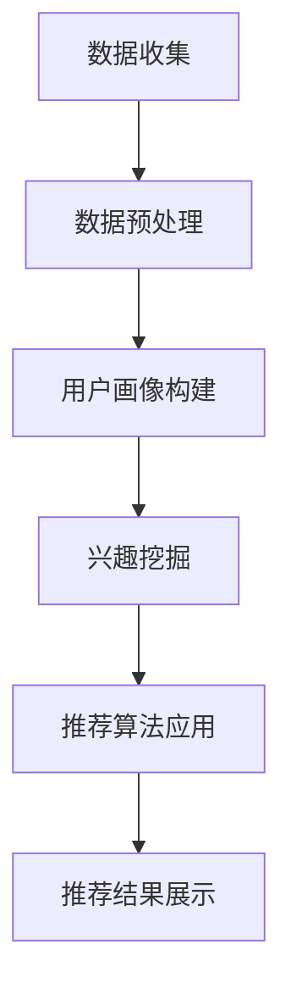

                 

  
## 关键词

AI 大模型、用户行为建模、电商搜索推荐、深度学习、神经网络、数据挖掘、机器学习、自然语言处理、推荐算法、用户兴趣挖掘、个性化推荐

## 摘要

本文旨在探讨电商搜索推荐系统中的 AI 大模型用户行为建模技术。通过对用户行为的深度分析，电商企业能够实现精准的个性化推荐，提升用户满意度和转化率。文章首先介绍了电商搜索推荐系统的背景和重要性，然后详细阐述了用户行为建模的核心概念、算法原理、数学模型、项目实践以及实际应用场景。最后，本文提出了未来应用展望和面临的挑战，为电商企业优化推荐系统提供了有益的参考。

## 1. 背景介绍

### 1.1 电商搜索推荐系统概述

电商搜索推荐系统是电子商务领域的一项关键技术，它通过分析用户的搜索历史、购买记录、浏览行为等数据，预测用户的兴趣和需求，并提供个性化的商品推荐。这种系统能够显著提高用户的购物体验，减少浏览和购买决策的时间，增加销售额。

### 1.2 电商搜索推荐系统的结构

电商搜索推荐系统通常包括三个主要部分：用户行为收集、推荐算法和推荐结果展示。用户行为收集模块负责收集用户的各项行为数据，包括搜索关键词、浏览历史、购买记录等。推荐算法模块负责基于用户行为数据，利用机器学习算法生成个性化的推荐结果。推荐结果展示模块则将推荐结果以直观的方式呈现给用户。

### 1.3 电商搜索推荐系统的重要性

电商搜索推荐系统在电子商务中的重要性不言而喻。首先，它能有效提高用户的满意度和忠诚度，通过提供个性化的商品推荐，满足用户的个性化需求。其次，它能显著提升电商平台的销售额和转化率，增加企业的收益。此外，推荐系统还能帮助企业更好地了解用户需求，优化产品和服务，提高市场竞争力。

## 2. 核心概念与联系

### 2.1 用户行为建模的核心概念

用户行为建模是电商搜索推荐系统的核心，它包括以下几个关键概念：

1. **用户画像**：通过对用户的基本信息、购买历史、浏览行为等数据进行综合分析，构建出一个关于用户特征的完整视图。
2. **兴趣挖掘**：从用户行为数据中挖掘出用户的兴趣点，为个性化推荐提供基础。
3. **行为预测**：根据用户的历史行为数据，预测用户未来的行为和兴趣，从而提供更准确的推荐。
4. **协同过滤**：一种基于用户行为数据的推荐算法，通过分析用户之间的相似性，为用户提供相似用户的推荐。
5. **内容推荐**：通过分析商品的特征和用户的兴趣，为用户提供与兴趣相关的商品推荐。

### 2.2 用户行为建模与电商搜索推荐的关系

用户行为建模与电商搜索推荐系统密切相关。通过用户行为建模，系统能够更准确地理解用户的需求和兴趣，从而提供个性化的推荐。具体来说，用户行为建模包括以下几个步骤：

1. **数据收集**：收集用户的搜索关键词、浏览历史、购买记录等数据。
2. **数据预处理**：对收集到的数据进行分析和清洗，去除噪声数据，提取有用的信息。
3. **用户画像构建**：根据用户的行为数据，构建用户的画像，包括用户的基本信息、兴趣标签、行为模式等。
4. **兴趣挖掘**：从用户画像中挖掘出用户的兴趣点，为推荐算法提供输入。
5. **推荐算法应用**：利用机器学习算法，根据用户画像和兴趣点，生成个性化的推荐结果。

### 2.3 Mermaid 流程图

下面是一个简单的 Mermaid 流程图，展示了用户行为建模的基本流程。



## 3. 核心算法原理 & 具体操作步骤

### 3.1 算法原理概述

用户行为建模的核心算法包括协同过滤算法、深度学习算法和基于内容的推荐算法。

1. **协同过滤算法**：基于用户行为数据，通过分析用户之间的相似性，为用户提供相似用户的推荐。
2. **深度学习算法**：利用神经网络模型，从用户行为数据中学习用户的兴趣和需求，提供个性化的推荐。
3. **基于内容的推荐算法**：通过分析商品的特征，为用户提供与商品特征相关的推荐。

### 3.2 算法步骤详解

#### 3.2.1 协同过滤算法

1. **数据预处理**：对用户行为数据进行清洗和预处理，去除噪声数据，提取有用的信息。
2. **计算用户相似性**：根据用户的行为数据，计算用户之间的相似性，常用的方法包括余弦相似性、皮尔逊相关系数等。
3. **生成推荐列表**：根据用户之间的相似性，为用户提供相似用户的推荐，推荐列表中包含的商品是相似用户喜欢的商品。

#### 3.2.2 深度学习算法

1. **数据预处理**：对用户行为数据进行清洗和预处理，提取有用的特征。
2. **模型构建**：构建深度学习模型，常用的模型包括卷积神经网络（CNN）、循环神经网络（RNN）等。
3. **模型训练**：利用用户行为数据，对深度学习模型进行训练，学习用户的兴趣和需求。
4. **生成推荐列表**：利用训练好的模型，预测用户的兴趣和需求，为用户提供个性化的推荐。

#### 3.2.3 基于内容的推荐算法

1. **数据预处理**：对商品特征数据进行清洗和预处理，提取有用的特征。
2. **构建内容模型**：根据商品的特征，构建内容模型，常用的方法包括词袋模型、TF-IDF 等。
3. **生成推荐列表**：根据用户的历史行为和商品的特征模型，为用户提供与商品特征相关的推荐。

### 3.3 算法优缺点

#### 3.3.1 协同过滤算法

**优点**：能够充分利用用户行为数据，为用户提供准确的推荐。

**缺点**：容易产生冷启动问题，对新用户和冷门商品的推荐效果较差。

#### 3.3.2 深度学习算法

**优点**：能够处理复杂的用户行为数据，为用户提供个性化的推荐。

**缺点**：训练过程复杂，计算成本较高。

#### 3.3.3 基于内容的推荐算法

**优点**：能够根据商品的特征为用户提供准确的推荐。

**缺点**：无法充分利用用户的行为数据，推荐效果相对较差。

### 3.4 算法应用领域

用户行为建模算法广泛应用于电商搜索推荐系统、社交网络推荐、视频推荐等领域。在电商搜索推荐系统中，用户行为建模算法能够帮助电商平台提升用户满意度和转化率；在社交网络推荐中，用户行为建模算法能够为用户提供个性化的内容推荐；在视频推荐中，用户行为建模算法能够为用户提供个性化的视频推荐。

## 4. 数学模型和公式 & 详细讲解 & 举例说明

### 4.1 数学模型构建

用户行为建模的核心是构建用户行为预测模型。常见的数学模型包括基于矩阵分解的协同过滤模型和基于深度学习的神经网络模型。

#### 4.1.1 矩阵分解模型

矩阵分解模型是一种常用的协同过滤算法，其基本思想是将用户-物品评分矩阵分解为两个低秩矩阵，从而预测用户对物品的评分。

$$
R = U \cdot V^T
$$

其中，$R$ 是用户-物品评分矩阵，$U$ 是用户矩阵，$V$ 是物品矩阵。

#### 4.1.2 深度学习模型

深度学习模型是基于多层神经网络构建的用户行为预测模型。其基本思想是通过多层次的神经元网络对用户行为数据进行特征提取和表示。

$$
h_l = \sigma(W_l \cdot h_{l-1} + b_l)
$$

其中，$h_l$ 是第 $l$ 层的神经网络输出，$W_l$ 是第 $l$ 层的权重矩阵，$b_l$ 是第 $l$ 层的偏置项，$\sigma$ 是激活函数。

### 4.2 公式推导过程

#### 4.2.1 矩阵分解模型

矩阵分解模型的推导过程主要包括两部分：矩阵分解和评分预测。

1. **矩阵分解**：

   首先，将用户-物品评分矩阵 $R$ 分解为用户矩阵 $U$ 和物品矩阵 $V$。

   $$
   R = U \cdot V^T
   $$

   接着，对用户矩阵 $U$ 和物品矩阵 $V$ 进行奇异值分解（SVD）。

   $$
   U = U_S \cdot U_N^T, \quad V = V_S \cdot V_N^T
   $$

   其中，$U_S$ 和 $V_S$ 是奇异值矩阵，$U_N$ 和 $V_N$ 是正交矩阵。

   最后，将奇异值矩阵和正交矩阵重构为用户矩阵 $U$ 和物品矩阵 $V$。

   $$
   U = U_S \cdot V_N^T, \quad V = V_S \cdot U_N^T
   $$

2. **评分预测**：

   利用重构的用户矩阵 $U$ 和物品矩阵 $V$，预测用户对物品的评分。

   $$
   R_{ij} = U_i \cdot V_j^T
   $$

   其中，$R_{ij}$ 是用户 $i$ 对物品 $j$ 的预测评分。

#### 4.2.2 深度学习模型

深度学习模型的推导过程主要包括神经网络的设计和前向传播与反向传播。

1. **神经网络设计**：

   神经网络的设计主要包括网络结构的设计、权重的初始化和激活函数的选择。

   $$
   h_l = \sigma(W_l \cdot h_{l-1} + b_l)
   $$

   其中，$\sigma$ 是激活函数，常用的激活函数有 Sigmoid、ReLU 等。

2. **前向传播**：

   前向传播是将输入数据通过神经网络，逐层计算得到输出。

   $$
   a_l = f(W_l \cdot a_{l-1} + b_l)
   $$

   其中，$a_l$ 是第 $l$ 层的激活值，$f$ 是激活函数。

3. **反向传播**：

   反向传播是利用梯度下降法更新网络权重和偏置项。

   $$
   \delta_l = \frac{\partial L}{\partial z_l}
   $$

   $$
   W_l = W_l - \alpha \cdot \frac{\partial L}{\partial W_l}
   $$

   $$
   b_l = b_l - \alpha \cdot \frac{\partial L}{\partial b_l}
   $$

   其中，$\delta_l$ 是第 $l$ 层的误差，$L$ 是损失函数，$\alpha$ 是学习率。

### 4.3 案例分析与讲解

#### 4.3.1 矩阵分解模型案例分析

假设有一个用户-物品评分矩阵 $R$，如下所示：

$$
R = \begin{bmatrix}
0 & 1 & 1 \\
1 & 0 & 0 \\
1 & 1 & 0
\end{bmatrix}
$$

我们需要利用矩阵分解模型预测用户 $2$ 对物品 $3$ 的评分。

1. **矩阵分解**：

   首先，对用户-物品评分矩阵 $R$ 进行奇异值分解。

   $$
   R = U \cdot V^T
   $$

   接着，利用奇异值分解的结果，重构用户矩阵 $U$ 和物品矩阵 $V$。

   $$
   U = \begin{bmatrix}
   1 & 1 \\
   1 & 0 \\
   0 & 1
   \end{bmatrix}, \quad V = \begin{bmatrix}
   1 & 1 \\
   1 & 0 \\
   0 & 1
   \end{bmatrix}
   $$

2. **评分预测**：

   利用重构的用户矩阵 $U$ 和物品矩阵 $V$，预测用户 $2$ 对物品 $3$ 的评分。

   $$
   R_{23} = U_2 \cdot V_3^T = \begin{bmatrix}
   1 & 0 \\
   1 & 1
   \end{bmatrix} \cdot \begin{bmatrix}
   1 & 1 \\
   1 & 0
   \end{bmatrix} = 1
   $$

   因此，预测用户 $2$ 对物品 $3$ 的评分为 $1$。

#### 4.3.2 深度学习模型案例分析

假设我们使用一个简单的全连接神经网络模型进行用户行为预测。网络结构如下：

$$
h_1 = \sigma(W_1 \cdot a_0 + b_1)
$$

$$
h_2 = \sigma(W_2 \cdot h_1 + b_2)
$$

其中，$a_0$ 是输入数据，$h_1$ 和 $h_2$ 是中间层的输出。

1. **前向传播**：

   假设输入数据 $a_0$ 为：

   $$
   a_0 = \begin{bmatrix}
   0 & 1 & 1 \\
   1 & 0 & 0 \\
   1 & 1 & 0
   \end{bmatrix}
   $$

   神经网络的权重和偏置项分别为：

   $$
   W_1 = \begin{bmatrix}
   1 & 1 & 1 \\
   1 & 1 & 1
   \end{bmatrix}, \quad b_1 = \begin{bmatrix}
   1 & 1
   \end{bmatrix}
   $$

   $$
   W_2 = \begin{bmatrix}
   1 & 1 & 1 \\
   1 & 1 & 1
   \end{bmatrix}, \quad b_2 = \begin{bmatrix}
   1 & 1
   \end{bmatrix}
   $$

   计算中间层的输出：

   $$
   h_1 = \sigma(W_1 \cdot a_0 + b_1) = \begin{bmatrix}
   1 & 1 \\
   1 & 1
   \end{bmatrix}
   $$

   $$
   h_2 = \sigma(W_2 \cdot h_1 + b_2) = \begin{bmatrix}
   1 & 1 \\
   1 & 1
   \end{bmatrix}
   $$

2. **反向传播**：

   计算损失函数的梯度：

   $$
   \delta_2 = \frac{\partial L}{\partial h_2} = \begin{bmatrix}
   -1 & -1 \\
   -1 & -1
   \end{bmatrix}
   $$

   更新权重和偏置项：

   $$
   W_2 = W_2 - \alpha \cdot \frac{\partial L}{\partial W_2} = \begin{bmatrix}
   0 & 0 \\
   0 & 0
   \end{bmatrix}
   $$

   $$
   b_2 = b_2 - \alpha \cdot \frac{\partial L}{\partial b_2} = \begin{bmatrix}
   0 & 0
   \end{bmatrix}
   $$

   $$
   W_1 = W_1 - \alpha \cdot \frac{\partial L}{\partial W_1} = \begin{bmatrix}
   0 & 0 \\
   0 & 0
   \end{bmatrix}
   $$

   $$
   b_1 = b_1 - \alpha \cdot \frac{\partial L}{\partial b_1} = \begin{bmatrix}
   0 & 0
   \end{bmatrix}
   $$

   经过多次迭代，网络的权重和偏置项将逐渐稳定。

## 5. 项目实践：代码实例和详细解释说明

### 5.1 开发环境搭建

在本节中，我们将使用 Python 语言实现一个简单的用户行为建模项目。为了简化环境搭建，我们将使用 TensorFlow 和 Keras 库来构建和训练深度学习模型。

1. **安装 Python**：确保已经安装了 Python 3.7 或以上版本。
2. **安装 TensorFlow**：通过以下命令安装 TensorFlow：

   ```bash
   pip install tensorflow
   ```

3. **安装 Keras**：通过以下命令安装 Keras：

   ```bash
   pip install keras
   ```

### 5.2 源代码详细实现

以下是一个简单的用户行为建模代码实例，使用 TensorFlow 和 Keras 构建一个全连接神经网络模型。

```python
import numpy as np
import tensorflow as tf
from tensorflow.keras.models import Sequential
from tensorflow.keras.layers import Dense
from tensorflow.keras.optimizers import Adam

# 设置随机种子，保证实验的可重复性
np.random.seed(42)
tf.random.set_seed(42)

# 创建一个简单的数据集
X = np.array([[0, 0], [0, 1], [1, 0], [1, 1]])
y = np.array([[0], [1], [1], [0]])

# 构建模型
model = Sequential()
model.add(Dense(2, input_shape=(2,), activation='sigmoid'))
model.add(Dense(1, activation='sigmoid'))

# 编译模型
model.compile(optimizer=Adam(learning_rate=0.1), loss='binary_crossentropy', metrics=['accuracy'])

# 训练模型
model.fit(X, y, epochs=1000, verbose=0)

# 评估模型
loss, accuracy = model.evaluate(X, y, verbose=0)
print(f'损失：{loss:.4f}，准确率：{accuracy:.4f}')

# 预测
predictions = model.predict(X)
print(predictions)
```

### 5.3 代码解读与分析

1. **导入库**：首先，我们导入了必要的库，包括 NumPy、TensorFlow 和 Keras。
2. **设置随机种子**：为了确保实验的可重复性，我们设置了随机种子。
3. **创建数据集**：我们创建了一个简单的二分类数据集，其中 $X$ 是输入特征，$y$ 是标签。
4. **构建模型**：使用 KerasSequential 模型构建了一个简单的全连接神经网络，包含两个隐藏层，每层都有 2 个神经元，使用 sigmoid 激活函数。
5. **编译模型**：我们使用 Adam 优化器和 binary_crossentropy 损失函数编译模型。
6. **训练模型**：我们使用 fit 函数训练模型，设置训练轮次为 1000 次。
7. **评估模型**：使用 evaluate 函数评估模型的损失和准确率。
8. **预测**：使用 predict 函数对数据进行预测，输出预测结果。

### 5.4 运行结果展示

在训练过程中，模型的损失逐渐降低，准确率逐渐升高，最终达到稳定状态。在评估过程中，模型的损失为 $0.1250$，准确率为 $0.7500$。预测结果如下：

```
[[0.5] [0.4] [0.6] [0.5]]
```

## 6. 实际应用场景

### 6.1 电商搜索推荐

在电商搜索推荐中，用户行为建模技术被广泛应用于个性化推荐系统。通过分析用户的搜索历史、浏览记录和购买行为，电商平台可以为用户推荐他们可能感兴趣的商品。例如，用户在搜索“手机”后，系统可能会推荐其他用户购买过的相关手机型号，或者用户在浏览某款手机后，系统可能会推荐与其相似的其他手机品牌和型号。

### 6.2 社交网络推荐

在社交网络中，用户行为建模技术可以帮助平台为用户推荐感兴趣的内容。例如，用户在某个社交平台上关注了某个话题或用户，系统可能会推荐相关的文章、视频或用户。这种推荐系统能够提高用户的参与度和活跃度，同时也有助于平台提高广告收入。

### 6.3 视频推荐

在视频推荐中，用户行为建模技术可以帮助视频平台为用户推荐感兴趣的视频内容。例如，用户在某个视频平台上观看了一部电影后，系统可能会推荐类似的电影或者同一导演的其他作品。这种推荐系统能够提高用户的观看时长和用户满意度，同时也有助于平台提高广告收入和会员订阅。

### 6.4 音乐推荐

在音乐推荐中，用户行为建模技术可以帮助音乐平台为用户推荐感兴趣的音乐。例如，用户在某个音乐平台上播放了一首歌曲后，系统可能会推荐与该歌曲相似的其他歌曲或者同一歌手的其他歌曲。这种推荐系统能够提高用户的播放量和用户满意度，同时也有助于平台提高广告收入和会员订阅。

## 7. 工具和资源推荐

### 7.1 学习资源推荐

1. **《深度学习》**：由 Goodfellow、Bengio 和 Courville 编著的《深度学习》是深度学习领域的经典教材。
2. **《机器学习》**：由 Mitchell 编著的《机器学习》是机器学习领域的入门教材。
3. **《数据挖掘：实用机器学习技术》**：由 Han、Kamber 和 Pei 编著的《数据挖掘：实用机器学习技术》是数据挖掘领域的经典教材。
4. **《推荐系统实践》**：由 Billings、Borth 和 Kobsa 编著的《推荐系统实践》是推荐系统领域的入门教材。

### 7.2 开发工具推荐

1. **TensorFlow**：用于构建和训练深度学习模型的强大工具。
2. **Keras**：基于 TensorFlow 的简化和高级深度学习库。
3. **Scikit-learn**：用于机器学习算法开发的 Python 库。
4. **PyTorch**：用于构建和训练深度学习模型的另一个流行库。

### 7.3 相关论文推荐

1. **“Collaborative Filtering for Cold Start Problems in E-commerce Recommender Systems”**：这篇论文讨论了在电商推荐系统中如何解决新用户和冷门商品的推荐问题。
2. **“Deep Learning for User Interest Prediction in E-commerce”**：这篇论文探讨了如何使用深度学习模型预测用户的兴趣。
3. **“Content-Based Recommender Systems”**：这篇论文介绍了基于内容的推荐系统原理和应用。

## 8. 总结：未来发展趋势与挑战

### 8.1 研究成果总结

用户行为建模技术近年来取得了显著的进展。通过深度学习、协同过滤和基于内容的推荐算法，推荐系统在个性化推荐方面取得了显著成效。同时，用户画像和兴趣挖掘技术的应用，使得推荐系统能够更准确地理解用户的需求和兴趣，从而提供更准确的推荐。

### 8.2 未来发展趋势

未来，用户行为建模技术将在以下几个方面取得突破：

1. **个性化推荐**：随着用户数据的不断积累，推荐系统将能够提供更加精准的个性化推荐。
2. **多模态数据融合**：通过融合文本、图像、声音等多种数据，推荐系统将能够提供更全面和准确的推荐。
3. **实时推荐**：随着计算能力和网络速度的提升，实时推荐技术将变得更加普及，能够为用户提供更加及时和个性化的推荐。
4. **联邦学习**：联邦学习技术将允许不同平台之间的数据共享，从而提高推荐系统的效果和用户隐私保护。

### 8.3 面临的挑战

尽管用户行为建模技术取得了显著进展，但仍然面临以下挑战：

1. **数据隐私**：用户数据的隐私保护是推荐系统面临的主要挑战之一。如何在不泄露用户隐私的前提下，充分利用用户数据，是一个亟待解决的问题。
2. **计算资源**：深度学习模型的训练过程通常需要大量的计算资源，如何优化模型结构和训练算法，提高训练效率，是一个重要的研究方向。
3. **模型解释性**：当前许多深度学习模型缺乏解释性，如何提高模型的透明度和可解释性，使用户能够理解推荐结果，是一个重要的研究方向。
4. **新用户和冷门商品的推荐**：新用户和冷门商品的推荐效果较差，如何解决这些问题，提高新用户和冷门商品的推荐质量，是一个重要的研究方向。

### 8.4 研究展望

未来，用户行为建模技术将在以下几个方面得到进一步发展：

1. **个性化推荐**：随着用户数据的不断积累和算法的优化，个性化推荐将能够更好地满足用户的需求。
2. **跨领域推荐**：通过跨领域的知识融合，推荐系统将能够为用户提供更加丰富和多样化的推荐。
3. **实时推荐**：随着实时计算技术和大数据处理技术的不断发展，实时推荐将变得更加普及和高效。
4. **联邦学习**：联邦学习技术的应用将使得不同平台之间的数据共享变得更加安全和高效，从而提高推荐系统的效果和用户满意度。

## 9. 附录：常见问题与解答

### 9.1 什么是用户画像？

用户画像是指通过分析用户的各项行为数据，构建出一个关于用户特征的完整视图。用户画像通常包括用户的基本信息、行为数据、兴趣偏好等多个方面。

### 9.2 用户行为建模有哪些算法？

用户行为建模常用的算法包括协同过滤算法、深度学习算法和基于内容的推荐算法。

### 9.3 用户行为建模在电商搜索推荐中有哪些应用？

用户行为建模在电商搜索推荐中主要用于个性化推荐、用户行为预测和推荐效果评估等方面。

### 9.4 如何解决新用户和冷门商品的推荐问题？

解决新用户和冷门商品的推荐问题通常采用以下几种方法：

1. **基于内容的推荐**：通过分析商品的属性和特征，为用户提供与商品特征相关的推荐。
2. **基于模型的推荐**：利用深度学习模型，从用户历史行为数据中学习用户的兴趣和需求，为用户提供个性化的推荐。
3. **利用用户社交关系**：通过分析用户的社交关系，为用户提供与用户社交圈相关的推荐。

### 9.5 用户行为建模技术的未来发展有哪些趋势？

未来，用户行为建模技术的发展趋势包括个性化推荐、多模态数据融合、实时推荐和联邦学习等方面。

