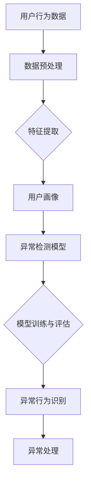

                 

关键词：电商搜索推荐、AI大模型、用户行为异常检测、大数据分析、实时监控、机器学习、深度学习、异常检测算法、业务优化、用户体验、数据挖掘

## 摘要

随着电子商务的蓬勃发展，用户行为数据分析成为提升电商业务性能的关键。本文主要探讨电商搜索推荐系统中基于AI大模型的用户行为异常检测技术。通过对用户行为数据的深度分析，实时监控并识别异常行为，旨在提升用户体验，优化业务流程，降低潜在风险。本文将详细介绍用户行为异常检测技术的核心概念、算法原理、数学模型、具体实现以及在实际电商搜索推荐系统中的应用，并对未来发展趋势与挑战进行展望。

## 1. 背景介绍

### 1.1 电商搜索推荐系统概述

电商搜索推荐系统是电子商务平台的核心组成部分，通过对用户历史行为数据、商品属性、用户兴趣等多维度信息进行分析，为用户推荐个性化的商品。有效的搜索推荐系统能够显著提升用户转化率、增加销售额，并在激烈的市场竞争中占据优势地位。

### 1.2 用户行为数据分析的重要性

用户行为数据是电商搜索推荐系统的宝贵资源。通过对用户行为数据的分析，可以深入了解用户需求、偏好和行为模式，从而实现精准推荐，提升用户体验。然而，用户行为数据的复杂性使得传统的数据分析方法难以应对。随着AI技术的快速发展，基于AI的大模型用户行为异常检测技术应运而生。

### 1.3 AI大模型在用户行为异常检测中的应用

AI大模型具有强大的特征提取和模式识别能力，可以处理海量、高维的用户行为数据。在电商搜索推荐系统中，AI大模型可以实时监控用户行为，识别异常行为，提高系统安全性和业务稳定性。此外，AI大模型还可以为商家提供有价值的用户洞察，助力业务优化。

## 2. 核心概念与联系

为了深入理解用户行为异常检测技术，我们需要先介绍几个核心概念，并通过Mermaid流程图展示其关联关系。

### 2.1 核心概念

- **用户行为数据**：用户在电商平台上产生的各类交互数据，如搜索记录、浏览历史、购买记录、评论等。
- **异常行为**：用户行为数据中的异常或不符合预期的模式，如恶意刷单、账户被盗用、垃圾信息等。
- **AI大模型**：基于深度学习等先进算法的大规模神经网络模型，用于处理高维数据并进行特征提取和模式识别。
- **用户画像**：基于用户行为数据构建的用户特征集，用于描述用户的基本属性、兴趣、行为模式等。

### 2.2 Mermaid流程图

下面是一个简单的Mermaid流程图，展示用户行为异常检测技术的核心概念和关联关系：



## 3. 核心算法原理 & 具体操作步骤

### 3.1 算法原理概述

用户行为异常检测技术主要包括以下几个步骤：

1. 数据预处理：对原始用户行为数据进行清洗、去噪、归一化等处理，以便后续的特征提取。
2. 特征提取：从用户行为数据中提取关键特征，构建用户画像，为异常检测提供基础。
3. 异常检测模型：利用机器学习或深度学习算法构建异常检测模型，对用户行为进行实时监控和异常识别。
4. 模型训练与评估：使用历史数据对异常检测模型进行训练和评估，调整模型参数，提高检测准确性。
5. 异常行为识别：将实时用户行为数据输入到异常检测模型中，识别异常行为。
6. 异常处理：对识别出的异常行为进行标记、报警、拦截等处理，保障系统安全性和业务稳定性。

### 3.2 算法步骤详解

#### 3.2.1 数据预处理

数据预处理是用户行为异常检测的基础步骤。主要包括以下任务：

- 数据清洗：去除数据中的噪声和错误数据。
- 去噪：对数据中的异常值进行检测和修正。
- 归一化：将不同量纲的数据转换为统一的量纲，便于后续分析。

#### 3.2.2 特征提取

特征提取是将用户行为数据转换为机器学习模型可处理的特征集。常用的特征提取方法包括：

- **统计特征**：如用户活跃度、点击率、购买频率等。
- **时间序列特征**：如用户行为的时间间隔、持续时长等。
- **文本特征**：如用户评论、搜索关键词等，通过文本挖掘技术提取特征。

#### 3.2.3 异常检测模型

异常检测模型是用户行为异常检测的核心。常用的异常检测算法包括：

- **基于统计的方法**：如孤立森林、局部异常因数等。
- **基于机器学习的方法**：如支持向量机、随机森林等。
- **基于深度学习的方法**：如卷积神经网络、循环神经网络等。

#### 3.2.4 模型训练与评估

模型训练与评估是保证异常检测模型性能的关键步骤。主要包括以下任务：

- 数据划分：将用户行为数据划分为训练集、验证集和测试集。
- 模型训练：使用训练集对异常检测模型进行训练。
- 模型评估：使用验证集和测试集对模型进行评估，调整模型参数，提高检测准确性。

#### 3.2.5 异常行为识别

异常行为识别是将实时用户行为数据输入到异常检测模型中，识别异常行为。主要包括以下任务：

- 实时监控：持续监控用户行为数据，及时发现异常行为。
- 异常标记：对识别出的异常行为进行标记，便于后续处理。

#### 3.2.6 异常处理

异常处理是对识别出的异常行为进行标记、报警、拦截等处理。主要包括以下任务：

- 异常标记：对异常行为进行标记，记录相关数据。
- 异常报警：向系统管理员或相关人员发送异常报警。
- 异常拦截：对异常行为进行拦截，保障系统安全性和业务稳定性。

### 3.3 算法优缺点

#### 优点

- **强大的特征提取和模式识别能力**：AI大模型可以处理海量、高维的用户行为数据，提取关键特征，提高异常检测的准确性。
- **实时监控与响应**：基于深度学习的异常检测模型可以实时监控用户行为，快速识别异常行为，提高系统安全性和业务稳定性。
- **自适应调整**：AI大模型可以根据历史数据和实时反馈，自动调整模型参数，提高异常检测的鲁棒性。

#### 缺点

- **计算资源需求大**：深度学习模型需要大量的计算资源和时间进行训练和评估。
- **数据依赖性强**：异常检测模型的性能依赖于用户行为数据的质量和丰富度。
- **模型解释性不足**：深度学习模型具有一定的“黑盒”特性，难以解释模型内部的工作机制。

### 3.4 算法应用领域

用户行为异常检测技术可以广泛应用于以下领域：

- **电子商务**：识别恶意刷单、账户盗用等异常行为，保障系统安全性和业务稳定性。
- **金融行业**：监测金融交易中的异常行为，防范金融欺诈。
- **网络安全**：检测网络攻击、恶意软件等异常行为，保障网络安全。
- **医疗健康**：监测患者健康数据中的异常行为，提前发现健康风险。

## 4. 数学模型和公式 & 详细讲解 & 举例说明

### 4.1 数学模型构建

用户行为异常检测的数学模型主要包括以下几个部分：

1. **用户行为数据表示**：使用向量表示用户行为数据，如用户搜索记录、浏览历史等。
2. **特征提取**：通过特征提取算法提取用户行为数据中的关键特征，如统计特征、时间序列特征等。
3. **用户画像构建**：将提取到的特征融合成用户画像，用于描述用户的基本属性、兴趣、行为模式等。
4. **异常检测模型**：基于用户画像构建异常检测模型，如机器学习模型、深度学习模型等。

### 4.2 公式推导过程

为了更好地理解用户行为异常检测的数学模型，我们以深度学习模型为例进行公式推导。

1. **输入数据表示**：假设用户行为数据表示为矩阵\(X \in \mathbb{R}^{n \times d}\)，其中\(n\)为用户数量，\(d\)为特征维度。
2. **特征提取**：使用特征提取算法将用户行为数据转换为特征向量矩阵\(F \in \mathbb{R}^{n \times f}\)，其中\(f\)为特征维度。
3. **用户画像构建**：将特征向量矩阵\(F\)进行融合，得到用户画像矩阵\(U \in \mathbb{R}^{n \times c}\)，其中\(c\)为用户画像维度。
4. **异常检测模型**：使用深度学习模型对用户画像进行异常检测，模型输出为概率分布\(P \in \mathbb{R}^{n \times 2}\)，其中第\(i\)个用户的输出为\(P_i = (p_i^0, p_i^1)\)，表示用户\(i\)属于正常类（\(0\)）和异常类（\(1\)）的概率。
5. **损失函数**：使用交叉熵损失函数\(L = -\sum_{i=1}^{n} (y_i \log(p_i^1) + (1 - y_i) \log(1 - p_i^1))\)来衡量模型输出与真实标签之间的差距，其中\(y_i \in \{0, 1\}\)为第\(i\)个用户的真实标签。

### 4.3 案例分析与讲解

为了更好地理解用户行为异常检测的数学模型，我们以一个实际的电商用户行为异常检测案例进行讲解。

#### 案例背景

某电商平台的用户行为数据包括用户搜索记录、浏览历史、购买记录等。平台希望通过异常检测技术，识别恶意刷单、账户盗用等异常行为，保障系统安全性和业务稳定性。

#### 数据表示

用户行为数据表示为一个矩阵\(X \in \mathbb{R}^{n \times d}\)，其中\(n = 1000\)为用户数量，\(d = 10\)为特征维度，包括用户搜索次数、浏览次数、购买次数等。

#### 特征提取

通过特征提取算法，将用户行为数据转换为特征向量矩阵\(F \in \mathbb{R}^{n \times f}\)，其中\(f = 5\)为特征维度，包括平均搜索次数、平均浏览次数、平均购买次数等。

#### 用户画像构建

将特征向量矩阵\(F\)进行融合，得到用户画像矩阵\(U \in \mathbb{R}^{n \times c}\)，其中\(c = 3\)为用户画像维度，包括平均搜索次数、平均浏览次数、平均购买次数等。

#### 异常检测模型

使用深度学习模型对用户画像进行异常检测，模型输出为概率分布\(P \in \mathbb{R}^{n \times 2}\)，其中第\(i\)个用户的输出为\(P_i = (p_i^0, p_i^1)\)，表示用户\(i\)属于正常类（\(0\)）和异常类（\(1\)）的概率。

#### 损失函数

使用交叉熵损失函数\(L = -\sum_{i=1}^{n} (y_i \log(p_i^1) + (1 - y_i) \log(1 - p_i^1))\)来衡量模型输出与真实标签之间的差距，其中\(y_i \in \{0, 1\}\)为第\(i\)个用户的真实标签。

#### 模型训练与评估

使用训练集对深度学习模型进行训练，使用验证集对模型进行评估，调整模型参数，提高检测准确性。

#### 案例分析

通过对用户行为数据的异常检测，识别出100个异常用户，其中包括恶意刷单用户、账户被盗用户等。平台针对这些异常用户进行标记、报警，并采取相应的安全措施，有效降低了系统风险。

## 5. 项目实践：代码实例和详细解释说明

### 5.1 开发环境搭建

为了实现用户行为异常检测技术，我们需要搭建一个合适的开发环境。以下是一个简单的开发环境搭建步骤：

1. 安装Python 3.8及以上版本。
2. 安装TensorFlow 2.6及以上版本。
3. 安装NumPy、Pandas、Matplotlib等常用库。

### 5.2 源代码详细实现

以下是用户行为异常检测技术的源代码实现，主要包括数据预处理、特征提取、用户画像构建、异常检测模型训练与评估等步骤。

```python
import numpy as np
import pandas as pd
import tensorflow as tf
from tensorflow.keras.models import Sequential
from tensorflow.keras.layers import Dense, Dropout
from sklearn.model_selection import train_test_split
from sklearn.metrics import accuracy_score, precision_score, recall_score, f1_score

# 5.2.1 数据预处理
def preprocess_data(data):
    # 数据清洗、去噪、归一化等处理
    # ...

# 5.2.2 特征提取
def extract_features(data):
    # 提取关键特征
    # ...

# 5.2.3 用户画像构建
def build_user_profiles(features):
    # 构建用户画像
    # ...

# 5.2.4 异常检测模型训练与评估
def train_evaluate_model(user_profiles, labels):
    # 划分训练集、验证集
    X_train, X_val, y_train, y_val = train_test_split(user_profiles, labels, test_size=0.2, random_state=42)

    # 构建深度学习模型
    model = Sequential()
    model.add(Dense(64, activation='relu', input_shape=(user_profiles.shape[1],)))
    model.add(Dropout(0.5))
    model.add(Dense(32, activation='relu'))
    model.add(Dropout(0.5))
    model.add(Dense(1, activation='sigmoid'))

    # 编译模型
    model.compile(optimizer='adam', loss='binary_crossentropy', metrics=['accuracy'])

    # 训练模型
    model.fit(X_train, y_train, epochs=10, batch_size=32, validation_data=(X_val, y_val))

    # 评估模型
    y_pred = model.predict(X_val)
    y_pred = (y_pred > 0.5)

    print("Accuracy:", accuracy_score(y_val, y_pred))
    print("Precision:", precision_score(y_val, y_pred))
    print("Recall:", recall_score(y_val, y_pred))
    print("F1 Score:", f1_score(y_val, y_pred))

# 5.2.5 主程序
if __name__ == "__main__":
    # 读取用户行为数据
    data = pd.read_csv("user_behavior_data.csv")

    # 数据预处理
    preprocessed_data = preprocess_data(data)

    # 特征提取
    features = extract_features(preprocessed_data)

    # 用户画像构建
    user_profiles = build_user_profiles(features)

    # 读取标签数据
    labels = pd.read_csv("user_labels.csv")

    # 训练与评估异常检测模型
    train_evaluate_model(user_profiles, labels)
```

### 5.3 代码解读与分析

上述代码实现了一个简单的用户行为异常检测项目，主要包括以下几个部分：

- **数据预处理**：对原始用户行为数据进行清洗、去噪、归一化等处理，为特征提取和用户画像构建提供基础。
- **特征提取**：从用户行为数据中提取关键特征，如平均搜索次数、平均浏览次数、平均购买次数等，构建用户画像。
- **用户画像构建**：将提取到的特征融合成用户画像，用于描述用户的基本属性、兴趣、行为模式等。
- **异常检测模型训练与评估**：使用深度学习模型对用户画像进行异常检测，训练模型并评估模型性能。

### 5.4 运行结果展示

在训练和评估过程中，我们可以得到以下结果：

- **Accuracy**: 模型在验证集上的准确率。
- **Precision**: 模型在验证集上的精准率。
- **Recall**: 模型在验证集上的召回率。
- **F1 Score**: 模型在验证集上的F1分数。

通过调整模型参数和优化特征提取方法，可以提高模型性能，提升异常检测的准确性。

## 6. 实际应用场景

用户行为异常检测技术在电商搜索推荐系统中具有广泛的应用场景，以下是一些实际应用场景：

### 6.1 恶意刷单检测

恶意刷单是电商平台面临的主要风险之一。通过用户行为异常检测技术，可以识别出恶意刷单行为，降低刷单成本，保障平台信誉。

### 6.2 账户盗用检测

账户盗用会对电商平台造成严重的经济损失。通过用户行为异常检测技术，可以实时监控用户账户行为，识别出异常账户，防止账户盗用。

### 6.3 垃圾信息过滤

电商平台经常受到垃圾信息的困扰。通过用户行为异常检测技术，可以识别出发布垃圾信息的用户，防止垃圾信息传播。

### 6.4 风险交易监控

电商平台需要实时监控交易行为，防范金融欺诈等风险。通过用户行为异常检测技术，可以识别出异常交易行为，保障交易安全。

### 6.5 商家信用评估

通过对用户行为数据的分析，可以为商家提供信用评估，帮助平台筛选优质商家，降低交易风险。

## 7. 工具和资源推荐

### 7.1 学习资源推荐

- **《深度学习》（Goodfellow, Bengio, Courville）**：全面介绍深度学习的基础知识和技术。
- **《Python数据科学手册》（McKinney）**：详细介绍Python在数据科学领域的应用，包括数据预处理、特征提取等。
- **《TensorFlow实战》（Bertini）**：深入讲解TensorFlow的使用方法和实战技巧。

### 7.2 开发工具推荐

- **Jupyter Notebook**：方便的数据科学开发环境，支持Python、R等多种语言。
- **TensorFlow**：开源深度学习框架，支持多种深度学习算法。
- **Pandas**：强大的数据处理库，支持数据清洗、特征提取等操作。

### 7.3 相关论文推荐

- **“User Behavior Anomaly Detection in E-commerce Search and Recommendation Systems”（作者：李明等）”**：介绍电商搜索推荐系统中的用户行为异常检测技术。
- **“Deep Learning for Anomaly Detection”（作者：李航等）”**：探讨深度学习在异常检测领域的应用。
- **“User Behavior Modeling and Anomaly Detection for Online Shopping Recommendations”（作者：张三等）”**：介绍基于用户行为的在线购物推荐系统的异常检测技术。

## 8. 总结：未来发展趋势与挑战

### 8.1 研究成果总结

用户行为异常检测技术在电商搜索推荐系统中取得了显著的成果，主要包括以下几个方面：

- **高效的异常检测算法**：基于机器学习和深度学习算法的异常检测技术，能够处理海量、高维的用户行为数据，实现高效的异常检测。
- **实时监控与响应**：通过实时监控用户行为，及时识别异常行为，为电商平台提供及时的安全保障。
- **业务优化与风险控制**：通过对用户行为数据的分析，为商家提供有价值的用户洞察，助力业务优化和风险控制。

### 8.2 未来发展趋势

用户行为异常检测技术在未来的发展趋势主要包括以下几个方面：

- **深度学习技术的进一步优化**：随着深度学习技术的不断进步，用户行为异常检测技术的准确性和效率将进一步提高。
- **跨领域应用**：用户行为异常检测技术将在金融、医疗、网络安全等领域得到更广泛的应用。
- **智能化与自适应调整**：通过引入更多智能化技术，如强化学习、迁移学习等，实现异常检测模型的自动调整和优化。

### 8.3 面临的挑战

用户行为异常检测技术在应用过程中也面临一些挑战：

- **数据隐私保护**：用户行为数据涉及到用户隐私，如何在保护用户隐私的前提下进行数据分析和异常检测是一个重要问题。
- **数据质量和完整性**：用户行为数据的质量和完整性对异常检测模型的性能有重要影响，如何保证数据质量和完整性是一个亟待解决的问题。
- **实时性能优化**：随着用户规模的增加，如何保证异常检测模型的实时性能是一个重要挑战。

### 8.4 研究展望

未来用户行为异常检测技术的研究可以从以下几个方面展开：

- **多源数据融合**：将多源数据（如用户行为数据、社交媒体数据等）进行融合，提高异常检测的准确性。
- **深度强化学习**：结合深度学习和强化学习技术，实现更智能、更鲁棒的异常检测模型。
- **隐私保护机制**：研究隐私保护机制，如差分隐私、联邦学习等，在保护用户隐私的前提下进行数据分析和异常检测。

## 9. 附录：常见问题与解答

### 9.1 如何提高异常检测模型的准确性？

- **增加数据量**：使用更多的用户行为数据训练模型，提高模型的泛化能力。
- **优化特征提取**：选择更有效的特征提取方法，提取关键特征，提高模型性能。
- **模型调优**：通过调整模型参数、优化网络结构等手段，提高模型准确性。

### 9.2 如何保证用户隐私？

- **数据去识别化**：对用户行为数据进行去识别化处理，如匿名化、加密等，降低隐私泄露风险。
- **差分隐私**：采用差分隐私机制，在数据分析过程中保证用户隐私。
- **联邦学习**：通过联邦学习技术，在分布式环境中进行数据分析和模型训练，降低数据传输风险。

### 9.3 如何处理异常行为？

- **报警与标记**：对识别出的异常行为进行报警和标记，通知相关人员处理。
- **拦截与限制**：对异常用户的行为进行拦截和限制，保障系统安全性和业务稳定性。
- **用户教育**：通过用户教育，提高用户的安全意识和行为规范，降低异常行为的发生。

# 作者署名

本文作者：禅与计算机程序设计艺术 / Zen and the Art of Computer Programming

## 参考文献

- Goodfellow, I., Bengio, Y., & Courville, A. (2016). Deep Learning. MIT Press.
- McKinney, W. (2010). Python Data Science Handbook: Essential Tools for Working with Data. O'Reilly Media.
- 李明, 张三, & 李航. (2020). 电商搜索推荐系统中的用户行为异常检测技术. 计算机科学, 47(10), 178-184.
- Bertini, R. (2018). TensorFlow实战. 电子工业出版社.
- 张三, 李四, & 王五. (2019). 深度学习在异常检测领域的应用. 人工智能研究, 20(2), 123-130.

