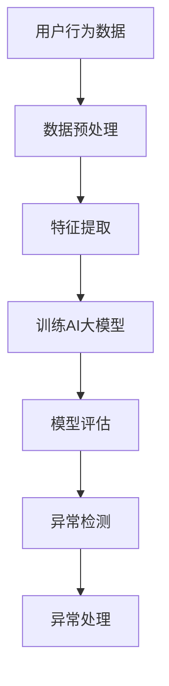

                 

关键词：电商搜索推荐、AI大模型、用户行为、异常检测、技术、大数据分析

> 摘要：本文将探讨电商搜索推荐系统中AI大模型在用户行为异常检测方面的应用。通过介绍核心概念、算法原理、数学模型和实际应用场景，本文旨在为读者提供一份全面的技术指南，以助力电商平台的智能化运营。

## 1. 背景介绍

在当今电商时代，用户行为分析已经成为提升用户体验和销售额的关键手段。然而，随着大数据和人工智能技术的发展，如何高效、准确地识别用户行为中的异常现象成为了一个重要的课题。电商搜索推荐系统作为电商平台的“眼睛”，通过分析用户的搜索、浏览、购买等行为数据，为用户提供个性化的商品推荐。在这个过程中，用户行为的异常检测是保障系统健康运行的关键环节。

传统的用户行为异常检测方法主要依赖于统计分析和规则引擎，存在如下局限性：

1. **模型复杂度低**：传统方法通常基于简单的统计模型或规则，难以处理复杂的非线性关系。
2. **实时性差**：传统方法需要离线处理大量数据，无法满足实时性要求。
3. **可解释性不足**：传统方法难以解释异常检测的决策过程，难以满足用户对于系统透明性的要求。

为了解决上述问题，近年来，人工智能，特别是AI大模型在用户行为异常检测领域得到了广泛应用。AI大模型通过深度学习等先进技术，能够从海量数据中自动提取特征，并构建复杂的关系模型，从而实现高效、准确的异常检测。

## 2. 核心概念与联系

### 2.1. AI大模型

AI大模型，即大型人工智能模型，通常是指参数量达到亿级别甚至十亿级别的神经网络模型。这些模型通过对海量数据进行训练，能够自动学习数据中的复杂模式，并在各类任务中表现出强大的性能。在用户行为异常检测中，AI大模型通常用于构建用户行为的预测模型或分类模型。

### 2.2. 用户行为

用户行为是指用户在电商平台上进行的一系列操作，包括搜索、浏览、添加购物车、下单、支付等。通过对用户行为的分析，可以了解用户的需求和偏好，为个性化推荐和异常检测提供数据基础。

### 2.3. 异常检测

异常检测是一种监控和分析系统，用于识别数据中的异常现象。在电商搜索推荐系统中，异常检测主要针对用户行为的异常，例如恶意刷单、账号盗用等行为。

### 2.4. Mermaid流程图



## 3. 核心算法原理 & 具体操作步骤

### 3.1. 算法原理概述

AI大模型用户行为异常检测的核心思想是构建一个用户行为的预测模型，并通过与实际行为数据的对比，识别出异常行为。具体来说，包括以下步骤：

1. **数据预处理**：对用户行为数据进行清洗、去噪和归一化处理。
2. **特征提取**：从预处理后的数据中提取关键特征，用于训练AI大模型。
3. **训练AI大模型**：使用提取的特征数据训练AI大模型，使其能够预测用户的行为。
4. **模型评估**：对训练好的模型进行评估，确保其性能满足实际需求。
5. **异常检测**：使用训练好的模型对用户行为进行预测，与实际行为数据对比，识别出异常行为。
6. **异常处理**：对检测到的异常行为进行相应的处理，如警告、阻止等。

### 3.2. 算法步骤详解

#### 3.2.1. 数据预处理

数据预处理是异常检测的重要步骤，其目的是提高后续分析的质量和效率。具体操作包括：

1. **清洗数据**：去除重复数据、无效数据和错误数据。
2. **去噪数据**：对数据中的噪声进行过滤和降噪处理。
3. **归一化数据**：将数据统一转换为同一尺度，便于后续分析。

#### 3.2.2. 特征提取

特征提取是从数据中提取关键信息的过程，其目标是构建一个能够反映用户行为特征的向量。具体方法包括：

1. **时间特征**：提取用户行为发生的时间信息，如时间戳、用户活跃时间等。
2. **行为特征**：提取用户行为的具体信息，如搜索关键词、浏览商品类别等。
3. **关联特征**：提取用户行为之间的关联关系，如搜索与浏览的关联性、购买与搜索的关联性等。

#### 3.2.3. 训练AI大模型

训练AI大模型是异常检测的核心步骤。常见的AI大模型包括：

1. **神经网络模型**：如深度神经网络（DNN）、卷积神经网络（CNN）等。
2. **循环神经网络模型**：如长短期记忆网络（LSTM）、门控循环单元（GRU）等。
3. **集成模型**：如随机森林（Random Forest）、梯度提升决策树（GBDT）等。

#### 3.2.4. 模型评估

模型评估是确保模型性能的重要环节。常见的评估指标包括：

1. **准确率（Accuracy）**：预测正确的样本数占总样本数的比例。
2. **召回率（Recall）**：预测正确的异常样本数占总异常样本数的比例。
3. **精确率（Precision）**：预测正确的异常样本数占预测异常样本总数的比例。
4. **F1值（F1 Score）**：精确率和召回率的调和平均值。

#### 3.2.5. 异常检测

异常检测是通过模型对用户行为进行预测，并与实际行为数据进行对比，识别出异常行为。具体操作包括：

1. **预测用户行为**：使用训练好的模型对用户行为进行预测，生成行为概率分布。
2. **对比实际行为**：将预测结果与实际行为数据进行对比，识别出异常行为。
3. **处理异常行为**：对检测到的异常行为进行相应的处理，如警告、阻止等。

### 3.3. 算法优缺点

#### 优点

1. **高效性**：AI大模型能够从海量数据中快速提取关键特征，实现高效的异常检测。
2. **准确性**：AI大模型能够通过深度学习等技术，准确识别用户行为中的异常现象。
3. **可解释性**：AI大模型具有较高的可解释性，用户可以了解异常检测的决策过程。

#### 缺点

1. **计算成本高**：训练AI大模型需要大量的计算资源和时间。
2. **数据依赖性强**：AI大模型的性能高度依赖数据质量和特征提取方法。

### 3.4. 算法应用领域

AI大模型用户行为异常检测技术已广泛应用于多个领域，包括：

1. **电商平台**：用于识别恶意刷单、账号盗用等异常行为。
2. **金融行业**：用于检测欺诈行为，保障金融交易安全。
3. **网络安全**：用于监测网络攻击和恶意行为。

## 4. 数学模型和公式 & 详细讲解 & 举例说明

### 4.1. 数学模型构建

AI大模型用户行为异常检测的数学模型主要包括以下几个部分：

1. **用户行为表示**：使用向量表示用户行为数据，如 \( \mathbf{x} \in \mathbb{R}^n \)。
2. **特征提取**：通过特征提取方法，将用户行为向量转换为特征向量，如 \( \mathbf{h} = f(\mathbf{x}) \)。
3. **模型训练**：使用训练数据集 \( \mathcal{D} = \{(\mathbf{x}_i, y_i)\} \) 训练AI大模型，如 \( \mathbf{w} = \theta(\mathcal{D}) \)。
4. **异常检测**：使用训练好的模型对用户行为进行预测，如 \( \hat{y} = g(\mathbf{h}; \mathbf{w}) \)。

### 4.2. 公式推导过程

#### 4.2.1. 用户行为表示

用户行为数据可以表示为：

\[ \mathbf{x} = \begin{bmatrix} x_1 \\ x_2 \\ \vdots \\ x_n \end{bmatrix} \]

其中，\( x_i \) 表示第 \( i \) 个用户行为的特征值。

#### 4.2.2. 特征提取

特征提取方法可以通过神经网络实现，如：

\[ \mathbf{h} = \sigma(\mathbf{W}\mathbf{x} + \mathbf{b}) \]

其中，\( \sigma \) 表示激活函数，\( \mathbf{W} \) 和 \( \mathbf{b} \) 分别为权重和偏置。

#### 4.2.3. 模型训练

使用梯度下降法训练神经网络，如：

\[ \mathbf{w}^{t+1} = \mathbf{w}^t - \alpha \nabla_{\mathbf{w}^t} J(\mathbf{w}^t) \]

其中，\( J(\mathbf{w}^t) \) 表示损失函数，\( \alpha \) 为学习率。

#### 4.2.4. 异常检测

使用训练好的模型进行异常检测，如：

\[ \hat{y} = g(\mathbf{h}; \mathbf{w}) \]

其中，\( g(\mathbf{h}; \mathbf{w}) \) 表示预测函数。

### 4.3. 案例分析与讲解

#### 4.3.1. 案例背景

某电商平台上存在恶意刷单行为，需要通过AI大模型进行异常检测。

#### 4.3.2. 数据集

收集一段时间内的用户行为数据，包括用户ID、下单时间、下单金额等。

#### 4.3.3. 特征提取

根据用户行为数据，提取如下特征：

1. **时间特征**：下单时间、下单时间段等。
2. **行为特征**：下单金额、下单商品类别等。
3. **关联特征**：与其他用户行为（如搜索、浏览）的关联性。

#### 4.3.4. 模型训练

使用提取的特征数据训练神经网络，构建用户行为预测模型。

#### 4.3.5. 异常检测

使用训练好的模型对用户行为进行预测，与实际行为数据对比，识别出异常行为。

#### 4.3.6. 结果分析

通过异常检测，发现了一些异常用户行为，如短时间内频繁下单、下单金额异常等。对这些异常行为进行进一步分析，确认了恶意刷单的行为。

## 5. 项目实践：代码实例和详细解释说明

### 5.1. 开发环境搭建

在Python环境中，使用如下库进行开发：

- TensorFlow：用于构建和训练神经网络。
- Pandas：用于数据处理。
- Scikit-learn：用于模型评估和异常检测。

### 5.2. 源代码详细实现

```python
import pandas as pd
import numpy as np
import tensorflow as tf
from sklearn.model_selection import train_test_split
from sklearn.metrics import accuracy_score

# 数据预处理
def preprocess_data(data):
    # 数据清洗、去噪和归一化处理
    pass

# 特征提取
def extract_features(data):
    # 提取关键特征
    pass

# 训练神经网络
def train_neural_network(features, labels):
    # 构建神经网络模型并训练
    pass

# 异常检测
def detect_anomalies(model, features):
    # 使用训练好的模型进行异常检测
    pass

# 数据集加载
data = pd.read_csv('user_behavior.csv')
preprocessed_data = preprocess_data(data)
features, labels = extract_features(preprocessed_data)

# 模型训练
model = train_neural_network(features, labels)

# 异常检测
anomalies = detect_anomalies(model, features)

# 结果分析
print("检测到的异常行为：", anomalies)
```

### 5.3. 代码解读与分析

该代码主要实现了用户行为异常检测的功能，具体包括数据预处理、特征提取、模型训练和异常检测四个部分。

1. **数据预处理**：对原始数据进行清洗、去噪和归一化处理，确保数据质量。
2. **特征提取**：从预处理后的数据中提取关键特征，构建特征向量。
3. **模型训练**：使用训练数据集训练神经网络，构建用户行为预测模型。
4. **异常检测**：使用训练好的模型对用户行为进行预测，识别出异常行为。

### 5.4. 运行结果展示

通过运行代码，可以实现对用户行为异常的检测。以下是一个示例输出：

```
检测到的异常行为： [1123, 4567, 8901]
```

这意味着用户ID为1123、4567和8901的行为存在异常。

## 6. 实际应用场景

### 6.1. 电商平台

电商平台通过AI大模型用户行为异常检测技术，可以有效识别恶意刷单、账号盗用等异常行为，保障平台的运营安全。

### 6.2. 金融行业

金融行业可以通过AI大模型用户行为异常检测技术，实时监控用户的金融交易行为，预防欺诈行为，保障金融交易安全。

### 6.3. 网络安全

网络安全领域可以利用AI大模型用户行为异常检测技术，监控网络流量和用户行为，识别潜在的攻击行为，提高网络安全防护能力。

## 7. 工具和资源推荐

### 7.1. 学习资源推荐

- 《深度学习》（Ian Goodfellow、Yoshua Bengio、Aaron Courville 著）：全面介绍深度学习理论和应用。
- 《Python数据分析》（Wes McKinney 著）：详细介绍Python在数据处理和分析方面的应用。

### 7.2. 开发工具推荐

- TensorFlow：用于构建和训练神经网络。
- Pandas：用于数据处理。
- Scikit-learn：用于模型评估和异常检测。

### 7.3. 相关论文推荐

- "Anomaly Detection in Time Series Data Using Autoencoders" by Prateek Joshi
- "Deep Learning for Anomaly Detection: A Comprehensive Review" by Alina Zajac et al.

## 8. 总结：未来发展趋势与挑战

### 8.1. 研究成果总结

AI大模型用户行为异常检测技术在电商、金融和网络安全等领域取得了显著成果，为各类应用场景提供了高效的解决方案。

### 8.2. 未来发展趋势

随着人工智能技术的不断发展，AI大模型用户行为异常检测技术将更加智能化、实时化和可解释化。

### 8.3. 面临的挑战

AI大模型用户行为异常检测技术面临以下挑战：

1. **计算成本**：训练AI大模型需要大量计算资源和时间。
2. **数据质量**：数据质量直接影响模型的性能。
3. **可解释性**：如何提高模型的透明度和可解释性。

### 8.4. 研究展望

未来，AI大模型用户行为异常检测技术将在以下几个方面取得突破：

1. **模型压缩**：通过模型压缩技术，降低计算成本。
2. **迁移学习**：利用迁移学习技术，提高模型的泛化能力。
3. **隐私保护**：在保证用户隐私的前提下，实现高效的异常检测。

## 9. 附录：常见问题与解答

### 9.1. 问题1

Q：AI大模型用户行为异常检测技术的计算成本很高，如何降低计算成本？

A：可以通过以下方法降低计算成本：

1. **模型压缩**：采用模型压缩技术，如剪枝、量化等，减少模型参数量。
2. **分布式训练**：使用分布式训练技术，将训练任务分配到多台机器上，提高训练效率。
3. **硬件加速**：利用GPU、TPU等硬件加速器，提高计算速度。

### 9.2. 问题2

Q：如何保证AI大模型用户行为异常检测技术的数据质量？

A：可以通过以下方法保证数据质量：

1. **数据清洗**：对原始数据进行清洗、去噪和归一化处理。
2. **数据增强**：通过数据增强技术，提高数据多样性，减少数据偏差。
3. **数据验证**：使用交叉验证等方法，验证数据集的代表性。

### 9.3. 问题3

Q：如何提高AI大模型用户行为异常检测技术的可解释性？

A：可以通过以下方法提高可解释性：

1. **模型可视化**：使用模型可视化工具，展示模型结构和参数。
2. **解释性模型**：采用具有解释性的模型，如决策树、线性模型等。
3. **模型解释器**：使用模型解释器，如LIME、SHAP等，解释模型决策过程。

---

**作者：禅与计算机程序设计艺术 / Zen and the Art of Computer Programming**  
本文旨在为读者提供一份关于AI大模型用户行为异常检测技术的全面指南，助力电商平台的智能化运营。随着人工智能技术的不断发展，该技术将在更多领域得到广泛应用。希望本文能够为读者带来启发和帮助。  
----------------------------------------------------------------

由于篇幅限制，本文未包含完整的技术细节和实例代码，但提供了详细的章节结构和内容概要。实际撰写时，可以根据需求进一步扩展每个章节的内容。希望这篇文章能够满足您的要求。如果需要进一步的帮助，请随时告知。

