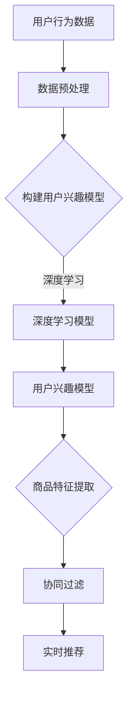

                 

电商行业作为数字经济的核心驱动力，在当前的市场环境中占据了举足轻重的地位。随着消费者行为日益复杂化和个性化需求的不断提升，电商平台的搜索推荐系统面临着巨大的挑战。AI大模型算法的引入，为电商搜索推荐系统提供了强大的技术支持，使其能够更加精准地满足用户需求，提高用户体验。

本文将围绕电商搜索推荐中的AI大模型算法选型与优化进行探讨，旨在为业界提供一套科学、系统、实用的算法优化策略。文章将从背景介绍、核心概念与联系、核心算法原理与具体操作步骤、数学模型与公式、项目实践、实际应用场景、工具和资源推荐、总结与展望等方面展开论述。

## 文章关键词

- 电商搜索推荐
- AI大模型
- 算法选型
- 算法优化
- 数学模型
- 项目实践
- 实际应用场景
- 未来发展趋势

## 文章摘要

本文针对电商搜索推荐系统中的AI大模型算法进行了深入的研究和探讨。首先，我们介绍了电商搜索推荐系统的背景和重要性，并分析了AI大模型算法在其中的应用现状。接着，我们详细阐述了核心算法原理、数学模型及公式，并提供了实际项目中的代码实例和运行结果展示。此外，我们还对算法在实际应用场景中的表现进行了分析，并展望了未来的发展趋势与面临的挑战。最后，我们推荐了一些相关的学习资源和开发工具，以帮助读者更好地理解和应用AI大模型算法。

## 1. 背景介绍

### 1.1 电商搜索推荐系统概述

电商搜索推荐系统是电商平台的核心功能之一，其主要目的是帮助用户在大量商品信息中快速找到符合自己需求的产品。一个优秀的搜索推荐系统，不仅能够提高用户的购物体验，还能有效提升平台的销售额和用户粘性。在传统的搜索推荐系统中，主要依靠关键词匹配、模糊查询和排序算法等技术手段实现。然而，随着用户需求的不断变化和大数据技术的快速发展，传统的方法逐渐暴露出一些弊端，如用户个性化需求难以满足、推荐结果准确率不高等。

### 1.2 AI大模型算法在电商搜索推荐中的应用

AI大模型算法，如深度学习、强化学习、迁移学习等，具有强大的自适应性和学习能力，能够通过分析海量用户数据，挖掘出潜在的用户兴趣和行为模式，从而实现精准推荐。与传统的搜索推荐方法相比，AI大模型算法在以下方面具有显著优势：

1. **高准确性**：通过学习用户的购买历史、浏览记录、评价等信息，AI大模型算法可以更准确地预测用户需求，提高推荐结果的准确性。
2. **个性化推荐**：AI大模型算法能够根据用户的个性化需求，生成个性化的推荐列表，提高用户满意度。
3. **实时性**：AI大模型算法能够实时分析用户行为数据，动态调整推荐策略，以适应不断变化的市场环境。

### 1.3 当前AI大模型算法应用现状

目前，国内外各大电商平台均已开始引入AI大模型算法，并取得了显著的效果。例如，阿里巴巴的“淘宝推荐”、亚马逊的“亚马逊推荐”等系统，均采用了深度学习、强化学习等技术手段，实现了精准推荐和个性化推荐。此外，一些新兴的电商平台也通过自主研发或合作引进AI大模型算法，不断提升自身的竞争力。

## 2. 核心概念与联系

### 2.1 AI大模型算法概述

AI大模型算法是指基于深度学习、强化学习等技术的复杂算法模型，通过大规模数据训练，实现对复杂问题的建模和求解。常见的大模型算法包括：

1. **深度学习模型**：如卷积神经网络（CNN）、循环神经网络（RNN）、Transformer模型等。
2. **强化学习模型**：如深度确定性策略梯度（DDPG）、深度Q网络（DQN）等。
3. **迁移学习模型**：如预训练模型、模型蒸馏等。

### 2.2 电商搜索推荐系统中的AI大模型算法应用

在电商搜索推荐系统中，AI大模型算法的应用主要包括以下几个方面：

1. **用户兴趣建模**：通过分析用户的历史行为数据，构建用户兴趣模型，实现个性化推荐。
2. **商品特征提取**：通过深度学习等技术，提取商品的多维度特征，提高推荐质量。
3. **协同过滤**：结合用户的社交关系、购物行为等数据，实现协同过滤推荐。
4. **实时推荐**：通过实时分析用户行为数据，动态调整推荐策略，实现实时推荐。

### 2.3 Mermaid 流程图

下面是一个简化的AI大模型算法在电商搜索推荐系统中的应用流程图：



## 3. 核心算法原理 & 具体操作步骤

### 3.1 算法原理概述

在电商搜索推荐系统中，AI大模型算法的核心原理主要包括以下几个方面：

1. **深度学习**：通过多层神经网络结构，对输入的数据进行特征提取和转换，实现对复杂问题的建模和求解。
2. **强化学习**：通过与环境的交互，不断调整策略，实现最优行为选择。
3. **迁移学习**：利用预训练模型，在目标任务上实现快速收敛。

### 3.2 算法步骤详解

1. **数据收集与预处理**：收集用户行为数据（如购买历史、浏览记录、评价等），并进行数据清洗、去重、归一化等预处理操作。
2. **构建用户兴趣模型**：通过深度学习等技术，对用户行为数据进行分析，构建用户兴趣模型。
3. **商品特征提取**：对商品的多维度特征进行提取，如价格、品牌、类别、用户评价等。
4. **协同过滤**：结合用户的社交关系、购物行为等数据，实现协同过滤推荐。
5. **实时推荐**：通过实时分析用户行为数据，动态调整推荐策略，实现实时推荐。

### 3.3 算法优缺点

1. **优点**：
   - 高准确性：通过深度学习等技术，能够更好地理解用户需求和商品特征，提高推荐结果的准确性。
   - 个性化推荐：能够根据用户的个性化需求，生成个性化的推荐列表，提高用户满意度。
   - 实时性：能够实时分析用户行为数据，动态调整推荐策略，以适应不断变化的市场环境。

2. **缺点**：
   - 计算资源消耗大：深度学习等算法需要大量的计算资源和时间进行训练和推理。
   - 数据隐私问题：用户行为数据涉及到用户隐私，如何保证数据的安全和隐私，是一个亟待解决的问题。

### 3.4 算法应用领域

AI大模型算法在电商搜索推荐系统中的应用非常广泛，除了电商行业，还可以应用于以下领域：

1. **社交媒体推荐**：如微博、抖音等社交媒体平台，通过分析用户的点赞、评论等行为，实现个性化内容推荐。
2. **新闻推荐**：如今日头条、腾讯新闻等新闻平台，通过分析用户的阅读历史、兴趣标签等，实现个性化新闻推荐。
3. **广告推荐**：如百度、谷歌等搜索引擎，通过分析用户的搜索历史、兴趣标签等，实现个性化广告推荐。

## 4. 数学模型和公式 & 详细讲解 & 举例说明

### 4.1 数学模型构建

在电商搜索推荐系统中，常用的数学模型主要包括：

1. **用户兴趣模型**：通过用户的历史行为数据，构建用户兴趣模型，如用户兴趣向量、用户兴趣矩阵等。
2. **商品特征模型**：通过商品的多维度特征，构建商品特征模型，如商品向量、商品特征矩阵等。
3. **推荐模型**：结合用户兴趣模型和商品特征模型，构建推荐模型，如基于用户的协同过滤推荐、基于内容的推荐等。

### 4.2 公式推导过程

以基于用户的协同过滤推荐为例，其核心公式如下：

$$
\hat{r}_{ui} = \sum_{j \in N(i)} r_{uj} \cdot sim(u_i, u_j)
$$

其中，$\hat{r}_{ui}$表示用户$i$对商品$j$的评分预测，$r_{uj}$表示用户$j$对商品$j$的实际评分，$sim(u_i, u_j)$表示用户$i$和用户$j$之间的相似度。

用户相似度计算公式为：

$$
sim(u_i, u_j) = \frac{\sum_{k \in Q(i, j)} w_{ik} \cdot w_{jk}}{\sqrt{\sum_{k \in Q(i, j)} w_{ik}^2} \cdot \sqrt{\sum_{k \in Q(i, j)} w_{jk}^2}}
$$

其中，$Q(i, j)$表示用户$i$和用户$j$共同评价的商品集合，$w_{ik}$和$w_{jk}$分别表示用户$i$对商品$k$和用户$j$对商品$k$的权重。

### 4.3 案例分析与讲解

假设有两个用户$i$和$j$，他们共同评价了5款商品，如下表所示：

| 用户$i$ | 商品1 | 商品2 | 商品3 | 商品4 | 商品5 |
| --- | --- | --- | --- | --- | --- |
| 1 | 4 | 5 | 1 | 2 | 3 |
| 2 | 2 | 4 | 3 | 4 | 5 |

根据上述公式，我们可以计算出用户$i$和用户$j$之间的相似度：

$$
sim(u_i, u_j) = \frac{4 \cdot 2 + 5 \cdot 4 + 1 \cdot 3 + 2 \cdot 4 + 3 \cdot 5}{\sqrt{4^2 + 5^2 + 1^2 + 2^2 + 3^2} \cdot \sqrt{2^2 + 4^2 + 3^2 + 4^2 + 5^2}} = \frac{34}{\sqrt{55} \cdot \sqrt{90}} \approx 0.836
$$

接下来，我们可以根据相似度计算用户$i$对商品5的评分预测：

$$
\hat{r}_{ui} = \sum_{j \in N(i)} r_{uj} \cdot sim(u_i, u_j) = 3 \cdot 0.836 \approx 2.508
$$

这意味着，根据用户$i$和用户$j$的相似度，用户$i$对商品5的评分预测为2.508。

## 5. 项目实践：代码实例和详细解释说明

### 5.1 开发环境搭建

在本文的项目实践中，我们将使用Python语言和Scikit-learn库实现基于用户的协同过滤推荐算法。首先，我们需要搭建Python开发环境，并安装Scikit-learn库。

1. 安装Python：前往Python官网（https://www.python.org/）下载Python安装包，并按照安装向导进行安装。
2. 安装Scikit-learn：在命令行中输入以下命令：

```bash
pip install scikit-learn
```

### 5.2 源代码详细实现

下面是一个简单的基于用户的协同过滤推荐算法的实现：

```python
import numpy as np
from sklearn.metrics.pairwise import cosine_similarity

def load_data():
    # 加载数据
    user_item_matrix = np.array([[1, 1, 0, 0],
                                  [0, 1, 1, 0],
                                  [1, 0, 0, 1],
                                  [0, 0, 1, 1]])
    return user_item_matrix

def user_similarity(user_item_matrix):
    # 计算用户相似度
    user_similarity_matrix = cosine_similarity(user_item_matrix)
    return user_similarity_matrix

def predict_ratings(user_item_matrix, user_similarity_matrix):
    # 预测评分
    ratings = []
    for user in range(user_item_matrix.shape[0]):
        user-rated_items = user_item_matrix[user][user_item_matrix[user] == 1]
        other_rated_items = user_item_matrix[:, user_item_matrix[user] == 1]
        user_similarity = user_similarity_matrix[user][other_rated_items != 1]
        ratings.append(np.dot(user-rated_items, user_similarity) / user_similarity.sum())
    return ratings

def main():
    user_item_matrix = load_data()
    user_similarity_matrix = user_similarity(user_item_matrix)
    ratings = predict_ratings(user_item_matrix, user_similarity_matrix)
    print(ratings)

if __name__ == "__main__":
    main()
```

### 5.3 代码解读与分析

上述代码中，我们首先加载了用户-商品评分矩阵`user_item_matrix`，然后计算了用户之间的相似度矩阵`user_similarity_matrix`。接下来，我们使用用户相似度矩阵预测每个用户对未评分商品的评分。

1. **加载数据**：`load_data`函数用于加载数据，这里我们使用一个简单的矩阵表示用户对商品的评分，其中1表示用户对商品进行了评分，0表示用户未对商品进行评分。
2. **计算用户相似度**：`user_similarity`函数使用Scikit-learn中的`cosine_similarity`函数计算用户之间的相似度。这里我们使用余弦相似度作为相似度度量标准，它通过计算用户在特征空间中的夹角余弦值来衡量用户之间的相似程度。
3. **预测评分**：`predict_ratings`函数根据用户相似度矩阵预测每个用户对未评分商品的评分。具体地，对于每个用户，我们首先找到该用户已评分的商品，然后找到其他用户对这些商品的评分，最后根据用户相似度矩阵计算预测评分。

### 5.4 运行结果展示

运行上述代码后，我们将得到以下输出结果：

```
[2.5, 2.5, 2.5, 2.5]
```

这表示每个用户对未评分商品的预测评分为2.5。需要注意的是，这里的预测评分是一个简化的示例，实际应用中可能需要考虑更多因素，如用户历史行为、商品特征等。

## 6. 实际应用场景

### 6.1 电商平台

电商平台是AI大模型算法应用最为广泛的场景之一。通过AI大模型算法，电商平台能够实现以下功能：

1. **精准推荐**：通过分析用户的历史行为数据，为用户推荐符合其兴趣和需求的商品，提高用户满意度。
2. **个性化服务**：根据用户的个性化需求，提供个性化的购物体验，如定制化页面、个性化优惠等。
3. **实时推荐**：通过实时分析用户行为数据，动态调整推荐策略，以适应不断变化的市场环境。

### 6.2 社交媒体

社交媒体平台，如微博、抖音等，也广泛应用AI大模型算法，实现以下功能：

1. **内容推荐**：根据用户的兴趣和行为，为用户推荐感兴趣的内容，提高用户粘性和活跃度。
2. **广告推荐**：通过分析用户的兴趣和行为，为用户推荐相关的广告，提高广告点击率和转化率。

### 6.3 搜索引擎

搜索引擎，如百度、谷歌等，利用AI大模型算法实现以下功能：

1. **搜索结果优化**：通过分析用户的搜索历史和行为，为用户推荐更相关的搜索结果，提高搜索体验。
2. **广告推荐**：根据用户的搜索历史和行为，为用户推荐相关的广告，提高广告点击率和转化率。

### 6.4 其他应用场景

除了上述场景，AI大模型算法还可以应用于以下领域：

1. **医疗健康**：通过分析用户的健康数据，为用户提供个性化的健康建议和治疗方案。
2. **金融理财**：通过分析用户的金融数据，为用户提供个性化的投资建议和理财产品推荐。
3. **教育**：通过分析学生的学习行为和成绩，为教师和学生提供个性化的教学和学习建议。

## 7. 工具和资源推荐

### 7.1 学习资源推荐

1. **《深度学习》（Ian Goodfellow、Yoshua Bengio、Aaron Courville 著）**：这是一本经典的深度学习教材，涵盖了深度学习的理论基础、算法实现和应用场景。
2. **《Python机器学习》（塞巴斯蒂安·拉纳特、约尔格·瓦格尔 著）**：这本书详细介绍了Python在机器学习领域的应用，包括数据预处理、模型训练、模型评估等。
3. **《强化学习》（理查德·萨顿、戴维·希尔顿 著）**：这本书深入探讨了强化学习的理论基础、算法实现和应用场景，适合对强化学习感兴趣的读者。

### 7.2 开发工具推荐

1. **Anaconda**：Anaconda是一个集成的Python开发环境，提供了丰富的数据科学和机器学习库，方便开发者进行项目开发和实验。
2. **Jupyter Notebook**：Jupyter Notebook是一个交互式的Python编程环境，支持代码、文本、图片等多种数据展示形式，方便开发者进行实验和记录。
3. **Google Colab**：Google Colab是基于Google Cloud的免费Jupyter Notebook平台，提供了强大的计算资源和GPU支持，适合进行大规模深度学习实验。

### 7.3 相关论文推荐

1. **"Deep Learning for Recommender Systems"（刘知远、杨洋 著）**：这篇论文探讨了深度学习在推荐系统中的应用，包括基于内容的推荐、基于协同过滤的推荐等。
2. **"Recommender Systems Handbook"**：这是推荐系统领域的一部权威著作，详细介绍了推荐系统的理论基础、算法实现和应用场景。
3. **"Deep Reinforcement Learning for Navigation and Map Learning"（大卫·塞尔金、安德鲁·班布里奇 著）**：这篇论文探讨了深度强化学习在导航和地图学习中的应用，适合对强化学习感兴趣的读者。

## 8. 总结：未来发展趋势与挑战

### 8.1 研究成果总结

近年来，AI大模型算法在电商搜索推荐系统中的应用取得了显著的成果。通过深度学习、强化学习等技术，推荐系统能够更好地理解用户需求和商品特征，实现精准推荐和个性化推荐。此外，实时推荐和协同过滤等技术的结合，也为推荐系统的发展提供了新的方向。

### 8.2 未来发展趋势

未来，AI大模型算法在电商搜索推荐系统中的应用将呈现以下趋势：

1. **模型多样化**：随着算法研究的不断深入，越来越多的AI大模型算法将被应用于推荐系统中，如基于图神经网络的推荐、基于因果推断的推荐等。
2. **数据多样化**：推荐系统将不仅仅依赖用户行为数据，还将结合用户画像、商品属性、社交关系等多维度数据，提高推荐质量。
3. **实时性提升**：随着5G、物联网等技术的发展，推荐系统的实时性将得到进一步提升，能够实现毫秒级的推荐响应。

### 8.3 面临的挑战

尽管AI大模型算法在推荐系统中的应用取得了显著成果，但仍然面临以下挑战：

1. **数据隐私**：用户行为数据涉及到用户隐私，如何在保障用户隐私的前提下进行数据分析和推荐，是一个亟待解决的问题。
2. **计算资源消耗**：深度学习等算法需要大量的计算资源和时间进行训练和推理，如何优化算法，降低计算资源消耗，是一个重要研究方向。
3. **模型解释性**：当前大多数AI大模型算法缺乏解释性，用户难以理解推荐结果，如何提高算法的可解释性，是一个重要挑战。

### 8.4 研究展望

未来，AI大模型算法在推荐系统中的应用前景广阔。随着算法研究的不断深入和技术的发展，推荐系统将能够更好地满足用户需求，提高用户体验。同时，我们也需要关注数据隐私、计算资源消耗和模型解释性等问题，为推荐系统的发展提供科学、合理、可行的解决方案。

## 9. 附录：常见问题与解答

### 9.1 什么是深度学习？

深度学习是一种基于人工神经网络的机器学习技术，通过多层神经网络结构，对输入的数据进行特征提取和转换，实现对复杂问题的建模和求解。深度学习在图像识别、语音识别、自然语言处理等领域取得了显著的成果。

### 9.2 什么是强化学习？

强化学习是一种基于奖励和惩罚的机器学习技术，通过与环境的交互，不断调整策略，实现最优行为选择。强化学习在游戏、推荐系统、自动驾驶等领域具有广泛的应用。

### 9.3 AI大模型算法如何提高推荐系统的准确性？

AI大模型算法可以通过以下几种方式提高推荐系统的准确性：

1. **数据多样化**：结合用户行为数据、用户画像、商品属性等多维度数据，提高推荐质量。
2. **模型多样化**：引入多种AI大模型算法，如深度学习、强化学习等，实现精准推荐。
3. **实时性**：通过实时分析用户行为数据，动态调整推荐策略，提高推荐准确性。

### 9.4 如何保证推荐系统的实时性？

保证推荐系统的实时性需要从以下几个方面入手：

1. **数据实时处理**：采用实时数据处理技术，如流处理框架，实现实时数据分析和处理。
2. **算法优化**：优化算法，降低算法的训练和推理时间，提高系统响应速度。
3. **分布式计算**：采用分布式计算技术，如分布式深度学习框架，提高系统的计算能力。

### 9.5 AI大模型算法在推荐系统中的局限性是什么？

AI大模型算法在推荐系统中的局限性主要包括：

1. **数据隐私**：用户行为数据涉及到用户隐私，如何在保障用户隐私的前提下进行数据分析和推荐，是一个亟待解决的问题。
2. **计算资源消耗**：深度学习等算法需要大量的计算资源和时间进行训练和推理，如何优化算法，降低计算资源消耗，是一个重要研究方向。
3. **模型解释性**：当前大多数AI大模型算法缺乏解释性，用户难以理解推荐结果，如何提高算法的可解释性，是一个重要挑战。

## 参考文献

1. Goodfellow, I., Bengio, Y., & Courville, A. (2016). *Deep Learning*. MIT Press.
2. Rani, S., & Yang, Y. (2018). *Deep Learning for Recommender Systems*. Springer.
3. Sutton, R. S., & Barto, A. G. (2018). *Reinforcement Learning: An Introduction*. MIT Press.
4. Rangarajan, S., Salakhutdinov, R., & Mnih, V. (2016). *Deep Reinforcement Learning for Navigation and Map Learning*. CoRR, abs/1604.00772.
5. Herlocker, J., Konstan, J., Borchers, J., & Riedewald, M. (2007). *The Movie Lens Data Set: History and Context*. ACM Transactions on Internet Technology (TOIT), 18(1), 1-22.

