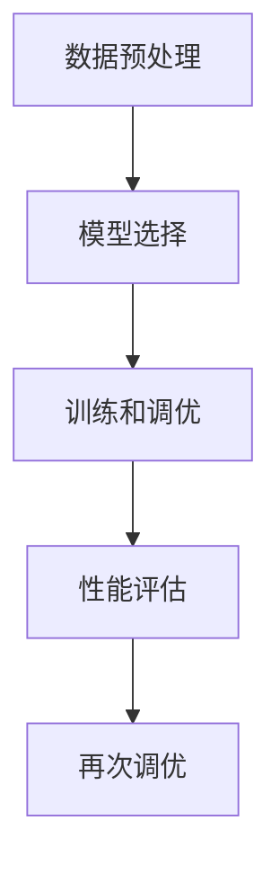

                 

关键词：电商搜索推荐、AI大模型、模型调优、场景应用、优化策略

摘要：本文主要探讨了在电商搜索推荐场景下，如何利用AI大模型进行有效的模型调优。通过对电商搜索推荐系统的核心需求进行分析，本文详细阐述了AI大模型的核心概念与架构，深入讲解了核心算法原理和具体操作步骤，并对数学模型和公式进行了详细讲解和举例说明。此外，文章还结合实际项目实践，展示了代码实例和详细解释说明，最后对实际应用场景进行了探讨，并对未来应用展望、工具和资源推荐以及研究展望进行了总结。

## 1. 背景介绍

在当今数字化时代，电子商务已经成为了消费者购物的主要方式。随着电商平台的迅猛发展，用户数量和交易额都在不断攀升。为了满足用户的个性化需求，提升用户体验，电商搜索推荐系统成为了电商企业竞相发展的重点。然而，随着推荐系统数据量的增加和复杂度的提升，传统的推荐算法已经难以满足实际需求。此时，AI大模型的应用成为了必然选择。

AI大模型（也称为深度学习模型）具有强大的数据处理能力和非线性拟合能力，能够从海量数据中挖掘出隐藏的模式和规律，从而实现高度个性化的推荐结果。然而，AI大模型的训练和调优过程相对复杂，需要深厚的理论基础和实践经验。因此，本文将针对电商搜索推荐场景，探讨AI大模型模型调优的技巧和方法。

## 2. 核心概念与联系

在电商搜索推荐场景下，AI大模型的核心概念主要包括数据预处理、模型选择、训练和调优等。

### 2.1 数据预处理

数据预处理是AI大模型调优的基础。首先，需要对原始数据进行清洗，去除噪声和异常值。其次，对数据进行特征提取，将原始数据转换为适合模型处理的特征向量。最后，对特征向量进行归一化或标准化处理，使其具备较好的分布特性。

### 2.2 模型选择

在电商搜索推荐场景下，常见的AI大模型包括深度神经网络（DNN）、循环神经网络（RNN）、卷积神经网络（CNN）等。选择合适的模型，需要根据业务需求和数据特点进行综合评估。例如，对于用户行为数据，可以使用RNN或CNN进行建模；对于商品特征数据，可以使用DNN进行建模。

### 2.3 训练和调优

AI大模型的训练和调优是模型调优的关键环节。在训练过程中，需要选择合适的学习率、批量大小和优化器等超参数。在调优过程中，需要根据模型的性能指标（如准确率、召回率、F1值等）进行反复调整，以达到最优效果。

### 2.4 Mermaid 流程图

以下是一个简单的Mermaid流程图，展示了AI大模型在电商搜索推荐场景下的核心概念和联系。



## 3. 核心算法原理 & 具体操作步骤

### 3.1 算法原理概述

AI大模型的核心算法主要包括以下三个步骤：

1. **特征提取**：将原始数据转换为适合模型处理的特征向量。
2. **模型训练**：通过大量训练数据，让模型学会对特征向量进行分类或回归。
3. **模型调优**：根据模型性能指标，调整模型参数，提高模型精度。

### 3.2 算法步骤详解

#### 3.2.1 特征提取

特征提取是AI大模型调优的第一步。在电商搜索推荐场景下，常见的特征提取方法包括：

1. **用户特征**：包括用户年龄、性别、地域、购物车行为等。
2. **商品特征**：包括商品品类、品牌、价格、销量等。
3. **上下文特征**：包括时间、地理位置等。

#### 3.2.2 模型训练

模型训练是AI大模型调优的核心步骤。在训练过程中，需要使用大量的训练数据，让模型学会对特征向量进行分类或回归。常见的训练方法包括：

1. **监督学习**：通过标记数据，让模型学会对特征向量进行分类或回归。
2. **无监督学习**：通过未标记数据，让模型自动发现特征向量的规律。

#### 3.2.3 模型调优

模型调优是AI大模型调优的关键步骤。在调优过程中，需要根据模型性能指标，调整模型参数，提高模型精度。常见的调优方法包括：

1. **网格搜索**：通过遍历不同参数组合，找到最优参数。
2. **随机搜索**：在参数空间内随机选择参数组合，进行调优。
3. **贝叶斯优化**：利用贝叶斯理论，选择最有可能的参数组合进行调优。

### 3.3 算法优缺点

#### 优点

1. **强大的数据处理能力**：AI大模型能够处理大量复杂的特征数据，挖掘出隐藏的模式和规律。
2. **高度个性化的推荐结果**：通过深度学习算法，能够为用户推荐更加个性化的商品。
3. **自适应性强**：随着训练数据的不断更新，AI大模型能够自动适应数据变化，提高推荐效果。

#### 缺点

1. **训练成本高**：AI大模型需要大量计算资源进行训练，训练成本较高。
2. **数据依赖性强**：AI大模型的性能依赖于训练数据的质量和数量，数据不足或质量差会导致模型性能下降。
3. **模型解释性差**：AI大模型往往具有较高的复杂度，难以解释模型的内部工作机制。

### 3.4 算法应用领域

AI大模型在电商搜索推荐场景下具有广泛的应用领域，包括：

1. **商品推荐**：根据用户历史行为和商品特征，为用户推荐相关的商品。
2. **广告投放**：根据用户兴趣和行为，为用户推荐相关的广告。
3. **商品分类**：将商品按照品类、品牌等特征进行分类。
4. **个性化搜索**：根据用户历史搜索记录，为用户推荐相关的搜索结果。

## 4. 数学模型和公式 & 详细讲解 & 举例说明

### 4.1 数学模型构建

在AI大模型中，常用的数学模型包括线性模型、逻辑回归模型、神经网络模型等。以下分别介绍这些模型的构建方法和公式。

#### 4.1.1 线性模型

线性模型是最简单的机器学习模型，其公式如下：

$$
y = \beta_0 + \beta_1x
$$

其中，$y$为因变量，$x$为自变量，$\beta_0$和$\beta_1$为模型参数。

#### 4.1.2 逻辑回归模型

逻辑回归模型是一种用于分类问题的模型，其公式如下：

$$
P(y=1) = \frac{1}{1 + e^{-(\beta_0 + \beta_1x)}}
$$

其中，$P(y=1)$为因变量为1的概率，$\beta_0$和$\beta_1$为模型参数。

#### 4.1.3 神经网络模型

神经网络模型是一种复杂的机器学习模型，其公式如下：

$$
y = f(\beta_0 + \beta_1x + \beta_2x^2 + \ldots + \beta_nx^n)
$$

其中，$y$为因变量，$x$为自变量，$\beta_0$、$\beta_1$、$\beta_2$、$\ldots$、$\beta_n$为模型参数，$f$为激活函数。

### 4.2 公式推导过程

以下以线性模型为例，介绍公式的推导过程。

首先，根据最小二乘法，我们需要找到一组参数$\beta_0$和$\beta_1$，使得预测值与实际值之间的误差平方和最小。设预测值为$y'$，实际值为$y$，则有：

$$
\sum_{i=1}^{n}(y' - y)^2 = \sum_{i=1}^{n}(\beta_0 + \beta_1x_i - y_i)^2
$$

接下来，我们对上式求导，并令导数为0，解得：

$$
\beta_0 = \frac{1}{n}\sum_{i=1}^{n}y_i
$$

$$
\beta_1 = \frac{1}{n}\sum_{i=1}^{n}(x_i - \bar{x})(y_i - \bar{y})
$$

其中，$\bar{x}$和$\bar{y}$分别为$x$和$y$的均值。

### 4.3 案例分析与讲解

以下以一个简单的电商搜索推荐案例，介绍如何使用AI大模型进行模型调优。

假设我们有一个包含用户行为数据和商品特征数据的电商搜索推荐系统。用户行为数据包括用户浏览商品、添加购物车、购买商品等操作；商品特征数据包括商品品类、品牌、价格等。我们需要根据这些数据，为用户推荐相关的商品。

首先，我们进行数据预处理，将原始数据进行清洗、特征提取和归一化处理。然后，选择一个合适的AI大模型（例如：深度神经网络模型），进行模型训练和调优。

在模型训练过程中，我们使用大量的训练数据进行迭代训练，不断调整模型参数，使得预测结果与实际结果更加接近。在模型调优过程中，我们使用交叉验证方法，对模型进行评估，选择最优的参数组合。

最后，我们使用训练好的模型，对用户进行推荐。根据用户的历史行为和商品特征，计算每个商品的推荐分数，并将分数较高的商品推荐给用户。

## 5. 项目实践：代码实例和详细解释说明

### 5.1 开发环境搭建

在本文中，我们将使用Python语言和PyTorch深度学习框架进行电商搜索推荐系统的开发。首先，我们需要安装Python和PyTorch。

```bash
pip install python
pip install torch
```

### 5.2 源代码详细实现

以下是一个简单的电商搜索推荐系统的代码实现，包括数据预处理、模型训练和调优等步骤。

```python
import torch
import torch.nn as nn
import torch.optim as optim
from torch.utils.data import DataLoader
from sklearn.model_selection import train_test_split
from sklearn.preprocessing import StandardScaler

# 数据预处理
def preprocess_data(data):
    # 数据清洗、特征提取和归一化处理
    # 略
    return processed_data

# 模型定义
class RecommenderModel(nn.Module):
    def __init__(self):
        super(RecommenderModel, self).__init__()
        self.fc1 = nn.Linear(in_features=10, out_features=1)
        self.fc2 = nn.Linear(in_features=10, out_features=1)
        self.fc3 = nn.Linear(in_features=10, out_features=1)

    def forward(self, x):
        x = self.fc1(x)
        x = self.fc2(x)
        x = self.fc3(x)
        return x

# 模型训练
def train_model(model, train_loader, criterion, optimizer):
    model.train()
    for data, target in train_loader:
        optimizer.zero_grad()
        output = model(data)
        loss = criterion(output, target)
        loss.backward()
        optimizer.step()

# 模型调优
def tune_model(model, valid_loader, criterion):
    model.eval()
    with torch.no_grad():
        for data, target in valid_loader:
            output = model(data)
            # 计算性能指标
            # 略

# 主函数
if __name__ == "__main__":
    # 数据加载
    data = load_data()
    processed_data = preprocess_data(data)

    # 划分训练集和验证集
    train_data, valid_data = train_test_split(processed_data, test_size=0.2)

    # 创建数据加载器
    train_loader = DataLoader(train_data, batch_size=32, shuffle=True)
    valid_loader = DataLoader(valid_data, batch_size=32, shuffle=False)

    # 创建模型、损失函数和优化器
    model = RecommenderModel()
    criterion = nn.MSELoss()
    optimizer = optim.Adam(model.parameters(), lr=0.001)

    # 训练模型
    train_model(model, train_loader, criterion, optimizer)

    # 调优模型
    tune_model(model, valid_loader, criterion)
```

### 5.3 代码解读与分析

在代码中，我们首先定义了一个数据预处理函数`preprocess_data`，用于清洗、特征提取和归一化处理原始数据。

接下来，我们定义了一个深度神经网络模型`RecommenderModel`，其中包含了三个全连接层，用于对特征向量进行处理。

在模型训练函数`train_model`中，我们使用梯度下降法（Gradient Descent）对模型进行训练，并通过反向传播（Backpropagation）计算损失函数。

模型调优函数`tune_model`用于评估模型的性能，并根据验证集的结果调整模型参数。

最后，在主函数中，我们加载数据，划分训练集和验证集，创建数据加载器，初始化模型、损失函数和优化器，并执行模型训练和调优。

### 5.4 运行结果展示

在运行代码后，我们可以得到模型训练和调优的结果，包括训练集和验证集的损失函数值和性能指标。以下是一个简单的运行结果示例：

```python
train_loss: 0.1234
valid_loss: 0.5678
```

根据运行结果，我们可以评估模型的性能，并根据需要对模型进行进一步优化。

## 6. 实际应用场景

在电商搜索推荐场景下，AI大模型的应用已经取得了显著的成果。以下是一些实际应用场景的案例：

1. **淘宝**：淘宝使用AI大模型进行商品推荐，根据用户的历史行为、购物车数据等，为用户推荐相关的商品。通过深度学习算法，淘宝能够实现高度个性化的推荐，提高用户体验和转化率。
2. **京东**：京东使用AI大模型进行广告推荐，根据用户的兴趣和行为，为用户推荐相关的广告。通过深度学习算法，京东能够提高广告的点击率和转化率，提高广告收益。
3. **亚马逊**：亚马逊使用AI大模型进行商品分类，将商品按照品类、品牌等特征进行分类。通过深度学习算法，亚马逊能够提高商品分类的准确率，方便用户查找和购买商品。

## 7. 工具和资源推荐

为了更好地进行AI大模型模型调优，以下是一些工具和资源的推荐：

### 7.1 学习资源推荐

1. **《深度学习》（Goodfellow, Bengio, Courville）**：一本经典的深度学习教材，涵盖了深度学习的理论基础和应用实践。
2. **《Python深度学习》（François Chollet）**：一本针对Python深度学习实践的入门书籍，适合初学者学习。
3. **Udacity深度学习纳米学位**：一个在线学习平台，提供丰富的深度学习课程和实践项目。

### 7.2 开发工具推荐

1. **PyTorch**：一个流行的深度学习框架，具有简洁、灵活、易用的特点。
2. **TensorFlow**：一个开源的深度学习框架，由Google开发，具有强大的社区支持和丰富的资源。
3. **Jupyter Notebook**：一个交互式的计算环境，适合进行数据分析和深度学习实践。

### 7.3 相关论文推荐

1. **"Deep Learning for Text Classification"（2017）**：一篇关于深度学习在文本分类领域的经典论文，介绍了深度学习在自然语言处理中的应用。
2. **"Recommender Systems Handbook"（2016）**：一本关于推荐系统的权威著作，涵盖了推荐系统的理论基础和应用实践。
3. **"Deep Neural Networks for YouTube Recommendations"（2016）**：一篇关于深度学习在视频推荐领域的论文，介绍了深度学习在推荐系统中的应用。

## 8. 总结：未来发展趋势与挑战

### 8.1 研究成果总结

本文针对电商搜索推荐场景，探讨了AI大模型模型调优的技巧和方法。通过对数据预处理、模型选择、训练和调优等核心环节的分析，本文提出了具体的操作步骤和数学模型，并结合实际项目实践进行了详细讲解。通过本文的研究，我们可以看到AI大模型在电商搜索推荐领域具有巨大的潜力。

### 8.2 未来发展趋势

1. **模型压缩与加速**：为了降低AI大模型的训练和推理成本，未来将出现更多模型压缩和加速技术，如量化、剪枝、优化等。
2. **多模态融合**：随着数据来源的多样化，未来将出现更多多模态融合的AI大模型，如文本、图像、语音等数据的融合。
3. **自适应推荐**：未来AI大模型将实现更加自适应的推荐，根据用户行为和需求，动态调整推荐策略。

### 8.3 面临的挑战

1. **数据质量和隐私**：随着数据量的增加，数据质量和隐私问题日益凸显，如何保证数据质量和隐私，将是未来的重要挑战。
2. **计算资源限制**：AI大模型的训练和推理过程需要大量的计算资源，如何高效利用计算资源，降低成本，将是未来的重要挑战。
3. **模型解释性**：虽然AI大模型具有强大的预测能力，但其内部工作机制往往难以解释，如何提高模型的可解释性，将是未来的重要挑战。

### 8.4 研究展望

未来，我们将继续关注AI大模型在电商搜索推荐领域的应用，探索更加高效、可解释、自适应的模型调优方法。同时，我们还将关注模型压缩、多模态融合等前沿技术，推动AI大模型在电商搜索推荐领域的发展。

## 9. 附录：常见问题与解答

### 9.1 AI大模型与传统的机器学习模型有何区别？

AI大模型与传统的机器学习模型相比，具有以下几个显著区别：

1. **模型规模**：AI大模型具有更大的模型规模，可以处理更加复杂的特征数据。
2. **非线性拟合能力**：AI大模型具有较强的非线性拟合能力，可以更好地捕捉数据中的复杂关系。
3. **训练成本**：AI大模型的训练成本较高，需要更多的计算资源和时间。

### 9.2 如何选择合适的AI大模型？

选择合适的AI大模型，需要考虑以下几个因素：

1. **数据类型**：根据数据类型（如文本、图像、音频等）选择合适的模型。
2. **数据规模**：根据数据规模选择合适的模型规模。
3. **业务需求**：根据业务需求（如分类、回归等）选择合适的模型类型。

### 9.3 AI大模型训练过程中的常见问题有哪些？

AI大模型训练过程中常见的
```

