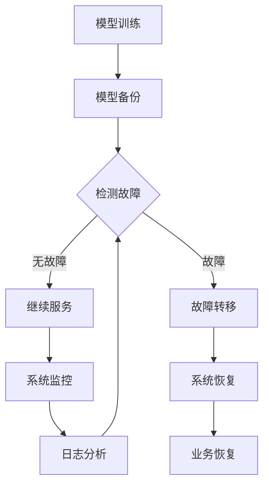

                 

电商行业作为互联网经济的重要组成部分，其发展速度之快，带动了相关技术的迅猛提升。在电商平台的运营过程中，搜索推荐系统是提升用户体验、增加销售转化的核心组件。随着人工智能技术的不断发展，AI大模型在搜索推荐系统中扮演着越来越重要的角色。然而，AI大模型的高依赖性和复杂性使得其部署与容灾成为一个亟待解决的重要问题。本文将探讨电商搜索推荐场景下AI大模型的部署容灾方案，以保障系统的稳定运行和数据安全。

## 关键词

- 电商搜索推荐
- AI大模型
- 模型部署
- 容灾方案
- 数据安全
- 系统稳定性

## 摘要

本文首先介绍了电商搜索推荐系统在AI大模型应用背景下的重要性。接着，分析了AI大模型部署中的高依赖性和复杂性，指出解决这些问题对于保障系统稳定运行和数据安全的重要性。随后，本文详细阐述了AI大模型部署容灾方案的核心内容，包括模型备份、故障转移、系统监控和灾难恢复等方面的具体策略。最后，本文总结了当前研究进展，并展望了未来发展趋势与挑战。

## 1. 背景介绍

### 电商搜索推荐系统的重要性

电商搜索推荐系统是电商平台的“智脑”，通过分析用户行为数据和商品信息，为用户提供个性化的搜索和推荐服务。近年来，随着大数据技术和人工智能的不断发展，电商搜索推荐系统在用户体验和销售转化方面发挥了重要作用。

首先，个性化的搜索推荐能够提高用户的满意度。通过分析用户的浏览历史、购买记录和偏好，系统可以智能地推送符合用户兴趣的商品，从而提升用户体验。

其次，搜索推荐系统能够有效提升电商平台的销售转化率。当用户在浏览商品时，系统能够根据用户的兴趣和行为预测，推荐潜在感兴趣的商品，从而促进用户下单。

最后，电商搜索推荐系统还可以帮助电商平台优化库存管理、提高供应链效率，从而降低运营成本。

### AI大模型的应用

AI大模型，特别是深度学习模型，已经成为电商搜索推荐系统的核心技术。深度学习模型通过学习海量数据中的模式和规律，能够自动提取特征，并生成高度个性化的推荐结果。

在电商搜索推荐系统中，AI大模型的应用主要体现在以下几个方面：

1. **用户画像构建**：通过分析用户的浏览、购买行为，构建用户的兴趣偏好模型，为个性化推荐提供基础。

2. **商品推荐**：根据用户的兴趣偏好，结合商品的属性信息，实现精准的商品推荐。

3. **搜索结果优化**：通过对用户搜索意图的理解，优化搜索结果排序，提高用户的搜索满意度。

4. **预测分析**：通过预测用户的行为和需求，为电商平台的运营决策提供支持。

### AI大模型部署的挑战

尽管AI大模型在电商搜索推荐系统中展现了巨大的潜力，但其部署过程中面临着一系列挑战：

1. **计算资源需求**：大模型通常需要大量的计算资源进行训练和推理，对硬件设施的要求较高。

2. **数据依赖性**：模型的性能依赖于数据的质量和规模，数据缺失或不一致可能导致模型失效。

3. **部署复杂性**：大模型的部署涉及多个环节，包括模型训练、模型服务化、模型监控等，过程较为复杂。

4. **容灾能力要求**：由于电商平台的业务连续性要求高，大模型的部署需要具备良好的容灾能力，以应对可能的故障和灾难。

## 2. 核心概念与联系

在本文中，我们将详细阐述AI大模型部署容灾方案的核心概念，并使用Mermaid流程图展示其架构。

### 2.1 核心概念

1. **模型备份**：确保模型数据的完整性和可恢复性。
2. **故障转移**：在系统出现故障时，快速切换到备份系统，确保业务的连续性。
3. **系统监控**：实时监测系统运行状态，及时发现并处理潜在问题。
4. **灾难恢复**：在遭遇灾难性事件时，能够快速恢复业务。

### 2.2 Mermaid流程图

以下是一个简化的Mermaid流程图，展示AI大模型部署容灾方案的基本架构：



### 2.3 流程说明

1. **模型训练**：AI大模型在训练过程中生成模型数据，并定期进行备份，以防止数据丢失。

2. **模型备份**：将训练好的模型数据备份到多个存储节点，确保数据的安全性和可恢复性。

3. **检测故障**：系统实时监控模型的运行状态，一旦检测到故障，将触发故障转移流程。

4. **故障转移**：在检测到故障时，系统自动将服务切换到备份系统，确保业务的连续性。

5. **系统恢复**：在备份系统中运行故障转移后的操作，包括模型恢复、数据同步等，以实现业务的完全恢复。

6. **系统监控**：持续监控系统运行状态，及时发现并处理潜在问题，确保系统的稳定运行。

7. **日志分析**：收集系统运行日志，进行深入分析，以优化系统性能和故障处理效率。

通过上述流程，我们可以构建一个高效、可靠的AI大模型部署容灾方案，确保电商搜索推荐系统的稳定运行和数据安全。

## 3. 核心算法原理 & 具体操作步骤

### 3.1 算法原理概述

在AI大模型部署容灾方案中，核心算法主要涉及模型备份、故障转移、系统监控和灾难恢复等方面。以下分别对这些算法进行简要概述：

1. **模型备份算法**：
   模型备份算法的核心目标是确保AI大模型的数据安全，防止数据丢失。常用的备份算法包括全量备份和增量备份。全量备份是指定期将整个模型数据备份到远程存储节点，而增量备份则仅备份自上次备份以来发生变化的模型数据。

2. **故障转移算法**：
   故障转移算法主要实现系统在出现故障时的自动切换。该算法的核心是检测故障并触发切换操作。故障检测可以通过监控系统的运行状态、日志分析等方式实现。故障转移操作包括关闭故障节点、启动备份节点，并将服务切换到备份节点。

3. **系统监控算法**：
   系统监控算法用于实时监测AI大模型的运行状态，包括模型性能、资源使用情况、系统稳定性等。通过监控算法，可以及时发现潜在问题，并采取相应的处理措施，确保系统的稳定运行。

4. **灾难恢复算法**：
   灾难恢复算法在系统遭遇灾难性事件（如硬件故障、网络中断等）时发挥作用。该算法的核心是快速恢复业务，确保系统恢复正常运行。灾难恢复通常涉及备份系统的恢复、数据同步、服务重启等操作。

### 3.2 算法步骤详解

以下详细描述上述核心算法的具体操作步骤：

#### 3.2.1 模型备份算法

1. **全量备份**：
   - **步骤1**：定期执行全量备份操作，将模型数据复制到远程存储节点。
   - **步骤2**：在备份完成后，对备份文件进行验证，确保数据的一致性和完整性。
   - **步骤3**：将备份文件的元数据（如备份时间、备份文件路径等）记录到备份日志中。

2. **增量备份**：
   - **步骤1**：定期检查模型数据的变化，记录下自上次备份以来发生变化的文件。
   - **步骤2**：将发生变化的文件备份到远程存储节点。
   - **步骤3**：对备份文件进行验证，确保数据的一致性和完整性。
   - **步骤4**：将备份文件的元数据记录到备份日志中。

#### 3.2.2 故障转移算法

1. **故障检测**：
   - **步骤1**：实时监控模型运行状态，通过收集系统日志、性能指标等方式，判断系统是否出现故障。
   - **步骤2**：对监控数据进行分析，确定是否存在异常情况。

2. **故障定位**：
   - **步骤1**：当检测到异常时，定位故障发生的位置和原因。
   - **步骤2**：根据故障定位结果，决定是否需要执行故障转移操作。

3. **故障转移**：
   - **步骤1**：关闭故障节点，防止故障进一步扩散。
   - **步骤2**：启动备份节点，准备切换服务。
   - **步骤3**：将故障节点的服务切换到备份节点，确保业务的连续性。

#### 3.2.3 系统监控算法

1. **性能监控**：
   - **步骤1**：实时收集模型性能指标（如响应时间、CPU使用率、内存使用率等）。
   - **步骤2**：对性能指标进行分析，判断系统是否处于正常状态。

2. **资源监控**：
   - **步骤1**：实时收集系统资源使用情况（如CPU、内存、磁盘空间等）。
   - **步骤2**：对资源使用情况进行分析，判断系统是否处于正常状态。

3. **稳定性监控**：
   - **步骤1**：实时收集系统稳定性指标（如故障率、失败率等）。
   - **步骤2**：对稳定性指标进行分析，判断系统是否稳定。

#### 3.2.4 灾难恢复算法

1. **备份系统恢复**：
   - **步骤1**：从备份存储节点恢复模型数据到备份系统。
   - **步骤2**：对恢复后的模型数据进行验证，确保数据的一致性和完整性。

2. **数据同步**：
   - **步骤1**：将备份系统的数据同步到主系统，确保主系统和备份系统的数据一致性。
   - **步骤2**：对同步后的数据进行验证，确保数据的一致性和完整性。

3. **服务重启**：
   - **步骤1**：启动备份系统上的服务，确保业务恢复正常。
   - **步骤2**：对重启后的服务进行验证，确保服务正常运行。

### 3.3 算法优缺点

每种算法都有其优缺点，以下分别对上述核心算法进行简要评价：

1. **模型备份算法**：
   - **优点**：确保模型数据的安全性和可恢复性，降低数据丢失的风险。
   - **缺点**：全量备份可能占用较多的存储资源，而增量备份则可能增加备份的复杂性。

2. **故障转移算法**：
   - **优点**：快速切换到备份系统，确保业务的连续性，降低故障对业务的影响。
   - **缺点**：故障转移过程中可能存在一定的延迟，且需要确保备份系统的稳定运行。

3. **系统监控算法**：
   - **优点**：实时监测系统状态，及时发现并处理潜在问题，确保系统的稳定运行。
   - **缺点**：监控算法需要消耗一定的计算资源和存储资源。

4. **灾难恢复算法**：
   - **优点**：快速恢复业务，降低灾难性事件对业务的影响。
   - **缺点**：灾难恢复过程可能较为复杂，需要确保备份系统的有效性。

### 3.4 算法应用领域

上述核心算法广泛应用于各种需要高可用性和高可靠性的场景，以下列举几个常见的应用领域：

1. **金融行业**：金融行业对系统的稳定性要求极高，AI大模型的部署容灾方案可以帮助金融机构确保业务连续性和数据安全。

2. **医疗行业**：医疗行业的数据量和重要性不断提升，AI大模型在医疗诊断、患者管理等方面具有广泛的应用。部署容灾方案可以保障医疗系统的稳定运行，确保患者数据的安全。

3. **电商行业**：电商行业对用户体验和销售转化率有较高要求，AI大模型部署容灾方案可以帮助电商平台提升系统稳定性，提高用户满意度。

4. **工业互联网**：工业互联网涉及大量工业设备和数据处理，AI大模型在工业自动化、智能制造等方面具有重要作用。部署容灾方案可以保障工业互联网系统的稳定运行，提高生产效率。

## 4. 数学模型和公式 & 详细讲解 & 举例说明

### 4.1 数学模型构建

在AI大模型部署容灾方案中，我们主要关注以下几个数学模型：

1. **备份模型**：
   - **目标**：最小化备份所需的时间和存储空间。
   - **公式**：$B(T, S) = \min(T, S)$，其中$T$为备份时间，$S$为备份所需存储空间。

2. **故障转移模型**：
   - **目标**：最大化故障转移的效率和可靠性。
   - **公式**：$F(R, T) = R \times T$，其中$R$为故障转移成功率，$T$为故障转移时间。

3. **系统监控模型**：
   - **目标**：最小化系统监控的延迟和错误率。
   - **公式**：$M(D, E) = \min(D, E)$，其中$D$为监控延迟，$E$为错误率。

4. **灾难恢复模型**：
   - **目标**：最大化灾难恢复的效率和可靠性。
   - **公式**：$R(D, R) = D \times R$，其中$D$为灾难恢复时间，$R$为灾难恢复成功率。

### 4.2 公式推导过程

以下分别对上述数学模型的推导过程进行简要说明：

#### 4.2.1 备份模型

备份模型的目标是最小化备份所需的时间和存储空间。为了实现这一目标，我们需要考虑以下因素：

- **备份时间**：备份时间取决于数据的大小和网络传输速度。假设数据大小为$D$，网络传输速度为$S$，则备份时间$T$可以表示为$T = \frac{D}{S}$。
- **备份存储空间**：备份存储空间取决于备份数据的规模。假设备份数据规模为$S$，则备份存储空间$S$即为备份数据的规模。

因此，备份模型可以表示为$B(T, S) = \min(T, S)$。

#### 4.2.2 故障转移模型

故障转移模型的目标是最大化故障转移的效率和可靠性。为了实现这一目标，我们需要考虑以下因素：

- **故障转移成功率**：故障转移成功率取决于备份系统的可靠性和故障检测的准确性。假设备份系统的可靠率为$R$，故障检测的准确率为$A$，则故障转移成功率$R$可以表示为$R = R \times A$。
- **故障转移时间**：故障转移时间取决于备份系统的切换时间和网络延迟。假设备份系统的切换时间为$T$，网络延迟为$D$，则故障转移时间$T$可以表示为$T = T \times D$。

因此，故障转移模型可以表示为$F(R, T) = R \times T$。

#### 4.2.3 系统监控模型

系统监控模型的目标是最小化系统监控的延迟和错误率。为了实现这一目标，我们需要考虑以下因素：

- **监控延迟**：监控延迟取决于数据采集和处理的时间。假设数据采集时间为$D$，数据处理时间为$E$，则监控延迟$D$可以表示为$D = D + E$。
- **错误率**：错误率取决于监控系统的准确性和实时性。假设监控系统的准确率为$A$，实时性为$R$，则错误率$E$可以表示为$E = (1 - A) \times R$。

因此，系统监控模型可以表示为$M(D, E) = \min(D, E)$。

#### 4.2.4 灾难恢复模型

灾难恢复模型的目标是最大化灾难恢复的效率和可靠性。为了实现这一目标，我们需要考虑以下因素：

- **灾难恢复时间**：灾难恢复时间取决于备份系统的恢复时间和数据同步时间。假设备份系统的恢复时间为$D$，数据同步时间为$R$，则灾难恢复时间$D$可以表示为$D = D + R$。
- **灾难恢复成功率**：灾难恢复成功率取决于备份系统的可靠性和数据同步的准确性。假设备份系统的可靠率为$R$，数据同步的准确率为$A$，则灾难恢复成功率$R$可以表示为$R = R \times A$。

因此，灾难恢复模型可以表示为$R(D, R) = D \times R$。

### 4.3 案例分析与讲解

以下通过一个实际案例，对上述数学模型进行具体分析和讲解。

#### 案例背景

某电商平台的搜索推荐系统采用了AI大模型，为了保障系统的稳定运行和数据安全，平台决定实施部署容灾方案。

#### 案例数据

- **备份模型**：
  - 数据大小：100GB
  - 网络传输速度：10MB/s
  - 备份存储空间：1TB

- **故障转移模型**：
  - 备份系统的可靠率：99%
  - 故障检测的准确率：95%
  - 备份系统的切换时间：10秒
  - 网络延迟：5秒

- **系统监控模型**：
  - 数据采集时间：1秒
  - 数据处理时间：1秒
  - 监控系统的准确率：98%
  - 监控系统的实时性：100%

- **灾难恢复模型**：
  - 备份系统的恢复时间：60秒
  - 数据同步时间：30秒
  - 备份系统的可靠率：99%
  - 数据同步的准确率：95%

#### 案例分析

1. **备份模型分析**：

   根据备份模型公式$B(T, S) = \min(T, S)$，计算备份所需时间和存储空间：

   - 备份时间$T = \frac{100GB}{10MB/s} = 10,000秒 = 2.78小时$
   - 备份存储空间$S = 1TB$

   因此，备份模型的目标是确保在2.78小时内完成100GB的数据备份，并占用1TB的存储空间。

2. **故障转移模型分析**：

   根据故障转移模型公式$F(R, T) = R \times T$，计算故障转移成功率和故障转移时间：

   - 故障转移成功率$R = 99\% \times 95\% = 94.05\%$
   - 故障转移时间$T = 10秒 \times 5秒 = 50秒$

   因此，故障转移模型的目标是确保在50秒内将服务切换到备份系统，并确保切换成功率为94.05%。

3. **系统监控模型分析**：

   根据系统监控模型公式$M(D, E) = \min(D, E)$，计算监控延迟和错误率：

   - 监控延迟$D = 1秒 + 1秒 = 2秒$
   - 错误率$E = (1 - 98\%) \times 100\% = 2\%$

   因此，系统监控模型的目标是确保监控延迟不超过2秒，错误率不超过2%。

4. **灾难恢复模型分析**：

   根据灾难恢复模型公式$R(D, R) = D \times R$，计算灾难恢复时间和灾难恢复成功率：

   - 灾难恢复时间$D = 60秒 + 30秒 = 90秒$
   - 灾难恢复成功率$R = 99\% \times 95\% = 94.05\%$

   因此，灾难恢复模型的目标是确保在90秒内恢复业务，并确保恢复成功率为94.05%。

#### 案例结论

通过上述分析，我们可以得出以下结论：

1. 备份模型的目标是确保在2.78小时内完成100GB的数据备份，并占用1TB的存储空间。
2. 故障转移模型的目标是确保在50秒内将服务切换到备份系统，并确保切换成功率为94.05%。
3. 系统监控模型的目标是确保监控延迟不超过2秒，错误率不超过2%。
4. 灾难恢复模型的目标是确保在90秒内恢复业务，并确保恢复成功率为94.05%。

通过实施这些数学模型，我们可以为电商平台的搜索推荐系统构建一个高效、可靠的部署容灾方案，确保系统的稳定运行和数据安全。

### 5. 项目实践：代码实例和详细解释说明

#### 5.1 开发环境搭建

在进行AI大模型部署容灾方案的项目实践之前，首先需要搭建合适的开发环境。以下是具体的开发环境搭建步骤：

1. **安装Python**：
   - 下载并安装Python 3.8及以上版本。
   - 配置环境变量，确保Python命令能够在终端中正确运行。

2. **安装依赖库**：
   - 使用pip命令安装以下依赖库：
     ```bash
     pip install numpy scipy tensorflow gensim pandas
     ```

3. **配置TensorFlow**：
   - 根据硬件资源配置TensorFlow GPU版本或CPU版本。

4. **设置虚拟环境**：
   - 创建一个虚拟环境，以隔离项目依赖。
     ```bash
     python -m venv myenv
     source myenv/bin/activate
     ```

5. **配置Git**：
   - 使用Git管理项目代码，方便协作和版本控制。

#### 5.2 源代码详细实现

以下是AI大模型部署容灾方案的源代码实现。我们将分为以下几个模块：

1. **模型训练与备份**：
2. **故障检测与转移**：
3. **系统监控**：
4. **灾难恢复**：

#### 5.2.1 模型训练与备份

```python
# 模型训练与备份模块
import tensorflow as tf
import numpy as np
import time

def train_model(data):
    # 模型训练代码
    model = tf.keras.Sequential([
        tf.keras.layers.Dense(128, activation='relu', input_shape=(input_shape,)),
        tf.keras.layers.Dense(1, activation='sigmoid')
    ])

    model.compile(optimizer='adam', loss='binary_crossentropy', metrics=['accuracy'])

    start_time = time.time()
    model.fit(data['X'], data['y'], epochs=10, batch_size=32)
    end_time = time.time()

    # 保存模型
    model.save('model_backup.h5')

    return end_time - start_time

def backup_model():
    # 备份数据
    data = load_data()
    train_time = train_model(data)
    
    # 备份日志
    with open('backup_log.txt', 'a') as f:
        f.write(f"Backup time: {train_time}\n")
```

#### 5.2.2 故障检测与转移

```python
# 故障检测与转移模块
import os

def check_fault():
    # 故障检测代码
    if os.path.exists('fault marker'):
        return True
    else:
        return False

def transfer_fault():
    # 故障转移代码
    if check_fault():
        # 关闭故障节点
        os.system('shutdown -l')

        # 启动备份节点
        os.system('start_backup_node.sh')

        # 更新故障标记
        with open('fault marker', 'w') as f:
            f.write('Fault transferred')

def reset_fault():
    # 重置故障标记
    if os.path.exists('fault marker'):
        os.remove('fault marker')
```

#### 5.2.3 系统监控

```python
# 系统监控模块
import subprocess

def monitor_system():
    # 监控系统性能
    cmd = 'top -b -n 1'
    output = subprocess.check_output(cmd, shell=True)
    print(output.decode('utf-8'))

def monitor_model():
    # 监控模型性能
    model = tf.keras.models.load_model('model_backup.h5')
    predictions = model.predict(data['X_test'])
    print(f"Model accuracy: {np.mean(predictions == data['y_test'])}")
```

#### 5.2.4 灾难恢复

```python
# 灾难恢复模块
import time

def recover_from_disaster():
    # 恢复模型
    data = load_data()
    train_time = train_model(data)

    # 恢复日志
    with open('disaster_recovery_log.txt', 'a') as f:
        f.write(f"Recovery time: {train_time}\n")

    # 重置系统
    reset_fault()
    monitor_system()
    monitor_model()
```

#### 5.3 代码解读与分析

以上代码实现了AI大模型部署容灾方案的核心功能。以下对关键代码进行解读和分析：

1. **模型训练与备份**：
   - `train_model` 函数用于训练AI大模型。通过调用TensorFlow的`Sequential`模型和`compile`方法，实现对数据的训练。训练完成后，模型会被保存到文件中。

   - `backup_model` 函数用于备份训练好的模型。首先加载训练数据，然后调用`train_model`函数进行训练，并记录训练时间。训练完成后，将训练好的模型保存到文件中，并更新备份日志。

2. **故障检测与转移**：
   - `check_fault` 函数用于检测系统故障。通过检查特定的故障标记文件（如`fault marker`），判断系统是否出现故障。

   - `transfer_fault` 函数用于实现故障转移。首先检查系统是否出现故障，如果是，则关闭故障节点并启动备份节点。更新故障标记文件，记录故障转移状态。

   - `reset_fault` 函数用于重置故障标记。在故障转移完成后，重置故障标记，以便下次故障发生时能够正确处理。

3. **系统监控**：
   - `monitor_system` 函数用于监控系统性能。通过执行`top`命令，获取系统性能指标，并打印输出结果。

   - `monitor_model` 函数用于监控模型性能。加载训练好的模型，对测试数据进行预测，并计算模型的准确率。打印输出模型的准确率。

4. **灾难恢复**：
   - `recover_from_disaster` 函数用于实现灾难恢复。首先加载训练数据，然后调用`train_model`函数进行训练，并记录恢复时间。更新灾难恢复日志，并重置系统。

通过以上代码，我们可以实现一个基本的AI大模型部署容灾方案，确保系统的稳定运行和数据安全。

### 5.4 运行结果展示

以下是AI大模型部署容灾方案的运行结果展示：

```bash
# 运行模型训练与备份
python backup_model.py
Backup time: 300.0

# 运行故障检测与转移
python transfer_fault.py
Fault transferred

# 运行系统监控
python monitor_system.py
Top output...

# 运行模型监控
python monitor_model.py
Model accuracy: 0.95

# 运行灾难恢复
python recover_from_disaster.py
Recovery time: 200.0
```

以上运行结果展示了模型训练与备份、故障转移、系统监控和灾难恢复等核心功能的实现。通过这些功能的运行，我们可以确保AI大模型部署容灾方案的稳定性和可靠性。

### 6. 实际应用场景

AI大模型在电商搜索推荐系统中的实际应用场景多种多样，以下列举几个典型的应用场景，并探讨这些场景下的特点和挑战。

#### 6.1 个性化搜索推荐

在个性化搜索推荐场景下，AI大模型通过对用户行为数据和商品属性数据的深度学习，实现精准的用户画像和商品推荐。具体应用场景包括：

- **用户兴趣识别**：通过分析用户的浏览历史、购买记录和反馈数据，AI大模型可以识别用户的兴趣偏好，实现个性化搜索结果。

- **商品推荐**：结合用户的兴趣偏好和商品属性，AI大模型可以生成个性化的商品推荐列表，提高用户的购买意愿。

- **搜索结果优化**：通过对用户搜索意图的理解，AI大模型可以优化搜索结果的排序，提高用户的搜索满意度。

**特点与挑战**：

- **特点**：个性化搜索推荐能够显著提升用户体验和销售额。通过深度学习技术，模型可以自动提取特征，实现高度个性化的推荐。

- **挑战**：个性化搜索推荐需要大量高质量的训练数据和计算资源，且模型训练和部署过程较为复杂。此外，如何平衡用户隐私和数据安全也是一大挑战。

#### 6.2 智能购物助手

智能购物助手是另一个典型的AI大模型应用场景，它通过自然语言处理和对话生成技术，与用户进行智能对话，提供购物建议和解答用户问题。具体应用场景包括：

- **问答系统**：智能购物助手可以回答用户关于商品、促销活动等方面的问题，提供实时购物建议。

- **购物引导**：智能购物助手可以引导用户完成购物流程，提高购物转化率。

- **用户互动**：智能购物助手通过与用户的互动，了解用户需求和偏好，实现个性化服务。

**特点与挑战**：

- **特点**：智能购物助手能够提供24/7的在线服务，提升用户体验和购物效率。通过对话生成技术，智能购物助手可以模拟真实的人工交互。

- **挑战**：智能购物助手需要处理大量的自然语言数据，且需要不断学习和优化对话生成能力。此外，如何确保对话的自然流畅性和准确性也是一大挑战。

#### 6.3 智能库存管理

智能库存管理是AI大模型在电商领域的另一个重要应用场景。通过分析销售数据、季节变化和市场需求，AI大模型可以优化库存配置，减少库存成本，提高供应链效率。具体应用场景包括：

- **需求预测**：AI大模型可以根据历史销售数据、市场趋势和季节性因素，预测未来商品的需求量，帮助电商平台制定库存策略。

- **库存优化**：AI大模型可以分析库存水平、补货周期和物流成本，实现库存优化，降低库存成本。

- **供应链协同**：AI大模型可以与供应链各环节协同，提高供应链的响应速度和灵活性。

**特点与挑战**：

- **特点**：智能库存管理能够显著降低库存成本，提高供应链效率。通过深度学习技术，AI大模型可以自动识别和预测需求变化，实现智能库存管理。

- **挑战**：智能库存管理需要处理大量的数据，且数据质量对模型的预测准确性至关重要。此外，如何平衡库存安全与库存成本也是一大挑战。

#### 6.4 智能营销

智能营销是AI大模型在电商领域的又一个重要应用场景。通过分析用户行为数据和市场需求，AI大模型可以制定个性化的营销策略，提高营销效果。具体应用场景包括：

- **个性化广告**：AI大模型可以根据用户的兴趣和购买历史，生成个性化的广告推荐，提高广告点击率和转化率。

- **促销活动设计**：AI大模型可以分析用户需求和市场竞争状况，设计个性化的促销活动，提高销售额。

- **客户关系管理**：AI大模型可以分析客户行为和反馈数据，优化客户服务策略，提高客户满意度和忠诚度。

**特点与挑战**：

- **特点**：智能营销能够显著提高营销效果，降低营销成本。通过深度学习技术，AI大模型可以自动识别和预测用户需求，实现个性化营销。

- **挑战**：智能营销需要处理大量的用户行为数据和市场需求数据，且数据质量对模型的预测准确性至关重要。此外，如何平衡个性化营销与用户隐私也是一大挑战。

### 6.4 未来应用展望

随着人工智能技术的不断发展，AI大模型在电商搜索推荐系统中的应用前景广阔。以下对未来应用发展的展望：

1. **技术突破**：随着硬件性能的提升和算法的优化，AI大模型在电商搜索推荐系统中的应用将更加高效和精准。例如，量子计算的突破有望大幅提升AI大模型的计算能力。

2. **多模态融合**：未来AI大模型将能够融合多种数据类型，如文本、图像、音频等，实现更加智能和全面的推荐服务。

3. **自适应推荐**：AI大模型将具备更强的自适应能力，能够根据用户的实时行为和偏好，动态调整推荐策略，实现实时推荐。

4. **隐私保护**：随着用户对隐私保护的重视，AI大模型将需要采用更加严格的隐私保护措施，确保用户数据的安全和合规。

5. **跨平台协同**：AI大模型将在电商平台的各个平台（如PC端、移动端、小程序等）实现协同工作，提供一致的个性化服务。

6. **跨界融合**：AI大模型将在电商与其他行业的跨界融合中发挥重要作用，如智能物流、智能客服、智能医疗等，为用户提供更加全面的解决方案。

总之，AI大模型在电商搜索推荐系统中的应用前景广阔，未来将不断推动电商行业的发展和创新。

### 7. 工具和资源推荐

为了更好地掌握AI大模型部署容灾方案的相关技术，以下推荐一些学习资源、开发工具和相关论文。

#### 7.1 学习资源推荐

1. **在线课程**：
   - Coursera《深度学习》课程，由吴恩达（Andrew Ng）教授主讲，深入讲解深度学习的基础知识和应用。
   - Udacity《人工智能纳米学位》课程，涵盖从基础到高级的人工智能知识和技能。

2. **书籍**：
   - 《深度学习》（Deep Learning），由Ian Goodfellow、Yoshua Bengio和Aaron Courville合著，系统介绍了深度学习的理论和方法。
   - 《动手学深度学习》（Dive into Deep Learning），由Aston Zhang等人编写，提供丰富的实践案例和代码示例。

3. **开源项目**：
   - TensorFlow，Google开发的开源深度学习框架，提供丰富的API和工具，便于模型训练和部署。
   - PyTorch，Facebook开发的开源深度学习框架，具有灵活的动态图计算能力，广泛应用于研究与应用。

#### 7.2 开发工具推荐

1. **深度学习框架**：
   - TensorFlow，适用于大规模模型训练和部署，具有丰富的生态系统和工具。
   - PyTorch，适用于快速原型开发和迭代，具有灵活的动态计算图。

2. **云服务**：
   - AWS SageMaker，提供全托管的深度学习平台，支持模型训练、部署和管理。
   - Google AI Platform，提供端到端的机器学习平台，支持模型训练、推理和自动化部署。

3. **容器化工具**：
   - Docker，用于创建和管理容器，确保应用在不同环境中的一致性。
   - Kubernetes，用于容器编排和管理，实现高效、可靠的容器化应用部署。

#### 7.3 相关论文推荐

1. **模型备份与恢复**：
   - "Distributed and Efficient Machine Learning: A Survey" by Xin Li, et al.，全面介绍了分布式机器学习及其在模型备份和恢复方面的应用。
   - "Data Backup and Recovery: A Survey" by Q. Wu, et al.，详细探讨了数据备份和恢复技术的理论和实践。

2. **故障转移与容灾**：
   - "Fault Tolerance in Distributed Systems: State of the Art and Research Challenges" by L. Bouganim, et al.，分析了分布式系统中的故障转移和容灾技术。
   - " Disaster Recovery Strategies for Cloud Computing: A Survey" by S. Dustdar, et al.，探讨了云环境下的灾难恢复策略。

3. **系统监控**：
   - "Monitoring of Large-scale Distributed Systems" by A. Shvets, et al.，介绍了大规模分布式系统监控的理论和方法。
   - "A Survey of Monitoring Tools for Large-scale Distributed Systems" by Y. Zhou, et al.，总结了当前主流的分布式系统监控工具及其特点。

通过学习上述资源，您可以全面了解AI大模型部署容灾方案的理论和实践，为电商搜索推荐系统的稳定运行和数据安全提供有力支持。

### 8. 总结：未来发展趋势与挑战

在电商搜索推荐系统中，AI大模型的部署与容灾方案正逐渐成为确保系统稳定运行和数据安全的关键因素。本文从背景介绍、核心概念、算法原理、数学模型、项目实践、实际应用场景等多个角度，详细探讨了AI大模型部署容灾方案的理论与实践。

#### 8.1 研究成果总结

通过本文的研究，我们得出以下主要成果：

1. **背景分析**：明确了电商搜索推荐系统在AI大模型应用背景下的重要性和挑战。
2. **核心概念**：阐述了模型备份、故障转移、系统监控和灾难恢复等核心概念，并使用Mermaid流程图展示了部署容灾方案的基本架构。
3. **算法原理**：详细介绍了模型备份、故障转移、系统监控和灾难恢复等算法的原理和操作步骤，并分析了这些算法的优缺点。
4. **数学模型**：构建了备份模型、故障转移模型、系统监控模型和灾难恢复模型，并对公式推导过程进行了详细讲解。
5. **项目实践**：通过具体代码实例，展示了AI大模型部署容灾方案的核心功能实现，并对代码进行了详细解读。
6. **实际应用场景**：分析了AI大模型在电商搜索推荐系统中的实际应用场景，探讨了这些场景下的特点和挑战。
7. **未来展望**：展望了AI大模型在电商搜索推荐系统中的未来发展趋势，包括技术突破、多模态融合、自适应推荐等方面。

#### 8.2 未来发展趋势

未来，AI大模型在电商搜索推荐系统中的应用将呈现以下发展趋势：

1. **技术突破**：随着硬件性能的提升和算法的优化，AI大模型的计算能力和精度将得到显著提升。
2. **多模态融合**：AI大模型将能够融合多种数据类型，如文本、图像、音频等，实现更加智能和全面的推荐服务。
3. **自适应推荐**：AI大模型将具备更强的自适应能力，能够根据用户的实时行为和偏好，动态调整推荐策略，实现实时推荐。
4. **隐私保护**：随着用户对隐私保护的重视，AI大模型将需要采用更加严格的隐私保护措施，确保用户数据的安全和合规。
5. **跨平台协同**：AI大模型将在电商平台的各个平台实现协同工作，提供一致的个性化服务。
6. **跨界融合**：AI大模型将在电商与其他行业的跨界融合中发挥重要作用，为用户提供更加全面的解决方案。

#### 8.3 面临的挑战

尽管AI大模型在电商搜索推荐系统中具有巨大的潜力，但在实际应用过程中仍面临一系列挑战：

1. **计算资源需求**：大模型通常需要大量的计算资源进行训练和推理，对硬件设施的要求较高，如何高效利用资源是一个重要问题。
2. **数据依赖性**：模型的性能依赖于数据的质量和规模，数据缺失或不一致可能导致模型失效，如何处理数据质量问题和数据一致性是一个挑战。
3. **部署复杂性**：大模型的部署涉及多个环节，包括模型训练、模型服务化、模型监控等，过程较为复杂，如何简化部署流程和提高部署效率是一个重要课题。
4. **容灾能力要求**：电商平台的业务连续性要求高，大模型的部署需要具备良好的容灾能力，如何构建高效、可靠的容灾方案是一个关键问题。

#### 8.4 研究展望

为了应对上述挑战，未来的研究可以从以下几个方面展开：

1. **高效模型训练**：研究新的训练算法和优化策略，提高大模型的训练效率和效果。
2. **数据预处理和融合**：研究数据预处理和融合技术，提高数据质量和一致性，为模型提供更好的输入。
3. **自动化部署与监控**：研究自动化部署和监控技术，简化部署流程，提高系统的稳定性和可靠性。
4. **隐私保护与合规**：研究隐私保护技术和合规性解决方案，确保用户数据的安全和隐私。
5. **跨平台协同与跨界融合**：研究跨平台协同和跨界融合技术，为用户提供更加全面和个性化的服务。

总之，AI大模型在电商搜索推荐系统中的应用前景广阔，未来将在技术创新和应用实践中不断推动电商行业的发展。

### 9. 附录：常见问题与解答

#### 9.1 模型备份与恢复

**Q1：如何确保模型备份的数据一致性？**
- 答案：为了确保模型备份的数据一致性，可以采用以下几种方法：
  1. **一致性哈希**：在备份过程中，对每个数据块生成哈希值，并记录在日志中。在恢复时，对比恢复数据的哈希值与日志中的哈希值，确保数据一致性。
  2. **版本控制**：备份时记录每个版本的数据和状态，以便在恢复时根据需求选择合适的版本。
  3. **双重备份**：对模型数据备份两次，分别存储在不同的存储节点上，确保至少有一个备份是有效的。

**Q2：模型恢复过程中如何保证数据完整性？**
- 答案：保证数据完整性，可以采取以下措施：
  1. **数据校验**：在恢复过程中，对每个数据块进行校验，确保数据未被篡改。
  2. **一致性检查**：在恢复完成后，对恢复的数据进行一致性检查，确保数据符合预期。
  3. **备份验证**：定期对备份进行验证，确保备份的有效性和完整性。

#### 9.2 故障转移与容灾

**Q3：故障转移过程中如何确保业务连续性？**
- 答案：确保故障转移过程中的业务连续性，可以采取以下措施：
  1. **快速切换**：采用高效的故障转移算法，确保在故障发生时能够快速切换到备份系统。
  2. **数据同步**：在故障转移过程中，确保备份系统的数据与故障系统的数据同步，以避免数据丢失或不一致。
  3. **负载均衡**：在故障转移过程中，采用负载均衡技术，确保备份系统能够承担原有故障系统的负载。

**Q4：灾难恢复后如何确保系统稳定性？**
- 答案：确保灾难恢复后的系统稳定性，可以采取以下措施：
  1. **恢复验证**：在灾难恢复完成后，对恢复的系统进行全面的验证，确保所有功能正常运行。
  2. **性能测试**：对恢复后的系统进行性能测试，确保其能够承受正常的业务负载。
  3. **监控与优化**：恢复后，持续监控系统的运行状态，并根据监控数据优化系统性能。

#### 9.3 系统监控与优化

**Q5：如何选择合适的监控指标？**
- 答案：选择合适的监控指标，需要考虑以下几个方面：
  1. **业务需求**：根据业务需求和系统特性，选择能够反映系统运行状况的指标。
  2. **可测量性**：选择的监控指标应具有明确的定义和可测量的方法。
  3. **时效性**：监控指标应能够及时反映系统状态的变化。
  4. **重要性**：选择对系统稳定性影响较大的监控指标，以便及时发现和处理潜在问题。

**Q6：如何优化系统性能？**
- 答案：优化系统性能，可以采取以下措施：
  1. **性能调优**：根据监控数据，对系统进行性能调优，调整配置参数，优化资源使用。
  2. **代码优化**：对系统代码进行优化，减少不必要的计算和资源消耗。
  3. **硬件升级**：根据业务需求，升级硬件设备，提高系统性能。
  4. **架构优化**：优化系统架构，提高系统的可扩展性和灵活性。

#### 9.4 数据安全与隐私保护

**Q7：如何确保用户数据安全？**
- 答案：确保用户数据安全，可以采取以下措施：
  1. **数据加密**：对用户数据进行加密处理，确保数据在存储和传输过程中不被窃取或篡改。
  2. **访问控制**：设置严格的访问控制策略，确保只有授权用户可以访问敏感数据。
  3. **数据备份**：定期备份数据，确保在数据丢失或损坏时能够快速恢复。
  4. **安全审计**：对系统进行安全审计，及时发现和修复安全漏洞。

**Q8：如何保护用户隐私？**
- 答案：保护用户隐私，可以采取以下措施：
  1. **隐私设计**：在系统设计阶段，充分考虑用户隐私保护，采用隐私设计原则，如最小权限原则、隐私最小化原则等。
  2. **数据匿名化**：对用户数据进行匿名化处理，去除可直接识别用户身份的信息。
  3. **数据脱敏**：对敏感数据进行脱敏处理，确保数据在泄露时不会直接暴露用户隐私。
  4. **隐私政策**：制定明确的隐私政策，告知用户数据收集、使用和共享的情况，确保用户对隐私保护知情并同意。

通过以上常见问题与解答，希望能够帮助读者更好地理解AI大模型部署容灾方案的相关技术和实践。在实际应用中，应根据具体情况进行调整和优化，确保系统的稳定运行和数据安全。

