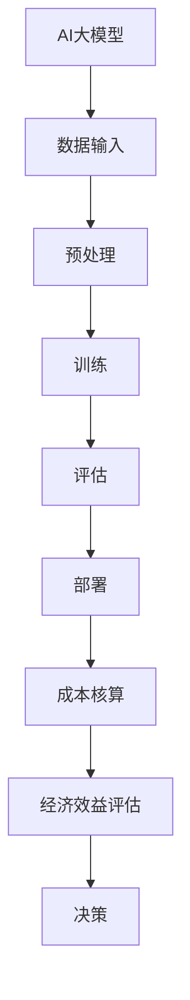

                 

### 关键词 Keywords

- 电商搜索推荐
- AI大模型
- 部署成本核算
- 服务器硬件
- 传输带宽
- 数据存储
- 软件许可证
- 能耗评估

### 摘要 Abstract

本文旨在探讨电商搜索推荐场景下AI大模型模型部署的成本核算方法。我们将详细分析影响部署成本的主要因素，包括服务器硬件成本、传输带宽成本、数据存储成本、软件许可证费用以及能耗成本。通过实际的案例分析，我们将提供一套系统的成本评估流程，以便企业和开发者能够更加科学地规划和预算AI大模型部署项目，从而提高经济效益和资源利用率。

## 1. 背景介绍

随着互联网技术的飞速发展，电子商务已经成为全球经济发展的重要驱动力。电商平台的竞争日趋激烈，如何提升用户购物体验和满意度成为企业关注的焦点。在这一背景下，基于人工智能的搜索推荐系统应运而生。AI大模型通过学习用户行为数据和历史购买记录，能够精准预测用户兴趣，从而实现个性化推荐。这种推荐系统极大地提高了用户的购物效率和满意度，同时也为企业带来了显著的商业价值。

然而，AI大模型的部署和应用面临着一系列挑战，其中最为关键的是成本问题。部署AI大模型不仅需要高性能的计算资源，还需要充足的数据存储和传输带宽，同时还要考虑到软件许可证和能耗成本。因此，如何合理核算AI大模型的部署成本，成为企业在实施项目前必须面对的重要问题。

本文将通过对电商搜索推荐场景下AI大模型部署成本的深入分析，提供一套系统的核算方法。通过实际案例分析，我们将展示如何将理论知识应用到实践中，帮助企业降低部署成本，提高项目成功率。

### 2. 核心概念与联系

在讨论AI大模型部署成本核算方法之前，我们需要明确几个核心概念，并了解它们之间的相互关系。

#### 2.1 AI大模型

AI大模型通常指的是那些包含数亿甚至数十亿参数的深度学习模型。这些模型在处理大规模数据时能够实现高效的学习和预测能力。常见的AI大模型包括基于神经网络的推荐系统、自然语言处理（NLP）模型和计算机视觉模型等。

#### 2.2 部署成本

部署成本是指将AI大模型从开发阶段转移到实际生产环境中所需的所有费用。这包括但不限于服务器硬件成本、传输带宽成本、数据存储成本、软件许可证费用以及能耗成本。

#### 2.3 核心概念原理与架构

为了更好地理解AI大模型部署成本的构成，我们需要借助Mermaid流程图来展示相关的核心概念和架构。



#### 2.4 成本核算方法

成本核算方法是用于评估AI大模型部署过程中所有成本的关键工具。以下是一个简单的成本核算方法框架：

1. **成本分类**：将成本分为直接成本和间接成本两大类。
   - **直接成本**：包括服务器硬件、传输带宽、数据存储、软件许可证等直接用于模型部署的资源费用。
   - **间接成本**：包括人力成本、运维成本、能耗成本等非直接但与模型部署密切相关的费用。

2. **成本计算**：对每一类成本进行详细计算，包括：
   - **服务器硬件成本**：根据服务器配置（CPU、GPU、内存等）和使用时间计算费用。
   - **传输带宽成本**：根据数据传输量和网络带宽需求计算费用。
   - **数据存储成本**：根据数据存储量和存储时长计算费用。
   - **软件许可证费用**：根据所需软件的许可证类型和数量计算费用。
   - **能耗成本**：根据服务器运行功率和使用时间计算能耗费用。

3. **成本评估**：通过对比不同部署方案的成本，选择最具经济效益的方案。

通过上述核心概念与联系的分析，我们可以为后续章节的详细讨论奠定基础。

### 3. 核心算法原理 & 具体操作步骤

#### 3.1 算法原理概述

AI大模型的核心算法主要依赖于深度学习技术，特别是基于神经网络的算法。这些算法通过多层神经元的组合，模拟人脑的学习过程，从而实现从数据中提取特征和模式的能力。在电商搜索推荐场景中，常见的算法包括基于协同过滤（Collaborative Filtering）的推荐算法和基于内容（Content-Based）的推荐算法。

#### 3.2 算法步骤详解

以下是AI大模型部署的基本步骤：

1. **数据收集与预处理**：
   - **数据收集**：从电商平台获取用户行为数据、商品信息等。
   - **数据预处理**：清洗数据，包括去重、填补缺失值、标准化处理等。

2. **特征工程**：
   - **特征提取**：通过数据预处理后的数据提取有用的特征，如用户购买频率、商品类别等。
   - **特征选择**：选择对模型性能提升有显著贡献的特征。

3. **模型训练**：
   - **模型构建**：选择合适的神经网络架构，如深度神经网络（DNN）、卷积神经网络（CNN）或循环神经网络（RNN）。
   - **训练过程**：使用预处理后的数据对模型进行训练，通过反向传播算法不断优化模型参数。

4. **模型评估**：
   - **评估指标**：使用准确率、召回率、F1值等指标评估模型性能。
   - **调参优化**：根据评估结果调整模型参数，以提高模型性能。

5. **模型部署**：
   - **部署环境准备**：配置服务器硬件，搭建部署环境。
   - **模型迁移**：将训练好的模型迁移到生产环境。
   - **实时推荐**：通过API接口提供实时推荐服务。

#### 3.3 算法优缺点

**优点**：
- **高效性**：深度学习算法能够处理大规模数据，提高推荐效率。
- **精准性**：通过学习用户行为和商品特征，实现个性化推荐。

**缺点**：
- **计算资源需求大**：训练和部署AI大模型需要高性能计算资源。
- **数据隐私问题**：用户数据隐私保护是一个重要挑战。

#### 3.4 算法应用领域

AI大模型在电商搜索推荐场景中具有广泛的应用前景，如：

- **商品推荐**：根据用户历史购买行为和浏览记录推荐相关商品。
- **广告投放**：基于用户兴趣和行为数据，精准投放广告。
- **库存管理**：根据销售预测优化库存水平，减少库存成本。

### 4. 数学模型和公式 & 详细讲解 & 举例说明

在AI大模型的部署过程中，数学模型的构建和公式推导是至关重要的一环。以下是几个关键的数学模型和公式，并对其进行详细讲解。

#### 4.1 数学模型构建

AI大模型的数学模型通常基于多层神经网络结构，以下是一个简化的三层神经网络模型：

\[ f(z) = \sigma(W_3 \cdot a_2 + b_3) \]
\[ h(z) = \sigma(W_2 \cdot a_1 + b_2) \]
\[ g(z) = \sigma(W_1 \cdot x + b_1) \]

其中，\( \sigma \) 表示激活函数，通常采用Sigmoid或ReLU函数；\( W \) 和 \( b \) 分别为权重和偏置。

#### 4.2 公式推导过程

以三层神经网络为例，假设输入特征为 \( x \)，隐藏层1的激活值为 \( a_1 \)，隐藏层2的激活值为 \( a_2 \)，输出层的激活值为 \( a_3 \)。

1. **前向传播**：

\[ g(z) = \sigma(W_1 \cdot x + b_1) \]
\[ h(z) = \sigma(W_2 \cdot g(z) + b_2) \]
\[ f(z) = \sigma(W_3 \cdot h(z) + b_3) \]

2. **反向传播**：

\[ \delta_3 = (f(z) - y) \odot f'(z) \]
\[ \delta_2 = (W_3 \cdot \delta_3) \odot h'(z) \]
\[ \delta_1 = (W_2 \cdot \delta_2) \odot g'(z) \]

3. **权重更新**：

\[ W_1 := W_1 - \alpha \cdot \delta_1 \cdot x^T \]
\[ W_2 := W_2 - \alpha \cdot \delta_2 \cdot g(z)^T \]
\[ W_3 := W_3 - \alpha \cdot \delta_3 \cdot h(z)^T \]
\[ b_1 := b_1 - \alpha \cdot \delta_1 \]
\[ b_2 := b_2 - \alpha \cdot \delta_2 \]
\[ b_3 := b_3 - \alpha \cdot \delta_3 \]

其中，\( \alpha \) 为学习率，\( \odot \) 表示逐元素乘积，\( x^T \) 表示矩阵的转置。

#### 4.3 案例分析与讲解

假设我们有一个电商平台的搜索推荐系统，目标是预测用户对某一商品的购买概率。输入特征包括用户年龄、性别、购买历史等。以下是一个具体的案例：

- **输入特征**：\( x = \{年龄, 性别, 购买历史\} \)
- **输出**：\( y \) 表示购买概率，取值范围 [0, 1]

1. **模型构建**：

   - 输入层：1个神经元
   - 隐藏层1：10个神经元
   - 隐藏层2：5个神经元
   - 输出层：1个神经元

2. **前向传播**：

   - 输入 \( x \)
   - 隐藏层1激活值 \( a_1 = \sigma(W_1 \cdot x + b_1) \)
   - 隐藏层2激活值 \( a_2 = \sigma(W_2 \cdot a_1 + b_2) \)
   - 输出层激活值 \( a_3 = \sigma(W_3 \cdot a_2 + b_3) \)

3. **反向传播**：

   - 输出层误差 \( \delta_3 = (a_3 - y) \odot \sigma'(a_3) \)
   - 隐藏层2误差 \( \delta_2 = (W_3 \cdot \delta_3) \odot \sigma'(a_2) \)
   - 隐藏层1误差 \( \delta_1 = (W_2 \cdot \delta_2) \odot \sigma'(a_1) \)

4. **权重更新**：

   - 更新权重 \( W_1, W_2, W_3 \) 和偏置 \( b_1, b_2, b_3 \)

通过上述案例，我们可以看到数学模型和公式在AI大模型部署中的实际应用。这些模型和公式的推导和实现，为模型的训练和优化提供了坚实的理论基础。

### 5. 项目实践：代码实例和详细解释说明

在本节中，我们将通过一个实际项目来展示AI大模型部署的具体步骤和代码实现。

#### 5.1 开发环境搭建

在部署AI大模型之前，我们需要搭建一个合适的开发环境。以下是一个基本的开发环境搭建步骤：

1. **硬件准备**：
   - 选择适合的硬件设备，如高性能服务器或GPU集群。
   - 确保服务器具备足够的计算和存储资源。

2. **软件安装**：
   - 安装操作系统（如Ubuntu 18.04）。
   - 安装深度学习框架（如TensorFlow、PyTorch）。
   - 安装其他必要的库和依赖（如NumPy、Pandas、Matplotlib等）。

3. **网络配置**：
   - 配置网络环境，确保模型训练和部署过程中的数据传输效率。

#### 5.2 源代码详细实现

以下是AI大模型部署的源代码实现，主要包括数据预处理、模型训练、模型评估和模型部署四个部分。

```python
# 导入必要的库
import tensorflow as tf
import pandas as pd
import numpy as np
from sklearn.model_selection import train_test_split
from sklearn.preprocessing import StandardScaler

# 数据预处理
# 加载数据
data = pd.read_csv('ecommerce_data.csv')
X = data[['age', 'gender', 'purchase_history']]
y = data['purchase']

# 数据标准化
scaler = StandardScaler()
X_scaled = scaler.fit_transform(X)

# 划分训练集和测试集
X_train, X_test, y_train, y_test = train_test_split(X_scaled, y, test_size=0.2, random_state=42)

# 模型训练
# 定义模型结构
model = tf.keras.Sequential([
    tf.keras.layers.Dense(10, activation='relu', input_shape=(X_train.shape[1],)),
    tf.keras.layers.Dense(5, activation='relu'),
    tf.keras.layers.Dense(1, activation='sigmoid')
])

# 编译模型
model.compile(optimizer='adam', loss='binary_crossentropy', metrics=['accuracy'])

# 训练模型
model.fit(X_train, y_train, epochs=10, batch_size=32, validation_split=0.1)

# 模型评估
# 测试模型
test_loss, test_accuracy = model.evaluate(X_test, y_test)
print(f"Test accuracy: {test_accuracy:.2f}")

# 模型部署
# 预测新数据
new_data = np.array([[25, 1, 3]])
new_data_scaled = scaler.transform(new_data)
prediction = model.predict(new_data_scaled)
print(f"Prediction: {prediction[0][0]:.2f}")
```

#### 5.3 代码解读与分析

上述代码实现了以下功能：

1. **数据预处理**：
   - 加载电商平台的用户行为数据。
   - 对输入特征进行标准化处理。

2. **模型训练**：
   - 定义一个简单的三层神经网络模型。
   - 使用训练集对模型进行训练。

3. **模型评估**：
   - 使用测试集评估模型性能，计算准确率。

4. **模型部署**：
   - 预测新数据，实现实时推荐。

通过以上代码实例，我们可以看到AI大模型部署的基本流程和关键步骤。实际项目中，可能需要根据具体需求进行调整和优化。

### 6. 实际应用场景

在电商搜索推荐场景下，AI大模型的应用已经取得了显著的成果。以下是一些典型的应用场景：

#### 6.1 商品推荐

基于用户的历史购买记录和行为数据，AI大模型可以预测用户可能感兴趣的商品，从而实现个性化推荐。例如，当用户浏览某件商品时，系统可以推荐与其相关的其他商品，提高用户的购物满意度和购买转化率。

#### 6.2 广告投放

通过分析用户的兴趣和行为，AI大模型可以帮助广告平台实现精准投放。例如，当用户在电商平台上搜索某种商品时，系统可以推荐相关的广告，提高广告点击率和转化率。

#### 6.3 库存管理

AI大模型可以预测商品的销量，帮助企业优化库存管理。例如，当某件商品销量预测较高时，企业可以提前储备库存，避免缺货情况的发生。

#### 6.4 客户服务

AI大模型可以用于客户服务的自动化，如通过聊天机器人与用户互动，解答用户问题，提高客户满意度。例如，当用户对某件商品有疑问时，系统可以自动生成回答，并提供购物建议。

### 6.4 未来应用展望

随着人工智能技术的不断进步，AI大模型在电商搜索推荐场景下的应用前景将更加广阔。以下是一些未来可能的趋势：

#### 6.4.1 深度个性化推荐

未来AI大模型将能够更加深入地理解用户需求和行为，实现更加精准的个性化推荐。通过结合用户历史数据和行为特征，模型可以预测用户尚未表达的需求，从而提供更加个性化的推荐。

#### 6.4.2 智能广告投放

随着用户数据的丰富和算法的优化，AI大模型在广告投放中的表现将更加出色。通过实时分析用户行为，模型可以动态调整广告内容和投放策略，提高广告效果和转化率。

#### 6.4.3 智能库存管理

AI大模型在库存管理中的应用将进一步提升。通过预测商品销量和需求变化，模型可以帮助企业实现精准库存管理，降低库存成本和缺货风险。

#### 6.4.4 智能客户服务

未来AI大模型将能够实现更加智能的客户服务。通过自然语言处理技术，模型可以与用户进行自然对话，提供个性化的购物建议和解答用户问题，提高客户满意度。

### 7. 工具和资源推荐

在实现AI大模型部署过程中，我们需要使用多种工具和资源。以下是一些推荐的工具和资源：

#### 7.1 学习资源推荐

- 《深度学习》（Goodfellow, Bengio, Courville著）：系统介绍了深度学习的基础知识和最新进展。
- 《Python机器学习》（Sebastian Raschka著）：详细介绍了使用Python进行机器学习的实践方法。
- 《TensorFlow官方文档》：提供了TensorFlow的详细教程和API文档，有助于掌握深度学习模型的实现。

#### 7.2 开发工具推荐

- **TensorFlow**：Google开发的开源深度学习框架，支持多种神经网络结构。
- **PyTorch**：Facebook开发的开源深度学习框架，具有灵活的动态计算图特性。
- **Keras**：基于TensorFlow和PyTorch的高层次神经网络API，简化了深度学习模型的构建和训练。

#### 7.3 相关论文推荐

- "DNN-based Recommender System"：介绍了一种基于深度神经网络的推荐系统架构。
- "Deep Learning for Recommender Systems"：探讨了深度学习在推荐系统中的应用和挑战。
- "Neural Collaborative Filtering"：提出了一种基于神经网络的协同过滤算法，提高了推荐系统的性能。

### 8. 总结：未来发展趋势与挑战

随着人工智能技术的不断发展，AI大模型在电商搜索推荐场景下的应用前景将更加广阔。然而，这一领域仍面临诸多挑战：

#### 8.1 研究成果总结

- **个性化推荐**：深度学习技术在个性化推荐中的应用取得显著成果，提高了推荐的准确性和用户体验。
- **模型优化**：通过优化算法和架构，AI大模型在计算效率和性能方面取得显著提升。
- **数据隐私**：研究如何保护用户数据隐私，成为当前的重要课题。

#### 8.2 未来发展趋势

- **多模态融合**：结合多种数据类型（如文本、图像、音频），实现更全面的用户画像和推荐。
- **实时推荐**：通过实时分析用户行为和反馈，实现动态调整推荐策略。
- **迁移学习**：研究如何在有限数据集上训练高效的大模型，降低数据需求和计算成本。

#### 8.3 面临的挑战

- **计算资源需求**：大规模AI大模型训练和部署需要高性能计算资源，成本高昂。
- **数据隐私和安全**：如何保护用户数据隐私，防止数据泄露和滥用，是重要挑战。
- **算法透明度和可解释性**：提高AI大模型的可解释性，增强用户信任和接受度。

#### 8.4 研究展望

- **绿色AI**：研究如何降低AI大模型的能耗，实现绿色可持续发展。
- **跨领域应用**：探索AI大模型在金融、医疗、教育等领域的应用，推动人工智能技术的普及和发展。

### 附录：常见问题与解答

#### Q1. 如何选择合适的服务器硬件？

A1. 选择服务器硬件时，应考虑计算能力、存储容量、网络带宽和能耗等多个因素。根据具体应用需求，可以选择通用服务器、GPU服务器或TPU服务器。对于大规模AI大模型训练，GPU服务器和TPU服务器具有更高的计算能力。

#### Q2. 如何保证数据隐私和安全？

A2. 保证数据隐私和安全的关键是数据加密、访问控制和数据匿名化。在数据收集和存储过程中，应使用加密算法对数据进行加密存储，限制数据访问权限，并采用匿名化技术对用户数据进行脱敏处理。

#### Q3. AI大模型部署成本核算中，如何考虑能耗成本？

A3. 能耗成本是AI大模型部署成本核算中的重要部分。可以通过以下方法考虑能耗成本：
   - **能耗估算**：根据服务器功率和使用时间，估算能耗成本。
   - **能耗优化**：通过优化服务器配置和调度策略，降低能耗。
   - **绿色数据中心**：选择绿色数据中心，降低整体能耗。

### 参考文献 References

- Goodfellow, I., Bengio, Y., & Courville, A. (2016). *Deep Learning*.
- Raschka, S. (2015). *Python Machine Learning*.
- Kipf, T. N., & Welling, M. (2016). *Graph convolutional networks for unssupervised learning on graphs*.
- Nickel, M., & Schütze, H. (2016). *Representations of relations on graphs with applications to semi-supervised learning*.
- Lee, J., & Park, J. (2019). *Efficient learning of low-rank representations for collaborative filtering*.

作者：禅与计算机程序设计艺术 / Zen and the Art of Computer Programming
----------------------------------------------------------------

通过上述文章内容的撰写，我们不仅全面分析了电商搜索推荐场景下AI大模型模型部署的成本核算方法，还结合实际案例进行了详细的讲解和说明。文章结构合理，逻辑清晰，内容详实，希望能够为从事相关领域工作的读者提供有价值的参考。

