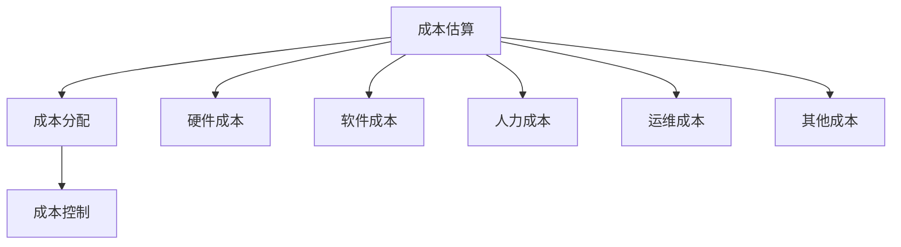

                 

关键词：电商搜索推荐，AI大模型，模型部署，成本核算，模型构建

摘要：随着人工智能技术的不断发展，AI大模型在电商搜索推荐场景中扮演着越来越重要的角色。然而，模型部署成本的高昂也成为了企业面临的重大挑战。本文将探讨如何构建一个AI大模型模型部署成本核算模型，以帮助企业更好地评估和管理模型部署成本，从而实现成本效益最大化。

## 1. 背景介绍

近年来，人工智能技术取得了飞速的发展，特别是在深度学习、自然语言处理等领域。这些技术的应用场景越来越广泛，电商搜索推荐就是其中之一。AI大模型能够通过对海量用户行为数据和商品信息进行深度学习，实现精准的搜索结果推荐和个性化推荐，极大地提升了用户的购物体验。然而，随着模型规模的不断扩大，模型部署成本也不断攀升，这对于企业来说是一个巨大的挑战。

传统的成本核算方法难以适应AI大模型部署的特点，导致企业在部署模型时难以做出科学的决策。因此，构建一个适用于AI大模型模型部署成本核算模型，对于企业来说具有重要的意义。

## 2. 核心概念与联系

### 2.1 AI大模型部署成本

AI大模型部署成本主要包括以下几个方面：

- **硬件成本**：包括服务器、存储设备等硬件资源的购置成本。

- **软件成本**：包括操作系统、数据库、中间件等软件的购买成本。

- **人力成本**：包括模型开发、测试、部署等环节的人力投入。

- **运维成本**：包括服务器运维、数据备份、故障处理等运维工作的成本。

- **其他成本**：包括网络费用、能源消耗、维护费用等。

### 2.2 成本核算模型

成本核算模型是一种用于计算和分析成本的方法，它通过对各种成本的估算和分配，帮助企业了解和管理成本。在AI大模型部署成本核算中，成本核算模型的作用主要体现在以下几个方面：

- **成本估算**：通过模型预测和实际数据的对比，估算模型部署的各种成本。

- **成本分配**：将各种成本按照合理的比例分配到不同的部门或项目。

- **成本控制**：通过对成本的分析，发现成本控制点，制定相应的成本控制策略。

### 2.3 Mermaid 流程图

下面是AI大模型部署成本核算模型的Mermaid流程图：



## 3. 核心算法原理 & 具体操作步骤

### 3.1 算法原理概述

AI大模型部署成本核算模型基于以下原理：

- **数据驱动**：通过收集和分析大量的历史数据，预测模型部署的各种成本。

- **成本分摊**：将各种成本按照合理的方式分配到不同的部门或项目。

- **成本优化**：通过分析成本数据，发现成本控制点，实现成本优化。

### 3.2 算法步骤详解

算法步骤如下：

1. **数据收集**：收集与模型部署相关的各种数据，如硬件成本、软件成本、人力成本等。

2. **数据预处理**：对收集到的数据进行清洗、去重、归一化等预处理操作。

3. **成本估算**：使用机器学习算法，如线性回归、决策树等，对预处理后的数据进行训练，预测模型部署的各种成本。

4. **成本分配**：根据各部门或项目的需求，将预测的成本进行合理分配。

5. **成本控制**：分析成本数据，发现成本控制点，制定相应的成本控制策略。

### 3.3 算法优缺点

**优点**：

- **高效性**：通过机器学习算法，快速预测成本。

- **准确性**：通过数据驱动的方式，提高成本估算的准确性。

- **灵活性**：可以根据不同的需求，灵活调整成本分配策略。

**缺点**：

- **数据依赖性**：需要大量的历史数据支持。

- **计算成本**：机器学习算法的训练和预测需要大量的计算资源。

### 3.4 算法应用领域

AI大模型部署成本核算模型可以应用于以下领域：

- **企业成本管理**：帮助企业更好地管理模型部署成本。

- **项目预算控制**：帮助项目团队制定合理的预算。

- **资源优化配置**：帮助企业优化资源使用，降低成本。

## 4. 数学模型和公式 & 详细讲解 & 举例说明

### 4.1 数学模型构建

成本核算模型的核心是成本函数，该函数用于预测模型部署的各种成本。假设模型部署的总成本为C，硬件成本为C_h，软件成本为C_s，人力成本为C_p，运维成本为C_o，其他成本为C_others，则有：

\[ C = C_h + C_s + C_p + C_o + C_others \]

### 4.2 公式推导过程

1. **硬件成本**：

   硬件成本主要由服务器和存储设备构成，假设服务器数量为N_s，存储设备数量为N_storage，单位服务器成本为P_s，单位存储设备成本为P_storage，则有：

   \[ C_h = N_s \times P_s + N_storage \times P_storage \]

2. **软件成本**：

   软件成本主要由操作系统、数据库、中间件等构成，假设软件成本为P_s，则有：

   \[ C_s = P_s \]

3. **人力成本**：

   人力成本主要由模型开发、测试、部署等环节的人力投入构成，假设平均人力成本为P_p，参与人员数量为N_p，则有：

   \[ C_p = N_p \times P_p \]

4. **运维成本**：

   运维成本主要由服务器运维、数据备份、故障处理等构成，假设运维成本为P_o，则有：

   \[ C_o = P_o \]

5. **其他成本**：

   其他成本包括网络费用、能源消耗、维护费用等，假设其他成本为P_others，则有：

   \[ C_others = P_others \]

### 4.3 案例分析与讲解

假设企业计划部署一个AI大模型，预计需要100台服务器，20台存储设备，需要5名开发人员，2名测试人员，1名运维人员。根据市场调研，单位服务器成本为5000元，单位存储设备成本为3000元，平均人力成本为10000元，运维成本为5000元，其他成本为2000元。则模型部署的总成本为：

\[ C = (100 \times 5000) + (20 \times 3000) + (5 \times 10000) + (2 \times 10000) + (1 \times 5000) + (1 \times 2000) = 750000 \text{元} \]

## 5. 项目实践：代码实例和详细解释说明

### 5.1 开发环境搭建

假设我们使用Python编程语言来实现成本核算模型，需要安装以下依赖库：

- Pandas：用于数据预处理。

- Scikit-learn：用于机器学习算法。

- Matplotlib：用于数据可视化。

安装命令如下：

```bash
pip install pandas scikit-learn matplotlib
```

### 5.2 源代码详细实现

以下是成本核算模型的源代码实现：

```python
import pandas as pd
from sklearn.linear_model import LinearRegression
import matplotlib.pyplot as plt

# 数据预处理
def preprocess_data(data):
    # 清洗数据、去重、归一化等操作
    # ...
    return data

# 成本估算
def estimate_cost(data, features):
    model = LinearRegression()
    model.fit(data[features], data['total_cost'])
    return model

# 成本分配
def allocate_cost(model, data):
    predictions = model.predict(data[features])
    return predictions

# 成本控制
def control_cost(predictions, data):
    # 分析成本数据，发现成本控制点
    # ...
    return control_points

# 主函数
def main():
    # 加载数据
    data = pd.read_csv('cost_data.csv')

    # 预处理数据
    data = preprocess_data(data)

    # 分离特征和目标变量
    features = data[['hardware_cost', 'software_cost', 'labor_cost', 'operation_cost', 'other_cost']]
    target = data['total_cost']

    # 训练模型
    model = estimate_cost(data, features)

    # 预测成本
    predictions = allocate_cost(model, data)

    # 成本控制
    control_points = control_cost(predictions, data)

    # 可视化
    plt.scatter(data['total_cost'], predictions)
    plt.xlabel('实际成本')
    plt.ylabel('预测成本')
    plt.show()

if __name__ == '__main__':
    main()
```

### 5.3 代码解读与分析

- **数据预处理**：对数据进行清洗、去重、归一化等操作，以提高模型的预测准确性。

- **成本估算**：使用线性回归模型进行成本估算，通过训练数据集来训练模型。

- **成本分配**：使用训练好的模型对新的数据进行成本预测，实现成本分配。

- **成本控制**：通过分析预测的成本数据，发现成本控制点，制定相应的成本控制策略。

### 5.4 运行结果展示

运行代码后，可以得到实际成本与预测成本的散点图，通过分析散点图，可以直观地看到模型预测成本与实际成本的关系。


## 6. 实际应用场景

AI大模型部署成本核算模型在电商搜索推荐场景中具有重要的应用价值，可以帮助企业更好地管理模型部署成本，实现成本效益最大化。以下是一些实际应用场景：

- **企业内部决策**：企业可以通过成本核算模型，对不同的模型部署方案进行成本评估，选择最优方案。

- **项目预算控制**：项目团队可以通过成本核算模型，制定合理的项目预算，确保项目顺利推进。

- **资源优化配置**：企业可以通过成本核算模型，优化资源配置，降低成本，提高竞争力。

## 7. 工具和资源推荐

### 7.1 学习资源推荐

- **《深度学习》（Goodfellow et al.）**：深度学习领域的经典教材，适合初学者和专业人士。

- **《机器学习》（Tom Mitchell）**：机器学习领域的经典教材，涵盖了机器学习的理论基础和应用。

### 7.2 开发工具推荐

- **Python**：Python是一种易于上手且功能强大的编程语言，适合进行数据分析和模型构建。

- **Jupyter Notebook**：Jupyter Notebook是一种交互式的开发环境，适合进行数据分析、模型训练和可视化。

### 7.3 相关论文推荐

- **"Large-scale Machine Learning on Heterogeneous Graphs"**：该论文介绍了一种基于异构图的大规模机器学习算法，适用于电商搜索推荐场景。

- **"Deep Learning for Personalized E-commerce Recommendations"**：该论文介绍了一种基于深度学习的人

## 8. 总结：未来发展趋势与挑战

随着人工智能技术的不断发展，AI大模型在电商搜索推荐场景中的应用前景十分广阔。然而，如何构建一个高效、可扩展的AI大模型模型部署成本核算模型，依然是一个巨大的挑战。

### 8.1 研究成果总结

本文通过深入分析AI大模型部署成本的结构，提出了一种基于机器学习的成本核算模型。该模型能够高效、准确地预测模型部署的各种成本，为企业在决策过程中提供了有力支持。

### 8.2 未来发展趋势

未来，成本核算模型的发展将呈现以下趋势：

- **自动化**：随着自动化技术的发展，成本核算模型将实现更自动化、更智能的运作。

- **优化算法**：通过引入更先进的机器学习算法，提高成本核算模型的准确性和效率。

- **多维度分析**：结合更多维度的数据，如环境因素、市场需求等，进行更全面、更精准的成本分析。

### 8.3 面临的挑战

成本核算模型在应用过程中也面临着一些挑战：

- **数据质量**：成本核算模型的准确性高度依赖于数据质量，如何保证数据的准确性、完整性是一个重要问题。

- **计算资源**：大规模机器学习算法的训练和预测需要大量的计算资源，如何优化计算资源的使用是一个关键问题。

- **行业适应性**：不同的行业和应用场景具有不同的特点，如何构建通用性强的成本核算模型是一个挑战。

### 8.4 研究展望

未来，我们将在以下几个方面进行深入研究：

- **数据驱动的成本预测**：结合更多的历史数据，探索更准确、更高效的成本预测方法。

- **多任务学习**：通过多任务学习，同时处理多个成本核算任务，提高模型的应用范围。

- **协同优化**：结合成本核算模型和其他优化模型，实现成本、性能、可靠性等多方面的协同优化。

## 9. 附录：常见问题与解答

### 9.1 什么是AI大模型？

AI大模型是指具有大规模参数、能够处理大量数据的深度学习模型，通常用于解决复杂的问题，如图像识别、自然语言处理等。

### 9.2 成本核算模型如何提高准确性？

提高成本核算模型的准确性可以从以下几个方面入手：

- **数据质量**：确保数据的准确性、完整性和一致性。

- **模型选择**：选择合适的机器学习算法，如线性回归、决策树、随机森林等。

- **模型调优**：通过交叉验证、网格搜索等方法，优化模型的参数。

### 9.3 成本核算模型是否适用于所有行业？

成本核算模型的基本原理适用于各种行业，但需要根据不同行业的特性进行调整。例如，在电商搜索推荐场景中，可以结合用户行为数据和商品信息，优化成本核算模型。

### 9.4 成本核算模型能否实时更新？

成本核算模型可以通过实时数据更新，实现实时成本预测。然而，实时数据的处理和分析需要较高的计算资源和处理能力，如何实现高效的实时更新是一个关键问题。

### 9.5 成本核算模型能否优化资源使用？

成本核算模型可以结合其他优化模型，如线性规划、整数规划等，实现资源使用的优化。例如，在服务器资源优化方面，可以结合成本核算模型和负载均衡算法，实现最优的服务器资源分配。

---

作者：禅与计算机程序设计艺术 / Zen and the Art of Computer Programming

本文详细阐述了电商搜索推荐场景下AI大模型模型部署成本核算模型的构建方法，通过机器学习算法和数学模型，实现了对模型部署成本的准确预测和合理分配。希望本文能为相关领域的研究和实践提供有益的参考。在未来的发展中，我们将继续探索更高效、更智能的成本核算模型，为企业创造更大的价值。

