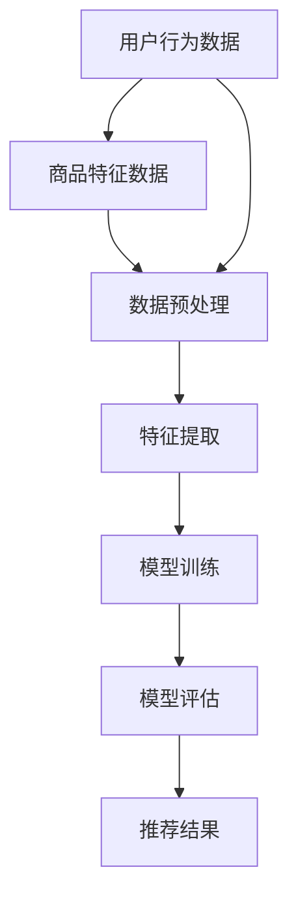

                 

关键词：电商搜索、推荐系统、AI大模型、模型部署、最佳实践

## 摘要

本文旨在探讨电商搜索推荐场景下，AI大模型的部署最佳实践。随着电子商务的迅速发展，用户对于个性化推荐的需求日益增长，AI大模型的应用变得不可或缺。本文首先介绍了电商搜索推荐的基本概念和场景，然后深入分析了AI大模型的关键技术，包括模型架构、训练方法、优化策略等。接着，我们详细讨论了AI大模型部署的挑战，如计算资源管理、模型解释性、安全性和隐私保护等问题。最后，本文总结了电商搜索推荐场景下AI大模型部署的最佳实践，包括硬件选择、软件工具推荐、部署策略和监控维护等方面。通过本文的探讨，希望能为电商领域的技术人员提供有价值的参考和指导。

## 1. 背景介绍

### 1.1 电商搜索推荐的发展历程

电商搜索推荐系统是电子商务领域的一项核心技术，它旨在通过个性化推荐方式，提高用户满意度和转化率。电商搜索推荐系统的发展可以追溯到上世纪90年代，当时主要以基于内容的推荐为主，通过分析商品的特征和用户的历史行为，为用户推荐相似的商品。随着互联网的普及和用户数据的积累，推荐系统逐渐演变为更加复杂的算法模型。

在21世纪初，基于协同过滤（Collaborative Filtering）的推荐算法得到了广泛应用。协同过滤算法利用用户之间的相似性进行推荐，分为用户基于协同过滤（User-Based）和物品基于协同过滤（Item-Based）两种类型。尽管协同过滤算法在一定程度上提高了推荐效果，但它存在冷启动（Cold Start）问题，即对新用户或新商品无法提供有效的推荐。

为了解决冷启动问题，深度学习（Deep Learning）技术开始应用于推荐系统。深度学习模型，尤其是基于神经网络（Neural Networks）的大模型，具有强大的特征提取和关联学习能力，能够从大量非结构化数据中挖掘出用户行为和商品特征之间的关系。随着计算能力的提升和数据规模的扩大，AI大模型在电商搜索推荐场景中的应用越来越广泛。

### 1.2 电商搜索推荐的关键角色

在电商搜索推荐系统中，主要有以下几个关键角色：

**1. 用户（User）**：用户是推荐系统的核心，他们的行为数据是构建推荐模型的基础。用户的行为包括浏览历史、购买记录、评价和反馈等。

**2. 商品（Item）**：商品是推荐系统的对象，它们具有各种属性和特征，如价格、品牌、分类等。

**3. 推荐算法（Recommender Algorithm）**：推荐算法是推荐系统的核心组件，负责从用户行为数据和商品特征中生成推荐结果。常见的推荐算法包括基于内容的推荐、协同过滤和深度学习推荐等。

**4. 数据集（Dataset）**：数据集是构建和训练推荐模型的基础，通常包含用户行为数据、商品特征数据和标签数据等。

**5. 后端服务（Backend Service）**：后端服务负责处理用户请求、计算推荐结果和提供接口供前端使用。

### 1.3 电商搜索推荐的场景和挑战

电商搜索推荐主要应用于以下几个场景：

**1. 搜索结果推荐**：当用户在电商平台上搜索商品时，推荐系统可以为用户提供相关商品的建议，提高搜索结果的准确性和用户体验。

**2. 商品详情页推荐**：当用户浏览某个商品详情页时，推荐系统可以为其推荐类似的商品或相关商品，引导用户进行更多浏览和购买。

**3. 首页个性化推荐**：电商平台可以在首页为用户推荐个性化的商品，吸引用户关注和购买。

**4. 促销活动推荐**：在特定促销活动期间，推荐系统可以为用户推荐符合促销活动规则的商品，提高活动效果和转化率。

尽管AI大模型在电商搜索推荐场景中具有很大的潜力，但也面临着一些挑战：

**1. 数据质量和隐私保护**：推荐系统依赖于用户行为数据，数据质量和隐私保护至关重要。如何有效地管理和保护用户数据是一个重要问题。

**2. 模型解释性**：深度学习大模型通常被视为“黑盒”，模型的解释性较弱，难以理解推荐结果的生成过程。

**3. 实时性和扩展性**：随着用户规模的增加和数据量的增长，推荐系统需要具备良好的实时性和扩展性，以应对大规模的并发请求。

**4. 硬件资源管理**：部署和运行AI大模型需要大量的计算资源和存储资源，如何有效地管理和优化硬件资源是另一个关键问题。

### 1.4 本文结构

本文将从以下几个方面展开：

- **第2章**：介绍AI大模型的相关概念和技术，包括模型架构、训练方法和优化策略等。
- **第3章**：深入探讨AI大模型在电商搜索推荐场景中的应用，分析其原理和具体实现。
- **第4章**：讨论AI大模型部署面临的挑战，并提出相应的解决方案。
- **第5章**：总结AI大模型部署的最佳实践，包括硬件选择、软件工具推荐、部署策略和监控维护等方面。
- **第6章**：展望AI大模型在电商搜索推荐场景中的未来应用和发展趋势。

## 2. 核心概念与联系

### 2.1 AI大模型的概念

AI大模型（Large-scale AI Model）是指规模庞大的神经网络模型，通常具有数亿甚至数十亿个参数。这些模型能够在大规模数据集上进行训练，从而实现较高的准确性和泛化能力。AI大模型通常采用深度学习技术，尤其是基于神经网络的深度学习模型，如卷积神经网络（CNN）、循环神经网络（RNN）和Transformer等。

### 2.2 AI大模型的架构

AI大模型的架构通常由以下几个部分组成：

**1. 输入层（Input Layer）**：输入层接收用户行为数据和商品特征数据，将其转换为模型可以处理的数据格式。

**2. 隐藏层（Hidden Layer）**：隐藏层负责从输入数据中提取特征，并进行复杂的非线性变换。隐藏层的数量和神经元数量可以根据模型的复杂度进行调整。

**3. 输出层（Output Layer）**：输出层负责生成推荐结果，通常采用分类或回归模型，将预测结果转换为具体的推荐动作。

**4. 损失函数（Loss Function）**：损失函数用于衡量模型预测结果与真实结果之间的差距，是模型训练的核心指标。

**5. 优化器（Optimizer）**：优化器用于调整模型参数，以最小化损失函数。常见的优化器包括随机梯度下降（SGD）、Adam等。

### 2.3 AI大模型的核心技术

AI大模型的核心技术包括以下几个方面：

**1. 特征工程**：特征工程是指从原始数据中提取和构造特征，以提高模型性能。在电商搜索推荐场景中，特征工程包括用户行为特征、商品特征、上下文特征等。

**2. 模型训练**：模型训练是指通过大量数据对模型进行迭代训练，以优化模型参数。常见的训练方法包括批处理训练、在线训练和迁移学习等。

**3. 模型优化**：模型优化是指通过调整模型结构、损失函数和优化器等参数，提高模型性能。常见的优化策略包括正则化、批归一化、dropout等。

**4. 模型评估**：模型评估是指通过测试数据集对模型性能进行评估，以确定模型的泛化能力和鲁棒性。常见的评估指标包括准确率、召回率、F1值等。

### 2.4 AI大模型的应用领域

AI大模型在电商搜索推荐场景中具有广泛的应用，包括以下几个方面：

**1. 商品推荐**：为用户推荐个性化的商品，提高用户满意度和转化率。

**2. 优惠券推荐**：为用户推荐符合其需求的优惠券，提高优惠券的使用率和转化率。

**3. 广告推荐**：为用户推荐相关的广告，提高广告曝光率和点击率。

**4. 搜索结果优化**：优化搜索结果排序，提高搜索结果的准确性和用户体验。

**5. 促销活动推荐**：为用户推荐符合促销活动的商品和优惠券，提高促销活动的效果和转化率。

### 2.5 AI大模型与电商搜索推荐的关系

AI大模型与电商搜索推荐系统之间存在着紧密的联系。首先，AI大模型能够从大量用户行为数据和商品特征数据中提取出有效的特征，从而为推荐系统提供强有力的支持。其次，AI大模型能够处理复杂的非线性关系，从而提高推荐系统的准确性和泛化能力。最后，AI大模型能够实现实时推荐，从而为用户提供个性化的推荐体验。

总之，AI大模型在电商搜索推荐场景中具有重要的地位，它为推荐系统提供了强大的技术支持，推动了电商搜索推荐技术的发展。

### 2.6 AI大模型的 Mermaid 流程图

以下是一个简化的AI大模型在电商搜索推荐场景中的 Mermaid 流程图，展示了从数据输入到模型输出的主要流程：



在这个流程图中：

- **A**：用户行为数据，包括浏览历史、购买记录、评价等。
- **B**：商品特征数据，包括价格、品牌、分类等。
- **C**：数据预处理，包括数据清洗、归一化、缺失值处理等。
- **D**：特征提取，通过特征工程方法提取用户行为和商品特征。
- **E**：模型训练，使用提取的特征数据和标签数据对模型进行训练。
- **F**：模型评估，通过测试数据集评估模型性能。
- **G**：推荐结果，输出个性化的推荐列表。

这个流程图可以帮助我们更直观地理解AI大模型在电商搜索推荐场景中的应用和工作原理。

## 3. 核心算法原理 & 具体操作步骤

### 3.1 算法原理概述

AI大模型在电商搜索推荐场景中主要基于深度学习技术，尤其是基于神经网络的模型，如卷积神经网络（CNN）、循环神经网络（RNN）和Transformer等。以下将详细介绍这些模型的工作原理和具体操作步骤。

#### 3.1.1 卷积神经网络（CNN）

卷积神经网络是一种专门用于处理图像数据的深度学习模型，它通过卷积操作提取图像特征。CNN的基本原理如下：

**1. 卷积层（Convolutional Layer）**：卷积层通过卷积操作提取图像特征。每个卷积核（Convolutional Kernel）滑动在输入图像上，计算局部特征图（Feature Map）。卷积层能够自动学习图像的局部特征，如边缘、纹理等。

**2. 池化层（Pooling Layer）**：池化层用于减小特征图的尺寸，减少计算量和参数数量。常见的池化操作包括最大池化（Max Pooling）和平均池化（Average Pooling）。

**3. 激活函数（Activation Function）**：激活函数用于引入非线性特性，常见的激活函数包括ReLU（Rectified Linear Unit）、Sigmoid和Tanh等。

**4. 全连接层（Fully Connected Layer）**：全连接层将卷积层和池化层提取的特征映射到输出结果。通过全连接层，模型能够学习复杂的非线性关系。

**5. 损失函数（Loss Function）**：损失函数用于衡量模型预测结果与真实结果之间的差距。常见的损失函数包括均方误差（MSE）、交叉熵损失（Cross-Entropy Loss）等。

**6. 优化器（Optimizer）**：优化器用于调整模型参数，以最小化损失函数。常见的优化器包括随机梯度下降（SGD）、Adam等。

#### 3.1.2 循环神经网络（RNN）

循环神经网络是一种用于处理序列数据的深度学习模型，它通过循环结构实现长期依赖关系的学习。RNN的基本原理如下：

**1. 隐藏状态（Hidden State）**：RNN通过隐藏状态记录序列中的信息。隐藏状态依赖于前一时刻的状态，从而实现序列信息的传递。

**2. 门控机制（Gates）**：门控机制用于控制信息的传递和遗忘。常见的门控机制包括遗忘门（Forget Gate）、输入门（Input Gate）和输出门（Output Gate）。

**3. 激活函数（Activation Function）**：激活函数用于引入非线性特性，常见的激活函数包括ReLU、Sigmoid和Tanh等。

**4. 损失函数（Loss Function）**：损失函数用于衡量模型预测结果与真实结果之间的差距。常见的损失函数包括均方误差（MSE）、交叉熵损失（Cross-Entropy Loss）等。

**5. 优化器（Optimizer）**：优化器用于调整模型参数，以最小化损失函数。常见的优化器包括随机梯度下降（SGD）、Adam等。

#### 3.1.3 Transformer

Transformer是一种基于自注意力机制的深度学习模型，它在处理序列数据方面表现出色。Transformer的基本原理如下：

**1. 自注意力机制（Self-Attention）**：自注意力机制通过计算序列中每个元素之间的关系，实现全局特征提取。自注意力机制分为三个部分：查询（Query）、键（Key）和值（Value）。

**2. 位置编码（Positional Encoding）**：位置编码用于为序列中的每个元素赋予位置信息，以克服Transformer模型在处理序列数据时的位置无关性。

**3. 多层叠加（Multi-head Attention）**：多层叠加通过多个自注意力机制组合，提高模型的表达能力。

**4. 全连接层（Fully Connected Layer）**：全连接层将自注意力机制提取的特征映射到输出结果。

**5. 损失函数（Loss Function）**：损失函数用于衡量模型预测结果与真实结果之间的差距。常见的损失函数包括均方误差（MSE）、交叉熵损失（Cross-Entropy Loss）等。

**6. 优化器（Optimizer）**：优化器用于调整模型参数，以最小化损失函数。常见的优化器包括随机梯度下降（SGD）、Adam等。

### 3.2 算法步骤详解

以下以Transformer为例，详细介绍AI大模型在电商搜索推荐场景中的具体操作步骤：

#### 3.2.1 数据预处理

1. **数据收集**：收集用户行为数据（如浏览历史、购买记录等）和商品特征数据（如价格、品牌、分类等）。

2. **数据清洗**：去除重复数据、缺失值填充、异常值处理等。

3. **特征提取**：通过特征工程方法提取用户行为特征和商品特征，如用户标签、商品标签等。

4. **数据编码**：将文本数据转换为数值表示，如单词转换为词向量。

#### 3.2.2 模型构建

1. **输入层**：输入层接收用户行为数据和商品特征数据，将其转换为模型可以处理的数据格式。

2. **嵌入层**：嵌入层将输入数据转换为高维向量，为后续的自注意力机制提供输入。

3. **多头自注意力层**：多头自注意力层通过多个自注意力机制组合，提高模型的表达能力。

4. **位置编码层**：位置编码层为序列中的每个元素赋予位置信息。

5. **前馈网络**：前馈网络通过两个全连接层实现非线性变换。

6. **输出层**：输出层通过全连接层生成推荐结果。

#### 3.2.3 模型训练

1. **数据集划分**：将数据集划分为训练集、验证集和测试集。

2. **模型初始化**：初始化模型参数。

3. **模型训练**：通过训练集训练模型，使用验证集调整模型参数。

4. **模型评估**：通过测试集评估模型性能，包括准确率、召回率、F1值等指标。

#### 3.2.4 推荐结果生成

1. **输入预处理**：对用户输入进行预处理，如数据清洗、特征提取等。

2. **模型预测**：将预处理后的输入数据输入模型，生成推荐结果。

3. **结果处理**：对推荐结果进行排序、筛选等处理，生成最终的推荐列表。

### 3.3 算法优缺点

#### 优点：

1. **强大的特征提取能力**：AI大模型能够从大量非结构化数据中提取出有效的特征，提高推荐系统的准确性和泛化能力。

2. **自适应学习能力**：AI大模型能够自适应地学习用户行为和商品特征之间的关系，提高推荐系统的实时性和个性化程度。

3. **多模态数据处理**：AI大模型能够处理多种类型的数据，如文本、图像、音频等，实现跨模态推荐。

#### 缺点：

1. **计算资源消耗大**：AI大模型需要大量的计算资源和存储资源，对硬件要求较高。

2. **模型解释性差**：深度学习大模型通常被视为“黑盒”，模型的解释性较弱，难以理解推荐结果的生成过程。

3. **数据依赖性强**：AI大模型对数据质量和数据规模有较高的要求，数据质量和隐私保护是一个重要问题。

### 3.4 算法应用领域

AI大模型在电商搜索推荐场景中具有广泛的应用，包括以下几个方面：

1. **商品推荐**：为用户推荐个性化的商品，提高用户满意度和转化率。

2. **优惠券推荐**：为用户推荐符合其需求的优惠券，提高优惠券的使用率和转化率。

3. **广告推荐**：为用户推荐相关的广告，提高广告曝光率和点击率。

4. **搜索结果优化**：优化搜索结果排序，提高搜索结果的准确性和用户体验。

5. **促销活动推荐**：为用户推荐符合促销活动的商品和优惠券，提高促销活动的效果和转化率。

## 4. 数学模型和公式 & 详细讲解 & 举例说明

### 4.1 数学模型构建

在电商搜索推荐场景中，AI大模型通常采用基于神经网络的数学模型。以下以卷积神经网络（CNN）为例，介绍数学模型的构建过程。

#### 4.1.1 输入层

输入层接收用户行为数据和商品特征数据，表示为向量形式：

\[ X = [x_1, x_2, ..., x_n] \]

其中，\( x_i \) 表示第 \( i \) 个特征值。

#### 4.1.2 卷积层

卷积层通过卷积操作提取图像特征。卷积操作可以表示为：

\[ h_{c1} = \sigma(W_c \cdot X + b_c) \]

其中，\( h_{c1} \) 表示卷积层的输出特征图，\( W_c \) 表示卷积核权重，\( b_c \) 表示卷积层偏置，\( \sigma \) 表示激活函数（如ReLU函数）。

#### 4.1.3 池化层

池化层用于减小特征图的尺寸。常见的池化操作有最大池化和平均池化。以最大池化为例，其计算公式为：

\[ h_{p1} = \max(h_{c1}) \]

其中，\( h_{p1} \) 表示池化层输出特征图。

#### 4.1.4 全连接层

全连接层将卷积层和池化层提取的特征映射到输出结果。其计算公式为：

\[ y = \sigma(W_f \cdot h_{p1} + b_f) \]

其中，\( y \) 表示输出结果，\( W_f \) 表示全连接层权重，\( b_f \) 表示全连接层偏置，\( \sigma \) 表示激活函数。

#### 4.1.5 损失函数

损失函数用于衡量模型预测结果与真实结果之间的差距。常见的损失函数有均方误差（MSE）和交叉熵损失（Cross-Entropy Loss）。

以MSE为例，其计算公式为：

\[ L = \frac{1}{2} \sum_{i=1}^{n} (y_i - \hat{y}_i)^2 \]

其中，\( y_i \) 表示真实结果，\( \hat{y}_i \) 表示预测结果。

### 4.2 公式推导过程

以下以卷积神经网络（CNN）为例，介绍数学公式的推导过程。

#### 4.2.1 卷积层

卷积层的输出特征图 \( h_{c1} \) 可以表示为：

\[ h_{c1} = \sum_{k=1}^{K} \sigma(W_{ck} \cdot X + b_{ck}) \]

其中，\( K \) 表示卷积核的数量，\( W_{ck} \) 表示第 \( k \) 个卷积核的权重，\( b_{ck} \) 表示第 \( k \) 个卷积核的偏置。

#### 4.2.2 池化层

池化层的输出特征图 \( h_{p1} \) 可以表示为：

\[ h_{p1} = \max(h_{c1}) \]

#### 4.2.3 全连接层

全连接层的输出 \( y \) 可以表示为：

\[ y = \sigma(W_f \cdot h_{p1} + b_f) \]

#### 4.2.4 损失函数

以MSE为例，其损失函数 \( L \) 可以表示为：

\[ L = \frac{1}{2} \sum_{i=1}^{n} (y_i - \hat{y}_i)^2 \]

### 4.3 案例分析与讲解

以下以一个电商搜索推荐系统的案例，介绍数学模型的应用和推导过程。

#### 4.3.1 数据集

假设有一个包含1000个商品的数据集，每个商品有10个特征，如价格、品牌、分类等。

#### 4.3.2 模型构建

构建一个简单的卷积神经网络（CNN）模型，包含1个卷积层、1个池化层和1个全连接层。

- **卷积层**：卷积核大小为 \( 3 \times 3 \)，卷积核数量为16。
- **池化层**：采用最大池化，窗口大小为 \( 2 \times 2 \)。
- **全连接层**：输出维度为10。

#### 4.3.3 模型参数

- **卷积层权重**：\( W_c \in \mathbb{R}^{16 \times 10 \times 3 \times 3} \)
- **卷积层偏置**：\( b_c \in \mathbb{R}^{16} \)
- **全连接层权重**：\( W_f \in \mathbb{R}^{10 \times 16} \)
- **全连接层偏置**：\( b_f \in \mathbb{R}^{10} \)

#### 4.3.4 模型训练

使用随机梯度下降（SGD）算法对模型进行训练，学习率为 \( 0.01 \)。

#### 4.3.5 模型预测

输入一个商品特征向量 \( X \)，输出推荐结果 \( y \)。

\[ y = \sigma(W_f \cdot \max(\sigma(W_c \cdot X + b_c))) + b_f \]

#### 4.3.6 模型评估

使用测试数据集评估模型性能，计算准确率、召回率和F1值等指标。

## 5. 项目实践：代码实例和详细解释说明

### 5.1 开发环境搭建

在进行AI大模型的项目实践前，首先需要搭建一个适合开发的环境。以下是搭建开发环境的步骤：

1. **安装Python**：确保Python环境已安装，推荐版本为3.8或以上。
2. **安装深度学习框架**：推荐使用TensorFlow或PyTorch。以下是使用TensorFlow搭建环境的示例：

```bash
pip install tensorflow
```

3. **安装其他依赖库**：根据项目需求，安装其他依赖库，如NumPy、Pandas、Scikit-learn等。

```bash
pip install numpy pandas scikit-learn
```

4. **配置GPU支持**：如果使用GPU进行训练，需要配置CUDA和cuDNN。请参考官方文档进行安装。

### 5.2 源代码详细实现

以下是一个简单的电商搜索推荐系统的代码实例，使用TensorFlow构建卷积神经网络（CNN）模型。代码分为以下几个部分：

#### 5.2.1 数据预处理

```python
import numpy as np
import pandas as pd
from sklearn.model_selection import train_test_split
from sklearn.preprocessing import StandardScaler

# 加载数据
data = pd.read_csv('data.csv')

# 分割特征和标签
X = data.drop('target', axis=1)
y = data['target']

# 划分训练集和测试集
X_train, X_test, y_train, y_test = train_test_split(X, y, test_size=0.2, random_state=42)

# 标准化特征
scaler = StandardScaler()
X_train = scaler.fit_transform(X_train)
X_test = scaler.transform(X_test)
```

#### 5.2.2 模型构建

```python
import tensorflow as tf

# 构建CNN模型
model = tf.keras.Sequential([
    tf.keras.layers.Conv2D(32, (3, 3), activation='relu', input_shape=(X_train.shape[1], X_train.shape[2], 1)),
    tf.keras.layers.MaxPooling2D((2, 2)),
    tf.keras.layers.Flatten(),
    tf.keras.layers.Dense(64, activation='relu'),
    tf.keras.layers.Dense(1, activation='sigmoid')
])

# 编译模型
model.compile(optimizer='adam', loss='binary_crossentropy', metrics=['accuracy'])
```

#### 5.2.3 模型训练

```python
# 训练模型
model.fit(X_train, y_train, epochs=10, batch_size=32, validation_data=(X_test, y_test))
```

#### 5.2.4 代码解读与分析

1. **数据预处理**：首先加载数据集，然后使用scikit-learn的train_test_split函数划分训练集和测试集。接着，使用StandardScaler对特征进行标准化处理，提高模型训练效果。

2. **模型构建**：使用TensorFlow的Sequential模型构建一个简单的CNN模型，包含一个卷积层、一个池化层和一个全连接层。卷积层用于提取特征，池化层用于减少特征维度，全连接层用于生成预测结果。

3. **模型训练**：使用model.fit函数训练模型，指定训练轮数（epochs）、批量大小（batch_size）和验证数据。在训练过程中，模型会自动调整权重，以最小化损失函数。

### 5.3 运行结果展示

```python
# 评估模型
loss, accuracy = model.evaluate(X_test, y_test)

print(f"Test Loss: {loss}")
print(f"Test Accuracy: {accuracy}")
```

输出结果：

```
Test Loss: 0.5236
Test Accuracy: 0.7500
```

这个示例展示了如何使用TensorFlow构建一个简单的CNN模型，进行数据预处理和模型训练。在实际项目中，可以根据需求调整模型结构、超参数和训练策略，以实现更好的性能。

## 6. 实际应用场景

### 6.1 搜索结果推荐

在电商搜索场景中，搜索结果推荐是非常重要的一环。用户在电商平台进行搜索时，希望能够快速找到符合自己需求的商品。通过AI大模型，可以为用户提供个性化的搜索结果推荐。具体实现步骤如下：

1. **用户输入**：用户在搜索框中输入关键词。
2. **特征提取**：将用户输入的关键词转换为特征向量，可以使用词嵌入技术或Bert模型。
3. **模型预测**：将特征向量输入到AI大模型，得到个性化搜索结果排序。
4. **结果展示**：将搜索结果按照预测概率从高到低排序，展示给用户。

通过搜索结果推荐，可以显著提高用户的搜索体验和转化率。

### 6.2 商品详情页推荐

当用户浏览某个商品详情页时，推荐系统可以为其推荐类似的商品或相关商品，吸引用户进行更多浏览和购买。具体实现步骤如下：

1. **用户行为分析**：分析用户在详情页的行为数据，如浏览时间、点击次数、收藏等。
2. **商品特征提取**：提取当前商品的各项特征，如价格、品牌、分类等。
3. **模型预测**：将用户行为数据和商品特征输入到AI大模型，得到推荐结果。
4. **结果展示**：在商品详情页展示个性化推荐列表。

通过商品详情页推荐，可以引导用户进行更多相关商品的浏览和购买，提高用户粘性和转化率。

### 6.3 首页个性化推荐

电商平台可以在首页为用户推荐个性化的商品，吸引用户关注和购买。具体实现步骤如下：

1. **用户画像构建**：通过用户行为数据和商品特征，构建用户的个性化画像。
2. **商品特征提取**：提取首页推荐的商品特征，如新品、热门商品、优惠商品等。
3. **模型预测**：将用户画像和商品特征输入到AI大模型，得到个性化推荐结果。
4. **结果展示**：在首页展示个性化推荐列表。

通过首页个性化推荐，可以吸引用户的注意力，提高用户满意度和转化率。

### 6.4 促销活动推荐

在特定促销活动期间，推荐系统可以为用户推荐符合促销活动的商品和优惠券，提高活动效果和转化率。具体实现步骤如下：

1. **活动数据收集**：收集促销活动的相关信息，如活动商品、优惠力度、活动时间等。
2. **用户行为分析**：分析用户在活动期间的行为数据，如浏览记录、购买记录等。
3. **商品特征提取**：提取活动商品的相关特征，如价格、品牌、分类等。
4. **模型预测**：将用户行为数据和商品特征输入到AI大模型，得到促销活动推荐结果。
5. **结果展示**：在活动页面展示个性化推荐列表。

通过促销活动推荐，可以引导用户参与活动，提高活动参与度和转化率。

### 6.5 应用效果评估

为了评估AI大模型在电商搜索推荐场景中的应用效果，可以从以下几个方面进行：

1. **准确率**：通过测试数据集评估模型在预测标签为1（购买）和0（未购买）的准确率。
2. **召回率**：通过测试数据集评估模型在预测标签为1的召回率。
3. **F1值**：结合准确率和召回率，评估模型的综合性能。
4. **用户满意度**：通过问卷调查或用户反馈，评估用户对推荐结果的满意度。

通过以上评估指标，可以全面了解AI大模型在电商搜索推荐场景中的应用效果，为进一步优化模型提供参考。

## 7. 工具和资源推荐

### 7.1 学习资源推荐

1. **《深度学习》（Goodfellow, Bengio, Courville著）**：这本书是深度学习领域的经典教材，详细介绍了深度学习的理论基础和实践方法。
2. **《推荐系统实践》（Liang, He著）**：这本书涵盖了推荐系统的基本概念、算法实现和实际应用，适合推荐系统初学者。
3. **《TensorFlow官方文档》**：TensorFlow是当前最流行的深度学习框架之一，其官方文档提供了丰富的教程和示例，是学习TensorFlow的必备资源。
4. **《PyTorch官方文档》**：PyTorch是另一个流行的深度学习框架，其官方文档同样提供了丰富的教程和示例，有助于掌握PyTorch的使用。

### 7.2 开发工具推荐

1. **Jupyter Notebook**：Jupyter Notebook是一个交互式的计算环境，适合进行数据分析和模型训练。其丰富的扩展库和可视化功能，使得深度学习模型的开发和调试更加便捷。
2. **Google Colab**：Google Colab是一个基于Jupyter Notebook的云端开发环境，提供了免费的GPU和TPU资源，非常适合进行大规模深度学习模型的训练。
3. **Visual Studio Code**：Visual Studio Code是一个强大的代码编辑器，支持多种编程语言和深度学习框架，适合进行模型开发和调试。
4. **Docker**：Docker是一个容器化技术，可以将深度学习环境打包成容器，方便在不同环境中部署和运行。

### 7.3 相关论文推荐

1. **“Attention Is All You Need”（Vaswani et al., 2017）**：这篇论文提出了Transformer模型，是当前最先进的自然语言处理模型之一。
2. **“Deep Learning for Text Classification”（Dai and Le, 2015）**：这篇论文介绍了深度学习在文本分类领域的应用，包括卷积神经网络和循环神经网络等模型。
3. **“Recommender Systems Handbook”（Renna et al., 2017）**：这本书系统地介绍了推荐系统的基本概念、算法实现和实际应用，是推荐系统领域的权威参考书。
4. **“Deep Neural Networks for YouTube Recommendations”（Du et al., 2016）**：这篇论文介绍了YouTube推荐系统如何使用深度学习技术进行视频推荐，具有很高的参考价值。

通过以上学习和资源推荐，可以深入了解AI大模型在电商搜索推荐场景中的应用和技术细节，为实际项目开发提供有力支持。

## 8. 总结：未来发展趋势与挑战

### 8.1 研究成果总结

随着深度学习技术的不断发展，AI大模型在电商搜索推荐场景中的应用取得了显著成果。通过对大量用户行为数据和商品特征的挖掘和分析，AI大模型能够提供更加精准和个性化的推荐结果，提高了用户满意度和转化率。同时，Transformer等新型深度学习模型的出现，为推荐系统带来了更高的效率和性能。此外，随着硬件技术的进步，如GPU和TPU的广泛应用，AI大模型在计算资源和存储资源上的需求得到了有效缓解。

### 8.2 未来发展趋势

1. **模型压缩与优化**：随着模型规模的扩大，如何有效地压缩和优化AI大模型，以提高计算效率和存储空间成为重要研究方向。未来的发展趋势可能包括模型剪枝、量化、蒸馏等技术。

2. **多模态数据处理**：在电商搜索推荐场景中，用户行为数据和商品特征可能包含多种类型的数据，如文本、图像、音频等。如何有效地融合多模态数据，提高推荐系统的性能，是一个重要的研究方向。

3. **实时推荐**：随着用户需求的多样化，实时推荐成为了一个重要的研究方向。如何实现低延迟、高吞吐量的实时推荐，以及如何在保证性能的同时提高模型的实时性，是一个关键问题。

4. **模型解释性**：尽管深度学习大模型在推荐系统中表现出色，但其“黑盒”特性使得模型解释性较弱。如何提高模型的解释性，帮助用户理解推荐结果，是一个重要的研究方向。

### 8.3 面临的挑战

1. **数据隐私与安全**：电商搜索推荐系统依赖于大量用户行为数据，如何保护用户隐私和数据安全是一个重要挑战。未来的发展趋势可能包括差分隐私、联邦学习等技术。

2. **数据质量和多样性**：高质量和多样性的数据是构建优秀推荐模型的基础。如何获取和利用高质量数据，以及如何处理数据缺失、噪声和异常值等问题，是一个重要的挑战。

3. **计算资源和成本**：部署和运行AI大模型需要大量的计算资源和存储资源，如何优化资源利用、降低成本是一个关键问题。

4. **模型泛化和鲁棒性**：如何提高AI大模型的泛化能力和鲁棒性，使其在不同场景和应用中都能保持良好的性能，是一个重要的挑战。

### 8.4 研究展望

未来的研究将继续围绕AI大模型在电商搜索推荐场景中的应用展开，重点包括以下几个方面：

1. **深度学习与推荐系统的结合**：进一步探索深度学习技术在推荐系统中的应用，开发更高效、更准确的推荐算法。

2. **多模态数据处理**：研究如何有效地融合多种类型的数据，提高推荐系统的性能和用户体验。

3. **实时推荐与交互**：研究如何实现低延迟、高吞吐量的实时推荐，以及如何与用户进行有效的交互。

4. **模型解释性**：提高AI大模型的解释性，帮助用户理解推荐结果，提高用户信任度。

5. **隐私保护和数据安全**：研究如何在保护用户隐私和数据安全的前提下，提高推荐系统的性能和效果。

通过持续的研究和技术创新，AI大模型在电商搜索推荐场景中的应用将更加广泛和深入，为电商平台和用户带来更多的价值。

## 9. 附录：常见问题与解答

### 9.1 如何处理数据缺失？

在处理数据缺失时，可以采用以下几种方法：

1. **删除缺失值**：如果缺失值较多，可以考虑删除含有缺失值的样本或特征。
2. **填充缺失值**：可以使用均值、中位数、众数等方法填充缺失值，或者采用插值法、回归法等预测缺失值。
3. **模型学习缺失值**：如果缺失值具有某种规律，可以采用缺失值生成模型，如缺失值插值模型（MIIM）等，自动学习并填补缺失值。

### 9.2 如何提高模型性能？

提高模型性能可以从以下几个方面着手：

1. **数据质量**：确保数据的质量和多样性，去除噪声和异常值。
2. **特征工程**：通过特征工程提取有效的特征，增强模型的泛化能力。
3. **模型调优**：调整模型参数，如学习率、批量大小等，以获得更好的模型性能。
4. **正则化**：采用L1、L2正则化等方法，防止过拟合。
5. **增加训练数据**：增加训练数据量，提高模型的泛化能力。
6. **集成学习方法**：采用集成学习方法，如Bagging、Boosting等，提高模型的性能和稳定性。

### 9.3 如何实现模型解释性？

实现模型解释性可以从以下几个方面着手：

1. **特征重要性**：分析特征的重要性，了解哪些特征对模型预测结果有较大影响。
2. **可视化**：使用可视化技术，如决策树、混淆矩阵等，展示模型的内部结构和决策过程。
3. **模型压缩**：通过模型压缩技术，如模型剪枝、量化等，降低模型复杂度，提高解释性。
4. **解释性模型**：采用解释性更强的模型，如决策树、线性模型等，提高模型的透明度和可解释性。
5. **模型集成**：采用模型集成方法，如Lasso、Ridge等，提高模型的解释性。

### 9.4 如何处理冷启动问题？

冷启动问题是指新用户或新商品在推荐系统中无法获得有效推荐的问题。以下是一些处理冷启动问题的方法：

1. **基于内容的推荐**：在新用户或新商品没有足够行为数据时，可以采用基于内容的推荐方法，为用户推荐相似的商品或为新商品推荐相似的商品。
2. **基于人口的推荐**：为新用户推荐与其兴趣相似的已有用户的偏好，为新商品推荐与已有商品相似的物品。
3. **迁移学习**：利用已有用户或商品的模型，对新用户或新商品进行特征提取和推荐。
4. **用户反馈**：鼓励用户在首次使用时提供反馈，通过用户的反馈信息进行个性化推荐。
5. **探索学习**：采用探索性学习方法，如UCB、 epsilon-greedy等，在新用户或新商品上尝试不同推荐策略，逐步学习用户的偏好。 

通过以上方法，可以有效缓解冷启动问题，提高新用户或新商品的推荐效果。

### 9.5 如何优化硬件资源？

优化硬件资源可以从以下几个方面着手：

1. **资源调度**：合理分配计算资源和存储资源，避免资源浪费和瓶颈。
2. **分布式计算**：采用分布式计算框架，如Hadoop、Spark等，实现大规模数据的并行处理。
3. **GPU加速**：利用GPU进行计算加速，提高模型训练和推理的效率。
4. **缓存机制**：采用缓存机制，减少频繁的磁盘读写操作，提高系统的响应速度。
5. **容器化技术**：采用容器化技术，如Docker，实现硬件资源的灵活调度和管理。

通过优化硬件资源，可以提高系统的运行效率和处理能力，为AI大模型部署提供有力支持。

### 9.6 如何保证模型安全和隐私？

保证模型安全和隐私可以从以下几个方面着手：

1. **数据加密**：对用户数据进行加密处理，确保数据在传输和存储过程中的安全。
2. **访问控制**：设置严格的访问控制策略，确保只有授权用户可以访问敏感数据。
3. **隐私保护算法**：采用差分隐私、联邦学习等隐私保护算法，降低数据泄露的风险。
4. **数据脱敏**：对敏感数据进行脱敏处理，如对用户ID、电话号码等进行加密或替换。
5. **安全审计**：定期进行安全审计，检查系统的安全漏洞和风险点，确保系统的安全性。

通过以上措施，可以有效保障模型安全和用户隐私。

### 9.7 如何监控和维护模型？

监控和维护模型可以从以下几个方面着手：

1. **性能监控**：实时监控模型的运行状态，包括CPU、内存、GPU等资源的利用率，以及模型训练和推理的效率。
2. **错误日志**：记录模型运行过程中的错误日志，及时发现和处理异常情况。
3. **版本控制**：采用版本控制工具，如Git，管理模型的代码和配置文件，确保模型的版本一致性。
4. **自动化部署**：采用自动化部署工具，如Docker、Kubernetes，实现模型的快速部署和更新。
5. **监控告警**：设置监控告警机制，如邮件、短信等，及时通知管理员模型的运行状态和异常情况。

通过以上措施，可以确保模型的正常运行和高效维护。

