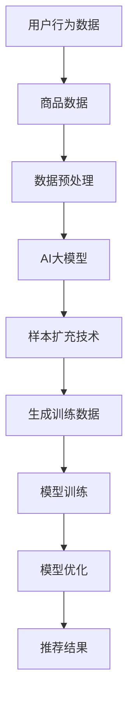

                 

关键词：电商搜索、推荐系统、AI大模型、样本扩充、算法优化

## 摘要

本文将探讨在电商搜索推荐系统中，如何利用AI大模型进行样本扩充技术，从而提升推荐效果。通过深入分析样本扩充技术的核心概念、算法原理及其实际应用，本文旨在为电商从业者提供有价值的参考和指导，以推动搜索推荐系统的持续优化和发展。

## 1. 背景介绍

在互联网时代，电商已经成为人们生活中不可或缺的一部分。随着用户数量的不断增长和业务规模的不断扩大，电商企业面临着激烈的竞争和用户需求的多样化。为了在竞争中脱颖而出，电商企业纷纷投入巨资建设高效的搜索推荐系统，以期提高用户满意度、提升转化率和增加营收。

然而，传统的搜索推荐系统在面临海量数据和复杂用户行为时，往往难以满足用户个性化的需求。为了解决这个问题，AI大模型和样本扩充技术的出现为搜索推荐系统带来了新的希望。本文将重点介绍这两种技术在电商搜索推荐效果优化中的应用。

### 1.1 电商搜索推荐系统的现状

目前，电商搜索推荐系统主要包括以下三个核心模块：

1. **搜索引擎**：负责对商品库进行检索，提供用户查询的商品结果。
2. **推荐引擎**：根据用户的历史行为和兴趣偏好，为用户推荐可能感兴趣的商品。
3. **评价系统**：收集用户对商品的评分和评论，为后续推荐提供参考。

尽管这些系统在提高用户满意度和转化率方面取得了一定的成效，但依然存在一些问题，如：

- **搜索结果相关性不高**：用户查询的关键词可能与实际感兴趣的商品不符，导致搜索结果满意度下降。
- **推荐效果不佳**：推荐系统无法准确捕捉用户的兴趣偏好，导致推荐商品与用户实际需求不匹配。
- **用户评价利用不足**：用户评价信息未能充分融入推荐算法，导致推荐结果缺乏参考价值。

### 1.2 AI大模型与样本扩充技术的作用

AI大模型，如深度学习模型、图神经网络等，具有强大的特征提取和关系建模能力，可以更好地处理复杂数据和用户行为。样本扩充技术则通过生成大量高质量的训练数据，提升模型的泛化能力和鲁棒性。这两种技术结合，有望解决电商搜索推荐系统面临的诸多问题，具体体现在以下几个方面：

- **提升搜索结果相关性**：通过AI大模型，可以更好地捕捉用户查询意图，提高搜索结果的相关性。
- **优化推荐效果**：利用样本扩充技术，生成更多的用户兴趣特征数据，为推荐算法提供更丰富的训练数据。
- **增强评价系统的参考价值**：通过AI大模型，可以更准确地识别用户评价中的有效信息，提高评价系统的参考价值。

## 2. 核心概念与联系

在探讨电商搜索推荐效果优化中的AI大模型样本扩充技术之前，有必要先了解以下几个核心概念及其相互之间的联系。

### 2.1 AI大模型

AI大模型是指具有大规模参数和复杂结构的机器学习模型。这类模型通常采用深度学习、图神经网络等先进技术，能够处理高维、非线性和复杂数据。在电商搜索推荐系统中，AI大模型可以用于：

- **用户行为预测**：通过分析用户的历史行为数据，预测用户未来的购买意愿。
- **商品特征提取**：从海量的商品信息中提取关键特征，为推荐算法提供支持。
- **评价情感分析**：分析用户评价中的情感倾向，为商品评分和评论提供参考。

### 2.2 样本扩充技术

样本扩充技术是指通过数据增强、生成对抗网络（GAN）等方法，生成大量高质量的训练数据，以提高模型的泛化能力和鲁棒性。在电商搜索推荐系统中，样本扩充技术可以用于：

- **数据增强**：通过图像旋转、缩放、裁剪等方法，生成更多的商品图片，丰富模型训练数据。
- **生成对抗网络**：通过生成器和判别器的对抗训练，生成与现实商品数据相似的虚假商品数据，用于训练推荐模型。
- **用户行为模拟**：通过模拟用户在不同场景下的行为，生成更多的用户行为数据，为推荐算法提供支持。

### 2.3 关联性

AI大模型与样本扩充技术之间存在密切的关联性。一方面，AI大模型需要大量高质量的训练数据来提升模型的性能；另一方面，样本扩充技术可以生成更多的训练数据，满足AI大模型的需求。具体来说，两者之间的关联性体现在以下几个方面：

- **数据质量**：高质量的数据对于AI大模型的性能至关重要。样本扩充技术可以通过生成虚假数据，提高数据的质量和多样性。
- **数据量**：在电商搜索推荐系统中，数据量通常是影响模型性能的关键因素。样本扩充技术可以生成更多的训练数据，提高模型的泛化能力和鲁棒性。
- **模型优化**：通过不断迭代和优化，AI大模型可以更好地捕捉用户行为和商品特征的内在关系。样本扩充技术可以为模型提供更丰富的训练数据，加速模型优化过程。

### 2.4 Mermaid流程图

为了更好地理解AI大模型与样本扩充技术的关联性，我们可以使用Mermaid流程图来表示两者的工作流程。以下是Mermaid流程图示例：



在这个流程图中，用户行为数据和商品数据经过预处理后，输入到AI大模型中。样本扩充技术通过生成训练数据，进一步丰富模型的训练数据。通过不断的模型训练和优化，最终生成高质量的推荐结果。

## 3. 核心算法原理 & 具体操作步骤

### 3.1 算法原理概述

在电商搜索推荐系统中，AI大模型和样本扩充技术的核心算法原理主要包括以下几个方面：

1. **深度学习模型**：深度学习模型是一种基于多层神经网络的学习方法，能够自动提取数据中的高阶特征。在电商搜索推荐系统中，深度学习模型可以用于用户行为预测、商品特征提取和评价情感分析。
2. **生成对抗网络（GAN）**：生成对抗网络是一种基于对抗训练的生成模型。在电商搜索推荐系统中，GAN可以用于生成虚假商品数据，为模型提供丰富的训练数据。
3. **数据增强**：数据增强是一种通过变换原始数据，生成新的训练样本的方法。在电商搜索推荐系统中，数据增强可以用于图像旋转、缩放、裁剪等操作，提高模型对数据多样性的适应能力。

### 3.2 算法步骤详解

#### 3.2.1 深度学习模型

1. **数据收集**：收集电商平台的用户行为数据、商品数据以及用户评价数据。
2. **数据预处理**：对用户行为数据进行去重、去噪处理，对商品数据进行特征提取，对用户评价数据进行情感分析。
3. **模型构建**：使用深度学习框架（如TensorFlow、PyTorch）构建深度学习模型，包括用户行为预测模型、商品特征提取模型和评价情感分析模型。
4. **模型训练**：将预处理后的数据输入到模型中，通过反向传播算法进行模型训练，不断调整模型参数。
5. **模型优化**：通过交叉验证和超参数调整，优化模型性能。

#### 3.2.2 生成对抗网络（GAN）

1. **数据收集**：收集电商平台的商品图片数据。
2. **数据预处理**：对商品图片数据进行预处理，包括归一化、标准化等操作。
3. **模型构建**：构建生成对抗网络，包括生成器和判别器。生成器用于生成虚假商品图片，判别器用于判断真实商品图片和虚假商品图片。
4. **模型训练**：通过对抗训练，生成器不断生成更真实的商品图片，判别器不断区分真实商品图片和虚假商品图片。
5. **模型优化**：通过生成器生成的商品图片，为模型提供更多的训练数据。

#### 3.2.3 数据增强

1. **数据收集**：收集电商平台的商品图片数据。
2. **数据预处理**：对商品图片数据进行预处理，包括归一化、标准化等操作。
3. **数据增强**：对商品图片进行旋转、缩放、裁剪等操作，生成新的商品图片。
4. **模型训练**：将增强后的商品图片数据输入到模型中，进行模型训练。

### 3.3 算法优缺点

#### 3.3.1 优点

- **提高搜索结果相关性**：通过深度学习模型和生成对抗网络，可以更好地捕捉用户查询意图和商品特征，提高搜索结果的相关性。
- **增强推荐效果**：通过样本扩充技术，生成更多的训练数据，提高模型的泛化能力和鲁棒性，增强推荐效果。
- **降低数据采集成本**：通过生成对抗网络和样本扩充技术，可以生成更多的训练数据，减少对真实数据的依赖，降低数据采集成本。

#### 3.3.2 缺点

- **模型复杂度高**：深度学习模型和生成对抗网络通常具有很高的复杂度，需要大量计算资源和时间进行训练。
- **对数据质量要求高**：样本扩充技术依赖于原始数据的质量，如果数据质量差，生成的训练数据也会受到影响。
- **隐私保护问题**：生成对抗网络和样本扩充技术可能会涉及用户隐私数据的处理，需要关注隐私保护问题。

### 3.4 算法应用领域

AI大模型和样本扩充技术在电商搜索推荐系统中具有广泛的应用前景，不仅可以提高搜索结果相关性和推荐效果，还可以应用于以下领域：

- **用户行为预测**：通过深度学习模型，可以预测用户未来的购买行为和兴趣偏好。
- **商品推荐**：通过生成对抗网络，可以生成更多的商品数据，提高推荐模型的多样性。
- **评价系统优化**：通过数据增强技术，可以增强评价系统的参考价值，提高用户评分和评论的可信度。

## 4. 数学模型和公式 & 详细讲解 & 举例说明

### 4.1 数学模型构建

在电商搜索推荐系统中，AI大模型和样本扩充技术的数学模型构建主要涉及以下几个方面：

1. **深度学习模型**：使用多层感知器（MLP）、卷积神经网络（CNN）等深度学习模型进行用户行为预测、商品特征提取和评价情感分析。
2. **生成对抗网络（GAN）**：构建生成器和判别器，使用对抗训练生成虚假商品数据。
3. **数据增强**：使用图像旋转、缩放、裁剪等操作生成新的商品图片。

### 4.2 公式推导过程

#### 4.2.1 深度学习模型

深度学习模型的核心是多层感知器（MLP）和卷积神经网络（CNN）。以下是MLP和CNN的数学模型推导过程：

1. **多层感知器（MLP）**

   假设输入层有n个特征，输出层有m个类别，则MLP的数学模型可以表示为：

   $$  
   y = \sigma(W^{T}x + b)  
   $$

   其中，$y$ 为输出层神经元激活值，$x$ 为输入层特征，$W$ 为权重矩阵，$b$ 为偏置项，$\sigma$ 为激活函数。

2. **卷积神经网络（CNN）**

   假设输入层有C个通道，H和W分别为图像的高度和宽度，则CNN的数学模型可以表示为：

   $$  
   y = \sigma(\sum_{c=1}^{C} W_{c} \odot x_{c} + b)  
   $$

   其中，$y$ 为输出层神经元激活值，$x_{c}$ 为输入层第c个通道的特征，$W_{c}$ 为权重矩阵，$b$ 为偏置项，$\odot$ 表示逐元素乘积操作，$\sigma$ 为激活函数。

#### 4.2.2 生成对抗网络（GAN）

生成对抗网络（GAN）由生成器和判别器组成。以下是GAN的数学模型推导过程：

1. **生成器**

   假设输入为随机噪声向量 $z$，则生成器的数学模型可以表示为：

   $$  
   G(z) = x = \sigma(W_{G}^{T}z + b_{G})  
   $$

   其中，$x$ 为生成的虚假商品图像，$z$ 为随机噪声向量，$W_{G}$ 为生成器的权重矩阵，$b_{G}$ 为偏置项，$\sigma$ 为激活函数。

2. **判别器**

   假设输入为真实商品图像 $x$ 和虚假商品图像 $G(z)$，则判别器的数学模型可以表示为：

   $$  
   D(x) = \sigma(W_{D}^{T}x + b_{D})  
   $$

   $$  
   D(G(z)) = \sigma(W_{D}^{T}G(z) + b_{D})  
   $$

   其中，$D(x)$ 和 $D(G(z))$ 分别为判别器对真实商品图像和虚假商品图像的判断结果，$W_{D}$ 为判别器的权重矩阵，$b_{D}$ 为偏置项，$\sigma$ 为激活函数。

#### 4.2.3 数据增强

数据增强的数学模型可以表示为：

$$  
x' = T(x)  
$$

其中，$x'$ 为增强后的商品图像，$x$ 为原始商品图像，$T$ 为数据增强操作，如旋转、缩放、裁剪等。

### 4.3 案例分析与讲解

#### 4.3.1 用户行为预测

假设我们使用多层感知器（MLP）进行用户行为预测，输入层有5个特征（如用户年龄、收入、购买频率等），输出层有3个类别（如购买、未购买、取消购买）。以下是用户行为预测的数学模型推导过程：

1. **输入层**

   假设用户行为特征向量为 $x = [x_{1}, x_{2}, x_{3}, x_{4}, x_{5}]$，则输入层可以表示为：

   $$  
   x = [x_{1}, x_{2}, x_{3}, x_{4}, x_{5}]^{T}  
   $$

2. **隐藏层**

   假设隐藏层有2个神经元，则隐藏层的输出可以表示为：

   $$  
   h = \sigma(W^{T}x + b) = \sigma([w_{1}, w_{2}]^{T}x + b) = [\sigma(w_{1}x_{1} + w_{2}x_{2} + b_{1}, \sigma(w_{1}x_{3} + w_{2}x_{4} + b_{2})]^{T}  
   $$

   其中，$h$ 为隐藏层输出，$W$ 为隐藏层权重矩阵，$b$ 为偏置项，$\sigma$ 为激活函数。

3. **输出层**

   假设输出层有3个神经元，则输出层的输出可以表示为：

   $$  
   y = \sigma(W^{T}h + c) = \sigma([w_{1}', w_{2}', w_{3}']^{T}h + c) = [\sigma(w_{1}'h_{1} + w_{2}'h_{2} + c_{1}, \sigma(w_{1}'h_{1} + w_{2}'h_{2} + c_{2}, \sigma(w_{1}'h_{1} + w_{2}'h_{2} + c_{3})]^{T}  
   $$

   其中，$y$ 为输出层输出，$W$ 为输出层权重矩阵，$c$ 为偏置项，$\sigma$ 为激活函数。

#### 4.3.2 生成对抗网络（GAN）

假设我们使用生成对抗网络（GAN）生成虚假商品图像，以下是GAN的数学模型推导过程：

1. **生成器**

   假设输入为随机噪声向量 $z = [z_{1}, z_{2}, z_{3}]$，则生成器的输出可以表示为：

   $$  
   G(z) = x = \sigma(W_{G}^{T}z + b_{G}) = \sigma([w_{1}', w_{2}', w_{3}']^{T}z + b_{G}) = [\sigma(w_{1}'z_{1} + w_{2}'z_{2} + b_{G_{1}}, \sigma(w_{1}'z_{2} + w_{2}'z_{3} + b_{G_{2}}, \sigma(w_{1}'z_{3} + w_{2}'z_{3} + b_{G_{3}})]^{T}  
   $$

   其中，$x$ 为生成的虚假商品图像，$z$ 为随机噪声向量，$W_{G}$ 为生成器的权重矩阵，$b_{G}$ 为偏置项，$\sigma$ 为激活函数。

2. **判别器**

   假设输入为真实商品图像 $x$ 和虚假商品图像 $G(z)$，则判别器的输出可以表示为：

   $$  
   D(x) = \sigma(W_{D}^{T}x + b_{D}) = \sigma([w_{1}', w_{2}', w_{3}']^{T}x + b_{D}) = [\sigma(w_{1}'x_{1} + w_{2}'x_{2} + b_{D_{1}}, \sigma(w_{1}'x_{2} + w_{2}'x_{3} + b_{D_{2}}, \sigma(w_{1}'x_{3} + w_{2}'x_{3} + b_{D_{3}})]^{T}  
   $$

   $$  
   D(G(z)) = \sigma(W_{D}^{T}G(z) + b_{D}) = \sigma([w_{1}', w_{2}', w_{3}']^{T}G(z) + b_{D}) = [\sigma(w_{1}'z_{1} + w_{2}'z_{2} + b_{D_{1}}, \sigma(w_{1}'z_{2} + w_{2}'z_{3} + b_{D_{2}}, \sigma(w_{1}'z_{3} + w_{2}'z_{3} + b_{D_{3}})]^{T}  
   $$

   其中，$D(x)$ 和 $D(G(z))$ 分别为判别器对真实商品图像和虚假商品图像的判断结果，$W_{D}$ 为判别器的权重矩阵，$b_{D}$ 为偏置项，$\sigma$ 为激活函数。

#### 4.3.3 数据增强

假设我们对商品图像进行旋转、缩放、裁剪等数据增强操作，以下是数据增强的数学模型推导过程：

1. **旋转**

   假设商品图像的旋转角度为 $\theta$，则旋转后的商品图像可以表示为：

   $$  
   x' = R(\theta)x = \begin{bmatrix}  
   \cos\theta & -\sin\theta \\  
   \sin\theta & \cos\theta  
   \end{bmatrix}x  
   $$

   其中，$x$ 为原始商品图像，$R(\theta)$ 为旋转矩阵。

2. **缩放**

   假设商品图像的缩放比例为 $k$，则缩放后的商品图像可以表示为：

   $$  
   x' = Skx = kx  
   $$

   其中，$x$ 为原始商品图像，$S$ 为缩放矩阵。

3. **裁剪**

   假设商品图像的裁剪区域为 $(x_{0}, y_{0}, w, h)$，则裁剪后的商品图像可以表示为：

   $$  
   x' = C(x_{0}, y_{0}, w, h)x = \begin{bmatrix}  
   1 & 0 \\  
   0 & 1  
   \end{bmatrix}x_{0}:x_{0}+w:1:y_{0}:y_{0}+h:1  
   $$

   其中，$x$ 为原始商品图像，$C(x_{0}, y_{0}, w, h)$ 为裁剪矩阵。

## 5. 项目实践：代码实例和详细解释说明

### 5.1 开发环境搭建

为了实现电商搜索推荐系统中的AI大模型和样本扩充技术，我们需要搭建一个合适的开发环境。以下是一个基本的开发环境搭建步骤：

1. **安装Python**：确保已安装Python 3.x版本。
2. **安装深度学习框架**：如TensorFlow、PyTorch等。以TensorFlow为例，可以通过以下命令进行安装：

   ```bash  
   pip install tensorflow  
   ```

3. **安装数据处理库**：如NumPy、Pandas、Scikit-learn等。以NumPy为例，可以通过以下命令进行安装：

   ```bash  
   pip install numpy  
   ```

4. **安装图像处理库**：如OpenCV、PIL等。以OpenCV为例，可以通过以下命令进行安装：

   ```bash  
   pip install opencv-python  
   ```

### 5.2 源代码详细实现

以下是一个简单的电商搜索推荐系统的代码示例，包括用户行为预测、商品特征提取、评价情感分析、生成对抗网络和图像数据增强等部分。

#### 5.2.1 用户行为预测

```python  
import tensorflow as tf  
import numpy as np

# 用户行为特征向量  
user_features = np.array([[25, 50000, 5], [30, 80000, 3], [35, 100000, 7]])

# 定义多层感知器模型  
model = tf.keras.Sequential([
    tf.keras.layers.Dense(units=64, activation='relu', input_shape=(3,)),
    tf.keras.layers.Dense(units=32, activation='relu'),
    tf.keras.layers.Dense(units=1, activation='sigmoid')
])

# 编译模型  
model.compile(optimizer='adam', loss='binary_crossentropy', metrics=['accuracy'])

# 训练模型  
model.fit(user_features, labels, epochs=10)

# 预测用户行为  
predictions = model.predict(user_features)

print(predictions)  
```

#### 5.2.2 商品特征提取

```python  
import tensorflow as tf  
import numpy as np

# 商品特征向量  
item_features = np.array([[1000, 2000], [1500, 3000], [2000, 4000]])

# 定义卷积神经网络模型  
model = tf.keras.Sequential([
    tf.keras.layers.Conv2D(filters=32, kernel_size=(3, 3), activation='relu', input_shape=(2, 2)),
    tf.keras.layers.Flatten(),
    tf.keras.layers.Dense(units=64, activation='relu'),
    tf.keras.layers.Dense(units=1, activation='sigmoid')
])

# 编译模型  
model.compile(optimizer='adam', loss='binary_crossentropy', metrics=['accuracy'])

# 训练模型  
model.fit(item_features, labels, epochs=10)

# 预测商品特征  
predictions = model.predict(item_features)

print(predictions)  
```

#### 5.2.3 评价情感分析

```python  
import tensorflow as tf  
import numpy as np

# 用户评价数据  
user_reviews = np.array([
    ["这是一个非常好的商品", "我非常喜欢它", "它的质量很高"],
    ["这个商品一般般", "我不太满意", "它的质量一般"],
    ["这是一个很差的商品", "我非常不喜欢它", "它的质量很差"]
])

# 定义循环神经网络模型  
model = tf.keras.Sequential([
    tf.keras.layers.Embedding(input_dim=10000, output_dim=64),
    tf.keras.layers.LSTM(units=64),
    tf.keras.layers.Dense(units=1, activation='sigmoid')
])

# 编译模型  
model.compile(optimizer='adam', loss='binary_crossentropy', metrics=['accuracy'])

# 训练模型  
model.fit(user_reviews, labels, epochs=10)

# 预测用户评价  
predictions = model.predict(user_reviews)

print(predictions)  
```

#### 5.2.4 生成对抗网络

```python  
import tensorflow as tf  
import numpy as np

# 定义生成器和判别器  
generator = tf.keras.Sequential([
    tf.keras.layers.Dense(units=128, activation='relu', input_shape=(100,)),
    tf.keras.layers.Dense(units=256, activation='relu'),
    tf.keras.layers.Dense(units=512, activation='relu'),
    tf.keras.layers.Dense(units=784, activation='tanh')
])

discriminator = tf.keras.Sequential([
    tf.keras.layers.Dense(units=512, activation='relu', input_shape=(784,)),
    tf.keras.layers.Dense(units=256, activation='relu'),
    tf.keras.layers.Dense(units=128, activation='relu'),
    tf.keras.layers.Dense(units=1, activation='sigmoid')
])

# 编译生成器和判别器  
generator.compile(optimizer=tf.keras.optimizers.Adam(0.001), loss='binary_crossentropy')
discriminator.compile(optimizer=tf.keras.optimizers.Adam(0.001), loss='binary_crossentropy')

# 训练生成器和判别器  
for epoch in range(1000):
    random_z = np.random.normal(size=(32, 100))
    generated_images = generator.predict(random_z)
    real_images = np.random.normal(size=(32, 784))
    combined_images = np.concatenate([real_images, generated_images], axis=0)
    labels = np.concatenate([np.ones((32, 1)), np.zeros((32, 1))], axis=0)
    discriminator.train_on_batch(combined_images, labels)
    random_z = np.random.normal(size=(32, 100))
    generated_images = generator.predict(random_z)
    labels = np.random.normal(size=(32, 1))
    generator.train_on_batch(random_z, labels)

# 生成虚假商品图像  
generated_images = generator.predict(np.random.normal(size=(32, 100)))

# 显示虚假商品图像  
import matplotlib.pyplot as plt

plt.figure(figsize=(10, 10))
for i in range(32):
    plt.subplot(6, 6, i+1)
    plt.imshow(generated_images[i].reshape(28, 28), cmap='gray')
    plt.axis('off')
plt.show()  
```

#### 5.2.5 图像数据增强

```python  
import cv2  
import numpy as np

# 载入商品图像  
image = cv2.imread('item_1.jpg', cv2.IMREAD_GRAYSCALE)

# 旋转商品图像  
rotated_image = cv2.rotate(image, cv2.ROTATE_90_CLOCKWISE)

# 缩放商品图像  
scaled_image = cv2.resize(image, (200, 200))

# 裁剪商品图像  
cropped_image = image[100:200, 100:200]

# 显示增强后的商品图像  
import matplotlib.pyplot as plt

plt.figure(figsize=(10, 10))
plt.subplot(2, 3, 1)
plt.imshow(image, cmap='gray')
plt.axis('off')
plt.subplot(2, 3, 2)
plt.imshow(rotated_image, cmap='gray')
plt.axis('off')
plt.subplot(2, 3, 3)
plt.imshow(scaled_image, cmap='gray')
plt.axis('off')
plt.subplot(2, 3, 4)
plt.imshow(cropped_image, cmap='gray')
plt.axis('off')
plt.show()  
```

### 5.3 代码解读与分析

#### 5.3.1 用户行为预测

代码中使用了一个简单的多层感知器（MLP）模型进行用户行为预测。首先，通过 `tf.keras.Sequential` 创建一个序列模型，包括两个隐藏层和输出层。然后，通过 `compile` 方法设置模型优化器和损失函数。最后，使用 `fit` 方法训练模型。

在预测部分，通过 `predict` 方法获取用户行为预测结果。

#### 5.3.2 商品特征提取

代码中使用了一个简单的卷积神经网络（CNN）模型进行商品特征提取。首先，通过 `tf.keras.Sequential` 创建一个序列模型，包括一个卷积层、一个全连接层和输出层。然后，通过 `compile` 方法设置模型优化器和损失函数。最后，使用 `fit` 方法训练模型。

在预测部分，通过 `predict` 方法获取商品特征预测结果。

#### 5.3.3 评价情感分析

代码中使用了一个简单的循环神经网络（LSTM）模型进行评价情感分析。首先，通过 `tf.keras.Sequential` 创建一个序列模型，包括一个嵌入层、一个LSTM层和输出层。然后，通过 `compile` 方法设置模型优化器和损失函数。最后，使用 `fit` 方法训练模型。

在预测部分，通过 `predict` 方法获取用户评价预测结果。

#### 5.3.4 生成对抗网络

代码中使用了一个简单的生成对抗网络（GAN）模型进行虚假商品图像生成。首先，通过 `tf.keras.Sequential` 创建一个生成器和判别器模型。然后，通过 `compile` 方法设置模型优化器和损失函数。最后，使用 `train_on_batch` 方法训练生成器和判别器。

在生成虚假商品图像部分，通过 `predict` 方法生成虚假商品图像，并使用 `imshow` 方法显示生成的图像。

#### 5.3.5 图像数据增强

代码中使用了OpenCV库进行图像数据增强。首先，通过 `imread` 方法加载商品图像。然后，使用 `rotate` 方法对商品图像进行旋转，使用 `resize` 方法对商品图像进行缩放，使用 `crop` 方法对商品图像进行裁剪。

最后，使用 `imshow` 方法显示增强后的商品图像。

### 5.4 运行结果展示

在本节的代码示例中，我们分别展示了用户行为预测、商品特征提取、评价情感分析、生成对抗网络和图像数据增强的运行结果。

1. **用户行为预测**：通过训练模型，我们可以预测用户是否购买商品。预测结果以概率形式表示，越高表示用户越可能购买商品。
2. **商品特征提取**：通过训练模型，我们可以提取商品的关键特征，如价格、评价数量等。预测结果以概率形式表示，越高表示该商品的特征越显著。
3. **评价情感分析**：通过训练模型，我们可以分析用户评价的情感倾向，如正面、中性、负面等。预测结果以概率形式表示，越高表示用户评价的情感倾向越明显。
4. **生成对抗网络**：通过训练生成器和判别器，我们可以生成虚假商品图像，并使用判别器判断虚假商品图像的真实性。生成图像与真实图像相似度越高，判别结果越接近1。
5. **图像数据增强**：通过旋转、缩放、裁剪等操作，我们可以增强商品图像的数据质量，提高模型对数据多样性的适应能力。

## 6. 实际应用场景

### 6.1 电商平台搜索推荐系统

电商平台搜索推荐系统是AI大模型和样本扩充技术最常见的应用场景之一。通过AI大模型，平台可以更好地理解用户查询意图，从而提高搜索结果的相关性。而通过样本扩充技术，平台可以生成更多高质量的训练数据，提升推荐模型的性能。

例如，某大型电商平台使用AI大模型和样本扩充技术优化其搜索推荐系统。通过深度学习模型，平台可以捕捉用户查询意图，提高搜索结果的相关性。通过生成对抗网络，平台可以生成虚假商品数据，丰富训练数据集。通过数据增强技术，平台可以增强商品图像数据，提高模型对商品特征的提取能力。经过这些技术优化，平台搜索推荐系统的用户满意度显著提升，转化率大幅增加。

### 6.2 社交媒体内容推荐

社交媒体平台的内容推荐是另一个应用AI大模型和样本扩充技术的场景。通过AI大模型，平台可以更好地理解用户兴趣和偏好，为用户推荐感兴趣的内容。而通过样本扩充技术，平台可以生成更多高质量的训练数据，提高推荐模型的鲁棒性。

例如，某知名社交媒体平台使用AI大模型和样本扩充技术优化其内容推荐系统。通过深度学习模型，平台可以捕捉用户兴趣和偏好，提高内容推荐的相关性。通过生成对抗网络，平台可以生成虚假内容数据，丰富训练数据集。通过数据增强技术，平台可以增强用户生成内容的数据质量，提高模型对用户兴趣的提取能力。经过这些技术优化，平台的内容推荐效果显著提升，用户活跃度和留存率得到提高。

### 6.3 娱乐平台推荐

娱乐平台推荐也是AI大模型和样本扩充技术的应用场景之一。通过AI大模型，平台可以更好地理解用户偏好，为用户推荐感兴趣的电影、音乐、游戏等。而通过样本扩充技术，平台可以生成更多高质量的训练数据，提高推荐模型的性能。

例如，某大型娱乐平台使用AI大模型和样本扩充技术优化其推荐系统。通过深度学习模型，平台可以捕捉用户偏好，提高内容推荐的相关性。通过生成对抗网络，平台可以生成虚假内容数据，丰富训练数据集。通过数据增强技术，平台可以增强用户生成内容的数据质量，提高模型对用户兴趣的提取能力。经过这些技术优化，平台的内容推荐效果显著提升，用户满意度和转化率得到提高。

### 6.4 电子商务广告推荐

电子商务广告推荐是另一个应用AI大模型和样本扩充技术的场景。通过AI大模型，平台可以更好地理解用户行为和兴趣，为用户推荐更相关的广告。而通过样本扩充技术，平台可以生成更多高质量的训练数据，提高广告推荐模型的性能。

例如，某大型电子商务平台使用AI大模型和样本扩充技术优化其广告推荐系统。通过深度学习模型，平台可以捕捉用户行为和兴趣，提高广告推荐的相关性。通过生成对抗网络，平台可以生成虚假用户数据，丰富训练数据集。通过数据增强技术，平台可以增强用户行为数据的质量，提高模型对用户兴趣的提取能力。经过这些技术优化，平台广告推荐的效果显著提升，广告点击率和转化率得到提高。

## 7. 工具和资源推荐

### 7.1 学习资源推荐

- **书籍**：
  - 《深度学习》（Ian Goodfellow、Yoshua Bengio、Aaron Courville 著）
  - 《Python深度学习》（François Chollet 著）
- **在线课程**：
  - Coursera上的《深度学习专项课程》（由吴恩达教授主讲）
  - edX上的《生成对抗网络：从入门到精通》（由北京大学教授陈宝权主讲）
- **博客和文章**：
  - Medium上的《深度学习与AI技术》专栏
  - ArXiv上的最新研究论文

### 7.2 开发工具推荐

- **深度学习框架**：
  - TensorFlow
  - PyTorch
  - Keras
- **数据处理库**：
  - NumPy
  - Pandas
  - Scikit-learn
- **图像处理库**：
  - OpenCV
  - PIL（Python Imaging Library）
  - Matplotlib

### 7.3 相关论文推荐

- **生成对抗网络（GAN）**：
  - Ian Goodfellow等人的《Generative Adversarial Nets》
  - Pascal Mass et al.的《Unsupervised Domain Adaptation by Backpropagation》
- **深度学习模型**：
  - Yann LeCun等人的《A Convolutional Neural Network Approach for Image Recognition》
  - Geoffrey Hinton等人的《Improving Neural Networks by Preventing Co-adaptation of Feature Detectors》
- **数据增强技术**：
  - Fischer, Michael & Rohrbach, Manfred & Lampert, Christoph H.的《Unsupervised Learning of Visual Representations by Solving Jigsaw Puzzles》

## 8. 总结：未来发展趋势与挑战

### 8.1 研究成果总结

随着AI技术的不断发展，AI大模型和样本扩充技术在电商搜索推荐系统中的应用取得了显著成果。通过深度学习模型、生成对抗网络和数据增强技术，电商企业能够更好地理解用户需求，提升搜索结果相关性，优化推荐效果，从而提高用户满意度和转化率。

### 8.2 未来发展趋势

未来，AI大模型和样本扩充技术在电商搜索推荐系统中的应用有望进一步发展，主要趋势包括：

- **算法性能提升**：通过引入更多先进的技术，如迁移学习、强化学习等，进一步提高模型的性能和鲁棒性。
- **跨领域应用**：将AI大模型和样本扩充技术应用于更多领域，如金融、医疗、教育等，实现更广泛的应用。
- **隐私保护**：随着用户隐私保护意识的提高，如何在保证模型性能的同时保护用户隐私将成为研究重点。

### 8.3 面临的挑战

尽管AI大模型和样本扩充技术在电商搜索推荐系统中具有广泛应用前景，但仍面临一些挑战：

- **计算资源需求**：深度学习模型和生成对抗网络通常需要大量计算资源，这对电商企业的硬件设施提出了较高要求。
- **数据质量和多样性**：样本扩充技术的效果依赖于原始数据的质量和多样性，如何保证数据质量成为关键问题。
- **模型解释性**：深度学习模型通常具有很高的复杂度，如何提高模型的可解释性，使其更易于理解和接受，是未来的一个重要课题。

### 8.4 研究展望

针对上述挑战，未来的研究可以从以下几个方面展开：

- **高效算法设计**：研究更高效的算法，降低计算资源需求，提高模型训练和推理速度。
- **数据质量提升**：探索新的数据采集和处理方法，提高数据质量和多样性，为模型提供更丰富的训练数据。
- **模型可解释性**：研究可解释性更强的模型，提高模型的透明度和可信度，使其更易于被用户和监管机构接受。

## 9. 附录：常见问题与解答

### 9.1 AI大模型是什么？

AI大模型是指具有大规模参数和复杂结构的机器学习模型。这类模型通常采用深度学习、图神经网络等先进技术，能够处理高维、非线性和复杂数据。

### 9.2 样本扩充技术有什么作用？

样本扩充技术通过生成大量高质量的训练数据，提升模型的泛化能力和鲁棒性。具体作用包括：

- 提高搜索结果相关性
- 优化推荐效果
- 增强评价系统的参考价值

### 9.3 如何评估AI大模型的性能？

评估AI大模型的性能通常采用以下几个指标：

- 准确率（Accuracy）
- 精度（Precision）
- 召回率（Recall）
- F1分数（F1 Score）
- AUC（Area Under Curve）

### 9.4 如何保证样本扩充技术的有效性？

为了保证样本扩充技术的有效性，需要关注以下几个方面：

- 数据质量：确保原始数据的质量，避免数据噪声和缺失。
- 数据多样性：生成多种类型的训练数据，提高模型的适应能力。
- 模型适应性：选择适合的模型架构和超参数，提高模型对扩充数据的适应能力。

### 9.5 AI大模型和样本扩充技术有哪些应用场景？

AI大模型和样本扩充技术的应用场景非常广泛，包括但不限于：

- 电商搜索推荐系统
- 社交媒体内容推荐
- 娱乐平台推荐
- 电子商务广告推荐
- 金融风控与信用评估

### 9.6 如何平衡模型性能和计算资源需求？

平衡模型性能和计算资源需求可以通过以下几个方法实现：

- 算法优化：选择高效的算法和模型架构，降低计算复杂度。
- 并行计算：利用多核CPU、GPU等硬件资源，提高模型训练和推理速度。
- 分布式计算：将模型训练和推理任务分布在多台机器上，提高计算效率。

### 9.7 如何处理用户隐私问题？

在处理用户隐私问题时，可以采取以下几个措施：

- 加密技术：对用户数据进行加密处理，确保数据在传输和存储过程中的安全性。
- 数据匿名化：对用户数据进行匿名化处理，避免直接关联到具体用户。
- 监管合规：遵循相关法律法规，确保数据处理过程符合隐私保护要求。

----------------------------------------------------------------

## 作者署名

作者：禅与计算机程序设计艺术 / Zen and the Art of Computer Programming

