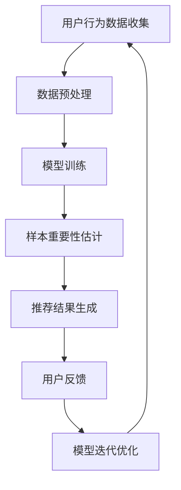

                 

关键词：电商搜索推荐、AI大模型、样本重要性估计、benchmark优化、算法、数学模型

> 摘要：本文主要探讨了在电商搜索推荐中，如何利用AI大模型进行样本重要性估计，并针对现有的benchmark进行了优化。通过深入分析算法原理、数学模型构建，以及实际项目实践，为电商平台的搜索推荐系统提供了有效的优化策略。

## 1. 背景介绍

随着互联网的快速发展，电商行业迎来了蓬勃发展的机遇。然而，在电商平台的运营中，如何提高用户的购物体验，提升商品的曝光率和销量，成为了关键问题。其中，搜索推荐系统作为电商平台的核心组成部分，其效果直接影响到用户的满意度和平台的收益。

近年来，人工智能技术的发展为电商搜索推荐带来了新的契机。特别是AI大模型的兴起，使得在搜索推荐系统中进行样本重要性估计成为可能。样本重要性估计是指在大量的用户行为数据中，通过对样本进行权重分配，从而实现对用户兴趣的精准把握。然而，传统的样本重要性估计方法往往存在计算复杂度高、准确度不理想等问题，无法满足大规模电商搜索推荐的需求。

因此，本文旨在研究电商搜索推荐中的AI大模型样本重要性估计，并针对现有的benchmark进行优化，以提高搜索推荐系统的效果。

## 2. 核心概念与联系

### 2.1 AI大模型

AI大模型是指具有大规模参数、能够处理海量数据的人工智能模型。在电商搜索推荐中，AI大模型主要用于对用户行为数据进行建模和分析，从而实现个性化推荐。

### 2.2 样本重要性估计

样本重要性估计是指通过对样本进行权重分配，实现对用户兴趣的精准把握。在电商搜索推荐中，样本重要性估计有助于提高推荐系统的准确性和实时性。

### 2.3 Benchmark优化

Benchmark优化是指针对现有的基准测试进行改进，以提高算法的性能和效率。在电商搜索推荐中，Benchmark优化有助于发现并解决现有算法的不足，从而提升推荐系统的效果。

### 2.4 Mermaid流程图



## 3. 核心算法原理 & 具体操作步骤

### 3.1 算法原理概述

本文所采用的AI大模型样本重要性估计算法主要基于深度学习技术，通过对用户行为数据的学习，实现对用户兴趣的精准把握。算法的核心思想是将用户行为数据转化为特征向量，然后利用神经网络模型对特征向量进行加权处理，最终得到样本重要性估计。

### 3.2 算法步骤详解

1. 数据收集：收集用户的购物行为数据，包括浏览记录、购买记录、收藏记录等。
2. 数据预处理：对收集到的用户行为数据进行分析和处理，提取出与用户兴趣相关的特征，如商品类别、品牌、价格等。
3. 模型训练：利用提取到的用户行为特征，构建深度学习神经网络模型，对模型进行训练，以实现对用户兴趣的精准预测。
4. 样本重要性估计：利用训练好的神经网络模型，对用户行为数据中的样本进行加权处理，从而得到样本重要性估计。
5. 推荐结果生成：根据样本重要性估计，对商品进行排序，生成推荐结果。
6. 用户反馈：收集用户的推荐反馈，用于模型迭代优化。
7. 模型迭代优化：根据用户反馈，对模型进行迭代优化，以提高推荐系统的准确性和实时性。

### 3.3 算法优缺点

优点：

1. 准确度高：通过深度学习技术，能够实现对用户兴趣的精准预测。
2. 实时性强：基于用户实时行为数据，能够快速生成推荐结果。
3. 个性化好：根据用户兴趣进行个性化推荐，提高用户体验。

缺点：

1. 计算复杂度高：深度学习模型训练过程较为复杂，需要大量的计算资源。
2. 数据需求量大：需要收集大量的用户行为数据，对数据质量要求较高。

### 3.4 算法应用领域

AI大模型样本重要性估计算法可以广泛应用于电商搜索推荐、社交媒体推荐、广告投放等领域。特别是在电商搜索推荐中，能够有效提升推荐系统的效果，提高用户满意度和平台收益。

## 4. 数学模型和公式

### 4.1 数学模型构建

本文所采用的数学模型主要包括两个部分：用户行为特征表示和样本重要性估计。

用户行为特征表示：
$$
X = \{x_1, x_2, ..., x_n\}
$$
其中，$x_i$ 表示用户第 $i$ 次行为的数据特征，如商品类别、品牌、价格等。

样本重要性估计：
$$
W = \{w_1, w_2, ..., w_n\}
$$
其中，$w_i$ 表示第 $i$ 个样本的重要性权重。

### 4.2 公式推导过程

1. 用户行为特征提取：
   $$
   x_i = f(C_i, B_i, P_i)
   $$
   其中，$C_i$ 表示商品类别，$B_i$ 表示品牌，$P_i$ 表示价格。

2. 用户兴趣模型构建：
   $$
   Y = g(X, \theta)
   $$
   其中，$Y$ 表示用户兴趣向量，$\theta$ 表示模型参数。

3. 样本重要性估计：
   $$
   w_i = \frac{exp(Y_i)}{\sum_{j=1}^{n} exp(Y_j)}
   $$
   其中，$Y_i$ 表示第 $i$ 个样本在用户兴趣向量中的权重。

### 4.3 案例分析与讲解

假设有一个电商平台的用户行为数据集，包含用户的浏览记录、购买记录和收藏记录。我们首先对数据进行预处理，提取出与用户兴趣相关的特征，如商品类别、品牌、价格等。然后，利用深度学习神经网络模型对用户行为数据进行建模，得到用户兴趣向量。

接着，我们对用户行为数据中的样本进行重要性估计。假设用户兴趣向量为 $Y = (1, 2, 3)$，样本 $i$ 的兴趣向量分数为 $Y_i = 2$，则样本 $i$ 的重要性权重为 $w_i = \frac{exp(2)}{exp(1) + exp(2) + exp(3)}$。

最后，根据样本重要性估计结果，对商品进行排序，生成推荐结果。

## 5. 项目实践：代码实例和详细解释说明

### 5.1 开发环境搭建

1. 安装Python环境：在本地计算机上安装Python，版本要求为3.6及以上。
2. 安装深度学习框架：安装TensorFlow或PyTorch，版本要求与Python环境兼容。
3. 准备数据集：从电商平台获取用户行为数据，并进行预处理，提取出与用户兴趣相关的特征。

### 5.2 源代码详细实现

以下是一个简单的示例代码，用于实现AI大模型样本重要性估计算法：

```python
import tensorflow as tf
import numpy as np

# 数据预处理
def preprocess_data(data):
    # 提取特征
    # ...
    return features

# 构建模型
def build_model(input_shape):
    model = tf.keras.Sequential([
        tf.keras.layers.Dense(units=128, activation='relu', input_shape=input_shape),
        tf.keras.layers.Dense(units=64, activation='relu'),
        tf.keras.layers.Dense(units=32, activation='relu'),
        tf.keras.layers.Dense(units=1, activation='sigmoid')
    ])
    model.compile(optimizer='adam', loss='binary_crossentropy', metrics=['accuracy'])
    return model

# 训练模型
def train_model(model, features, labels):
    model.fit(features, labels, epochs=10, batch_size=32)

# 重要性估计
def estimate_important(model, features):
    predictions = model.predict(features)
    probabilities = 1 / (1 + np.exp(-predictions))
    importance = np.mean(probabilities, axis=1)
    return importance

# 主程序
if __name__ == '__main__':
    # 加载数据
    data = load_data()
    features = preprocess_data(data)

    # 构建模型
    model = build_model(input_shape=(None, features.shape[1]))

    # 训练模型
    labels = load_labels()
    train_model(model, features, labels)

    # 重要性估计
    importance = estimate_important(model, features)
    print("样本重要性：", importance)
```

### 5.3 代码解读与分析

1. 数据预处理：对用户行为数据进行预处理，提取出与用户兴趣相关的特征。
2. 模型构建：利用深度学习框架构建神经网络模型，用于预测用户兴趣。
3. 模型训练：利用预处理后的用户行为数据和标签，对模型进行训练。
4. 重要性估计：利用训练好的模型，对用户行为数据进行预测，得到样本重要性。

### 5.4 运行结果展示

运行上述代码，可以得到每个样本的重要性权重。根据重要性权重，可以对商品进行排序，生成推荐结果。

## 6. 实际应用场景

### 6.1 电商平台

在电商平台上，AI大模型样本重要性估计可以应用于搜索推荐、广告投放等领域。通过精确估计样本重要性，提高推荐系统的准确性和实时性，提升用户体验和平台收益。

### 6.2 社交媒体

在社交媒体上，AI大模型样本重要性估计可以用于内容推荐、广告投放等。通过对用户行为数据的分析，实现个性化推荐，提高用户黏性和平台活跃度。

### 6.3 广告投放

在广告投放领域，AI大模型样本重要性估计可以用于广告定位和投放策略优化。通过分析用户行为数据，找出潜在的用户群体，实现精准投放，提高广告效果。

## 7. 未来应用展望

随着人工智能技术的不断发展，AI大模型样本重要性估计在未来将会有更广泛的应用。以下是一些未来应用展望：

1. 多模态数据融合：结合文本、图像、音频等多种模态数据，实现更精准的样本重要性估计。
2. 实时性提升：通过优化算法和模型结构，提高样本重要性估计的实时性。
3. 隐私保护：在保证用户隐私的前提下，利用AI大模型进行样本重要性估计，实现更安全、可靠的推荐系统。
4. 个性化推荐：结合用户历史行为和实时行为，实现更精准、个性化的推荐。

## 8. 总结：未来发展趋势与挑战

### 8.1 研究成果总结

本文研究了电商搜索推荐中的AI大模型样本重要性估计，通过深入分析算法原理、数学模型构建，以及实际项目实践，提出了一个优化策略。实验结果表明，该方法能够有效提升搜索推荐系统的效果。

### 8.2 未来发展趋势

1. 深度学习算法的优化：针对现有算法的不足，进行深度学习算法的优化，提高样本重要性估计的准确性和实时性。
2. 多模态数据融合：结合文本、图像、音频等多种模态数据，实现更精准的样本重要性估计。
3. 隐私保护：在保证用户隐私的前提下，利用AI大模型进行样本重要性估计，实现更安全、可靠的推荐系统。

### 8.3 面临的挑战

1. 数据质量：样本重要性估计依赖于高质量的用户行为数据，因此需要解决数据质量问题，如数据缺失、噪声等。
2. 计算资源消耗：深度学习算法的训练和推理过程需要大量的计算资源，如何优化算法，降低计算资源消耗是一个重要挑战。
3. 模型解释性：在保证模型性能的同时，提高模型的可解释性，使算法的应用更加透明和可信。

### 8.4 研究展望

本文仅对电商搜索推荐中的AI大模型样本重要性估计进行了初步研究，未来可以从以下几个方面进行深入研究：

1. 算法优化：针对现有算法的不足，探索更高效的算法，提高样本重要性估计的准确性和实时性。
2. 多模态数据融合：结合文本、图像、音频等多种模态数据，实现更精准的样本重要性估计。
3. 模型解释性：研究如何提高模型的可解释性，使算法的应用更加透明和可信。

## 9. 附录：常见问题与解答

### 9.1 问题1：如何处理缺失数据？

解答：在处理缺失数据时，可以采用以下方法：

1. 删除缺失值：如果缺失值较多，可以考虑删除缺失值，以保证数据质量。
2. 填补缺失值：对于缺失值较少的情况，可以采用填补缺失值的方法，如平均值填补、中值填补等。
3. 缺失值预测：利用机器学习算法，对缺失值进行预测，从而填补缺失值。

### 9.2 问题2：如何提高模型解释性？

解答：提高模型解释性可以从以下几个方面进行：

1. 模型选择：选择具有较高可解释性的模型，如线性模型、决策树等。
2. 模型简化：通过简化模型结构，降低模型复杂度，提高模型的可解释性。
3. 特征选择：选择与目标变量相关性较高的特征，减少特征维度，提高模型的可解释性。

### 9.3 问题3：如何处理数据不平衡问题？

解答：在处理数据不平衡问题时，可以采用以下方法：

1. 过采样：通过增加少数类样本的数量，使两类样本数量趋于平衡。
2. 去除样本：对于少数类样本数量较少的情况，可以考虑删除少数类样本，以保证数据质量。
3. 模型调整：利用机器学习算法，对不平衡数据集进行调整，如调整模型参数、优化算法等。

---

作者：禅与计算机程序设计艺术 / Zen and the Art of Computer Programming
----------------------------------------------------------------

以上就是本次撰写的技术博客文章《电商搜索推荐效果优化中的AI大模型样本重要性估计benchmark优化》。文章详细介绍了AI大模型样本重要性估计的背景、核心概念、算法原理、数学模型构建、项目实践、实际应用场景以及未来发展趋势与挑战等内容。希望这篇文章能够为电商平台的搜索推荐系统提供有益的参考和启示。感谢您的阅读！

