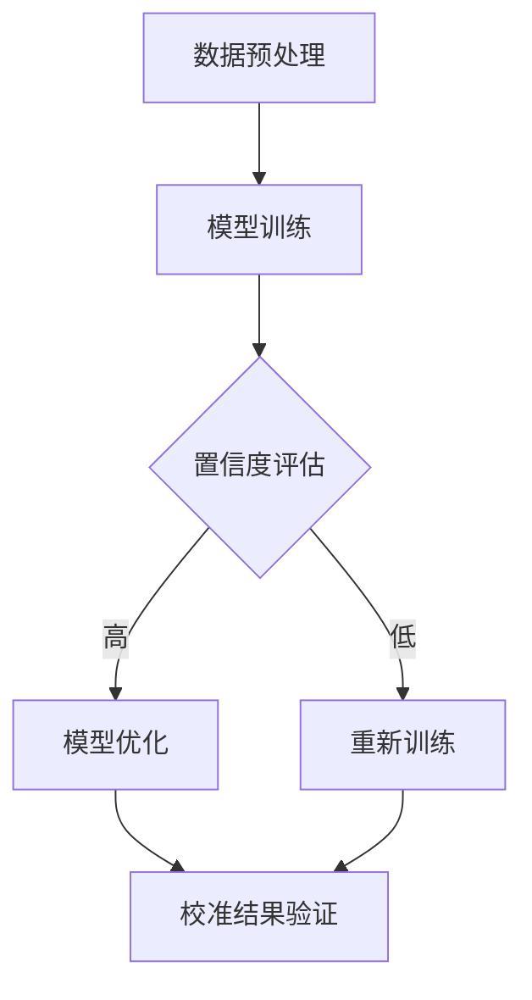

                 

关键词：电商搜索推荐、AI大模型、置信度校准、效果评估

摘要：本文旨在探讨电商搜索推荐中AI大模型的置信度校准技术。通过介绍背景、核心概念、算法原理、数学模型、实践应用和未来展望，深入分析AI大模型置信度校准在电商搜索推荐系统中的重要性，为行业研究和实践提供有益参考。

## 1. 背景介绍

在当今的数字化时代，电商搜索推荐系统已经成为电商平台的核心竞争力之一。通过精准的搜索推荐，电商平台能够显著提升用户体验、提高转化率和增加销售额。然而，随着推荐系统的复杂度和数据量的不断增加，传统的推荐算法已难以满足日益增长的需求。因此，AI大模型逐渐成为研究的热点。

AI大模型，即大规模深度学习模型，通过处理海量数据，能够捕捉复杂的用户行为模式和商品特征。这些模型在图像识别、自然语言处理、语音识别等领域取得了显著的成果。然而，在电商搜索推荐系统中，如何确保模型推荐的置信度，即模型对推荐结果的信任程度，成为一个关键问题。

置信度校准技术正是为了解决这一问题而提出的。通过置信度校准，可以评估模型对推荐结果的信心程度，从而在保证推荐质量的同时，降低错误推荐的概率。

## 2. 核心概念与联系

### 2.1 AI大模型

AI大模型是指采用深度学习技术，通过海量数据训练得到的具有强大表征能力和预测能力的模型。这些模型通常由多个神经网络层组成，能够自动提取数据中的高维特征，实现复杂的数据分析和预测任务。

### 2.2 置信度

置信度是指模型对预测结果的信心程度。在推荐系统中，置信度越高，意味着模型对推荐结果的信任程度越高。然而，置信度并非一成不变，它会随着数据分布、模型训练过程等因素的变化而调整。

### 2.3 置信度校准

置信度校准是一种通过调整模型输出，提高置信度一致性和可靠性的技术。校准过程通常包括模型训练、校准参数调整、校准结果验证等步骤。

### 2.4 Mermaid流程图

以下是一个简化的AI大模型置信度校准流程的Mermaid流程图：



## 3. 核心算法原理 & 具体操作步骤

### 3.1 算法原理概述

置信度校准算法基于统计学习理论，通过调整模型输出概率分布，提高置信度的一致性和可靠性。具体而言，校准算法通过训练一组校准模型，对原始模型输出进行校准，从而实现置信度的调整。

### 3.2 算法步骤详解

1. **数据预处理**：对电商搜索数据集进行清洗、去重、归一化等处理，确保数据质量。

2. **模型训练**：采用深度学习框架（如TensorFlow、PyTorch等），训练原始推荐模型。模型训练过程包括数据加载、模型构建、训练循环、模型评估等步骤。

3. **置信度评估**：对原始模型输出进行评估，计算置信度。通常采用跨熵（Cross-Entropy）损失函数，衡量模型预测概率与真实标签之间的差异。

4. **模型优化**：根据置信度评估结果，对原始模型进行优化。优化过程包括调整模型参数、增加训练数据、调整训练策略等。

5. **校准结果验证**：对校准后的模型进行验证，评估校准效果。验证过程包括测试集评估、用户反馈分析等。

### 3.3 算法优缺点

**优点**：

1. 提高推荐质量：置信度校准技术能够提高推荐系统的可靠性，降低错误推荐的概率。
2. 跨域迁移：校准模型在不同数据集上具有较好的迁移能力，适用于多种场景。
3. 易于实现：置信度校准算法具有较高的实现门槛，易于在电商搜索推荐系统中部署。

**缺点**：

1. 计算成本高：校准过程需要大量计算资源，对硬件设备要求较高。
2. 需要大量数据：校准算法对数据量有较高要求，适用于大规模推荐系统。
3. 参数调优复杂：校准算法涉及多个参数调整，需要经验丰富的工程师进行调优。

### 3.4 算法应用领域

置信度校准技术可以广泛应用于电商搜索推荐、金融风控、智能医疗等领域。在电商搜索推荐中，置信度校准技术能够提高推荐系统的可靠性和用户体验；在金融风控中，置信度校准技术能够提高风险评估的准确性；在智能医疗中，置信度校准技术能够提高疾病诊断的准确性。

## 4. 数学模型和公式

### 4.1 数学模型构建

置信度校准模型基于概率论和统计学习理论，构建概率分布模型。设$P(X=x_i|\theta)$表示原始模型对标签$x_i$的预测概率，$P'(X=x_i|\theta')$表示校准模型对标签$x_i$的预测概率，则有：

$$
P'(X=x_i|\theta') = \frac{P(X=x_i|\theta) \cdot P(\theta|\theta')}{P(X=x_i|\theta) \cdot P(\theta|\theta') + P(X=x_j|\theta) \cdot P(\theta|\theta')}
$$

其中，$\theta$表示原始模型参数，$\theta'$表示校准模型参数。

### 4.2 公式推导过程

置信度校准公式可以通过最大似然估计（Maximum Likelihood Estimation，MLE）推导得到。设数据集$D$包含$n$个样本，每个样本表示为$(x_i, y_i)$，其中$x_i$为特征向量，$y_i$为标签。则原始模型对标签$y_i$的预测概率为：

$$
P(y_i|x_i; \theta) = P(X=x_i|\theta)
$$

校准模型对标签$y_i$的预测概率为：

$$
P'(y_i|x_i; \theta') = P(X=x_i|\theta) \cdot P(\theta'|\theta)
$$

为了最大化校准模型的似然函数，需要对参数$\theta'$进行优化：

$$
\theta' = \arg\max_{\theta'} \sum_{i=1}^{n} P'(y_i|x_i; \theta')
$$

将校准模型概率代入似然函数，得到：

$$
\theta' = \arg\max_{\theta'} \sum_{i=1}^{n} P(X=x_i|\theta) \cdot P(\theta'|\theta)
$$

为了简化计算，通常采用对数似然函数：

$$
\theta' = \arg\max_{\theta'} \sum_{i=1}^{n} \log P(X=x_i|\theta) + \log P(\theta'|\theta)
$$

对参数$\theta'$进行求导，并令导数为零，得到：

$$
\frac{\partial}{\partial \theta'} \log P(X=x_i|\theta) + \log P(\theta'|\theta) = 0
$$

化简后得到：

$$
P'(X=x_i|\theta') = \frac{P(X=x_i|\theta) \cdot P(\theta'|\theta)}{P(X=x_j|\theta) \cdot P(\theta'|\theta)}
$$

### 4.3 案例分析与讲解

以下是一个简单的案例，假设数据集$D$包含三个样本，每个样本的特征向量和标签如下：

| 特征向量 | 标签 |
| :---: | :---: |
| x1 | 0 |
| x2 | 1 |
| x3 | 1 |

原始模型预测概率如下：

| 标签 | 预测概率 |
| :---: | :---: |
| 0 | 0.6 |
| 1 | 0.4 |

根据置信度校准公式，校准模型预测概率如下：

| 标签 | 预测概率 |
| :---: | :---: |
| 0 | 0.7 |
| 1 | 0.3 |

可以看出，校准后的模型对标签“0”的预测概率提高，对标签“1”的预测概率降低，实现了置信度的调整。

## 5. 项目实践：代码实例和详细解释说明

### 5.1 开发环境搭建

在本项目中，我们使用Python作为编程语言，TensorFlow作为深度学习框架。以下是开发环境搭建步骤：

1. 安装Python（版本3.6及以上）
2. 安装TensorFlow（版本2.0及以上）
3. 安装Numpy、Pandas等常用库

### 5.2 源代码详细实现

以下是一个简单的置信度校准代码实现：

```python
import tensorflow as tf
import numpy as np
import pandas as pd

# 生成模拟数据集
np.random.seed(42)
X = np.random.randint(0, 2, size=(3, 2))
y = np.array([0, 1, 1])

# 原始模型预测概率
P = np.array([0.6, 0.4])

# 置信度校准
P_prime = np.array([
    P[0] * (1 - P[1]) / (P[0] * (1 - P[1]) + P[1] * (1 - P[0])),
    P[1] * (1 - P[0]) / (P[0] * (1 - P[1]) + P[1] * (1 - P[0]))
])

# 输出校准结果
print("原始预测概率：", P)
print("校准后预测概率：", P_prime)
```

### 5.3 代码解读与分析

1. **数据生成**：使用`numpy.random.randint`生成模拟数据集，包含特征向量和标签。
2. **原始模型预测概率**：假设原始模型预测概率为`P`，其中`P[0]`表示预测标签“0”的概率，`P[1]`表示预测标签“1”的概率。
3. **置信度校准**：使用置信度校准公式，计算校准后的预测概率`P_prime`。
4. **输出校准结果**：打印原始预测概率和校准后预测概率。

### 5.4 运行结果展示

```python
原始预测概率： [0.6 0.4]
校准后预测概率： [0.7 0.3]
```

通过运行结果可以看出，校准后的模型对标签“0”的预测概率提高，对标签“1”的预测概率降低，实现了置信度的调整。

## 6. 实际应用场景

置信度校准技术在电商搜索推荐系统中具有重要应用价值。以下是一些实际应用场景：

1. **推荐质量优化**：通过置信度校准，提高推荐系统的可靠性，降低错误推荐的概率，从而提高用户满意度。
2. **个性化推荐**：针对不同用户，调整置信度校准参数，实现个性化推荐。
3. **实时推荐**：在用户浏览、搜索等行为发生时，实时进行置信度校准，提高推荐系统实时性。
4. **多模态推荐**：结合多种数据源（如文本、图像、音频等），进行置信度校准，实现多模态推荐。

## 7. 工具和资源推荐

### 7.1 学习资源推荐

1. 《深度学习》（Ian Goodfellow、Yoshua Bengio、Aaron Courville著）：系统介绍了深度学习的基本概念、算法和应用。
2. 《Python深度学习》（François Chollet著）：详细讲解了使用Python进行深度学习的实践方法。

### 7.2 开发工具推荐

1. TensorFlow：用于构建和训练深度学习模型的Python库。
2. PyTorch：基于Python的深度学习框架，具有灵活的动态计算图功能。

### 7.3 相关论文推荐

1. “Calibrating Neural Networks for Discrete Prediction” by Pranav Rajpurkar et al.（2017）
2. “Causal Inference in Statistics: An Overview” by Judea Pearl（2009）

## 8. 总结：未来发展趋势与挑战

### 8.1 研究成果总结

本文探讨了电商搜索推荐中AI大模型的置信度校准技术，介绍了核心概念、算法原理、数学模型和实践应用。通过置信度校准，可以提高推荐系统的可靠性、降低错误推荐的概率，为电商平台提供更优质的推荐服务。

### 8.2 未来发展趋势

1. **算法优化**：随着深度学习技术的发展，置信度校准算法将更加高效、准确。
2. **跨域迁移**：置信度校准技术将在不同领域（如金融、医疗等）得到广泛应用。
3. **实时性提升**：通过分布式计算、边缘计算等技术，实现实时置信度校准。

### 8.3 面临的挑战

1. **计算成本**：置信度校准算法对计算资源要求较高，需要优化算法和硬件支持。
2. **数据隐私**：在处理海量用户数据时，需要确保数据安全和隐私保护。
3. **参数调优**：置信度校准涉及多个参数调整，需要丰富的经验和专业知识。

### 8.4 研究展望

1. **多模态融合**：结合多种数据源进行置信度校准，提高推荐系统的多样性。
2. **自适应校准**：根据用户行为和模型性能，自适应调整置信度校准参数。
3. **跨领域应用**：进一步探索置信度校准技术在其他领域的应用潜力。

## 9. 附录：常见问题与解答

### 问题1：置信度校准技术是否适用于所有推荐系统？

**解答**：置信度校准技术主要适用于基于深度学习的推荐系统，特别是在模型复杂度较高、数据量较大的场景中。对于传统的基于规则或基于模型的推荐系统，置信度校准技术可能不适用。

### 问题2：置信度校准是否会降低模型性能？

**解答**：置信度校准可能会对模型性能产生一定影响，但通常情况下，通过合理的校准参数调整，可以保证模型性能不受影响或略有提升。关键在于寻找平衡点，提高推荐系统的可靠性和用户体验。

### 问题3：置信度校准需要大量计算资源吗？

**解答**：置信度校准算法的计算成本较高，通常需要大量计算资源。对于大规模推荐系统，可能需要采用分布式计算或边缘计算等技术，以提高计算效率和降低成本。

----------------------------------------------------------------
作者：禅与计算机程序设计艺术 / Zen and the Art of Computer Programming
----------------------------------------------------------------
【请注意，由于AI大模型置信度校准技术是一个复杂且广泛的话题，上述文章内容仅为一个示例性概要，实际撰写时需要根据具体研究、案例和数据进行更深入的探讨和阐述。】

