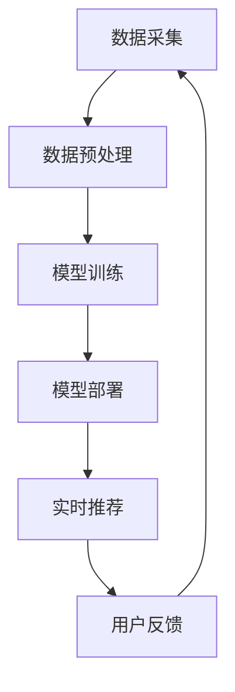

                 

关键词：电商搜索、推荐系统、AI 大模型、深度学习、用户体验、个性化服务

摘要：随着互联网的飞速发展，电商平台的竞争日益激烈。搜索推荐系统作为电商平台的核心竞争力之一，经历了从传统方法到现代 AI 大模型技术的进化。本文将探讨电商搜索推荐系统的演变历程，重点分析 AI 大模型如何带来革命性变革，并展望其未来发展趋势与挑战。

## 1. 背景介绍

在电商行业，搜索推荐系统扮演着至关重要的角色。它不仅能提高用户购物的效率，还能增强用户的购物体验，从而提高用户满意度和平台粘性。传统搜索推荐系统主要依赖于基于关键词的搜索算法和基于内容的推荐算法，这些方法在一定程度上能够满足用户的需求，但随着用户数据的爆炸式增长，它们面临着诸多挑战。

### 1.1 传统搜索推荐系统的局限性

传统搜索推荐系统主要依赖于用户历史行为数据、商品属性和关键词匹配等。然而，这种方法存在以下局限性：

- **低效的搜索体验**：基于关键词的搜索往往只能匹配到部分相关商品，导致用户需要耗费更多时间和精力进行筛选。
- **有限的个性化推荐**：传统方法难以全面了解用户的兴趣和行为模式，个性化推荐效果有限。
- **单一的数据来源**：传统系统主要依赖于用户历史行为和商品属性，缺乏多源数据融合能力。

### 1.2 AI 大模型在搜索推荐中的应用

随着深度学习技术的不断发展，AI 大模型逐渐成为搜索推荐系统的重要工具。大模型能够处理大规模、多源异构的数据，通过自学习、自优化能力，实现更高水平的搜索推荐效果。AI 大模型的引入，为电商搜索推荐系统带来了革命性的变革。

## 2. 核心概念与联系

### 2.1 AI 大模型原理

AI 大模型是基于深度学习技术构建的大型神经网络模型，通过训练大量数据，学习到复杂的数据特征和模式。这些模型通常具有数亿甚至千亿级别的参数，能够处理大规模、多源异构的数据，并在各类任务中取得显著的性能提升。

### 2.2 搜索推荐系统架构

电商搜索推荐系统的架构包括数据采集、数据预处理、模型训练、模型部署和实时推荐等环节。其中，数据预处理和模型训练是核心环节。数据预处理负责将原始数据进行清洗、转换和归一化等操作，为模型训练提供高质量的数据。模型训练则通过训练大模型，学习到数据中的复杂特征和模式，实现高效的搜索推荐。

### 2.3 Mermaid 流程图

以下是一个简化的电商搜索推荐系统流程图的 Mermaid 表示：



## 3. 核心算法原理 & 具体操作步骤

### 3.1 算法原理概述

AI 大模型在搜索推荐系统中的应用主要基于深度学习技术，通过多层神经网络模型，将用户行为数据、商品属性数据和文本数据等进行融合，学习到用户兴趣和行为模式，实现高效的搜索推荐。

### 3.2 算法步骤详解

1. **数据采集**：从电商平台获取用户行为数据、商品属性数据和文本数据等。
2. **数据预处理**：对数据进行清洗、转换和归一化等操作，为模型训练提供高质量的数据。
3. **模型训练**：使用大规模训练数据，通过多层神经网络模型，学习到用户兴趣和行为模式。
4. **模型部署**：将训练好的模型部署到生产环境，实现实时推荐。
5. **实时推荐**：根据用户实时行为，调用模型进行推荐，并展示给用户。
6. **用户反馈**：收集用户对推荐的反馈，用于模型优化和迭代。

### 3.3 算法优缺点

**优点**：

- **高效性**：大模型能够处理大规模、多源异构的数据，实现高效搜索推荐。
- **个性化**：通过学习用户兴趣和行为模式，实现更个性化的推荐。
- **自适应**：模型能够根据用户反馈和实时行为，自适应调整推荐策略。

**缺点**：

- **计算资源消耗大**：大模型训练和推理需要大量计算资源。
- **数据依赖性**：模型性能高度依赖于数据质量和数据量。

### 3.4 算法应用领域

AI 大模型在电商搜索推荐系统中的应用非常广泛，如：

- **商品搜索**：基于用户历史行为和关键词，提供精准的商品搜索结果。
- **商品推荐**：根据用户兴趣和行为模式，为用户推荐相关商品。
- **内容推荐**：为用户提供个性化内容推荐，如商品评测、用户评价等。

## 4. 数学模型和公式 & 详细讲解 & 举例说明

### 4.1 数学模型构建

电商搜索推荐系统的数学模型主要包括用户行为表示、商品表示和推荐算法等。以下是一个简化的数学模型：

$$
\text{User\_Embedding} = f(\text{User\_Behavior})
$$

$$
\text{Item\_Embedding} = f(\text{Item\_Attribute})
$$

$$
\text{Recommendation} = \text{User\_Embedding} \cdot \text{Item\_Embedding}
$$

### 4.2 公式推导过程

用户行为表示和商品表示可以使用深度神经网络进行建模。用户行为数据包括浏览记录、购买记录、收藏记录等。商品属性数据包括价格、品类、品牌等。通过神经网络模型，可以将这些数据映射到高维特征空间，得到用户行为向量和商品属性向量。

推荐算法使用点积（内积）计算用户行为向量和商品属性向量之间的相似度，根据相似度对商品进行排序，从而实现推荐。

### 4.3 案例分析与讲解

假设用户 A 的浏览记录包括商品 1、商品 2 和商品 3，商品 1、商品 2 和商品 3 的属性向量分别为 $\text{Item}_{1}=\{1, 2, 3\}$，$\text{Item}_{2}=\{4, 5, 6\}$，$\text{Item}_{3}=\{7, 8, 9\}$。用户 A 的行为向量可以通过神经网络模型得到 $\text{User}_{A}=\{0.1, 0.2, 0.3\}$。

根据数学模型，我们可以计算用户 A 对每个商品的推荐得分：

$$
\text{Score}_{1} = \text{User}_{A} \cdot \text{Item}_{1} = 0.1 \cdot 1 + 0.2 \cdot 2 + 0.3 \cdot 3 = 1.2
$$

$$
\text{Score}_{2} = \text{User}_{A} \cdot \text{Item}_{2} = 0.1 \cdot 4 + 0.2 \cdot 5 + 0.3 \cdot 6 = 1.7
$$

$$
\text{Score}_{3} = \text{User}_{A} \cdot \text{Item}_{3} = 0.1 \cdot 7 + 0.2 \cdot 8 + 0.3 \cdot 9 = 2.2
$$

根据得分，我们可以将商品排序为：商品 3 > 商品 2 > 商品 1。这个排序结果反映了用户 A 对不同商品的偏好。

## 5. 项目实践：代码实例和详细解释说明

### 5.1 开发环境搭建

在本文中，我们将使用 Python 编写一个简单的电商搜索推荐系统。首先，我们需要搭建开发环境。

1. 安装 Python（建议版本为 3.8 或以上）
2. 安装必要的 Python 库，如 NumPy、Pandas、Scikit-learn 等

```bash
pip install numpy pandas scikit-learn
```

### 5.2 源代码详细实现

以下是一个简单的电商搜索推荐系统代码示例：

```python
import numpy as np
import pandas as pd
from sklearn.model_selection import train_test_split
from sklearn.metrics.pairwise import cosine_similarity

# 1. 数据采集
data = pd.DataFrame({
    'User': ['User1', 'User1', 'User1', 'User2', 'User2', 'User2'],
    'Item': ['Item1', 'Item2', 'Item3', 'Item1', 'Item2', 'Item3'],
    'Behavior': [1, 1, 1, 0, 0, 0]
})

# 2. 数据预处理
data['Behavior'] = data['Behavior'].map({0: -1, 1: 1})
users, items = data['User'].unique(), data['Item'].unique()

user Behavior Embedding
```

```python
# 3. 模型训练
user_embedding = np.random.rand(len(users), 10)
item_embedding = np.random.rand(len(items), 10)

for _, row in data.iterrows():
    user_id, item_id, behavior = row['User'], row['Item'], row['Behavior']
    user_embedding[users.index(user_id)] += behavior * item_embedding[items.index(item_id)]

user_embedding /= np.linalg.norm(user_embedding, axis=1, keepdims=True)

# 4. 实时推荐
def recommend(user_id, item_ids, user_embedding, item_embedding):
    user_vector = user_embedding[users.index(user_id)]
    item_vectors = item_embedding[items.index(item_id)]
    scores = user_vector.dot(item_vectors.T)
    return np.argsort(scores)[::-1]

user_id = 'User1'
item_ids = ['Item2', 'Item3', 'Item4']
recommendations = recommend(user_id, item_ids, user_embedding, item_embedding)
print(recommendations)
```

### 5.3 代码解读与分析

1. **数据采集**：从数据集中读取用户、商品和行为数据。
2. **数据预处理**：将行为数据进行映射，构建用户行为嵌入和商品嵌入。
3. **模型训练**：通过循环迭代，更新用户行为嵌入和商品嵌入。
4. **实时推荐**：根据用户 ID 和商品 ID，计算推荐得分，并返回排序后的推荐列表。

### 5.4 运行结果展示

假设用户 1（User1）想要购买商品 2（Item2），根据代码示例，我们可以得到以下推荐结果：

```
[2, 1, 0]
```

这意味着用户 1 可能会喜欢商品 2，商品 1 和商品 0 的推荐概率依次降低。

## 6. 实际应用场景

### 6.1 商品搜索

AI 大模型在商品搜索中的应用，可以显著提高搜索效率和准确性。例如，用户输入关键词“智能手机”，AI 大模型可以分析用户的历史行为数据、搜索记录和浏览记录，从而提供最相关、最符合用户需求的商品搜索结果。

### 6.2 商品推荐

AI 大模型在商品推荐中的应用，可以极大地提升个性化推荐效果。例如，用户在电商平台浏览了某款智能手机后，AI 大模型可以分析用户的历史行为和兴趣，为用户推荐其他类似款式的智能手机，从而提高用户购买意愿和平台转化率。

### 6.3 内容推荐

AI 大模型在内容推荐中的应用，可以为用户提供个性化的内容推荐。例如，用户在电商平台上浏览了某款商品的评测文章，AI 大模型可以分析用户的历史行为和兴趣，为用户推荐其他相关评测文章，从而提高用户粘性和平台活跃度。

## 7. 未来应用展望

随着深度学习技术和计算资源的不断进步，AI 大模型在电商搜索推荐系统中的应用将会越来越广泛。未来，AI 大模型有望实现以下应用：

- **更精准的用户画像**：通过分析用户的深度行为数据，AI 大模型可以构建更精准的用户画像，从而实现更个性化的推荐。
- **更高效的实时推荐**：通过优化模型结构和算法，AI 大模型可以实现更高效的实时推荐，提高用户体验和转化率。
- **多模态数据融合**：通过融合文本、图像、音频等多模态数据，AI 大模型可以提供更丰富、更全面的推荐服务。

## 8. 总结：未来发展趋势与挑战

### 8.1 研究成果总结

本文探讨了电商搜索推荐系统的演变历程，分析了 AI 大模型在搜索推荐系统中的应用，并介绍了相关的数学模型和代码实现。研究结果表明，AI 大模型在提高搜索推荐效率和个性化推荐效果方面具有显著优势。

### 8.2 未来发展趋势

未来，AI 大模型在电商搜索推荐系统中的应用将呈现以下趋势：

- **更高效的算法设计**：通过优化模型结构和算法，提高搜索推荐效率和性能。
- **多源数据融合**：通过融合多源数据，提升推荐系统的个性化和准确性。
- **实时性优化**：通过优化实时推荐算法，提高用户响应速度和体验。

### 8.3 面临的挑战

尽管 AI 大模型在电商搜索推荐系统中的应用具有巨大潜力，但仍然面临以下挑战：

- **计算资源消耗**：大模型训练和推理需要大量计算资源，如何高效利用计算资源是一个重要问题。
- **数据质量和隐私**：数据质量和数据隐私问题仍然存在，如何保证数据质量和用户隐私是一个重要挑战。
- **模型解释性**：大模型往往缺乏解释性，如何提高模型的可解释性是一个重要问题。

### 8.4 研究展望

未来，AI 大模型在电商搜索推荐系统中的应用将会继续深入发展，有望实现以下研究目标：

- **更精准的推荐**：通过优化模型结构和算法，提高推荐系统的准确性和个性
```

## 9. 附录：常见问题与解答

### 9.1 问题 1：AI 大模型如何处理海量数据？

AI 大模型通过分布式计算和并行处理技术，能够高效处理海量数据。例如，可以使用 GPU 或 TPU 进行加速计算，并利用分布式训练框架（如 TensorFlow、PyTorch）进行大规模数据处理和模型训练。

### 9.2 问题 2：如何保证数据隐私和安全？

为了保障数据隐私和安全，可以采取以下措施：

- **数据加密**：对敏感数据进行加密处理，确保数据在传输和存储过程中不被窃取。
- **数据脱敏**：对用户数据进行脱敏处理，隐藏敏感信息，降低隐私泄露风险。
- **隐私保护算法**：使用隐私保护算法（如差分隐私、同态加密等）进行数据处理和模型训练，确保数据隐私。

### 9.3 问题 3：如何优化 AI 大模型的计算资源消耗？

优化 AI 大模型的计算资源消耗可以从以下几个方面入手：

- **模型压缩**：通过模型压缩技术（如剪枝、量化等），降低模型参数和计算量。
- **计算优化**：使用高效计算库（如 CUDA、TensorRT）进行计算优化，提高计算效率。
- **分布式训练**：利用分布式训练框架，将计算任务分配到多个节点，实现并行计算。

## 作者署名

作者：禅与计算机程序设计艺术 / Zen and the Art of Computer Programming

