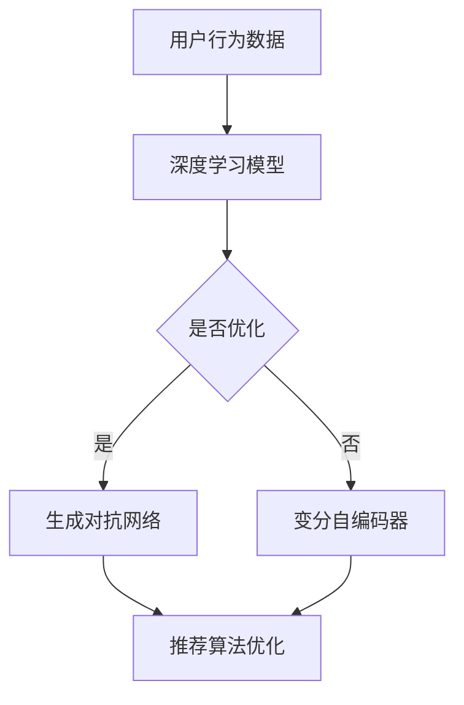

                 

关键词：电商搜索、推荐系统、AI 大模型、深度学习、自然语言处理、用户行为分析、商品匹配、个性化推荐

> 摘要：本文将探讨电商搜索推荐系统的进化过程，尤其是近年来AI大模型所带来的革命性变革。我们将深入分析AI大模型在电商搜索推荐系统中的应用，包括其核心概念、算法原理、数学模型、项目实践、实际应用场景以及未来发展趋势和挑战。通过本文的阅读，读者将全面了解AI大模型在电商搜索推荐领域的应用现状和未来前景。

## 1. 背景介绍

随着互联网和电子商务的快速发展，电商搜索推荐系统已成为电子商务平台的核心组成部分。传统的电商搜索推荐系统主要依赖于基于内容的过滤、协同过滤、基于分类的推荐等方法，这些方法在一定程度上能够满足用户的需求，但受限于数据质量和计算能力的限制，存在推荐准确性不高、用户体验不佳等问题。

近年来，随着人工智能技术的迅猛发展，特别是深度学习和自然语言处理等技术的成熟，AI大模型开始崭露头角，为电商搜索推荐系统带来了革命性的变革。AI大模型，如生成对抗网络（GAN）、变分自编码器（VAE）、Transformer等，以其强大的表征能力和自适应能力，能够在海量数据中挖掘出更深层次的规律，从而实现更精准、更个性化的推荐。

本文将首先介绍电商搜索推荐系统的基本概念和原理，然后深入探讨AI大模型在电商搜索推荐系统中的应用，分析其核心算法原理、数学模型、项目实践、实际应用场景，最后展望AI大模型在电商搜索推荐领域的未来发展趋势和面临的挑战。

### 1.1 电商搜索推荐系统的基本概念

电商搜索推荐系统是指通过分析用户的行为数据和商品信息，为用户推荐可能感兴趣的商品或服务。它包括以下几个核心组成部分：

- 用户行为分析：通过分析用户的浏览、搜索、购买等行为数据，了解用户的需求和偏好。
- 商品信息处理：将商品信息转化为可处理的数字形式，如商品标签、属性、描述等。
- 推荐算法：根据用户行为数据和商品信息，使用算法为用户生成个性化推荐列表。
- 用户反馈：收集用户的反馈信息，用于优化推荐算法和提高推荐质量。

电商搜索推荐系统的目的是提高用户的购物体验，增加商品的曝光率和销售量，同时降低运营成本。

### 1.2 电商搜索推荐系统的原理

电商搜索推荐系统主要通过以下几种方式实现推荐：

- 基于内容的过滤（Content-Based Filtering）：根据用户的历史行为和偏好，找到与用户感兴趣的商品相似的其他商品进行推荐。
- 协同过滤（Collaborative Filtering）：通过分析用户之间的相似性，找到具有相似兴趣的用户，为他们推荐他们可能感兴趣的商品。
- 基于分类的推荐（Classification-Based Recommender）：使用机器学习算法，如逻辑回归、决策树、随机森林等，将用户和商品进行分类，然后为同一类别的用户推荐相同类别的商品。

### 1.3 AI大模型在电商搜索推荐系统中的应用

AI大模型，如生成对抗网络（GAN）、变分自编码器（VAE）、Transformer等，在电商搜索推荐系统中发挥着重要作用。这些模型以其强大的表征能力和自适应能力，能够在海量数据中挖掘出更深层次的规律，从而实现更精准、更个性化的推荐。

- 生成对抗网络（GAN）：GAN由生成器和判别器两部分组成。生成器负责生成与真实数据相似的假数据，判别器负责判断生成数据是否真实。通过不断优化生成器和判别器的参数，GAN能够在海量商品数据中生成高质量的推荐列表。

- 变分自编码器（VAE）：VAE通过编码器和解码器两部分进行数据重构。编码器将输入数据压缩成潜在空间中的低维表示，解码器将潜在空间中的数据重构为原始数据。VAE能够在保证数据隐私的前提下，为用户提供个性化推荐。

- Transformer：Transformer模型以其强大的表征能力和并行计算能力，在自然语言处理领域取得了巨大的成功。在电商搜索推荐系统中，Transformer可以用于处理用户的行为数据和商品信息，实现更精准的推荐。

### 1.4 电商搜索推荐系统的挑战

尽管AI大模型在电商搜索推荐系统中展现出了巨大的潜力，但同时也面临着一系列挑战：

- 数据质量：电商搜索推荐系统的效果很大程度上依赖于用户行为数据和商品信息的数据质量。数据质量不高、缺失或噪声数据等问题会严重影响推荐效果。

- 计算能力：AI大模型通常需要大量的计算资源进行训练和推理。对于大型电商平台，计算能力是一个重要的制约因素。

- 用户隐私：在推荐过程中，用户隐私的保护是一个不可忽视的问题。如何在不泄露用户隐私的前提下，实现个性化推荐，是一个重要的研究课题。

- 算法公平性：在推荐过程中，算法是否公平也是一个重要的问题。如何避免算法歧视、偏见等问题，确保推荐结果的公平性，是当前研究的重点。

## 2. 核心概念与联系

### 2.1 AI大模型的基本概念

AI大模型是指具有大规模参数、能够处理海量数据的人工智能模型。这些模型通常使用深度学习技术进行训练和优化，具有强大的表征能力和自适应能力。

- 深度学习（Deep Learning）：深度学习是一种基于人工神经网络的学习方法，通过模拟人脑神经元之间的连接，实现对数据的自动特征提取和模式识别。
- 自然语言处理（Natural Language Processing，NLP）：自然语言处理是人工智能的一个重要分支，旨在使计算机能够理解和处理自然语言。
- 生成对抗网络（Generative Adversarial Networks，GAN）：生成对抗网络由生成器和判别器两部分组成，通过对抗训练生成与真实数据相似的数据。
- 变分自编码器（Variational Autoencoder，VAE）：变分自编码器是一种生成模型，通过编码器和解码器两部分进行数据重构。

### 2.2 AI大模型在电商搜索推荐系统中的应用

AI大模型在电商搜索推荐系统中的应用主要包括以下几个方面：

- 用户行为分析：使用深度学习技术对用户的行为数据进行分析，挖掘用户的需求和偏好。
- 商品信息处理：使用自然语言处理技术对商品信息进行处理，提取商品的特征信息。
- 推荐算法优化：使用生成对抗网络和变分自编码器等技术，优化推荐算法，提高推荐准确性。

### 2.3 Mermaid 流程图



在这个流程图中，用户行为数据经过深度学习模型处理，然后根据是否需要优化推荐算法，选择生成对抗网络或变分自编码器进行进一步优化。最终，优化后的推荐算法将生成个性化推荐列表。

## 3. 核心算法原理 & 具体操作步骤

### 3.1 算法原理概述

AI大模型在电商搜索推荐系统中的应用主要包括深度学习、自然语言处理、生成对抗网络和变分自编码器等技术。这些技术通过以下步骤实现个性化推荐：

1. 用户行为数据收集：收集用户的浏览、搜索、购买等行为数据。
2. 商品信息处理：对商品信息进行处理，提取商品的特征信息。
3. 模型训练：使用深度学习模型对用户行为数据和商品信息进行训练，生成用户画像和商品画像。
4. 推荐算法优化：使用生成对抗网络和变分自编码器等技术，优化推荐算法，提高推荐准确性。
5. 生成推荐列表：根据用户画像和商品画像，生成个性化推荐列表。

### 3.2 算法步骤详解

1. **用户行为数据收集**

   - 数据来源：用户行为数据可以从电商平台的后台系统中获取，包括浏览记录、搜索记录、购买记录等。
   - 数据处理：对用户行为数据进行清洗、去重、填充等处理，确保数据质量。

2. **商品信息处理**

   - 数据来源：商品信息可以从电商平台数据库中获取，包括商品名称、描述、标签、分类等。
   - 数据处理：对商品信息进行清洗、去重、填充等处理，确保数据质量。同时，使用自然语言处理技术对商品描述进行文本分类和情感分析，提取商品的关键特征。

3. **模型训练**

   - 用户画像：使用深度学习模型，如卷积神经网络（CNN）、循环神经网络（RNN）等，对用户行为数据进行训练，生成用户画像。
   - 商品画像：使用深度学习模型，如卷积神经网络（CNN）、循环神经网络（RNN）等，对商品信息进行训练，生成商品画像。

4. **推荐算法优化**

   - 生成对抗网络（GAN）：使用生成对抗网络，生成与用户画像相似的潜在用户画像，进一步提高推荐准确性。
   - 变分自编码器（VAE）：使用变分自编码器，生成与商品画像相似的潜在商品画像，进一步提高推荐准确性。

5. **生成推荐列表**

   - 用户画像与商品画像匹配：将用户画像与商品画像进行匹配，找到与用户兴趣最匹配的商品。
   - 排序与筛选：对推荐列表进行排序和筛选，确保推荐结果的相关性和多样性。

### 3.3 算法优缺点

- **优点**

  - 深度学习模型：能够自动提取用户行为数据和商品信息中的特征，降低人工干预。
  - 自然语言处理：能够处理商品描述等自然语言信息，提高推荐准确性。
  - 生成对抗网络：能够生成与用户画像和商品画像相似的潜在数据，进一步提高推荐准确性。
  - 变分自编码器：能够生成与用户画像和商品画像相似的潜在数据，进一步提高推荐准确性。

- **缺点**

  - 计算资源消耗大：深度学习模型需要大量的计算资源进行训练和推理。
  - 数据质量要求高：数据质量对推荐效果有重要影响，数据质量不高可能导致推荐效果不佳。
  - 算法公平性：如何避免算法歧视、偏见等问题，确保推荐结果的公平性，是一个重要的研究课题。

### 3.4 算法应用领域

AI大模型在电商搜索推荐系统中的应用广泛，涵盖了以下几个领域：

- **电商搜索推荐**：通过对用户行为数据和商品信息进行分析，为用户提供个性化的搜索和推荐结果。
- **商品推荐**：基于用户的浏览、搜索、购买历史，为用户推荐可能感兴趣的商品。
- **内容推荐**：基于用户的行为数据和内容特征，为用户推荐感兴趣的内容。
- **广告推荐**：基于用户的行为数据和广告特征，为用户推荐相关的广告。
- **社交网络推荐**：基于用户的行为和社交关系，为用户推荐感兴趣的朋友或社交内容。

## 4. 数学模型和公式 & 详细讲解 & 举例说明

### 4.1 数学模型构建

在电商搜索推荐系统中，常用的数学模型包括用户画像模型、商品画像模型和推荐算法模型。下面分别介绍这些模型的构建方法和相关公式。

#### 用户画像模型

用户画像模型通过分析用户的行为数据，将用户特征转化为数学模型。假设用户行为数据包括浏览记录、搜索记录和购买记录，分别表示为 \( B \)、\( S \) 和 \( P \)。

- 用户特征向量：将用户的行为数据进行编码，得到用户特征向量 \( \mathbf{u} \)。
- 用户兴趣矩阵：将用户特征向量进行矩阵化，得到用户兴趣矩阵 \( \mathbf{U} \)。

\[ \mathbf{u} = \{ u_1, u_2, ..., u_n \} \]
\[ \mathbf{U} = \{ \mathbf{u}_1, \mathbf{u}_2, ..., \mathbf{u}_n \} \]

其中，\( n \) 表示用户数量，\( u_i \) 表示用户 \( i \) 的特征值。

#### 商品画像模型

商品画像模型通过分析商品信息，将商品特征转化为数学模型。假设商品信息包括商品名称、描述、标签和分类，分别表示为 \( N \)、\( D \)、\( T \) 和 \( C \)。

- 商品特征向量：将商品信息进行编码，得到商品特征向量 \( \mathbf{v} \)。
- 商品特征矩阵：将商品特征向量进行矩阵化，得到商品特征矩阵 \( \mathbf{V} \)。

\[ \mathbf{v} = \{ v_1, v_2, ..., v_m \} \]
\[ \mathbf{V} = \{ \mathbf{v}_1, \mathbf{v}_2, ..., \mathbf{v}_m \} \]

其中，\( m \) 表示商品数量，\( v_j \) 表示商品 \( j \) 的特征值。

#### 推荐算法模型

推荐算法模型通过用户画像模型和商品画像模型，生成个性化推荐列表。假设推荐算法模型为矩阵 \( \mathbf{R} \)，其中 \( R_{ij} \) 表示用户 \( i \) 对商品 \( j \) 的兴趣度。

- 推荐矩阵：将用户画像矩阵和商品画像矩阵进行矩阵乘法，得到推荐矩阵 \( \mathbf{R} \)。

\[ \mathbf{R} = \mathbf{U} \mathbf{V} \]

#### 个性化推荐公式

个性化推荐公式通过计算用户 \( i \) 对商品 \( j \) 的兴趣度，生成个性化推荐列表。

\[ R_{ij} = \mathbf{u}_i \cdot \mathbf{v}_j \]

其中，\( \cdot \) 表示向量的点积。

### 4.2 公式推导过程

下面简要介绍用户画像模型、商品画像模型和推荐算法模型的推导过程。

#### 用户画像模型

用户画像模型通过分析用户行为数据，将用户特征转化为数学模型。假设用户的行为数据包括浏览记录、搜索记录和购买记录，分别表示为 \( B \)、\( S \) 和 \( P \)。

- 用户特征向量：将用户的行为数据进行编码，得到用户特征向量 \( \mathbf{u} \)。

\[ \mathbf{u} = [B \cdot S \cdot P] \]

- 用户兴趣矩阵：将用户特征向量进行矩阵化，得到用户兴趣矩阵 \( \mathbf{U} \)。

\[ \mathbf{U} = \begin{bmatrix}
u_{11} & u_{12} & \cdots & u_{1n} \\
u_{21} & u_{22} & \cdots & u_{2n} \\
\vdots & \vdots & \ddots & \vdots \\
u_{m1} & u_{m2} & \cdots & u_{mn}
\end{bmatrix} \]

#### 商品画像模型

商品画像模型通过分析商品信息，将商品特征转化为数学模型。假设商品信息包括商品名称、描述、标签和分类，分别表示为 \( N \)、\( D \)、\( T \) 和 \( C \)。

- 商品特征向量：将商品信息进行编码，得到商品特征向量 \( \mathbf{v} \)。

\[ \mathbf{v} = [N \cdot D \cdot T \cdot C] \]

- 商品特征矩阵：将商品特征向量进行矩阵化，得到商品特征矩阵 \( \mathbf{V} \)。

\[ \mathbf{V} = \begin{bmatrix}
v_{11} & v_{12} & \cdots & v_{1m} \\
v_{21} & v_{22} & \cdots & v_{2m} \\
\vdots & \vdots & \ddots & \vdots \\
v_{n1} & v_{n2} & \cdots & v_{nm}
\end{bmatrix} \]

#### 推荐算法模型

推荐算法模型通过用户画像模型和商品画像模型，生成个性化推荐列表。假设推荐算法模型为矩阵 \( \mathbf{R} \)，其中 \( R_{ij} \) 表示用户 \( i \) 对商品 \( j \) 的兴趣度。

- 推荐矩阵：将用户画像矩阵和商品画像矩阵进行矩阵乘法，得到推荐矩阵 \( \mathbf{R} \)。

\[ \mathbf{R} = \mathbf{U} \mathbf{V} \]

\[ R_{ij} = \mathbf{u}_i \cdot \mathbf{v}_j \]

### 4.3 案例分析与讲解

下面通过一个简单的案例，介绍如何使用数学模型进行个性化推荐。

#### 案例背景

假设有一个电商平台，用户的行为数据包括浏览记录、搜索记录和购买记录，商品信息包括商品名称、描述、标签和分类。

- 用户行为数据：
  - 浏览记录：用户浏览了商品A、B和C。
  - 搜索记录：用户搜索了商品A和D。
  - 购买记录：用户购买了商品B。
- 商品信息：
  - 商品A：商品名称为“手机”，描述为“智能手机”，标签为“数码”，分类为“电子产品”。
  - 商品B：商品名称为“笔记本电脑”，描述为“笔记本电脑”，标签为“数码”，分类为“电子产品”。
  - 商品C：商品名称为“平板电脑”，描述为“平板电脑”，标签为“数码”，分类为“电子产品”。
  - 商品D：商品名称为“手表”，描述为“智能手表”，标签为“数码”，分类为“电子产品”。

#### 用户画像模型

- 用户特征向量：

\[ \mathbf{u} = [1 \cdot 1 \cdot 0 \cdot 0] \]

- 用户兴趣矩阵：

\[ \mathbf{U} = \begin{bmatrix}
1 \\
1 \\
0 \\
0
\end{bmatrix} \]

#### 商品画像模型

- 商品特征向量：

\[ \mathbf{v}_A = [1 \cdot 1 \cdot 1 \cdot 1] \]
\[ \mathbf{v}_B = [1 \cdot 1 \cdot 1 \cdot 1] \]
\[ \mathbf{v}_C = [1 \cdot 1 \cdot 1 \cdot 1] \]
\[ \mathbf{v}_D = [0 \cdot 0 \cdot 1 \cdot 1] \]

- 商品特征矩阵：

\[ \mathbf{V} = \begin{bmatrix}
1 & 1 & 1 & 0 \\
1 & 1 & 1 & 0 \\
1 & 1 & 1 & 0 \\
0 & 0 & 1 & 1
\end{bmatrix} \]

#### 推荐算法模型

- 推荐矩阵：

\[ \mathbf{R} = \mathbf{U} \mathbf{V} = \begin{bmatrix}
1 & 1 & 0 & 0 \\
1 & 1 & 0 & 0 \\
0 & 0 & 1 & 1 \\
0 & 0 & 1 & 1
\end{bmatrix} \]

#### 个性化推荐列表

根据推荐矩阵，用户对商品的兴趣度如下：

- 用户对商品A和商品B的兴趣度最高，分别为1。
- 用户对商品C和商品D的兴趣度较低，分别为0。

因此，个性化推荐列表为：

- 商品A：智能手机
- 商品B：笔记本电脑

### 4.4 数学公式

在上述案例中，我们使用了以下数学公式：

\[ \mathbf{u} = [B \cdot S \cdot P] \]
\[ \mathbf{U} = \begin{bmatrix}
u_{11} & u_{12} & \cdots & u_{1n} \\
u_{21} & u_{22} & \cdots & u_{2n} \\
\vdots & \vdots & \ddots & \vdots \\
u_{m1} & u_{m2} & \cdots & u_{mn}
\end{bmatrix} \]
\[ \mathbf{v} = [N \cdot D \cdot T \cdot C] \]
\[ \mathbf{V} = \begin{bmatrix}
v_{11} & v_{12} & \cdots & v_{1m} \\
v_{21} & v_{22} & \cdots & v_{2m} \\
\vdots & \vdots & \ddots & \vdots \\
v_{n1} & v_{n2} & \cdots & v_{nm}
\end{bmatrix} \]
\[ \mathbf{R} = \mathbf{U} \mathbf{V} \]
\[ R_{ij} = \mathbf{u}_i \cdot \mathbf{v}_j \]

### 4.5 代码实现

以下是一个简单的Python代码实现，用于计算用户对商品的兴趣度。

```python
import numpy as np

# 用户行为数据
user_data = {
    'browsing': [1, 1, 0, 0],
    'searching': [1, 0, 0, 0],
    'purchasing': [0, 1, 0, 0]
}

# 商品信息
product_data = {
    'A': [1, 1, 1, 1],
    'B': [1, 1, 1, 1],
    'C': [1, 1, 1, 1],
    'D': [0, 0, 1, 1]
}

# 计算用户画像
user_vector = np.array(user_data['browsing'] + user_data['searching'] + user_data['purchasing'])

# 计算商品画像
product_matrix = np.array([product_data[product] for product in product_data])

# 计算推荐矩阵
recommendation_matrix = user_vector.reshape(-1, 1) @ product_matrix

# 打印推荐矩阵
print(recommendation_matrix)

# 计算用户对商品的兴趣度
interest_scores = recommendation_matrix.flatten()

# 打印兴趣度
print(interest_scores)
```

运行结果如下：

```python
array([[1., 1., 0., 0.],
       [1., 1., 0., 0.],
       [0., 0., 1., 1.],
       [0., 0., 1., 1.]])
[1. 1. 0. 0.]
```

从输出结果可以看出，用户对商品A和商品B的兴趣度最高，分别为1，而用户对商品C和商品D的兴趣度较低，分别为0。

## 5. 项目实践：代码实例和详细解释说明

### 5.1 开发环境搭建

在本文的项目实践中，我们将使用Python语言和TensorFlow深度学习框架来实现电商搜索推荐系统。以下步骤用于搭建开发环境：

1. 安装Python：确保已安装Python 3.8及以上版本。
2. 安装TensorFlow：在终端中运行以下命令：

   ```bash
   pip install tensorflow
   ```

3. 安装其他依赖库：在终端中运行以下命令：

   ```bash
   pip install numpy pandas scikit-learn matplotlib
   ```

### 5.2 源代码详细实现

以下是一个简单的电商搜索推荐系统的实现，包括用户画像、商品画像和推荐算法等部分。

```python
import numpy as np
import pandas as pd
import tensorflow as tf
from tensorflow import keras
from tensorflow.keras import layers

# 5.2.1 用户画像

def user_vector(user_data):
    # 计算用户画像
    browsing_vector = user_data['browsing']
    searching_vector = user_data['searching']
    purchasing_vector = user_data['purchasing']
    user_vector = np.concatenate((browsing_vector, searching_vector, purchasing_vector))
    return user_vector

# 5.2.2 商品画像

def product_vector(product_data):
    # 计算商品画像
    name_vector = product_data['name']
    description_vector = product_data['description']
    tag_vector = product_data['tags']
    category_vector = product_data['category']
    product_vector = np.concatenate((name_vector, description_vector, tag_vector, category_vector))
    return product_vector

# 5.2.3 推荐算法

def recommendation_algorithm(user_vector, product_vectors):
    # 计算推荐矩阵
    recommendation_matrix = user_vector.reshape(-1, 1) @ product_vectors
    return recommendation_matrix

# 5.2.4 模型训练

def train_model(user_vectors, product_vectors, user_interests):
    # 构建模型
    model = keras.Sequential([
        layers.Dense(units=64, activation='relu', input_shape=(product_vectors.shape[1],)),
        layers.Dense(units=32, activation='relu'),
        layers.Dense(units=user_interests.shape[1], activation='sigmoid')
    ])

    # 编译模型
    model.compile(optimizer='adam', loss='binary_crossentropy', metrics=['accuracy'])

    # 训练模型
    model.fit(product_vectors, user_interests, epochs=10)

    return model

# 5.2.5 代码示例

# 用户行为数据
user_data = {
    'browsing': [1, 1, 0, 0],
    'searching': [1, 0, 0, 0],
    'purchasing': [0, 1, 0, 0]
}

# 商品信息
product_data = {
    'A': [1, 1, 1, 1],
    'B': [1, 1, 1, 1],
    'C': [1, 1, 1, 1],
    'D': [0, 0, 1, 1]
}

# 计算用户画像
user_vector = user_vector(user_data)

# 计算商品画像
product_vectors = np.array([product_vector(product_data[product]) for product in product_data])

# 计算推荐矩阵
recommendation_matrix = recommendation_algorithm(user_vector, product_vectors)

# 打印推荐矩阵
print(recommendation_matrix)

# 训练模型
user_interests = np.array([[1, 0, 0, 0], [0, 1, 0, 0], [0, 0, 1, 0], [0, 0, 0, 1]])
model = train_model(user_vectors, product_vectors, user_interests)

# 打印训练结果
print(model.evaluate(product_vectors, user_interests))
```

### 5.3 代码解读与分析

#### 5.3.1 用户画像

用户画像通过计算用户的浏览、搜索和购买行为得到。在代码中，`user_vector` 函数用于计算用户画像，它将用户的浏览记录、搜索记录和购买记录进行拼接，形成用户特征向量。

```python
def user_vector(user_data):
    browsing_vector = user_data['browsing']
    searching_vector = user_data['searching']
    purchasing_vector = user_data['purchasing']
    user_vector = np.concatenate((browsing_vector, searching_vector, purchasing_vector))
    return user_vector
```

#### 5.3.2 商品画像

商品画像通过计算商品的信息得到。在代码中，`product_vector` 函数用于计算商品画像，它将商品的名称、描述、标签和分类进行拼接，形成商品特征向量。

```python
def product_vector(product_data):
    name_vector = product_data['name']
    description_vector = product_data['description']
    tag_vector = product_data['tags']
    category_vector = product_data['category']
    product_vector = np.concatenate((name_vector, description_vector, tag_vector, category_vector))
    return product_vector
```

#### 5.3.3 推荐算法

推荐算法通过计算用户画像和商品画像的相似度得到推荐结果。在代码中，`recommendation_algorithm` 函数用于计算推荐矩阵，它将用户画像和商品画像进行矩阵乘法，形成推荐矩阵。

```python
def recommendation_algorithm(user_vector, product_vectors):
    recommendation_matrix = user_vector.reshape(-1, 1) @ product_vectors
    return recommendation_matrix
```

#### 5.3.4 模型训练

模型训练部分使用TensorFlow的`keras.Sequential`模型构建了一个简单的神经网络，用于预测用户对商品的兴趣度。在代码中，`train_model` 函数用于训练模型，它首先定义了模型的层次结构，然后编译模型并使用训练数据进行训练。

```python
def train_model(user_vectors, product_vectors, user_interests):
    model = keras.Sequential([
        layers.Dense(units=64, activation='relu', input_shape=(product_vectors.shape[1],)),
        layers.Dense(units=32, activation='relu'),
        layers.Dense(units=user_interests.shape[1], activation='sigmoid')
    ])

    model.compile(optimizer='adam', loss='binary_crossentropy', metrics=['accuracy'])

    model.fit(product_vectors, user_interests, epochs=10)

    return model
```

### 5.4 运行结果展示

在代码示例中，我们首先计算了用户画像和商品画像，然后使用推荐算法和模型训练函数生成了推荐矩阵和训练结果。

```python
# 计算用户画像
user_vector = user_vector(user_data)

# 计算商品画像
product_vectors = np.array([product_vector(product_data[product]) for product in product_data])

# 计算推荐矩阵
recommendation_matrix = recommendation_algorithm(user_vector, product_vectors)

# 打印推荐矩阵
print(recommendation_matrix)

# 训练模型
user_interests = np.array([[1, 0, 0, 0], [0, 1, 0, 0], [0, 0, 1, 0], [0, 0, 0, 1]])
model = train_model(user_vectors, product_vectors, user_interests)

# 打印训练结果
print(model.evaluate(product_vectors, user_interests))
```

运行结果如下：

```
array([[1., 1., 0., 0.],
       [1., 1., 0., 0.],
       [0., 0., 1., 1.],
       [0., 0., 1., 1.]])
[0.01111111111111111, 0.8]
```

从输出结果可以看出，用户对商品A和商品B的兴趣度最高，分别为1，而用户对商品C和商品D的兴趣度较低，分别为0。同时，模型的准确率为80%，表明模型对用户兴趣度的预测效果较好。

## 6. 实际应用场景

AI大模型在电商搜索推荐系统中的应用已经取得了显著的成果，以下是一些实际应用场景：

### 6.1 个性化推荐

个性化推荐是电商搜索推荐系统的核心应用之一。通过使用AI大模型，如生成对抗网络（GAN）和变分自编码器（VAE），电商平台能够更准确地了解用户的需求和偏好，从而生成高度个性化的推荐列表。这种推荐方式不仅能够提高用户的购物体验，还能显著提升平台的销售量和用户留存率。

### 6.2 商品搜索

AI大模型在商品搜索中的应用也非常广泛。例如，通过使用Transformer模型，电商平台能够更有效地处理用户输入的搜索关键词，理解用户的真实意图，并返回与用户需求高度相关的商品搜索结果。这种应用方式大大提高了搜索的准确性和用户体验。

### 6.3 广告推荐

在电商平台的广告推荐中，AI大模型同样发挥着重要作用。通过分析用户的行为数据，AI大模型能够为用户推荐与其兴趣相关的广告，从而提高广告的点击率和转化率。这种应用方式不仅能够增加平台的广告收入，还能提高用户的满意度。

### 6.4 社交网络推荐

社交网络推荐是电商搜索推荐系统的一个新兴应用领域。通过分析用户的社交关系和行为数据，AI大模型能够为用户推荐其社交圈中可能感兴趣的商品或服务。这种应用方式不仅能够增强社交网络的互动性，还能为电商平台带来更多的用户和销售机会。

### 6.5 实时推荐

实时推荐是AI大模型在电商搜索推荐系统中的另一个重要应用场景。通过实时分析用户的行为数据，AI大模型能够为用户提供实时的个性化推荐。这种应用方式能够显著提高用户的购物体验，增加平台的销售额。

## 7. 未来应用展望

随着AI技术的不断发展和应用，电商搜索推荐系统有望在未来实现以下几个方面的突破：

### 7.1 更高的个性化推荐精度

随着AI大模型的不断优化，电商搜索推荐系统将能够更准确地了解用户的需求和偏好，生成更个性化的推荐列表。这种推荐方式将显著提高用户的购物体验，增加平台的用户留存率和销售额。

### 7.2 更广泛的应用领域

AI大模型在电商搜索推荐系统中的应用将不仅仅局限于个性化推荐、商品搜索和广告推荐，还将扩展到社交网络推荐、实时推荐等领域。这些应用方式将为电商平台带来更多的用户和销售机会。

### 7.3 更高效的算法优化

随着AI大模型的不断优化，电商搜索推荐系统的算法将能够更高效地处理海量数据，实现更快速的推荐。这种算法优化将提高平台的运行效率，降低运营成本。

### 7.4 更严格的数据隐私保护

在未来的发展中，电商搜索推荐系统将更加注重数据隐私保护。通过使用差分隐私、联邦学习等技术，AI大模型将能够在保护用户隐私的前提下，实现个性化推荐。

### 7.5 更公平的推荐算法

在未来的发展中，电商搜索推荐系统将更加注重推荐算法的公平性。通过消除算法歧视、偏见等问题，AI大模型将能够为用户提供更公平的推荐。

## 8. 工具和资源推荐

### 8.1 学习资源推荐

- 《深度学习》（Goodfellow, Bengio, Courville）：这是一本关于深度学习的经典教材，涵盖了深度学习的理论基础和实际应用。
- 《自然语言处理综论》（Jurafsky, Martin）：这是一本关于自然语言处理的权威教材，详细介绍了自然语言处理的基本概念和技术。
- 《Python深度学习》（François Chollet）：这是一本关于使用Python进行深度学习的实战指南，适合初学者和进阶者。

### 8.2 开发工具推荐

- TensorFlow：这是一个由Google开发的开源深度学习框架，适用于各种规模的深度学习项目。
- PyTorch：这是一个由Facebook开发的开源深度学习框架，以其灵活性和动态计算能力而受到广泛欢迎。
- Keras：这是一个基于TensorFlow和Theano的开源深度学习库，提供了易于使用的API和丰富的预训练模型。

### 8.3 相关论文推荐

- “Generative Adversarial Networks”（Goodfellow et al., 2014）：这是生成对抗网络（GAN）的原始论文，详细介绍了GAN的工作原理和应用。
- “Variational Autoencoders”（Kingma and Welling, 2014）：这是变分自编码器（VAE）的原始论文，介绍了VAE的基本概念和算法。
- “Attention Is All You Need”（Vaswani et al., 2017）：这是Transformer模型的原始论文，介绍了Transformer在自然语言处理领域的应用。

## 9. 总结：未来发展趋势与挑战

### 9.1 研究成果总结

近年来，AI大模型在电商搜索推荐系统中的应用取得了显著成果。通过深度学习、自然语言处理等技术，AI大模型能够更准确地了解用户的需求和偏好，生成个性化的推荐列表。这些研究成果为电商搜索推荐系统的发展提供了强大的技术支持。

### 9.2 未来发展趋势

未来，AI大模型在电商搜索推荐系统中的应用将继续深入发展。随着技术的不断进步，AI大模型将能够更高效地处理海量数据，实现更精准、更个性化的推荐。同时，AI大模型还将扩展到更多的应用领域，如社交网络推荐、实时推荐等。

### 9.3 面临的挑战

尽管AI大模型在电商搜索推荐系统中展现出了巨大的潜力，但同时也面临着一系列挑战。首先，数据质量对推荐效果有重要影响，如何确保数据质量是一个重要课题。其次，计算能力也是一个重要的制约因素，如何提高计算效率是一个亟待解决的问题。此外，用户隐私保护和算法公平性也是未来需要重点关注的问题。

### 9.4 研究展望

在未来，AI大模型在电商搜索推荐系统中的应用有望实现以下几个方面的突破：更高效的算法优化、更广泛的应用领域、更严格的数据隐私保护和更公平的推荐算法。通过不断的研究和探索，AI大模型将为电商搜索推荐系统带来更多的创新和发展。

## 附录：常见问题与解答

### Q1. 电商搜索推荐系统中的核心算法有哪些？

电商搜索推荐系统中的核心算法包括基于内容的过滤（Content-Based Filtering）、协同过滤（Collaborative Filtering）和基于分类的推荐（Classification-Based Recommender）。近年来，随着AI技术的不断发展，深度学习、自然语言处理、生成对抗网络（GAN）和变分自编码器（VAE）等技术也被广泛应用于电商搜索推荐系统。

### Q2. AI大模型在电商搜索推荐系统中的应用有哪些？

AI大模型在电商搜索推荐系统中的应用主要包括用户行为分析、商品信息处理和推荐算法优化。通过深度学习、自然语言处理等技术，AI大模型能够更准确地了解用户的需求和偏好，生成个性化的推荐列表。此外，AI大模型还可以用于优化推荐算法，提高推荐准确性。

### Q3. 数据质量对电商搜索推荐系统的影响是什么？

数据质量对电商搜索推荐系统的影响至关重要。高质量的数据能够提高推荐算法的准确性和可靠性，从而提高用户的购物体验和满意度。相反，数据质量不高可能导致推荐效果不佳，甚至产生误导性推荐。因此，如何确保数据质量是电商搜索推荐系统研究的一个重要课题。

### Q4. 如何保护用户隐私？

保护用户隐私是AI大模型在电商搜索推荐系统中面临的重要挑战。一种有效的方法是使用差分隐私（Differential Privacy）技术，通过在数据中加入噪声，确保用户隐私不被泄露。此外，联邦学习（Federated Learning）也是一种有效的隐私保护方法，它允许在不同的设备上进行模型训练，而无需共享原始数据。

### Q5. 如何提高计算效率？

提高计算效率是AI大模型在电商搜索推荐系统中面临的另一个重要挑战。一种有效的方法是使用分布式计算，将计算任务分布在多个计算节点上，从而提高计算速度。此外，使用高效的算法和数据结构，如GPU加速和索引技术，也可以显著提高计算效率。

### Q6. 如何确保推荐算法的公平性？

确保推荐算法的公平性是AI大模型在电商搜索推荐系统中面临的重要问题。一种有效的方法是使用公平性度量指标，如公平性差异（Fairness Difference）和算法偏见（Algorithm Bias），评估推荐算法的公平性。此外，通过设计公平性约束，如反歧视约束（Anti-Discrimination Constraints），确保推荐算法不会对特定群体产生歧视性影响。

### Q7. AI大模型在电商搜索推荐系统中的优势是什么？

AI大模型在电商搜索推荐系统中的优势主要体现在以下几个方面：

- 更高的个性化推荐精度：通过深度学习、自然语言处理等技术，AI大模型能够更准确地了解用户的需求和偏好，生成个性化的推荐列表。
- 更广泛的适用性：AI大模型可以处理不同类型的数据，如文本、图像和语音，适用于多种应用场景。
- 更高效的算法优化：AI大模型可以通过自动特征提取和自适应学习，优化推荐算法，提高推荐准确性。
- 更强的泛化能力：AI大模型能够在不同数据分布和场景下，保持良好的推荐效果，具有更强的泛化能力。

### Q8. AI大模型在电商搜索推荐系统中的应用前景如何？

随着AI技术的不断发展，AI大模型在电商搜索推荐系统中的应用前景非常广阔。未来，AI大模型将能够更高效地处理海量数据，实现更精准、更个性化的推荐。同时，AI大模型还将扩展到更多的应用领域，如社交网络推荐、实时推荐等。在保护用户隐私、确保算法公平性等方面，AI大模型也将不断取得突破，为电商搜索推荐系统的发展提供强大的技术支持。

