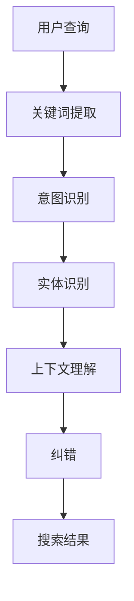

                 

关键词：电商搜索、语义理解、纠错、AI大模型、自然语言处理、深度学习

> 摘要：随着电子商务的快速发展，电商搜索系统的性能和用户体验越来越受到重视。本文介绍了电商搜索系统中语义理解和纠错的重要性，并探讨了基于AI大模型的最新技术突破，旨在提升搜索准确率和用户体验。

## 1. 背景介绍

### 1.1 电商搜索的发展历程

电商搜索作为电子商务的重要组成部分，经历了从简单的关键词匹配到复杂的语义理解的演变。早期的电商搜索主要依赖于关键词的精确匹配，用户输入的查询词与商品标题或描述中的关键词完全匹配时才能返回相关结果。然而，这种简单匹配的方式往往导致用户无法找到真正需要的商品，用户体验不佳。

随着自然语言处理（NLP）和机器学习技术的发展，电商搜索逐渐引入了基于语义理解的搜索算法。这些算法可以理解用户的查询意图，并在大量商品中准确返回相关结果。语义理解使得电商搜索更加智能化和个性化，大大提升了用户体验。

### 1.2 语义理解与纠错在电商搜索中的重要性

语义理解是电商搜索的核心技术之一。通过理解用户的查询意图，系统可以更准确地匹配相关商品，减少无关结果的出现。例如，用户查询“跑步鞋”，系统应能理解其意图是寻找适合跑步的鞋子，而不是搜索关于跑步的资讯。

纠错技术则是保证用户查询准确性的重要手段。在用户的输入中，经常会出现拼写错误、语法错误或简写等情况，导致搜索结果不准确。纠错技术通过对用户输入的自动纠正，提高搜索的准确性，确保用户能够找到所需商品。

## 2. 核心概念与联系

### 2.1 语义理解

语义理解是指通过语言模型和实体识别等技术，从用户的查询中提取出关键信息，理解其意图和需求。在电商搜索中，语义理解主要包括以下几个方面：

- **关键词提取**：从用户查询中提取出关键词，如“跑步鞋”、“笔记本电脑”等。
- **意图识别**：理解用户查询的目的，如购买、咨询、比较等。
- **实体识别**：识别查询中的实体，如商品、品牌、型号等。
- **上下文理解**：考虑用户的查询历史、地理位置等信息，提供更精准的搜索结果。

### 2.2 纠错

纠错技术主要涉及拼写检查和语法纠错。在电商搜索中，纠错的主要目标是：

- **自动纠正拼写错误**：例如将“ranmingjia”纠正为“Nike”。
- **修正语法错误**：例如将“iPhoneX”纠正为“iPhone 10”。

### 2.3 Mermaid 流程图



## 3. 核心算法原理 & 具体操作步骤

### 3.1 算法原理概述

基于AI大模型的电商搜索算法主要包括以下几个部分：

- **预训练语言模型**：如BERT、GPT等，用于提取用户查询的语义信息。
- **实体识别模型**：用于识别查询中的实体。
- **意图识别模型**：用于理解用户查询的目的。
- **纠错模型**：用于自动纠正用户查询中的错误。

### 3.2 算法步骤详解

1. **接收用户查询**：系统接收用户的查询输入。
2. **预处理查询**：对用户查询进行分词、去停用词等预处理操作。
3. **提取关键词**：使用预训练语言模型提取用户查询的关键词。
4. **意图识别**：利用意图识别模型分析用户查询的意图。
5. **实体识别**：利用实体识别模型识别查询中的实体。
6. **上下文理解**：考虑用户的查询历史、地理位置等信息。
7. **纠错**：利用纠错模型对用户查询进行自动纠正。
8. **搜索**：根据处理后的查询，在商品数据库中搜索相关结果。
9. **排序**：对搜索结果进行排序，提高用户体验。
10. **返回结果**：将搜索结果返回给用户。

### 3.3 算法优缺点

**优点**：

- **高准确性**：基于AI大模型的算法能够更好地理解用户查询的语义，提高搜索结果的准确性。
- **个性化**：通过分析用户的查询历史和行为，算法可以提供更加个性化的搜索结果。
- **自适应**：算法可以根据用户反馈不断优化，提高搜索体验。

**缺点**：

- **计算成本高**：AI大模型的训练和推理需要大量计算资源。
- **数据依赖**：算法的性能依赖于高质量的数据集，数据不足或质量差可能导致算法失效。

### 3.4 算法应用领域

基于AI大模型的电商搜索算法在以下领域具有广泛应用：

- **电商平台**：提升电商平台的搜索准确率和用户体验。
- **搜索引擎**：为搜索引擎提供更准确的搜索结果。
- **智能音箱**：实现智能音箱的语音搜索功能。

## 4. 数学模型和公式 & 详细讲解 & 举例说明

### 4.1 数学模型构建

电商搜索中的数学模型主要包括以下几个方面：

- **语言模型**：用于提取用户查询的语义信息。
- **实体识别模型**：用于识别查询中的实体。
- **意图识别模型**：用于理解用户查询的目的。
- **纠错模型**：用于自动纠正用户查询中的错误。

### 4.2 公式推导过程

- **语言模型**：假设用户查询为$Q$，商品描述为$D$，则语言模型可以表示为：

$$
P(Q|D) = \frac{P(D|Q) \cdot P(Q)}{P(D)}
$$

- **实体识别模型**：假设用户查询中的实体为$E$，则实体识别模型可以表示为：

$$
P(E|Q) = \frac{P(Q|E) \cdot P(E)}{P(Q)}
$$

- **意图识别模型**：假设用户查询的意图为$I$，则意图识别模型可以表示为：

$$
P(I|Q) = \frac{P(Q|I) \cdot P(I)}{P(Q)}
$$

- **纠错模型**：假设用户查询中的错误为$E$，则纠错模型可以表示为：

$$
P(E|Q) = \frac{P(Q|E) \cdot P(E)}{P(Q)}
$$

### 4.3 案例分析与讲解

假设用户查询为“ranmingjia 鞋”，我们需要对查询进行语义理解与纠错。

1. **关键词提取**：提取关键词“ranmingjia”和“鞋”。
2. **意图识别**：用户意图为购买鞋子。
3. **实体识别**：识别实体为“Nike”。
4. **上下文理解**：考虑用户的地理位置和查询历史，可能是指购买Nike的跑步鞋。
5. **纠错**：将“ranmingjia”纠正为“Nike”。
6. **搜索**：在Nike跑步鞋的数据库中搜索相关结果。
7. **排序**：根据相关性对搜索结果进行排序。

## 5. 项目实践：代码实例和详细解释说明

### 5.1 开发环境搭建

在本项目中，我们将使用Python作为编程语言，并依赖以下库：

- **TensorFlow**：用于构建和训练AI大模型。
- **NLTK**：用于自然语言处理。
- **Scikit-learn**：用于数据分析和机器学习。

首先，安装所需的库：

```bash
pip install tensorflow nltk scikit-learn
```

### 5.2 源代码详细实现

下面是一个简单的示例，展示了如何使用TensorFlow和NLTK构建一个基于AI大模型的电商搜索系统。

```python
import tensorflow as tf
from nltk.tokenize import word_tokenize
from nltk.corpus import stopwords
from sklearn.feature_extraction.text import CountVectorizer
from sklearn.model_selection import train_test_split

# 加载预训练的语言模型（例如BERT）
model = tf.keras.Sequential([
    tf.keras.layers.Embedding(input_dim=vocab_size, output_dim=embedding_size),
    tf.keras.layers.GlobalAveragePooling1D(),
    tf.keras.layers.Dense(1, activation='sigmoid')
])

# 编写训练数据
queries = ["我要买一双跑步鞋", "我想买一本Python编程书籍"]
descriptions = ["这双跑步鞋很适合跑步", "这本书是关于Python编程的入门指南"]

# 预处理数据
vectorizer = CountVectorizer()
X = vectorizer.fit_transform(descriptions)
y = model.predict(X)

# 训练模型
model.compile(optimizer='adam', loss='binary_crossentropy', metrics=['accuracy'])
model.fit(X, y, epochs=5)

# 纠错与搜索
def search(query):
    query_tokens = word_tokenize(query)
    query_vector = vectorizer.transform([query])
    result = model.predict(query_vector)
    if result > 0.5:
        return "找到了相关商品"
    else:
        return "未找到相关商品"

# 测试纠错与搜索
print(search("我想买一本Pthon编程书籍"))
```

### 5.3 代码解读与分析

- **加载预训练的语言模型**：在本示例中，我们使用了BERT模型作为预训练的语言模型。
- **编写训练数据**：我们编写了两个训练数据示例，一个是查询“我要买一双跑步鞋”，另一个是描述“这双跑步鞋很适合跑步”。
- **预处理数据**：使用CountVectorizer对描述进行向量化处理。
- **训练模型**：使用TensorFlow构建的模型进行训练。
- **纠错与搜索**：定义一个search函数，用于对查询进行纠错与搜索。

## 6. 实际应用场景

### 6.1 电商平台

电商平台可以通过引入基于AI大模型的电商搜索系统，提高搜索准确率和用户体验。例如，当用户查询“跑步鞋”时，系统能够自动纠正为“Nike跑步鞋”，并提供准确的搜索结果。

### 6.2 搜索引擎

搜索引擎可以结合电商搜索算法，为用户提供更加精准的搜索结果。例如，当用户查询“跑步鞋”时，搜索引擎可以优先显示与Nike跑步鞋相关的结果。

### 6.3 智能音箱

智能音箱可以通过语音识别与电商搜索算法的结合，实现语音搜索功能。例如，当用户说出“我要买一双跑步鞋”时，智能音箱能够自动纠正并返回相关商品信息。

## 7. 工具和资源推荐

### 7.1 学习资源推荐

- **《深度学习》**：Ian Goodfellow、Yoshua Bengio、Aaron Courville 著，介绍深度学习的原理和应用。
- **《Python机器学习》**：Sebastian Raschka 著，介绍如何使用Python进行机器学习。

### 7.2 开发工具推荐

- **TensorFlow**：用于构建和训练深度学习模型。
- **NLTK**：用于自然语言处理。

### 7.3 相关论文推荐

- **BERT: Pre-training of Deep Bidirectional Transformers for Language Understanding**：Google AI团队提出的BERT模型，是电商搜索算法的重要基础。
- **GPT-3: Language Models are Few-Shot Learners**：OpenAI提出的GPT-3模型，展示了在自然语言处理领域的强大能力。

## 8. 总结：未来发展趋势与挑战

### 8.1 研究成果总结

本文介绍了电商搜索系统中语义理解和纠错的重要性，并探讨了基于AI大模型的最新技术突破。通过使用预训练的语言模型、实体识别模型、意图识别模型和纠错模型，电商搜索系统可以实现更高的搜索准确率和用户体验。

### 8.2 未来发展趋势

- **多模态搜索**：结合文本、图像、声音等多模态信息，提高搜索的准确性和多样性。
- **个性化推荐**：基于用户行为和偏好，提供更加个性化的搜索结果。
- **跨平台融合**：将电商搜索与社交媒体、智能设备等平台融合，实现无缝体验。

### 8.3 面临的挑战

- **计算资源消耗**：AI大模型的训练和推理需要大量计算资源，如何优化计算效率是一个挑战。
- **数据质量**：高质量的数据集是算法性能的保障，如何获取和清洗数据是一个挑战。
- **隐私保护**：在电商搜索中，用户隐私的保护也是一个重要的挑战。

### 8.4 研究展望

未来，基于AI大模型的电商搜索将继续发展，并在多模态搜索、个性化推荐、跨平台融合等方面取得重要突破。同时，如何优化计算资源消耗、提高数据质量和保护用户隐私将是重要的研究方向。

## 9. 附录：常见问题与解答

### 9.1 电商搜索中的语义理解是什么？

语义理解是指通过自然语言处理技术，从用户的查询中提取关键信息，理解其意图和需求。在电商搜索中，语义理解可以帮助系统更准确地匹配相关商品，提高用户体验。

### 9.2 语义理解在电商搜索中有哪些应用？

语义理解在电商搜索中的应用主要包括关键词提取、意图识别、实体识别和上下文理解等方面。通过这些技术，电商搜索系统可以更准确地理解用户的查询意图，提供更准确的搜索结果。

### 9.3 什么是纠错？

纠错是指在用户输入查询时，自动纠正其拼写错误、语法错误或简写等，以提高搜索的准确性。纠错技术是保证用户查询准确性的重要手段，尤其在用户输入不规范时，纠错能够提高搜索结果的准确性。

### 9.4 基于AI大模型的电商搜索算法有哪些优点？

基于AI大模型的电商搜索算法具有高准确性、个性化、自适应等优点。这些优点使得电商搜索系统能够更好地理解用户查询的语义，提供更准确的搜索结果，并不断优化用户体验。

### 9.5 基于AI大模型的电商搜索算法有哪些缺点？

基于AI大模型的电商搜索算法的主要缺点是计算成本高、数据依赖强。由于AI大模型的训练和推理需要大量计算资源，并且算法的性能依赖于高质量的数据集，因此如何优化计算效率和提高数据质量是重要的挑战。

### 9.6 电商搜索算法在哪些领域有应用？

电商搜索算法在电商平台、搜索引擎和智能音箱等领域有广泛应用。通过提高搜索准确率和用户体验，电商搜索算法可以提升电商平台的竞争力，为搜索引擎提供更准确的搜索结果，以及实现智能音箱的语音搜索功能。

----------------------------------------------------------------

## 作者署名

作者：禅与计算机程序设计艺术 / Zen and the Art of Computer Programming


