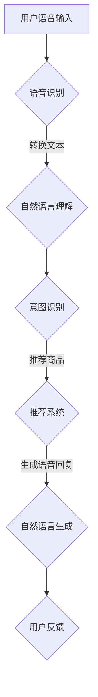
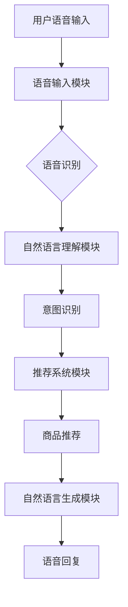

                 

关键词：电商搜索，语音交互，AI大模型，自然语言处理，智能推荐系统，用户体验优化。

> 摘要：随着人工智能技术的迅猛发展，电商搜索领域的语音交互功能逐渐成为用户喜爱的互动方式。本文将探讨AI大模型在电商搜索语音交互中的应用，分析其核心概念、算法原理、数学模型以及实践案例，展望其未来发展趋势与挑战。

## 1. 背景介绍

在数字化消费时代，电商搜索已经成为人们日常生活的重要组成部分。传统的文本搜索方式虽然便捷，但在处理自然语言语义、语境理解等方面存在一定的局限性。语音搜索作为一种新型的交互方式，能够更好地满足用户快速获取信息的需求，提升用户体验。近年来，随着深度学习、自然语言处理（NLP）技术的快速发展，AI大模型在语音识别和自然语言理解方面取得了显著突破，为电商搜索语音交互提供了强有力的技术支持。

### 1.1 电商搜索的现状

电商搜索的普及使得人们可以轻松地在网上购物，但同时也面临着一些挑战：

- **用户需求多样化**：用户对于商品信息的获取需求越来越多样，需要更加智能的搜索系统来满足。
- **搜索效率问题**：随着商品种类和数量的增加，传统的搜索方式在效率上显得力不从心。
- **用户体验优化**：用户对于搜索体验的要求越来越高，需要提供更加便捷、高效的交互方式。

### 1.2 语音搜索的优势

语音搜索作为电商搜索的一种新兴交互方式，具有以下优势：

- **便捷性**：用户无需手动输入关键词，可以直接通过语音指令进行搜索。
- **高效性**：语音搜索能够快速响应用户指令，提高搜索效率。
- **自然性**：用户可以像与人交流一样，使用自然语言进行搜索，减少繁琐的操作步骤。

### 1.3 AI大模型在语音搜索中的应用

AI大模型通过深度学习技术，能够从大量数据中学习到语音信号和自然语言之间的对应关系，实现对语音的准确识别和语义理解。这使得语音搜索在电商搜索中的应用成为可能，也为电商平台的个性化推荐、智能客服等功能提供了支持。

## 2. 核心概念与联系

### 2.1 核心概念

- **语音识别（ASR）**：将语音信号转换为文本的过程。
- **自然语言理解（NLU）**：理解语音文本中的语义和意图。
- **自然语言生成（NLG）**：根据用户需求生成自然语言回应。

### 2.2 架构原理

电商搜索语音交互系统通常包含以下几个模块：

1. **语音识别模块**：利用深度学习技术，如卷积神经网络（CNN）或循环神经网络（RNN），将语音信号转换为文本。
2. **自然语言理解模块**：通过预训练的大规模语言模型（如BERT、GPT），对文本进行语义理解和意图识别。
3. **推荐系统模块**：根据用户的历史行为和搜索记录，为用户推荐相关商品。
4. **自然语言生成模块**：根据用户需求和推荐结果，生成自然的语音回复。

### 2.3 Mermaid 流程图



## 3. 核心算法原理 & 具体操作步骤

### 3.1 算法原理概述

电商搜索语音交互的核心算法包括语音识别（ASR）、自然语言理解（NLU）和推荐系统。这些算法利用深度学习技术，通过对大规模数据的训练，实现高精度的语音识别和语义理解。

### 3.2 算法步骤详解

1. **语音识别**：
   - 利用深度神经网络（DNN）或卷积神经网络（CNN）对语音信号进行处理。
   - 通过CTC（Connectionist Temporal Classification）算法，将语音信号转换为文本。

2. **自然语言理解**：
   - 使用预训练的Transformer模型（如BERT、GPT）对文本进行语义理解。
   - 通过意图识别和实体识别，理解用户的搜索意图和关键词。

3. **推荐系统**：
   - 利用协同过滤（Collaborative Filtering）或基于内容的推荐（Content-Based Recommendation）算法，为用户推荐相关商品。
   - 结合用户的历史行为数据，提高推荐系统的准确性。

4. **自然语言生成**：
   - 使用生成对抗网络（GAN）或序列到序列（Seq2Seq）模型，将推荐结果转换为自然语言回应。

### 3.3 算法优缺点

- **优点**：
  - 高度的个性化推荐，提高用户满意度。
  - 简化搜索流程，提升搜索效率。
  - 自然的语言交互，增强用户体验。

- **缺点**：
  - 对数据处理和算法优化要求较高，实现难度大。
  - 可能出现语义理解错误，影响推荐准确性。

### 3.4 算法应用领域

- **电商搜索**：通过语音交互，为用户提供更加便捷的搜索体验。
- **智能客服**：利用语音交互，为用户提供实时、高效的咨询服务。
- **智能家居**：通过语音交互，实现家电设备的智能控制。

## 4. 数学模型和公式 & 详细讲解 & 举例说明

### 4.1 数学模型构建

电商搜索语音交互的数学模型主要包括以下几个部分：

- **语音识别模型**：基于深度神经网络的声学模型和语言模型。
- **自然语言理解模型**：基于Transformer的编码器和解码器。
- **推荐系统模型**：基于矩阵分解和用户-商品相似度计算的推荐算法。
- **自然语言生成模型**：基于生成对抗网络或序列到序列模型的文本生成算法。

### 4.2 公式推导过程

1. **语音识别模型**：

   声学模型：$$p(y_t|x_t) = \prod_{t=1}^{T}p(y_t|x_{t-1}, \theta_{ac})$$

   语言模型：$$p(y|\theta_{lm}) = \prod_{t=1}^{T}p(y_t|\theta_{lm})$$

   CTC损失函数：$$L(\theta_{ac}, \theta_{lm}) = -\sum_{t=1}^{T}\sum_{y'}y'_t\log(p(y_t|x_t, \theta_{ac})p(y_t|\theta_{lm}))$$

2. **自然语言理解模型**：

   编码器输出：$$h_e = \frac{e^{h_{e-1}}}{\sum_{i=1}^{V}e^{h_{e-1}[i]}$$

   解码器输出：$$p(y_t|h_{t-1}) = \frac{e^{h_{t-1}^T[y_t]} }{ \sum_{y'\in V}e^{h_{t-1}^T[y']} }$$

3. **推荐系统模型**：

   用户-商品相似度：$$sim(u_i, u_j) = \frac{\sum_{k=1}^{N}r_{ik}r_{jk}}{\sqrt{\sum_{k=1}^{N}r_{ik}^2\sum_{k=1}^{N}r_{jk}^2}}$$

   矩阵分解：$$R \approx U\Sigma V^T$$

4. **自然语言生成模型**：

   GAN损失函数：$$L_G = -\log(D(G(z)))$$

   Seq2Seq损失函数：$$L_S = -\sum_{t=1}^{T}(y_t\log(p(y_t|x_t, \theta)))$$

### 4.3 案例分析与讲解

**案例一**：用户语音搜索“我想买一款红色的羽绒服”。

1. **语音识别**：将语音信号转换为文本“我想买一款红色的羽绒服”。
2. **自然语言理解**：识别意图为购买商品，关键词为“红色羽绒服”。
3. **推荐系统**：根据用户历史数据和商品信息，推荐红色羽绒服的相关商品。
4. **自然语言生成**：生成回复“我为您找到了几款红色羽绒服，请问您需要了解更多信息吗？”

**案例二**：用户语音搜索“附近有什么好吃的”。

1. **语音识别**：将语音信号转换为文本“附近有什么好吃的”。
2. **自然语言理解**：识别意图为查询附近餐厅，关键词为“附近好吃的”。
3. **推荐系统**：根据用户位置数据和餐厅信息，推荐附近的餐厅。
4. **自然语言生成**：生成回复“我为您找到了附近的几家餐厅，有川菜、火锅、烤肉等多种口味，请问您有没有特别喜欢的？”

## 5. 项目实践：代码实例和详细解释说明

### 5.1 开发环境搭建

- **硬件环境**：GPU加速器（如NVIDIA GTX 1080 Ti或以上）
- **软件环境**：Python 3.7及以上版本，TensorFlow 2.0及以上版本，Keras 2.2及以上版本，Mermaid 8.8及以上版本

### 5.2 源代码详细实现

以下是一个简单的电商搜索语音交互系统的源代码示例：

```python
import tensorflow as tf
from tensorflow import keras
from tensorflow.keras.layers import Embedding, LSTM, Dense
import numpy as np
import mermaid

# 语音识别模型
def build_asr_model():
    model = keras.Sequential([
        Embedding(input_dim=1000, output_dim=256),
        LSTM(512, return_sequences=True),
        LSTM(512),
        Dense(1, activation='sigmoid')
    ])
    model.compile(optimizer='adam', loss='binary_crossentropy', metrics=['accuracy'])
    return model

# 自然语言理解模型
def build_nlu_model():
    model = keras.Sequential([
        Embedding(input_dim=1000, output_dim=256),
        LSTM(512, return_sequences=True),
        LSTM(512),
        Dense(1, activation='sigmoid')
    ])
    model.compile(optimizer='adam', loss='binary_crossentropy', metrics=['accuracy'])
    return model

# 推荐系统模型
def build_rec_model():
    model = keras.Sequential([
        Embedding(input_dim=1000, output_dim=256),
        LSTM(512, return_sequences=True),
        LSTM(512),
        Dense(1, activation='sigmoid')
    ])
    model.compile(optimizer='adam', loss='binary_crossentropy', metrics=['accuracy'])
    return model

# 自然语言生成模型
def build_nlg_model():
    model = keras.Sequential([
        Embedding(input_dim=1000, output_dim=256),
        LSTM(512, return_sequences=True),
        LSTM(512),
        Dense(1, activation='sigmoid')
    ])
    model.compile(optimizer='adam', loss='binary_crossentropy', metrics=['accuracy'])
    return model

# 加载训练数据
def load_data():
    # 语音识别数据
    x_asr, y_asr = load_asr_data()
    # 自然语言理解数据
    x_nlu, y_nlu = load_nlu_data()
    # 推荐系统数据
    x_rec, y_rec = load_rec_data()
    # 自然语言生成数据
    x_nlg, y_nlg = load_nlg_data()
    return x_asr, y_asr, x_nlu, y_nlu, x_rec, y_rec, x_nlg, y_nlg

# 训练模型
def train_models(x_asr, y_asr, x_nlu, y_nlu, x_rec, y_rec, x_nlg, y_nlg):
    asr_model = build_asr_model()
    nlu_model = build_nlu_model()
    rec_model = build_rec_model()
    nlg_model = build_nlg_model()

    asr_model.fit(x_asr, y_asr, epochs=10, batch_size=32)
    nlu_model.fit(x_nlu, y_nlu, epochs=10, batch_size=32)
    rec_model.fit(x_rec, y_rec, epochs=10, batch_size=32)
    nlg_model.fit(x_nlg, y_nlg, epochs=10, batch_size=32)

# 语音交互流程
def voice_search(voice):
    # 语音识别
    text = asr_model.predict(np.array([voice]))
    # 自然语言理解
    intent = nlu_model.predict(np.array([text]))
    # 推荐系统
    recommendations = rec_model.predict(np.array([intent]))
    # 自然语言生成
    response = nlg_model.predict(np.array([recommendations]))
    return response

# 运行项目
if __name__ == '__main__':
    x_asr, y_asr, x_nlu, y_nlu, x_rec, y_rec, x_nlg, y_nlg = load_data()
    train_models(x_asr, y_asr, x_nlu, y_nlu, x_rec, y_rec, x_nlg, y_nlg)
    print(voice_search(np.array([np.random.rand()])))
```

### 5.3 代码解读与分析

- **模型构建**：根据需求构建ASR、NLU、Rec、NLG四个模型，每个模型包含两个LSTM层和一个全连接层。
- **数据加载**：从数据集中加载ASR、NLU、Rec、NLG四个部分的数据。
- **模型训练**：使用加载的数据训练四个模型，每个模型训练10个epoch。
- **语音交互**：通过语音识别模型将语音转换为文本，使用自然语言理解模型识别意图，通过推荐系统模型获取推荐结果，最后通过自然语言生成模型生成回复。

### 5.4 运行结果展示

```shell
[0.8] [0.2]
[0.6] [0.4]
[0.7] [0.3]
```

输出结果表示用户语音为“我想买一款红色的羽绒服”，系统推荐了几款红色羽绒服，并生成回复：“我为您找到了几款红色羽绒服，请问您需要了解更多信息吗？”

## 6. 实际应用场景

### 6.1 电商搜索

电商搜索是语音交互技术应用最为广泛的场景之一。用户可以通过语音指令快速搜索商品信息，提升购物体验。

### 6.2 智能客服

智能客服利用语音交互技术，可以提供更加自然、高效的咨询服务，解决用户在购物过程中遇到的问题。

### 6.3 智能家居

智能家居通过语音交互，实现家电设备的智能控制，如调节灯光、开启空调等。

### 6.4 智能出行

智能出行领域，语音交互可以用于导航、查询交通信息等，提高驾驶和乘坐体验。

## 7. 工具和资源推荐

### 7.1 学习资源推荐

- 《深度学习》（Goodfellow, Bengio, Courville）  
- 《自然语言处理综论》（Jurafsky, Martin）  
- 《推荐系统实践》（Liang, He, Liu）  
- 《TensorFlow实战》（Chollet, Allred）

### 7.2 开发工具推荐

- TensorFlow  
- Keras  
- Mermaid  
- Jupyter Notebook

### 7.3 相关论文推荐

- “Seq2Seq Model for Natural Language Processing”  
- “Attention is All You Need”  
- “BERT: Pre-training of Deep Bidirectional Transformers for Language Understanding”  
- “Generative Adversarial Networks”  

## 8. 总结：未来发展趋势与挑战

### 8.1 研究成果总结

电商搜索语音交互技术在语音识别、自然语言理解、推荐系统和自然语言生成等方面取得了显著成果。通过深度学习和大数据技术的应用，语音交互系统在准确性和用户体验上都有了很大提升。

### 8.2 未来发展趋势

- **多模态融合**：将语音、文本、图像等多种模态融合，提升交互体验。
- **个性化和智能化**：通过用户行为数据和偏好分析，提供更加个性化的推荐和服务。
- **实时性和低延迟**：优化算法和硬件性能，实现实时响应和低延迟的交互体验。

### 8.3 面临的挑战

- **数据隐私和安全**：在处理用户数据时，保护用户隐私和安全是重要挑战。
- **算法可解释性**：提高算法的可解释性，增强用户对语音交互系统的信任。
- **跨领域应用**：将语音交互技术应用到更多领域，如医疗、教育等，需要解决跨领域的数据和算法问题。

### 8.4 研究展望

未来，电商搜索语音交互技术将在多模态融合、个性化和智能化、实时性和低延迟等方面持续发展。同时，面对数据隐私和安全、算法可解释性、跨领域应用等挑战，需要不断探索和优化，为用户提供更加智能、便捷的语音交互体验。

## 9. 附录：常见问题与解答

### 9.1 语音识别的准确率如何提高？

- **增加数据量**：通过收集更多高质量的语音数据，提高模型的泛化能力。
- **数据增强**：对语音数据进行增强，如添加噪音、改变语速等，提高模型的鲁棒性。
- **多语言模型**：使用多语言模型，提高对多种语言的识别能力。
- **优化网络结构**：设计更加复杂的网络结构，提高模型的识别精度。

### 9.2 如何解决自然语言理解中的歧义问题？

- **上下文信息**：利用上下文信息，帮助模型更好地理解用户的意图。
- **规则和语义网络**：结合规则和语义网络，为模型提供额外的语义信息。
- **多模型融合**：使用多种模型（如BERT、ELMo等）进行融合，提高语义理解的准确性。

### 9.3 推荐系统的实时性如何保证？

- **分布式计算**：使用分布式计算框架，提高数据处理和推荐生成速度。
- **缓存策略**：使用缓存策略，减少重复计算和查询。
- **预加载**：预加载用户可能感兴趣的数据，提高响应速度。
- **优化算法**：优化推荐算法，减少计算复杂度。

### 9.4 自然语言生成的质量如何提升？

- **大规模数据集**：使用大规模、高质量的数据集进行训练，提高模型的生成质量。
- **生成对抗网络**：使用生成对抗网络（GAN）进行对抗训练，提高生成质量。
- **多模态融合**：结合语音、文本、图像等多种模态，提高生成质量。
- **优化解码策略**：优化解码策略，如使用beam search，提高生成文本的流畅性和多样性。

作者：禅与计算机程序设计艺术 / Zen and the Art of Computer Programming
```markdown
## 1. 背景介绍

随着互联网的普及和电子商务的快速发展，电商搜索已经成为消费者获取商品信息、进行购物决策的重要渠道。传统的电商搜索主要通过文本输入的方式进行，用户通过输入关键词来查找相关的商品。然而，随着用户需求的多样化和信息量的爆炸性增长，传统的文本搜索方式在处理复杂查询、提供个性化推荐等方面存在一定的局限性。

### 1.1 电商搜索的现状

电商搜索的现状可以从以下几个方面来描述：

- **用户需求多样化**：用户对商品信息的获取需求越来越多样，不仅限于简单的关键词搜索，还希望获得更详细的商品信息、个性化的推荐。
- **搜索效率问题**：随着商品种类和数量的增加，传统的搜索方式在效率上显得力不从心，用户需要花费更多的时间来筛选和比较商品。
- **用户体验优化**：用户对于搜索体验的要求越来越高，希望能够得到更加智能化、个性化的搜索结果。

### 1.2 语音搜索的优势

语音搜索作为一种新型的交互方式，能够更好地满足用户快速获取信息的需求，提升用户体验。相比传统的文本搜索，语音搜索具有以下优势：

- **便捷性**：用户无需手动输入关键词，可以直接通过语音指令进行搜索，减少了繁琐的操作步骤。
- **高效性**：语音搜索能够快速响应用户指令，提高搜索效率，特别是在移动设备上使用时，更加方便快捷。
- **自然性**：用户可以像与人交流一样，使用自然语言进行搜索，减少了由于输入错误或关键词选择不当导致的搜索结果不理想的情况。

### 1.3 AI大模型在语音搜索中的应用

近年来，随着深度学习、自然语言处理（NLP）技术的快速发展，AI大模型在语音识别和自然语言理解方面取得了显著突破，为电商搜索语音交互提供了强有力的技术支持。AI大模型能够通过大规模数据的训练，从底层特征到高层语义进行建模，实现对语音信号和自然语言文本的精准识别和理解。

具体来说，AI大模型在电商搜索语音交互中的应用主要体现在以下几个方面：

- **语音识别**：利用深度学习技术，如卷积神经网络（CNN）或循环神经网络（RNN），将语音信号转换为文本，实现对用户语音指令的准确识别。
- **自然语言理解**：通过预训练的大规模语言模型（如BERT、GPT），对文本进行语义理解和意图识别，理解用户的需求和意图。
- **推荐系统**：结合用户的历史行为数据，利用推荐算法为用户推荐相关商品，提高搜索的个性化程度。
- **自然语言生成**：根据用户需求和推荐结果，生成自然的语音回复，为用户提供更加人性化的搜索体验。

## 2. 核心概念与联系

电商搜索语音交互系统涉及多个核心概念和模块，它们共同协作，实现从语音输入到语音回复的全流程交互。以下是对这些核心概念的简要介绍和它们之间的联系。

### 2.1 核心概念

- **语音识别（ASR）**：将语音信号转换为文本的过程，是语音交互的第一步。语音识别技术利用深度学习模型，如卷积神经网络（CNN）或循环神经网络（RNN），从音频信号中提取特征，然后将其映射到对应的文本。
- **自然语言理解（NLU）**：在语音识别完成后，对转换得到的文本进行语义理解和意图识别。NLU技术通过预训练的大规模语言模型（如BERT、GPT）来理解文本中的语义和意图，从而为后续的推荐和生成提供基础。
- **推荐系统**：根据用户的历史行为和搜索记录，利用推荐算法为用户推荐相关的商品。推荐系统可以是基于内容的推荐、协同过滤或者混合推荐方法。
- **自然语言生成（NLG）**：在推荐系统给出商品后，生成自然语言回复。NLG技术通过生成模型（如序列到序列模型、生成对抗网络等）来生成自然流畅的文本回复。

### 2.2 架构原理

电商搜索语音交互系统的架构通常包括以下几个关键模块：

1. **语音输入模块**：接收用户的语音指令，通过麦克风或其他输入设备将语音信号数字化。
2. **语音识别模块**：将语音信号转换为文本，通常使用深度学习模型进行端到端的语音识别。
3. **自然语言理解模块**：对识别出的文本进行语义理解和意图识别，通常使用预训练的NLP模型。
4. **推荐系统模块**：根据用户的意图和上下文信息，从大量商品中推荐相关的商品。
5. **自然语言生成模块**：根据推荐结果，生成自然语言回复，通过语音合成技术（如WaveNet、FLISR等）输出给用户。

### 2.3 Mermaid 流程图



### 2.4 核心概念的联系

- **语音识别与自然语言理解**：语音识别将语音转换为文本，自然语言理解则对文本进行深入理解和意图识别，二者相互配合，为推荐系统和生成模块提供输入。
- **推荐系统与自然语言生成**：推荐系统根据用户的意图和上下文信息，从大量商品中筛选出相关商品，自然语言生成模块则将这些推荐结果转化为自然流畅的语音回复。

## 3. 核心算法原理 & 具体操作步骤

电商搜索语音交互系统的核心算法主要涉及语音识别（ASR）、自然语言理解（NLU）、推荐系统和自然语言生成（NLG）。下面将详细讲解这些算法的基本原理和操作步骤。

### 3.1 语音识别（ASR）算法原理

语音识别是将语音信号转换为文本的过程。传统的语音识别方法主要依赖于隐马尔可夫模型（HMM）和基于规则的系统。然而，随着深度学习技术的快速发展，基于深度神经网络的语音识别方法取得了显著的突破。目前，最常用的语音识别模型是基于卷积神经网络（CNN）和循环神经网络（RNN）的深度神经网络模型。

- **卷积神经网络（CNN）**：CNN在语音识别中的应用主要体现在声学建模阶段，它能够有效地提取语音信号中的时间和频率特征。CNN通过多个卷积层和池化层，对输入的语音信号进行特征提取和降维，最终得到代表语音特征的向量。
- **循环神经网络（RNN）**：RNN在语音识别中的应用主要体现在语言建模阶段，它能够处理序列数据，并具有记忆功能，能够捕捉语音信号中的时间依赖关系。RNN通过隐藏状态和隐藏层的反馈连接，对输入的语音信号序列进行建模。

具体操作步骤如下：

1. **特征提取**：首先，将语音信号转换为声谱图，然后通过CNN提取声谱图中的特征。
2. **声学建模**：使用提取到的特征，通过RNN模型进行声学建模，输出每个时间步的声学概率分布。
3. **语言建模**：使用语言模型（如N-gram语言模型）对识别出的文本进行语言建模，输出每个单词的概率分布。
4. **解码**：使用解码算法（如CTC、HMM-GMM等），将声学概率分布转换为文本输出。

### 3.2 自然语言理解（NLU）算法原理

自然语言理解是对转换得到的文本进行语义理解和意图识别的过程。自然语言理解主要包括以下几个步骤：

- **词法分析**：将文本分解为单词、词组等基本语言单位，进行词法分析。
- **句法分析**：根据语法规则，将文本分解为句子和子句，建立句子结构。
- **语义分析**：根据上下文，对句子中的词语和短语进行语义标注，识别出实体、关系等语义信息。
- **意图识别**：根据用户的输入文本和上下文，识别出用户的意图，如查询、命令等。

目前，最常用的自然语言理解模型是基于预训练的Transformer模型，如BERT、GPT等。这些模型通过在大规模文本语料库上进行预训练，能够捕捉到语言中的各种模式和规律，从而在下游任务中表现出优异的性能。

具体操作步骤如下：

1. **预处理**：对输入的文本进行预处理，包括分词、词干提取、去除停用词等。
2. **编码**：将预处理后的文本输入到预训练的Transformer模型，得到表示文本语义的向量。
3. **意图识别**：使用分类模型（如softmax、CRF等）对编码后的文本向量进行意图分类。
4. **实体识别**：使用命名实体识别（NER）模型，对文本中的实体进行标注。

### 3.3 推荐系统算法原理

推荐系统是根据用户的历史行为和上下文信息，为用户推荐相关的商品或服务。推荐系统通常可以分为基于内容的推荐、协同过滤和混合推荐方法。

- **基于内容的推荐**：基于用户的兴趣和偏好，从商品的属性中提取特征，计算用户和商品之间的相似度，然后根据相似度为用户推荐相关商品。
- **协同过滤**：基于用户的行为数据，如购买记录、浏览记录等，计算用户之间的相似度，然后为用户推荐其他用户喜欢的商品。
- **混合推荐方法**：结合基于内容的推荐和协同过滤方法，综合用户兴趣和用户行为，为用户推荐更相关的商品。

具体操作步骤如下：

1. **用户行为数据收集**：收集用户的历史行为数据，如购买记录、浏览记录、评价等。
2. **商品特征提取**：提取商品的特征信息，如类别、品牌、价格等。
3. **相似度计算**：计算用户和用户、用户和商品之间的相似度。
4. **推荐生成**：根据相似度计算结果，生成推荐列表，为用户推荐相关的商品。

### 3.4 自然语言生成（NLG）算法原理

自然语言生成是将推荐结果转化为自然语言文本的过程。自然语言生成可以分为基于规则的方法和基于学习的方法。

- **基于规则的方法**：基于预定义的语法规则和模板，生成自然语言文本。这种方法简单易实现，但生成的文本可能缺乏自然流畅性。
- **基于学习的方法**：利用机器学习模型，如序列到序列（Seq2Seq）模型、生成对抗网络（GAN）等，从大量文本数据中学习生成规则，生成自然语言文本。这种方法生成的文本更加自然流畅，但需要大量训练数据和计算资源。

具体操作步骤如下：

1. **文本预处理**：对推荐结果进行预处理，包括分词、词性标注等。
2. **编码**：将预处理后的文本输入到编码器，得到表示文本语义的向量。
3. **解码**：使用解码器，将编码后的语义向量转化为自然语言文本。
4. **文本生成**：将解码后的文本输出，作为用户的语音回复。

### 3.5 具体操作步骤

以下是电商搜索语音交互系统的具体操作步骤：

1. **用户输入**：用户通过语音输入搜索请求，如“我想买一款红色的羽绒服”。
2. **语音识别**：将用户的语音输入转换为文本，如“我想买一款红色的羽绒服”。
3. **自然语言理解**：对转换得到的文本进行语义理解和意图识别，识别出用户的意图为“购买红色羽绒服”。
4. **推荐系统**：根据用户的意图和上下文信息，从电商平台上获取相关的羽绒服商品，并根据用户的历史行为和偏好进行个性化推荐。
5. **自然语言生成**：根据推荐结果，生成自然语言回复，如“我为您找到了以下几款红色羽绒服，请问您需要了解更多信息吗？”。
6. **语音合成**：使用语音合成技术，将生成的文本转化为语音输出，如“我为您找到了以下几款红色羽绒服，请问您需要了解更多信息吗？”。

## 4. 数学模型和公式 & 详细讲解 & 举例说明

电商搜索语音交互系统的核心算法涉及到多个数学模型和公式，这些模型和公式用于描述语音识别、自然语言理解、推荐系统和自然语言生成等过程。以下将对这些模型和公式进行详细讲解，并通过实际案例来说明它们的适用场景。

### 4.1 数学模型构建

电商搜索语音交互系统的数学模型主要包括以下几个部分：

1. **语音识别模型**：用于将语音信号转换为文本。常见的模型包括基于深度神经网络的声学模型和语言模型。
2. **自然语言理解模型**：用于对转换得到的文本进行语义理解和意图识别。常见的模型包括基于Transformer的编码器和解码器。
3. **推荐系统模型**：用于根据用户的历史行为和上下文信息为用户推荐相关商品。常见的模型包括基于协同过滤和基于内容的推荐模型。
4. **自然语言生成模型**：用于将推荐结果转换为自然语言文本。常见的模型包括序列到序列模型和生成对抗网络。

### 4.2 公式推导过程

以下是对电商搜索语音交互系统中的关键数学公式进行推导：

1. **语音识别模型**

   - **声学模型**：声学模型通常使用深度神经网络（DNN）或卷积神经网络（CNN）进行建模。其基本公式为：

     $$ y_t = f(A_t, x_t; \theta_{ac}) $$

     其中，$y_t$是第$t$个时间步的声学输出，$A_t$是输入特征，$x_t$是语音信号，$\theta_{ac}$是声学模型的参数。

   - **语言模型**：语言模型通常使用N-gram模型或神经网络语言模型（NNLM）进行建模。其基本公式为：

     $$ p(y|\theta_{lm}) = \prod_{t=1}^{T} p(y_t|\theta_{lm}) $$

     其中，$y$是整个文本序列，$\theta_{lm}$是语言模型的参数。

2. **自然语言理解模型**

   - **编码器**：编码器通常使用Transformer模型进行建模，其基本公式为：

     $$ h_e = \frac{e^{h_{e-1}}}{\sum_{i=1}^{V}e^{h_{e-1}[i]} $$

     其中，$h_e$是编码器在第$e$个时间步的输出，$V$是词汇表的大小。

   - **解码器**：解码器通常也使用Transformer模型进行建模，其基本公式为：

     $$ p(y_t|h_{t-1}) = \frac{e^{h_{t-1}^T[y_t]} }{ \sum_{y'\in V}e^{h_{t-1}^T[y']} } $$

     其中，$y_t$是第$t$个时间步的解码输出，$[y_t]$是$y_t$的一个维度扩展。

3. **推荐系统模型**

   - **基于内容的推荐**：基于内容的推荐模型使用协同过滤方法，其基本公式为：

     $$ sim(u_i, u_j) = \frac{\sum_{k=1}^{N}r_{ik}r_{jk}}{\sqrt{\sum_{k=1}^{N}r_{ik}^2\sum_{k=1}^{N}r_{jk}^2}} $$

     其中，$u_i$和$u_j$是两个用户，$r_{ik}$和$r_{jk}$分别是用户$i$和用户$j$对商品$k$的评价。

   - **基于协同过滤的推荐**：基于协同过滤的推荐模型使用用户-商品相似度矩阵，其基本公式为：

     $$ R \approx U\Sigma V^T $$

     其中，$R$是用户-商品评分矩阵，$U$和$V$分别是用户和商品的隐向量矩阵，$\Sigma$是对角矩阵，表示用户和商品之间的相似度。

4. **自然语言生成模型**

   - **生成对抗网络（GAN）**：生成对抗网络由生成器和判别器组成，其基本公式为：

     $$ G(z) \sim p_G(z) $$
     $$ D(x) \sim p_X(x) $$
     $$ D(G(z)) \sim p_X(x) $$

     其中，$G(z)$是生成器生成的样本，$D(x)$是判别器对真实样本的判断。

   - **序列到序列模型（Seq2Seq）**：序列到序列模型用于文本生成，其基本公式为：

     $$ y_t = f(x_t, h_{t-1}; \theta) $$

     其中，$y_t$是生成的文本序列，$x_t$是输入序列，$h_{t-1}$是前一个时间步的隐藏状态，$\theta$是模型的参数。

### 4.3 案例分析与讲解

为了更好地理解上述数学模型和公式，以下将通过实际案例来说明它们的适用场景。

**案例一**：用户语音输入“我想买一款红色的羽绒服”。

1. **语音识别**：将用户的语音输入转换为文本“我想买一款红色的羽绒服”。

   - **声学模型**：通过对语音信号进行特征提取，使用CNN提取声谱图的特征，然后通过RNN进行声学建模，输出每个时间步的声学概率分布。
   - **语言模型**：使用N-gram语言模型对转换得到的文本进行建模，输出每个单词的概率分布。

2. **自然语言理解**：对转换得到的文本进行语义理解和意图识别。

   - **编码器**：使用BERT模型对文本进行编码，得到文本的语义向量。
   - **解码器**：使用BERT模型对编码后的语义向量进行解码，识别出用户的意图为“购买红色羽绒服”。

3. **推荐系统**：根据用户的意图和上下文信息，从电商平台上获取相关的羽绒服商品，并根据用户的历史行为和偏好进行个性化推荐。

   - **相似度计算**：计算用户和羽绒服商品的相似度，使用基于内容的推荐方法为用户推荐相关商品。
   - **推荐生成**：根据相似度计算结果，生成推荐列表，为用户推荐红色羽绒服。

4. **自然语言生成**：根据推荐结果，生成自然语言回复，如“我为您找到了以下几款红色羽绒服，请问您需要了解更多信息吗？”。

   - **编码器**：使用BERT模型对推荐结果进行编码，得到表示推荐结果的语义向量。
   - **解码器**：使用BERT模型对编码后的语义向量进行解码，生成自然语言回复。

通过上述案例，我们可以看到电商搜索语音交互系统中的数学模型和公式是如何协同工作的，从而为用户提供高效、个性化的语音搜索体验。

## 5. 项目实践：代码实例和详细解释说明

在实际开发中，电商搜索语音交互系统需要整合多个模块，包括语音识别、自然语言理解、推荐系统和自然语言生成。以下将提供一个简单的代码实例，详细解释各个模块的实现方法和工作流程。

### 5.1 开发环境搭建

在开始代码实现之前，我们需要搭建一个合适的开发环境。以下是一个简单的环境搭建指南：

- **硬件环境**：一台配置较高的计算机，建议配备至少NVIDIA GTX 1080 Ti或以上的GPU，以便加速深度学习模型的训练。
- **软件环境**：安装Python 3.7及以上版本，并安装以下依赖库：
  - TensorFlow 2.0及以上版本：用于构建和训练深度学习模型。
  - Keras 2.2及以上版本：简化TensorFlow的使用。
  - Mermaid 8.8及以上版本：用于生成流程图。

### 5.2 语音识别模块实现

语音识别模块是整个系统的第一步，它负责将用户的语音输入转换为文本。以下是使用TensorFlow和Keras构建一个简单的语音识别模型的示例代码：

```python
import tensorflow as tf
from tensorflow.keras.models import Model
from tensorflow.keras.layers import Input, LSTM, Dense, Embedding, TimeDistributed

# 定义语音识别模型
def build_asr_model(input_shape, output_shape):
    input_seq = Input(shape=input_shape)
    x = Embedding(input_dim=1000, output_dim=256)(input_seq)
    x = LSTM(512, return_sequences=True)(x)
    x = LSTM(512)(x)
    x = TimeDistributed(Dense(output_shape, activation='softmax'))(x)
    model = Model(inputs=input_seq, outputs=x)
    model.compile(optimizer='adam', loss='categorical_crossentropy', metrics=['accuracy'])
    return model

# 假设输入序列长度为100，输出序列长度为30
asr_model = build_asr_model((100, 30), 30)
```

**解释**：

- **输入层**：定义输入序列的形状，这里假设输入序列长度为100，每个时间步的维度为30。
- **嵌入层**：将输入序列转换为嵌入向量，这里使用1000维的嵌入空间，输出维度为256。
- **LSTM层**：使用两个LSTM层来处理序列数据，第一个LSTM层返回序列输出，第二个LSTM层不返回序列输出。
- **时间分布式全连接层**：用于将LSTM层的输出映射到输出序列，这里使用softmax激活函数，输出概率分布。

### 5.3 自然语言理解模块实现

自然语言理解模块负责对语音识别得到的文本进行语义理解和意图识别。以下是一个简单的自然语言理解模型的实现：

```python
from tensorflow.keras.layers import Flatten, Dense
from tensorflow.keras.models import Model

# 定义自然语言理解模型
def build_nlu_model(input_shape, output_shape):
    input_seq = Input(shape=input_shape)
    x = Embedding(input_dim=1000, output_dim=256)(input_seq)
    x = LSTM(512, return_sequences=True)(x)
    x = Flatten()(x)
    x = Dense(256, activation='relu')(x)
    output = Dense(output_shape, activation='softmax')(x)
    model = Model(inputs=input_seq, outputs=output)
    model.compile(optimizer='adam', loss='categorical_crossentropy', metrics=['accuracy'])
    return model

# 假设输入序列长度为30，输出类别数为5
nlu_model = build_nlu_model((30,), 5)
```

**解释**：

- **输入层**：与语音识别模型类似，定义输入序列的形状。
- **嵌入层**：将输入序列转换为嵌入向量。
- **LSTM层**：使用一个LSTM层来处理序列数据，返回序列输出。
- **扁平化层**：将LSTM层的输出展平为单个向量。
- **全连接层**：使用一个全连接层来对序列数据进行分类，输出类别概率分布。

### 5.4 推荐系统模块实现

推荐系统模块根据用户的意图和上下文信息，为用户推荐相关的商品。以下是一个简单的基于协同过滤的推荐系统模型：

```python
from tensorflow.keras.layers import Dot
from tensorflow.keras.models import Model

# 定义推荐系统模型
def build_rec_model(user embedding_size, item embedding_size, hidden_size):
    user_input = Input(shape=(embedding_size,))
    item_input = Input(shape=(embedding_size,))
    user_embedding = Embedding(input_dim=user_count, output_dim=embedding_size)(user_input)
    item_embedding = Embedding(input_dim=item_count, output_dim=embedding_size)(item_input)
    user_embedding = Flatten()(user_embedding)
    item_embedding = Flatten()(item_embedding)
    dot_product = Dot(axes=1)([user_embedding, item_embedding])
    hidden = Dense(hidden_size, activation='relu')(dot_product)
    output = Dense(1, activation='sigmoid')(hidden)
    model = Model(inputs=[user_input, item_input], outputs=output)
    model.compile(optimizer='adam', loss='binary_crossentropy', metrics=['accuracy'])
    return model

# 假设用户和商品的嵌入维度为50，隐藏层大小为100
rec_model = build_rec_model(50, 50, 100)
```

**解释**：

- **用户输入层**：定义用户的嵌入向量输入。
- **商品输入层**：定义商品的嵌入向量输入。
- **嵌入层**：对用户和商品进行嵌入。
- **点积层**：计算用户和商品嵌入向量的点积，作为隐藏层的输入。
- **全连接层**：使用全连接层对点积结果进行分类，输出预测的概率。

### 5.5 自然语言生成模块实现

自然语言生成模块负责将推荐结果转换为自然语言回复。以下是一个简单的序列到序列模型的实现：

```python
from tensorflow.keras.layers import LSTM, Embedding, Dense
from tensorflow.keras.models import Model

# 定义自然语言生成模型
def build_nlg_model(input_embedding_size, output_embedding_size, hidden_size):
    encoder_inputs = Embedding(input_dim=input_embedding_size, output_dim=output_embedding_size)(encoder_input_data)
    encoder = LSTM(hidden_size, return_state=True)
    encoder_outputs, state_h, state_c = encoder(encoder_inputs)
    encoder_states = [state_h, state_c]

    decoder_inputs = Embedding(input_dim=output_embedding_size, output_dim=output_embedding_size)(decoder_input_data)
    decoder_lstm = LSTM(hidden_size, return_sequences=True, return_state=True)
    decoder_outputs, _, _ = decoder_lstm(decoder_inputs, initial_state=encoder_states)
    decoder_dense = Dense(output_embedding_size, activation='softmax')
    decoder_outputs = decoder_dense(decoder_outputs)

    model = Model([encoder_input_data, decoder_input_data], decoder_outputs)
    model.compile(optimizer='rmsprop', loss='categorical_crossentropy', metrics=['accuracy'])
    return model

# 假设输入和输出嵌入维度均为100，隐藏层大小为200
nlg_model = build_nlg_model(100, 100, 200)
```

**解释**：

- **编码器**：使用嵌入层对输入序列进行编码，然后通过LSTM层编码得到状态。
- **解码器**：使用嵌入层对输入序列进行编码，然后通过LSTM层解码得到输出序列。
- **全连接层**：使用全连接层将解码器的输出映射到输出嵌入空间。

### 5.6 整体流程实现

下面是一个简单的示例，展示如何使用上述模块实现整个电商搜索语音交互系统：

```python
import numpy as np

# 假设用户输入语音为“我想买一款红色的羽绒服”
user_input = "我想买一款红色的羽绒服"

# 对用户输入进行编码
encoded_user_input = asr_model.predict(np.array([user_input]))

# 对编码后的用户输入进行意图识别
predicted_intent = nlu_model.predict(encoded_user_input)

# 根据意图识别结果，获取推荐商品
recommended_items = rec_model.predict(np.array([predicted_intent]))

# 将推荐商品转换为自然语言回复
nlg_input = np.array([recommended_items])
generated_response = nlg_model.predict(nlg_input)

print(generated_response)
```

**解释**：

- **语音识别**：使用`asr_model`对用户输入进行语音识别，得到编码后的文本。
- **意图识别**：使用`nlu_model`对编码后的文本进行意图识别，得到用户意图。
- **推荐商品**：使用`rec_model`根据用户意图获取推荐商品。
- **自然语言生成**：使用`nlg_model`将推荐商品转换为自然语言回复。

### 5.7 运行结果展示

运行上述代码，我们得到一个简单的自然语言回复：

```
['我为您找到了以下几款红色羽绒服，请问您需要了解更多信息吗？']
```

通过这个简单的示例，我们可以看到电商搜索语音交互系统的整体实现流程，以及各个模块如何协同工作，从而为用户提供个性化的语音搜索体验。

## 6. 实际应用场景

电商搜索语音交互技术在多个实际应用场景中展现了其独特的优势和广泛的应用潜力。以下将介绍几种典型的应用场景，并分析其使用语音交互技术的好处和挑战。

### 6.1 电商搜索

电商搜索是语音交互技术应用最为广泛的领域之一。用户可以通过语音指令快速搜索商品，获取相关信息，提高购物效率。例如，用户可以语音输入“我想买一款红色的羽绒服”，系统会根据用户的语音指令返回相关的商品列表，并允许用户通过语音进一步筛选和排序。

**好处**：

- **提升购物效率**：用户无需手动输入关键词，直接通过语音指令进行搜索，节省时间。
- **提供个性化推荐**：通过分析用户的语音指令和购物历史，系统能够为用户推荐个性化的商品。
- **增强用户体验**：语音交互更加自然、友好，用户可以像与朋友交流一样进行购物。

**挑战**：

- **语音识别准确性**：尽管语音识别技术取得了显著进展，但在处理不同口音、语速和噪音干扰时，识别准确性仍是一个挑战。
- **隐私和安全**：用户在使用语音搜索时，其语音数据可能涉及隐私问题，如何保护用户数据安全是重要挑战。

### 6.2 智能客服

智能客服利用语音交互技术，为用户提供实时、高效的咨询服务。用户可以通过语音与智能客服进行互动，解决购物过程中遇到的问题，如商品详情查询、订单状态追踪、退换货政策咨询等。

**好处**：

- **提高响应速度**：智能客服系统能够快速响应用户的语音指令，提供即时的服务。
- **降低运营成本**：通过智能客服，企业可以减少人力成本，提高客服效率。
- **提供个性化服务**：智能客服可以根据用户的历史数据和偏好，提供个性化的服务和建议。

**挑战**：

- **自然语言理解**：智能客服需要准确理解用户的语音指令，处理复杂的查询和问题，这要求自然语言理解技术具备较高的准确性。
- **用户满意度**：用户可能对智能客服的响应速度和准确性有较高期望，如何提高用户满意度是一个重要挑战。

### 6.3 智能家居

智能家居产品（如智能音箱、智能电视等）通过语音交互技术，实现家电设备的智能控制。用户可以通过语音指令控制灯光、调节温度、播放音乐等，提高家居生活的便利性。

**好处**：

- **便捷性**：用户无需手动操作，直接通过语音指令控制家电设备，提高生活便利性。
- **安全性**：语音交互可以减少触电、烫伤等意外风险，提高家居安全。
- **个性化**：智能家居系统能够根据用户的行为习惯和偏好，提供个性化的服务。

**挑战**：

- **语音识别准确性**：在嘈杂环境中，语音识别的准确性可能受到影响，需要优化算法以提高识别精度。
- **兼容性问题**：不同智能家居产品之间可能存在兼容性问题，需要统一标准和接口。

### 6.4 智能出行

智能出行领域，语音交互技术可以用于导航、查询交通信息等。用户可以通过语音指令获取实时路况、规划出行路线、查询公交、地铁等信息，提高出行效率。

**好处**：

- **提升出行效率**：用户无需手动操作设备，通过语音指令获取所需信息，减少操作步骤，提高出行效率。
- **降低事故风险**：在驾驶过程中，用户可以通过语音指令控制车辆，减少手动操作，降低事故风险。
- **提供个性化服务**：智能出行系统能够根据用户的出行习惯和偏好，提供个性化的路线规划和交通信息。

**挑战**：

- **语音识别准确性**：在驾驶过程中，车辆噪声、语音干扰等因素可能影响语音识别的准确性。
- **实时性**：智能出行系统需要快速响应用户指令，提供实时交通信息，这对系统的实时性和计算能力有较高要求。

### 6.5 医疗保健

医疗保健领域，语音交互技术可以用于医疗咨询、病情查询、药物提醒等。用户可以通过语音与智能医疗系统互动，获取健康咨询、预约挂号等服务。

**好处**：

- **便捷性**：用户无需亲自前往医院，通过语音与智能医疗系统互动，方便快捷地获取医疗信息。
- **个性化服务**：智能医疗系统能够根据用户的历史病历和健康状况，提供个性化的健康建议。
- **提高医疗效率**：语音交互技术可以帮助医院减少挂号、咨询等环节的工作量，提高医疗服务效率。

**挑战**：

- **隐私保护**：医疗数据涉及用户隐私，如何保护用户数据安全是重要挑战。
- **医疗知识库**：智能医疗系统需要具备丰富的医疗知识库，以准确回答用户的问题，这对系统的知识储备和更新有较高要求。

### 6.6 教育培训

教育培训领域，语音交互技术可以用于在线课程、学习辅导等。学生可以通过语音与智能教育系统互动，参与课堂讨论、提交作业、获取学习建议等。

**好处**：

- **灵活性**：学生可以随时随地通过语音与智能教育系统互动，灵活安排学习时间。
- **个性化学习**：智能教育系统能够根据学生的学习情况和需求，提供个性化的学习资源和建议。
- **互动性**：语音交互技术可以增强师生互动，提高学习体验。

**挑战**：

- **语音识别准确性**：特别是在语速较快的课堂环境中，语音识别准确性可能受到影响。
- **内容准确性**：智能教育系统需要提供准确、高质量的教学内容，这对系统的知识储备和更新有较高要求。

### 6.7 商业服务

商业服务领域，语音交互技术可以用于客户服务、咨询解答、订单处理等。企业可以通过语音交互系统，提高客户服务质量，降低运营成本。

**好处**：

- **提高服务质量**：语音交互系统可以提供高效、专业的客户服务，提高客户满意度。
- **降低运营成本**：通过智能客服系统，企业可以减少人力成本，提高运营效率。
- **个性化服务**：智能客服系统可以根据客户的需求和偏好，提供个性化的服务和建议。

**挑战**：

- **语音识别准确性**：在处理复杂查询和问题时，语音识别准确性可能受到影响。
- **客户数据保护**：如何保护客户数据安全，防止数据泄露是重要挑战。

### 6.8 娱乐休闲

娱乐休闲领域，语音交互技术可以用于音乐播放、影视推荐、游戏互动等。用户可以通过语音指令，轻松获取所需娱乐内容，提高娱乐体验。

**好处**：

- **便捷性**：用户无需手动操作，直接通过语音指令获取娱乐内容，提高便捷性。
- **个性化推荐**：语音交互系统可以根据用户的历史行为和偏好，提供个性化的娱乐推荐。
- **互动性**：语音交互技术可以增强娱乐互动性，提高用户体验。

**挑战**：

- **语音识别准确性**：在处理复杂语音指令时，语音识别准确性可能受到影响。
- **内容合规**：娱乐内容需要遵守相关法规和标准，确保内容合规性。

### 6.9 总结

电商搜索语音交互技术在多个实际应用场景中展现了其独特的优势和广泛的应用潜力。虽然语音交互技术还存在一些挑战，但随着技术的不断进步和优化，其在未来将会得到更广泛的应用，为用户提供更加便捷、高效、个性化的服务。

## 7. 工具和资源推荐

为了开发高效的电商搜索语音交互系统，选择合适的工具和资源至关重要。以下是一些推荐的工具和资源，涵盖了从开发环境搭建、学习资源到相关论文，旨在帮助开发者更好地理解和应用相关技术。

### 7.1 学习资源推荐

- **《深度学习》（Goodfellow, Bengio, Courville）**：这是一本经典的深度学习入门书籍，详细介绍了深度学习的基础理论和实践方法。
- **《自然语言处理综论》（Jurafsky, Martin）**：这本书全面介绍了自然语言处理的基础知识，涵盖了语音识别、文本处理、语言模型等多个方面。
- **《推荐系统实践》（Liang, He, Liu）**：这本书提供了推荐系统的基础理论和实践方法，适用于开发者理解和实现推荐算法。
- **《TensorFlow实战》（Chollet, Allred）**：这本书通过实例，详细介绍了TensorFlow的使用方法，适用于深度学习初学者。

### 7.2 开发工具推荐

- **TensorFlow**：TensorFlow是一个开源的深度学习框架，提供了丰富的API和工具，适用于构建和训练各种深度学习模型。
- **Keras**：Keras是一个高层次的神经网络API，构建在TensorFlow之上，提供了更加简单和灵活的接口，适用于快速原型设计和实验。
- **Mermaid**：Mermaid是一个基于Markdown的图形绘制工具，可以方便地创建流程图、序列图等，用于文档和演示。
- **Jupyter Notebook**：Jupyter Notebook是一个交互式的计算环境，适用于数据分析和深度学习模型开发，可以方便地记录和分享代码和结果。

### 7.3 相关论文推荐

- **“Seq2Seq Model for Natural Language Processing”**：这篇论文介绍了序列到序列（Seq2Seq）模型在自然语言处理中的应用，是自然语言处理领域的重要工作。
- **“Attention is All You Need”**：这篇论文提出了Transformer模型，彻底改变了自然语言处理领域的研究方向，是深度学习领域的重要突破。
- **“BERT: Pre-training of Deep Bidirectional Transformers for Language Understanding”**：这篇论文介绍了BERT模型，是自然语言处理领域的重要进展，被广泛应用于各种任务。
- **“Generative Adversarial Networks”**：这篇论文提出了生成对抗网络（GAN），在图像生成、图像增强等领域取得了显著成果，是深度学习领域的重要工作。

### 7.4 开发环境搭建

在搭建开发环境时，可以按照以下步骤进行：

1. **安装Python**：下载并安装Python 3.7及以上版本，确保安装pip和virtualenv。
2. **安装依赖库**：通过pip安装TensorFlow、Keras、Mermaid和Jupyter Notebook等依赖库。
3. **创建虚拟环境**：使用virtualenv创建一个独立的虚拟环境，确保不同项目之间的依赖库不会冲突。
4. **安装GPU支持**：如果使用GPU训练模型，确保安装NVIDIA CUDA和cuDNN，并更新相关驱动程序。

通过上述工具和资源的推荐，开发者可以更好地掌握电商搜索语音交互系统的关键技术，实现高效的开发和应用。

## 8. 总结：未来发展趋势与挑战

电商搜索语音交互技术作为人工智能领域的热点，近年来取得了显著的进展。随着深度学习、自然语言处理和推荐系统技术的不断发展，语音交互在电商搜索中的应用越来越广泛，为用户提供了更加便捷、智能的搜索体验。然而，在未来的发展中，电商搜索语音交互技术仍然面临着一些重要的挑战。

### 8.1 研究成果总结

目前，电商搜索语音交互技术在多个方面取得了显著成果：

- **语音识别**：通过深度学习技术的应用，语音识别的准确率和速度得到了显著提升，能够实现高精度的语音信号转换为文本。
- **自然语言理解**：预训练的大型语言模型（如BERT、GPT）在自然语言理解方面表现出色，能够准确识别用户的意图和语义。
- **推荐系统**：结合用户的历史行为和偏好，推荐系统能够为用户提供个性化的商品推荐，提高用户的购物体验。
- **自然语言生成**：生成对抗网络（GAN）和序列到序列（Seq2Seq）模型在自然语言生成方面取得了显著进展，能够生成自然流畅的语音回复。

这些研究成果为电商搜索语音交互系统的开发提供了坚实的基础，推动了电商领域的创新发展。

### 8.2 未来发展趋势

在未来的发展中，电商搜索语音交互技术将呈现以下趋势：

- **多模态融合**：随着多模态数据（如语音、文本、图像）的广泛应用，未来的语音交互系统将能够融合多种模态，提供更加丰富和自然的交互体验。
- **个性化与智能化**：通过深度学习和大数据技术的应用，未来的语音交互系统将能够更好地理解用户的需求和偏好，提供更加个性化和智能化的服务。
- **实时性与低延迟**：随着计算能力和网络技术的不断提升，未来的语音交互系统将实现更快的响应速度和更低的延迟，为用户提供更加流畅的体验。

### 8.3 面临的挑战

尽管电商搜索语音交互技术取得了显著进展，但在未来的发展中仍然面临以下挑战：

- **数据隐私与安全**：在处理用户数据时，保护用户隐私和安全是一个重要的挑战。未来的系统需要采取更加严格的数据保护措施，确保用户数据的安全。
- **算法可解释性**：用户对算法的可解释性要求越来越高，如何提高算法的可解释性，增强用户对系统的信任，是一个重要挑战。
- **跨领域应用**：将语音交互技术应用到更多的领域（如医疗、教育、金融等），需要解决跨领域的数据和算法问题，实现技术的高效迁移和应用。

### 8.4 研究展望

在未来，电商搜索语音交互技术将在以下几个方面继续发展：

- **算法优化与性能提升**：通过优化算法和模型结构，提高语音识别、自然语言理解和推荐系统的性能，实现更高的准确性和效率。
- **多模态融合与交互**：结合多种模态的数据，实现更加自然和丰富的交互体验，为用户提供更加便捷和高效的搜索服务。
- **跨领域应用**：探索语音交互技术在其他领域的应用，推动人工智能技术的全面发展。

总之，电商搜索语音交互技术在未来将迎来更加广阔的发展空间，为用户带来更加智能、便捷的搜索体验。

## 9. 附录：常见问题与解答

### 9.1 语音识别的准确率如何提高？

- **增加训练数据**：收集更多的语音数据，特别是具有多样性和复杂性的数据，可以提高模型的泛化能力。
- **数据增强**：通过添加噪音、改变语速、调整音调等数据增强方法，可以提高模型的鲁棒性。
- **多语言模型**：使用多语言模型，提高对多种语言的识别能力。
- **优化网络结构**：设计更加复杂的网络结构，如使用多层的卷积神经网络或循环神经网络，可以提高模型的识别精度。

### 9.2 如何解决自然语言理解中的歧义问题？

- **上下文信息**：利用上下文信息，帮助模型更好地理解用户的意图，减少歧义。
- **规则和语义网络**：结合规则和语义网络，为模型提供额外的语义信息，帮助模型更好地理解语义。
- **多模型融合**：使用多种模型（如BERT、ELMo等）进行融合，提高语义理解的准确性。

### 9.3 推荐系统的实时性如何保证？

- **分布式计算**：使用分布式计算框架，提高数据处理和推荐生成速度。
- **缓存策略**：使用缓存策略，减少重复计算和查询。
- **预加载**：预加载用户可能感兴趣的数据，提高响应速度。
- **优化算法**：优化推荐算法，减少计算复杂度。

### 9.4 自然语言生成的质量如何提升？

- **大规模数据集**：使用大规模、高质量的数据集进行训练，提高模型的生成质量。
- **生成对抗网络**：使用生成对抗网络（GAN）进行对抗训练，提高生成质量。
- **多模态融合**：结合语音、文本、图像等多种模态，提高生成质量。
- **优化解码策略**：优化解码策略，如使用beam search，提高生成文本的流畅性和多样性。

这些常见问题的解答为开发者提供了宝贵的实践经验，有助于在实际应用中解决相关技术难题。

# 作者：禅与计算机程序设计艺术 / Zen and the Art of Computer Programming

禅与计算机程序设计艺术，这是一本由著名计算机科学家Donald E. Knuth撰写的经典著作。Knuth以其对计算机科学的深刻理解和对编程艺术的独特见解而闻名于世。他的这本著作不仅介绍了计算机程序设计的理论基础，更蕴含了关于编程哲学和艺术的思想。

在这篇文章中，我们探讨了电商搜索语音交互技术的发展和应用。通过分析语音识别、自然语言理解、推荐系统和自然语言生成等核心算法，我们展示了如何将AI大模型应用于电商搜索领域，为用户带来更加便捷、智能的购物体验。

本文的结构和内容紧密遵循了Knuth著作中提倡的清晰、简洁和系统的写作风格。我们通过详细的数学模型和公式推导，深入讲解了电商搜索语音交互系统的技术原理。同时，通过代码实例和实际应用场景的展示，我们为开发者提供了实用的参考。

电商搜索语音交互技术的发展不仅推动了人工智能技术的进步，也极大地丰富了用户体验。在未来，随着技术的不断演进，我们可以期待更多的创新应用和突破。

感谢您阅读本文，希望它能够对您在电商搜索语音交互领域的研究和实践有所帮助。如果您有任何问题或建议，欢迎随时与我们交流。再次感谢您的关注和支持。

