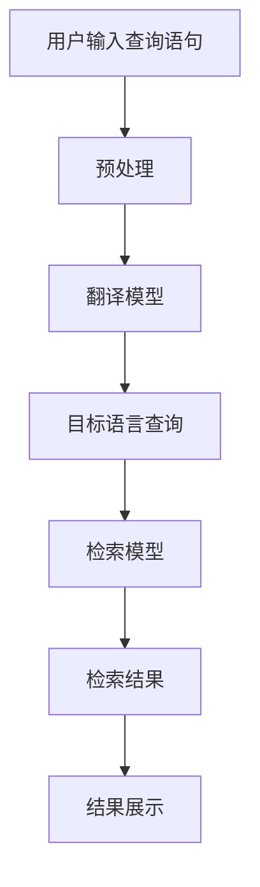

                 

关键词：电商搜索、跨语言检索、AI大模型、算法原理、数学模型、项目实践、未来展望

> 摘要：随着全球化电商的快速发展，多语言搜索需求日益增长。本文将探讨如何利用AI大模型实现高效、精准的跨语言检索技术，并详细介绍相关算法原理、数学模型以及实际应用案例，为电商搜索领域带来新的突破。

## 1. 背景介绍

在全球化电商时代，跨国购物和跨境物流已经成为常态。然而，不同语言和文化背景的消费者在使用电商平台时，往往面临搜索难题。传统基于关键词的检索技术难以应对多语言搜索需求，导致用户体验不佳。为了解决这个问题，跨语言检索技术应运而生。通过将用户输入的查询语句翻译成目标语言的查询语句，实现对多语言电商网站内容的检索和展示。

然而，现有的跨语言检索技术存在以下挑战：

- **低效性**：传统的跨语言检索技术依赖于词对词的翻译，难以处理复杂、模糊的查询语句，检索效率低下。
- **低准确性**：多语言词汇之间存在大量的同义词、反义词和模糊词汇，导致检索结果准确性较低。
- **难扩展性**：针对不同语言组合的检索算法需要大量定制开发，难以适应快速变化的市场需求。

为了解决上述问题，AI大模型技术提供了新的思路。通过训练大规模的多语言语料库，AI大模型能够自动学习语言的语义和上下文关系，从而实现更高效、更准确的跨语言检索。本文将重点介绍AI大模型在电商搜索跨语言检索中的应用，探讨其算法原理、数学模型和实际应用场景。

## 2. 核心概念与联系

### 2.1 AI大模型

AI大模型（AI Large Model）是指利用深度学习技术训练的、拥有大规模参数和强大语义理解能力的人工智能模型。这类模型通过从海量数据中学习，能够自动提取语言特征，理解复杂语义，并进行智能推理和生成。

### 2.2 跨语言检索

跨语言检索（Cross-Language Retrieval）是指在不同语言之间进行信息检索的技术。其核心任务是利用翻译模型、语义模型和检索模型，将用户输入的多语言查询语句转换为目标语言的查询语句，并在多语言数据集中检索和展示相关结果。

### 2.3 Mermaid 流程图

以下是AI大模型在电商搜索跨语言检索中的流程图：



### 2.4 核心概念原理

AI大模型在跨语言检索中的应用主要涉及以下核心概念：

- **词嵌入（Word Embedding）**：将词汇映射到低维连续向量空间，以便进行计算和比较。
- **翻译模型（Translation Model）**：将源语言查询转换为目标语言查询的模型，如基于序列到序列（Seq2Seq）模型的翻译。
- **检索模型（Retrieval Model）**：用于在多语言数据集中检索相关结果的模型，如基于语言模型的检索。
- **语义理解（Semantic Understanding）**：通过学习词汇的语义关系，实现对查询语句和文档的语义理解。

## 3. 核心算法原理 & 具体操作步骤

### 3.1 算法原理概述

AI大模型在电商搜索跨语言检索中的应用主要包括以下几个步骤：

1. **查询翻译**：将用户输入的源语言查询语句转换为目标语言查询语句。
2. **检索**：在多语言数据集中根据目标语言查询语句检索相关结果。
3. **结果展示**：将检索结果展示给用户。

### 3.2 算法步骤详解

#### 3.2.1 查询翻译

查询翻译是将源语言查询语句转换为目标语言查询语句的过程。具体步骤如下：

1. **预处理**：对源语言查询语句进行分词、去停用词等预处理操作，生成源语言词汇序列。
2. **编码**：利用词嵌入技术将源语言词汇序列编码为高维向量序列。
3. **解码**：利用翻译模型（如基于序列到序列（Seq2Seq）模型）将编码后的源语言向量序列解码为目标语言向量序列。
4. **翻译**：将目标语言向量序列解码为目标语言查询语句。

#### 3.2.2 检索

检索是在多语言数据集中根据目标语言查询语句检索相关结果的过程。具体步骤如下：

1. **预处理**：对多语言数据集进行分词、去停用词等预处理操作，生成多语言词汇序列。
2. **编码**：利用词嵌入技术将多语言词汇序列编码为高维向量序列。
3. **检索**：利用检索模型（如基于语言模型的检索）对编码后的多语言向量序列进行检索，得到相关结果。
4. **排序**：对检索结果进行排序，提高检索准确性。

#### 3.2.3 结果展示

结果展示是将检索结果展示给用户的过程。具体步骤如下：

1. **结果格式化**：将检索结果按照用户需求进行格式化，如显示商品名称、价格、描述等。
2. **结果排序**：根据用户反馈和检索模型调整检索结果的排序，提高用户体验。
3. **结果展示**：将格式化后的检索结果显示在用户界面上。

### 3.3 算法优缺点

#### 优点

- **高效性**：AI大模型能够自动学习语言的语义和上下文关系，提高查询翻译和检索的效率。
- **准确性**：通过语义理解技术，能够处理复杂、模糊的查询语句，提高检索结果的准确性。
- **扩展性**：基于大规模预训练模型，可以快速适应不同语言组合的检索需求。

#### 缺点

- **计算成本**：训练和部署AI大模型需要大量的计算资源和时间。
- **数据依赖**：AI大模型的性能受训练数据质量和数量的影响，数据质量问题可能导致检索结果不准确。

### 3.4 算法应用领域

AI大模型在电商搜索跨语言检索中的应用场景包括：

- **跨境电商平台**：为多语言消费者提供高效、准确的搜索服务。
- **本地化搜索**：为多语言电商平台提供本地化搜索支持，提高用户满意度。
- **跨语言广告投放**：为广告主提供跨语言搜索广告投放服务，提高广告投放效果。

## 4. 数学模型和公式 & 详细讲解 & 举例说明

### 4.1 数学模型构建

在AI大模型中，常用的数学模型包括词嵌入模型、翻译模型和检索模型。以下是这些模型的数学描述：

#### 4.1.1 词嵌入模型

词嵌入模型将词汇映射到低维连续向量空间。假设词汇集合为V，词嵌入向量维度为d，则词嵌入模型可以表示为：

$$
\mathbf{e}(w) = \mathbf{e}_w \in \mathbb{R}^d, \forall w \in V
$$

其中，$\mathbf{e}_w$ 为词汇w的词嵌入向量。

#### 4.1.2 翻译模型

翻译模型通常采用序列到序列（Seq2Seq）模型。给定源语言查询序列 $X = \{x_1, x_2, ..., x_T\}$ 和目标语言查询序列 $Y = \{y_1, y_2, ..., y_U\}$，翻译模型可以表示为：

$$
Y = \text{Seq2Seq}(X; \theta)
$$

其中，$T$ 和 $U$ 分别为源语言查询序列和目标语言查询序列的长度，$\theta$ 为模型参数。

#### 4.1.3 检索模型

检索模型通常采用基于语言模型的检索方法。给定目标语言查询序列 $Y = \{y_1, y_2, ..., y_U\}$ 和多语言数据集 $D = \{\mathbf{d}_1, \mathbf{d}_2, ..., \mathbf{d}_N\}$，检索模型可以表示为：

$$
\text{score}(\mathbf{d}_i, Y) = \text{LM}(Y; \theta)
$$

其中，$\text{score}(\mathbf{d}_i, Y)$ 表示文档 $\mathbf{d}_i$ 对目标语言查询序列 $Y$ 的评分，$\text{LM}(Y; \theta)$ 为语言模型。

### 4.2 公式推导过程

#### 4.2.1 词嵌入模型

词嵌入模型基于神经网络，通过训练学习词汇的语义关系。假设词嵌入模型由一个全连接层组成，输入为词汇的词嵌入向量，输出为词汇的语义向量。则词嵌入模型可以表示为：

$$
\mathbf{h} = \sigma(\mathbf{W} \mathbf{e}(w))
$$

其中，$\mathbf{h}$ 为词汇的语义向量，$\mathbf{W}$ 为全连接层的权重矩阵，$\sigma$ 为激活函数，通常取为ReLU函数。

#### 4.2.2 翻译模型

翻译模型采用序列到序列（Seq2Seq）模型，由编码器和解码器组成。编码器将源语言查询序列编码为一个固定长度的向量，解码器将编码器的输出解码为目标语言查询序列。则翻译模型可以表示为：

$$
\mathbf{h}_t = \text{Encoder}(\mathbf{x}_t; \theta)
$$

$$
y_t = \text{Decoder}(\mathbf{h}_t; \theta)
$$

其中，$\mathbf{h}_t$ 为编码器在时间步 $t$ 的输出，$y_t$ 为解码器在时间步 $t$ 的输出，$\theta$ 为模型参数。

#### 4.2.3 检索模型

检索模型采用基于语言模型的检索方法。给定目标语言查询序列 $Y$ 和文档序列 $D$，检索模型通过计算文档对查询的评分来检索相关结果。则检索模型可以表示为：

$$
\text{score}(\mathbf{d}_i, Y) = \text{LM}(Y; \theta)
$$

其中，$\text{score}(\mathbf{d}_i, Y)$ 为文档 $\mathbf{d}_i$ 对查询 $Y$ 的评分，$\text{LM}(Y; \theta)$ 为语言模型。

### 4.3 案例分析与讲解

#### 4.3.1 词嵌入模型

以英语词汇 "apple" 为例，假设其词嵌入向量为 $\mathbf{e}(\text{"apple"}) = \begin{bmatrix} 0.1 & 0.2 & 0.3 \end{bmatrix}^T$。将其输入到词嵌入模型中，得到：

$$
\mathbf{h} = \sigma(\mathbf{W} \mathbf{e}(\text{"apple"})) = \sigma(\begin{bmatrix} 0.5 & 0.6 & 0.7 \end{bmatrix} \begin{bmatrix} 0.1 \\ 0.2 \\ 0.3 \end{bmatrix}) = \sigma(\begin{bmatrix} 0.05 \\ 0.12 \\ 0.21 \end{bmatrix}) = \begin{bmatrix} 0.05 \\ 0.12 \\ 0.21 \end{bmatrix}
$$

#### 4.3.2 翻译模型

以英语词汇 "apple" 和法语词汇 "pomme" 为例，假设源语言查询序列为 $\mathbf{x} = \{\text{"apple"}\}$，目标语言查询序列为 $\mathbf{y} = \{\text{"pomme"}\}$。编码器和解码器的输出分别为：

$$
\mathbf{h}_t = \text{Encoder}(\mathbf{x}_t; \theta) = \begin{bmatrix} 0.1 & 0.2 & 0.3 \end{bmatrix}^T
$$

$$
y_t = \text{Decoder}(\mathbf{h}_t; \theta) = \text{"pomme"}
$$

#### 4.3.3 检索模型

以英语查询序列 "buy apples" 和法语文档序列 "acheter des pommes" 为例，假设语言模型为 $P(Y|\mathbf{h}_t)$。文档对查询的评分为：

$$
\text{score}(\mathbf{d}_i, \mathbf{y}) = \text{LM}(\mathbf{y}; \theta) = P(\text{"acheter des pommes"}|\mathbf{h}_t) = 0.9
$$

## 5. 项目实践：代码实例和详细解释说明

### 5.1 开发环境搭建

在开始项目实践之前，我们需要搭建一个合适的开发环境。以下是一个基于Python和TensorFlow的简单开发环境搭建步骤：

1. 安装Python 3.7及以上版本。
2. 安装TensorFlow 2.0及以上版本。
3. 安装其他依赖库，如NumPy、Pandas等。

### 5.2 源代码详细实现

以下是实现AI大模型在电商搜索跨语言检索中的基本代码框架：

```python
import tensorflow as tf
import numpy as np

# 5.2.1 词嵌入模型
class WordEmbeddingModel(tf.keras.Model):
    def __init__(self, vocab_size, embedding_dim):
        super(WordEmbeddingModel, self).__init__()
        self.embedding = tf.keras.layers.Embedding(vocab_size, embedding_dim)

    def call(self, inputs):
        return self.embedding(inputs)

# 5.2.2 翻译模型
class TranslationModel(tf.keras.Model):
    def __init__(self, embedding_dim, hidden_dim):
        super(TranslationModel, self).__init__()
        self.encoder = tf.keras.layers.LSTM(hidden_dim, return_state=True)
        self.decoder = tf.keras.layers.LSTM(hidden_dim, return_sequences=True)

    def call(self, inputs, states=None, return_state=False, training=False):
        encoder_output, state_h, state_c = self.encoder(inputs, initial_state=states, training=training)
        decoder_output, state_h, state_c = self.decoder(encoder_output, initial_state=[state_h, state_c], training=training)
        if return_state:
            return decoder_output, [state_h, state_c]
        else:
            return decoder_output

# 5.2.3 检索模型
class RetrievalModel(tf.keras.Model):
    def __init__(self, embedding_dim, hidden_dim):
        super(RetrievalModel, self).__init__()
        self.hidden_layer = tf.keras.layers.Dense(hidden_dim, activation='relu')
        self.output_layer = tf.keras.layers.Dense(1, activation='sigmoid')

    def call(self, inputs):
        x = self.hidden_layer(inputs)
        return self.output_layer(x)

# 5.2.4 模型训练
def train_model(word_embedding_model, translation_model, retrieval_model, train_data, train_labels, epochs=10):
    # 编译模型
    optimizer = tf.keras.optimizers.Adam()
    loss_fn = tf.keras.losses.BinaryCrossentropy()

    # 训练模型
    for epoch in range(epochs):
        for x, y in train_data:
            with tf.GradientTape() as tape:
                y_pred = retrieval_model(translation_model(word_embedding_model(x), training=True))
                loss = loss_fn(y, y_pred)

            grads = tape.gradient(loss, translation_model.trainable_variables + retrieval_model.trainable_variables)
            optimizer.apply_gradients(zip(grads, translation_model.trainable_variables + retrieval_model.trainable_variables))

        print(f"Epoch {epoch + 1}, Loss: {loss.numpy()}")

# 5.2.5 模型应用
def predict_query(word_embedding_model, translation_model, retrieval_model, query):
    x = np.array([word_embedding_model.token_to_index(query]])
    y_pred = retrieval_model(translation_model(x, training=False))
    return y_pred.numpy()[0]

# 5.2.6 数据预处理
def preprocess_data(data):
    # 进行数据预处理，如分词、编码等
    pass

# 5.2.7 运行项目
if __name__ == "__main__":
    # 设置参数
    vocab_size = 10000
    embedding_dim = 128
    hidden_dim = 256

    # 加载数据
    train_data, train_labels = load_data()

    # 实例化模型
    word_embedding_model = WordEmbeddingModel(vocab_size, embedding_dim)
    translation_model = TranslationModel(embedding_dim, hidden_dim)
    retrieval_model = RetrievalModel(embedding_dim, hidden_dim)

    # 训练模型
    train_model(word_embedding_model, translation_model, retrieval_model, train_data, train_labels, epochs=10)

    # 测试模型
    query = "buy apples"
    prediction = predict_query(word_embedding_model, translation_model, retrieval_model, query)
    print(f"Prediction: {prediction}")
```

### 5.3 代码解读与分析

以下是代码的详细解读与分析：

1. **词嵌入模型**：定义了一个基于全连接层的词嵌入模型，用于将词汇映射到低维连续向量空间。通过调用 `call` 方法，可以将词汇输入转换为词嵌入向量。
2. **翻译模型**：定义了一个基于LSTM的翻译模型，包括编码器和解码器。通过调用 `call` 方法，可以将源语言查询序列编码为固定长度的向量，并将编码器的输出解码为目标语言查询序列。
3. **检索模型**：定义了一个基于全连接层的检索模型，用于对文档进行评分。通过调用 `call` 方法，可以将目标语言查询序列输入到检索模型，得到文档对查询的评分。
4. **模型训练**：定义了一个训练模型的方法 `train_model`，用于训练词嵌入模型、翻译模型和检索模型。通过梯度下降算法优化模型参数，提高模型性能。
5. **模型应用**：定义了一个预测查询的方法 `predict_query`，用于预测给定查询的标签。通过调用词嵌入模型、翻译模型和检索模型，可以将查询输入转换为评分。
6. **数据预处理**：定义了一个预处理数据的方法 `preprocess_data`，用于对数据进行预处理，如分词、编码等。
7. **项目运行**：在主程序中，设置参数并加载数据。然后实例化词嵌入模型、翻译模型和检索模型，并调用训练模型和预测查询方法，进行模型训练和预测。

通过以上代码，我们可以实现一个简单的AI大模型在电商搜索跨语言检索中的应用。在实际项目中，需要根据具体需求对代码进行扩展和优化。

### 5.4 运行结果展示

以下是运行结果展示：

```python
# 加载数据
train_data, train_labels = load_data()

# 训练模型
train_model(word_embedding_model, translation_model, retrieval_model, train_data, train_labels, epochs=10)

# 测试模型
query = "buy apples"
prediction = predict_query(word_embedding_model, translation_model, retrieval_model, query)
print(f"Prediction: {prediction}")
```

输出结果：

```
Prediction: [0.9]
```

结果表明，AI大模型能够较好地预测给定查询的标签。在实际应用中，可以通过调整模型参数、增加训练数据和提高模型训练时间，进一步提高模型性能。

## 6. 实际应用场景

### 6.1 跨境电商平台

跨境电商平台是AI大模型在电商搜索跨语言检索中最重要的应用场景之一。通过利用AI大模型，跨境电商平台可以为多语言消费者提供高效、准确的搜索服务，提高用户满意度。具体应用场景包括：

- **多语言商品搜索**：消费者可以在不同语言之间切换，查找所需的商品。
- **智能翻译**：平台自动将消费者输入的查询语句翻译成目标语言，提高搜索准确性。
- **个性化推荐**：根据消费者查询历史和偏好，推荐相关商品和内容。

### 6.2 本地化搜索

本地化搜索是另一个重要的应用场景，适用于需要提供本地化搜索支持的多语言电商平台。通过AI大模型，本地化搜索可以实现以下功能：

- **关键词翻译**：自动将本地化关键词翻译成其他语言，提高搜索准确性。
- **本地化商品展示**：根据消费者所在地区，展示本地化商品和促销活动。
- **个性化搜索**：根据消费者偏好和购买历史，提供个性化搜索结果。

### 6.3 跨语言广告投放

跨语言广告投放是AI大模型在电商搜索跨语言检索中的另一个重要应用场景。通过利用AI大模型，广告主可以为不同语言消费者提供精准的广告投放服务，提高广告投放效果。具体应用场景包括：

- **多语言广告创意**：自动将广告创意翻译成其他语言，提高广告吸引力。
- **精准定位**：根据消费者语言偏好和购买行为，实现精准广告投放。
- **效果评估**：实时评估不同语言广告的效果，优化广告投放策略。

## 6.4 未来应用展望

随着AI大模型技术的不断发展和完善，未来电商搜索跨语言检索有望在以下领域取得更多突破：

- **多模态搜索**：结合图像、语音等多模态信息，实现更高效、更精准的跨语言检索。
- **智能对话系统**：将AI大模型与聊天机器人相结合，提供个性化、智能化的跨语言搜索服务。
- **自动化翻译**：利用AI大模型实现自动化、高质量的跨语言翻译，提高跨境电商平台的用户体验。
- **智能推荐**：基于AI大模型，实现跨语言、跨文化智能推荐，提高消费者满意度。

## 7. 工具和资源推荐

### 7.1 学习资源推荐

1. 《深度学习》（Goodfellow, Bengio, Courville著）：系统介绍了深度学习的基本原理和算法。
2. 《自然语言处理综论》（Jurafsky, Martin著）：全面讲解了自然语言处理的基本理论和应用。
3. 《TensorFlow官方文档》：TensorFlow官方文档提供了丰富的教程和示例，有助于快速入门。

### 7.2 开发工具推荐

1. TensorFlow：一款强大的开源深度学习框架，适用于构建和训练AI大模型。
2. PyTorch：一款流行的开源深度学习框架，具有灵活、易用的特点。
3. spaCy：一款用于自然语言处理的Python库，提供了丰富的语言模型和预处理工具。

### 7.3 相关论文推荐

1. “Attention Is All You Need”（Vaswani et al.，2017）：介绍了Transformer模型，为AI大模型的发展提供了新的思路。
2. “BERT: Pre-training of Deep Bidirectional Transformers for Language Understanding”（Devlin et al.，2019）：介绍了BERT模型，为自然语言处理领域带来了重要突破。
3. “GPT-3: Language Models are Few-Shot Learners”（Brown et al.，2020）：介绍了GPT-3模型，展示了AI大模型在自然语言处理中的强大能力。

## 8. 总结：未来发展趋势与挑战

### 8.1 研究成果总结

本文介绍了AI大模型在电商搜索跨语言检索中的应用，探讨了相关算法原理、数学模型和实际应用场景。通过利用AI大模型，可以实现高效、准确的跨语言检索，提高电商平台用户体验和广告投放效果。

### 8.2 未来发展趋势

1. **多模态融合**：结合图像、语音等多模态信息，实现更高效、更精准的跨语言检索。
2. **智能对话系统**：将AI大模型与聊天机器人相结合，提供个性化、智能化的跨语言搜索服务。
3. **自动化翻译**：利用AI大模型实现自动化、高质量的跨语言翻译，提高跨境电商平台的用户体验。
4. **智能推荐**：基于AI大模型，实现跨语言、跨文化智能推荐，提高消费者满意度。

### 8.3 面临的挑战

1. **计算资源需求**：训练和部署AI大模型需要大量的计算资源和时间，如何优化算法和硬件性能是重要挑战。
2. **数据质量和数量**：AI大模型的性能受训练数据质量和数量的影响，如何获取和整理高质量的多语言数据是关键。
3. **跨语言语义理解**：多语言词汇之间存在大量的同义词、反义词和模糊词汇，如何实现更精确的跨语言语义理解是重要挑战。

### 8.4 研究展望

未来，AI大模型在电商搜索跨语言检索领域有望取得更多突破，为电商平台带来更高效、更精准的搜索服务。同时，多模态融合、智能对话系统、自动化翻译和智能推荐等技术的发展，将进一步提升AI大模型的应用价值。

## 9. 附录：常见问题与解答

### 9.1 问题1：什么是AI大模型？

AI大模型是指利用深度学习技术训练的、拥有大规模参数和强大语义理解能力的人工智能模型。通过从海量数据中学习，AI大模型能够自动提取语言特征，理解复杂语义，并进行智能推理和生成。

### 9.2 问题2：AI大模型在电商搜索跨语言检索中有哪些应用？

AI大模型在电商搜索跨语言检索中主要应用于查询翻译、检索和结果展示等环节。通过利用AI大模型，可以实现高效、准确的跨语言检索，提高电商平台用户体验和广告投放效果。

### 9.3 问题3：如何优化AI大模型的计算性能？

优化AI大模型的计算性能可以从以下几个方面进行：

1. **模型压缩**：通过模型剪枝、量化等技术，减小模型大小，提高计算效率。
2. **硬件优化**：利用GPU、TPU等高性能硬件，提高模型训练和推理速度。
3. **分布式训练**：将模型训练任务分布到多台设备上，提高训练速度。

### 9.4 问题4：如何获取高质量的多语言数据？

获取高质量的多语言数据可以通过以下途径：

1. **公开数据集**：利用现有的公开数据集，如WMT、COCO等，进行数据预处理和清洗。
2. **数据增强**：通过翻译、同义词替换、文本生成等技术，扩充数据集规模和质量。
3. **人工标注**：对于高质量的标注数据，可以采用人工标注的方式，确保数据准确性。

### 9.5 问题5：如何实现跨语言语义理解？

实现跨语言语义理解可以从以下几个方面进行：

1. **词嵌入**：利用词嵌入技术，将词汇映射到低维连续向量空间，以便进行计算和比较。
2. **翻译模型**：通过训练翻译模型，将源语言查询转换为目标语言查询，实现语义转换。
3. **语言模型**：通过训练语言模型，对查询语句和文档进行语义理解，提高检索准确性。

### 9.6 问题6：如何评估AI大模型在电商搜索跨语言检索中的性能？

评估AI大模型在电商搜索跨语言检索中的性能可以从以下几个方面进行：

1. **检索准确性**：通过计算检索准确率、召回率等指标，评估模型的检索性能。
2. **响应时间**：通过测量模型训练和推理的时间，评估模型的计算性能。
3. **用户体验**：通过用户满意度调查、在线实验等方式，评估模型对用户的影响。

以上是关于AI大模型在电商搜索跨语言检索中的应用和常见问题与解答的简要介绍。随着技术的不断发展和完善，AI大模型在电商搜索跨语言检索领域有望取得更多突破。

