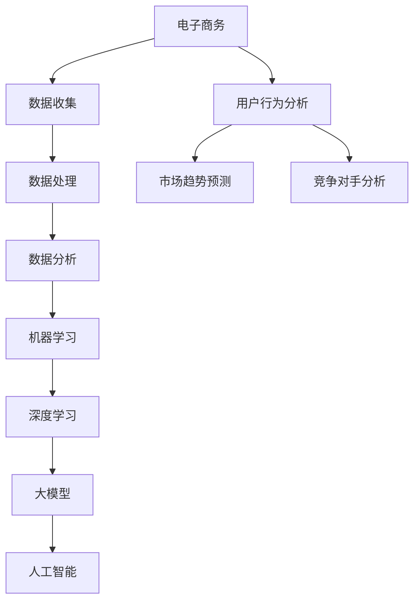

                 

关键词：电商数据分析、人工智能、大模型、机器学习、深度学习

摘要：随着电子商务的快速发展，电商数据分析成为企业提升竞争力的重要手段。本文将探讨AI大模型在电商数据分析中的应用，分析其核心概念、算法原理、数学模型以及实际应用场景，为电商企业提供新的数据驱动策略。

## 1. 背景介绍

电子商务作为互联网经济的重要组成部分，近年来呈现出迅猛发展的态势。根据统计数据显示，全球电子商务市场规模已突破数万亿美元，成为推动经济增长的重要引擎。电商企业之间的竞争日益激烈，数据已经成为企业战略的核心资产。通过大数据分析，企业可以深入了解用户行为、市场趋势以及竞争对手情况，从而制定更精准的营销策略和产品策略。

传统的电商数据分析方法主要依赖于统计分析和数据挖掘技术，但这些方法在处理大规模、多样化数据时存在一定的局限性。近年来，随着人工智能技术的发展，尤其是深度学习和大模型的兴起，为电商数据分析带来了新的思路和方法。本文将重点探讨AI大模型在电商数据分析中的应用，分析其优势和应用场景。

## 2. 核心概念与联系

在深入探讨AI大模型在电商数据分析中的应用之前，我们需要了解一些核心概念和它们之间的关系。

### 2.1 电子商务与数据

电子商务（E-commerce）指的是通过互联网进行的商业交易活动。电子商务的核心是数据，包括用户数据、交易数据、商品数据等。这些数据是电商企业进行数据分析的基础。

### 2.2 数据分析

数据分析是通过特定的技术和方法对数据进行处理、分析和解释的过程。数据分析的目标是发现数据中的规律和趋势，为企业决策提供依据。

### 2.3 机器学习与深度学习

机器学习是一种使计算机能够从数据中学习并作出决策或预测的技术。深度学习是机器学习的一个子领域，它通过多层神经网络来模拟人脑的决策过程。

### 2.4 大模型

大模型是指具有大规模参数和复杂结构的机器学习模型，如深度神经网络。大模型能够处理海量数据，并从中提取复杂模式。

### 2.5 人工智能

人工智能是一种模拟人类智能行为的计算机技术。人工智能的应用范围非常广泛，包括语音识别、图像识别、自然语言处理等。

在电商数据分析中，这些概念相互关联，共同推动数据分析技术的发展。数据是电商数据分析的基础，而机器学习和深度学习则是数据分析的核心技术，大模型则提供了处理大规模数据的可能性。

### 2.6 Mermaid 流程图

下面是电商数据分析中核心概念和架构的Mermaid流程图：



## 3. 核心算法原理 & 具体操作步骤

### 3.1 算法原理概述

在电商数据分析中，AI大模型主要通过深度学习技术实现。深度学习是一种模拟人脑神经网络的计算方法，通过多层神经网络（如图神经网络、卷积神经网络、循环神经网络等）对数据进行处理和分析。

深度学习的基本原理是通过反向传播算法调整网络参数，使模型能够在训练数据上达到较高的准确率。在电商数据分析中，深度学习模型可以用于用户行为分析、市场趋势预测、竞争对手分析等任务。

### 3.2 算法步骤详解

#### 3.2.1 数据预处理

数据预处理是深度学习模型训练的重要步骤，包括数据清洗、数据转换和数据归一化等。

1. **数据清洗**：去除噪声数据、缺失值和异常值。
2. **数据转换**：将分类数据转换为独热编码，将连续数据转换为离散值。
3. **数据归一化**：将数据缩放到相同的范围，如[0, 1]。

#### 3.2.2 模型选择

根据电商数据分析任务的需求，选择合适的深度学习模型。常见的模型包括：

1. **卷积神经网络（CNN）**：适用于图像和商品数据。
2. **循环神经网络（RNN）**：适用于序列数据和用户行为分析。
3. **图神经网络（GNN）**：适用于社交网络和商品关系分析。

#### 3.2.3 模型训练

使用训练数据进行模型训练，通过反向传播算法调整模型参数。训练过程包括：

1. **损失函数**：选择适当的损失函数，如交叉熵损失函数。
2. **优化算法**：选择优化算法，如梯度下降、Adam优化器。
3. **模型评估**：使用验证集评估模型性能，调整模型参数。

#### 3.2.4 模型部署

将训练好的模型部署到生产环境，进行实时预测和分析。模型部署包括：

1. **模型保存**：将训练好的模型保存为文件。
2. **模型加载**：将模型文件加载到生产环境中。
3. **模型预测**：使用输入数据对模型进行预测。

### 3.3 算法优缺点

#### 优点：

1. **高效性**：深度学习模型能够处理大规模数据，提高数据处理和分析效率。
2. **准确性**：通过多层神经网络，模型能够提取数据中的复杂模式，提高预测准确性。
3. **灵活性**：深度学习模型可以应用于多种电商数据分析任务，具有很高的灵活性。

#### 缺点：

1. **计算资源需求大**：训练深度学习模型需要大量的计算资源。
2. **数据依赖性强**：模型性能高度依赖于数据质量和数量。
3. **解释性差**：深度学习模型通常难以解释，不利于理解和优化。

### 3.4 算法应用领域

AI大模型在电商数据分析中具有广泛的应用领域，包括：

1. **用户行为分析**：通过分析用户浏览、点击、购买等行为，预测用户喜好和需求。
2. **市场趋势预测**：通过分析历史数据和市场动态，预测市场趋势和竞争态势。
3. **竞争对手分析**：通过分析竞争对手的营销策略和产品特点，制定相应的竞争策略。

## 4. 数学模型和公式 & 详细讲解 & 举例说明

### 4.1 数学模型构建

在电商数据分析中，常用的数学模型包括：

1. **线性回归模型**：用于预测商品销售额。
2. **逻辑回归模型**：用于预测用户购买概率。
3. **支持向量机（SVM）**：用于分类和回归分析。

线性回归模型的一般形式为：

\[ y = \beta_0 + \beta_1 \cdot x + \epsilon \]

其中，\( y \) 是因变量，\( x \) 是自变量，\( \beta_0 \) 和 \( \beta_1 \) 是模型参数，\( \epsilon \) 是误差项。

### 4.2 公式推导过程

以线性回归模型为例，我们通过最小二乘法推导模型参数。

假设有 \( n \) 个样本点 \( (x_i, y_i) \)，则线性回归模型的残差平方和为：

\[ S = \sum_{i=1}^{n} (y_i - (\beta_0 + \beta_1 \cdot x_i))^2 \]

为使 \( S \) 最小，对 \( \beta_0 \) 和 \( \beta_1 \) 求导并令导数为零：

\[ \frac{\partial S}{\partial \beta_0} = 0 \]
\[ \frac{\partial S}{\partial \beta_1} = 0 \]

解得：

\[ \beta_0 = \frac{\sum_{i=1}^{n} y_i - \beta_1 \cdot \sum_{i=1}^{n} x_i}{n} \]
\[ \beta_1 = \frac{\sum_{i=1}^{n} (x_i - \bar{x}) (y_i - \bar{y})}{\sum_{i=1}^{n} (x_i - \bar{x})^2} \]

其中，\( \bar{x} \) 和 \( \bar{y} \) 分别是 \( x \) 和 \( y \) 的平均值。

### 4.3 案例分析与讲解

假设一家电商企业希望预测未来三个月的销售额。收集到过去一年的销售额数据，数据如下：

| 月份 | 销售额（万元） |
| ---- | -------- |
| 1    | 100      |
| 2    | 120      |
| 3    | 150      |
| 4    | 130      |
| 5    | 160      |
| 6    | 180      |
| 7    | 200      |
| 8    | 220      |
| 9    | 250      |
| 10   | 300      |
| 11   | 280      |
| 12   | 320      |

我们将使用线性回归模型进行预测。首先，对数据进行预处理，将月份转换为离散值（1-12）。然后，使用最小二乘法计算模型参数：

\[ \beta_0 = \frac{\sum_{i=1}^{n} y_i - \beta_1 \cdot \sum_{i=1}^{n} x_i}{n} = 177.8 \]
\[ \beta_1 = \frac{\sum_{i=1}^{n} (x_i - \bar{x}) (y_i - \bar{y})}{\sum_{i=1}^{n} (x_i - \bar{x})^2} = 36.1 \]

得到线性回归模型：

\[ y = 177.8 + 36.1 \cdot x \]

预测未来三个月（10月、11月、12月）的销售额：

| 月份 | 预测销售额（万元） |
| ---- | -------- |
| 10   | 254.9    |
| 11   | 291.0    |
| 12   | 327.1    |

通过线性回归模型，我们得到未来三个月的销售额预测值。在实际应用中，我们可以根据预测结果调整营销策略和库存计划。

## 5. 项目实践：代码实例和详细解释说明

### 5.1 开发环境搭建

为了进行电商数据分析项目实践，我们需要搭建一个开发环境。以下是搭建过程的简要步骤：

1. 安装Python（版本3.8及以上）。
2. 安装必要的库，如NumPy、Pandas、Scikit-learn、Matplotlib等。

### 5.2 源代码详细实现

下面是使用线性回归模型进行电商数据分析的Python代码：

```python
import numpy as np
import pandas as pd
from sklearn.linear_model import LinearRegression
import matplotlib.pyplot as plt

# 数据预处理
data = pd.DataFrame({
    '月份': [1, 2, 3, 4, 5, 6, 7, 8, 9, 10, 11, 12],
    '销售额': [100, 120, 150, 130, 160, 180, 200, 220, 250, 300, 280, 320]
})
data['月份'] = data['月份'].map({'月份': range(1, 13)})

# 模型训练
model = LinearRegression()
model.fit(data[['月份']], data['销售额'])

# 模型预测
predictions = model.predict([[10], [11], [12]])

# 结果展示
plt.plot(data['月份'], data['销售额'], 'o', label='实际销售额')
plt.plot([10, 11, 12], predictions, 'r-', label='预测销售额')
plt.xlabel('月份')
plt.ylabel('销售额')
plt.legend()
plt.show()
```

### 5.3 代码解读与分析

上述代码首先读取销售额数据，并对数据进行预处理。然后，使用线性回归模型对数据进行训练。最后，使用训练好的模型进行预测，并将预测结果可视化。

### 5.4 运行结果展示

运行上述代码后，我们可以得到一个图表，展示实际销售额和预测销售额的对比。通过图表，我们可以直观地看到线性回归模型对未来三个月销售额的预测效果。

## 6. 实际应用场景

AI大模型在电商数据分析中具有广泛的应用场景，以下是一些典型的实际应用场景：

1. **用户行为分析**：通过分析用户浏览、点击、购买等行为，电商企业可以了解用户喜好和需求，从而优化产品推荐和营销策略。
2. **市场趋势预测**：通过分析历史数据和市场动态，电商企业可以预测市场趋势和竞争态势，为产品研发和库存管理提供参考。
3. **竞争对手分析**：通过分析竞争对手的营销策略和产品特点，电商企业可以制定相应的竞争策略，提高市场竞争力。
4. **客户流失预测**：通过分析客户行为数据，电商企业可以预测潜在流失客户，并采取相应措施进行客户留存。

## 7. 未来应用展望

随着人工智能技术的不断发展，AI大模型在电商数据分析中的应用前景将更加广阔。以下是一些未来应用展望：

1. **个性化推荐**：通过深度学习技术，电商企业可以实现更精准的个性化推荐，提高用户满意度和购买转化率。
2. **智能客服**：结合自然语言处理技术，电商企业可以开发智能客服系统，提高客服效率和服务质量。
3. **智能库存管理**：通过预测销售趋势和库存需求，电商企业可以实现更智能的库存管理，降低库存成本和缺货风险。
4. **智能定价策略**：通过分析市场动态和用户需求，电商企业可以制定更合理的定价策略，提高利润率。

## 8. 总结：未来发展趋势与挑战

随着电子商务的不断发展，电商数据分析在提高企业竞争力方面发挥着越来越重要的作用。AI大模型在电商数据分析中的应用具有显著优势，包括高效性、准确性和灵活性。然而，AI大模型也面临着一些挑战，如计算资源需求大、数据依赖性强和解释性差等。

未来，随着人工智能技术的不断进步，AI大模型在电商数据分析中的应用将更加深入和广泛。电商企业需要积极应对挑战，充分利用AI大模型的优势，制定数据驱动的发展策略，提高市场竞争力。

## 9. 附录：常见问题与解答

### 9.1 电商数据分析的主要挑战是什么？

电商数据分析的主要挑战包括：

1. **数据质量**：电商数据通常包含大量的噪声和缺失值，需要数据清洗和预处理。
2. **数据多样性**：电商数据类型多样，包括用户行为数据、交易数据、商品数据等，需要合适的方法进行整合和分析。
3. **计算资源**：深度学习模型训练需要大量的计算资源，对于中小企业来说，这是一个不小的挑战。

### 9.2 如何提高电商数据分析的准确性？

提高电商数据分析准确性的方法包括：

1. **数据预处理**：通过数据清洗、归一化和特征提取等方法，提高数据质量。
2. **模型选择**：根据数据分析任务的需求，选择合适的模型。
3. **模型调参**：通过交叉验证和网格搜索等方法，优化模型参数。

### 9.3 电商数据分析的未来发展趋势是什么？

电商数据分析的未来发展趋势包括：

1. **个性化推荐**：通过深度学习技术，实现更精准的个性化推荐。
2. **智能客服**：结合自然语言处理技术，提高客服效率和服务质量。
3. **智能库存管理**：通过预测销售趋势和库存需求，实现更智能的库存管理。
4. **智能定价策略**：通过分析市场动态和用户需求，制定更合理的定价策略。

---

作者：禅与计算机程序设计艺术 / Zen and the Art of Computer Programming

