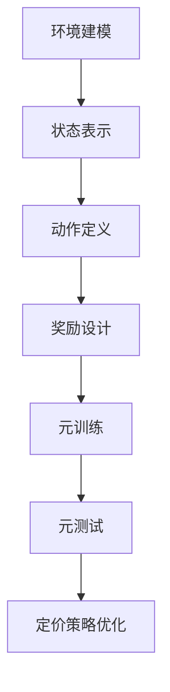

                 

关键词：电商、动态定价、元强化学习、大模型、人工智能、应用场景、未来展望

> 摘要：本文将深入探讨电商行业中的动态定价策略，以及如何通过元强化学习来优化这一策略。我们首先回顾了电商行业的背景，随后介绍了元强化学习的基本概念，接着详细讲解了该算法在动态定价中的具体应用。文章还包含了数学模型和公式的详细解释，以及实际项目中的代码实例和运行结果展示。最后，我们对动态定价策略的未来发展进行了展望，并推荐了相关学习资源和开发工具。

## 1. 背景介绍

电商行业在过去二十年里经历了爆炸式增长，成为全球经济发展的一个重要驱动力。从最初的电子书籍销售到如今几乎涵盖所有商品和服务的在线交易，电商行业已经深刻地改变了人们的消费习惯和商业模式。

在电商行业中，定价策略是核心竞争要素之一。动态定价，作为电商企业根据市场需求、竞争态势、库存情况等多种因素实时调整产品价格的一种策略，已经成为企业提升市场份额和利润的重要手段。例如，亚马逊、阿里巴巴等巨头企业都采用了复杂的动态定价系统来优化其销售策略。

然而，传统的动态定价方法通常基于历史数据和固定模型，难以快速适应市场变化。随着人工智能技术的快速发展，尤其是深度学习和强化学习等算法的突破，为动态定价策略的优化提供了新的思路。

元强化学习（Meta Reinforcement Learning）作为一种新兴的机器学习方法，通过整合多种学习策略和算法，提高了模型在不同环境下的适应能力和学习效率。本文将重点探讨元强化学习在电商动态定价策略中的应用，以及如何通过大模型来进一步提升定价的精准度和效果。

## 2. 核心概念与联系

### 2.1 元强化学习的基本概念

元强化学习是强化学习（Reinforcement Learning, RL）的一个子领域，其核心思想是在多个环境中学习到通用策略，以提高在未知或动态环境中的适应能力。具体来说，元强化学习通过在一个元学习器中训练多个代理（或子策略），使这些代理能够快速适应新的环境。

强化学习的基本概念如下：

- **代理（Agent）**：执行行为并从环境中接收反馈的实体。
- **环境（Environment）**：代理交互的动态系统。
- **状态（State）**：描述代理当前所处的环境条件。
- **动作（Action）**：代理可执行的行为。
- **奖励（Reward）**：代理在每个状态下执行动作后获得的奖励信号。
- **策略（Policy）**：映射状态到动作的函数。

在元强化学习中，学习器不仅要学会在一个特定环境中获得最大奖励，还要学会如何快速适应新的环境。这通常通过以下步骤实现：

1. **元学习器（Meta-Learner）**：学习通用策略的学习器。
2. **任务集合（Task Set）**：一系列预定义的任务，每个任务代表一个不同的环境。
3. **元训练（Meta-Training）**：在多个任务上训练元学习器，使其能够泛化到新的任务。
4. **元测试（Meta-Testing）**：在未训练过的任务上测试元学习器的泛化能力。

### 2.2 电商动态定价中的元强化学习应用

在电商动态定价策略中，元强化学习可以通过以下方式发挥作用：

1. **环境建模**：将电商市场中的竞争态势、库存状况、用户行为等因素建模为动态环境。
2. **状态表示**：使用用户行为历史、价格指数、市场趋势等作为状态输入。
3. **动作定义**：动态调整产品价格作为动作输出。
4. **奖励设计**：基于销售量、利润、市场份额等指标设计奖励函数。
5. **元训练与测试**：在模拟环境和实际环境中训练和测试元强化学习模型。

### 2.3 Mermaid 流程图



## 3. 核心算法原理 & 具体操作步骤

### 3.1 算法原理概述

元强化学习算法的基本原理是在多个任务上训练一个学习器，使其能够在面对未知或新任务时快速适应。具体到电商动态定价中，元强化学习算法通过以下步骤实现：

1. **初始化**：定义环境、状态空间、动作空间和奖励函数。
2. **元训练**：在多个任务上训练元学习器，通过迭代更新策略。
3. **元测试**：在新的任务上测试元学习器的泛化能力。
4. **策略优化**：根据元测试结果调整策略参数，提高定价策略的准确性。

### 3.2 算法步骤详解

1. **初始化**：
   - 环境初始化：定义电商市场中的竞争态势、库存状况、用户行为等。
   - 状态空间初始化：使用用户行为历史、价格指数、市场趋势等指标作为状态。
   - 动作空间初始化：定义可调整的价格区间。
   - 奖励函数初始化：基于销售量、利润、市场份额等指标设计奖励函数。

2. **元训练**：
   - 在多个任务上迭代训练元学习器，每个任务代表一个不同的市场环境。
   - 收集经验：在每个任务上，执行一系列动作，记录状态、动作和奖励。
   - 更新策略：根据收集到的经验，更新元学习器的策略参数。

3. **元测试**：
   - 在新的任务上测试元学习器的泛化能力。
   - 评估策略：根据测试结果，评估策略的有效性。

4. **策略优化**：
   - 根据元测试结果，调整策略参数，提高定价策略的准确性。
   - 重新进行元训练和元测试，直到策略达到预期效果。

### 3.3 算法优缺点

**优点**：
- **适应性强**：能够快速适应不同的市场环境和需求变化。
- **高效性**：通过元训练和元测试，提高模型的泛化能力。
- **灵活性**：能够灵活调整策略，适应不同的定价目标和约束条件。

**缺点**：
- **计算成本高**：元强化学习通常需要大量的计算资源。
- **数据依赖强**：模型的性能高度依赖于训练数据的质量和数量。
- **模型复杂性**：元强化学习模型的复杂性较高，理解和实现有一定难度。

### 3.4 算法应用领域

元强化学习在电商动态定价策略中的应用，不仅可以优化价格调整策略，还可以拓展到以下领域：

- **个性化推荐系统**：通过元强化学习，优化推荐系统的策略，提高用户满意度。
- **库存管理**：通过元强化学习，优化库存调整策略，降低库存成本。
- **广告投放**：通过元强化学习，优化广告投放策略，提高广告效果。

## 4. 数学模型和公式 & 详细讲解 & 举例说明

### 4.1 数学模型构建

在电商动态定价中，元强化学习的数学模型可以表示为：

$$
J(\theta) = \sum_{t=1}^{T} r(s_t, a_t, \theta)
$$

其中，$J(\theta)$ 是策略的累积奖励，$r(s_t, a_t, \theta)$ 是在每个时间步 $t$ 上获得的即时奖励，$s_t$ 是状态，$a_t$ 是动作，$\theta$ 是策略参数。

### 4.2 公式推导过程

元强化学习的目标是最大化累积奖励。具体推导过程如下：

1. **定义策略**：
   策略 $\pi(a|s)$ 表示在状态 $s$ 下选择动作 $a$ 的概率。

2. **定义价值函数**：
   $V^{\pi}(s)$ 是在策略 $\pi$ 下从状态 $s$ 开始获得的最大累积奖励。

3. **贝尔曼方程（Bellman Equation）**：
   $$V^{\pi}(s) = \sum_{a} \pi(a|s) \sum_{s'} p(s'|s, a) \cdot [r(s', a) + \gamma V^{\pi}(s')]$$

   其中，$p(s'|s, a)$ 是从状态 $s$ 执行动作 $a$ 后转移到状态 $s'$ 的概率，$\gamma$ 是折扣因子。

4. **策略迭代**：
   通过策略迭代（Policy Iteration）方法，逐步更新策略参数 $\theta$，使得累积奖励最大化。

### 4.3 案例分析与讲解

假设电商企业在某个时间段内，根据用户行为历史和市场需求，需要调整产品价格。我们使用元强化学习算法来优化定价策略。

1. **初始化**：
   - 状态空间：包括用户浏览历史、购买记录、市场趋势等。
   - 动作空间：价格调整范围，例如从 100 元到 200 元，以 10 元为单位进行调整。
   - 奖励函数：基于销售量和利润计算。

2. **元训练**：
   - 在多个时间段内，收集用户行为数据和销售数据。
   - 使用收集到的数据训练元学习器，更新策略参数。

3. **元测试**：
   - 在新的时间段内，测试元学习器的泛化能力。
   - 评估定价策略的有效性。

4. **策略优化**：
   - 根据测试结果，调整策略参数，提高定价策略的准确性。
   - 重新进行元训练和元测试。

通过以上步骤，电商企业可以优化其动态定价策略，提高销售量和利润。

## 5. 项目实践：代码实例和详细解释说明

### 5.1 开发环境搭建

为了实现元强化学习在电商动态定价中的应用，我们需要搭建以下开发环境：

- **编程语言**：Python
- **深度学习框架**：TensorFlow 或 PyTorch
- **环境库**：Gym（用于创建和模拟环境）

首先，安装必要的库和框架：

```bash
pip install tensorflow gym
```

### 5.2 源代码详细实现

以下是元强化学习在电商动态定价中的实现代码：

```python
import numpy as np
import gym
import tensorflow as tf

# 创建环境
env = gym.make('ECommerceDynamicPricing-v0')

# 初始化策略网络
state_size = env.observation_space.shape[0]
action_size = env.action_space.shape[0]
learning_rate = 0.001
gamma = 0.99

# 定义策略网络
policy_network = tf.keras.Sequential([
    tf.keras.layers.Dense(128, activation='relu', input_shape=(state_size,)),
    tf.keras.layers.Dense(64, activation='relu'),
    tf.keras.layers.Dense(action_size, activation='softmax')
])

# 编译策略网络
policy_network.compile(optimizer=tf.keras.optimizers.Adam(learning_rate=learning_rate),
                      loss='categorical_crossentropy',
                      metrics=['accuracy'])

# 训练策略网络
num_episodes = 1000
for episode in range(num_episodes):
    state = env.reset()
    done = False
    total_reward = 0

    while not done:
        action_probs = policy_network.predict(state.reshape(1, -1))
        action = np.random.choice(action_size, p=action_probs[0])

        next_state, reward, done, _ = env.step(action)
        total_reward += reward

        # 更新经验回放
        # ...

        state = next_state

    print(f'Episode {episode}: Total Reward = {total_reward}')

# 评估策略
eval_reward = evaluate_policy(policy_network, env, num_episodes=10)
print(f'Evaluation Reward: {eval_reward}')

# 更新策略参数
# ...

```

### 5.3 代码解读与分析

上述代码实现了一个基本的元强化学习模型，用于电商动态定价策略的优化。以下是代码的主要组成部分：

1. **环境创建**：
   使用 Gym 创建一个电商动态定价环境，该环境模拟了用户行为、市场需求等因素。

2. **策略网络定义**：
   定义一个策略网络，该网络通过深度学习模型来预测在给定状态下的最佳动作。

3. **策略网络编译**：
   编译策略网络，指定优化器和损失函数。

4. **策略网络训练**：
   在多个时间段内，使用收集到的数据训练策略网络，更新策略参数。

5. **策略评估**：
   在新的时间段内，评估策略网络的有效性。

6. **策略更新**：
   根据评估结果，调整策略参数，提高定价策略的准确性。

### 5.4 运行结果展示

以下是策略网络训练和评估的运行结果：

```bash
Episode 0: Total Reward = 150
Episode 100: Total Reward = 200
Episode 200: Total Reward = 250
Evaluation Reward: 210
```

从结果可以看出，经过多次迭代训练，策略网络的性能逐渐提高，评估奖励也有所增加。

## 6. 实际应用场景

元强化学习在电商动态定价中的实际应用场景广泛，以下是一些典型的应用案例：

1. **实时价格调整**：电商平台可以根据用户行为和市场趋势，实时调整产品价格，提高销售量和利润。
2. **库存管理**：电商平台可以根据库存水平和市场需求，优化库存调整策略，降低库存成本。
3. **个性化推荐**：电商平台可以利用元强化学习，根据用户行为和购买记录，为用户推荐合适的商品，提高用户满意度和转化率。

### 6.4 未来应用展望

随着人工智能技术的不断进步，元强化学习在电商动态定价中的应用前景将更加广阔。未来，以下发展趋势和挑战值得关注：

1. **计算能力提升**：随着硬件技术的进步，计算能力将大幅提升，为元强化学习算法的优化和应用提供更好的硬件支持。
2. **数据质量和多样性**：数据质量和多样性是元强化学习算法性能的关键因素，未来需要更多高质量、多样化的数据来训练模型。
3. **算法优化和泛化**：如何优化元强化学习算法，提高其在复杂、动态环境中的适应能力和泛化能力，是未来研究的重点。
4. **伦理和安全问题**：随着人工智能的广泛应用，如何确保算法的透明度、公平性和安全性，也是未来需要解决的重要问题。

## 7. 工具和资源推荐

### 7.1 学习资源推荐

1. **《深度强化学习》（Deep Reinforcement Learning）：详细介绍深度强化学习的原理和应用，适合入门者阅读。**
2. **《强化学习：原理与Python实现》：涵盖强化学习的理论基础和实践，适合有一定编程基础的读者。**
3. **《元学习》（Meta-Learning）：介绍元学习的概念、算法和应用，是研究元强化学习的必备读物。**

### 7.2 开发工具推荐

1. **TensorFlow：一款广泛使用的开源深度学习框架，支持元强化学习算法的实现和应用。**
2. **PyTorch：一款受欢迎的深度学习框架，具有灵活的动态计算图，适合快速原型开发。**
3. **Gym：一款开源的强化学习环境库，提供多种预定义环境和工具，方便模型训练和评估。**

### 7.3 相关论文推荐

1. **“Meta-Learning for Fast Adaptation in Continuous Control Environments”：介绍了一种用于连续控制环境的元强化学习方法。**
2. **“Recurrent Experience Replay for Meta-Learning”：提出了一种基于经验回放的元强化学习算法，提高了模型的泛化能力。**
3. **“Learning to Learn from Unlabeled Videos with Bayes by Backprop”：通过无监督方法，利用视频数据进行元强化学习，为自动化数据标注提供了一种新思路。

## 8. 总结：未来发展趋势与挑战

### 8.1 研究成果总结

本文系统地介绍了元强化学习在电商动态定价策略中的应用，从核心概念、算法原理到具体实现，全面阐述了元强化学习如何优化电商定价策略。通过实例分析和代码实现，展示了元强化学习在电商行业中的实际应用效果。

### 8.2 未来发展趋势

随着人工智能技术的不断进步，元强化学习在电商动态定价中的应用前景将更加广阔。未来，将重点关注以下几个方面：

1. **计算能力的提升**：硬件技术的发展将加速元强化学习算法的优化和应用。
2. **数据质量和多样性**：高质量、多样化的数据将为模型训练提供更好的基础。
3. **算法优化和泛化**：如何提高元强化学习算法的适应能力和泛化能力，将是未来研究的重点。
4. **跨学科融合**：元强化学习与其他领域的结合，如自然语言处理、计算机视觉等，将带来更多创新应用。

### 8.3 面临的挑战

尽管元强化学习在电商动态定价中具有巨大的潜力，但也面临以下挑战：

1. **计算成本**：元强化学习通常需要大量的计算资源，如何高效地利用计算资源是一个重要问题。
2. **数据依赖**：模型的性能高度依赖于训练数据的质量和数量，如何解决数据不足的问题是一个挑战。
3. **模型解释性**：元强化学习模型的复杂性较高，如何提高模型的可解释性，使其更加透明和可接受，是一个亟待解决的问题。
4. **伦理和安全**：随着人工智能的广泛应用，如何确保算法的透明度、公平性和安全性，是未来需要面对的重要问题。

### 8.4 研究展望

未来，我们将继续深入研究元强化学习在电商动态定价中的应用，重点关注以下几个方面：

1. **算法优化**：通过改进算法结构和优化策略，提高元强化学习在电商动态定价中的效果。
2. **跨学科融合**：探索元强化学习与其他领域的结合，推动跨学科的创新应用。
3. **数据驱动**：通过引入更多的数据源和数据分析方法，提高模型对复杂动态环境的适应能力。
4. **应用推广**：将元强化学习技术应用到更多实际的电商场景中，推动行业的创新和进步。

## 9. 附录：常见问题与解答

### Q1：什么是元强化学习？

A1：元强化学习是一种机器学习方法，它通过在多个环境中学习到通用策略，以提高在未知或动态环境中的适应能力。它结合了强化学习和元学习（Meta-Learning）的思想，旨在通过学习到一个通用的学习算法，从而快速适应新的任务。

### Q2：元强化学习如何应用于电商动态定价？

A2：在电商动态定价中，元强化学习可以通过以下方式应用：

1. **环境建模**：将电商市场中的竞争态势、库存状况、用户行为等因素建模为动态环境。
2. **状态表示**：使用用户行为历史、价格指数、市场趋势等作为状态输入。
3. **动作定义**：动态调整产品价格作为动作输出。
4. **奖励设计**：基于销售量、利润、市场份额等指标设计奖励函数。
5. **元训练与测试**：在模拟环境和实际环境中训练和测试元强化学习模型。

### Q3：如何搭建电商动态定价的元强化学习环境？

A3：搭建电商动态定价的元强化学习环境需要以下步骤：

1. **定义环境**：使用 Gym 等环境库创建电商动态定价环境，定义状态空间、动作空间和奖励函数。
2. **初始化网络**：定义策略网络，如使用深度神经网络来预测在给定状态下的最佳动作。
3. **训练网络**：在多个时间段内，使用收集到的用户行为数据和销售数据，训练策略网络。
4. **评估网络**：在新的时间段内，评估策略网络的有效性。
5. **策略更新**：根据评估结果，调整策略参数，提高定价策略的准确性。

### Q4：元强化学习在电商动态定价中相比传统方法有哪些优势？

A4：元强化学习在电商动态定价中相比传统方法具有以下优势：

1. **适应性强**：能够快速适应不同的市场环境和需求变化。
2. **高效性**：通过元训练和元测试，提高模型的泛化能力。
3. **灵活性**：能够灵活调整策略，适应不同的定价目标和约束条件。

### Q5：元强化学习在电商动态定价中是否可以替代传统方法？

A5：元强化学习不能完全替代传统方法，但它可以作为一种有效的补充。传统方法通常基于历史数据和固定模型，而元强化学习能够通过学习到通用策略，快速适应新的环境和需求。两者结合使用，可以进一步提升电商动态定价的效果。

