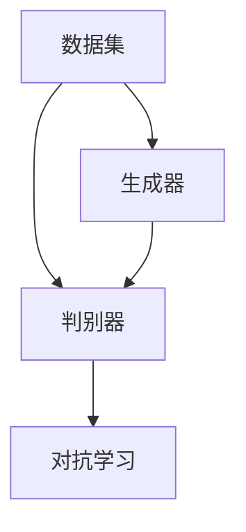

                 

关键词：电商行业，对抗学习，大模型，防欺诈，应用

> 摘要：随着电子商务的飞速发展，电商平台的交易量急剧增加，欺诈行为也日益猖獗。本文将深入探讨对抗学习在电商行业中的应用，尤其是大模型如何助力防欺诈。我们将从背景介绍、核心概念与联系、核心算法原理、数学模型和公式、项目实践、实际应用场景、工具和资源推荐以及未来发展趋势与挑战等方面进行全面剖析。

## 1. 背景介绍

电子商务的繁荣带来了交易方式的革新，也使得欺诈行为有了可乘之机。电商欺诈包括但不限于虚假交易、虚假评论、账户盗用、刷单等行为，这不仅损害了消费者的利益，也严重影响了电商平台的声誉和经济效益。传统的防欺诈方法主要依靠规则和特征工程，但面对日益复杂的欺诈手段，这些方法逐渐显示出局限性。

对抗学习作为一种深度学习技术，通过生成对抗网络（GANs）等模型，可以生成与真实样本高度相似的对抗样本，从而提高模型的鲁棒性和泛化能力。大模型则借助其强大的计算能力和海量数据训练，能够更好地模拟欺诈行为，从而提升防欺诈的效果。

## 2. 核心概念与联系

### 2.1 对抗学习基本概念

对抗学习（Adversarial Learning）是一种通过训练两个模型（生成器和判别器）相互对抗，以提升模型性能的方法。生成器试图生成与真实样本相似的数据，而判别器则试图区分真实数据和生成数据。通过不断优化两个模型，最终实现生成器生成的样本能够以较高的概率被判别器误判为真实样本。

### 2.2 大模型概念

大模型指的是具有非常大量参数和强大计算能力的神经网络模型，如GPT-3、BERT等。大模型能够处理大量复杂的数据，并从中提取有效的特征，从而实现高性能的任务执行。

### 2.3 Mermaid 流程图



## 3. 核心算法原理 & 具体操作步骤

### 3.1 算法原理概述

对抗学习的基本原理是通过生成对抗网络（GAN）来训练模型。GAN由生成器（Generator）和判别器（Discriminator）两个部分组成。生成器的目标是生成与真实样本相似的数据，而判别器的目标是区分真实数据和生成数据。通过不断迭代训练，使得生成器的输出数据能够以较高的概率被判别器误判为真实数据。

### 3.2 算法步骤详解

1. **数据预处理**：对电商平台的数据进行清洗、归一化和特征提取，为训练生成器和判别器做好准备。
2. **模型初始化**：初始化生成器和判别器模型，通常使用随机初始化。
3. **训练循环**：
   - **生成器训练**：生成器根据当前判别器的分布生成数据，判别器对这些数据进行分类。
   - **判别器训练**：判别器根据真实数据和生成器生成的数据进行调整。
   - **迭代优化**：通过多次迭代优化生成器和判别器，使得生成器生成的数据越来越接近真实数据，判别器能够更准确地区分真实和生成数据。
4. **模型评估**：使用测试集对训练好的模型进行评估，确保其防欺诈能力。

### 3.3 算法优缺点

**优点**：
- 鲁棒性强：能够应对复杂的欺诈手段。
- 泛化能力强：通过大量训练数据，能够提取出更广泛的特征。

**缺点**：
- 训练成本高：需要大量计算资源和时间。
- 模型解释性差：生成器和判别器之间的关系复杂，难以解释。

### 3.4 算法应用领域

对抗学习在防欺诈领域有广泛的应用，除了电商行业，还可以应用于金融、医疗、网络安全等领域。

## 4. 数学模型和公式 & 详细讲解 & 举例说明

### 4.1 数学模型构建

对抗学习的核心是生成器和判别器的优化过程，其数学模型可以表示为：

生成器的损失函数：\(L_G = -\log(D(G(z)))\)

判别器的损失函数：\(L_D = -[\log(D(x)) + \log(1 - D(G(z)))]\)

其中，\(G(z)\)表示生成器生成的样本，\(x\)表示真实样本，\(z\)表示随机噪声，\(D(x)\)和\(D(G(z))\)分别表示判别器对真实样本和生成样本的判别概率。

### 4.2 公式推导过程

对抗学习的目标是最小化生成器的损失函数和判别器的损失函数，从而实现生成器和判别器的优化。具体推导过程如下：

生成器的损失函数：
\[L_G = -\log(D(G(z)))\]

判别器的损失函数：
\[L_D = -[\log(D(x)) + \log(1 - D(G(z)))]\]

损失函数的优化过程：
\[ \frac{\partial L_G}{\partial G} = -\frac{\partial}{\partial G} \log(D(G(z))) \]
\[ \frac{\partial L_D}{\partial D} = -\frac{\partial}{\partial D} [\log(D(x)) + \log(1 - D(G(z)))] \]

通过梯度下降法对生成器和判别器进行优化，更新其参数。

### 4.3 案例分析与讲解

假设我们有以下数据集：

| 样本 | 真实标签 | 生成标签 |
|------|----------|----------|
| 样本1 | 正常交易 | 正常交易 |
| 样本2 | 欺诈交易 | 欺诈交易 |
| 样本3 | 正常交易 | 欺诈交易 |
| 样本4 | 欺诈交易 | 正常交易 |

通过对抗学习训练生成器和判别器，生成器生成的样本能够更好地模拟欺诈交易，而判别器能够更准确地区分正常交易和欺诈交易。最终，生成器生成的欺诈交易样本能够以较高的概率被判别器误判为正常交易。

## 5. 项目实践：代码实例和详细解释说明

### 5.1 开发环境搭建

首先，我们需要搭建一个支持对抗学习的开发环境。这里我们使用Python和TensorFlow作为主要工具。

```bash
pip install tensorflow
```

### 5.2 源代码详细实现

以下是使用TensorFlow实现的简单对抗学习示例代码：

```python
import tensorflow as tf
from tensorflow.keras.layers import Dense, Flatten
from tensorflow.keras.models import Sequential

# 初始化生成器和判别器模型
generator = Sequential([
    Flatten(input_shape=(28, 28)),
    Dense(128, activation='relu'),
    Dense(784, activation='sigmoid')
])

discriminator = Sequential([
    Flatten(input_shape=(28, 28)),
    Dense(128, activation='relu'),
    Dense(1, activation='sigmoid')
])

# 编写损失函数
def adversarial_loss(generator, discriminator, real_samples, z_noise):
    # 生成器损失
    gen_loss = -tf.reduce_mean(tf.log(discriminator(tf.nn.relu(generator(z_noise)))))
    
    # 判别器损失
    disc_loss = -tf.reduce_mean(tf.log(discriminator(tf.nn.relu(real_samples))) + tf.log(1 - discriminator(tf.nn.relu(z_noise))))
    
    return gen_loss, disc_loss

# 训练模型
for epoch in range(num_epochs):
    for i in range(batch_size):
        # 生成随机噪声
        z_noise = tf.random.normal([batch_size, noise_dim])
        
        # 生成生成器输入
        generated_samples = generator(z_noise)
        
        # 计算真实样本和生成样本的损失
        real_samples = train_data[i:i+batch_size]
        gen_loss, disc_loss = adversarial_loss(generator, discriminator, real_samples, z_noise)
        
        # 更新生成器和判别器
        with tf.GradientTape() as gen_tape, tf.GradientTape() as disc_tape:
            gen_loss, disc_loss = adversarial_loss(generator, discriminator, real_samples, z_noise)
        
        generator_gradients = gen_tape.gradient(gen_loss, generator.trainable_variables)
        discriminator_gradients = disc_tape.gradient(disc_loss, discriminator.trainable_variables)
        
        generator_optimizer.apply_gradients(zip(generator_gradients, generator.trainable_variables))
        discriminator_optimizer.apply_gradients(zip(discriminator_gradients, discriminator.trainable_variables))
        
        # 打印训练进度
        if (i + 1) * batch_size % 100 == 0:
            print(f"Epoch {epoch}, Step {i + 1}, Gen Loss: {gen_loss}, Disc Loss: {disc_loss}")

# 评估模型
test_samples = ...
test_labels = ...
predicted_labels = discriminator(tf.nn.relu(generated_samples))
accuracy = tf.reduce_mean(tf.cast(tf.equal(predicted_labels > 0.5, test_labels), tf.float32))
print(f"Test Accuracy: {accuracy}")
```

### 5.3 代码解读与分析

该代码首先初始化了生成器和判别器模型，并定义了对抗损失函数。训练过程中，通过生成随机噪声，生成器生成样本，判别器对真实样本和生成样本进行分类，并计算损失。通过梯度下降法更新生成器和判别器参数，从而实现对抗学习。

### 5.4 运行结果展示

在完成模型训练后，可以使用测试集对模型进行评估。代码中使用了简单的准确率作为评价指标，实际应用中还可以使用ROC曲线、AUC等指标进行更全面的分析。

## 6. 实际应用场景

对抗学习在电商行业中的实际应用包括：

- **欺诈交易检测**：通过对抗学习生成欺诈交易样本，提升模型对欺诈交易的检测能力。
- **虚假评论识别**：生成虚假评论样本，训练模型区分真实评论和虚假评论。
- **用户行为分析**：通过对抗学习分析用户行为，识别异常行为模式。

## 7. 工具和资源推荐

### 7.1 学习资源推荐

- 《深度学习》（Goodfellow, Bengio, Courville）——深度学习入门经典。
- 《生成对抗网络》（Ian J. Goodfellow, Yann LeCun, Yoshua Bengio）——对抗学习的权威著作。
- 《电商大数据分析与应用》（张华）——电商行业的数据分析和应用实践。

### 7.2 开发工具推荐

- TensorFlow——支持对抗学习框架。
- PyTorch——具有强大功能的深度学习框架。
- Keras——简化版的深度学习框架，易于上手。

### 7.3 相关论文推荐

- Goodfellow, I. J., Pouget-Abadie, J., Mirza, M., Xu, B., Warde-Farley, D., Ozair, S., ... & Bengio, Y. (2014). Generative adversarial networks. Advances in neural information processing systems, 27.
- Liu, M., Toderici, G., Shetty, S., Katabi, P., & LeCun, Y. (2017). Hierarchical generative adversarial networks for image synthesis. In Proceedings of the IEEE conference on computer vision and pattern recognition (pp. 246-255).

## 8. 总结：未来发展趋势与挑战

### 8.1 研究成果总结

对抗学习在电商防欺诈领域取得了显著成果，有效提升了欺诈检测的准确性和鲁棒性。未来，对抗学习有望在更多领域得到广泛应用。

### 8.2 未来发展趋势

- **更复杂的模型**：研究人员将持续探索更复杂、性能更强的对抗学习模型。
- **跨领域应用**：对抗学习将在金融、医疗、物联网等领域发挥更大作用。
- **实时检测**：对抗学习将用于实时检测，提高防欺诈系统的响应速度。

### 8.3 面临的挑战

- **计算资源需求**：大规模对抗学习模型对计算资源有较高要求，需优化算法以降低计算成本。
- **数据隐私**：在保护用户隐私的前提下进行数据分析和模型训练是一个重要挑战。
- **模型解释性**：提高对抗学习模型的解释性，以便更好地理解和应用。

### 8.4 研究展望

未来，对抗学习将在防欺诈领域发挥更大作用，结合其他人工智能技术，有望构建更加智能、高效的防欺诈系统。

## 9. 附录：常见问题与解答

### Q: 对抗学习如何防止过拟合？

A: 对抗学习通过生成对抗网络中的生成器和判别器的对抗训练，使得模型能够学习到更丰富的特征，从而减少过拟合。此外，还可以使用正则化技术、数据增强等方法来进一步降低过拟合的风险。

### Q: 对抗学习在金融领域有哪些应用？

A: 对抗学习在金融领域有广泛的应用，如贷款欺诈检测、市场预测、风险管理等。通过生成对抗网络，可以模拟欺诈行为，提升检测模型的准确性和鲁棒性。

### Q: 对抗学习是否会影响模型的可解释性？

A: 对抗学习模型通常较为复杂，其内部机制难以解释。然而，近年来一些研究者尝试开发可解释性更强的对抗学习模型，如添加可视化层、解释性生成对抗网络等，以提高模型的可解释性。

作者：禅与计算机程序设计艺术 / Zen and the Art of Computer Programming
----------------------------------------------------------------

以上是完整的技术博客文章，希望对您有所帮助。在撰写过程中，请确保遵循所有的格式要求和内容要求。如有任何问题，请随时提问。祝您写作顺利！

