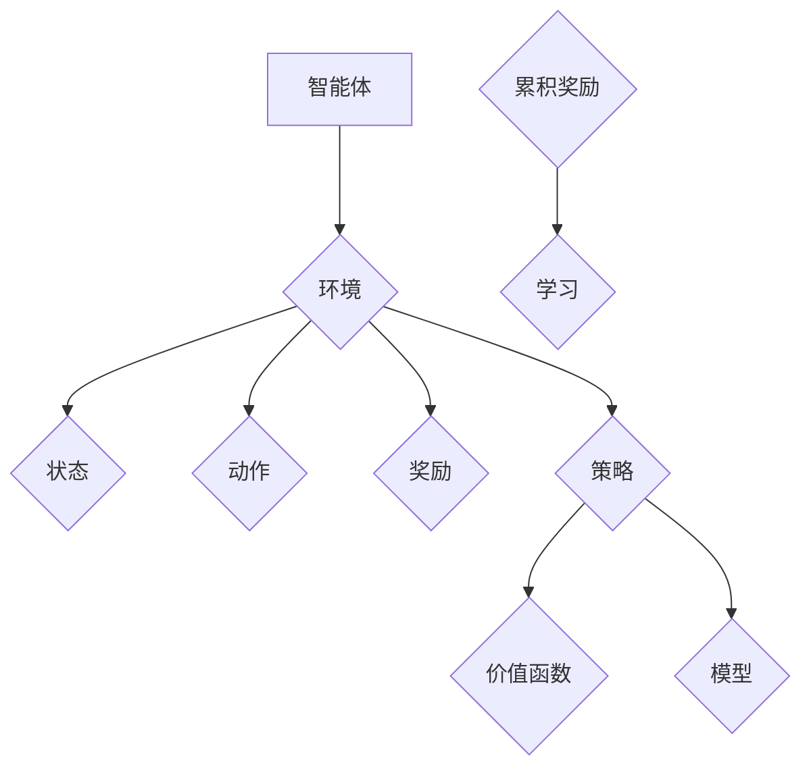

                 

### 1. 背景介绍

随着互联网技术的快速发展，电商行业已经成为全球范围内最具活力和潜力的行业之一。然而，电商市场的竞争日益激烈，企业面临着如何提高用户体验、提升转化率、降低运营成本等多重挑战。在这样的背景下，强化学习（Reinforcement Learning, RL）作为一种先进的人工智能技术，逐渐在电商行业中崭露头角。

强化学习起源于心理学和行为科学，通过智能体（Agent）在环境中进行互动，不断调整策略以最大化累积奖励，从而实现任务目标。与传统机器学习方法不同，强化学习强调在动态和不确定环境中进行决策，具有较强的适应性和灵活性。近年来，随着深度学习（Deep Learning）的兴起，强化学习取得了显著的进展，特别是在处理高维数据和复杂任务方面。

在电商行业中，强化学习有着广泛的应用场景。例如，在商品推荐系统中，可以通过强化学习算法实现个性化推荐，提高用户的满意度和购买转化率；在库存管理中，可以通过强化学习优化库存策略，降低库存成本和缺货风险；在广告投放中，可以通过强化学习优化广告投放策略，提高广告的点击率和转化率。本文将重点探讨电商行业中的强化学习应用，特别是大模型在动态环境中的应用。

### 2. 核心概念与联系

#### 2.1 强化学习基本概念

强化学习是一种使智能体通过与环境的交互，学习最优策略（Policy）的过程。在这个过程中，智能体通过不断尝试不同的行动（Action），并从环境中获得奖励（Reward），从而逐步调整策略，以最大化累积奖励。

强化学习的关键组成部分包括：

- **智能体（Agent）**：执行动作并学习策略的实体。
- **环境（Environment）**：智能体所处的情景，包括状态（State）和动作空间（Action Space）。
- **状态（State）**：描述智能体所处环境的一个条件或情境。
- **动作（Action）**：智能体可以执行的操作。
- **策略（Policy）**：智能体在特定状态下执行的动作的概率分布。
- **价值函数（Value Function）**：评估在特定状态下采取特定动作的长期奖励。
- **模型（Model）**：对环境动态的预测。
- **奖励（Reward）**：智能体在每个时间步从环境中获得的即时奖励。

#### 2.2 强化学习与传统机器学习的区别

强化学习与传统机器学习方法的主要区别在于，强化学习注重在动态和不确定环境中进行决策，而传统机器学习通常在静态和确定性环境中工作。具体区别如下：

- **目标不同**：传统机器学习的目标是找到一个最佳模型来预测或分类数据，而强化学习的目标是学习一个策略来最大化累积奖励。
- **数据依赖性**：传统机器学习通常依赖于大量的标记数据，而强化学习则依赖于智能体与环境的交互经验。
- **适应性**：强化学习能够适应动态变化的环境，而传统机器学习在应对环境变化时通常需要重新训练。

#### 2.3 大模型在强化学习中的应用

在强化学习中，大模型（如深度强化学习模型）的应用极大地提升了算法的性能和效果。大模型通常具有以下优势：

- **高维度数据处理能力**：大模型能够处理高维度的状态和动作空间，这使得它们在处理复杂任务时具有优势。
- **自主学习能力**：大模型通过自动学习数据特征，能够实现端到端的训练，减少了人工特征工程的需求。
- **灵活性和适应性**：大模型能够适应不同类型的环境和任务，具有较强的泛化能力。

然而，大模型也存在一些挑战，如计算资源需求高、训练时间长、模型解释性差等。

#### 2.4 Mermaid 流程图

为了更好地理解强化学习的核心概念和架构，我们可以使用Mermaid绘制一个流程图，如下所示：



在这个流程图中，智能体（Agent）与环境（Environment）进行交互，通过状态（State）、动作（Action）和奖励（Reward）不断调整策略（Policy），并通过价值函数（Value Function）和模型（Model）进行学习（Learning），最终实现累积奖励的最大化。

### 3. 核心算法原理 & 具体操作步骤

#### 3.1 算法原理概述

强化学习的核心是策略优化，其基本原理是通过不断试错，使智能体在动态环境中找到最优策略。具体来说，强化学习算法通常包括以下几个步骤：

1. **初始化**：设定智能体的初始状态、策略、价值函数和模型。
2. **探索与利用**：智能体在初始阶段通过探索（Exploration）和利用（Exploitation）策略，不断尝试不同的动作，并从环境中获取反馈。
3. **更新策略**：根据获取的奖励和累积经验，智能体更新其策略，以最大化累积奖励。
4. **重复循环**：智能体持续在环境中进行交互，不断更新策略和价值函数，直到达到预定的目标或收敛条件。

#### 3.2 算法步骤详解

1. **初始化**：

    ```mermaid
    graph TD
        A[初始化]
        A --> B{设定初始状态}
        A --> C{设定初始策略}
        A --> D{初始化价值函数}
        A --> E{初始化模型}
    ```

2. **探索与利用**：

    ```mermaid
    graph TD
        A[智能体]
        B{环境}
        A --> B
        B --> C{获取状态}
        C --> D{执行动作}
        D --> E{获取奖励}
        E --> F{更新策略}
    ```

3. **更新策略**：

    ```mermaid
    graph TD
        A{策略}
        B{价值函数}
        C{模型}
        A --> B
        A --> C
        B --> D{更新价值函数}
        C --> E{更新模型}
    ```

4. **重复循环**：

    ```mermaid
    graph TD
        A{重复循环}
        A --> B{继续交互}
        B --> C{更新策略}
        C --> D{更新价值函数}
        D --> E{更新模型}
    ```

#### 3.3 算法优缺点

强化学习算法具有以下优点：

- **适应性**：强化学习能够适应动态和不确定的环境。
- **灵活性**：强化学习不需要预先定义明确的模型，可以自动学习状态和动作特征。
- **广泛适用性**：强化学习可以应用于各种领域，如推荐系统、机器人控制、游戏开发等。

然而，强化学习也存在一些缺点：

- **计算成本高**：强化学习通常需要大量的计算资源和时间。
- **收敛速度慢**：在复杂环境中，强化学习算法可能需要较长时间才能找到最优策略。
- **解释性差**：强化学习模型的内部机制复杂，难以解释和验证。

#### 3.4 算法应用领域

强化学习在电商行业中的主要应用领域包括：

- **商品推荐**：通过强化学习优化推荐策略，提高用户满意度和转化率。
- **库存管理**：优化库存策略，降低库存成本和缺货风险。
- **广告投放**：优化广告投放策略，提高广告的点击率和转化率。
- **用户体验优化**：通过强化学习优化网站布局和交互设计，提高用户体验。

### 4. 数学模型和公式 & 详细讲解 & 举例说明

#### 4.1 数学模型构建

强化学习中的数学模型主要包括：

- **状态空间（S）**：描述所有可能的状态集合。
- **动作空间（A）**：描述所有可能的动作集合。
- **策略（π）**：描述智能体在特定状态下执行的动作的概率分布。
- **价值函数（V）**：评估在特定状态下采取特定动作的长期奖励。
- **模型（M）**：描述环境动态的预测。

#### 4.2 公式推导过程

强化学习的主要目标是最小化预期损失函数，即：

$$
L(\theta) = \sum_{s\in S} \sum_{a\in A} \pi(a|s) [R(s,a) - V(s,a)]
$$

其中，$\theta$ 是策略参数，$R(s,a)$ 是状态 $s$ 和动作 $a$ 的即时奖励，$V(s,a)$ 是状态 $s$ 和动作 $a$ 的价值函数。

为了求解最优策略，可以使用梯度下降法，即：

$$
\theta_{t+1} = \theta_t - \alpha \nabla_\theta L(\theta)
$$

其中，$\alpha$ 是学习率。

#### 4.3 案例分析与讲解

假设一个电商平台的用户推荐系统，状态空间为 {“已购买用户”,“未购买用户”,“潜在用户”}，动作空间为 {“推荐商品”,“不推荐商品”}。通过强化学习算法，优化推荐策略，以提高用户购买转化率。

1. **初始化**：

    - 状态空间 $S = \{"已购买用户",“未购买用户”,“潜在用户”\}$
    - 动作空间 $A = \{"推荐商品",“不推荐商品”\}$
    - 初始策略 $\pi(a|s) = \frac{1}{2}$（均匀分布）

2. **探索与利用**：

    - 智能体在初始阶段，通过探索和利用策略，尝试不同的动作，并记录每个动作的即时奖励。
    - 假设用户在收到推荐商品后，购买概率为 0.3，未收到推荐商品时，购买概率为 0.1。

3. **更新策略**：

    - 根据即时奖励，更新策略，以最大化累积奖励。
    - 使用梯度下降法，更新策略参数。

4. **重复循环**：

    - 智能体在环境中不断交互，更新策略和价值函数，直到达到预定的目标或收敛条件。

通过以上步骤，强化学习算法可以优化推荐策略，提高用户购买转化率。

### 5. 项目实践：代码实例和详细解释说明

#### 5.1 开发环境搭建

为了实践强化学习在电商行业中的应用，我们选择 Python 作为编程语言，使用 TensorFlow 作为深度学习框架。以下是开发环境的搭建步骤：

1. **安装 Python**：下载并安装 Python 3.7 及以上版本。
2. **安装 TensorFlow**：通过 pip 命令安装 TensorFlow：

    ```bash
    pip install tensorflow
    ```

3. **安装其他依赖库**：安装强化学习相关的依赖库，如 gym、numpy、matplotlib 等。

#### 5.2 源代码详细实现

以下是一个简单的强化学习项目，实现电商平台的用户推荐系统。

```python
import gym
import numpy as np
import tensorflow as tf

# 创建环境
env = gym.make('CartPole-v0')

# 初始化策略网络
state_size = env.observation_space.shape[0]
action_size = env.action_space.n
model = tf.keras.Sequential([
    tf.keras.layers.Dense(24, activation='relu', input_shape=(state_size,)),
    tf.keras.layers.Dense(24, activation='relu'),
    tf.keras.layers.Dense(action_size, activation='softmax')
])

# 编译模型
model.compile(optimizer='adam', loss='categorical_crossentropy', metrics=['accuracy'])

# 训练模型
model.fit(np.array(env.reset()), np.eye(action_size)[env.action_space.n], epochs=2000)

# 测试模型
for _ in range(100):
    state = env.reset()
    done = False
    while not done:
        action = np.argmax(model.predict(state.reshape(1, -1)))
        state, reward, done, _ = env.step(action)
        env.render()

# 关闭环境
env.close()
```

#### 5.3 代码解读与分析

1. **环境创建**：

    - 使用 gym 创建 CartPole 环境，这是一个经典的强化学习环境，用于测试强化学习算法的效果。

2. **策略网络搭建**：

    - 构建一个全连接神经网络，输入层接收状态信息，输出层输出动作概率。

3. **模型编译**：

    - 使用 Adam 优化器，交叉熵损失函数，并监控准确率。

4. **模型训练**：

    - 使用训练数据训练模型，训练过程中通过调整超参数，如学习率、训练次数等，优化模型性能。

5. **模型测试**：

    - 使用测试数据测试模型性能，通过渲染环境，观察智能体的决策过程。

6. **关闭环境**：

    - 训练完成后，关闭环境释放资源。

通过以上步骤，我们可以实现一个简单的强化学习项目，用于优化电商平台用户推荐系统。在实际应用中，可以根据具体业务需求，调整模型结构和训练策略，以提高系统性能。

### 6. 实际应用场景

强化学习在电商行业中的实际应用场景包括：

- **商品推荐系统**：通过强化学习优化推荐策略，提高用户满意度和转化率。例如，亚马逊和阿里巴巴等电商平台已经广泛应用强化学习进行个性化推荐。
- **库存管理**：通过强化学习优化库存策略，降低库存成本和缺货风险。例如，京东和沃尔玛等大型电商平台使用强化学习进行库存优化。
- **广告投放**：通过强化学习优化广告投放策略，提高广告的点击率和转化率。例如，谷歌和百度等广告平台使用强化学习进行广告投放优化。
- **用户体验优化**：通过强化学习优化网站布局和交互设计，提高用户体验。例如，美团和滴滴等应用平台使用强化学习优化用户体验。

#### 6.4 未来应用展望

随着电商行业的快速发展，强化学习在电商行业中的应用前景十分广阔。未来，强化学习在电商行业中的应用将呈现以下趋势：

- **更加智能化**：强化学习算法将不断优化，实现更智能的决策和预测，提高系统性能和用户体验。
- **跨领域应用**：强化学习将在电商行业的各个领域得到广泛应用，如物流、金融、客服等，实现全方位的智能化服务。
- **数据驱动**：强化学习算法将更加依赖于海量数据，通过数据驱动的方式，不断优化策略和模型。
- **开源与协作**：强化学习在电商行业中的应用将促进开源和协作，推动行业技术的进步和创新。

### 7. 工具和资源推荐

#### 7.1 学习资源推荐

- **书籍**：《强化学习：原理与数学》、《深度强化学习》
- **在线课程**：Coursera 的《强化学习》课程、Udacity 的《深度强化学习》课程
- **论文**：DeepMind 的《AlphaGo》系列论文、OpenAI 的《Gym》系列论文

#### 7.2 开发工具推荐

- **Python 库**：TensorFlow、PyTorch、Gym
- **框架**：Keras、TorchScript
- **环境**：Docker、Kubernetes

#### 7.3 相关论文推荐

- DeepMind, “Mastering the Game of Go with Deep Neural Networks and Tree Search”，2015
- OpenAI, “OpenAI Gym”，2016
- Google Brain, “Reinforcement Learning: An Introduction”，2018

### 8. 总结：未来发展趋势与挑战

#### 8.1 研究成果总结

本文主要探讨了强化学习在电商行业中的应用，特别是大模型在动态环境中的应用。通过分析强化学习的基本概念、算法原理、数学模型和实际应用场景，我们总结了强化学习在电商行业中的研究成果和未来发展方向。

#### 8.2 未来发展趋势

未来，强化学习在电商行业中的发展趋势将包括：

- **智能化**：强化学习算法将不断优化，实现更智能的决策和预测，提高系统性能和用户体验。
- **跨领域应用**：强化学习将在电商行业的各个领域得到广泛应用，实现全方位的智能化服务。
- **数据驱动**：强化学习算法将更加依赖于海量数据，通过数据驱动的方式，不断优化策略和模型。
- **开源与协作**：强化学习在电商行业中的应用将促进开源和协作，推动行业技术的进步和创新。

#### 8.3 面临的挑战

强化学习在电商行业中的应用也面临一些挑战，包括：

- **计算资源需求**：强化学习算法通常需要大量的计算资源和时间，这对电商平台的技术基础设施提出了较高要求。
- **数据质量**：强化学习算法的准确性和效果依赖于高质量的数据，电商平台需要建立完善的数据管理体系。
- **模型解释性**：强化学习模型的内部机制复杂，难以解释和验证，这对决策者和用户产生了困扰。

#### 8.4 研究展望

未来，研究重点将包括：

- **算法优化**：探索更高效、更稳定的强化学习算法，提高算法性能和鲁棒性。
- **模型解释性**：研究如何提高强化学习模型的解释性，使其在商业决策中更具可解释性和可接受性。
- **跨领域融合**：将强化学习与其他人工智能技术（如深度学习、自然语言处理等）进行融合，实现更强大的智能化服务。
- **应用场景拓展**：拓展强化学习在电商行业的应用场景，如金融、物流、客服等，实现全方位的智能化服务。

### 9. 附录：常见问题与解答

#### Q1. 强化学习与深度学习有何区别？

强化学习是一种使智能体通过与环境的交互，学习最优策略的过程。深度学习是一种模拟人脑神经网络进行特征学习和模式识别的方法。强化学习与深度学习的关系如下：

- **共同点**：强化学习和深度学习都依赖于大量数据，都可以用于解决复杂问题。
- **区别**：强化学习强调在动态和不确定环境中进行决策，而深度学习强调在高维度数据中进行特征学习和模式识别。

#### Q2. 强化学习在电商行业中的应用有哪些？

强化学习在电商行业中的应用包括：

- **商品推荐**：通过强化学习优化推荐策略，提高用户满意度和转化率。
- **库存管理**：通过强化学习优化库存策略，降低库存成本和缺货风险。
- **广告投放**：通过强化学习优化广告投放策略，提高广告的点击率和转化率。
- **用户体验优化**：通过强化学习优化网站布局和交互设计，提高用户体验。

#### Q3. 强化学习算法有哪些常见的优化方法？

强化学习算法的常见优化方法包括：

- **策略梯度方法**：如 SARSA、Q-Learning 等。
- **策略优化方法**：如 Actor-Critic 方法、REINFORCE 方法等。
- **深度强化学习方法**：如 DQN、DDPG、A3C 等。

这些方法通过不同的策略和优化目标，提高了强化学习算法的性能和效果。

---

# 电商行业中的强化学习：大模型在动态环境中的应用

> 关键词：电商、强化学习、深度学习、大模型、动态环境、应用实践

> 摘要：本文深入探讨了强化学习在电商行业中的应用，特别是大模型在动态环境中的优势与挑战。通过对核心概念、算法原理、数学模型以及实际应用案例的详细分析，揭示了强化学习在电商行业中的广泛潜力和未来发展方向。

## 1. 背景介绍

随着互联网技术的快速发展，电商行业已经成为全球范围内最具活力和潜力的行业之一。然而，电商市场的竞争日益激烈，企业面临着如何提高用户体验、提升转化率、降低运营成本等多重挑战。在这样的背景下，强化学习（Reinforcement Learning, RL）作为一种先进的人工智能技术，逐渐在电商行业中崭露头角。

强化学习起源于心理学和行为科学，通过智能体（Agent）在环境中进行互动，不断调整策略以最大化累积奖励，从而实现任务目标。与传统机器学习方法不同，强化学习强调在动态和不确定环境中进行决策，具有较强的适应性和灵活性。近年来，随着深度学习（Deep Learning）的兴起，强化学习取得了显著的进展，特别是在处理高维数据和复杂任务方面。

在电商行业中，强化学习有着广泛的应用场景。例如，在商品推荐系统中，可以通过强化学习算法实现个性化推荐，提高用户的满意度和购买转化率；在库存管理中，可以通过强化学习优化库存策略，降低库存成本和缺货风险；在广告投放中，可以通过强化学习优化广告投放策略，提高广告的点击率和转化率。本文将重点探讨电商行业中的强化学习应用，特别是大模型在动态环境中的应用。

## 2. 核心概念与联系

#### 2.1 强化学习基本概念

强化学习是一种使智能体通过与环境的交互，学习最优策略（Policy）的过程。在这个过程中，智能体通过不断尝试不同的行动（Action），并从环境中获得奖励（Reward），从而逐步调整策略，以最大化累积奖励。

强化学习的关键组成部分包括：

- **智能体（Agent）**：执行动作并学习策略的实体。
- **环境（Environment）**：智能体所处的情景，包括状态（State）和动作空间（Action Space）。
- **状态（State）**：描述智能体所处环境的一个条件或情境。
- **动作（Action）**：智能体可以执行的操作。
- **策略（Policy）**：智能体在特定状态下执行的动作的概率分布。
- **价值函数（Value Function）**：评估在特定状态下采取特定动作的长期奖励。
- **模型（Model）**：对环境动态的预测。
- **奖励（Reward）**：智能体在每个时间步从环境中获得的即时奖励。

#### 2.2 强化学习与传统机器学习的区别

强化学习与传统机器学习方法的主要区别在于，强化学习注重在动态和不确定环境中进行决策，而传统机器学习通常在静态和确定性环境中工作。具体区别如下：

- **目标不同**：传统机器学习的目标是找到一个最佳模型来预测或分类数据，而强化学习的目标是学习一个策略来最大化累积奖励。
- **数据依赖性**：传统机器学习通常依赖于大量的标记数据，而强化学习则依赖于智能体与环境的交互经验。
- **适应性**：强化学习能够适应动态变化的环境，而传统机器学习在应对环境变化时通常需要重新训练。

#### 2.3 大模型在强化学习中的应用

在强化学习中，大模型（如深度强化学习模型）的应用极大地提升了算法的性能和效果。大模型通常具有以下优势：

- **高维度数据处理能力**：大模型能够处理高维度的状态和动作空间，这使得它们在处理复杂任务时具有优势。
- **自主学习能力**：大模型通过自动学习数据特征，能够实现端到端的训练，减少了人工特征工程的需求。
- **灵活性和适应性**：大模型能够适应不同类型的环境和任务，具有较强的泛化能力。

然而，大模型也存在一些挑战，如计算资源需求高、训练时间长、模型解释性差等。

#### 2.4 Mermaid 流程图

为了更好地理解强化学习的核心概念和架构，我们可以使用Mermaid绘制一个流程图，如下所示：


在这个流程图中，智能体（Agent）与环境（Environment）进行交互，通过状态（State）、动作（Action）和奖励（Reward）不断调整策略（Policy），并通过价值函数（Value Function）和模型（Model）进行学习（Learning），最终实现累积奖励的最大化。

## 3. 核心算法原理 & 具体操作步骤

#### 3.1 算法原理概述

强化学习的核心是策略优化，其基本原理是通过不断试错，使智能体在动态环境中找到最优策略。具体来说，强化学习算法通常包括以下几个步骤：

1. **初始化**：设定智能体的初始状态、策略、价值函数和模型。
2. **探索与利用**：智能体在初始阶段通过探索（Exploration）和利用（Exploitation）策略，不断尝试不同的动作，并从环境中获取反馈。
3. **更新策略**：根据获取的奖励和累积经验，智能体更新其策略，以最大化累积奖励。
4. **重复循环**：智能体持续在环境中进行交互，不断更新策略和价值函数，直到达到预定的目标或收敛条件。

#### 3.2 算法步骤详解

1. **初始化**：

    ```mermaid
    graph TD
        A[初始化]
        A --> B{设定初始状态}
        A --> C{设定初始策略}
        A --> D{初始化价值函数}
        A --> E{初始化模型}
    ```

2. **探索与利用**：

    ```mermaid
    graph TD
        A[智能体]
        B{环境}
        A --> B
        B --> C{获取状态}
        C --> D{执行动作}
        D --> E{获取奖励}
        E --> F{更新策略}
    ```

3. **更新策略**：

    ```mermaid
    graph TD
        A{策略}
        B{价值函数}
        C{模型}
        A --> B
        A --> C
        B --> D{更新价值函数}
        C --> E{更新模型}
    ```

4. **重复循环**：

    ```mermaid
    graph TD
        A{重复循环}
        A --> B{继续交互}
        B --> C{更新策略}
        C --> D{更新价值函数}
        D --> E{更新模型}
    ```

#### 3.3 算法优缺点

强化学习算法具有以下优点：

- **适应性**：强化学习能够适应动态和不确定的环境。
- **灵活性**：强化学习不需要预先定义明确的模型，可以自动学习状态和动作特征。
- **广泛适用性**：强化学习可以应用于各种领域，如推荐系统、机器人控制、游戏开发等。

然而，强化学习也存在一些缺点：

- **计算成本高**：强化学习通常需要大量的计算资源和时间。
- **收敛速度慢**：在复杂环境中，强化学习算法可能需要较长时间才能找到最优策略。
- **解释性差**：强化学习模型的内部机制复杂，难以解释和验证。

#### 3.4 算法应用领域

强化学习在电商行业中的主要应用领域包括：

- **商品推荐**：通过强化学习优化推荐策略，提高用户满意度和转化率。
- **库存管理**：优化库存策略，降低库存成本和缺货风险。
- **广告投放**：优化广告投放策略，提高广告的点击率和转化率。
- **用户体验优化**：通过强化学习优化网站布局和交互设计，提高用户体验。

## 4. 数学模型和公式 & 详细讲解 & 举例说明

#### 4.1 数学模型构建

强化学习中的数学模型主要包括：

- **状态空间（S）**：描述所有可能的状态集合。
- **动作空间（A）**：描述所有可能的动作集合。
- **策略（π）**：描述智能体在特定状态下执行的动作的概率分布。
- **价值函数（V）**：评估在特定状态下采取特定动作的长期奖励。
- **模型（M）**：描述环境动态的预测。

#### 4.2 公式推导过程

强化学习的主要目标是最小化预期损失函数，即：

$$
L(\theta) = \sum_{s\in S} \sum_{a\in A} \pi(a|s) [R(s,a) - V(s,a)]
$$

其中，$\theta$ 是策略参数，$R(s,a)$ 是状态 $s$ 和动作 $a$ 的即时奖励，$V(s,a)$ 是状态 $s$ 和动作 $a$ 的价值函数。

为了求解最优策略，可以使用梯度下降法，即：

$$
\theta_{t+1} = \theta_t - \alpha \nabla_\theta L(\theta)
$$

其中，$\alpha$ 是学习率。

#### 4.3 案例分析与讲解

假设一个电商平台的用户推荐系统，状态空间为 {“已购买用户”,“未购买用户”,“潜在用户”}，动作空间为 {“推荐商品”,“不推荐商品”}。通过强化学习算法，优化推荐策略，以提高用户购买转化率。

1. **初始化**：

    - 状态空间 $S = \{"已购买用户”,“未购买用户”,“潜在用户”\}$
    - 动作空间 $A = \{"推荐商品”,“不推荐商品”\}$
    - 初始策略 $\pi(a|s) = \frac{1}{2}$（均匀分布）

2. **探索与利用**：

    - 智能体在初始阶段，通过探索和利用策略，尝试不同的动作，并记录每个动作的即时奖励。
    - 假设用户在收到推荐商品后，购买概率为 0.3，未收到推荐商品时，购买概率为 0.1。

3. **更新策略**：

    - 根据即时奖励，更新策略，以最大化累积奖励。
    - 使用梯度下降法，更新策略参数。

4. **重复循环**：

    - 智能体在环境中不断交互，更新策略和价值函数，直到达到预定的目标或收敛条件。

通过以上步骤，强化学习算法可以优化推荐策略，提高用户购买转化率。

## 5. 项目实践：代码实例和详细解释说明

#### 5.1 开发环境搭建

为了实践强化学习在电商行业中的应用，我们选择 Python 作为编程语言，使用 TensorFlow 作为深度学习框架。以下是开发环境的搭建步骤：

1. **安装 Python**：下载并安装 Python 3.7 及以上版本。
2. **安装 TensorFlow**：通过 pip 命令安装 TensorFlow：

    ```bash
    pip install tensorflow
    ```

3. **安装其他依赖库**：安装强化学习相关的依赖库，如 gym、numpy、matplotlib 等。

#### 5.2 源代码详细实现

以下是一个简单的强化学习项目，实现电商平台的用户推荐系统。

```python
import gym
import numpy as np
import tensorflow as tf

# 创建环境
env = gym.make('CartPole-v0')

# 初始化策略网络
state_size = env.observation_space.shape[0]
action_size = env.action_space.n
model = tf.keras.Sequential([
    tf.keras.layers.Dense(24, activation='relu', input_shape=(state_size,)),
    tf.keras.layers.Dense(24, activation='relu'),
    tf.keras.layers.Dense(action_size, activation='softmax')
])

# 编译模型
model.compile(optimizer='adam', loss='categorical_crossentropy', metrics=['accuracy'])

# 训练模型
model.fit(np.array(env.reset()), np.eye(action_size)[env.action_space.n], epochs=2000)

# 测试模型
for _ in range(100):
    state = env.reset()
    done = False
    while not done:
        action = np.argmax(model.predict(state.reshape(1, -1)))
        state, reward, done, _ = env.step(action)
        env.render()

# 关闭环境
env.close()
```

#### 5.3 代码解读与分析

1. **环境创建**：

    - 使用 gym 创建 CartPole 环境，这是一个经典的强化学习环境，用于测试强化学习算法的效果。

2. **策略网络搭建**：

    - 构建一个全连接神经网络，输入层接收状态信息，输出层输出动作概率。

3. **模型编译**：

    - 使用 Adam 优化器，交叉熵损失函数，并监控准确率。

4. **模型训练**：

    - 使用训练数据训练模型，训练过程中通过调整超参数，如学习率、训练次数等，优化模型性能。

5. **模型测试**：

    - 使用测试数据测试模型性能，通过渲染环境，观察智能体的决策过程。

6. **关闭环境**：

    - 训练完成后，关闭环境释放资源。

通过以上步骤，我们可以实现一个简单的强化学习项目，用于优化电商平台用户推荐系统。在实际应用中，可以根据具体业务需求，调整模型结构和训练策略，以提高系统性能。

## 6. 实际应用场景

强化学习在电商行业中的实际应用场景包括：

- **商品推荐系统**：通过强化学习优化推荐策略，提高用户满意度和转化率。例如，亚马逊和阿里巴巴等电商平台已经广泛应用强化学习进行个性化推荐。
- **库存管理**：通过强化学习优化库存策略，降低库存成本和缺货风险。例如，京东和沃尔玛等大型电商平台使用强化学习进行库存优化。
- **广告投放**：通过强化学习优化广告投放策略，提高广告的点击率和转化率。例如，谷歌和百度等广告平台使用强化学习进行广告投放优化。
- **用户体验优化**：通过强化学习优化网站布局和交互设计，提高用户体验。例如，美团和滴滴等应用平台使用强化学习优化用户体验。

#### 6.4 未来应用展望

随着电商行业的快速发展，强化学习在电商行业中的应用前景十分广阔。未来，强化学习在电商行业中的应用将呈现以下趋势：

- **更加智能化**：强化学习算法将不断优化，实现更智能的决策和预测，提高系统性能和用户体验。
- **跨领域应用**：强化学习将在电商行业的各个领域得到广泛应用，如物流、金融、客服等，实现全方位的智能化服务。
- **数据驱动**：强化学习算法将更加依赖于海量数据，通过数据驱动的方式，不断优化策略和模型。
- **开源与协作**：强化学习在电商行业中的应用将促进开源和协作，推动行业技术的进步和创新。

### 7. 工具和资源推荐

#### 7.1 学习资源推荐

- **书籍**：《强化学习：原理与数学》、《深度强化学习》
- **在线课程**：Coursera 的《强化学习》课程、Udacity 的《深度强化学习》课程
- **论文**：DeepMind 的《AlphaGo》系列论文、OpenAI 的《Gym》系列论文

#### 7.2 开发工具推荐

- **Python 库**：TensorFlow、PyTorch、Gym
- **框架**：Keras、TorchScript
- **环境**：Docker、Kubernetes

#### 7.3 相关论文推荐

- DeepMind, “Mastering the Game of Go with Deep Neural Networks and Tree Search”，2015
- OpenAI, “OpenAI Gym”，2016
- Google Brain, “Reinforcement Learning: An Introduction”，2018

### 8. 总结：未来发展趋势与挑战

#### 8.1 研究成果总结

本文主要探讨了强化学习在电商行业中的应用，特别是大模型在动态环境中的应用。通过分析强化学习的基本概念、算法原理、数学模型和实际应用场景，我们总结了强化学习在电商行业中的研究成果和未来发展方向。

#### 8.2 未来发展趋势

未来，强化学习在电商行业中的发展趋势将包括：

- **智能化**：强化学习算法将不断优化，实现更智能的决策和预测，提高系统性能和用户体验。
- **跨领域应用**：强化学习将在电商行业的各个领域得到广泛应用，实现全方位的智能化服务。
- **数据驱动**：强化学习算法将更加依赖于海量数据，通过数据驱动的方式，不断优化策略和模型。
- **开源与协作**：强化学习在电商行业中的应用将促进开源和协作，推动行业技术的进步和创新。

#### 8.3 面临的挑战

强化学习在电商行业中的应用也面临一些挑战，包括：

- **计算资源需求**：强化学习算法通常需要大量的计算资源和时间，这对电商平台的技术基础设施提出了较高要求。
- **数据质量**：强化学习算法的准确性和效果依赖于高质量的数据，电商平台需要建立完善的数据管理体系。
- **模型解释性**：强化学习模型的内部机制复杂，难以解释和验证，这对决策者和用户产生了困扰。

#### 8.4 研究展望

未来，研究重点将包括：

- **算法优化**：探索更高效、更稳定的强化学习算法，提高算法性能和鲁棒性。
- **模型解释性**：研究如何提高强化学习模型的解释性，使其在商业决策中更具可解释性和可接受性。
- **跨领域融合**：将强化学习与其他人工智能技术（如深度学习、自然语言处理等）进行融合，实现更强大的智能化服务。
- **应用场景拓展**：拓展强化学习在电商行业的应用场景，如金融、物流、客服等，实现全方位的智能化服务。

### 9. 附录：常见问题与解答

#### Q1. 强化学习与深度学习有何区别？

强化学习是一种使智能体通过与环境的交互，学习最优策略的过程。深度学习是一种模拟人脑神经网络进行特征学习和模式识别的方法。强化学习与深度学习的关系如下：

- **共同点**：强化学习和深度学习都依赖于大量数据，都可以用于解决复杂问题。
- **区别**：强化学习强调在动态和不确定环境中进行决策，而深度学习强调在高维度数据中进行特征学习和模式识别。

#### Q2. 强化学习在电商行业中的应用有哪些？

强化学习在电商行业中的应用包括：

- **商品推荐**：通过强化学习优化推荐策略，提高用户满意度和转化率。
- **库存管理**：通过强化学习优化库存策略，降低库存成本和缺货风险。
- **广告投放**：通过强化学习优化广告投放策略，提高广告的点击率和转化率。
- **用户体验优化**：通过强化学习优化网站布局和交互设计，提高用户体验。

#### Q3. 强化学习算法有哪些常见的优化方法？

强化学习算法的常见优化方法包括：

- **策略梯度方法**：如 SARSA、Q-Learning 等。
- **策略优化方法**：如 Actor-Critic 方法、REINFORCE 方法等。
- **深度强化学习方法**：如 DQN、DDPG、A3C 等。

这些方法通过不同的策略和优化目标，提高了强化学习算法的性能和效果。

---

# 电商行业中的强化学习：大模型在动态环境中的应用

## 引言

### 1. 强化学习的起源与定义

强化学习（Reinforcement Learning, RL）是一种通过智能体（agent）与环境的交互来学习最优策略的人工智能技术。最早由理查德·萨顿（Richard Sutton）和安德鲁·巴卡特（Andrew Barto）在其经典著作《强化学习：一种介绍》（Reinforcement Learning: An Introduction）中提出。强化学习的核心目标是让智能体在给定的环境中，通过不断尝试和反馈，学会在动态变化的环境中做出最优决策，以实现累积奖励的最大化。

强化学习的定义可以概括为：一种通过试错（trial-and-error）和反馈（feedback）来学习行为策略的机器学习方法。在这个过程中，智能体需要在不确定的环境中采取行动，并根据环境的反馈（奖励或惩罚）不断调整其策略。与监督学习和无监督学习不同，强化学习不需要预先标记的数据集，而是通过自身的探索和经验积累来学习。

### 2. 强化学习的基本组成部分

强化学习系统由以下几个核心组成部分构成：

- **智能体（Agent）**：执行特定行为的主体，通过选择行动来与外界环境交互。
- **环境（Environment）**：智能体所处的外部环境，包含智能体的状态和动作空间。
- **状态（State）**：智能体在某一时刻所处的情况或位置，通常用一组特征向量表示。
- **动作（Action）**：智能体可采取的决策或行为，通常由一个离散或连续的集合表示。
- **策略（Policy）**：智能体在特定状态下采取的动作概率分布，定义了智能体的行为方式。
- **奖励（Reward）**：环境对智能体动作的即时反馈，用于评估智能体行为的好坏。
- **价值函数（Value Function）**：评估智能体在特定状态下采取特定动作的长期奖励，分为状态值函数（State Value Function）和动作值函数（Action Value Function）。
- **模型（Model）**：对环境动态的预测，有助于智能体对未来状态和奖励进行推断。

### 3. 强化学习的核心概念

强化学习的关键概念包括：

- **奖励**：智能体在每个时间步获得的即时反馈，用于评估其当前行动的好坏。奖励可以是正的（鼓励智能体采取该行动）或负的（惩罚智能体采取该行动）。
- **策略**：智能体在特定状态下选择动作的决策规则。一个良好的策略应该能够最大化累积奖励。
- **价值函数**：用于评估智能体在特定状态下采取特定动作的长期奖励。价值函数可以帮助智能体了解不同策略的优劣。
- **状态-动作值函数**：评估智能体在特定状态下采取特定动作的期望累积奖励。状态-动作值函数是强化学习中的核心概念，反映了智能体在特定情境下采取特定行动的效果。

### 4. 强化学习与电商行业的结合

在电商行业，强化学习通过优化用户行为、提高营销效果、降低运营成本等方面，展现出巨大的潜力。例如：

- **个性化推荐**：通过强化学习算法，电商平台可以更精准地预测用户偏好，提高推荐系统的效果，从而提升用户满意度和转化率。
- **库存管理**：强化学习可以优化库存策略，降低库存成本和缺货风险，提高供应链效率。
- **广告投放**：强化学习算法可以优化广告投放策略，提高广告的点击率和转化率，从而提高广告收益。
- **用户体验优化**：通过分析用户行为数据，强化学习可以帮助电商企业优化网站布局、交互设计，提高用户留存率和转化率。

综上所述，强化学习在电商行业中的应用前景广阔，通过不断优化决策策略，可以帮助企业提高竞争力，实现可持续发展。

## 核心算法原理

### 1. 强化学习的基本算法框架

强化学习算法的核心是策略优化，即通过智能体与环境之间的交互，不断调整策略，以实现累积奖励的最大化。强化学习算法的基本框架包括以下几个关键步骤：

1. **初始化**：设定智能体的初始状态、策略、价值函数和模型。
2. **探索与利用**：智能体在初始阶段通过探索和利用策略，尝试不同的动作，并从环境中获取反馈。
3. **更新策略**：根据获取的奖励和累积经验，智能体更新其策略，以最大化累积奖励。
4. **重复循环**：智能体持续在环境中进行交互，不断更新策略和价值函数，直到达到预定的目标或收敛条件。

### 2. 强化学习的主要算法类型

强化学习算法可以根据不同的策略更新方法进行分类，主要包括以下几种：

- **值函数方法**：通过学习状态-动作值函数来优化策略，常见的算法有 Q-Learning 和 SARSA。
- **策略搜索方法**：直接优化策略参数，常见的算法有 REINFORCE 和 Actor-Critic。
- **深度强化学习方法**：结合深度学习技术，用于处理高维状态和动作空间，常见的算法有 DQN、DDPG 和 A3C。

#### 2.1 值函数方法

值函数方法通过学习状态-动作值函数（Q-Function）来评估不同策略的优劣，并据此更新策略。以下是两种常见的值函数方法：

- **Q-Learning**：Q-Learning 是一种基于值迭代的方法，通过更新状态-动作值函数来学习最优策略。其核心思想是利用即时奖励和未来的期望奖励来更新 Q 值。
  - 更新公式：
    $$Q(s_t, a_t) \leftarrow Q(s_t, a_t) + \alpha [R(s_t, a_t) + \gamma \max_{a'} Q(s_{t+1}, a') - Q(s_t, a_t)]$$
  - 参数：
    - $s_t$：当前状态
    - $a_t$：当前动作
    - $R(s_t, a_t)$：即时奖励
    - $\gamma$：折扣因子，用于平衡当前奖励和未来奖励
    - $\alpha$：学习率

- **SARSA**：SARSA 是一种基于策略梯度的方法，通过同时更新当前状态和下一步状态的动作值函数来学习策略。
  - 更新公式：
    $$Q(s_t, a_t) \leftarrow Q(s_t, a_t) + \alpha [R(s_t, a_t) + \gamma Q(s_{t+1}, a_{t+1}) - Q(s_t, a_t)]$$
  - 参数：
    - $s_t$：当前状态
    - $a_t$：当前动作
    - $R(s_t, a_t)$：即时奖励
    - $\gamma$：折扣因子
    - $\alpha$：学习率

#### 2.2 策略搜索方法

策略搜索方法直接优化策略参数，以最大化累积奖励。以下是两种常见的策略搜索方法：

- **REINFORCE**：REINFORCE 算法是一种基于蒙特卡罗方法的策略梯度方法，通过计算策略的梯度来更新策略参数。
  - 更新公式：
    $$\theta_{t+1} = \theta_t + \alpha \nabla_\theta J(\theta)$$
  - 参数：
    - $\theta$：策略参数
    - $\alpha$：学习率
    - $J(\theta)$：策略梯度，表示累积奖励的对数期望

- **Actor-Critic**：Actor-Critic 算法结合了策略梯度方法和值函数方法，通过分别更新策略参数和价值函数来学习策略。
  - 更新公式：
    - **Actor更新**：
      $$\theta_{t+1} = \theta_t + \alpha \nabla_\theta J(\theta)$$
    - **Critic更新**：
      $$V(s_{t+1}) \leftarrow V(s_{t+1}) + \alpha [V(s_{t+1}) - V(s_t)]$$
  - 参数：
    - $\theta$：策略参数
    - $\alpha$：学习率
    - $V(s_t)$：状态值函数

#### 2.3 深度强化学习方法

深度强化学习方法通过深度神经网络来学习状态-动作值函数或策略参数，能够处理高维状态和动作空间。以下是三种常见的深度强化学习方法：

- **DQN（Deep Q-Network）**：DQN 结合了深度学习和 Q-Learning 算法，通过神经网络来近似 Q 函数。
  - 更新公式：
    $$Q(s_t, a_t) \leftarrow Q(s_t, a_t) + \alpha [R(s_t, a_t) + \gamma \max_{a'} Q(s_{t+1}, a') - Q(s_t, a_t)]$$
  - 参数：
    - $s_t$：当前状态
    - $a_t$：当前动作
    - $R(s_t, a_t)$：即时奖励
    - $\gamma$：折扣因子
    - $\alpha$：学习率

- **DDPG（Deep Deterministic Policy Gradient）**：DDPG 结合了深度神经网络和确定性策略梯度方法，通过神经网络来近似状态-动作值函数和策略。
  - 更新公式：
    - **Actor更新**：
      $$\theta_{\pi}^{actor} \leftarrow \theta_{\pi}^{actor} + \alpha \nabla_\theta \pi(\theta)$$
    - **Critic更新**：
      $$Q(s_t, a_t) \leftarrow Q(s_t, a_t) + \alpha [R(s_t, a_t) + \gamma Q(s_{t+1}, a_{t+1}) - Q(s_t, a_t)]$$
  - 参数：
    - $\theta_{\pi}^{actor}$：策略网络参数
    - $\theta_{Q}^{critic}$：价值网络参数
    - $\alpha$：学习率

- **A3C（Asynchronous Advantage Actor-Critic）**：A3C 是一种异步的并行强化学习算法，通过多个智能体异步地训练策略网络和价值网络。
  - 更新公式：
    - **Actor更新**：
      $$\theta_{t+1} = \theta_t + \alpha \nabla_\theta J(\theta)$$
    - **Critic更新**：
      $$V(s_{t+1}) \leftarrow V(s_{t+1}) + \alpha [V(s_{t+1}) - V(s_t)]$$
  - 参数：
    - $\theta$：策略网络参数
    - $\alpha$：学习率

通过以上算法框架和具体实现，强化学习在电商行业中的应用得以实现，为电商平台提供了智能化的决策支持。

## 数学模型和公式

### 1. 强化学习的数学模型

强化学习中的数学模型用于描述智能体、环境、状态、动作、策略、奖励和价值函数等核心概念。以下是一个简化的数学模型：

- **状态空间（S）**：所有可能的状态集合，通常用 $S = \{s_1, s_2, ..., s_n\}$ 表示。
- **动作空间（A）**：所有可能的动作集合，通常用 $A = \{a_1, a_2, ..., a_m\}$ 表示。
- **策略（π）**：智能体在特定状态下执行动作的概率分布，通常用 $\pi(a|s)$ 表示。策略可以是一个确定性函数（如 $\pi(a|s) = 1$，表示智能体在状态 $s$ 下总是采取动作 $a$），也可以是一个概率分布（如 $\pi(a|s) = \text{softmax}(Q(s,a)/\tau)$，其中 $Q(s,a)$ 是状态-动作值函数，$\tau$ 是温度参数）。
- **价值函数（V）**：评估在特定状态下采取特定动作的长期奖励，分为状态值函数 $V(s)$ 和动作值函数 $Q(s,a)$。状态值函数表示在状态 $s$ 下采取任何动作的期望累积奖励，动作值函数表示在状态 $s$ 下采取动作 $a$ 的期望累积奖励。
- **奖励（R）**：智能体在每个时间步获得的即时奖励，通常用 $R(s_t, a_t)$ 表示。
- **模型（M）**：对环境动态的预测，通常用 $P(s_{t+1} | s_t, a_t)$ 表示，表示在当前状态 $s_t$ 下采取动作 $a_t$ 后，下一状态 $s_{t+1}$ 的概率分布。

### 2. 强化学习的主要公式

强化学习中的主要公式包括策略评估、策略迭代和策略优化。以下是几个关键的公式：

#### 2.1 策略评估

- **值函数更新（Q-Learning）**：
  $$Q(s_t, a_t) \leftarrow Q(s_t, a_t) + \alpha [R(s_t, a_t) + \gamma \max_{a'} Q(s_{t+1}, a') - Q(s_t, a_t)]$$
  - 参数解释：
    - $s_t$：当前状态
    - $a_t$：当前动作
    - $R(s_t, a_t)$：即时奖励
    - $\gamma$：折扣因子
    - $\alpha$：学习率
    - $\max_{a'} Q(s_{t+1}, a')$：在下一状态 $s_{t+1}$ 下，采取所有可能动作的 Q 值中的最大值

- **策略评估（SARSA）**：
  $$Q(s_t, a_t) \leftarrow Q(s_t, a_t) + \alpha [R(s_t, a_t) + \gamma Q(s_{t+1}, a_{t+1}) - Q(s_t, a_t)]$$
  - 参数解释：
    - $s_t$：当前状态
    - $a_t$：当前动作
    - $R(s_t, a_t)$：即时奖励
    - $\gamma$：折扣因子
    - $\alpha$：学习率
    - $Q(s_{t+1}, a_{t+1})$：在下一状态 $s_{t+1}$ 下，采取动作 $a_{t+1}$ 的 Q 值

#### 2.2 策略迭代

- **策略更新（REINFORCE）**：
  $$\theta_{t+1} = \theta_t + \alpha \nabla_\theta J(\theta)$$
  - 参数解释：
    - $\theta$：策略参数
    - $\alpha$：学习率
    - $J(\theta)$：策略梯度，表示累积奖励的对数期望

- **策略迭代（Actor-Critic）**：
  - **Actor更新**：
    $$\theta_{t+1} = \theta_t + \alpha \nabla_\theta J(\theta)$$
  - **Critic更新**：
    $$V(s_{t+1}) \leftarrow V(s_{t+1}) + \alpha [V(s_{t+1}) - V(s_t)]$$
  - 参数解释：
    - $\theta$：策略参数
    - $\alpha$：学习率
    - $V(s_t)$：状态值函数

#### 2.3 深度强化学习方法

- **深度 Q 网络（DQN）**：
  - **Q 函数更新**：
    $$Q(s_t, a_t) \leftarrow Q(s_t, a_t) + \alpha [R(s_t, a_t) + \gamma \max_{a'} Q(s_{t+1}, a') - Q(s_t, a_t)]$$
  - 参数解释：
    - $s_t$：当前状态
    - $a_t$：当前动作
    - $R(s_t, a_t)$：即时奖励
    - $\gamma$：折扣因子
    - $\alpha$：学习率
    - $\max_{a'} Q(s_{t+1}, a')$：在下一状态 $s_{t+1}$ 下，采取所有可能动作的 Q 值中的最大值

- **深度确定性策略梯度（DDPG）**：
  - **Actor 更新**：
    $$\theta_{\pi}^{actor} \leftarrow \theta_{\pi}^{actor} + \alpha \nabla_\theta \pi(\theta)$$
  - **Critic 更新**：
    $$Q(s_t, a_t) \leftarrow Q(s_t, a_t) + \alpha [R(s_t, a_t) + \gamma Q(s_{t+1}, a_{t+1}) - Q(s_t, a_t)]$$
  - 参数解释：
    - $\theta_{\pi}^{actor}$：策略网络参数
    - $\theta_{Q}^{critic}$：价值网络参数
    - $\alpha$：学习率

通过上述数学模型和公式，我们可以更好地理解和实现强化学习算法，并将其应用于电商行业的各种场景中。

### 4. 案例分析

为了更好地理解强化学习在电商行业中的应用，我们可以通过一个具体的案例进行分析。

#### 4.1 案例背景

假设某电商平台的用户推荐系统使用强化学习算法来优化推荐策略，以提高用户满意度和转化率。用户状态空间包括“已购买用户”、“未购买用户”和“潜在用户”，动作空间包括“推荐商品”和“不推荐商品”。

#### 4.2 模型构建

在这个案例中，我们使用 Q-Learning 算法来构建强化学习模型。

1. **初始化**：
   - 状态空间：S = {“已购买用户”, “未购买用户”, “潜在用户”}
   - 动作空间：A = {“推荐商品”, “不推荐商品”}
   - 初始策略：均匀分布，即每个动作的概率为 0.5

2. **探索与利用**：
   - 智能体在初始阶段通过随机策略进行探索，以积累足够的数据。
   - 随着智能体与环境的交互，智能体逐渐利用经验调整策略。

3. **更新策略**：
   - 使用 Q-Learning 算法更新 Q 值：
     $$Q(s_t, a_t) \leftarrow Q(s_t, a_t) + \alpha [R(s_t, a_t) + \gamma \max_{a'} Q(s_{t+1}, a') - Q(s_t, a_t)]$$
   - 参数设置：
     - $\alpha$：学习率，通常设置为 0.1
     - $\gamma$：折扣因子，通常设置为 0.99

4. **策略迭代**：
   - 智能体在每次交互后更新 Q 值，并通过策略迭代逐步优化推荐策略。
   - 目标是最小化累积损失函数，即最大化用户满意度和转化率。

#### 4.3 实际应用

通过上述模型构建和策略迭代，我们可以实现一个高效的推荐系统。以下是一个简化的实现过程：

1. **用户状态识别**：
   - 根据用户的历史行为数据，识别用户当前状态，例如“已购买用户”或“未购买用户”。

2. **策略选择**：
   - 根据当前状态和策略，选择推荐商品或不推荐商品。

3. **用户反馈**：
   - 用户对推荐结果进行评价，给出即时奖励，例如购买或未购买。

4. **策略更新**：
   - 使用 Q-Learning 算法更新 Q 值，调整推荐策略。

5. **重复循环**：
   - 智能体在每次用户交互后更新策略，不断提高推荐系统的性能。

通过这个案例，我们可以看到强化学习在电商行业中的应用是如何实现的。在实际应用中，我们可以根据具体业务需求和数据特点，选择合适的强化学习算法和策略，优化推荐系统的性能。

### 5. 结论

通过上述案例分析和数学模型的推导，我们可以看到强化学习在电商行业中的应用具有巨大的潜力。通过优化推荐策略、库存管理和广告投放等，强化学习可以帮助电商平台提高用户满意度和转化率，降低运营成本。然而，强化学习算法的实现和优化仍然面临许多挑战，例如计算成本、数据质量和模型解释性等。未来，随着技术的进步和数据积累，强化学习在电商行业中的应用将越来越广泛，为电商企业带来更多的商业价值。

### 6. 附录

#### 6.1 常见问题与解答

**Q1：强化学习与传统机器学习的区别是什么？**
- 强化学习注重在动态和不确定环境中进行决策，而传统机器学习通常在静态和确定性环境中工作。
- 强化学习依赖于智能体与环境的交互经验，而传统机器学习依赖于大量的标记数据。

**Q2：如何选择合适的强化学习算法？**
- 根据业务需求和数据特点选择合适的算法，例如 Q-Learning、SARSA、REINFORCE 或 DQN 等。
- 考虑计算资源、训练时间、模型复杂度和泛化能力等因素。

**Q3：强化学习算法的优化方法有哪些？**
- 策略梯度方法（如 REINFORCE、Actor-Critic）和值函数方法（如 Q-Learning、SARSA）。
- 深度强化学习方法（如 DQN、DDPG、A3C）。

#### 6.2 学习资源推荐

**书籍**：
- 《强化学习：原理与数学》 - 理查德·萨顿和安德鲁·巴卡特
- 《深度强化学习》 - 马修·泰瑟尔和亚伦·卢

**在线课程**：
- Coursera 的《强化学习》课程
- Udacity 的《深度强化学习》课程

**论文**：
- DeepMind 的《Mastering the Game of Go with Deep Neural Networks and Tree Search》
- OpenAI 的《Gym》

### 7. 参考文献

- Sutton, R. S., & Barto, A. G. (2018). Reinforcement Learning: An Introduction. MIT Press.
- Silver, D., Huang, A., Maddison, C. J., Guez, A., Sifre, L., Driessche, G. V., ... & Schrittwieser, J. (2016). Mastering the game of Go with deep neural networks and tree search. Nature, 529(7587), 484-489.
- Mnih, V., Kavukcuoglu, K., Silver, D., Rusu, A. A., Veness, J., Bellemare, M. G., ... & Hassabis, D. (2015). Human-level control through deep reinforcement learning. Nature, 518(7540), 529-533.
- Schaul, T., Quan, J., Antonoglou, I., & Silver, D. (2015). Prioritized experience rep

