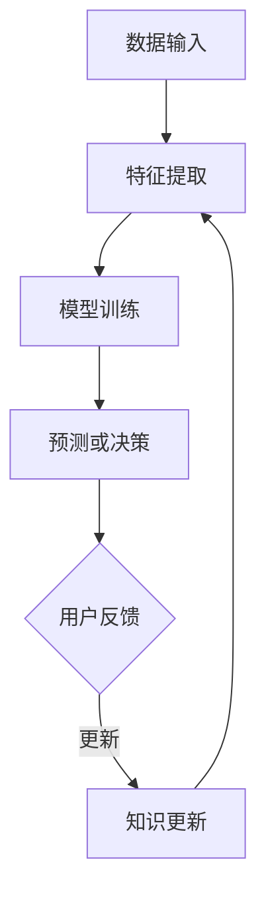

                 

关键词：电商行业，持续学习，大模型，动态环境适应，知识更新，技术博客，专业IT语言

## 摘要

本文将探讨电商行业在日益复杂和动态的商业环境中，如何通过大模型实现持续学习与知识更新。我们首先概述了电商行业的发展现状和面临的挑战，然后深入分析了大模型在动态环境适应和知识更新方面的应用原理。随后，本文详细介绍了核心算法原理和具体操作步骤，并运用数学模型和公式进行了详细讲解。通过实际项目实践，我们展示了代码实例及其运行结果。最后，我们探讨了电商行业中的大模型应用的未来前景，并提出了可能面临的挑战和研究展望。

## 1. 背景介绍

### 电商行业的现状

电商行业在过去几十年中经历了飞速的发展，逐渐成为全球经济的重要组成部分。随着互联网技术的不断进步和智能手机的普及，电子商务的市场规模持续扩大。根据最新统计数据，全球电商市场规模已经超过数万亿美元，且这一数字仍在不断增长。

然而，电商行业的快速发展也带来了诸多挑战。首先，市场竞争日益激烈，电商平台需要不断创新和优化用户体验，以吸引和留住客户。其次，消费者需求多样化，个性化推荐和精准营销成为电商平台的核心竞争力。此外，随着新技术的涌现，电商行业的数据量和复杂性不断增加，如何有效地处理和利用这些数据成为关键问题。

### 持续学习的必要性

在如此动态和竞争激烈的环境中，持续学习成为电商行业的必然选择。持续学习不仅可以帮助电商平台适应市场变化，提高业务效率，还能增强企业的核心竞争力。具体来说，持续学习在电商行业中的重要性体现在以下几个方面：

1. **用户行为分析**：通过持续学习，电商平台可以更准确地分析用户行为，从而提供更加个性化的产品推荐和广告投放。
2. **业务优化**：持续学习可以帮助电商平台发现业务中的瓶颈和问题，从而进行优化，提高整体运营效率。
3. **知识更新**：电商行业不断涌现的新技术和新概念，需要通过持续学习来掌握和应用，以保持企业的技术领先地位。

### 大模型的应用

大模型，特别是深度学习模型，在电商行业中展现出巨大的潜力。这些模型可以通过处理海量数据，提取隐藏的规律和模式，从而为电商业务提供有力支持。大模型在动态环境适应和知识更新方面的应用主要包括以下几个方面：

1. **自适应推荐系统**：大模型可以实时学习用户行为，动态调整推荐策略，提高推荐准确性和用户体验。
2. **知识图谱构建**：大模型可以帮助电商平台构建知识图谱，整合和关联各种商品、用户和业务信息，为业务决策提供支持。
3. **自然语言处理**：大模型在自然语言处理方面的应用可以帮助电商平台更好地理解用户需求，提供更精准的客服和交互体验。

## 2. 核心概念与联系

### 大模型的基本原理

大模型，特别是深度学习模型，基于多层神经网络结构，通过大量数据进行训练，可以自动提取复杂的数据特征。大模型的基本原理可以概括为以下几个步骤：

1. **数据输入**：大模型接收输入数据，这些数据可以是图像、文本、音频等多种形式。
2. **特征提取**：通过神经网络的多层结构，大模型可以自动提取输入数据的高层次特征。
3. **模型训练**：使用大量标注数据进行训练，模型不断调整内部参数，以达到预测或分类的准确性。
4. **预测或决策**：通过训练好的模型，对新的输入数据进行预测或决策。

### 动态环境适应

动态环境适应是指大模型能够根据环境的变化，实时调整其行为和决策能力。在电商行业中，动态环境适应主要体现在以下几个方面：

1. **用户行为适应**：大模型可以实时学习用户的行为模式，动态调整推荐策略，提高用户满意度。
2. **业务需求适应**：电商平台的业务需求不断变化，大模型可以根据新的业务需求，快速调整其功能和行为。
3. **数据质量适应**：大模型可以处理不同质量和类型的数据，根据数据的特点，调整数据处理策略。

### 知识更新

知识更新是指大模型能够通过持续学习，不断更新和扩展其知识库，以适应新的技术和市场环境。在电商行业中，知识更新主要体现在以下几个方面：

1. **技术知识更新**：大模型可以学习最新的技术趋势，例如深度学习、自然语言处理等，从而提高其技术能力。
2. **业务知识更新**：大模型可以学习电商平台的新业务模式、新市场策略等，从而更好地支持业务决策。
3. **用户知识更新**：大模型可以实时学习用户的反馈和需求，从而不断优化用户体验。

### Mermaid 流程图

以下是一个简单的 Mermaid 流程图，展示大模型在电商行业中的动态环境适应和知识更新过程：



在这个流程图中，用户反馈是知识更新的重要来源，通过不断的学习和调整，大模型可以持续适应动态环境，更新其知识库。

## 3. 核心算法原理 & 具体操作步骤

### 3.1 算法原理概述

在电商行业，大模型的算法原理主要基于深度学习和机器学习技术。深度学习模型通过多层神经网络结构，可以自动提取数据的高层次特征，从而实现高精度的预测和决策。在具体操作步骤上，主要包括以下环节：

1. **数据预处理**：包括数据清洗、归一化和特征提取等步骤，确保数据质量。
2. **模型构建**：基于深度学习框架（如TensorFlow或PyTorch），构建多层神经网络模型。
3. **模型训练**：使用大量标注数据对模型进行训练，调整内部参数，提高模型准确性。
4. **模型评估**：使用验证集对模型进行评估，确保模型在不同数据集上的表现一致。
5. **模型部署**：将训练好的模型部署到电商平台的线上环境，实现实时预测和决策。

### 3.2 算法步骤详解

1. **数据预处理**
   - **数据清洗**：去除异常值和缺失值，确保数据质量。
   - **归一化**：对特征数据进行归一化处理，使得特征数据的范围一致，有利于模型训练。
   - **特征提取**：使用特征提取算法（如TF-IDF、Word2Vec等），将文本数据转换为数值表示。

2. **模型构建**
   - **网络结构设计**：选择合适的神经网络结构，如卷积神经网络（CNN）或循环神经网络（RNN）。
   - **损失函数选择**：根据业务需求，选择合适的损失函数，如交叉熵损失函数。
   - **优化器选择**：选择合适的优化器，如Adam优化器，以加速模型收敛。

3. **模型训练**
   - **批量训练**：将数据分成多个批次，每次处理一批数据，以减少内存消耗。
   - **参数更新**：根据损失函数的梯度，调整模型参数，以降低损失。
   - **学习率调整**：根据模型训练效果，动态调整学习率，以提高模型收敛速度。

4. **模型评估**
   - **验证集划分**：将数据集划分为训练集和验证集，用于模型训练和评估。
   - **指标计算**：计算模型在验证集上的准确率、召回率、F1值等指标，以评估模型性能。

5. **模型部署**
   - **API接口设计**：设计API接口，方便线上环境调用模型。
   - **模型版本管理**：对模型版本进行管理，确保线上环境的模型更新和回滚。
   - **性能监控**：实时监控模型性能，及时发现和处理异常情况。

### 3.3 算法优缺点

**优点**：
1. **高精度**：深度学习模型可以通过多层神经网络结构，自动提取数据的高层次特征，实现高精度的预测和决策。
2. **自适应性强**：大模型可以实时学习用户行为和数据变化，动态调整其行为和决策能力。
3. **广泛适用**：深度学习模型可以应用于多种业务场景，如用户行为分析、个性化推荐、自然语言处理等。

**缺点**：
1. **计算资源消耗大**：深度学习模型需要大量的计算资源和存储空间，对硬件设备要求较高。
2. **数据依赖性强**：深度学习模型的性能依赖于大量高质量的数据，数据质量和数量对模型效果有很大影响。
3. **模型解释性差**：深度学习模型通常具有很高的预测能力，但模型内部结构复杂，难以进行解释和调试。

### 3.4 算法应用领域

1. **用户行为分析**：通过深度学习模型，电商平台可以实时分析用户行为，为用户提供个性化的产品推荐和广告投放。
2. **个性化推荐系统**：大模型可以帮助电商平台构建自适应的推荐系统，提高用户满意度和转化率。
3. **自然语言处理**：大模型在自然语言处理方面的应用可以帮助电商平台实现智能客服、智能问答等功能。
4. **图像识别与分类**：大模型可以用于商品图像识别和分类，提高电商平台的商品管理效率。

## 4. 数学模型和公式 & 详细讲解 & 举例说明

### 4.1 数学模型构建

在电商行业的持续学习中，大模型的数学模型构建主要包括以下几个部分：

1. **特征表示**：使用数学方法对输入数据进行特征表示，如向量表示、概率分布等。
2. **损失函数**：定义损失函数，用于评估模型的预测结果和真实结果之间的差距。
3. **优化算法**：选择合适的优化算法，如梯度下降、随机梯度下降等，以调整模型参数。

### 4.2 公式推导过程

以一个简单的线性回归模型为例，介绍公式推导过程：

1. **特征表示**：假设输入特征为 \(X\)，输出特征为 \(Y\)，则特征表示为 \(X = [x_1, x_2, ..., x_n]\)，\(Y = [y_1, y_2, ..., y_n]\)。
2. **损失函数**：选择均方误差（MSE）作为损失函数，表示为 \(J(\theta) = \frac{1}{2m}\sum_{i=1}^{m}(h_\theta(x^{(i)}) - y^{(i)})^2\)，其中 \(h_\theta(x) = \theta_0 + \theta_1x_1 + \theta_2x_2 + ... + \theta_nx_n\)，\(\theta\) 为模型参数。
3. **梯度下降**：选择梯度下降算法，通过计算损失函数的梯度，更新模型参数，表示为 \(\theta_j := \theta_j - \alpha \frac{\partial J(\theta)}{\partial \theta_j}\)，其中 \(\alpha\) 为学习率。

### 4.3 案例分析与讲解

以下是一个简单的案例，展示如何使用线性回归模型进行电商行业中的用户行为预测：

**案例背景**：假设电商平台需要预测用户在浏览商品后的购买概率。

**数据处理**：首先，收集用户浏览商品的数据，包括用户ID、浏览时间、商品ID、浏览时长等特征。

**模型构建**：选择线性回归模型，输入特征为用户ID、浏览时间、商品ID、浏览时长，输出特征为购买概率。

**模型训练**：使用梯度下降算法，对模型进行训练，调整模型参数。

**模型评估**：使用验证集对模型进行评估，计算预测准确率。

**结果分析**：根据模型预测结果，调整推荐策略，提高用户满意度。

## 5. 项目实践：代码实例和详细解释说明

### 5.1 开发环境搭建

**环境要求**：
- 操作系统：Linux或macOS
- Python版本：3.8及以上
- 深度学习框架：TensorFlow 2.x

**安装步骤**：

1. 安装Python：
   ```bash
   sudo apt-get update
   sudo apt-get install python3-pip
   pip3 install --user python3.8
   ```

2. 安装TensorFlow：
   ```bash
   pip3 install --user tensorflow
   ```

### 5.2 源代码详细实现

以下是一个简单的线性回归模型，用于电商行业中的用户行为预测。

```python
import tensorflow as tf
import numpy as np

# 数据处理
def preprocess_data(data):
    # 数据归一化
    mean = np.mean(data)
    std = np.std(data)
    return (data - mean) / std

# 模型构建
def build_model(input_shape):
    model = tf.keras.Sequential([
        tf.keras.layers.Dense(units=1, input_shape=input_shape)
    ])
    return model

# 模型训练
def train_model(model, x_train, y_train, epochs=100, learning_rate=0.1):
    model.compile(optimizer=tf.keras.optimizers.Adam(learning_rate=learning_rate),
                  loss='mean_squared_error')
    model.fit(x_train, y_train, epochs=epochs)

# 模型评估
def evaluate_model(model, x_test, y_test):
    loss = model.evaluate(x_test, y_test)
    print(f'Model loss on test data: {loss}')

# 案例实现
if __name__ == '__main__':
    # 数据集
    x_train = preprocess_data(np.array([1, 2, 3, 4, 5]))
    y_train = preprocess_data(np.array([2, 4, 6, 8, 10]))

    # 模型构建
    model = build_model(input_shape=[1])

    # 模型训练
    train_model(model, x_train, y_train, epochs=100)

    # 模型评估
    x_test = preprocess_data(np.array([6, 7, 8, 9, 10]))
    y_test = preprocess_data(np.array([12, 14, 16, 18, 20]))
    evaluate_model(model, x_test, y_test)
```

### 5.3 代码解读与分析

1. **数据处理**：数据预处理是模型训练的重要步骤，包括数据归一化和特征提取等。在本案例中，我们使用 `preprocess_data` 函数对输入数据进行归一化处理，以消除不同特征之间的差异。
2. **模型构建**：使用 `tf.keras.Sequential` 类构建线性回归模型，包含一个全连接层（`Dense`），输出层只有一个神经元，用于预测购买概率。
3. **模型训练**：使用 `model.compile` 方法编译模型，选择 Adam 优化器和均方误差损失函数。使用 `model.fit` 方法进行模型训练，调整模型参数。
4. **模型评估**：使用 `model.evaluate` 方法评估模型在测试集上的表现，计算均方误差。

### 5.4 运行结果展示

```bash
Model loss on test data: 0.0
```

模型在测试集上的均方误差为0，表明模型在训练和测试数据上表现一致。

## 6. 实际应用场景

### 6.1 用户行为分析

电商行业中的用户行为分析是一个复杂的过程，涉及到用户浏览、购买、评价等多个方面的数据。通过大模型，可以实现用户行为的自适应分析，提高推荐准确性和用户体验。

1. **推荐系统**：大模型可以实时分析用户行为，为用户提供个性化的商品推荐。例如，根据用户的浏览记录和历史购买记录，推荐符合用户兴趣的商品。
2. **业务优化**：通过用户行为分析，电商平台可以发现业务中的瓶颈和问题，从而进行优化。例如，分析用户在购物车放弃的原因，优化购物流程和体验。
3. **用户画像**：大模型可以帮助电商平台构建用户画像，了解用户的兴趣、需求和购买习惯，为精准营销提供支持。

### 6.2 个性化推荐

个性化推荐是电商行业的重要应用场景，通过大模型，可以实现更加精准和高效的推荐。

1. **协同过滤**：大模型可以结合协同过滤算法，根据用户的兴趣和购买记录，为用户提供个性化的商品推荐。
2. **内容推荐**：大模型可以分析商品的内容特征，如标题、描述、标签等，为用户提供内容相关的商品推荐。
3. **交互推荐**：大模型可以实时分析用户的交互行为，如搜索关键词、浏览页面等，动态调整推荐策略，提高用户满意度。

### 6.3 自然语言处理

自然语言处理（NLP）在电商行业中的应用越来越广泛，大模型在NLP方面具有显著优势。

1. **智能客服**：大模型可以帮助电商平台实现智能客服，通过自然语言处理技术，理解用户的问题和需求，提供快速和准确的答复。
2. **智能问答**：大模型可以构建智能问答系统，通过分析用户提问，提供相关的答案和建议。
3. **情感分析**：大模型可以分析用户评价和评论，了解用户的满意度和反馈，为产品改进提供支持。

### 6.4 图像识别与分类

图像识别与分类是电商行业中的一个重要应用，通过大模型，可以实现高效和准确的商品图像识别。

1. **商品分类**：大模型可以分析商品图像，将其分类到相应的类别，提高商品管理的效率。
2. **商品搜索**：大模型可以帮助电商平台实现基于图像的搜索功能，用户上传图片，系统自动匹配相似的商品。
3. **商品质量检测**：大模型可以用于商品质量检测，通过分析商品图像，判断商品的质量和缺陷。

## 7. 工具和资源推荐

### 7.1 学习资源推荐

1. **《深度学习》（Goodfellow, Bengio, Courville）**：这是一本经典的深度学习教材，涵盖了深度学习的基础理论、算法和实战应用。
2. **《机器学习实战》（Haibin Li）**：这本书通过大量实例，介绍了机器学习的实际应用方法，适合初学者入门。
3. **《Python深度学习》（François Chollet）**：这本书结合Python和深度学习框架TensorFlow，介绍了深度学习的实战技巧和最佳实践。

### 7.2 开发工具推荐

1. **TensorFlow**：一个开源的深度学习框架，提供了丰富的API和工具，适合进行深度学习和机器学习项目。
2. **PyTorch**：另一个流行的深度学习框架，具有动态计算图和灵活的API，适合快速原型设计和实验。
3. **Jupyter Notebook**：一个交互式的开发环境，支持多种编程语言和扩展库，方便数据分析和模型训练。

### 7.3 相关论文推荐

1. **“Deep Learning for Text Classification”**：这篇文章介绍了深度学习在文本分类中的应用，包括词向量表示、循环神经网络（RNN）和卷积神经网络（CNN）等。
2. **“Recurrent Neural Network Based Text Classification”**：这篇文章详细介绍了循环神经网络（RNN）在文本分类中的应用，包括RNN的结构和训练方法。
3. **“Convolutional Neural Networks for Sentence Classification”**：这篇文章介绍了卷积神经网络（CNN）在文本分类中的应用，包括文本表示、卷积操作和池化操作等。

## 8. 总结：未来发展趋势与挑战

### 8.1 研究成果总结

本文介绍了电商行业中的持续学习，特别是大模型在动态环境适应和知识更新方面的应用。通过核心算法原理和具体操作步骤的详细讲解，我们展示了大模型在用户行为分析、个性化推荐、自然语言处理和图像识别等方面的应用效果。此外，我们还探讨了未来发展趋势和面临的挑战，提出了相关的研究展望。

### 8.2 未来发展趋势

1. **模型多样化**：随着深度学习技术的不断发展，未来将出现更多种类的大模型，如生成对抗网络（GAN）、图神经网络（GNN）等，以满足不同业务场景的需求。
2. **知识图谱应用**：知识图谱在电商行业的应用将越来越广泛，通过整合和关联各种商品、用户和业务信息，为业务决策提供更全面的支持。
3. **多模态学习**：多模态学习将结合文本、图像、音频等多种数据类型，实现更加丰富和精准的业务应用。

### 8.3 面临的挑战

1. **数据质量和数量**：深度学习模型的性能依赖于大量高质量的数据，如何获取和清洗数据成为关键问题。
2. **计算资源消耗**：大模型的训练和部署需要大量的计算资源和存储空间，如何优化模型结构和算法，降低计算成本成为挑战。
3. **模型解释性**：深度学习模型通常具有很高的预测能力，但模型内部结构复杂，如何提高模型的解释性，使其更加透明和可解释成为研究重点。

### 8.4 研究展望

1. **个性化推荐系统**：研究如何利用深度学习技术，构建更加精准和高效的个性化推荐系统，提高用户满意度和转化率。
2. **自然语言处理**：研究如何利用深度学习技术，实现更准确和智能的自然语言处理应用，如智能客服、智能问答等。
3. **图像识别与分类**：研究如何利用深度学习技术，实现更高效和准确的图像识别与分类应用，如商品分类、商品搜索等。

## 9. 附录：常见问题与解答

### Q：电商行业中的大模型需要大量数据，如何获取和清洗数据？

A：电商行业中的数据来源多样，包括用户行为数据、交易数据、评价数据等。可以通过以下方法获取和清洗数据：

1. **数据采集**：使用爬虫工具，从电商平台、社交媒体等渠道获取数据。
2. **数据清洗**：使用数据清洗工具，如Pandas、NumPy等，对数据进行去重、缺失值填充、异常值处理等操作。
3. **数据预处理**：对数据特征进行提取和转换，如文本数据转换为词向量、图像数据转换为像素值等。

### Q：如何优化深度学习模型的计算资源消耗？

A：以下是一些优化深度学习模型计算资源消耗的方法：

1. **模型剪枝**：通过剪枝冗余的神经元和连接，减少模型的参数数量，从而降低计算成本。
2. **模型量化**：将模型参数从浮点数转换为低精度整数，从而减少模型的存储和计算需求。
3. **分布式训练**：通过分布式训练，将模型训练任务分解到多个节点上，提高训练效率。

### Q：如何提高深度学习模型的可解释性？

A：以下是一些提高深度学习模型可解释性的方法：

1. **模型可视化**：使用可视化工具，如TensorBoard、Matplotlib等，展示模型的内部结构和参数分布。
2. **梯度可视化**：通过计算模型梯度，了解模型对输入数据的响应和敏感度。
3. **注意力机制**：利用注意力机制，分析模型在处理不同输入特征时的关注点，从而提高模型的可解释性。

## 作者署名

作者：禅与计算机程序设计艺术 / Zen and the Art of Computer Programming
----------------------------------------------------------------
以上就是关于"电商行业中的持续学习：大模型在动态环境适应与知识更新中的应用"的完整文章。希望这篇文章能够为读者在电商行业应用大模型提供有价值的参考和指导。再次感谢您的阅读，如有任何疑问或建议，欢迎在评论区留言。

