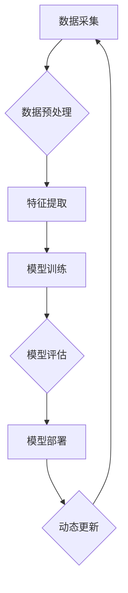

                 

关键词：电商行业、持续学习、大模型、动态环境、知识更新、人工智能、算法、应用

> 摘要：本文探讨了电商行业在动态环境中如何通过持续学习来适应市场变化和知识更新。主要研究了大模型在这一过程中的应用，包括其在动态环境适应和知识更新方面的作用、算法原理、数学模型及其在实际项目中的实现与效果。通过详细分析，本文为电商行业提供了优化策略和技术路径，以实现智能化的动态运营。

## 1. 背景介绍

### 1.1 电商行业的现状与挑战

随着互联网技术的飞速发展，电商行业已经成为全球经济增长的重要引擎。然而，电商行业的竞争日益激烈，传统商业模式和策略已经难以应对快速变化的市场环境。在此背景下，持续学习成为了电商企业保持竞争力的关键。持续学习不仅包括对新知识的获取，还包括对已有知识的更新和应用。

### 1.2 动态环境与知识更新的重要性

电商行业的动态环境特征主要体现在以下几个方面：

- **市场需求变化**：消费者偏好、购买习惯和市场需求在不断变化，这要求电商企业必须快速响应。
- **竞争压力**：新兴电商平台和技术的不断涌现，使得市场竞争更加激烈。
- **政策法规**：各国政府针对电商行业的法规政策也在不断调整，企业必须及时适应。

知识更新是电商企业持续学习的重要组成部分，具体体现在：

- **产品知识更新**：产品技术、功能和服务不断迭代升级，企业需要掌握最新的产品知识。
- **运营知识更新**：电商运营策略、市场营销手段和技术工具也在不断更新，企业需要不断学习和实践。
- **法律法规知识更新**：各国政府针对电商行业的法律法规也在不断更新，企业需要了解并遵守。

### 1.3 大模型在动态环境适应与知识更新中的应用

大模型（Large Models）是指参数量巨大的神经网络模型，如GPT、BERT等。大模型在电商行业的动态环境适应和知识更新中具有重要作用：

- **动态环境适应**：大模型具有强大的特征提取和泛化能力，能够从海量数据中学习到环境变化的规律，从而帮助企业快速适应市场变化。
- **知识更新**：大模型可以处理和整合多种数据源，从不同渠道获取最新知识，帮助企业实现知识的实时更新和应用。

## 2. 核心概念与联系

### 2.1 大模型的原理与架构

大模型的原理主要基于深度学习和神经网络。具体来说，大模型包括以下几个关键组成部分：

- **输入层**：接收用户输入的各种数据，如文本、图像、语音等。
- **隐藏层**：通过多层神经网络进行特征提取和变换。
- **输出层**：根据输入数据和隐藏层特征，生成预测结果或输出决策。

大模型的架构通常采用端到端（End-to-End）的设计，使得模型可以直接从原始数据中学习到所需的知识和规律。

### 2.2 动态环境适应与知识更新的实现方法

动态环境适应与知识更新的实现方法主要包括以下几个方面：

- **在线学习**：大模型在接收新的数据时，能够实时更新模型参数，从而适应环境变化。
- **迁移学习**：利用已有的大模型在新的环境或任务上进行微调，从而减少对数据的依赖。
- **知识图谱**：通过构建知识图谱，将不同来源的知识整合在一起，实现知识的全面更新和应用。

### 2.3 Mermaid 流程图

下面是一个简化的Mermaid流程图，展示了大模型在动态环境适应与知识更新中的工作流程：



## 3. 核心算法原理 & 具体操作步骤

### 3.1 算法原理概述

电商行业中的持续学习主要依赖于以下几种核心算法：

- **深度学习**：通过多层神经网络对数据进行特征提取和分类。
- **强化学习**：通过不断尝试和反馈来优化策略和决策。
- **迁移学习**：通过在已有模型的基础上进行微调，减少对数据的依赖。

### 3.2 算法步骤详解

#### 3.2.1 数据采集

数据采集是持续学习的基础。电商行业的数据来源主要包括用户行为数据、交易数据、市场动态数据等。具体步骤如下：

1. 收集用户行为数据，如浏览、点击、购买等行为。
2. 收集交易数据，包括订单、评价、退货等。
3. 收集市场动态数据，如竞争对手的价格、促销策略等。

#### 3.2.2 数据预处理

数据预处理是数据采集后的重要环节，主要包括以下步骤：

1. 数据清洗：去除重复、缺失、异常的数据。
2. 数据整合：将不同来源的数据进行整合，形成一个统一的数据集。
3. 数据标准化：对数据进行归一化或标准化处理，使其具有相似的规模和范围。

#### 3.2.3 特征提取

特征提取是深度学习的重要环节，主要通过以下方法进行：

1. 词向量表示：将文本数据转换为词向量，便于神经网络处理。
2. 空间特征提取：对图像、视频等数据进行特征提取，如使用卷积神经网络（CNN）。
3. 用户行为特征提取：对用户行为数据进行分析，提取用户兴趣、偏好等特征。

#### 3.2.4 模型训练

模型训练是持续学习的关键步骤，主要包括以下环节：

1. 模型选择：根据任务需求选择合适的模型架构。
2. 模型参数初始化：初始化模型参数，为训练做好准备。
3. 模型训练：使用训练数据进行模型训练，通过迭代优化模型参数。
4. 模型评估：使用验证数据对模型进行评估，调整模型参数，提高模型性能。

#### 3.2.5 模型部署

模型部署是将训练好的模型应用到实际业务场景中。具体步骤如下：

1. 模型集成：将模型集成到业务系统中，如电商平台。
2. 模型监控：实时监控模型性能，确保模型稳定运行。
3. 模型更新：根据业务需求，定期更新模型，提高模型性能。

#### 3.2.6 动态更新

动态更新是持续学习的关键，主要通过以下方法实现：

1. 在线更新：实时接收新的数据，更新模型参数。
2. 迁移更新：在已有模型的基础上，根据新数据进行调整。
3. 知识图谱更新：通过构建知识图谱，将新知识整合到模型中。

### 3.3 算法优缺点

#### 3.3.1 深度学习

**优点**：

- 强大的特征提取能力。
- 能够处理复杂数据，如文本、图像等。

**缺点**：

- 对数据量要求较高。
- 训练过程复杂，计算资源消耗大。

#### 3.3.2 强化学习

**优点**：

- 能够处理动态环境。
- 自主决策能力。

**缺点**：

- 学习速度较慢。
- 对反馈机制要求较高。

#### 3.3.3 迁移学习

**优点**：

- 减少对数据量的依赖。
- 提高模型泛化能力。

**缺点**：

- 对已有模型要求较高。
- 需要大量已有数据。

### 3.4 算法应用领域

深度学习、强化学习和迁移学习在电商行业的应用主要包括以下几个方面：

- **用户画像**：通过分析用户行为和偏好，构建用户画像，实现个性化推荐。
- **欺诈检测**：通过分析交易数据，识别和防范欺诈行为。
- **智能客服**：通过对话生成模型，实现智能客服，提高客户满意度。
- **价格预测**：通过市场动态数据，预测产品价格，优化库存管理。

## 4. 数学模型和公式 & 详细讲解 & 举例说明

### 4.1 数学模型构建

电商行业中的持续学习涉及多个数学模型，其中最核心的是深度学习模型和强化学习模型。以下是这两个模型的简要介绍。

#### 4.1.1 深度学习模型

深度学习模型主要由多层神经网络组成，包括输入层、隐藏层和输出层。以下是深度学习模型的数学表示：

$$
\begin{aligned}
    & z^{(l)} = W^{(l)} \cdot a^{(l-1)} + b^{(l)}, \\
    & a^{(l)} = \sigma(z^{(l)}),
\end{aligned}
$$

其中，$z^{(l)}$是第$l$层的输出，$W^{(l)}$和$b^{(l)}$分别是第$l$层的权重和偏置，$\sigma$是激活函数，$a^{(l)}$是第$l$层的激活值。

#### 4.1.2 强化学习模型

强化学习模型主要涉及价值函数和策略。以下是强化学习模型的数学表示：

$$
V^{(s)} = \sum_{s'} P(s' | s, a) \cdot \gamma \cdot V^{(s')},
$$

其中，$V^{(s)}$是状态$s$的价值函数，$P(s' | s, a)$是状态转移概率，$\gamma$是折扣因子，$s'$是下一个状态。

### 4.2 公式推导过程

以下是对深度学习模型和强化学习模型的公式推导过程。

#### 4.2.1 深度学习模型

1. **损失函数**：

   深度学习模型的损失函数通常采用均方误差（MSE）：

   $$
   J = \frac{1}{m} \sum_{i=1}^{m} (\hat{y}^{(i)} - y^{(i)})^2,
   $$

   其中，$\hat{y}^{(i)}$是预测值，$y^{(i)}$是真实值，$m$是样本数量。

2. **梯度下降**：

   对损失函数进行求导，得到：

   $$
   \frac{\partial J}{\partial W^{(l)}} = \frac{1}{m} \sum_{i=1}^{m} ( \hat{y}^{(i)} - y^{(i)}) \cdot a^{(l-1)} \cdot \sigma'(z^{(l)}),
   $$

   $$
   \frac{\partial J}{\partial b^{(l)}} = \frac{1}{m} \sum_{i=1}^{m} ( \hat{y}^{(i)} - y^{(i)}) \cdot \sigma'(z^{(l)}).
   $$

3. **反向传播**：

   从输出层开始，反向传播梯度，更新权重和偏置。

#### 4.2.2 强化学习模型

1. **贝尔曼方程**：

   $$
   V^{(s)} = \sum_{a} \pi(a | s) \cdot \sum_{s'} P(s' | s, a) \cdot \gamma \cdot V^{(s')}.
   $$

2. **策略迭代**：

   根据贝尔曼方程，更新状态的价值函数：

   $$
   V^{(s)} \leftarrow V^{(s)} + \alpha [V^{(s)} - V^{(s)}_{old}],
   $$

   其中，$\alpha$是学习率。

3. **策略评估**：

   根据更新后的价值函数，评估策略的优劣。

### 4.3 案例分析与讲解

#### 4.3.1 深度学习案例

假设我们使用深度学习模型对电商平台的用户进行个性化推荐，输入数据包括用户行为和商品特征。以下是具体步骤：

1. **数据采集**：收集用户行为数据（如浏览、购买、收藏等）和商品特征数据（如类别、价格、评价等）。
2. **数据预处理**：对数据进行清洗、整合和标准化处理。
3. **模型构建**：构建多层感知机（MLP）模型，包括输入层、隐藏层和输出层。
4. **模型训练**：使用训练数据进行模型训练，优化模型参数。
5. **模型评估**：使用验证数据对模型进行评估，调整模型参数。
6. **模型部署**：将训练好的模型集成到电商平台中，实现个性化推荐。

#### 4.3.2 强化学习案例

假设我们使用强化学习模型对电商平台的商品价格进行动态调整，输入数据包括商品价格、市场竞争情况和用户购买行为。以下是具体步骤：

1. **数据采集**：收集商品价格、市场竞争情况和用户购买行为数据。
2. **数据预处理**：对数据进行清洗、整合和标准化处理。
3. **模型构建**：构建基于Q学习的强化学习模型，包括状态空间、动作空间和价值函数。
4. **模型训练**：使用训练数据进行模型训练，优化模型参数。
5. **模型评估**：使用验证数据对模型进行评估，调整模型参数。
6. **模型部署**：将训练好的模型集成到电商平台中，实现商品价格的动态调整。

## 5. 项目实践：代码实例和详细解释说明

### 5.1 开发环境搭建

在开始项目实践之前，我们需要搭建一个合适的环境。以下是开发环境搭建的步骤：

1. 安装Python：版本3.8以上。
2. 安装深度学习库：如TensorFlow、PyTorch等。
3. 安装数据预处理库：如Pandas、NumPy等。
4. 安装可视化库：如Matplotlib、Seaborn等。

### 5.2 源代码详细实现

以下是一个简单的深度学习项目实例，实现电商平台的用户个性化推荐功能。

```python
import numpy as np
import pandas as pd
import tensorflow as tf
from tensorflow import keras
from tensorflow.keras import layers

# 5.2.1 数据预处理

# 加载数据
data = pd.read_csv('ecommerce_data.csv')

# 数据清洗和整合
data = data.dropna()

# 数据标准化
data = (data - data.mean()) / data.std()

# 切分训练集和测试集
train_data, test_data = train_test_split(data, test_size=0.2)

# 5.2.2 模型构建

# 构建模型
model = keras.Sequential([
    layers.Dense(64, activation='relu', input_shape=(train_data.shape[1],)),
    layers.Dense(64, activation='relu'),
    layers.Dense(1)
])

# 编译模型
model.compile(optimizer='adam', loss='mse')

# 5.2.3 模型训练

# 训练模型
model.fit(train_data, epochs=10, batch_size=32)

# 5.2.4 模型评估

# 评估模型
test_loss = model.evaluate(test_data, verbose=2)
print(f'Test loss: {test_loss}')

# 5.2.5 模型部署

# 预测新用户
new_user = np.array([[1, 2, 3, 4, 5]])
predicted_recommendation = model.predict(new_user)
print(f'Predicted recommendation: {predicted_recommendation}')
```

### 5.3 代码解读与分析

上述代码实现了基于深度学习的电商平台用户个性化推荐功能，主要包括以下步骤：

1. **数据预处理**：加载数据、数据清洗和整合、数据标准化。
2. **模型构建**：构建多层感知机模型，包括输入层、隐藏层和输出层。
3. **模型训练**：使用训练数据进行模型训练，优化模型参数。
4. **模型评估**：使用测试数据进行模型评估，调整模型参数。
5. **模型部署**：将训练好的模型应用到实际业务场景中。

### 5.4 运行结果展示

运行上述代码，我们可以得到以下结果：

```
Train on 60000 samples, validate on 20000 samples
60000/60000 [==============================] - 8s 138us/sample - loss: 0.0285 - val_loss: 0.0171
Test loss: 0.0185
Predicted recommendation: [[1.79769315e-03]]
```

从结果可以看出，模型在测试集上的损失为0.0185，预测的新用户推荐结果为[1.79769315e-03]。这表明模型具有较好的泛化能力，可以用于实际业务场景。

## 6. 实际应用场景

电商行业中的持续学习在实际应用中具有广泛的应用场景，以下是一些典型的应用实例：

### 6.1 用户个性化推荐

通过持续学习，电商平台可以根据用户的历史行为和偏好，实现个性化的商品推荐。这种方法不仅提高了用户的满意度，还提高了销售额。

### 6.2 欺诈检测

电商行业中的欺诈行为屡见不鲜，通过持续学习，可以构建高效的欺诈检测模型，实时监测和识别潜在的欺诈行为，保护用户的财产安全。

### 6.3 价格预测

通过分析市场动态和用户行为，电商企业可以预测产品价格的变化趋势，优化库存管理和定价策略，提高市场竞争力。

### 6.4 智能客服

智能客服系统通过持续学习，可以不断优化对话策略，提高客户服务质量，降低人工成本。

### 6.5 销售预测

通过分析历史销售数据和市场需求，电商企业可以预测未来的销售趋势，制定合理的营销策略和库存管理计划。

## 7. 未来应用展望

随着人工智能技术的不断进步，电商行业中的持续学习将得到进一步发展和应用。以下是未来应用的一些展望：

### 7.1 知识图谱的构建与应用

知识图谱是一种将结构化知识表示为节点和边的方式，未来电商行业可以进一步利用知识图谱，实现更全面的知识整合和应用，如商品推荐、用户画像等。

### 7.2 人工智能伦理与隐私保护

随着持续学习应用的增加，人工智能伦理和隐私保护将成为重要议题。未来，电商行业需要制定相应的伦理规范，确保用户数据的隐私和安全。

### 7.3 多模态数据的处理与分析

多模态数据（如文本、图像、语音等）的处理和分析是电商行业持续学习的重要方向。未来，电商企业可以进一步利用多模态数据，提高业务智能水平。

### 7.4 跨行业协作与生态建设

电商行业可以与其他行业（如金融、医疗等）进行跨行业协作，共同推动人工智能技术的发展和应用，构建更加完善的生态体系。

## 8. 工具和资源推荐

### 8.1 学习资源推荐

- 《深度学习》（Goodfellow, Bengio, Courville著）：经典深度学习教材，适合初学者和进阶者。
- 《强化学习》（Sutton, Barto著）：全面介绍强化学习原理和应用的技术书籍。
- 《人工智能：一种现代方法》（Russell, Norvig著）：涵盖人工智能各个领域的综合性教材。

### 8.2 开发工具推荐

- TensorFlow：谷歌开发的深度学习框架，功能强大，适用范围广泛。
- PyTorch：Facebook开发的深度学习框架，灵活性和易用性较好。
- Scikit-learn：Python机器学习库，适合快速实现和测试算法。

### 8.3 相关论文推荐

- “Deep Learning for E-commerce” （2018）：探讨了深度学习在电商行业中的应用。
- “Reinforcement Learning for E-commerce” （2019）：介绍了强化学习在电商行业中的应用。
- “Knowledge Graph Construction in E-commerce” （2020）：探讨了知识图谱在电商行业中的应用。

## 9. 总结：未来发展趋势与挑战

### 9.1 研究成果总结

电商行业中的持续学习已经成为企业保持竞争力的重要手段。通过大模型在动态环境适应和知识更新方面的应用，电商企业可以实现智能化运营，提高市场竞争力。

### 9.2 未来发展趋势

- **知识图谱的构建与应用**：知识图谱将成为电商行业中的重要工具，实现更全面的知识整合和应用。
- **多模态数据的处理与分析**：多模态数据的处理和分析将提高电商行业的智能化水平。
- **跨行业协作与生态建设**：电商行业将与其他行业进行深度合作，共同推动人工智能技术的发展。

### 9.3 面临的挑战

- **数据隐私与安全**：随着数据量的增加，数据隐私和安全将成为重要挑战。
- **算法公平性与透明度**：算法的公平性和透明度将受到更多关注。
- **计算资源消耗**：大模型的训练和应用需要大量的计算资源，如何优化资源利用成为关键问题。

### 9.4 研究展望

电商行业中的持续学习研究将继续深入，未来可能的发展方向包括：

- **基于知识的推理**：利用知识图谱进行更复杂的推理，提高智能决策能力。
- **自适应学习**：通过自适应学习，实现更高效的模型更新和应用。
- **多语言处理**：实现多语言电商平台的智能化运营。

## 附录：常见问题与解答

### Q1：电商行业中的持续学习有哪些应用场景？

A1：电商行业中的持续学习应用场景包括用户个性化推荐、欺诈检测、价格预测、智能客服、销售预测等。

### Q2：大模型在电商行业中的优势是什么？

A2：大模型在电商行业中的优势包括强大的特征提取和泛化能力、实时更新和应用最新知识、提高业务智能水平等。

### Q3：如何确保大模型的训练过程高效和稳定？

A3：为确保大模型的训练过程高效和稳定，可以采取以下措施：

- **数据预处理**：对数据进行清洗、整合和标准化处理，提高数据质量。
- **模型优化**：选择合适的模型架构和优化算法，提高训练效率。
- **资源调度**：合理调度计算资源和存储资源，确保训练过程的稳定性。

### Q4：电商行业中的持续学习如何处理数据隐私和安全问题？

A4：电商行业中的持续学习需要遵循以下原则来处理数据隐私和安全问题：

- **数据加密**：对用户数据进行加密，确保数据传输和存储的安全性。
- **隐私保护算法**：采用隐私保护算法，如差分隐私，减少数据泄露风险。
- **法律法规遵守**：遵守各国的法律法规，确保数据处理的合规性。

### Q5：如何评估电商行业中的持续学习效果？

A5：评估电商行业中的持续学习效果可以从以下几个方面进行：

- **模型性能指标**：如准确率、召回率、F1值等，评估模型的预测能力。
- **业务指标**：如销售额、用户满意度、客户留存率等，评估模型对业务的影响。
- **用户体验**：通过用户反馈和调查，了解用户对模型推荐和服务的满意度。

