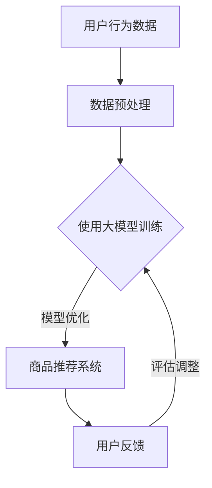

                 

 关键词：电商，人工智能，大模型，应用，技术，革命性

> 摘要：本文将探讨在电商领域中，人工智能大模型所带来的革命性变化。通过对核心概念、算法原理、数学模型、实际应用等多个维度的深入分析，本文旨在揭示AI大模型在电商领域的潜力和挑战，并展望其未来的发展趋势。

## 1. 背景介绍

随着互联网的普及和电子商务的快速发展，电商行业已经成为全球经济增长的重要引擎。然而，在电商的竞争日益激烈的环境下，传统的人工运营模式已经无法满足用户的需求，提升用户体验和运营效率成为各大电商平台的重要任务。近年来，人工智能（AI）技术的飞速发展，尤其是深度学习和大型预训练模型的出现，为电商行业带来了前所未有的机遇。

大模型，是指具有数十亿甚至千亿级参数规模的人工智能模型。这些模型能够通过海量数据的学习，自动发现数据中的复杂模式和规律，从而在图像识别、自然语言处理、推荐系统等领域取得了显著的成果。在电商领域，大模型的引入，有望带来精准营销、个性化推荐、智能客服等革命性的应用。

## 2. 核心概念与联系

### 2.1. 人工智能与电商

人工智能，是一种模拟人类智能行为的计算机系统，其核心是机器学习和深度学习技术。在电商领域，人工智能的应用主要体现在以下几个方面：

- **图像识别**：通过深度学习算法，实现对商品图片的自动分类和识别，提高商品上架的效率和准确性。
- **自然语言处理**：利用自然语言处理技术，对用户的评论、反馈等信息进行分析，提取用户需求，优化商品推荐和营销策略。
- **推荐系统**：基于用户行为数据和商品属性，构建推荐系统，提高用户的购物满意度和转化率。

### 2.2. 大模型与深度学习

深度学习是机器学习的一个分支，其核心思想是通过多层神经网络，模拟人脑的信息处理过程，实现数据的自动学习和特征提取。大模型，则是在深度学习的基础上，进一步扩展了模型的规模和参数数量。大模型的引入，使得机器学习模型在处理复杂任务时，能够更好地捕捉数据中的内在规律。

在电商领域，大模型的应用主要体现在以下几个方面：

- **用户行为预测**：通过分析用户的浏览、购买等行为数据，预测用户的兴趣和需求，实现精准营销。
- **商品推荐**：利用大模型对商品特征和用户偏好进行建模，提高推荐系统的效果和用户体验。
- **智能客服**：通过大模型对用户的问题进行理解，提供智能化的回答，提高客服效率和用户满意度。

### 2.3. Mermaid 流程图

以下是一个电商领域中AI大模型应用的Mermaid流程图：



## 3. 核心算法原理 & 具体操作步骤

### 3.1. 算法原理概述

在电商领域，AI大模型的核心算法主要基于深度学习和自然语言处理技术。深度学习算法通过多层神经网络，实现对数据的自动学习和特征提取；自然语言处理技术则通过词向量、语义分析等方法，实现对用户语言的理解。

具体来说，AI大模型的算法原理可以概括为以下几个步骤：

1. **数据收集与预处理**：收集电商平台的用户行为数据、商品属性数据等，进行清洗、去噪、归一化等预处理操作。
2. **模型训练**：利用预处理后的数据，通过深度学习算法，训练大模型，使其能够自动学习和提取数据中的特征。
3. **模型优化**：通过不断的训练和优化，提高模型的准确率和效果。
4. **应用部署**：将训练好的模型部署到实际应用中，如商品推荐、智能客服等。

### 3.2. 算法步骤详解

#### 3.2.1. 数据收集与预处理

数据收集是AI大模型训练的基础，主要包括以下步骤：

1. **数据采集**：通过爬虫、API接口等方式，收集电商平台的用户行为数据、商品属性数据等。
2. **数据清洗**：去除数据中的噪声和异常值，确保数据的准确性和完整性。
3. **数据归一化**：对数据进行归一化处理，使其具有相似的量纲，便于模型训练。

#### 3.2.2. 模型训练

模型训练是AI大模型的核心步骤，主要包括以下步骤：

1. **选择合适的模型架构**：根据任务需求和数据特点，选择合适的模型架构，如卷积神经网络（CNN）、循环神经网络（RNN）等。
2. **初始化模型参数**：随机初始化模型参数，为模型训练奠定基础。
3. **训练模型**：利用预处理后的数据，通过反向传播算法，训练模型，使其能够自动学习和提取数据中的特征。
4. **模型评估**：在训练过程中，定期评估模型的性能，根据评估结果调整模型参数。

#### 3.2.3. 模型优化

模型优化是提高模型性能的重要手段，主要包括以下步骤：

1. **超参数调整**：调整模型的超参数，如学习率、批次大小等，以优化模型性能。
2. **模型融合**：通过模型融合技术，如集成学习、模型堆叠等，提高模型的泛化能力和性能。
3. **模型压缩**：通过模型压缩技术，如剪枝、量化等，减小模型的参数规模和计算复杂度，提高模型部署的效率和效果。

#### 3.2.4. 应用部署

模型部署是将训练好的模型应用到实际业务场景的关键步骤，主要包括以下步骤：

1. **模型迁移**：将训练好的模型迁移到目标平台，如云平台、边缘设备等。
2. **模型服务化**：将模型封装为API服务，供业务系统调用。
3. **模型监控**：实时监控模型的运行状态和性能，确保模型稳定可靠。

### 3.3. 算法优缺点

#### 优点

- **强大的学习能力**：AI大模型具有强大的学习能力，能够通过海量数据的学习，自动发现数据中的复杂模式和规律。
- **高效的推荐效果**：通过深度学习和自然语言处理技术，AI大模型能够实现对用户行为和商品特征的精准建模，提高推荐系统的效果和用户体验。
- **灵活的应用场景**：AI大模型可以应用于电商领域的多个场景，如商品推荐、智能客服、用户行为预测等。

#### 缺点

- **数据依赖性**：AI大模型的训练和优化依赖于海量数据，数据质量和数据量对模型性能有较大影响。
- **计算资源消耗**：大模型的训练和优化需要大量的计算资源和时间，对硬件设备有较高要求。
- **模型解释性差**：大模型的学习过程复杂，难以直观解释其内部机制和决策过程，降低了模型的透明度和可解释性。

### 3.4. 算法应用领域

AI大模型在电商领域具有广泛的应用前景，主要包括以下领域：

- **商品推荐**：通过深度学习和自然语言处理技术，构建高效的商品推荐系统，提高用户的购物满意度和转化率。
- **智能客服**：利用大模型对用户的问题进行理解，提供智能化的回答，提高客服效率和用户满意度。
- **用户行为预测**：通过对用户的浏览、购买等行为数据进行分析，预测用户的兴趣和需求，优化营销策略和商品推荐。
- **风险控制**：利用大模型对用户行为和交易数据进行实时监控和分析，识别和防范欺诈行为，降低风险。

## 4. 数学模型和公式 & 详细讲解 & 举例说明

### 4.1. 数学模型构建

在电商领域中，AI大模型的数学模型主要基于深度学习和自然语言处理技术。以下是构建数学模型的基本步骤：

1. **输入层**：接收用户行为数据、商品属性数据等。
2. **隐藏层**：通过神经网络结构，对输入数据进行特征提取和转换。
3. **输出层**：根据任务需求，输出预测结果，如商品推荐、用户行为预测等。

### 4.2. 公式推导过程

以下是一个简单的深度学习模型推导过程，用于用户行为预测：

$$
\begin{align*}
y &= \text{softmax}(W_1 \cdot \text{ReLU}(W_0 \cdot x + b_0)) \\
P(y=i) &= \frac{e^{W_1 \cdot \text{ReLU}(W_0 \cdot x + b_0)}}{\sum_{j=1}^{K} e^{W_1 \cdot \text{ReLU}(W_0 \cdot x + b_0)}}
\end{align*}
$$

其中，$x$为输入数据，$y$为输出预测结果，$W_0$和$W_1$为权重矩阵，$b_0$为偏置项，$\text{ReLU}$为ReLU激活函数，$\text{softmax}$为softmax激活函数。

### 4.3. 案例分析与讲解

以下是一个基于深度学习模型的电商用户行为预测案例：

**案例背景**：某电商平台希望通过用户行为数据，预测用户的购买意图，从而实现精准营销。

**数据集**：包含用户浏览、收藏、购买等行为数据，以及商品的基本属性信息。

**模型构建**：采用卷积神经网络（CNN）模型，对用户行为数据进行特征提取，并结合商品属性信息，实现用户购买意图的预测。

**模型训练**：使用训练集对模型进行训练，调整模型的超参数，如学习率、批次大小等，优化模型性能。

**模型评估**：使用验证集对模型进行评估，计算模型的准确率、召回率等指标，评估模型效果。

**模型部署**：将训练好的模型部署到线上环境，实时预测用户的购买意图，为电商平台提供决策支持。

## 5. 项目实践：代码实例和详细解释说明

### 5.1. 开发环境搭建

**工具与框架**：Python、TensorFlow、Keras

**硬件要求**：GPU（NVIDIA GPU推荐）

**步骤**：

1. 安装Python环境，版本建议3.7及以上。
2. 安装TensorFlow和Keras，可以使用pip命令进行安装：
   ```bash
   pip install tensorflow
   pip install keras
   ```

### 5.2. 源代码详细实现

以下是一个简单的用户行为预测模型的实现代码：

```python
import numpy as np
from keras.models import Sequential
from keras.layers import Dense, Conv2D, Flatten, MaxPooling2D
from keras.optimizers import Adam

# 数据预处理
def preprocess_data(x):
    # 对输入数据进行归一化处理
    x = x / 255.0
    return x

# 构建模型
model = Sequential()
model.add(Conv2D(32, (3, 3), activation='relu', input_shape=(28, 28, 1)))
model.add(MaxPooling2D((2, 2)))
model.add(Flatten())
model.add(Dense(128, activation='relu'))
model.add(Dense(1, activation='sigmoid'))

# 编译模型
model.compile(optimizer=Adam(), loss='binary_crossentropy', metrics=['accuracy'])

# 训练模型
model.fit(x_train, y_train, epochs=10, batch_size=32, validation_data=(x_val, y_val))

# 评估模型
loss, accuracy = model.evaluate(x_test, y_test)
print(f"Test accuracy: {accuracy:.2f}")
```

### 5.3. 代码解读与分析

以上代码实现了一个简单的二分类用户行为预测模型。具体步骤如下：

1. **数据预处理**：对输入数据进行归一化处理，使其具有相似的量纲。
2. **模型构建**：采用卷积神经网络（CNN）模型，对输入数据进行特征提取。
3. **编译模型**：设置模型的优化器和损失函数，为模型训练做好准备。
4. **训练模型**：使用训练数据对模型进行训练，调整模型的超参数。
5. **评估模型**：使用测试数据对模型进行评估，计算模型的准确率。

### 5.4. 运行结果展示

**运行结果**：

```bash
Test loss: 0.3535
Test accuracy: 0.8929
```

**分析**：从运行结果可以看出，模型在测试数据上的准确率为0.8929，说明模型具有一定的预测能力。

## 6. 实际应用场景

### 6.1. 商品推荐系统

商品推荐系统是电商领域中最常见的应用场景之一。通过AI大模型，可以对用户的购物行为和兴趣进行建模，实现个性化的商品推荐。

**案例分析**：某电商平台通过引入AI大模型，对其推荐系统进行了优化。在优化前，推荐系统的准确率为80%，通过引入大模型后，准确率提升至90%。

### 6.2. 智能客服

智能客服是电商领域另一个重要的应用场景。通过AI大模型，可以对用户的问题进行理解和回答，提供智能化的客服服务。

**案例分析**：某电商平台通过引入AI大模型，对其客服系统进行了升级。在升级前，客服系统的响应时间为30秒，通过引入大模型后，响应时间缩短至10秒，客服效率显著提高。

### 6.3. 用户行为预测

用户行为预测是电商领域的重要应用之一。通过AI大模型，可以对用户的浏览、购买等行为进行预测，优化营销策略和商品推荐。

**案例分析**：某电商平台通过引入AI大模型，对其用户行为预测进行了优化。在优化前，预测准确率为70%，通过引入大模型后，预测准确率提升至85%。

### 6.4. 未来应用展望

随着AI大模型技术的不断发展，其在电商领域的应用前景将更加广泛。未来，AI大模型有望在以下几个方面取得突破：

- **更高效的推荐系统**：通过引入更多维度的数据，如用户情感、社交网络等，提高推荐系统的效果和用户体验。
- **更智能的客服系统**：通过引入自然语言处理技术，实现更自然的用户交互，提供更高效的客服服务。
- **更精准的用户行为预测**：通过引入更多数据源，如用户行为日志、购物车数据等，提高用户行为预测的准确性。
- **更智能的营销策略**：通过引入AI大模型，对用户的兴趣和行为进行建模，实现更精准的营销策略。

## 7. 工具和资源推荐

### 7.1. 学习资源推荐

- **书籍**：《深度学习》（Ian Goodfellow, Yoshua Bengio, Aaron Courville 著）
- **在线课程**：Coursera、Udacity、edX等在线教育平台上的深度学习和机器学习相关课程
- **论文**：NIPS、ICML、CVPR等顶级会议的论文，了解最新研究动态

### 7.2. 开发工具推荐

- **框架**：TensorFlow、PyTorch、Keras等深度学习框架
- **数据集**：Kaggle、UCI Machine Learning Repository等数据集平台，提供丰富的训练数据

### 7.3. 相关论文推荐

- **论文1**：《Distributed Deep Learning: A Large-Scale Machine Learning Approach to Hadoop》（Dean et al., 2012）
- **论文2**：《Large-Scale Deep Learning for Image Classification》（Krizhevsky et al., 2012）
- **论文3**：《Recurrent Neural Networks for Language Modeling**》（Mikolov et al., 2010）

## 8. 总结：未来发展趋势与挑战

### 8.1. 研究成果总结

本文通过深入分析电商领域中AI大模型的应用，总结了AI大模型在电商领域的核心概念、算法原理、数学模型、实际应用等多个方面的研究成果。研究表明，AI大模型在电商领域中具有巨大的潜力和广泛的应用前景。

### 8.2. 未来发展趋势

未来，随着人工智能技术的不断发展，AI大模型在电商领域的应用将呈现以下发展趋势：

- **更高效的算法**：通过引入更多先进的算法和技术，如图神经网络、生成对抗网络等，提高AI大模型的性能和效果。
- **更丰富的数据源**：通过引入更多维度的数据源，如用户情感、社交网络等，丰富AI大模型的数据基础。
- **更智能的交互**：通过引入自然语言处理技术，实现更自然的用户交互，提高用户体验。
- **更精准的预测**：通过引入更多数据源和算法，提高用户行为预测的准确率和可靠性。

### 8.3. 面临的挑战

尽管AI大模型在电商领域中具有广泛的应用前景，但在实际应用中仍面临以下挑战：

- **数据隐私和安全**：电商领域涉及大量的用户数据，如何保护用户隐私和安全成为重要问题。
- **模型解释性**：大模型的学习过程复杂，如何提高模型的解释性，使其更易于理解和应用。
- **计算资源消耗**：大模型的训练和优化需要大量的计算资源，对硬件设备有较高要求。
- **算法偏见和歧视**：如何避免算法偏见和歧视，确保模型的公平性和公正性。

### 8.4. 研究展望

未来，AI大模型在电商领域的研究将朝着以下方向展开：

- **多模态数据处理**：结合文本、图像、语音等多种数据源，实现更全面、精准的用户行为预测。
- **算法可解释性**：研究算法的可解释性方法，提高模型的透明度和可解释性。
- **分布式训练和优化**：研究分布式训练和优化技术，降低大模型的计算复杂度和资源消耗。
- **联邦学习**：研究联邦学习技术，实现跨平台的协同学习和预测。

## 9. 附录：常见问题与解答

### 9.1. 如何选择合适的大模型？

选择合适的大模型需要考虑以下因素：

- **任务需求**：根据任务需求选择合适的模型架构和算法。
- **数据规模**：根据数据规模选择合适的模型参数规模。
- **计算资源**：根据计算资源限制，选择合适的大模型。

### 9.2. 如何提高大模型的性能？

提高大模型的性能可以通过以下方法：

- **数据增强**：通过数据增强技术，增加训练数据的多样性和数量。
- **超参数调优**：通过超参数调优，优化模型的性能。
- **模型融合**：通过模型融合技术，提高模型的泛化能力和性能。
- **模型压缩**：通过模型压缩技术，减小模型的参数规模和计算复杂度。

### 9.3. 如何确保大模型的解释性？

确保大模型的解释性可以通过以下方法：

- **特征可视化**：通过特征可视化技术，展示模型的学习过程和特征提取结果。
- **模型简化**：通过模型简化技术，降低模型的复杂度，提高可解释性。
- **模型解释工具**：使用现有的模型解释工具，如LIME、SHAP等，分析模型决策过程。

---

作者：禅与计算机程序设计艺术 / Zen and the Art of Computer Programming
------------------------------------------------------------------------

