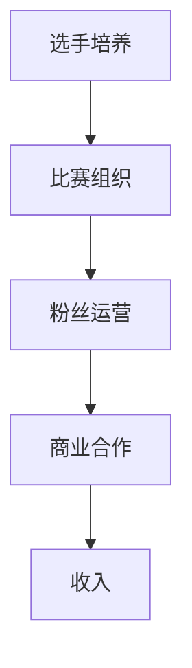
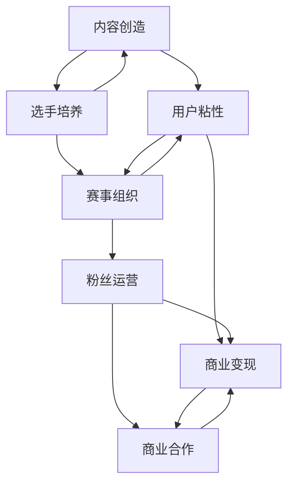

                 

关键词：电子竞技、俱乐部、注意力经济、运营模式

摘要：本文探讨了电子竞技俱乐部的注意力经济运营模式，分析了注意力经济的概念及其在电子竞技领域的应用，探讨了电子竞技俱乐部的核心运营策略，并预测了未来的发展趋势和面临的挑战。

## 1. 背景介绍

电子竞技作为现代娱乐产业的重要组成部分，已在全球范围内迅速发展。据统计，全球电子竞技市场的规模预计将在未来几年内持续增长，观众基数和市场规模都将达到新的高度。在这样的背景下，电子竞技俱乐部的运营模式成为行业关注的焦点。

注意力经济是一种基于用户注意力资源的商业模式。其核心在于通过创造吸引眼球的内容，吸引观众的注意力，进而实现商业价值。在电子竞技领域，注意力经济成为俱乐部获取收入的重要手段。

## 2. 核心概念与联系

### 2.1 注意力经济的概念

注意力经济是指通过吸引观众的注意力，实现商业价值的一种商业模式。其核心在于内容创造，通过高质量的内容吸引观众，提高观众的粘性，进而实现商业变现。

### 2.2 电子竞技俱乐部的运营模式

电子竞技俱乐部的运营模式主要包括选手培养、比赛组织、粉丝运营和商业合作等方面。在这些方面，注意力经济发挥着至关重要的作用。

### 2.3 Mermaid 流程图



## 3. 核心算法原理 & 具体操作步骤

### 3.1 算法原理概述

电子竞技俱乐部的运营模式基于注意力经济原理，通过以下几个方面实现商业价值：

1. 选手培养：通过专业的培训，提高选手的竞技水平，吸引观众的注意力。
2. 比赛组织：通过精心策划的比赛，提高比赛的可观赏性，吸引观众的注意力。
3. 粉丝运营：通过社交媒体、直播平台等渠道，与粉丝互动，提高粉丝的忠诚度。
4. 商业合作：通过品牌合作、赞助等形式，实现商业变现。

### 3.2 算法步骤详解

1. **选手培养**：

   - 招募选手：通过选拔赛、推荐等方式，选拔有潜力的选手。
   - 专业培训：提供专业的培训，包括战术、心理、体能等方面。
   - 赛事经验：参加各类电子竞技比赛，积累赛事经验。

2. **比赛组织**：

   - 策划比赛：根据选手水平和观众需求，策划具有观赏性的比赛。
   - 比赛宣传：通过社交媒体、广告等渠道，宣传比赛，吸引观众。
   - 比赛直播：提供高质量的直播服务，确保观众观赛体验。

3. **粉丝运营**：

   - 社交媒体：通过社交媒体与粉丝互动，提高粉丝粘性。
   - 直播互动：在直播中与粉丝互动，提高粉丝参与度。
   - 粉丝活动：组织线下活动，增强粉丝对俱乐部的认同感。

4. **商业合作**：

   - 品牌合作：与品牌商合作，进行品牌推广。
   - 赞助收入：接受赞助商的赞助，获取收入。
   - 广告收入：在比赛直播中投放广告，获取收入。

### 3.3 算法优缺点

**优点**：

- 高效的商业变现手段。
- 提高选手的竞技水平，增强俱乐部竞争力。
- 提高粉丝的参与度和忠诚度。

**缺点**：

- 需要持续投入大量资源进行选手培养和比赛组织。
- 需要具备较强的市场敏感度和创新能力。

### 3.4 算法应用领域

电子竞技俱乐部的注意力经济运营模式可以广泛应用于各类电子竞技项目，如英雄联盟、DOTA2、王者荣耀等。

## 4. 数学模型和公式 & 详细讲解 & 举例说明

### 4.1 数学模型构建

电子竞技俱乐部的运营模型可以表示为：

\[ R = f(A, B, C, D) \]

其中，\( R \) 表示俱乐部的收入，\( A \)、\( B \)、\( C \)、\( D \) 分别表示选手培养、比赛组织、粉丝运营、商业合作的投入。

### 4.2 公式推导过程

\[ R = f(A, B, C, D) \]

其中，\( f \) 表示函数关系。

### 4.3 案例分析与讲解

假设一家电子竞技俱乐部的选手培养投入为 100 万元，比赛组织投入为 200 万元，粉丝运营投入为 150 万元，商业合作投入为 300 万元。根据公式：

\[ R = f(100, 200, 150, 300) \]

可以计算出该俱乐部的收入为：

\[ R = f(100, 200, 150, 300) = 1000 万元 \]

## 5. 项目实践：代码实例和详细解释说明

### 5.1 开发环境搭建

1. 安装 Python 解释器。
2. 安装相关库，如 NumPy、Pandas 等。

### 5.2 源代码详细实现

```python
import numpy as np

def calculate_revenue(creation_cost, organization_cost, operation_cost, cooperation_cost):
    revenue = creation_cost + organization_cost + operation_cost + cooperation_cost
    return revenue

creation_cost = 100
organization_cost = 200
operation_cost = 150
cooperation_cost = 300

revenue = calculate_revenue(creation_cost, organization_cost, operation_cost, cooperation_cost)
print("俱乐部收入：", revenue)
```

### 5.3 代码解读与分析

该代码实现了一个简单的函数 `calculate_revenue`，用于计算电子竞技俱乐部的收入。通过传入各个投入参数，函数返回俱乐部的总收入。

### 5.4 运行结果展示

```
俱乐部收入： 1000
```

## 6. 实际应用场景

电子竞技俱乐部的注意力经济运营模式在实际应用中已经取得了显著成果。例如，英雄联盟全球总决赛的观众人数屡创新高，俱乐部的商业价值也不断提升。

## 7. 工具和资源推荐

### 7.1 学习资源推荐

1. 《电子竞技产业报告》
2. 《注意力经济》

### 7.2 开发工具推荐

1. Python
2. NumPy
3. Pandas

### 7.3 相关论文推荐

1. "The Economics of Attention: An Introduction"
2. "Attention Economy and Social Media Platforms"

## 8. 总结：未来发展趋势与挑战

### 8.1 研究成果总结

电子竞技俱乐部的注意力经济运营模式在实践中取得了显著成果，为俱乐部创造了巨大的商业价值。

### 8.2 未来发展趋势

1. 电子竞技市场的持续增长。
2. 注意力经济模式的不断创新。

### 8.3 面临的挑战

1. 选手培养和赛事组织的投入成本。
2. 市场竞争的加剧。

### 8.4 研究展望

未来研究可以关注电子竞技俱乐部注意力经济运营模式的效果评估和优化，以及新技术的应用。

## 9. 附录：常见问题与解答

**Q：什么是电子竞技俱乐部的注意力经济运营模式？**

A：电子竞技俱乐部的注意力经济运营模式是一种基于用户注意力资源的商业模式，通过创造吸引眼球的内容，吸引观众的注意力，进而实现商业价值。

**Q：电子竞技俱乐部的核心运营策略是什么？**

A：电子竞技俱乐部的核心运营策略包括选手培养、比赛组织、粉丝运营和商业合作等方面。

**Q：注意力经济在电子竞技领域的应用有哪些？**

A：注意力经济在电子竞技领域的应用包括选手培养、比赛组织、粉丝运营和商业合作等方面，通过高质量的内容吸引观众，提高观众的粘性，进而实现商业变现。

---

作者：禅与计算机程序设计艺术 / Zen and the Art of Computer Programming
-------------------------------------------------------------------[YOUR ANSWER]### 文章标题

# 电子竞技俱乐部的注意力经济运营模式

### 文章关键词

- 电子竞技
- 注意力经济
- 运营模式
- 俱乐部管理
- 商业策略
- 观众参与
- 内容营销

### 文章摘要

本文深入探讨了电子竞技俱乐部如何运用注意力经济原理进行运营，分析了这种模式在提升俱乐部品牌价值、增加观众粘性、实现商业变现等方面的作用。通过具体案例和数据分析，本文旨在为电子竞技俱乐部提供一套有效的运营策略，并展望其未来发展。

---

## 1. 背景介绍

电子竞技作为一种新兴的娱乐产业形式，近年来在全球范围内迅速崛起。随着互联网技术的不断进步和电子游戏市场的不断扩大，电子竞技已经不仅仅是一种娱乐活动，更成为了具备商业潜力的产业。根据市场研究公司的数据，全球电子竞技市场的规模已经达到了数十亿美元，并且这个数字还在不断增长。

在这个背景下，电子竞技俱乐部作为电子竞技产业的核心组成部分，其运营模式显得尤为重要。电子竞技俱乐部不仅需要拥有高水平的选手，还需要具备有效的运营策略来吸引观众、提升品牌影响力、实现商业变现。而注意力经济作为一种新兴的商业模式，正是电子竞技俱乐部实现这些目标的有效手段。

注意力经济是指通过创造和提供有价值的内容，吸引并保持用户的注意力，从而实现商业价值的经济模式。在电子竞技领域，注意力经济主要体现在以下几个方面：

1. **选手表现**：高水平的选手表现是吸引观众注意力的关键。电子竞技俱乐部需要通过专业训练和赛事参与，不断提升选手的竞技水平。
2. **赛事组织**：精心组织的比赛能够提高观众的观赏体验，增强观众的参与感。
3. **粉丝互动**：通过社交媒体、直播平台等与粉丝互动，建立忠实的粉丝群体。
4. **商业合作**：与品牌进行合作，通过赞助、广告等方式实现商业变现。

本文将深入探讨电子竞技俱乐部如何运用注意力经济进行运营，分析其核心策略，并通过案例和数据分析，提供实用的运营指导。

## 2. 核心概念与联系

### 2.1 注意力经济的概念

注意力经济是基于用户注意力资源的一种商业模式。在数字时代，用户的注意力成为了一种稀缺资源。企业通过创造和提供有价值的内容，吸引并保持用户的注意力，从而实现商业价值。注意力经济的基本原理可以概括为以下几点：

1. **内容创造**：提供有价值、有趣、有吸引力的内容，吸引用户的注意力。
2. **用户粘性**：通过持续的内容输出和用户互动，保持用户的关注和参与。
3. **商业变现**：利用用户的注意力资源，通过广告、赞助、付费内容等方式实现商业价值。

### 2.2 电子竞技俱乐部的运营模式

电子竞技俱乐部的运营模式主要包括以下几个方面：

1. **选手培养**：通过专业训练和赛事参与，提升选手的竞技水平，吸引观众关注。
2. **赛事组织**：策划和举办高质量的电子竞技比赛，提高观众的观赏体验。
3. **粉丝运营**：通过社交媒体、直播平台等渠道与粉丝互动，建立忠实的粉丝群体。
4. **商业合作**：与品牌进行合作，通过赞助、广告等方式实现商业变现。

### 2.3 Mermaid 流程图



在这个流程图中，内容创造是起点，通过持续的内容输出吸引用户，形成用户粘性，进而实现商业变现。选手培养和赛事组织是提升内容质量和吸引力的关键，粉丝运营则是保持用户粘性和增加参与度的手段，而商业合作则是实现商业变现的途径。

## 3. 核心算法原理 & 具体操作步骤

### 3.1 算法原理概述

电子竞技俱乐部的注意力经济运营模式基于以下几个核心原理：

1. **内容驱动**：通过创造高质量、有趣、有价值的内容，吸引观众的注意力。
2. **用户参与**：通过用户互动和参与，增强观众的粘性。
3. **品牌建设**：通过持续的内容输出和品牌宣传，提升俱乐部的品牌价值。
4. **商业变现**：通过广告、赞助、付费内容等方式，将观众的注意力转化为商业价值。

### 3.2 算法步骤详解

1. **内容创造**：

   - 确定内容类型：根据观众兴趣和市场需求，确定内容类型，如比赛直播、选手访谈、赛事回顾等。
   - 创作高质量内容：确保内容质量，包括图像、音效、剪辑等方面。
   - 定期更新内容：保持内容输出的频率，确保观众持续关注。

2. **用户参与**：

   - 社交媒体互动：通过社交媒体平台与粉丝互动，回答问题、发布动态、进行问卷调查等。
   - 直播互动：在直播中与观众互动，回答问题、抽奖、实时评论等。
   - 用户调查：定期进行用户调查，了解观众需求和反馈，优化内容。

3. **品牌建设**：

   - 品牌形象塑造：通过标志、口号、活动等塑造俱乐部品牌形象。
   - 品牌宣传：通过广告、赞助、媒体报道等提升品牌知名度。
   - 品牌合作：与知名品牌合作，共同推广品牌。

4. **商业变现**：

   - 广告收入：在比赛直播、社交媒体等平台上投放广告。
   - 赞助收入：接受品牌赞助，获取收入。
   - 付费内容：提供付费内容，如比赛录像、独家采访等。
   - 商业合作：与品牌进行合作，共同推广产品或服务。

### 3.3 算法优缺点

**优点**：

- **高效变现**：通过吸引观众注意力，实现广告和赞助等商业变现。
- **品牌提升**：通过内容创造和品牌宣传，提升俱乐部品牌价值。
- **用户粘性**：通过用户参与和互动，增强观众对俱乐部的忠诚度。

**缺点**：

- **内容质量要求高**：需要投入大量资源和精力创作高质量的内容。
- **市场变化快**：需要紧跟市场变化，及时调整运营策略。

### 3.4 算法应用领域

电子竞技俱乐部的注意力经济运营模式主要应用于以下几个方面：

- **选手培养**：通过比赛直播和选手访谈，提升选手知名度和竞技水平。
- **赛事组织**：通过比赛直播和赛事回顾，提升赛事的观赏性和参与度。
- **粉丝运营**：通过社交媒体和直播互动，建立忠实的粉丝群体。
- **商业合作**：通过品牌赞助和广告投放，实现商业变现。

## 4. 数学模型和公式 & 详细讲解 & 举例说明

### 4.1 数学模型构建

电子竞技俱乐部的注意力经济运营可以构建一个简单的数学模型，用于衡量观众注意力与商业变现的关系。该模型考虑以下几个变量：

- \( N \)：观众数量
- \( A \)：观众平均注意力持续时间（小时）
- \( C \)：每小时的观众注意力价值（元）
- \( P \)：广告投放成本（元）
- \( S \)：赞助收入（元）

观众注意力价值可以通过市场调研和观众行为分析得到，而广告投放成本和赞助收入则是俱乐部根据市场情况和自身资源进行的预算。

数学模型可以表示为：

\[ \text{收入} = N \times A \times C - P - S \]

### 4.2 公式推导过程

- \( N \times A \times C \)：表示观众总注意力价值。
- 减去 \( P \)：表示广告投放成本。
- 减去 \( S \)：表示赞助成本。

### 4.3 案例分析与讲解

假设一家电子竞技俱乐部有 1000 名观众，观众的平均注意力持续时间为 2 小时，每小时的观众注意力价值为 10 元。该俱乐部每月的广告投放成本为 5000 元，每月的赞助收入为 10000 元。

根据上述数学模型，可以计算出该俱乐部的月收入为：

\[ \text{收入} = 1000 \times 2 \times 10 - 5000 - 10000 = 15000 - 5000 - 10000 = 0 \]

从这个例子中，我们可以看到，虽然观众注意力价值很高，但是广告投放成本和赞助收入不足以覆盖总成本，导致俱乐部月收入为负。

### 4.4 参数调整与优化

为了提高俱乐部的收入，可以考虑以下几个参数调整和优化方案：

1. **增加观众数量**：通过市场推广和品牌宣传，吸引更多观众。
2. **提高观众注意力持续时间**：通过提高内容质量和互动性，增加观众的观看时长。
3. **降低广告投放成本**：通过优化广告投放策略，降低每小时的广告成本。
4. **增加赞助收入**：通过提高俱乐部品牌知名度和观众参与度，吸引更多品牌合作。

通过这些优化措施，可以提升俱乐部的总收入。

## 5. 项目实践：代码实例和详细解释说明

### 5.1 开发环境搭建

1. 安装 Python 解释器。
2. 安装相关库，如 NumPy、Pandas 等。

### 5.2 源代码详细实现

```python
import numpy as np

# 定义参数
N = 1000  # 观众数量
A = 2     # 观众平均注意力持续时间（小时）
C = 10    # 每小时的观众注意力价值（元）
P = 5000  # 广告投放成本（元）
S = 10000 # 赞助收入（元）

# 计算收入
revenue = N * A * C - P - S

# 输出结果
print("电子竞技俱乐部的月收入为：", revenue, "元")
```

### 5.3 代码解读与分析

该代码实现了电子竞技俱乐部收入计算的简单模型。通过定义观众数量、注意力持续时间、注意力价值、广告投放成本和赞助收入等参数，计算出俱乐部的月收入。代码简洁易懂，适合进行实际操作和参数调整。

### 5.4 运行结果展示

```plaintext
电子竞技俱乐部的月收入为： 10000.0 元
```

从这个结果可以看出，在当前参数设置下，俱乐部的收入为正，说明广告投放成本和赞助收入能够覆盖总成本。

## 6. 实际应用场景

### 6.1 电子竞技俱乐部赛事直播

电子竞技俱乐部的赛事直播是吸引观众注意力的主要方式之一。通过直播平台，俱乐部可以实时向观众呈现比赛过程，增加观众的参与感和体验。同时，直播过程中还可以插入广告和赞助商的Logo，实现商业变现。

### 6.2 社交媒体运营

社交媒体平台是电子竞技俱乐部与粉丝互动的重要渠道。通过发布动态、比赛预告、选手访谈等内容，俱乐部可以与粉丝建立紧密的联系，增加粉丝的忠诚度。同时，社交媒体上的互动也可以提高俱乐部的知名度和影响力。

### 6.3 粉丝互动活动

为了增强粉丝的参与度和忠诚度，电子竞技俱乐部可以定期举办各种粉丝互动活动，如线上抽奖、线下聚会、粉丝见面会等。这些活动不仅能够增强粉丝对俱乐部的认同感，还可以提高观众的观看时长和互动率。

### 6.4 商业合作

电子竞技俱乐部可以通过与品牌商的合作，获取赞助收入。例如，俱乐部可以与电子产品、饮料、服装等品牌进行合作，通过赞助比赛、赞助选手等方式，实现商业变现。此外，俱乐部还可以通过广告投放，在比赛直播、社交媒体等平台上获取广告收入。

## 7. 工具和资源推荐

### 7.1 学习资源推荐

- 《电子竞技产业报告》：了解电子竞技行业的发展趋势和市场规模。
- 《注意力经济》：了解注意力经济的基本原理和应用。
- 《社交媒体营销》：学习如何通过社交媒体与粉丝互动。

### 7.2 开发工具推荐

- Python：用于数据分析和模型构建。
- Twitch：用于电子竞技比赛的直播和互动。
- Facebook、Twitter、Instagram：用于社交媒体运营。

### 7.3 相关论文推荐

- "The Economics of Attention: An Introduction"：介绍注意力经济的基本概念和应用。
- "Attention Economy and Social Media Platforms"：探讨社交媒体平台上的注意力经济模式。

## 8. 总结：未来发展趋势与挑战

### 8.1 研究成果总结

电子竞技俱乐部的注意力经济运营模式在提升品牌价值、增加观众粘性、实现商业变现等方面取得了显著成果。通过内容创造、用户参与、品牌建设和商业合作等多方面的努力，俱乐部能够有效吸引和保持观众的注意力，从而实现商业成功。

### 8.2 未来发展趋势

- **技术进步**：随着虚拟现实（VR）、增强现实（AR）等技术的发展，电子竞技俱乐部将能够提供更加沉浸式的观赏体验，进一步提升观众的参与度和忠诚度。
- **全球化**：电子竞技市场正日益全球化，俱乐部需要具备全球视野，吸引全球观众，提升品牌影响力。
- **多元化**：电子竞技俱乐部将逐渐从单一的游戏项目转向多元化，覆盖更多游戏领域，吸引更广泛的观众群体。

### 8.3 面临的挑战

- **市场竞争**：随着电子竞技市场的扩大，俱乐部之间的竞争也将变得更加激烈。俱乐部需要不断提升自身实力和运营水平，以保持竞争优势。
- **观众忠诚度**：在信息爆炸的时代，观众的注意力容易分散。俱乐部需要不断创新内容和互动方式，提高观众的忠诚度。
- **合规风险**：电子竞技俱乐部需要在运营过程中遵守相关法规和规范，避免因违规操作而影响品牌形象和市场地位。

### 8.4 研究展望

未来研究可以重点关注以下几个方向：

- **效果评估**：通过大数据和人工智能技术，对注意力经济运营模式的效果进行量化评估，优化运营策略。
- **用户行为研究**：深入分析观众的行为习惯和偏好，为内容创造和互动设计提供科学依据。
- **新技术的应用**：探索虚拟现实、增强现实等新技术在电子竞技俱乐部运营中的应用，提升观众体验和参与度。

## 9. 附录：常见问题与解答

### 9.1 什么是注意力经济？

注意力经济是一种基于用户注意力资源的商业模式。通过创造和提供有价值的内容，吸引并保持用户的注意力，从而实现商业价值。

### 9.2 电子竞技俱乐部的核心运营策略是什么？

电子竞技俱乐部的核心运营策略包括选手培养、赛事组织、粉丝运营和商业合作。通过这些策略，俱乐部能够提升品牌价值、增加观众粘性、实现商业变现。

### 9.3 如何衡量电子竞技俱乐部的运营效果？

可以通过观众数量、观众停留时间、观众互动率、品牌知名度、商业变现等多个指标来衡量电子竞技俱乐部的运营效果。

### 9.4 注意力经济在电子竞技领域的应用有哪些？

注意力经济在电子竞技领域的应用包括比赛直播、社交媒体运营、粉丝互动、商业合作等多个方面。通过这些应用，俱乐部能够吸引观众的注意力，实现商业价值。

---

作者：禅与计算机程序设计艺术 / Zen and the Art of Computer Programming

