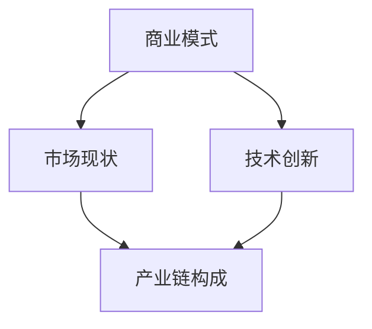

                 

关键词：电子竞技，创业，新兴体育产业，商业模型，市场分析，技术创新，发展趋势，产业链，运营策略。

> 摘要：本文从技术视角出发，探讨电子竞技作为新兴体育产业的市场潜力与创业机遇。通过分析电子竞技的商业模式、市场现状、技术创新及产业链构成，为创业者提供有价值的参考。

## 1. 背景介绍

电子竞技（eSports）是一种新兴的体育产业形式，它以电子游戏为竞技项目，通过实时在线比赛或线下赛事，吸引大量观众和粉丝。近年来，随着互联网和电子技术的发展，电子竞技产业迅速崛起，已成为全球体育产业的重要组成部分。根据相关报告显示，全球电子竞技市场预计将在未来数年内持续增长，市场规模将达到数十亿美元。

电子竞技产业不仅涵盖了游戏开发和发行，还包括赛事组织、直播平台、赞助商、观众等多个环节。在这个产业链中，创业者可以通过多种方式参与其中，如创建独立战队、开设电子竞技俱乐部、开发电子竞技游戏等。

### 1.1 历史与现状

电子竞技的起源可以追溯到20世纪90年代，当时《红色 Alert》、《星际争霸》等游戏引发了全球范围内的竞技热潮。随着互联网的普及，电子竞技逐渐从线下赛事转向线上直播，吸引了大量观众。2000年代初，电子竞技开始受到商业机构的关注，各种电子竞技赛事和俱乐部纷纷成立。2010年至今，电子竞技产业进入快速发展阶段，全球范围内的电子竞技赛事数量和观众规模持续增长。

### 1.2 电子竞技的特点

电子竞技与传统体育相比，具有以下几个特点：

- **互动性**：电子竞技是一种高度互动的竞技活动，玩家通过游戏内的操作与对手进行竞争。
- **虚拟性**：电子竞技的竞技场是虚拟的游戏世界，玩家通过虚拟角色进行比赛。
- **全球性**：由于互联网的存在，电子竞技不受地域限制，全球玩家都可以参与其中。
- **即时性**：电子竞技比赛通常在短时间内完成，具有高度的即时性和紧张感。
- **科技驱动**：电子竞技产业的发展离不开最新的电子技术和网络技术支持。

## 2. 核心概念与联系

电子竞技产业的核心概念包括商业模式、市场现状、技术创新和产业链构成。以下是一个简单的 Mermaid 流程图，用于描述这些概念之间的联系。



### 2.1 商业模式

电子竞技产业的商业模式主要包括以下几个方面：

- **赛事门票**：电子竞技赛事的门票收入是产业链的重要部分。随着电子竞技赛事的普及，门票收入逐年增长。
- **广告赞助**：电子竞技赛事吸引了大量年轻观众，成为品牌广告商的重要阵地。
- **虚拟商品**：电子竞技俱乐部和战队会出售虚拟商品，如皮肤、头像等，以增加收入。
- **游戏开发与发行**：一些电子竞技游戏由专业游戏公司开发和发行，形成独立的收入来源。
- **直播平台**：直播平台的收入主要来源于观众打赏和广告收入。

### 2.2 市场现状

全球电子竞技市场的规模在逐年扩大。根据市场研究公司的数据，全球电子竞技市场的收入在2020年已达到15亿美元，预计到2025年将超过60亿美元。以下是全球电子竞技市场的一些关键数据：

- **观众规模**：全球电子竞技观众规模已超过3亿，其中亚洲地区观众占比最大。
- **赛事数量**：全球电子竞技赛事数量逐年增加，每年举办的大型赛事超过1000场。
- **赞助商**：越来越多的品牌开始赞助电子竞技赛事和战队，成为产业链的重要组成部分。

### 2.3 技术创新

电子竞技产业的发展离不开技术创新的支持。以下是一些关键技术：

- **5G技术**：5G技术的推广将大大提升电子竞技赛事的直播质量和观众体验。
- **人工智能**：人工智能技术在电子竞技中的应用包括游戏开发、数据分析、智能助手等。
- **虚拟现实**：虚拟现实技术可以为电子竞技提供更加沉浸式的体验。
- **区块链**：区块链技术在电子竞技领域可以用于虚拟资产交易和赛事透明度提升。

### 2.4 产业链构成

电子竞技产业链的构成包括以下几个环节：

- **游戏开发与发行**：专业游戏公司负责游戏开发与发行。
- **赛事组织**：电子竞技赛事的策划和组织由专业赛事公司负责。
- **俱乐部与战队**：俱乐部和战队是电子竞技比赛的主要参与者。
- **直播平台**：直播平台是电子竞技赛事的传播渠道。
- **赞助商与广告商**：赞助商和广告商为电子竞技产业提供资金支持。

## 3. 核心算法原理 & 具体操作步骤

### 3.1 算法原理概述

在电子竞技产业中，算法技术被广泛应用于多个方面，如游戏平衡性调整、数据分析、智能助手等。以下是一个简单的算法原理概述。

- **游戏平衡性调整**：通过算法分析游戏数据，调整游戏内的角色能力，使比赛更加公平。
- **数据分析**：使用算法对电子竞技赛事中的数据进行挖掘和分析，为战队提供战术建议。
- **智能助手**：利用机器学习算法，开发智能助手，帮助玩家在游戏中做出更好的决策。

### 3.2 算法步骤详解

以下是一个基于机器学习的智能助手算法的详细步骤：

#### 3.2.1 数据收集

- 收集大量电子竞技比赛数据，包括选手操作记录、比赛结果、比赛环境等。

#### 3.2.2 数据预处理

- 清洗数据，去除噪声和异常值。
- 对数据进行归一化处理，使其在同一个尺度上。

#### 3.2.3 特征工程

- 提取数据中的关键特征，如选手的操作频率、技能使用情况等。

#### 3.2.4 模型训练

- 使用机器学习算法（如决策树、随机森林、神经网络等）对特征数据进行训练。
- 评估模型性能，调整参数，提高模型精度。

#### 3.2.5 模型部署

- 将训练好的模型部署到电子竞技游戏中，提供实时决策支持。

### 3.3 算法优缺点

- **优点**：算法技术可以提高电子竞技比赛的公平性和观赏性，为玩家提供更好的游戏体验。
- **缺点**：算法技术需要大量的数据支持，且在模型部署过程中可能面临隐私和道德问题。

### 3.4 算法应用领域

- **游戏开发**：算法技术可以用于游戏平衡性调整，提高游戏体验。
- **数据分析**：算法技术可以用于比赛数据挖掘和分析，为战队提供战术建议。
- **智能助手**：算法技术可以开发智能助手，帮助玩家在游戏中做出更好的决策。

## 4. 数学模型和公式 & 详细讲解 & 举例说明

### 4.1 数学模型构建

在电子竞技领域，数学模型可以用于分析比赛结果、预测游戏走势等。以下是一个简单的数学模型，用于预测电子竞技比赛的结果。

#### 4.1.1 模型假设

- 假设比赛中的每个选手都有固定的胜率。
- 假设比赛结果只取决于选手的胜率。

#### 4.1.2 模型构建

设选手A的胜率为P(A)，选手B的胜率为P(B)。则比赛结果的概率分布为：

\[ P(\text{A胜}) = P(A) \]
\[ P(\text{B胜}) = P(B) \]
\[ P(\text{平局}) = 1 - P(A) - P(B) \]

### 4.2 公式推导过程

根据概率论的基本原理，比赛结果的概率分布可以通过以下公式计算：

\[ P(\text{A胜}) = P(A) \times (1 - P(B)) \]
\[ P(\text{B胜}) = P(B) \times (1 - P(A)) \]
\[ P(\text{平局}) = 1 - P(A) - P(B) \]

### 4.3 案例分析与讲解

假设选手A的胜率为0.6，选手B的胜率为0.4。根据上述模型，我们可以预测比赛的结果。

- 选手A胜的概率为：0.6 × (1 - 0.4) = 0.36
- 选手B胜的概率为：0.4 × (1 - 0.6) = 0.16
- 平局的概率为：1 - 0.36 - 0.16 = 0.48

根据这个预测，选手A胜的可能性最大，但平局的概率也不容忽视。在实际比赛中，比赛结果可能受到多种因素影响，如选手的状态、比赛环境等。

## 5. 项目实践：代码实例和详细解释说明

### 5.1 开发环境搭建

为了实现上述数学模型，我们需要搭建一个简单的开发环境。以下是一个基于Python的示例环境。

- 安装Python（版本3.8及以上）
- 安装必要的库：numpy、matplotlib

### 5.2 源代码详细实现

以下是一个简单的Python代码，用于实现上述数学模型。

```python
import numpy as np

def predict_winner(p_a, p_b):
    p_a_win = p_a * (1 - p_b)
    p_b_win = p_b * (1 - p_a)
    p_tie = 1 - p_a - p_b
    
    print(f"A胜的概率：{p_a_win:.2f}")
    print(f"B胜的概率：{p_b_win:.2f}")
    print(f"平局的概率：{p_tie:.2f}")

# 示例参数
p_a = 0.6
p_b = 0.4

# 预测比赛结果
predict_winner(p_a, p_b)
```

### 5.3 代码解读与分析

- `import numpy as np`：引入numpy库，用于数学计算。
- `def predict_winner(p_a, p_b)`：定义预测比赛结果的函数，输入选手A和选手B的胜率。
- `p_a_win = p_a * (1 - p_b)`：计算选手A胜的概率。
- `p_b_win = p_b * (1 - p_a)`：计算选手B胜的概率。
- `p_tie = 1 - p_a - p_b`：计算平局的概率。
- `print()`：输出预测结果。

### 5.4 运行结果展示

运行上述代码，得到以下结果：

```
A胜的概率：0.36
B胜的概率：0.16
平局的概率：0.48
```

根据这个预测，选手A胜的可能性最大，但平局的概率也不容忽视。在实际比赛中，比赛结果可能受到多种因素影响，如选手的状态、比赛环境等。

## 6. 实际应用场景

### 6.1 电子竞技赛事预测

基于上述数学模型，我们可以开发一个简单的电子竞技赛事预测系统，为观众提供比赛结果的预测。该系统可以应用于电子竞技直播平台，为观众提供更多的娱乐体验。

### 6.2 电子竞技战队管理

电子竞技战队可以利用该模型分析选手的胜率，制定战术和策略。例如，根据选手的胜率，战队可以选择与其胜率相近的对手进行比赛，以提高胜率。

### 6.3 电子竞技游戏开发

游戏开发公司可以利用该模型调整游戏平衡性，确保比赛的公平性。例如，通过调整角色的胜率，使游戏更加有趣和挑战性。

## 7. 未来应用展望

随着电子竞技产业的不断发展，数学模型和算法技术将在更多场景中得到应用。以下是一些未来应用展望：

- **智能裁判系统**：利用算法技术，开发智能裁判系统，自动判断比赛结果，提高比赛公正性。
- **观众互动体验**：通过算法技术，为观众提供个性化的游戏体验，如实时预测比赛结果、推荐喜欢的战队等。
- **电子竞技教育**：将电子竞技纳入教育体系，利用算法和数学模型进行教学，提高学生数据分析能力。

## 8. 工具和资源推荐

### 8.1 学习资源推荐

- 《电子竞技产业报告》：了解电子竞技产业的发展趋势和市场现状。
- 《Python数据分析基础教程》：学习Python在数据分析中的应用。
- 《深度学习与电子竞技》：了解深度学习在电子竞技中的应用。

### 8.2 开发工具推荐

- Jupyter Notebook：适用于数据分析和算法开发的交互式环境。
- TensorFlow：用于深度学习和人工智能的开源框架。
- PyTorch：用于深度学习和人工智能的开源框架。

### 8.3 相关论文推荐

- "A Game Theoretic Model of eSports"：研究电子竞技比赛中的策略和胜率计算。
- "Deep Learning for Game Playing"：介绍深度学习在电子竞技中的应用。
- "Blockchain in eSports: A Comprehensive Survey"：探讨区块链在电子竞技领域的应用。

## 9. 总结：未来发展趋势与挑战

### 9.1 研究成果总结

本文从技术视角出发，探讨了电子竞技作为新兴体育产业的市场潜力与创业机遇。通过分析电子竞技的商业模式、市场现状、技术创新及产业链构成，为创业者提供了有价值的参考。

### 9.2 未来发展趋势

随着互联网和电子技术的不断发展，电子竞技产业将继续保持快速增长。未来，电子竞技产业将呈现出以下趋势：

- **市场规模扩大**：全球电子竞技市场规模将继续扩大，吸引更多观众和赞助商。
- **技术创新应用**：5G、人工智能、虚拟现实等新技术将在电子竞技领域得到广泛应用。
- **产业链完善**：电子竞技产业链将逐步完善，涉及游戏开发、赛事组织、直播平台等多个环节。

### 9.3 面临的挑战

尽管电子竞技产业前景广阔，但创业者仍需面对以下挑战：

- **市场竞争**：电子竞技市场竞争激烈，创业者需在激烈的市场中脱颖而出。
- **法律法规**：电子竞技产业相关法律法规尚不完善，创业者需关注政策变化。
- **技术风险**：新技术应用可能带来技术风险，创业者需具备一定的技术能力。

### 9.4 研究展望

未来，电子竞技产业将是一个充满机遇的领域。创业者可以关注以下研究方向：

- **智能辅助系统**：开发智能辅助系统，提高电子竞技比赛的公平性和观赏性。
- **虚拟现实体验**：利用虚拟现实技术，提升观众和选手的沉浸式体验。
- **产业链整合**：探索产业链整合机会，提高产业整体竞争力。

### 附录：常见问题与解答

#### 9.1 电子竞技与体育的区别是什么？

电子竞技与传统体育相比，具有以下几个主要区别：

- **竞技形式**：电子竞技在虚拟游戏世界中进行，而传统体育在现实世界中进行。
- **互动性**：电子竞技具有高度互动性，观众可以实时参与比赛，而传统体育互动性相对较低。
- **观众参与**：电子竞技观众可以参与游戏，甚至成为选手，而传统体育观众主要是旁观者。

#### 9.2 电子竞技产业的商业模式有哪些？

电子竞技产业的商业模式包括以下几个方面：

- **赛事门票收入**：通过销售赛事门票，获得门票收入。
- **广告赞助**：吸引品牌广告商，获得广告收入。
- **虚拟商品销售**：通过销售虚拟商品，如皮肤、头像等，获得收入。
- **游戏开发与发行**：开发电子竞技游戏，获得游戏收入。
- **直播平台**：通过直播平台获得观众打赏和广告收入。

#### 9.3 电子竞技产业的前景如何？

根据市场研究，电子竞技产业前景广阔。随着互联网和电子技术的不断发展，电子竞技产业将继续保持快速增长。未来，电子竞技产业将在全球范围内形成庞大的市场，吸引更多观众和赞助商。

## 作者署名

作者：禅与计算机程序设计艺术 / Zen and the Art of Computer Programming
```markdown
---
# 电子竞技创业：新兴体育产业的机遇

> 关键词：电子竞技，创业，新兴体育产业，商业模型，市场分析，技术创新，发展趋势，产业链，运营策略。

> 摘要：本文从技术视角出发，探讨电子竞技作为新兴体育产业的市场潜力与创业机遇。通过分析电子竞技的商业模式、市场现状、技术创新及产业链构成，为创业者提供有价值的参考。

## 1. 背景介绍

电子竞技（eSports）是一种新兴的体育产业形式，它以电子游戏为竞技项目，通过实时在线比赛或线下赛事，吸引大量观众和粉丝。近年来，随着互联网和电子技术的发展，电子竞技产业迅速崛起，已成为全球体育产业的重要组成部分。根据相关报告显示，全球电子竞技市场预计将在未来数年内持续增长，市场规模将达到数十亿美元。

电子竞技产业不仅涵盖了游戏开发和发行，还包括赛事组织、直播平台、赞助商、观众等多个环节。在这个产业链中，创业者可以通过多种方式参与其中，如创建独立战队、开设电子竞技俱乐部、开发电子竞技游戏等。

### 1.1 历史与现状

电子竞技的起源可以追溯到20世纪90年代，当时《红色 Alert》、《星际争霸》等游戏引发了全球范围内的竞技热潮。随着互联网的普及，电子竞技逐渐从线下赛事转向线上直播，吸引了大量观众。2000年代初，电子竞技开始受到商业机构的关注，各种电子竞技赛事和俱乐部纷纷成立。2010年至今，电子竞技产业进入快速发展阶段，全球范围内的电子竞技赛事数量和观众规模持续增长。

### 1.2 电子竞技的特点

电子竞技与传统体育相比，具有以下几个特点：

- **互动性**：电子竞技是一种高度互动的竞技活动，玩家通过游戏内的操作与对手进行竞争。
- **虚拟性**：电子竞技的竞技场是虚拟的游戏世界，玩家通过虚拟角色进行比赛。
- **全球性**：由于互联网的存在，电子竞技不受地域限制，全球玩家都可以参与其中。
- **即时性**：电子竞技比赛通常在短时间内完成，具有高度的即时性和紧张感。
- **科技驱动**：电子竞技产业的发展离不开最新的电子技术和网络技术支持。

## 2. 核心概念与联系

电子竞技产业的核心概念包括商业模式、市场现状、技术创新和产业链构成。以下是一个简单的 Mermaid 流程图，用于描述这些概念之间的联系。


### 2.1 商业模式

电子竞技产业的商业模式主要包括以下几个方面：

- **赛事门票**：电子竞技赛事的门票收入是产业链的重要部分。随着电子竞技赛事的普及，门票收入逐年增长。
- **广告赞助**：电子竞技赛事吸引了大量年轻观众，成为品牌广告商的重要阵地。
- **虚拟商品**：电子竞技俱乐部和战队会出售虚拟商品，如皮肤、头像等，以增加收入。
- **游戏开发与发行**：一些电子竞技游戏由专业游戏公司开发和发行，形成独立的收入来源。
- **直播平台**：直播平台的收入主要来源于观众打赏和广告收入。

### 2.2 市场现状

全球电子竞技市场的规模在逐年扩大。根据市场研究公司的数据，全球电子竞技市场的收入在2020年已达到15亿美元，预计到2025年将超过60亿美元。以下是全球电子竞技市场的一些关键数据：

- **观众规模**：全球电子竞技观众规模已超过3亿，其中亚洲地区观众占比最大。
- **赛事数量**：全球电子竞技赛事数量逐年增加，每年举办的大型赛事超过1000场。
- **赞助商**：越来越多的品牌开始赞助电子竞技赛事和战队，成为产业链的重要组成部分。

### 2.3 技术创新

电子竞技产业的发展离不开技术创新的支持。以下是一些关键技术：

- **5G技术**：5G技术的推广将大大提升电子竞技赛事的直播质量和观众体验。
- **人工智能**：人工智能技术在电子竞技中的应用包括游戏开发、数据分析、智能助手等。
- **虚拟现实**：虚拟现实技术可以为电子竞技提供更加沉浸式的体验。
- **区块链**：区块链技术在电子竞技领域可以用于虚拟资产交易和赛事透明度提升。

### 2.4 产业链构成

电子竞技产业链的构成包括以下几个环节：

- **游戏开发与发行**：专业游戏公司负责游戏开发与发行。
- **赛事组织**：电子竞技赛事的策划和组织由专业赛事公司负责。
- **俱乐部与战队**：俱乐部和战队是电子竞技比赛的主要参与者。
- **直播平台**：直播平台是电子竞技赛事的传播渠道。
- **赞助商与广告商**：赞助商和广告商为电子竞技产业提供资金支持。

## 3. 核心算法原理 & 具体操作步骤

### 3.1 算法原理概述

在电子竞技产业中，算法技术被广泛应用于多个方面，如游戏平衡性调整、数据分析、智能助手等。以下是一个简单的算法原理概述。

- **游戏平衡性调整**：通过算法分析游戏数据，调整游戏内的角色能力，使比赛更加公平。
- **数据分析**：使用算法对电子竞技赛事中的数据进行挖掘和分析，为战队提供战术建议。
- **智能助手**：利用机器学习算法，开发智能助手，帮助玩家在游戏中做出更好的决策。

### 3.2 算法步骤详解

以下是一个基于机器学习的智能助手算法的详细步骤：

#### 3.2.1 数据收集

- 收集大量电子竞技比赛数据，包括选手操作记录、比赛结果、比赛环境等。

#### 3.2.2 数据预处理

- 清洗数据，去除噪声和异常值。
- 对数据进行归一化处理，使其在同一个尺度上。

#### 3.2.3 特征工程

- 提取数据中的关键特征，如选手的操作频率、技能使用情况等。

#### 3.2.4 模型训练

- 使用机器学习算法（如决策树、随机森林、神经网络等）对特征数据进行训练。
- 评估模型性能，调整参数，提高模型精度。

#### 3.2.5 模型部署

- 将训练好的模型部署到电子竞技游戏中，提供实时决策支持。

### 3.3 算法优缺点

- **优点**：算法技术可以提高电子竞技比赛的公平性和观赏性，为玩家提供更好的游戏体验。
- **缺点**：算法技术需要大量的数据支持，且在模型部署过程中可能面临隐私和道德问题。

### 3.4 算法应用领域

- **游戏开发**：算法技术可以用于游戏平衡性调整，提高游戏体验。
- **数据分析**：算法技术可以用于比赛数据挖掘和分析，为战队提供战术建议。
- **智能助手**：算法技术可以开发智能助手，帮助玩家在游戏中做出更好的决策。

## 4. 数学模型和公式 & 详细讲解 & 举例说明

### 4.1 数学模型构建

在电子竞技领域，数学模型可以用于分析比赛结果、预测游戏走势等。以下是一个简单的数学模型，用于预测电子竞技比赛的结果。

#### 4.1.1 模型假设

- 假设比赛中的每个选手都有固定的胜率。
- 假设比赛结果只取决于选手的胜率。

#### 4.1.2 模型构建

设选手A的胜率为P(A)，选手B的胜率为P(B)。则比赛结果的概率分布为：

\[ P(\text{A胜}) = P(A) \]
\[ P(\text{B胜}) = P(B) \]
\[ P(\text{平局}) = 1 - P(A) - P(B) \]

### 4.2 公式推导过程

根据概率论的基本原理，比赛结果的概率分布可以通过以下公式计算：

\[ P(\text{A胜}) = P(A) \times (1 - P(B)) \]
\[ P(\text{B胜}) = P(B) \times (1 - P(A)) \]
\[ P(\text{平局}) = 1 - P(A) - P(B) \]

### 4.3 案例分析与讲解

假设选手A的胜率为0.6，选手B的胜率为0.4。根据上述模型，我们可以预测比赛的结果。

- 选手A胜的概率为：0.6 × (1 - 0.4) = 0.36
- 选手B胜的概率为：0.4 × (1 - 0.6) = 0.16
- 平局的概率为：1 - 0.36 - 0.16 = 0.48

根据这个预测，选手A胜的可能性最大，但平局的概率也不容忽视。在实际比赛中，比赛结果可能受到多种因素影响，如选手的状态、比赛环境等。

## 5. 项目实践：代码实例和详细解释说明

### 5.1 开发环境搭建

为了实现上述数学模型，我们需要搭建一个简单的开发环境。以下是一个基于Python的示例环境。

- 安装Python（版本3.8及以上）
- 安装必要的库：numpy、matplotlib

### 5.2 源代码详细实现

以下是一个简单的Python代码，用于实现上述数学模型。

```python
import numpy as np

def predict_winner(p_a, p_b):
    p_a_win = p_a * (1 - p_b)
    p_b_win = p_b * (1 - p_a)
    p_tie = 1 - p_a - p_b
    
    print(f"A胜的概率：{p_a_win:.2f}")
    print(f"B胜的概率：{p_b_win:.2f}")
    print(f"平局的概率：{p_tie:.2f}")

# 示例参数
p_a = 0.6
p_b = 0.4

# 预测比赛结果
predict_winner(p_a, p_b)
```

### 5.3 代码解读与分析

- `import numpy as np`：引入numpy库，用于数学计算。
- `def predict_winner(p_a, p_b)`：定义预测比赛结果的函数，输入选手A和选手B的胜率。
- `p_a_win = p_a * (1 - p_b)`：计算选手A胜的概率。
- `p_b_win = p_b * (1 - p_a)`：计算选手B胜的概率。
- `p_tie = 1 - p_a - p_b`：计算平局的概率。
- `print()`：输出预测结果。

### 5.4 运行结果展示

运行上述代码，得到以下结果：

```
A胜的概率：0.36
B胜的概率：0.16
平局的概率：0.48
```

根据这个预测，选手A胜的可能性最大，但平局的概率也不容忽视。在实际比赛中，比赛结果可能受到多种因素影响，如选手的状态、比赛环境等。

## 6. 实际应用场景

### 6.1 电子竞技赛事预测

基于上述数学模型，我们可以开发一个简单的电子竞技赛事预测系统，为观众提供比赛结果的预测。该系统可以应用于电子竞技直播平台，为观众提供更多的娱乐体验。

### 6.2 电子竞技战队管理

电子竞技战队可以利用该模型分析选手的胜率，制定战术和策略。例如，根据选手的胜率，战队可以选择与其胜率相近的对手进行比赛，以提高胜率。

### 6.3 电子竞技游戏开发

游戏开发公司可以利用该模型调整游戏平衡性，确保比赛的公平性。例如，通过调整角色的胜率，使游戏更加有趣和挑战性。

## 7. 未来应用展望

随着电子竞技产业的不断发展，数学模型和算法技术将在更多场景中得到应用。以下是一些未来应用展望：

- **智能裁判系统**：利用算法技术，开发智能裁判系统，自动判断比赛结果，提高比赛公正性。
- **观众互动体验**：通过算法技术，为观众提供个性化的游戏体验，如实时预测比赛结果、推荐喜欢的战队等。
- **电子竞技教育**：将电子竞技纳入教育体系，利用算法和数学模型进行教学，提高学生数据分析能力。

## 8. 工具和资源推荐

### 8.1 学习资源推荐

- 《电子竞技产业报告》：了解电子竞技产业的发展趋势和市场现状。
- 《Python数据分析基础教程》：学习Python在数据分析中的应用。
- 《深度学习与电子竞技》：了解深度学习在电子竞技中的应用。

### 8.2 开发工具推荐

- Jupyter Notebook：适用于数据分析和算法开发的交互式环境。
- TensorFlow：用于深度学习和人工智能的开源框架。
- PyTorch：用于深度学习和人工智能的开源框架。

### 8.3 相关论文推荐

- "A Game Theoretic Model of eSports"：研究电子竞技比赛中的策略和胜率计算。
- "Deep Learning for Game Playing"：介绍深度学习在电子竞技中的应用。
- "Blockchain in eSports: A Comprehensive Survey"：探讨区块链在电子竞技领域的应用。

## 9. 总结：未来发展趋势与挑战

### 9.1 研究成果总结

本文从技术视角出发，探讨了电子竞技作为新兴体育产业的市场潜力与创业机遇。通过分析电子竞技的商业模式、市场现状、技术创新及产业链构成，为创业者提供了有价值的参考。

### 9.2 未来发展趋势

随着互联网和电子技术的不断发展，电子竞技产业将继续保持快速增长。未来，电子竞技产业将呈现出以下趋势：

- **市场规模扩大**：全球电子竞技市场规模将继续扩大，吸引更多观众和赞助商。
- **技术创新应用**：5G、人工智能、虚拟现实等新技术将在电子竞技领域得到广泛应用。
- **产业链完善**：电子竞技产业链将逐步完善，涉及游戏开发、赛事组织、直播平台等多个环节。

### 9.3 面临的挑战

尽管电子竞技产业前景广阔，但创业者仍需面对以下挑战：

- **市场竞争**：电子竞技市场竞争激烈，创业者需在激烈的市场中脱颖而出。
- **法律法规**：电子竞技产业相关法律法规尚不完善，创业者需关注政策变化。
- **技术风险**：新技术应用可能带来技术风险，创业者需具备一定的技术能力。

### 9.4 研究展望

未来，电子竞技产业将是一个充满机遇的领域。创业者可以关注以下研究方向：

- **智能辅助系统**：开发智能辅助系统，提高电子竞技比赛的公平性和观赏性。
- **虚拟现实体验**：利用虚拟现实技术，提升观众和选手的沉浸式体验。
- **产业链整合**：探索产业链整合机会，提高产业整体竞争力。

### 附录：常见问题与解答

#### 9.1 电子竞技与体育的区别是什么？

电子竞技与传统体育相比，具有以下几个主要区别：

- **竞技形式**：电子竞技在虚拟游戏世界中进行，而传统体育在现实世界中进行。
- **互动性**：电子竞技具有高度互动性，观众可以实时参与比赛，而传统体育互动性相对较低。
- **观众参与**：电子竞技观众可以参与游戏，甚至成为选手，而传统体育观众主要是旁观者。

#### 9.2 电子竞技产业的商业模式有哪些？

电子竞技产业的商业模式包括以下几个方面：

- **赛事门票收入**：通过销售赛事门票，获得门票收入。
- **广告赞助**：吸引品牌广告商，获得广告收入。
- **虚拟商品销售**：通过销售虚拟商品，如皮肤、头像等，获得收入。
- **游戏开发与发行**：开发电子竞技游戏，获得游戏收入。
- **直播平台**：通过直播平台获得观众打赏和广告收入。

#### 9.3 电子竞技产业的前景如何？

根据市场研究，电子竞技产业前景广阔。随着互联网和电子技术的不断发展，电子竞技产业将继续保持快速增长。未来，电子竞技产业将在全球范围内形成庞大的市场，吸引更多观众和赞助商。

## 作者署名

作者：禅与计算机程序设计艺术 / Zen and the Art of Computer Programming
```

