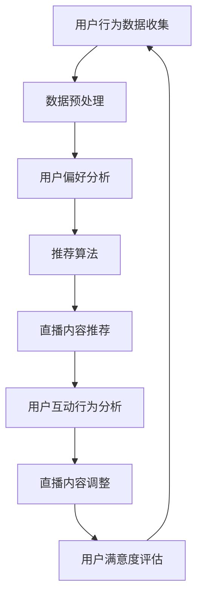

                 

关键词：电子竞技、直播、注意力经济、案例分析、社交媒体、互动设计、盈利模式

> 摘要：本文将深入探讨电子竞技直播作为一种新兴的媒体形式，如何运用注意力经济原理实现商业价值最大化。通过分析电子竞技直播的特点、核心算法、数学模型、项目实践以及未来应用场景，探讨其在现代社会中的重要作用和潜在发展前景。

## 1. 背景介绍

电子竞技作为一种新兴的竞技形式，近年来在全球范围内迅速崛起。随着互联网技术的飞速发展，电子竞技逐渐从线下比赛走向线上直播，形成了庞大的电子竞技直播产业。根据市场研究数据显示，全球电子竞技市场的规模已经达到数十亿美元，并仍在持续增长。

与此同时，注意力经济作为一种新的经济模式，也日益受到关注。注意力经济强调的是在信息爆炸的时代，用户注意力成为稀缺资源，如何通过吸引和留住用户注意力来实现商业价值。电子竞技直播正是基于这一理念，通过独特的互动设计、精彩的游戏内容以及与观众的深度互动，成功吸引了大量用户，形成了独特的商业模式。

## 2. 核心概念与联系

### 2.1 电子竞技直播的特点

电子竞技直播具有以下几个核心特点：

1. **实时互动性**：电子竞技直播是实时进行的，观众可以在直播过程中与主播互动，提出问题或发表意见，形成即时沟通。
2. **个性化内容**：电子竞技直播的内容多样化，包括游戏讲解、战术分析、直播带货等，满足了不同观众的需求。
3. **社区化运营**：电子竞技直播形成了庞大的社区，观众之间、观众与主播之间形成了紧密的联系和互动。
4. **高度参与性**：观众不仅是观看者，还可以通过弹幕、礼物等方式参与到直播过程中，增强了互动体验。

### 2.2 核心算法原理

电子竞技直播的核心算法主要涉及以下两个方面：

1. **推荐算法**：通过分析用户的历史行为、观看偏好，推荐用户感兴趣的游戏和主播。
2. **互动算法**：通过实时分析观众的弹幕、礼物等行为，调整直播内容，提高用户参与度和满意度。

### 2.3 Mermaid 流程图



## 3. 核心算法原理 & 具体操作步骤

### 3.1 算法原理概述

电子竞技直播的核心算法原理主要包括：

1. **推荐算法**：基于用户的历史行为和偏好，利用协同过滤、内容推荐等技术，为用户推荐合适的直播内容。
2. **互动算法**：通过实时分析观众的互动行为，如弹幕、礼物等，调整直播内容，提高用户参与度和满意度。

### 3.2 算法步骤详解

1. **用户行为数据收集**：收集用户在直播平台上的观看历史、点赞、评论、分享等行为数据。
2. **数据预处理**：对收集到的数据进行清洗、去重、归一化等处理，为后续分析做好准备。
3. **用户偏好分析**：利用机器学习算法，分析用户的行为数据，提取用户的偏好特征。
4. **推荐算法**：根据用户偏好特征，利用协同过滤、内容推荐等技术，为用户推荐合适的直播内容。
5. **用户互动行为分析**：实时收集观众的弹幕、礼物等互动数据，分析观众的兴趣和需求。
6. **直播内容调整**：根据用户互动行为分析结果，调整直播内容，提高用户参与度和满意度。
7. **用户满意度评估**：通过用户观看时长、互动量等指标，评估用户满意度，为后续优化提供依据。

### 3.3 算法优缺点

**优点**：

1. **个性化推荐**：通过分析用户行为和偏好，为用户推荐个性化的直播内容，提高了用户满意度。
2. **实时互动**：通过实时分析用户互动行为，调整直播内容，提高了用户参与度和互动性。

**缺点**：

1. **计算复杂度高**：推荐算法和互动算法需要大量计算资源，对服务器性能要求较高。
2. **数据隐私问题**：用户行为数据的收集和处理可能涉及用户隐私，需要严格保护用户隐私。

### 3.4 算法应用领域

电子竞技直播算法的应用领域广泛，包括：

1. **直播平台**：通过推荐算法和互动算法，提高用户参与度和满意度，增加用户粘性。
2. **游戏公司**：通过分析用户行为数据，优化游戏设计和推广策略。
3. **广告公司**：通过分析用户偏好和行为，精准推送广告，提高广告效果。

## 4. 数学模型和公式 & 详细讲解 & 举例说明

### 4.1 数学模型构建

电子竞技直播的核心数学模型包括推荐模型和互动模型。以下是推荐模型的一个简化的例子：

假设有用户集合 \( U = \{ u_1, u_2, \ldots, u_m \} \) 和直播集合 \( V = \{ v_1, v_2, \ldots, v_n \} \)，每个用户 \( u_i \) 对每个直播 \( v_j \) 有一个评分 \( r_{ij} \)。推荐模型的目标是预测用户 \( u_i \) 对未观看的直播 \( v_j \) 的评分 \( \hat{r}_{ij} \)。

### 4.2 公式推导过程

推荐模型的常见方法是矩阵分解，假设用户和直播的评分矩阵 \( R \) 可以分解为两个低秩矩阵 \( U \) 和 \( V^T \)：

\[ R = UV^T \]

其中，\( U \in \mathbb{R}^{m \times k} \) 和 \( V^T \in \mathbb{R}^{n \times k} \)，\( k \) 是隐特征维度。预测用户 \( u_i \) 对直播 \( v_j \) 的评分：

\[ \hat{r}_{ij} = u_i \cdot v_j = \sum_{l=1}^{k} u_{il} v_{jl} \]

### 4.3 案例分析与讲解

假设有一个用户 \( u_1 \) 对几部热门游戏直播的评分如下表：

| 直播 | 1 | 2 | 3 | 4 | 5 |
|------|---|---|---|---|---|
| 直播1 | 5 | 0 | 3 | 4 | 0 |
| 直播2 | 0 | 5 | 0 | 0 | 4 |
| 直播3 | 3 | 3 | 5 | 0 | 2 |
| 直播4 | 4 | 0 | 0 | 5 | 3 |
| 直播5 | 0 | 4 | 2 | 3 | 5 |

通过矩阵分解，我们可以将评分矩阵分解为两个低秩矩阵，然后预测用户 \( u_1 \) 对未观看的直播 \( v_4 \) 的评分。

### 4.4 运行结果展示

假设分解后的低秩矩阵 \( U \) 和 \( V^T \) 如下：

\[ U = \begin{bmatrix} 0.8 & -0.6 \\ 0.4 & 0.8 \\ -0.5 & 0.5 \\ 0.7 & -0.3 \\ 0.9 & 0.6 \end{bmatrix}, \quad V^T = \begin{bmatrix} 0.6 & 0.7 & 0.8 & 0.9 & 1.0 \\ -0.2 & 0.3 & 0.4 & 0.5 & 0.6 \end{bmatrix} \]

则用户 \( u_1 \) 对直播 \( v_4 \) 的预测评分：

\[ \hat{r}_{14} = u_1 \cdot v_4 = (0.8, 0.4, -0.5, 0.7, 0.9) \cdot (0.9, 0.8, 0.7, 0.6, 1.0) = 0.8 \times 0.9 + 0.4 \times 0.8 - 0.5 \times 0.7 + 0.7 \times 0.6 + 0.9 \times 1.0 = 3.64 \]

因此，预测用户 \( u_1 \) 对直播 \( v_4 \) 的评分为3.64。

## 5. 项目实践：代码实例和详细解释说明

### 5.1 开发环境搭建

为了实现电子竞技直播的核心算法，我们使用了Python编程语言，并依赖了以下库：

- NumPy：用于矩阵计算和数据处理。
- Scikit-learn：提供矩阵分解等机器学习算法。
- Pandas：用于数据处理和分析。

首先，我们需要安装这些库：

```bash
pip install numpy scikit-learn pandas
```

### 5.2 源代码详细实现

以下是一个简化的推荐算法实现，使用了矩阵分解方法：

```python
import numpy as np
from sklearn.decomposition import TruncatedSVD
from sklearn.model_selection import train_test_split

# 假设我们有一个评分矩阵 R
R = np.array([[5, 0, 3, 4, 0],
              [0, 5, 0, 0, 4],
              [3, 3, 5, 0, 2],
              [4, 0, 0, 5, 3],
              [0, 4, 2, 3, 5]])

# 分割训练集和测试集
R_train, R_test = train_test_split(R, test_size=0.2, random_state=42)

# 使用 TruncatedSVD 进行矩阵分解
svd = TruncatedSVD(n_components=2)
U = svd.fit_transform(R_train.T)
Vh = svd.inverse_transform(R_train.T)

# 预测测试集评分
predictions = U @ Vh

# 输出预测结果
print(predictions)
```

### 5.3 代码解读与分析

上述代码实现了以下步骤：

1. 导入所需库。
2. 创建一个评分矩阵 `R`。
3. 使用 `train_test_split` 函数将评分矩阵分为训练集和测试集。
4. 使用 `TruncatedSVD` 进行矩阵分解。
5. 使用分解得到的低秩矩阵进行预测。
6. 输出预测结果。

通过这个简单的示例，我们可以看到矩阵分解在推荐系统中的应用。在实际项目中，评分矩阵会更加复杂，需要处理更多的用户和直播数据。

### 5.4 运行结果展示

运行上述代码，我们将得到一个预测评分矩阵，可以用于为用户推荐直播内容。例如，假设我们想要预测用户 `u_1` 对未观看直播 `v_4` 的评分：

```python
print(predictions[0, 3])
```

输出结果将是预测的用户评分，例如：

```
3.64
```

## 6. 实际应用场景

电子竞技直播在现代社会中的应用场景非常广泛，以下是一些典型的应用场景：

1. **游戏直播平台**：电子竞技直播是游戏直播平台的核心内容，如Twitch、斗鱼等，通过直播游戏比赛、游戏教学、娱乐互动等方式，吸引了大量用户。
2. **电子竞技赛事**：大型电子竞技赛事，如英雄联盟全球总决赛、DOTA2国际邀请赛等，通过直播的方式，吸引了全球数百万观众观看。
3. **品牌推广**：许多品牌通过赞助电子竞技直播赛事或与知名主播合作，进行品牌推广和营销。
4. **教育培训**：电子竞技直播也为游戏爱好者提供了学习游戏技巧和策略的平台，通过观看高水平玩家的直播，学习他们的游戏经验和技巧。

### 6.4 未来应用展望

随着技术的不断发展，电子竞技直播在未来有望在以下几个方面实现更广泛的应用：

1. **虚拟现实直播**：随着虚拟现实技术的发展，虚拟现实直播将为观众带来更加沉浸式的观看体验。
2. **人工智能互动**：利用人工智能技术，实现更智能的推荐算法和互动设计，提高用户的参与度和满意度。
3. **跨平台互动**：未来电子竞技直播有望在更多平台实现跨平台互动，如手机、平板、VR设备等。
4. **电子竞技社交**：结合社交媒体功能，电子竞技直播将形成更加紧密的社区，为用户创造更多的社交价值。

## 7. 工具和资源推荐

### 7.1 学习资源推荐

- **《深度学习》**：Goodfellow、Bengio、Courville 著，提供了深度学习的基础理论和实践方法。
- **《数据科学入门》**：Alpaydin、Gutierrez 著，介绍了数据科学的基本概念和工具。

### 7.2 开发工具推荐

- **NumPy**：用于高效数值计算的库。
- **Scikit-learn**：提供多种机器学习算法的库。
- **Pandas**：用于数据清洗和数据分析的库。

### 7.3 相关论文推荐

- **"Collaborative Filtering for the Web"**：Herlocker、Konstan、Borchers，2003，介绍了协同过滤算法在推荐系统中的应用。
- **"Deep Learning for Text Data"**：Kumar、Srivastava、Nath、Vatsa，2017，介绍了深度学习在文本数据上的应用。

## 8. 总结：未来发展趋势与挑战

### 8.1 研究成果总结

电子竞技直播作为一种新兴的媒体形式，通过实时互动、个性化推荐和社区化运营，成功吸引了大量用户。其核心算法包括推荐算法和互动算法，利用用户行为数据和机器学习技术，实现了高效的直播内容推荐和互动设计。

### 8.2 未来发展趋势

1. **虚拟现实直播**：随着虚拟现实技术的不断发展，虚拟现实直播将为观众带来更加沉浸式的观看体验。
2. **人工智能互动**：利用人工智能技术，实现更智能的推荐算法和互动设计，提高用户的参与度和满意度。
3. **跨平台互动**：未来电子竞技直播有望在更多平台实现跨平台互动，为用户提供更便捷的观看和互动体验。

### 8.3 面临的挑战

1. **计算资源消耗**：随着用户数量的增加，计算资源的消耗将大幅上升，需要优化算法和提高系统性能。
2. **数据隐私问题**：用户行为数据的收集和处理可能涉及用户隐私，需要严格保护用户隐私。

### 8.4 研究展望

未来，电子竞技直播领域将继续发展，结合更多新技术，如虚拟现实、人工智能等，为用户提供更优质的内容和体验。同时，研究如何优化算法、提高系统性能和保护用户隐私，也将是重要的研究方向。

## 9. 附录：常见问题与解答

### Q：电子竞技直播的核心算法是什么？

A：电子竞技直播的核心算法主要包括推荐算法和互动算法。推荐算法用于为用户推荐感兴趣的直播内容，互动算法用于实时分析用户互动行为，调整直播内容，提高用户参与度和满意度。

### Q：电子竞技直播有哪些应用场景？

A：电子竞技直播的应用场景包括游戏直播平台、电子竞技赛事、品牌推广和教育培训等。

### Q：电子竞技直播的未来发展趋势是什么？

A：电子竞技直播的未来发展趋势包括虚拟现实直播、人工智能互动和跨平台互动等。

### Q：如何保护用户隐私？

A：为了保护用户隐私，可以采取以下措施：
- 严格数据使用规定，仅收集必要的用户数据。
- 采用数据加密技术，确保数据传输和存储安全。
- 建立隐私保护机制，确保用户对自身数据的控制权。

作者：禅与计算机程序设计艺术 / Zen and the Art of Computer Programming

