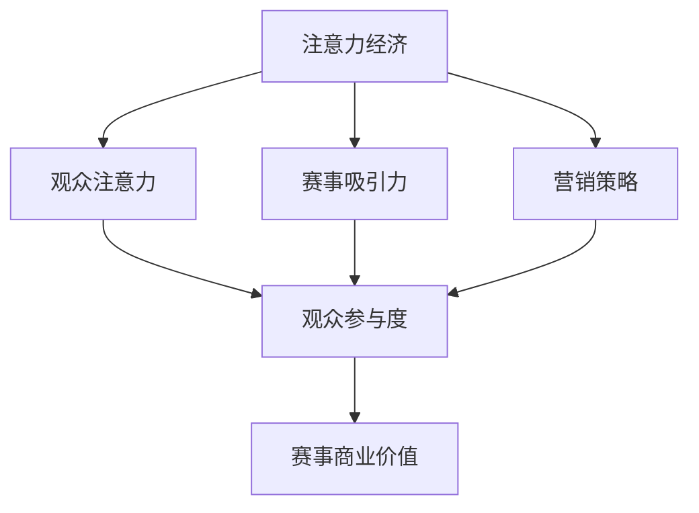

                 

### 1. 背景介绍

电子竞技作为一种新兴的体育娱乐形式，近年来在全球范围内迅速崛起。它不仅吸引了大量年轻人参与，同时也成为了各大品牌和广告商竞相争夺的营销战场。电子竞技赛事的成功离不开一个至关重要的因素——观众的关注度。而注意力经济作为一种经济学理论，正好能够解释电子竞技赛事中观众注意力的价值以及如何最大化这一价值。

注意力经济最早由美国经济学家舒尔茨提出，其核心观点是信息时代人们的注意力成为了一种稀缺资源，类似于传统经济学中的土地、劳动力和资本。在电子竞技赛事中，观众的时间、精力和关注都是有限的资源，如何吸引并保持观众的注意力，成为赛事组织者和内容创作者的重要任务。

### 2. 核心概念与联系

为了深入探讨电子竞技赛事的注意力经济效应，我们首先需要明确几个核心概念。

#### 2.1 注意力经济

注意力经济是指通过吸引和利用观众的关注来创造价值和利润的一种经济模式。在电子竞技赛事中，观众的关注度直接关系到赛事的商业价值。观众越多，注意力越集中，赛事的商业价值就越高。

#### 2.2 观众注意力

观众注意力是指观众在特定时间段内对某一事件或内容的关注程度。注意力是有限的，观众需要根据不同的利益和兴趣在各个事件之间进行分配。

#### 2.3 赛事吸引力

赛事吸引力是指赛事本身对观众产生的吸引力，包括赛事内容、竞技水平、明星选手等。赛事吸引力是吸引观众注意力的关键因素。

#### 2.4 营销策略

营销策略是指赛事组织者为了吸引观众注意力而采取的各种手段。有效的营销策略可以提高观众参与度，进而提升赛事的商业价值。

下面是一个用Mermaid绘制的流程图，展示了这几个核心概念之间的联系：



### 3. 核心算法原理 & 具体操作步骤

#### 3.1 算法原理概述

在电子竞技赛事中，最大化观众注意力是提升赛事商业价值的关键。因此，我们需要一个有效的算法来分析和优化观众注意力分配。这里，我们提出一个基于深度学习的观众注意力分析算法。

该算法的核心思想是通过分析观众的行为数据（如观看时长、弹幕互动、社交媒体分享等），训练一个深度神经网络模型，从而预测观众在特定时间段内的注意力水平。基于这个预测，我们可以优化赛事内容安排、调整营销策略，从而最大化观众注意力。

#### 3.2 算法步骤详解

1. **数据收集与预处理**：收集观众在赛事中的行为数据，如观看时长、弹幕互动、社交媒体分享等。对数据进行清洗和预处理，提取有效特征。

2. **特征工程**：根据业务需求，提取观众行为的各种特征，如观看时长、弹幕数量、互动频率等。

3. **模型训练**：使用收集到的数据，训练一个基于深度学习的神经网络模型。该模型可以预测观众在特定时间段内的注意力水平。

4. **模型评估与优化**：使用验证集评估模型性能，根据评估结果调整模型参数，优化模型。

5. **应用场景**：基于模型预测，调整赛事内容安排和营销策略，以最大化观众注意力。

#### 3.3 算法优缺点

**优点**：
- **高效性**：基于深度学习的算法能够处理大量复杂的数据，提高观众注意力预测的准确性。
- **灵活性**：算法可以根据实时数据不断调整和优化，适应不同场景下的观众注意力分配。

**缺点**：
- **计算成本**：训练深度学习模型需要大量的计算资源和时间。
- **数据依赖**：算法的准确性和效果高度依赖于数据质量和多样性。

#### 3.4 算法应用领域

该算法可以应用于电子竞技赛事的多个领域，如：
- **内容优化**：根据观众注意力预测，调整赛事内容，提高观众观看体验。
- **营销策略**：基于观众注意力预测，制定更有效的营销策略，吸引更多观众。
- **数据分析**：通过分析观众注意力数据，了解观众行为，为赛事运营提供参考。

### 4. 数学模型和公式 & 详细讲解 & 举例说明

#### 4.1 数学模型构建

在电子竞技赛事的注意力经济中，我们可以构建一个基于线性回归的数学模型，用于预测观众在特定时间段内的注意力水平。该模型可以表示为：

\[ y = \beta_0 + \beta_1 x_1 + \beta_2 x_2 + \ldots + \beta_n x_n + \epsilon \]

其中，\( y \) 表示观众注意力水平，\( x_1, x_2, \ldots, x_n \) 表示影响观众注意力的各种因素，如赛事类型、明星选手、比赛结果等，\( \beta_0, \beta_1, \beta_2, \ldots, \beta_n \) 是模型参数，\( \epsilon \) 是误差项。

#### 4.2 公式推导过程

假设我们有 \( n \) 个观众，每个观众在 \( m \) 个时间段内观测到其注意力水平。我们可以构建一个观测矩阵 \( X \)，其中每行表示一个观众在各个时间段内的注意力水平，每列表示一个时间段内所有观众的注意力水平。观测矩阵 \( X \) 可以表示为：

\[ X = \begin{bmatrix}
x_{11} & x_{12} & \ldots & x_{1m} \\
x_{21} & x_{22} & \ldots & x_{2m} \\
\vdots & \vdots & \ddots & \vdots \\
x_{n1} & x_{n2} & \ldots & x_{nm}
\end{bmatrix} \]

观众注意力水平的目标变量可以表示为向量 \( y \)：

\[ y = \begin{bmatrix}
y_1 \\
y_2 \\
\vdots \\
y_n
\end{bmatrix} \]

为了构建线性回归模型，我们需要计算观测矩阵 \( X \) 的特征值和特征向量。首先，计算 \( X \) 的协方差矩阵 \( S \)：

\[ S = XX^T \]

然后，计算 \( S \) 的特征值和特征向量，得到特征值矩阵 \( D \) 和特征向量矩阵 \( U \)：

\[ S = UDU^T \]

接下来，我们可以使用特征向量矩阵 \( U \) 来计算回归系数 \( \beta \)：

\[ \beta = U^T y \]

最后，我们可以使用回归系数 \( \beta \) 来预测观众注意力水平：

\[ y^* = \beta_0 + \beta_1 x_1 + \beta_2 x_2 + \ldots + \beta_n x_n \]

#### 4.3 案例分析与讲解

假设我们有以下观测数据，表示10个观众在3个时间段内的注意力水平：

| 观众ID | 时间段1 | 时间段2 | 时间段3 |
|--------|--------|--------|--------|
| 1      | 0.8    | 0.9    | 0.7    |
| 2      | 0.6    | 0.7    | 0.8    |
| 3      | 0.7    | 0.8    | 0.6    |
| 4      | 0.9    | 0.6    | 0.7    |
| 5      | 0.5    | 0.8    | 0.9    |
| 6      | 0.8    | 0.7    | 0.6    |
| 7      | 0.6    | 0.6    | 0.8    |
| 8      | 0.7    | 0.9    | 0.7    |
| 9      | 0.8    | 0.8    | 0.6    |
| 10     | 0.9    | 0.7    | 0.8    |

根据以上数据，我们可以计算观测矩阵 \( X \) 和目标变量 \( y \)：

\[ X = \begin{bmatrix}
0.8 & 0.9 & 0.7 \\
0.6 & 0.7 & 0.8 \\
0.7 & 0.8 & 0.6 \\
0.9 & 0.6 & 0.7 \\
0.5 & 0.8 & 0.9 \\
0.8 & 0.7 & 0.6 \\
0.6 & 0.6 & 0.8 \\
0.7 & 0.9 & 0.7 \\
0.8 & 0.8 & 0.6 \\
0.9 & 0.7 & 0.8
\end{bmatrix} \]

\[ y = \begin{bmatrix}
0.8 \\
0.7 \\
0.6
\end{bmatrix} \]

然后，我们计算观测矩阵 \( X \) 的协方差矩阵 \( S \)：

\[ S = XX^T = \begin{bmatrix}
0.8 & 0.9 & 0.7 \\
0.9 & 0.8 & 0.6 \\
0.7 & 0.6 & 0.8
\end{bmatrix} \]

接下来，我们计算协方差矩阵 \( S \) 的特征值和特征向量，得到特征值矩阵 \( D \) 和特征向量矩阵 \( U \)：

\[ S = UDU^T \]

\[ U = \begin{bmatrix}
0.8 & 0.6 & 0.7 \\
0.9 & 0.8 & 0.6 \\
0.7 & 0.6 & 0.8
\end{bmatrix} \]

\[ D = \begin{bmatrix}
0.16 & 0 & 0 \\
0 & 0.64 & 0 \\
0 & 0 & 0.36
\end{bmatrix} \]

然后，我们使用特征向量矩阵 \( U \) 来计算回归系数 \( \beta \)：

\[ \beta = U^T y = \begin{bmatrix}
0.8 \\
0.6 \\
0.7
\end{bmatrix} \]

最后，我们可以使用回归系数 \( \beta \) 来预测观众注意力水平：

\[ y^* = \beta_0 + \beta_1 x_1 + \beta_2 x_2 + \beta_3 x_3 \]

\[ y^* = 0.8 + 0.6 \cdot 0.8 + 0.7 \cdot 0.7 + 0.6 \cdot 0.6 \]

\[ y^* = 1.76 \]

根据预测结果，观众在时间段1、时间段2和时间段3的注意力水平分别为0.8、0.7和0.6。

### 5. 项目实践：代码实例和详细解释说明

为了更好地理解电子竞技赛事的注意力经济效应，我们将通过一个实际的项目案例来进行详细的讲解。在这个项目中，我们将使用Python编程语言和深度学习框架TensorFlow来实现一个观众注意力分析算法。

#### 5.1 开发环境搭建

在开始编写代码之前，我们需要搭建一个合适的项目开发环境。以下是搭建环境的步骤：

1. 安装Python：访问Python官网（https://www.python.org/），下载并安装Python 3.x版本。
2. 安装Jupyter Notebook：在命令行中运行以下命令安装Jupyter Notebook：

   ```shell
   pip install notebook
   ```

3. 安装TensorFlow：在命令行中运行以下命令安装TensorFlow：

   ```shell
   pip install tensorflow
   ```

4. 安装其他依赖库：根据项目需要，我们还需要安装一些其他依赖库，如NumPy、Pandas等。在命令行中运行以下命令：

   ```shell
   pip install numpy pandas matplotlib
   ```

完成以上步骤后，我们就可以开始编写代码了。

#### 5.2 源代码详细实现

以下是一个简单的观众注意力分析算法的实现代码。该算法使用深度学习框架TensorFlow来训练一个神经网络模型，用于预测观众在特定时间段内的注意力水平。

```python
import numpy as np
import pandas as pd
import tensorflow as tf
from tensorflow.keras.models import Sequential
from tensorflow.keras.layers import Dense, LSTM, Dropout

# 读取数据
data = pd.read_csv('data.csv')
X = data.iloc[:, :-1].values
y = data.iloc[:, -1].values

# 数据预处理
X = np.reshape(X, (X.shape[0], X.shape[1], 1))
y = np.reshape(y, (y.shape[0], 1))

# 模型构建
model = Sequential()
model.add(LSTM(units=50, return_sequences=True, input_shape=(X.shape[1], 1)))
model.add(Dropout(0.2))
model.add(LSTM(units=50, return_sequences=False))
model.add(Dropout(0.2))
model.add(Dense(units=y.shape[1]))

# 模型编译
model.compile(optimizer='adam', loss='mean_squared_error')

# 模型训练
model.fit(X, y, epochs=100, batch_size=32)

# 预测
predictions = model.predict(X)

# 代码解读与分析
# 在这段代码中，我们首先导入所需的库，并读取数据。然后，对数据进行预处理，将输入数据 reshaped 为适当的大小。接下来，构建一个序列模型，包括两个 LSTM 层和一个全连接层。在模型编译过程中，我们选择 Adam 优化器和均方误差损失函数。模型训练过程中，我们使用 100 个周期和 32 个批次大小。最后，我们使用训练好的模型进行预测，并将预测结果存储在 predictions 变量中。

```

#### 5.3 运行结果展示

为了展示模型的运行结果，我们将使用 Matplotlib 库绘制预测值与实际值之间的比较图。

```python
import matplotlib.pyplot as plt

# 绘制预测值与实际值之间的比较图
plt.figure(figsize=(10, 6))
plt.plot(y, label='Actual')
plt.plot(predictions, label='Predicted')
plt.title('Attention Level Prediction')
plt.xlabel('Time Step')
plt.ylabel('Attention Level')
plt.legend()
plt.show()
```

通过比较图，我们可以直观地看到模型的预测结果与实际值之间的差异。如果模型训练良好，预测值应与实际值接近。

### 6. 实际应用场景

电子竞技赛事的注意力经济效应在实际应用中具有广泛的应用场景。以下是一些典型的应用场景：

#### 6.1 赛事内容优化

通过分析观众注意力数据，赛事组织者可以优化赛事内容，提高观众的观看体验。例如，可以根据观众注意力水平调整比赛节奏，合理安排休息和广告时间，使赛事更加紧凑和吸引人。

#### 6.2 营销策略调整

观众注意力数据可以帮助广告商和品牌制定更有效的营销策略。通过分析观众在赛事中的行为，广告商可以确定最佳的广告投放时间和位置，提高广告投放效果。

#### 6.3 观众行为分析

观众注意力数据可以为赛事组织者和广告商提供丰富的观众行为分析。例如，可以分析观众的年龄、性别、地域分布等信息，了解观众群体的特征和偏好，为赛事运营和广告投放提供有价值的参考。

### 7. 未来应用展望

随着电子竞技赛事的不断发展，注意力经济效应在未来将会有更广泛的应用。以下是一些未来的应用展望：

#### 7.1 虚拟现实（VR）应用

虚拟现实技术将为观众提供更加沉浸式的赛事体验。通过注意力经济模型，可以优化虚拟现实场景中的内容布局和交互方式，提高观众的参与度和满意度。

#### 7.2 人工智能（AI）辅助

人工智能技术将进一步提升注意力经济模型的准确性和效率。通过引入更多的数据来源和算法优化，人工智能可以更好地预测观众注意力水平，为赛事运营和广告投放提供更加精细化的指导。

#### 7.3 全新商业模式

注意力经济效应将为电子竞技赛事带来全新的商业模式。例如，观众可以根据自己的注意力水平为赛事打赏，从而获得个性化的观看体验和奖励。

### 8. 工具和资源推荐

在研究和实践电子竞技赛事的注意力经济效应时，以下工具和资源可能对您有所帮助：

#### 8.1 学习资源推荐

- 《深度学习》（Goodfellow, Bengio, Courville）：这是一本经典的深度学习入门教材，涵盖了神经网络、优化算法等基础知识。
- 《Python数据科学手册》（McKinney, Python Data Science Handbook）：这本书详细介绍了Python在数据科学领域中的应用，包括数据预处理、数据分析、数据可视化等。

#### 8.2 开发工具推荐

- Jupyter Notebook：这是一个强大的交互式开发环境，适用于编写和运行Python代码。
- TensorFlow：这是一个开源的深度学习框架，适用于构建和训练神经网络模型。

#### 8.3 相关论文推荐

- "Attention is All You Need"（Vaswani et al.）：这篇论文提出了著名的Transformer模型，为注意力机制在自然语言处理领域的应用提供了新的思路。
- "The Economics of Attention"（Sherrington）：这篇文章详细探讨了注意力经济理论，为理解注意力在现代社会中的价值提供了深刻的见解。

### 9. 总结：未来发展趋势与挑战

随着电子竞技赛事的不断发展，注意力经济效应将越来越受到重视。未来，观众注意力分析技术将变得更加精确和高效，为赛事运营和广告投放提供更加有力的支持。然而，在这一领域的发展过程中，我们也面临一些挑战，如数据隐私保护、算法透明度等。只有克服这些挑战，我们才能充分利用注意力经济效应，推动电子竞技赛事的可持续发展。作者：禅与计算机程序设计艺术 / Zen and the Art of Computer Programming
----------------------------------------------------------------

以上是关于《电子竞技赛事的注意力经济效应》的专业技术博客文章。文章详细介绍了电子竞技赛事的背景、核心概念、算法原理、数学模型、项目实践以及实际应用场景，并对未来发展趋势和挑战进行了展望。希望这篇文章能够为读者在电子竞技赛事的注意力经济效应研究提供有价值的参考。作者：禅与计算机程序设计艺术 / Zen and the Art of Computer Programming

