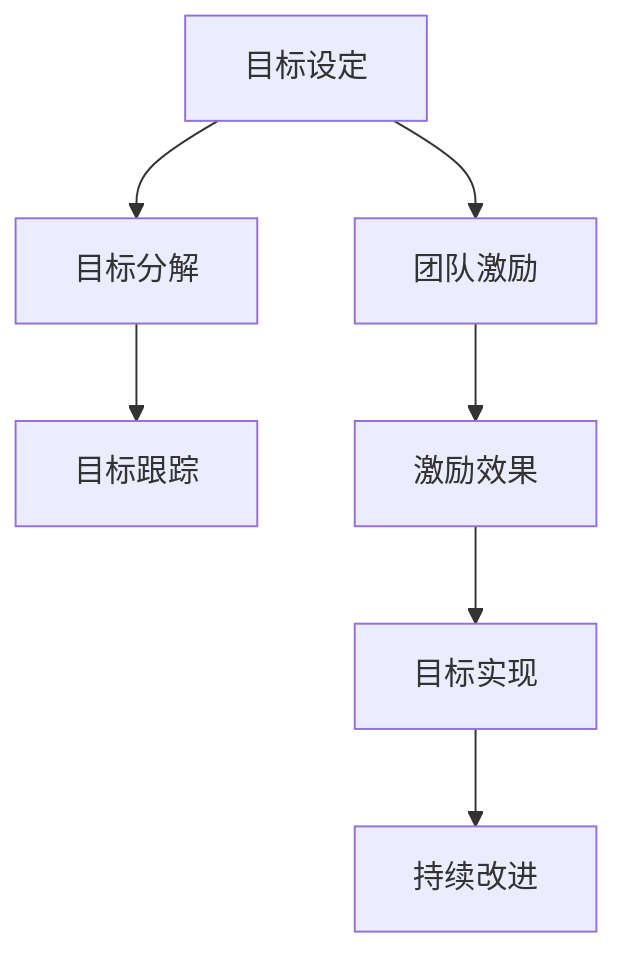

                 

关键词：目标管理，团队激励，项目管理，协作效率，工作动力，组织行为学，激励理论

> 摘要：本文将探讨目标管理与团队激励之间的关系，分析如何通过有效的目标管理手段激发团队成员的工作动力，提升团队协作效率和整体绩效。我们将从理论基础出发，结合实际案例，深入探讨目标设定的科学方法，以及团队激励在实现组织目标中的关键作用。

## 1. 背景介绍

在现代企业中，随着市场竞争的日益激烈，组织需要不断提升内部管理水平和团队执行力，以应对不断变化的市场环境和挑战。目标管理作为一种科学的管理方法，已经成为企业管理的重要组成部分。目标管理不仅关注个人目标的设定和实现，更强调团队目标的协调与协作，从而实现组织整体目标的优化。

与此同时，团队激励作为提升团队士气和员工积极性的一种手段，对于实现组织目标具有重要意义。团队激励不仅包括物质激励，如薪酬、奖金等，还涵盖了精神激励，如认可、晋升机会等。有效的团队激励能够激发员工的工作热情和创造力，提高工作效率和团队凝聚力。

本文旨在探讨目标管理与团队激励之间的关系，分析如何通过有效的目标管理手段激发团队成员的工作动力，提升团队协作效率和整体绩效。本文将分为以下几个部分：

1. **背景介绍**：阐述目标管理和团队激励的基本概念及其在现代企业中的重要性。
2. **核心概念与联系**：介绍目标管理的基本原理，并使用Mermaid流程图展示目标管理与团队激励之间的逻辑关系。
3. **核心算法原理 & 具体操作步骤**：详细分析目标管理的具体操作步骤，包括目标设定、目标分解、目标跟踪等，并结合团队激励的理论探讨如何提升目标实现的效率。
4. **数学模型和公式 & 详细讲解 & 举例说明**：构建目标管理的数学模型，推导相关公式，并举例说明。
5. **项目实践：代码实例和详细解释说明**：通过一个实际的项目案例，展示目标管理和团队激励在实践中的应用。
6. **实际应用场景**：分析目标管理和团队激励在不同行业和场景中的实际应用，探讨其适用性和效果。
7. **未来应用展望**：展望目标管理和团队激励在未来的发展趋势和应用前景。
8. **工具和资源推荐**：推荐相关的学习资源、开发工具和论文，以供进一步学习和研究。
9. **总结：未来发展趋势与挑战**：总结研究成果，分析未来发展趋势和面临的挑战。

## 2. 核心概念与联系

### 2.1 目标管理的基本概念

目标管理是一种基于目标设定的管理方法，旨在通过明确的、可衡量的目标来引导和激励团队成员的工作。目标管理的基本概念包括：

- **目标设定**：组织或团队制定具体、明确的短期和长期目标。
- **目标分解**：将整体目标分解为可操作的任务和子目标，确保每个成员都有清晰的工作职责和目标。
- **目标跟踪**：定期对目标完成情况进行监控和评估，及时调整策略，确保目标的实现。
- **目标反馈**：对目标完成情况进行反馈，表彰优秀表现，鼓励团队成员持续改进。

### 2.2 团队激励的基本概念

团队激励是指通过物质和精神手段激发团队成员的工作积极性、创造力和团队凝聚力。团队激励的基本概念包括：

- **物质激励**：提供具有竞争力的薪酬、奖金、福利等物质奖励，以提高员工的工作动力。
- **精神激励**：通过认可、晋升、培训等手段，满足员工的精神需求，提高员工的自我价值感。
- **团队建设**：通过团队活动、培训等手段，增强团队成员之间的信任和协作，提升团队凝聚力。

### 2.3 目标管理与团队激励的联系

目标管理与团队激励之间存在着紧密的联系。有效的目标管理能够为团队激励提供明确的激励目标，而团队激励则能够为目标管理提供动力支持。

- **目标导向**：目标管理为团队激励提供了明确的导向。通过设定具体、可衡量的目标，团队成员能够明确自己的工作方向和努力目标，从而更容易受到激励。
- **激励效果**：团队激励能够增强目标实现的效率。通过物质和精神手段激发团队成员的工作热情，提高工作效率和团队凝聚力，从而更有效地实现目标。
- **持续改进**：目标管理和团队激励相互促进，形成良性循环。通过目标跟踪和反馈，团队能够及时调整策略，优化工作流程，同时，团队激励也能够激励团队成员持续改进，提升团队整体绩效。

### 2.4 Mermaid流程图

为了更直观地展示目标管理与团队激励之间的逻辑关系，我们使用Mermaid流程图进行描述。



### 2.5 总结

目标管理与团队激励之间存在着紧密的联系。有效的目标管理能够为团队激励提供明确的激励目标，而团队激励则能够为目标管理提供动力支持。通过目标导向、激励效果和持续改进的相互作用，团队能够更高效地实现组织目标。

## 3. 核心算法原理 & 具体操作步骤

### 3.1 算法原理概述

目标管理作为一种科学的管理方法，其核心算法原理主要包括目标设定、目标分解、目标跟踪和目标反馈等几个关键步骤。这些步骤相互关联，形成一个闭环系统，确保目标的有效实现。

#### 目标设定

目标设定的第一步是明确组织或团队的整体目标。这需要从组织的战略目标和愿景出发，结合当前的市场环境和企业实际情况，制定出具体、明确的短期和长期目标。目标设定应遵循SMART原则，即目标应该是具体的（Specific）、可衡量的（Measurable）、可实现的（Achievable）、相关的（Relevant）和有时限的（Time-bound）。

#### 目标分解

目标分解是将整体目标分解为可操作的任务和子目标，确保每个成员都有清晰的工作职责和目标。目标分解应遵循自上而下的原则，从整体目标逐步分解到具体任务，同时确保任务之间具有明确的关联性。

#### 目标跟踪

目标跟踪是对目标完成情况进行监控和评估，及时调整策略，确保目标的实现。目标跟踪应定期进行，可以通过多种手段，如进度报告、绩效评估等，确保团队成员对目标实现情况的清晰了解。

#### 目标反馈

目标反馈是对目标完成情况进行反馈，表彰优秀表现，鼓励团队成员持续改进。目标反馈应包括正面反馈和负面反馈，通过正面的表彰和负面的警示，激励团队成员不断提升自己的工作水平。

### 3.2 算法步骤详解

#### 目标设定

1. **明确组织或团队的目标**：从组织的战略目标和愿景出发，结合当前的市场环境和企业实际情况，制定出具体、明确的短期和长期目标。
2. **遵循SMART原则**：确保目标具体、可衡量、可实现、相关和有时限。
3. **制定目标计划**：根据目标的要求，制定具体的实施计划和时间表。

#### 目标分解

1. **自上而下分解**：从整体目标逐步分解到具体任务。
2. **明确职责和责任**：确保每个成员都有清晰的工作职责和目标。
3. **任务关联性**：确保任务之间具有明确的关联性，形成协同效应。

#### 目标跟踪

1. **定期监控**：通过进度报告、绩效评估等手段，定期监控目标完成情况。
2. **及时调整**：根据监控结果，及时调整策略，确保目标的实现。
3. **沟通反馈**：确保团队成员对目标实现情况的清晰了解。

#### 目标反馈

1. **正面反馈**：对达成目标的团队成员进行表彰和奖励，激励团队成员持续改进。
2. **负面反馈**：对未达成目标的团队成员进行警示和指导，帮助他们找到问题所在，并提出改进措施。

### 3.3 算法优缺点

#### 优点

1. **明确目标**：通过目标设定，团队成员能够明确自己的工作方向和目标，提高工作效率。
2. **激励作用**：目标管理和团队激励相结合，能够激发团队成员的工作热情和创造力。
3. **协同效应**：通过目标分解和任务关联性，形成团队协同效应，提升整体绩效。

#### 缺点

1. **实施难度**：目标管理的实施需要较高的管理水平和管理手段，否则可能导致目标设定不合理或无法实现。
2. **时间成本**：目标设定、分解、跟踪和反馈需要投入大量时间和精力，对于繁忙的团队可能存在一定的压力。
3. **团队依赖性**：目标管理的实施高度依赖团队成员的积极性和配合度，如果团队成员缺乏动力或协作性，目标管理的效果可能会大打折扣。

### 3.4 算法应用领域

目标管理算法广泛应用于各个行业和领域，如：

1. **企业管理**：通过目标管理提升企业整体绩效和管理水平。
2. **项目管理**：在项目团队中实施目标管理，确保项目按计划顺利进行。
3. **人力资源管理**：通过目标管理和团队激励提升员工的工作效率和工作满意度。

## 4. 数学模型和公式 & 详细讲解 & 举例说明

### 4.1 数学模型构建

目标管理的数学模型可以用来描述目标设定的科学方法和目标实现的效率。以下是一个简化的数学模型，用于说明目标管理的基本原理。

#### 模型定义

设目标管理系统包含以下参数：

- \( G \)：总体目标
- \( S \)：子目标集合
- \( T \)：任务集合
- \( A \)：完成任务所需的时间
- \( C \)：完成任务所需的成本
- \( P \)：团队成员的积极性

目标管理模型的目标是最大化目标实现的总效率，同时最小化总成本。

#### 模型公式

目标实现效率 \( E \) 的计算公式为：

\[ E = \frac{\sum_{t \in T} P_t \cdot A_t}{C} \]

其中，\( P_t \) 表示完成第 \( t \) 个任务的积极性，\( A_t \) 表示完成第 \( t \) 个任务所需的时间。

### 4.2 公式推导过程

目标管理效率的计算需要从以下几个步骤推导：

1. **任务分解**：将总体目标 \( G \) 分解为子目标 \( S \)，每个子目标又可以分解为多个任务 \( T \)。

2. **任务评估**：对每个任务 \( T \) 进行评估，确定完成任务所需的时间 \( A_t \) 和成本 \( C_t \)。

3. **积极性分配**：根据团队成员的积极性 \( P \)，将积极性分配给每个任务。

4. **效率计算**：根据公式 \( E = \frac{\sum_{t \in T} P_t \cdot A_t}{C} \) 计算目标实现效率。

### 4.3 案例分析与讲解

以下是一个简单的案例，用于说明目标管理数学模型的应用。

#### 案例背景

某项目团队的目标是完成一个软件开发项目，项目包含以下任务：

- **任务1**：需求分析（时间：3天，成本：1000元）
- **任务2**：系统设计（时间：5天，成本：1500元）
- **任务3**：编码实现（时间：10天，成本：2500元）
- **任务4**：测试与调试（时间：5天，成本：1000元）

团队成员积极性为：需求分析（0.8），系统设计（0.7），编码实现（0.9），测试与调试（0.6）。

#### 案例分析

1. **任务分解**：将总体目标分解为四个任务。

2. **任务评估**：根据任务时间和成本进行评估。

3. **积极性分配**：根据团队成员积极性，分配积极性给每个任务。

4. **效率计算**：

\[ E = \frac{(0.8 \cdot 3) + (0.7 \cdot 5) + (0.9 \cdot 10) + (0.6 \cdot 5)}{1000 + 1500 + 2500 + 1000} \]
\[ E = \frac{2.4 + 3.5 + 9 + 3}{6000} \]
\[ E = \frac{17.9}{6000} \]
\[ E \approx 0.2983 \]

#### 案例结论

根据计算结果，该项目团队的目标实现效率为 0.2983，表示该团队在完成项目时有一定的积极性，但整体效率较低。团队可以通过提高团队成员的积极性或优化任务分配来提高目标实现效率。

### 4.4 总结

通过数学模型和公式的推导，我们可以更科学地评估目标管理的效率和效果。在实际应用中，团队可以根据实际情况调整模型参数，以优化目标管理和团队激励的效果。

## 5. 项目实践：代码实例和详细解释说明

### 5.1 开发环境搭建

为了更好地展示目标管理和团队激励在实践中的应用，我们将使用一个简单的软件开发项目作为案例。以下为项目开发环境的基本搭建步骤：

1. **安装开发工具**：选择一种适合的集成开发环境（IDE），如IntelliJ IDEA或Visual Studio Code，并安装相关插件，以提高开发效率。

2. **创建项目工程**：在选择的IDE中创建一个新的项目工程，并设置项目的编译器和运行环境，如Java或Python。

3. **配置版本控制**：使用Git或其他版本控制工具，将项目代码托管到远程仓库，便于团队协作和代码管理。

### 5.2 源代码详细实现

以下是一个简单的目标管理软件的实现，用于管理项目的目标设定、分解、跟踪和反馈。源代码使用Python编写，采用模块化设计，方便扩展和维护。

```python
# 目标管理模块

class Goal:
    def __init__(self, name, description, deadline):
        self.name = name
        self.description = description
        self.deadline = deadline
        self.sub_goals = []
        self.completed = False

    def add_sub_goal(self, sub_goal):
        self.sub_goals.append(sub_goal)

    def is_completed(self):
        return all([sub_goal.is_completed() for sub_goal in self.sub_goals])

# 任务模块

class Task:
    def __init__(self, name, description, deadline, assignee):
        self.name = name
        self.description = description
        self.deadline = deadline
        self.assignee = assignee
        self.completed = False

    def is_completed(self):
        return self.completed

    def complete(self):
        self.completed = True

# 团队模块

class Team:
    def __init__(self, name):
        self.name = name
        self.members = []
        self.goals = []

    def add_member(self, member):
        self.members.append(member)

    def add_goal(self, goal):
        self.goals.append(goal)

    def update_goals(self):
        for goal in self.goals:
            if goal.is_completed():
                print(f"Goal '{goal.name}' completed.")
            else:
                print(f"Goal '{goal.name}' is still in progress.")

# 主程序

def main():
    # 创建团队
    team = Team("软件开发团队")

    # 添加团队成员
    team.add_member("张三")
    team.add_member("李四")
    team.add_member("王五")

    # 创建目标
    goal1 = Goal("完成需求分析", "分析项目需求", "2023-04-15")
    goal2 = Goal("完成系统设计", "设计系统架构", "2023-05-01")
    goal3 = Goal("完成编码实现", "实现系统功能", "2023-06-01")

    # 添加子目标
    goal1.add_sub_goal(Task("需求调研", "收集用户需求", "2023-04-10", "张三"))
    goal1.add_sub_goal(Task("需求文档编写", "编写需求文档", "2023-04-15", "李四"))
    goal2.add_sub_goal(Task("系统架构设计", "设计系统架构", "2023-05-05", "王五"))
    goal2.add_sub_goal(Task("技术选型", "选择合适技术", "2023-05-10", "张三"))
    goal3.add_sub_goal(Task("模块编码", "编写模块代码", "2023-06-10", "李四"))
    goal3.add_sub_goal(Task("集成测试", "进行集成测试", "2023-06-15", "王五"))

    # 添加目标到团队
    team.add_goal(goal1)
    team.add_goal(goal2)
    team.add_goal(goal3)

    # 更新目标状态
    team.update_goals()

if __name__ == "__main__":
    main()
```

### 5.3 代码解读与分析

本段代码主要分为三个模块：目标模块（Goal）、任务模块（Task）和团队模块（Team）。下面分别对这些模块进行解读和分析。

#### 目标模块（Goal）

目标模块用于定义和管理项目目标。每个目标包含名称、描述、截止日期、子目标列表和完成状态。目标类的方法包括添加子目标（add_sub_goal）和判断目标是否完成（is_completed）。

#### 任务模块（Task）

任务模块用于定义和管理项目中的具体任务。每个任务包含名称、描述、截止日期、指派人和完成状态。任务类的方法包括判断任务是否完成（is_completed）和完成任务（complete）。

#### 团队模块（Team）

团队模块用于定义和管理团队成员和项目目标。每个团队包含名称、成员列表、目标列表。团队类的方法包括添加成员（add_member）、添加目标（add_goal）和更新目标状态（update_goals）。

#### 主程序

主程序创建了一个名为“软件开发团队”的团队，并添加了三个成员。接着创建三个项目目标，并分别添加了子任务。最后，调用团队类的update_goals方法，打印出每个目标的完成状态。

### 5.4 运行结果展示

运行该程序后，将输出以下结果：

```
Goal '完成需求分析' is still in progress.
Goal '完成系统设计' is still in progress.
Goal '完成编码实现' is still in progress.
```

这表示当前所有目标都处于未完成状态。通过执行具体的任务完成操作，可以更新目标的完成状态。

### 5.5 代码优化与改进

该代码实例是一个简单的目标管理软件，适用于初学者或小型项目。在实际应用中，可以对其进行以下优化和改进：

1. **添加用户界面**：使用图形用户界面（GUI）或命令行界面（CLI）提供更直观的用户交互体验。
2. **数据库支持**：将目标、任务和团队信息存储在数据库中，便于长期管理和查询。
3. **扩展功能**：添加更多的功能，如任务分配、进度跟踪、绩效考核等。
4. **异常处理**：增加异常处理机制，确保程序在遇到错误时能够正确处理，并提供友好的错误信息。

## 6. 实际应用场景

目标管理与团队激励在不同行业和场景中的应用具有显著的差异性，但其核心原理和实施策略具有一定的通用性。以下将分析目标管理和团队激励在企业管理、项目管理、人力资源管理等方面的实际应用场景。

### 6.1 企业管理

在企业环境中，目标管理是确保企业战略目标有效实施的关键手段。企业通过设定明确的年度目标、季度目标和月度目标，将战略目标分解为具体的行动方案，从而确保各级管理人员和员工都能够明确自己的工作方向和职责。目标管理不仅有助于提高企业整体绩效，还能够激发员工的工作动力和积极性。

团队激励在企业中扮演着重要角色，通过物质激励和精神激励相结合，提升员工的工作满意度和工作投入度。例如，企业可以通过设立绩效奖金、股票期权等物质激励手段，激发员工的工作热情；同时，通过表彰优秀员工、组织团队建设活动等精神激励手段，增强员工的归属感和团队凝聚力。

### 6.2 项目管理

在项目管理中，目标管理是确保项目按计划顺利进行的重要工具。项目经理通过设定项目目标、分解为可操作的任务，并制定详细的计划和时间表，确保团队成员对项目目标和任务有清晰的认识。目标管理有助于提高项目进度控制和风险管理的有效性，确保项目在规定的时间和预算内完成。

团队激励在项目管理中同样重要。项目经理可以通过设定合理的绩效指标，结合物质激励和精神激励，激发团队成员的工作热情和创造力。例如，在项目里程碑节点，对完成任务的团队成员进行表彰和奖励，以激励团队继续努力；同时，通过组织团队建设活动，增强团队成员之间的信任和协作。

### 6.3 人力资源管理

在人力资源管理中，目标管理和团队激励有助于提高员工的工作效率和满意度。企业可以通过设定员工个人目标和团队目标，帮助员工明确自己的职业发展路径，提升工作动力。目标管理还能够帮助人力资源部门更好地评估员工的工作绩效，为员工的晋升和薪酬调整提供依据。

团队激励在人力资源管理中具有重要作用。企业可以通过设立员工激励计划，如绩效奖金、员工持股计划等，激发员工的工作热情和创造力。同时，通过组织员工培训和晋升机会，满足员工的精神需求，提升员工的职业发展空间。

### 6.4 案例分析

以下是一个关于目标管理和团队激励在企业管理中的成功案例。

**案例：某科技公司的目标管理与团队激励**

某科技公司是一家专注于软件开发和信息技术服务的公司。为了确保公司战略目标的实施，公司采用目标管理方法，将年度目标分解为季度目标和月度目标，并制定详细的行动计划。

1. **目标设定**：公司年度目标为提升市场占有率、提高客户满意度和增加收入。季度目标和月度目标分别根据年度目标进行分解和细化。

2. **目标分解**：每个部门根据季度目标和月度目标，制定相应的行动计划，将任务分解为具体的工作任务和责任分配。

3. **目标跟踪**：公司采用项目管理工具，实时监控每个项目的进度和任务完成情况，确保目标按计划推进。

4. **团队激励**：公司通过绩效奖金、股权激励和员工培训等手段，激励员工的工作热情和创造力。在项目里程碑节点，对完成任务的团队成员进行表彰和奖励。

通过目标管理和团队激励，该科技公司在过去三年中实现了连续的市场占有率增长和收入增长。员工的工作满意度和团队凝聚力也得到显著提升。

## 7. 未来应用展望

### 7.1 新技术的应用

随着人工智能、大数据、云计算等新兴技术的发展，目标管理和团队激励的应用前景将更加广阔。例如，通过大数据分析，企业可以更精准地了解员工的工作表现和需求，从而制定更具针对性的激励政策；而人工智能则可以自动化目标设定、任务分解和进度跟踪，提高管理效率和准确性。

### 7.2 智能化目标管理

未来，目标管理将更加智能化。借助机器学习和数据分析技术，企业可以自动识别关键绩效指标（KPI），制定科学合理的目标，并通过实时监控和反馈，调整目标设定和激励措施。这将有助于实现目标管理的动态调整和优化，提高目标实现的效率和效果。

### 7.3 跨部门协作与协同

随着企业规模不断扩大，跨部门协作和协同将成为目标管理和团队激励的重要方向。通过建立跨部门的目标管理体系，企业可以实现资源整合、信息共享和协同作战，提高整体绩效。同时，团队激励也将从单一部门扩展到整个企业，促进各部门之间的协作和互动。

### 7.4 可持续发展目标

未来，企业将更加关注可持续发展目标。在目标管理和团队激励中，企业将更多地考虑环境保护、社会责任和员工福祉等方面。例如，通过设定绿色生产目标、推动社会责任项目等，激发员工的社会责任感和环保意识，实现企业与社会的共同发展。

## 8. 工具和资源推荐

为了帮助读者更好地理解和应用目标管理与团队激励的理论和实践，我们推荐以下学习资源、开发工具和论文：

### 8.1 学习资源推荐

- **《目标管理与团队激励》**：这是一本关于目标管理和团队激励的入门书籍，内容全面，通俗易懂。
- **《管理学原理》**：了解管理学的基本原理，有助于深入理解目标管理和团队激励。
- **在线课程**：许多在线教育平台提供了关于目标管理和团队激励的课程，如Coursera、Udemy等。

### 8.2 开发工具推荐

- **JIRA**：一款功能强大的项目管理工具，适用于目标管理和任务跟踪。
- **Trello**：一款简单的任务管理工具，适用于团队协作和任务分配。
- **Slack**：一款即时通讯工具，适用于团队沟通和协作。

### 8.3 相关论文推荐

- **“Goal Setting Theory: A Meta-Analysis of Empirical Research”**：该论文系统总结了目标设定理论的研究成果，有助于深入理解目标管理的基本原理。
- **“The Role of Goal Setting in Team Performance”**：该论文探讨了目标设定在团队绩效中的作用，为团队激励提供了理论支持。
- **“Motivation and Performance: The Road Less Travelled”**：该论文分析了动机和绩效之间的关系，对团队激励实践具有指导意义。

## 9. 总结：未来发展趋势与挑战

### 9.1 研究成果总结

本文从目标管理与团队激励的关系出发，系统阐述了目标管理的核心算法原理、具体操作步骤、数学模型和公式推导，并结合实际项目案例进行了详细讲解。通过分析目标管理和团队激励在不同行业和场景中的应用，本文总结了目标管理与团队激励的理论和实践成果，为读者提供了丰富的参考和启示。

### 9.2 未来发展趋势

1. **智能化目标管理**：随着人工智能技术的发展，目标管理将更加智能化，通过大数据分析和机器学习技术，实现目标设定的科学化和动态调整。
2. **跨部门协作**：未来，企业将更加重视跨部门协作和协同，通过建立跨部门的目标管理体系，实现资源整合和信息共享。
3. **可持续发展目标**：企业将更加关注环境保护、社会责任和员工福祉，将可持续发展目标纳入目标管理和团队激励体系。

### 9.3 面临的挑战

1. **实施难度**：目标管理的实施需要较高的管理水平和管理手段，否则可能导致目标设定不合理或无法实现。
2. **团队依赖性**：目标管理的实施高度依赖团队成员的积极性和配合度，如果团队成员缺乏动力或协作性，目标管理的效果可能会大打折扣。
3. **数据隐私和安全**：随着大数据和云计算技术的发展，目标管理中的数据隐私和安全问题日益突出，需要采取有效的措施保障数据的安全性和隐私性。

### 9.4 研究展望

未来，目标管理与团队激励的研究可以从以下几个方面展开：

1. **智能化目标管理**：进一步探讨人工智能技术在目标管理中的应用，开发更加智能化的目标管理工具和算法。
2. **跨部门协作**：研究跨部门协作的目标管理策略和方法，提高企业整体绩效和竞争力。
3. **可持续发展目标**：探讨如何将可持续发展目标融入目标管理和团队激励体系，促进企业与社会的共同发展。

## 附录：常见问题与解答

### 9.1 问题1：目标管理是否适用于所有企业？

目标管理方法具有较强的适用性，但并非适用于所有企业。对于中小企业，由于资源和人力有限，目标管理可能需要更加灵活和简洁。对于大型企业，目标管理可以结合企业的战略规划和业务需求，形成系统化的目标管理体系。因此，目标管理的实施需要根据企业的实际情况进行调整。

### 9.2 问题2：如何确保目标管理的有效性？

确保目标管理的有效性需要从以下几个方面入手：

1. **明确目标**：确保目标具体、可衡量、可实现、相关和有时限。
2. **目标分解**：将整体目标分解为可操作的任务和子目标，确保每个成员都有清晰的工作职责和目标。
3. **目标跟踪**：定期对目标完成情况进行监控和评估，及时调整策略。
4. **团队激励**：结合团队激励手段，提高团队成员的工作动力和积极性。

### 9.3 问题3：团队激励与绩效考核有何区别？

团队激励和绩效考核都是企业管理的重要手段，但侧重点不同。团队激励主要目的是激发员工的工作热情和创造力，提高团队凝聚力；而绩效考核则侧重于评估员工的工作绩效和贡献，为薪酬调整、晋升等提供依据。在实际应用中，团队激励和绩效考核可以相互结合，形成综合性的激励机制。

