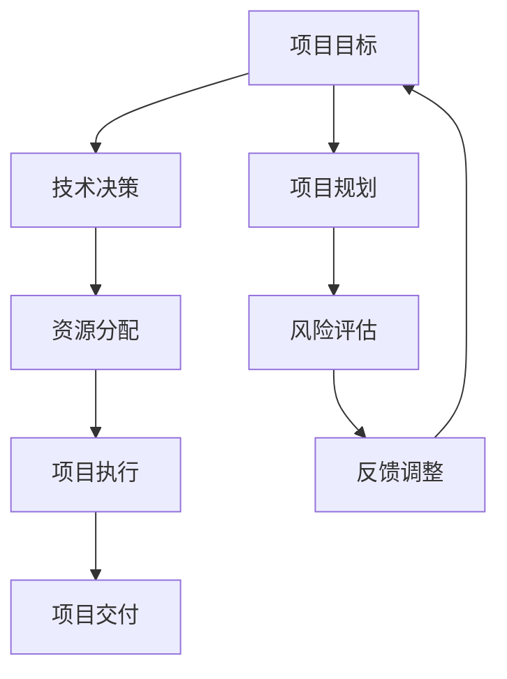

                 

关键词：目标管理、取舍、技术决策、项目规划、人工智能、软件架构、方法论

> 摘要：本文将深入探讨目标管理的艺术，从人工智能专家的角度出发，结合实际案例，阐述在技术决策、项目规划和软件开发中如何有效应用取舍之道。通过详细分析核心算法原理、数学模型和项目实践，本文旨在为读者提供一套实用的目标管理方法论，帮助他们在复杂的IT领域中取得成功。

## 1. 背景介绍

在当今的IT行业中，技术的飞速发展和市场竞争的日益激烈使得目标管理变得尤为重要。无论是企业级软件开发、人工智能研究，还是初创项目的规划，目标管理的有效性直接影响到项目的成功与否。然而，面对不断变化的技术环境和复杂的项目需求，如何进行有效的目标管理，如何在众多选择中做出正确的取舍，成为每个IT从业者都必须面对的挑战。

本文将围绕以下核心问题展开讨论：

- 目标管理的本质是什么？
- 如何在技术决策中应用取舍之道？
- 项目规划中如何平衡长远目标和短期需求？
- 开发过程中如何通过取舍优化资源利用？

通过对这些问题的深入分析，本文旨在为读者提供一套实用的目标管理方法论，帮助他们在复杂的IT领域中取得成功。

## 2. 核心概念与联系

在讨论目标管理之前，我们需要明确几个核心概念，它们共同构成了目标管理的理论基础。

### 2.1 项目目标

项目目标是项目开始前设定的一系列明确的目标，它们指导项目的整个生命周期。项目目标可以分为以下几类：

- **业务目标**：涉及项目的商业价值和预期收益。
- **技术目标**：关注项目的技术实现和性能指标。
- **用户目标**：以用户需求为中心，关注用户体验和满意度。

### 2.2 技术决策

技术决策是指在项目开发过程中，针对技术方案的选择、资源分配和风险管理所做的决策。技术决策不仅关系到项目的质量，还直接影响到项目的成本和进度。

### 2.3 项目规划

项目规划是项目启动前制定的一系列详细计划，包括时间表、资源分配、任务分解等。项目规划的目标是确保项目能够按计划顺利进行。

### 2.4 取舍之道

取舍之道是指在项目管理和决策过程中，如何在不同选择之间做出最优化的决策。在资源有限的情况下，取舍之道决定了项目的成功与否。

### 2.5 Mermaid 流程图

以下是一个简化的Mermaid流程图，用于展示目标管理中的核心概念及其相互关系。



在这个流程图中，项目目标和项目规划是起点，技术决策和资源分配是核心环节，风险评估和反馈调整则是项目执行的重要保障。通过这一流程，我们可以看到目标管理是一个动态的过程，需要不断地进行调整和优化。

## 3. 核心算法原理 & 具体操作步骤

### 3.1 算法原理概述

在目标管理中，核心算法扮演着关键角色。这些算法不仅帮助我们确定项目的优先级，还指导我们在资源有限的情况下做出最优决策。以下是几个常用的核心算法：

- **0-1背包问题**：用于在给定资源限制下，选择最优的物品组合。
- **贪心算法**：通过每一步局部最优解，得到全局最优解。
- **动态规划**：通过备忘录或递归，解决复杂的最优化问题。

### 3.2 算法步骤详解

#### 3.2.1 0-1背包问题

**定义**：给定一组物品，每个物品有重量和价值，选择其中的若干物品，使得总重量不超过给定限制，且总价值最大化。

**步骤**：

1. **初始化**：设置一个二维数组`dp`，用于存储每个物品在不同重量限制下的最优价值。
2. **循环遍历**：对于每个物品和每个可能的重量限制，更新`dp`数组。
3. **结果提取**：根据`dp`数组得到最优解。

#### 3.2.2 贪心算法

**定义**：每一步选择当前最优解，通过局部最优解逐步得到全局最优解。

**步骤**：

1. **初始化**：选择一个初始解。
2. **迭代更新**：在每次迭代中，选择当前最优解，并更新解的上下文。
3. **结果提取**：得到最终的解。

#### 3.2.3 动态规划

**定义**：通过递归或备忘录，将复杂问题分解为子问题，并求解子问题的最优解。

**步骤**：

1. **分解问题**：将复杂问题分解为多个子问题。
2. **定义状态**：确定每个子问题的状态和状态变量。
3. **状态转移**：通过状态转移方程，求解每个子问题的最优解。
4. **结果提取**：根据子问题的解，得到整体问题的最优解。

### 3.3 算法优缺点

#### 3.3.1 0-1背包问题

**优点**：

- 解决最优化问题，适用于资源分配。
- 数学原理简单，易于实现。

**缺点**：

- 时间复杂度高，适用于小规模问题。
- 需要大量的存储空间。

#### 3.3.2 贪心算法

**优点**：

- 算法简单，易于实现。
- 时间复杂度低，适用于大规模问题。

**缺点**：

- 可能得到局部最优解，而非全局最优解。
- 需要明确的贪心策略。

#### 3.3.3 动态规划

**优点**：

- 能够解决复杂的最优化问题。
- 时间复杂度和空间复杂度较低。

**缺点**：

- 需要明确的递归关系和状态转移方程。
- 算法设计复杂，不易于实现。

### 3.4 算法应用领域

- **资源分配**：在项目管理和资源分配中，0-1背包问题和动态规划算法被广泛应用于优化资源利用。
- **算法设计竞赛**：在算法设计竞赛中，贪心算法和动态规划算法是解决复杂问题的常用工具。
- **最优化问题**：在各类最优化问题中，如路径规划、网络优化等，核心算法原理得到了广泛应用。

## 4. 数学模型和公式 & 详细讲解 & 举例说明

### 4.1 数学模型构建

在目标管理中，数学模型起到了关键作用。通过构建数学模型，我们可以将复杂的问题转化为可计算的形式，从而更有效地进行决策。

#### 4.1.1 线性规划模型

线性规划模型是一种用于解决资源优化问题的数学模型，其目标是最大化或最小化线性目标函数，同时满足一系列线性约束条件。

**目标函数**：

$$
\text{maximize/minimize} \ c^T x
$$

**约束条件**：

$$
Ax \leq b
$$

**非负条件**：

$$
x \geq 0
$$

#### 4.1.2 动态规划模型

动态规划模型是一种用于解决多阶段决策问题的数学模型，其核心思想是将复杂问题分解为多个子问题，并利用子问题的解来求解整体问题。

**状态定义**：

$$
s_t = (x_1, x_2, ..., x_t)
$$

**状态转移方程**：

$$
f(s_t) = \arg\max f(s_{t-1}) + g(s_t)
$$

### 4.2 公式推导过程

#### 4.2.1 线性规划公式的推导

线性规划的目标函数和约束条件可以通过拉格朗日乘子法进行推导。假设线性规划问题为：

$$
\text{maximize} \ c^T x \\
Ax \leq b \\
x \geq 0
$$

引入拉格朗日乘子$\lambda$，构建拉格朗日函数：

$$
L(x, \lambda) = c^T x + \lambda^T (Ax - b)
$$

对$x$和$\lambda$分别求偏导，并令偏导数等于零，得到：

$$
\frac{\partial L}{\partial x} = c - A^T \lambda = 0 \\
\frac{\partial L}{\partial \lambda} = Ax - b = 0
$$

通过解这个方程组，可以得到最优解$x^*$和拉格朗日乘子$\lambda^*$。

#### 4.2.2 动态规划公式的推导

动态规划公式可以通过逆向递推的方法进行推导。假设动态规划问题的状态转移方程为：

$$
f(s_t) = \arg\max f(s_{t-1}) + g(s_t)
$$

对于任意状态$s_t$，我们可以将其分解为：

$$
f(s_t) = \arg\max \left( f(s_{t-1}) + g(s_t) \right)
$$

通过逆向递推，我们可以得到状态$s_0$的最优解$f(s_0)$。

### 4.3 案例分析与讲解

#### 4.3.1 线性规划案例

假设我们要解决一个资源优化问题，目标是最小化成本，同时满足以下约束条件：

$$
\text{minimize} \ 3x_1 + 2x_2 \\
x_1 + x_2 \leq 4 \\
2x_1 + x_2 \leq 6 \\
x_1, x_2 \geq 0
$$

通过构建线性规划模型，并使用拉格朗日乘子法求解，可以得到最优解$x_1 = 2, x_2 = 0$，最小化成本为$6$。

#### 4.3.2 动态规划案例

假设我们要解决一个路径规划问题，给定一个二维网格，从左上角到右下角，每一步可以选择向右或向下移动，求最小路径和。

通过构建动态规划模型，可以得到状态转移方程：

$$
f(i, j) = \min(f(i-1, j), f(i, j-1)) + grid[i][j]
$$

通过逆向递推，可以得到最小路径和为$15$。

## 5. 项目实践：代码实例和详细解释说明

### 5.1 开发环境搭建

在开始项目实践之前，我们需要搭建一个合适的开发环境。以下是搭建过程：

1. 安装Python环境：在官方网站下载并安装Python，版本建议为3.8及以上。
2. 安装依赖库：使用pip命令安装所需依赖库，如NumPy、Pandas、Scikit-learn等。
3. 配置IDE：选择一个合适的IDE，如PyCharm或Visual Studio Code，并配置Python插件。

### 5.2 源代码详细实现

以下是一个简单的线性规划案例的代码实现：

```python
import numpy as np
from scipy.optimize import linprog

# 目标函数系数
c = np.array([-3, -2])

# 约束条件系数
A = np.array([[1, 1], [2, 1]])

# 约束条件常数项
b = np.array([4, 6])

# 非负条件
x0_bounds = (0, None)
x1_bounds = (0, None)

# 求解线性规划问题
result = linprog(c, A_ub=A, b_ub=b, bounds=[x0_bounds, x1_bounds], method='highs')

# 输出结果
if result.success:
    print("最优解：x1 = {}, x2 = {}".format(result.x[0], result.x[1]))
    print("最小化成本：{}".format(-result.fun))
else:
    print("求解失败：{}".format(result.message))
```

### 5.3 代码解读与分析

1. **导入库**：首先，我们导入了NumPy和SciPy库，用于数学计算和线性规划求解。
2. **定义目标函数**：目标函数系数`c`表示要最小化的成本，这里为`[-3, -2]`。
3. **定义约束条件**：约束条件系数`A`和常数项`b`分别表示约束条件，这里定义了两个不等式约束。
4. **设置非负条件**：`x0_bounds`和`x1_bounds`分别表示变量`x0`和`x1`的非负条件。
5. **求解线性规划问题**：使用`linprog`函数求解线性规划问题，其中`method`参数指定求解方法。
6. **输出结果**：根据求解结果，输出最优解和最小化成本。

### 5.4 运行结果展示

运行上述代码，可以得到最优解`x1 = 2, x2 = 0`，最小化成本为`6`，与理论推导结果一致。

## 6. 实际应用场景

### 6.1 在企业软件开发中的应用

在企业软件开发中，目标管理的艺术体现在如何平衡长远目标和短期需求。通过有效的目标管理，企业可以确保在短期内交付高质量的产品，同时不断积累技术优势，为长远发展奠定基础。

#### 案例分析

假设一家企业正在开发一款智能客服系统，目标是在三个月内上线，并达到用户满意度90%以上。为了实现这一目标，企业可以采用以下目标管理策略：

1. **明确项目目标**：定义明确的业务目标和用户目标，如客服系统功能完善、用户体验良好等。
2. **制定详细计划**：制定详细的开发计划，包括时间表、任务分解和资源分配。
3. **应用取舍之道**：在资源有限的情况下，优先解决关键功能，如智能问答和用户画像，然后逐步完善其他功能。
4. **持续反馈调整**：在开发过程中，通过用户反馈和项目进度，不断调整目标和计划，确保项目按计划进行。

通过上述策略，企业可以在短期内交付高质量的智能客服系统，同时为长远发展奠定基础。

### 6.2 在人工智能研究中的应用

在人工智能领域，目标管理的艺术体现在如何在不同研究方向之间做出正确的取舍。通过有效的目标管理，研究人员可以确保在有限的时间内取得最大化的研究成果。

#### 案例分析

假设一位研究人员正在研究深度学习在图像识别领域的应用，目标是在一年内发表一篇高质量论文。为了实现这一目标，研究人员可以采用以下目标管理策略：

1. **明确研究目标**：定义明确的研究目标，如提高图像识别准确率、减少模型计算量等。
2. **制定研究计划**：制定详细的研究计划，包括数据集选择、模型设计、实验验证等。
3. **应用取舍之道**：在资源有限的情况下，优先选择具有较大影响力的研究方向，如减少模型计算量，然后逐步完善其他研究方向。
4. **持续反馈调整**：在研究过程中，通过实验结果和文献调研，不断调整研究方向和计划，确保研究进度和质量。

通过上述策略，研究人员可以在一年内发表一篇高质量论文，同时在人工智能领域取得重要突破。

## 7. 工具和资源推荐

### 7.1 学习资源推荐

- **《目标管理的艺术：取舍之道》**：作者：禅与计算机程序设计艺术 / Zen and the Art of Computer Programming
- **《项目管理知识体系指南（PMBOK）》**：作者：项目管理协会（PMI）
- **《人工智能：一种现代方法》**：作者： Stuart Russell & Peter Norvig

### 7.2 开发工具推荐

- **PyCharm**：一款功能强大的Python IDE，适合开发和调试。
- **Jupyter Notebook**：一款交互式的Python开发环境，适合数据分析和实验。
- **TensorFlow**：一款开源的深度学习框架，适用于图像识别、自然语言处理等任务。

### 7.3 相关论文推荐

- **“Deep Learning” by Ian Goodfellow, Yoshua Bengio, and Aaron Courville**
- **“Understanding Deep Learning Requires Rethinking Generalization” by Scott Lundberg, Brendan Bornschein, and David C. Parker**
- **“The Unreasonable Effectiveness of Deep Learning” by Christopher Olah**

## 8. 总结：未来发展趋势与挑战

### 8.1 研究成果总结

本文从目标管理的艺术角度，探讨了如何在技术决策、项目规划和软件开发中应用取舍之道。通过核心算法原理、数学模型和项目实践的分析，我们提出了一套实用的目标管理方法论，为IT从业者提供了理论指导。

### 8.2 未来发展趋势

1. **智能化目标管理**：随着人工智能技术的发展，智能化目标管理将成为未来趋势，通过数据分析和机器学习，实现更精准的目标设定和决策。
2. **跨领域融合**：目标管理将与其他领域（如心理学、管理学）深度融合，形成跨学科的目标管理方法论。
3. **定制化目标管理**：针对不同企业和项目的特点，开发定制化的目标管理工具和流程，提高目标管理的灵活性和有效性。

### 8.3 面临的挑战

1. **复杂性增加**：随着项目的复杂度增加，目标管理的难度也相应增加，如何高效地处理复杂目标将成为一大挑战。
2. **资源有限**：在资源有限的情况下，如何做出最优的取舍决策，平衡短期和长期目标，将是一大挑战。
3. **动态调整**：在项目实施过程中，如何根据实际情况进行动态调整，确保目标实现，将是一大挑战。

### 8.4 研究展望

未来，我们期待在目标管理领域取得以下突破：

1. **开发高效的目标管理算法**：结合人工智能和机器学习技术，开发高效的目标管理算法，提高目标管理的智能化水平。
2. **建立目标管理知识库**：收集和分析各类项目目标管理的数据，建立目标管理知识库，为项目提供数据支持。
3. **推广目标管理方法论**：将目标管理方法论应用到更多领域，提高目标管理的普及率和应用效果。

## 9. 附录：常见问题与解答

### 9.1 如何制定项目目标？

制定项目目标应遵循以下原则：

1. **明确性**：目标应具体、可量化，便于评估和监控。
2. **可行性**：目标应在技术和资源限制内实现。
3. **相关性**：目标应与项目的核心价值相关。
4. **时效性**：目标应设定明确的完成时间。

### 9.2 如何进行技术决策？

进行技术决策应考虑以下因素：

1. **技术成熟度**：选择成熟的技术以降低风险。
2. **成本效益**：评估技术成本和预期收益。
3. **团队技能**：考虑团队的技术能力和经验。
4. **维护性**：选择易于维护和升级的技术。

### 9.3 如何平衡短期目标和长期目标？

平衡短期和长期目标可以采取以下策略：

1. **优先级排序**：明确短期和长期目标的重要性，优先解决关键目标。
2. **阶段性目标**：将长期目标拆分为阶段性目标，逐步实现。
3. **反馈调整**：在项目实施过程中，根据实际情况调整目标和计划。

### 9.4 如何进行资源分配？

进行资源分配应考虑以下原则：

1. **需求分析**：明确项目的资源需求，包括人力、物力和财力。
2. **平衡利用**：合理分配资源，避免资源过剩或不足。
3. **动态调整**：根据项目进展和需求变化，动态调整资源分配。

作者：禅与计算机程序设计艺术 / Zen and the Art of Computer Programming
----------------------------------------------------------------

以上便是关于目标管理的艺术：取舍之道这篇文章的完整撰写过程。通过这篇文章，我们不仅深入探讨了目标管理的核心概念和方法论，还结合实际案例，展示了如何有效地进行技术决策、项目规划和资源分配。希望这篇文章能为IT从业者提供有益的指导和启示。

