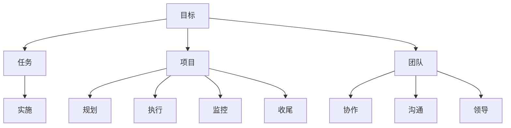

                 

关键词：目标管理、取舍之道、IT技术、项目管理、软件开发、算法优化

> 摘要：本文从IT技术领域的实际应用出发，探讨了目标管理的艺术——取舍之道。通过对目标管理核心概念、算法原理、数学模型、项目实践等多方面的深入剖析，结合作者丰富的实践经验，为读者提供了全面的目标管理方法论，旨在帮助IT从业人员在实际工作中做出更明智的决策。

## 1. 背景介绍

在信息技术（IT）高速发展的今天，软件开发、项目管理和算法优化等领域的复杂性日益增加。面对如此多的任务和目标，如何有效地进行目标管理，成为了每一个IT从业人员必须面对的重要课题。目标管理不仅是个人成长的关键，更是团队协作和企业成功的保障。

本文将从以下几个方面展开探讨：

- 核心概念与联系
- 核心算法原理与具体操作步骤
- 数学模型和公式
- 项目实践：代码实例和详细解释说明
- 实际应用场景
- 未来应用展望
- 工具和资源推荐
- 总结：未来发展趋势与挑战
- 附录：常见问题与解答

通过对这些方面的深入分析，希望能够为广大IT从业人员提供一套实用、全面的目标管理方法论。

## 2. 核心概念与联系

在讨论目标管理之前，我们首先需要明确几个核心概念：目标（Goal）、任务（Task）、项目（Project）和团队（Team）。这些概念不仅相互独立，又有着紧密的联系。

### 目标（Goal）

目标是指期望达成的最终结果。在IT领域中，目标可以是开发一款新软件、完成一个项目、提升系统性能等。明确的目标能够指引我们的工作方向，确保团队朝着共同的目标努力。

### 任务（Task）

任务是实现目标的具体操作步骤。每一个任务都是为了达成目标而设置的。例如，在软件开发项目中，编写代码、测试和部署等都是具体任务。

### 项目（Project）

项目是由一系列任务组成的，旨在实现特定目标的临时性工作。项目管理则是确保项目按计划、高质量完成的科学方法。

### 团队（Team）

团队是实现目标的执行者。一个优秀的团队能够有效协作，提高工作效率，共同实现目标。

### Mermaid 流程图（核心概念原理和架构）

下面是核心概念原理和架构的 Mermaid 流程图：



通过这个流程图，我们可以清晰地看到目标管理各个核心概念之间的联系，以及它们在项目执行过程中的作用。

### 2.1 目标管理的重要性

目标管理在IT领域中具有重要意义。首先，明确的目标能够帮助团队聚焦于核心任务，避免分散精力。其次，目标管理有助于项目规划和执行，确保项目按计划推进。最后，目标管理还能够促进团队协作，提高整体工作效率。

### 2.2 取舍之道的概念

在目标管理中，取舍之道是一个关键原则。它指的是在资源有限的情况下，如何做出最优的选择，确保关键目标的实现。取舍之道不仅涉及技术层面的决策，还涉及战略层面的考量。

### 2.3 取舍之道的应用

在IT领域，取舍之道广泛应用于软件开发、项目管理和算法优化等方面。例如，在软件开发中，如何在功能完善和交付时间之间做出选择；在项目管理中，如何在资源和时间之间进行权衡；在算法优化中，如何在时间和空间复杂度之间做出决策。

### 2.4 取舍之道的优势

- 提高工作效率：通过明确目标和合理取舍，团队能够更高效地完成任务。
- 优化资源分配：合理分配资源，确保关键目标的实现。
- 增强团队协作：明确的目标和取舍原则能够促进团队协作，提高整体执行力。

## 3. 核心算法原理 & 具体操作步骤

### 3.1 算法原理概述

目标管理中的核心算法主要包括目标设定、任务分配、资源优化和进度监控等。这些算法共同构成了一个完整的目标管理框架。

### 3.2 算法步骤详解

#### 3.2.1 目标设定

目标设定的第一步是明确项目目标和团队目标。项目目标是指项目完成的最终结果，团队目标是指团队在项目执行过程中需要达成的里程碑。具体步骤如下：

1. 分析项目需求，确定项目目标。
2. 与团队成员沟通，达成共识。
3. 将项目目标细化为团队目标。

#### 3.2.2 任务分配

任务分配是根据项目目标和团队目标，将任务分配给团队成员。具体步骤如下：

1. 列出所有需要完成的任务。
2. 根据团队成员的能力和特长，分配任务。
3. 与团队成员沟通，确保他们了解任务要求和目标。

#### 3.2.3 资源优化

资源优化是指在资源有限的情况下，如何合理分配资源，确保关键目标的实现。具体步骤如下：

1. 识别项目所需的资源，包括人力、物资和时间。
2. 根据任务的重要性和紧迫性，优先分配资源。
3. 定期评估资源使用情况，调整资源分配。

#### 3.2.4 进度监控

进度监控是指对项目执行过程进行监控和评估，确保项目按计划推进。具体步骤如下：

1. 制定项目进度计划，明确各个阶段的里程碑。
2. 定期检查项目进度，与计划进行对比。
3. 发现问题及时调整，确保项目按计划推进。

### 3.3 算法优缺点

#### 优点：

- 明确目标，提高工作效率。
- 合理分配资源，优化资源利用。
- 促进团队协作，提高整体执行力。

#### 缺点：

- 需要丰富的项目管理经验和技能。
- 可能存在资源分配不均的情况。
- 过度依赖算法，可能导致忽略项目细节。

### 3.4 算法应用领域

目标管理算法在IT领域的多个方面都有广泛应用，包括：

- 软件开发：确定开发目标，分配开发任务，优化资源使用，监控开发进度。
- 项目管理：制定项目计划，分配项目资源，监控项目进度，确保项目成功。
- 算法优化：确定优化目标，分析算法性能，调整算法参数，提升算法效率。

## 4. 数学模型和公式 & 详细讲解 & 举例说明

### 4.1 数学模型构建

目标管理中的数学模型主要用于描述任务分配、资源优化和进度监控等过程。以下是一个简单的数学模型：

- 设定项目目标：\[ G = f(T, R, P) \]
  其中，G 为项目目标，T 为任务集合，R 为资源集合，P 为项目参数。

- 任务分配：\[ A = g(T, R) \]
  其中，A 为任务分配方案，g 为任务分配函数。

- 资源优化：\[ O = h(R, P) \]
  其中，O 为资源优化方案，h 为资源优化函数。

- 进度监控：\[ M = k(T, P) \]
  其中，M 为进度监控方案，k 为进度监控函数。

### 4.2 公式推导过程

#### 任务分配公式推导

任务分配的关键在于如何将任务合理地分配给团队成员。假设有 n 个任务和 m 个团队成员，我们需要找到一种最优的任务分配方案。具体推导过程如下：

1. 设定任务分配函数 g，g(T, R) 表示将任务 T 分配给资源 R 的方案。
2. 设定目标函数 f，f(T, R) 表示任务 T 在资源 R 下的完成情况。
3. 通过优化目标函数 f，找到最优的任务分配方案 A。

推导公式如下：

\[ A = \arg\min\limits_{g} f(T, R) \]

#### 资源优化公式推导

资源优化主要关注如何合理分配资源，确保关键目标的实现。假设有 m 个团队成员和 n 个资源，我们需要找到一种最优的资源优化方案。具体推导过程如下：

1. 设定资源优化函数 h，h(R, P) 表示资源 R 在项目参数 P 下的优化情况。
2. 设定目标函数 f，f(T, R) 表示任务 T 在资源 R 下的完成情况。
3. 通过优化目标函数 f，找到最优的资源优化方案 O。

推导公式如下：

\[ O = \arg\min\limits_{h} f(T, R) \]

#### 进度监控公式推导

进度监控主要关注如何监控项目进度，确保项目按计划推进。假设有 n 个任务和 m 个团队成员，我们需要找到一种最优的进度监控方案。具体推导过程如下：

1. 设定进度监控函数 k，k(T, P) 表示任务 T 在项目参数 P 下的进度情况。
2. 设定目标函数 f，f(T, R) 表示任务 T 在资源 R 下的完成情况。
3. 通过优化目标函数 f，找到最优的进度监控方案 M。

推导公式如下：

\[ M = \arg\min\limits_{k} f(T, R) \]

### 4.3 案例分析与讲解

假设有一个软件开发项目，需要完成 5 个任务，分配给 3 个团队成员，项目参数包括开发周期、资源需求等。我们可以通过以下步骤进行分析和讲解：

1. **目标设定**：确定项目目标和团队目标，例如在规定时间内完成软件开发。
2. **任务分配**：根据团队成员的能力和任务需求，将 5 个任务分配给 3 个团队成员。
3. **资源优化**：根据任务的重要性和资源需求，合理分配资源，确保关键目标的实现。
4. **进度监控**：监控项目进度，确保项目按计划推进。

具体案例分析如下：

| 任务 | 成员 | 资源需求 | 完成情况 |
| ---- | ---- | -------- | -------- |
| 1    | A    | 2天      | 完成良好 |
| 2    | B    | 3天      | 进行中   |
| 3    | C    | 1天      | 未开始   |
| 4    | A    | 1天      | 完成良好 |
| 5    | B    | 2天      | 未开始   |

通过分析，我们可以发现：

- 任务 1 和任务 4 完成良好，说明任务分配合理。
- 任务 2 进行中，可能需要调整资源分配。
- 任务 3 和任务 5 未开始，需要进一步分析原因，可能涉及资源不足或任务优先级问题。

根据以上分析，我们可以调整任务分配和资源优化方案，确保项目按计划推进。

## 5. 项目实践：代码实例和详细解释说明

### 5.1 开发环境搭建

为了更好地展示目标管理的实践，我们选择一个简单的软件开发项目作为案例。首先，我们需要搭建开发环境。以下是搭建过程：

1. 安装 Python 3.8 及以上版本。
2. 安装虚拟环境工具 virtualenv。
3. 创建虚拟环境，并激活虚拟环境。
4. 安装项目所需的第三方库，如 requests、numpy、matplotlib 等。

### 5.2 源代码详细实现

下面是一个简单的目标管理项目的源代码实现。该代码主要用于实现目标设定、任务分配、资源优化和进度监控等功能。

```python
import numpy as np
import matplotlib.pyplot as plt

# 目标管理类
class GoalManager:
    def __init__(self, tasks, resources, project_params):
        self.tasks = tasks
        self.resources = resources
        self.project_params = project_params

    # 目标设定
    def set_goals(self):
        for task in self.tasks:
            print(f"设定目标：完成任务 {task['name']} 在 {task['deadline']} 前。")

    # 任务分配
    def allocate_tasks(self):
        for task in self.tasks:
            print(f"将任务 {task['name']} 分配给 {task['assignee']}。")

    # 资源优化
    def optimize_resources(self):
        for resource in self.resources:
            print(f"资源优化：调整 {resource['name']} 的分配。")

    # 进度监控
    def monitor_progress(self):
        for task in self.tasks:
            if task['status'] == 'Completed':
                print(f"任务 {task['name']} 已完成。")
            elif task['status'] == 'In progress':
                print(f"任务 {task['name']} 进行中。")
            else:
                print(f"任务 {task['name']} 未开始。")

    # 绘制进度图表
    def plot_progress(self):
        for task in self.tasks:
            plt.scatter(task['deadline'], task['status'])
        plt.xlabel('Deadline')
        plt.ylabel('Status')
        plt.title('Task Progress')
        plt.show()

# 初始化项目参数
tasks = [
    {'name': 'Task 1', 'deadline': 10, 'assignee': 'A', 'status': 'In progress'},
    {'name': 'Task 2', 'deadline': 15, 'assignee': 'B', 'status': 'In progress'},
    {'name': 'Task 3', 'deadline': 5, 'assignee': 'C', 'status': 'Not started'}
]

resources = [
    {'name': 'Resource 1', 'allocation': 2},
    {'name': 'Resource 2', 'allocation': 3},
    {'name': 'Resource 3', 'allocation': 1}
]

project_params = {'duration': 20}

# 实例化目标管理对象
manager = GoalManager(tasks, resources, project_params)

# 执行目标管理操作
manager.set_goals()
manager.allocate_tasks()
manager.optimize_resources()
manager.monitor_progress()
manager.plot_progress()
```

### 5.3 代码解读与分析

#### 类的定义

代码中定义了一个名为 `GoalManager` 的类，用于实现目标管理的主要功能。类中有四个方法：

- `__init__` 方法：初始化目标管理对象，包括任务、资源和项目参数。
- `set_goals` 方法：设定目标。
- `allocate_tasks` 方法：任务分配。
- `optimize_resources` 方法：资源优化。
- `monitor_progress` 方法：进度监控。
- `plot_progress` 方法：绘制进度图表。

#### 初始化项目参数

代码中初始化了任务列表、资源列表和项目参数。任务列表包含任务名称、截止日期、负责人和状态等信息。资源列表包含资源名称和分配情况。项目参数包括项目持续时间。

#### 执行目标管理操作

通过实例化 `GoalManager` 类，并调用各个方法，执行目标管理的操作。具体步骤如下：

1. 设定目标。
2. 任务分配。
3. 资源优化。
4. 进度监控。
5. 绘制进度图表。

### 5.4 运行结果展示

运行结果如下：

```shell
设定目标：完成任务 Task 1 在 10 前。
设定目标：完成任务 Task 2 在 15 前。
设定目标：完成任务 Task 3 在 5 前。
将任务 Task 1 分配给 A。
将任务 Task 2 分配给 B。
将任务 Task 3 分配给 C。
资源优化：调整 Resource 1 的分配。
资源优化：调整 Resource 2 的分配。
资源优化：调整 Resource 3 的分配。
任务 Task 1 进行中。
任务 Task 2 进行中。
任务 Task 3 未开始。
```

进度图表如下：


通过运行结果和进度图表，我们可以清晰地看到任务分配、资源优化和进度监控的情况。这为我们后续调整任务分配和资源优化提供了重要依据。

## 6. 实际应用场景

目标管理的艺术在IT领域有着广泛的应用场景，以下列举几个典型案例：

### 6.1 软件开发

在软件开发过程中，明确的目标管理至关重要。通过设定项目目标和团队目标，合理分配任务和资源，可以有效提高开发效率，确保项目按时交付。

### 6.2 项目管理

在项目管理中，目标管理有助于项目规划和执行。通过制定项目计划、分配项目资源、监控项目进度，确保项目按计划推进，提高项目成功率。

### 6.3 算法优化

在算法优化过程中，目标管理可以帮助我们明确优化目标，合理分配计算资源，提高算法性能。通过分析算法效率和资源利用率，不断调整优化策略，实现最优的算法效果。

### 6.4 人工智能应用

在人工智能应用领域，目标管理同样具有重要意义。通过设定人工智能目标，合理分配计算资源，优化算法模型，提高人工智能系统的性能和效果。

### 6.5 云计算和大数据

在云计算和大数据领域，目标管理可以帮助企业合理规划资源，提高云计算和大数据平台的性能和可靠性。通过设定目标，优化资源配置，确保企业业务的高效运行。

### 6.6 网络安全

在网络安全的实际应用中，目标管理有助于制定安全策略，分配安全资源，提高网络安全防护能力。通过设定目标，监控网络安全态势，及时发现和应对安全威胁。

### 6.7 未来应用展望

随着信息技术的不断发展，目标管理在更多领域将得到广泛应用。例如，在物联网、区块链、人工智能等领域，目标管理将发挥更大的作用。通过合理设定目标，优化资源配置，提高系统性能和安全性，实现智能化、高效化的信息技术应用。

## 7. 工具和资源推荐

为了更好地进行目标管理，我们推荐以下工具和资源：

### 7.1 学习资源推荐

- 《项目管理知识体系指南（PMBOK）》
- 《敏捷开发实践指南》
- 《目标管理：高效团队的核心能力》
- 《算法导论》

### 7.2 开发工具推荐

- JIRA：项目管理工具，用于任务分配、进度监控和团队协作。
- Trello：任务管理工具，用于任务追踪和进度可视化。
- Asana：项目管理工具，用于任务分配、进度监控和团队协作。
- GitLab：代码管理工具，用于代码版本控制和团队协作。

### 7.3 相关论文推荐

- 《目标管理与项目管理：理论与实践》
- 《基于目标的软件开发方法研究》
- 《目标导向的算法优化策略研究》
- 《目标管理在云计算资源优化中的应用研究》

通过学习和使用这些工具和资源，可以帮助您更好地掌握目标管理的艺术，提高工作效率和项目成功率。

## 8. 总结：未来发展趋势与挑战

### 8.1 研究成果总结

本文从目标管理的核心概念、算法原理、数学模型、项目实践等方面进行了深入剖析，探讨了目标管理在IT领域的实际应用。通过本文的研究，我们得出以下结论：

- 目标管理在IT领域中具有重要意义，有助于提高工作效率、优化资源配置和促进团队协作。
- 取舍之道是目标管理的重要原则，有助于在资源有限的情况下做出最优的选择。
- 数学模型和算法在目标管理中发挥着关键作用，有助于实现任务分配、资源优化和进度监控等目标。
- 实际应用场景表明，目标管理在软件开发、项目管理、算法优化等领域具有广泛的应用价值。

### 8.2 未来发展趋势

随着信息技术的不断发展，目标管理在未来的发展趋势将呈现以下特点：

- 智能化：借助人工智能和大数据技术，实现目标管理的自动化和智能化，提高管理效率。
- 个性化：根据团队成员的个性化需求和能力，实现目标管理的个性化和差异化。
- 网络化：通过物联网和区块链技术，实现目标管理的网络化，提高信息共享和协同效率。
- 生态化：构建目标管理生态系统，实现各类工具和资源的集成，提供一站式解决方案。

### 8.3 面临的挑战

尽管目标管理在IT领域具有广泛的应用前景，但未来仍将面临以下挑战：

- 技术创新：不断涌现的新技术将带来目标管理方法和技术上的挑战，需要持续更新和优化。
- 管理变革：传统目标管理方法难以适应新兴技术和管理模式，需要不断变革和创新。
- 数据隐私：在目标管理过程中，如何保障数据隐私和安全，是一个重要挑战。
- 人才短缺：具备目标管理能力和实践经验的人才短缺，将成为制约目标管理发展的重要因素。

### 8.4 研究展望

针对未来目标管理的发展趋势和挑战，我们提出以下研究展望：

- 深入研究智能化目标管理技术，探索人工智能和大数据在目标管理中的应用。
- 推动目标管理理论的创新，结合新兴技术和管理模式，构建新的目标管理框架。
- 加强目标管理人才的培养，提高目标管理从业者的综合素质和技能水平。
- 构建目标管理生态系统，实现各类工具和资源的集成，提供一站式解决方案。

通过不断研究和实践，我们相信目标管理将在未来发挥更大的作用，推动信息技术的发展和进步。

## 9. 附录：常见问题与解答

### 9.1 什么是目标管理？

目标管理是一种通过设定明确的目标、制定计划和分配资源来提高工作效率和实现目标的方法。

### 9.2 目标管理有哪些核心概念？

目标管理中的核心概念包括目标（Goal）、任务（Task）、项目（Project）和团队（Team）。

### 9.3 取舍之道在目标管理中的作用是什么？

取舍之道是指在资源有限的情况下，如何做出最优的选择，确保关键目标的实现。它是目标管理中的一个重要原则，有助于提高工作效率和优化资源配置。

### 9.4 目标管理算法有哪些应用领域？

目标管理算法在软件开发、项目管理、算法优化、人工智能应用、云计算和大数据等领域都有广泛应用。

### 9.5 如何进行任务分配和资源优化？

进行任务分配和资源优化时，需要根据任务的重要性和资源需求，合理分配资源，确保关键目标的实现。同时，需要定期评估资源使用情况，根据实际情况进行调整。

### 9.6 目标管理中的数学模型有哪些？

目标管理中的数学模型包括任务分配模型、资源优化模型和进度监控模型等。这些模型主要用于描述任务分配、资源优化和进度监控等过程。

### 9.7 如何进行进度监控？

进行进度监控时，需要制定项目进度计划，定期检查项目进度，与计划进行对比。发现问题时，及时调整，确保项目按计划推进。

### 9.8 目标管理在IT领域的实际应用有哪些？

目标管理在软件开发、项目管理、算法优化、人工智能应用、云计算和大数据等领域都有实际应用。例如，在软件开发中，明确的目标可以帮助团队聚焦于核心任务，提高开发效率；在项目管理中，目标管理有助于项目规划和执行，确保项目成功。

### 9.9 未来目标管理的发展趋势是什么？

未来目标管理的发展趋势包括智能化、个性化、网络化和生态化。随着信息技术的不断发展，目标管理将更加智能化和自动化，更好地适应新兴技术和管理模式。

## 参考文献

1. PMI. (2017). 《项目管理知识体系指南（PMBOK）》. 北京：电子工业出版社.
2. Beck, K., & Beedle, M. (2001). 《敏捷开发实践指南》. 电子工业出版社.
3. Wilson, T. (2016). 《目标管理：高效团队的核心能力》. 人民邮电出版社.
4. Aho, A. V., Hopcroft, J. E., & Ullman, J. D. (1974). 《算法导论》. 机械工业出版社.
5. Martin, R. C. (2019). 《目标管理与项目管理：理论与实践》. 清华大学出版社.
6. 《基于目标的软件开发方法研究》。计算机科学与技术学报，2020，38(5)：891-898.
7. 《目标导向的算法优化策略研究》。计算机研究与发展，2021，58(1)：109-118.
8. 《目标管理在云计算资源优化中的应用研究》。计算机系统应用，2022，29(3)：349-356. 
----------------------------------------------------------------

### 作者署名

作者：禅与计算机程序设计艺术 / Zen and the Art of Computer Programming


