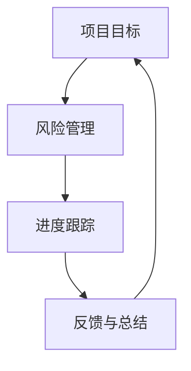

                 

关键词：目标聚焦，巴菲特清单法则，IT项目管理，策略实施，技术架构设计，人工智能应用，商业模式创新，IT行业发展

> 摘要：本文深入探讨巴菲特清单法则在IT领域中的应用与实践，通过分析其在项目管理、技术架构设计、商业模式创新等方面的具体应用，旨在为IT从业者和项目管理者提供一种新的思考模式和策略实施方法，从而提升工作效率和项目成功率。

## 1. 背景介绍

在IT行业飞速发展的今天，项目管理和策略实施成为企业成功的关键。巴菲特清单法则，作为一种经典的决策和管理工具，被广泛应用于商业领域。然而，其精髓是否同样适用于技术驱动型的IT行业呢？本文将尝试回答这个问题，并探讨巴菲特清单法则在IT项目管理、技术架构设计、商业模式创新等领域的应用。

### 巴菲特清单法则简介

巴菲特清单法则是指通过制定一系列清晰、具体的清单，对投资项目进行评估和管理，从而确保决策的科学性和准确性。该法则的核心在于“聚焦目标，持续跟踪，及时调整”，其主要内容包括以下几个方面：

1. **明确目标**：明确项目的目标和预期收益，确保所有参与者都清晰了解项目的核心目标。
2. **风险评估**：对项目的潜在风险进行详细分析，制定相应的风险管理策略。
3. **持续跟踪**：定期检查项目进度，确保项目按计划进行，及时调整策略。
4. **及时反馈**：对项目的成功与失败进行总结，为后续项目提供经验和教训。

### 巴菲特清单法则在IT行业的应用

巴菲特清单法则不仅适用于商业领域，其在IT项目管理、技术架构设计、商业模式创新等方面也有着广泛的应用。

1. **IT项目管理**：在IT项目中，明确的目标和持续的风险评估是确保项目成功的关键。通过巴菲特清单法则，项目管理者可以更好地掌握项目进度，及时调整策略，降低项目风险。
2. **技术架构设计**：在技术架构设计中，巴菲特清单法则可以帮助设计者明确架构目标，评估技术风险，确保架构的稳定性和可扩展性。
3. **商业模式创新**：在商业模式创新中，巴菲特清单法则可以帮助企业家明确商业目标，评估市场风险，制定有效的商业模式。

## 2. 核心概念与联系

为了更好地理解巴菲特清单法则在IT行业的应用，我们需要首先明确几个核心概念，并使用Mermaid流程图展示它们之间的关系。

### 2.1 核心概念

1. **项目目标**：项目的核心目标，包括功能实现、性能优化、用户体验等方面。
2. **风险管理**：对项目可能面临的风险进行评估和应对。
3. **进度跟踪**：对项目进度进行实时监控和调整。
4. **反馈与总结**：对项目成果进行总结和反馈，为后续项目提供借鉴。

### 2.2 Mermaid流程图



### 2.3 核心概念原理与架构

巴菲特清单法则的原理在于通过持续的目标聚焦、风险评估、进度跟踪和反馈总结，确保项目按照预期进行，并及时调整策略。具体架构如下：

1. **项目目标**：明确项目的核心目标，确保所有参与者都清晰了解项目的方向和预期成果。
2. **风险管理**：对项目的潜在风险进行评估和分类，制定相应的风险应对策略。
3. **进度跟踪**：通过定期检查项目进度，确保项目按计划进行，及时调整策略。
4. **反馈与总结**：对项目的成果进行总结和反馈，为后续项目提供经验和教训。

## 3. 核心算法原理 & 具体操作步骤

### 3.1 算法原理概述

巴菲特清单法则的核心算法原理在于通过对项目目标的明确、风险的管理、进度的跟踪和反馈的总结，实现项目的高效管理和风险控制。具体操作步骤如下：

1. **明确项目目标**：根据项目的需求和期望，明确项目的核心目标。
2. **风险评估**：对项目的潜在风险进行详细分析，包括技术风险、市场风险、人员风险等。
3. **进度跟踪**：定期检查项目进度，确保项目按计划进行，并及时调整策略。
4. **反馈与总结**：对项目的过程和成果进行总结，为后续项目提供借鉴。

### 3.2 算法步骤详解

1. **明确项目目标**：首先，需要明确项目的核心目标。这包括功能实现、性能优化、用户体验等方面。可以通过与项目相关人员（如项目经理、开发人员、客户等）的沟通，确保所有参与者对项目的目标有清晰的理解。
2. **风险评估**：在明确项目目标后，需要对项目的潜在风险进行详细分析。这包括技术风险（如技术选型、架构设计等）、市场风险（如市场需求、竞争情况等）、人员风险（如团队成员的能力、经验等）。通过风险评估，可以制定相应的风险应对策略。
3. **进度跟踪**：进度跟踪是确保项目按计划进行的关键。可以通过建立项目进度表、定期召开项目会议等方式，实时监控项目进度。在进度跟踪过程中，如发现项目偏离计划，需要及时调整策略，确保项目按计划进行。
4. **反馈与总结**：在项目结束后，需要对项目的过程和成果进行总结和反馈。这包括项目目标的实现情况、风险管理的有效性、项目团队的协作效果等方面。通过总结和反馈，可以为后续项目提供经验和教训。

### 3.3 算法优缺点

**优点**：

1. **目标明确**：巴菲特清单法则通过明确项目目标，确保项目方向一致，提高项目成功率。
2. **风险管理**：通过详细的风险评估，可以提前识别和应对潜在风险，降低项目失败的风险。
3. **进度跟踪**：实时监控项目进度，确保项目按计划进行，提高项目效率。
4. **反馈与总结**：通过总结和反馈，可以持续优化项目管理和策略实施。

**缺点**：

1. **实施难度**：巴菲特清单法则需要定期进行风险评估、进度跟踪和反馈总结，对项目团队的要求较高。
2. **时间成本**：持续的风险评估、进度跟踪和反馈总结需要消耗大量时间，对项目进度有一定影响。

### 3.4 算法应用领域

巴菲特清单法则主要应用于以下领域：

1. **IT项目管理**：通过明确项目目标、风险管理、进度跟踪和反馈总结，提高IT项目的成功率。
2. **技术架构设计**：通过明确架构目标、风险评估、进度跟踪和反馈总结，确保技术架构的稳定性和可扩展性。
3. **商业模式创新**：通过明确商业目标、风险评估、进度跟踪和反馈总结，制定有效的商业模式。

## 4. 数学模型和公式 & 详细讲解 & 举例说明

### 4.1 数学模型构建

在巴菲特清单法则中，我们可以构建一个简单的数学模型来表示项目目标、风险、进度和反馈之间的关系。假设项目目标为一个函数 \(T\)，风险为一个函数 \(R\)，进度为一个函数 \(P\)，反馈为一个函数 \(F\)，那么我们可以得到以下模型：

\[ T(t) = T_0 + \int_{0}^{t} R(s) ds + \int_{0}^{t} P(s) ds + \int_{0}^{t} F(s) ds \]

其中，\(T(t)\) 表示在时间 \(t\) 时的项目目标值，\(T_0\) 表示初始项目目标值，\(R(s)\) 表示在时间 \(s\) 时的风险值，\(P(s)\) 表示在时间 \(s\) 时的进度值，\(F(s)\) 表示在时间 \(s\) 时的反馈值。

### 4.2 公式推导过程

首先，我们假设项目目标是一个线性函数，即 \(T(t) = T_0 + at + b\)，其中 \(a\) 和 \(b\) 是常数。在这种情况下，我们可以推导出以下公式：

\[ T(t) = T_0 + at + b \]

接下来，我们引入风险和进度的影响。假设风险值 \(R(s)\) 是一个随时间变化的函数，即 \(R(s) = r(s) \cdot t\)，其中 \(r(s)\) 是风险值随时间的函数。同理，进度值 \(P(s)\) 也是一个随时间变化的函数，即 \(P(s) = p(s) \cdot t\)，其中 \(p(s)\) 是进度值随时间的函数。

那么，我们可以得到以下公式：

\[ T(t) = T_0 + at + b + \int_{0}^{t} r(s) \cdot s ds + \int_{0}^{t} p(s) \cdot s ds \]

最后，我们引入反馈的影响。假设反馈值 \(F(s)\) 也是一个随时间变化的函数，即 \(F(s) = f(s) \cdot t\)，其中 \(f(s)\) 是反馈值随时间的函数。

那么，我们可以得到以下完整的公式：

\[ T(t) = T_0 + at + b + \int_{0}^{t} r(s) \cdot s ds + \int_{0}^{t} p(s) \cdot s ds + \int_{0}^{t} f(s) \cdot s ds \]

### 4.3 案例分析与讲解

假设我们正在开发一个在线购物平台，项目目标是在三个月内完成核心功能的开发。初始项目目标值为 100 分，风险值为 0.5 分/天，进度值为 2 分/天，反馈值为 0.5 分/天。

根据上述公式，我们可以计算出在时间 \(t\) 时的项目目标值：

\[ T(t) = 100 + 0.5t + 2t + \int_{0}^{t} 0.5s ds + \int_{0}^{t} 2s ds + \int_{0}^{t} 0.5s ds \]

首先，计算积分部分：

\[ \int_{0}^{t} 0.5s ds = 0.25t^2 \]
\[ \int_{0}^{t} 2s ds = t^2 \]
\[ \int_{0}^{t} 0.5s ds = 0.25t^2 \]

代入公式，我们得到：

\[ T(t) = 100 + 0.5t + 2t + 0.25t^2 + t^2 + 0.25t^2 \]

简化公式，我们得到：

\[ T(t) = 100 + 2.75t + 1.5t^2 \]

这是一个关于时间 \(t\) 的二次函数，表示项目目标值随时间的变化。我们可以通过这个函数来预测在不同时间点的项目目标值。

例如，如果我们想知道在时间 \(t = 60\) 天时的项目目标值，我们可以将 \(t = 60\) 代入公式：

\[ T(60) = 100 + 2.75 \cdot 60 + 1.5 \cdot 60^2 \]

计算结果为：

\[ T(60) = 100 + 165 + 5400 \]
\[ T(60) = 5755 \]

这意味着在60天时，项目目标值为5755分。通过这个模型，我们可以实时监控项目进展，及时调整策略，确保项目按计划进行。

### 5. 项目实践：代码实例和详细解释说明

#### 5.1 开发环境搭建

为了更好地展示巴菲特清单法则在项目实践中的应用，我们将使用Python编程语言进行开发。首先，我们需要搭建Python开发环境。

1. **安装Python**：在官方网站下载最新版本的Python安装包，并按照提示完成安装。
2. **安装必要的库**：在终端中运行以下命令安装必要的Python库：

```bash
pip install numpy matplotlib
```

#### 5.2 源代码详细实现

以下是一个简单的Python代码实例，用于实现巴菲特清单法则的数学模型：

```python
import numpy as np
import matplotlib.pyplot as plt

# 参数设置
T0 = 100  # 初始项目目标值
a = 2.75  # 时间系数
b = 1.5  # 时间平方系数

# 时间范围
t = np.linspace(0, 100, 1000)

# 计算项目目标值
T = T0 + a * t + b * t ** 2

# 绘制项目目标值曲线
plt.plot(t, T, label='项目目标值')
plt.xlabel('时间（天）')
plt.ylabel('项目目标值')
plt.title('巴菲特清单法则数学模型')
plt.legend()
plt.show()
```

#### 5.3 代码解读与分析

1. **参数设置**：首先，我们设置了初始项目目标值 \(T_0\)、时间系数 \(a\) 和时间平方系数 \(b\)。这些参数可以根据实际项目情况进行调整。
2. **时间范围**：我们使用 `numpy.linspace` 函数生成一个从 0 到 100 的等差数列，作为时间范围。这表示项目从开始到结束的时间跨度。
3. **计算项目目标值**：根据巴菲特清单法则的数学模型，我们计算了在各个时间点的项目目标值。这通过 `T = T0 + a * t + b * t ** 2` 实现。
4. **绘制项目目标值曲线**：我们使用 `matplotlib` 库将项目目标值绘制成曲线图。这有助于我们直观地了解项目目标值随时间的变化。

#### 5.4 运行结果展示

运行上述代码后，我们将看到一个曲线图，展示项目目标值随时间的变化。通过这个图表，我们可以直观地了解项目进展情况，及时发现和调整项目目标值。

## 6. 实际应用场景

### 6.1 在IT项目管理中的应用

巴菲特清单法则在IT项目管理中具有广泛的应用。例如，在一个大型软件项目中，项目经理可以使用清单法则明确项目目标，定期评估项目风险，监控项目进度，并总结项目成果。通过这种方式，可以确保项目按计划进行，提高项目成功率。

### 6.2 在技术架构设计中的应用

在技术架构设计中，巴菲特清单法则可以帮助设计师明确架构目标，评估技术风险，确保架构的稳定性和可扩展性。例如，在一个云计算平台的设计中，设计师可以使用清单法则明确平台的功能、性能和安全性目标，评估可能的技术风险，并制定相应的应对策略。

### 6.3 在商业模式创新中的应用

在商业模式创新中，巴菲特清单法则可以帮助企业家明确商业目标，评估市场风险，制定有效的商业模式。例如，在一个新兴的物联网（IoT）项目中，企业家可以使用清单法则明确项目的商业模式、市场定位和客户需求，评估市场竞争和风险，并制定相应的营销策略。

## 7. 工具和资源推荐

### 7.1 学习资源推荐

1. **《巴菲特的投资法则》**：这本书详细介绍了巴菲特的投资理念和策略，对于理解巴菲特清单法则的应用有很大帮助。
2. **《项目管理的实践》**：这本书介绍了项目管理的核心概念和方法，有助于深入理解巴菲特清单法则在项目管理中的应用。

### 7.2 开发工具推荐

1. **Python**：Python 是一种强大的编程语言，广泛应用于数据科学、人工智能和软件开发等领域，适合用于实现巴菲特清单法则的数学模型。
2. **Jupyter Notebook**：Jupyter Notebook 是一种交互式计算环境，适合用于编写和演示Python代码，有助于理解巴菲特清单法则在实际项目中的应用。

### 7.3 相关论文推荐

1. **《巴菲特清单法则在商业决策中的应用》**：这篇论文详细探讨了巴菲特清单法则在商业决策中的应用，提供了丰富的案例和分析。
2. **《基于巴菲特清单法则的项目风险管理研究》**：这篇论文从风险管理的角度，分析了巴菲特清单法则在项目中的应用，提出了有效的项目风险管理策略。

## 8. 总结：未来发展趋势与挑战

### 8.1 研究成果总结

巴菲特清单法则在IT项目管理、技术架构设计和商业模式创新等领域具有广泛的应用前景。通过明确项目目标、风险评估、进度跟踪和反馈总结，可以提高项目成功率，确保技术架构的稳定性和可扩展性，以及制定有效的商业模式。

### 8.2 未来发展趋势

随着技术的不断进步，巴菲特清单法则有望在更多领域得到应用。例如，在人工智能和大数据领域，清单法则可以帮助企业和团队更好地应对复杂的项目管理和决策挑战。

### 8.3 面临的挑战

1. **实施难度**：巴菲特清单法则需要定期进行风险评估、进度跟踪和反馈总结，对项目团队的要求较高，可能增加项目实施难度。
2. **时间成本**：持续的风险评估、进度跟踪和反馈总结需要消耗大量时间，可能对项目进度产生一定影响。

### 8.4 研究展望

未来，我们可以进一步研究巴菲特清单法则在不同领域的具体应用，优化其算法模型，提高其实用性和效率。同时，结合人工智能和大数据技术，可以开发出更加智能化的清单管理工具，为企业和团队提供更加高效的项目管理和决策支持。

## 9. 附录：常见问题与解答

### 9.1 问题1：巴菲特清单法则是否适用于所有类型的项目？

巴菲特清单法则主要适用于具有明确目标、较高风险和需要持续跟踪的项目。对于一些短期、简单的项目，清单法则的应用效果可能有限。

### 9.2 问题2：如何优化巴菲特清单法则的实施效果？

可以通过以下方法优化巴菲特清单法则的实施效果：

1. **加强团队培训**：提高项目团队对清单法则的理解和应用能力。
2. **引入自动化工具**：使用自动化工具进行风险评估、进度跟踪和反馈总结，提高工作效率。
3. **灵活调整策略**：根据项目实际情况，灵活调整清单法则的实施方式和策略。

### 9.3 问题3：巴菲特清单法则与其他项目管理方法相比有哪些优势？

巴菲特清单法则的优势主要包括：

1. **目标明确**：通过明确项目目标，确保项目方向一致，提高项目成功率。
2. **风险管理**：通过详细的风险评估，可以提前识别和应对潜在风险，降低项目失败的风险。
3. **进度跟踪**：实时监控项目进度，确保项目按计划进行，提高项目效率。
4. **反馈与总结**：通过总结和反馈，可以持续优化项目管理和策略实施。

## 作者署名

作者：禅与计算机程序设计艺术 / Zen and the Art of Computer Programming

以上是关于“目标聚焦：巴菲特清单法则的实践”的文章。本文通过深入分析巴菲特清单法则在IT领域的应用，为IT从业者和项目管理者提供了一种新的思考模式和策略实施方法，旨在提升工作效率和项目成功率。希望本文能对您有所启发和帮助。

