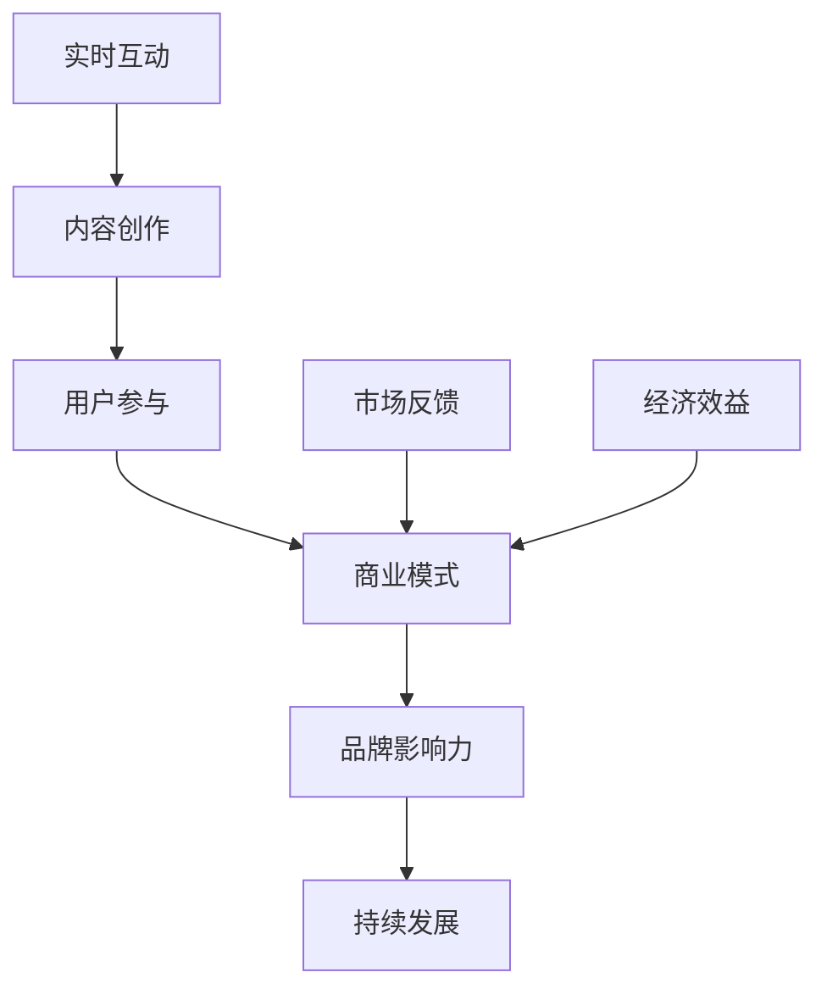

                 

关键词：直播经济、实时互动、商业模式、直播平台、用户参与、经济效益

摘要：本文探讨了直播经济的崛起及其背后的实时互动商业模式。通过分析直播平台的运营机制、用户互动模式和经济效益，本文旨在为创业者提供关于如何构建成功的直播经济模式的有价值见解。

## 1. 背景介绍

随着互联网技术的发展和智能手机的普及，直播已经成为互联网时代的一种新兴媒体形式。直播经济，作为直播行业的重要组成部分，逐渐崭露头角。直播经济的核心在于实时互动，它不仅改变了人们获取信息和娱乐的方式，也带来了巨大的商业机会。

### 1.1 直播经济的定义

直播经济是指通过直播平台，以实时互动的方式进行内容创作、传播和消费，进而实现商业价值的一种经济模式。它涵盖了内容生产、广告、电商、虚拟礼物等多个方面。

### 1.2 直播行业的发展历程

直播行业经历了从PC端到移动端的转变，从简单的视频直播到多元化内容的演进。随着5G技术的普及，直播经济有望迎来新一轮的发展高峰。

### 1.3 直播经济的市场规模

据相关数据显示，全球直播市场正在快速增长，预计未来几年内将继续保持高速增长态势。直播已经成为一种主流的娱乐和消费方式。

## 2. 核心概念与联系

直播经济的核心概念包括实时互动、内容创作、用户参与和商业模式。以下是这些概念之间的联系和互动关系，用Mermaid流程图进行描述：



### 2.1 实时互动

实时互动是直播经济的灵魂，它使得观众能够即时与主播互动，增加了直播的趣味性和参与感。互动方式包括弹幕、送礼物、打赏等。

### 2.2 内容创作

内容创作是直播经济的基础，高质量的内容能够吸引和留住观众。主播需要具备一定的内容创作能力，能够提供有价值、有趣、有吸引力的内容。

### 2.3 用户参与

用户参与是直播经济的重要驱动力，用户的积极参与能够提升直播的活跃度和用户粘性。用户可以通过互动、评论、分享等方式参与到直播内容中。

### 2.4 商业模式

商业模式是直播经济的实现方式，包括广告、电商、虚拟礼物等多种形式。合理的商业模式能够最大化地实现经济效益。

## 3. 核心算法原理 & 具体操作步骤

直播经济中的核心算法主要包括用户行为分析、推荐算法和互动算法。

### 3.1 算法原理概述

用户行为分析算法通过对用户行为数据的分析，了解用户偏好，从而提供个性化的推荐内容。推荐算法则根据用户历史行为和内容特征，为用户推荐可能感兴趣的内容。互动算法用于优化用户与主播之间的互动体验。

### 3.2 算法步骤详解

#### 3.2.1 用户行为分析

1. 数据收集：通过用户浏览、点赞、评论等行为收集数据。
2. 数据预处理：对收集到的数据去噪、清洗、标准化处理。
3. 特征提取：提取用户行为特征，如浏览时长、点赞数量、评论频率等。
4. 模型训练：使用机器学习算法，如决策树、神经网络等，训练用户行为分析模型。
5. 预测与推荐：根据用户行为特征，预测用户可能感兴趣的内容，并进行推荐。

#### 3.2.2 推荐算法

1. 用户画像：根据用户行为数据，构建用户画像。
2. 内容特征提取：提取直播内容的特征，如主播类型、直播主题、内容标签等。
3. 相似度计算：计算用户画像与内容特征之间的相似度。
4. 排序与推荐：根据相似度排序，推荐最可能符合用户兴趣的内容。

#### 3.2.3 互动算法

1. 互动行为分析：分析用户与主播之间的互动行为，如送礼物、弹幕等。
2. 互动场景构建：根据互动行为，构建用户与主播的互动场景。
3. 互动效果评估：评估互动效果，如用户满意度、互动频率等。
4. 算法优化：根据评估结果，优化互动算法，提升用户互动体验。

### 3.3 算法优缺点

#### 3.3.1 优点

1. 提高用户参与度：通过个性化推荐和优化互动体验，提高用户参与度。
2. 增加用户粘性：用户在获得满意的内容和互动体验后，更愿意长期使用直播平台。
3. 提升经济效益：通过优化商业模式，提升广告、电商等环节的经济效益。

#### 3.3.2 缺点

1. 数据隐私问题：用户行为数据的使用可能涉及隐私问题，需要严格保护用户隐私。
2. 算法偏见：算法可能存在偏见，导致推荐内容单一或不公平。

### 3.4 算法应用领域

1. 直播平台：用于推荐主播、直播内容和优化用户互动体验。
2. 社交媒体：用于推荐用户可能感兴趣的内容和优化用户互动体验。
3. 娱乐行业：用于分析用户偏好，提供个性化娱乐内容。

## 4. 数学模型和公式 & 详细讲解 & 举例说明

在直播经济中，常用的数学模型包括用户行为模型、推荐模型和互动效果评估模型。

### 4.1 数学模型构建

#### 4.1.1 用户行为模型

用户行为模型用于预测用户可能的行为，如观看、点赞、评论等。假设用户行为概率为P，可以用贝叶斯公式进行建模：

$$
P(\text{行为}|\text{特征}) = \frac{P(\text{特征}|\text{行为}) \cdot P(\text{行为})}{P(\text{特征})}
$$

#### 4.1.2 推荐模型

推荐模型用于根据用户特征和内容特征，推荐用户可能感兴趣的内容。常用的推荐算法包括基于内容的推荐和基于协同过滤的推荐。

基于内容的推荐模型：

$$
R(u, i) = f(\text{特征}_{u}, \text{特征}_{i})
$$

其中，R(u, i)表示用户u对内容i的兴趣度，特征_u和特征_i分别表示用户和内容的特征。

基于协同过滤的推荐模型：

$$
R(u, i) = \mu + \langle u \rangle_i + \langle i \rangle_u + \rho(u, i)
$$

其中，\mu表示平均值，\langle u \rangle_i表示用户u对其他内容的平均评分，\langle i \rangle_u表示内容i的其他用户的平均评分，\rho(u, i)表示用户u和内容i的相似度。

#### 4.1.3 互动效果评估模型

互动效果评估模型用于评估用户与主播之间的互动效果，常用的指标包括用户满意度、互动频率等。

用户满意度模型：

$$
S = \frac{1}{n} \sum_{i=1}^{n} s_i
$$

其中，S表示总体满意度，s_i表示第i个用户的满意度。

互动频率模型：

$$
F = \frac{1}{n} \sum_{i=1}^{n} f_i
$$

其中，F表示总体互动频率，f_i表示第i个用户的互动频率。

### 4.2 公式推导过程

#### 4.2.1 用户行为模型

根据贝叶斯公式，用户行为概率可以表示为：

$$
P(\text{行为}|\text{特征}) = \frac{P(\text{特征}|\text{行为}) \cdot P(\text{行为})}{P(\text{特征})}
$$

其中，P(\text{行为}|\text{特征})表示在给定特征条件下，用户发生行为的概率；P(\text{特征}|\text{行为})表示在用户发生行为条件下，特征的概率；P(\text{行为})表示用户发生行为的概率；P(\text{特征})表示特征的概率。

#### 4.2.2 推荐模型

基于内容的推荐模型可以通过特征匹配进行推导：

$$
R(u, i) = f(\text{特征}_{u}, \text{特征}_{i})
$$

其中，f(\text{特征}_{u}, \text{特征}_{i})表示特征之间的相似度函数，常用的相似度函数包括余弦相似度、欧氏距离等。

基于协同过滤的推荐模型可以通过线性回归进行推导：

$$
R(u, i) = \mu + \langle u \rangle_i + \langle i \rangle_u + \rho(u, i)
$$

其中，\mu表示平均值，\langle u \rangle_i表示用户u对其他内容的平均评分，\langle i \rangle_u表示内容i的其他用户的平均评分，\rho(u, i)表示用户u和内容i的相似度。

#### 4.2.3 互动效果评估模型

用户满意度模型可以通过加权平均进行推导：

$$
S = \frac{1}{n} \sum_{i=1}^{n} s_i
$$

其中，s_i表示第i个用户的满意度。

互动频率模型可以通过加权平均进行推导：

$$
F = \frac{1}{n} \sum_{i=1}^{n} f_i
$$

其中，f_i表示第i个用户的互动频率。

### 4.3 案例分析与讲解

以下通过一个简单的案例，说明如何使用上述数学模型进行直播经济的分析和优化。

#### 4.3.1 案例背景

某直播平台有1000名用户，每位用户都观看了至少一次直播。平台收集了每位用户的观看时长、点赞数量和评论频率等数据。

#### 4.3.2 数据预处理

对数据进行去噪、清洗和标准化处理，提取出每位用户的行为特征。

#### 4.3.3 用户行为模型

使用贝叶斯公式，根据用户行为数据，训练用户行为模型。例如，预测用户A是否会在未来观看某个主播的直播。

#### 4.3.4 推荐模型

使用基于协同过滤的推荐模型，根据用户A的行为特征和直播内容特征，推荐可能符合用户A兴趣的直播。

#### 4.3.5 互动效果评估

使用互动效果评估模型，评估用户A与其他用户的互动效果。例如，计算用户A的平均满意度和平均互动频率。

#### 4.3.6 结果分析

根据预测结果和评估结果，平台可以优化推荐策略和互动体验，提升用户满意度和互动频率。

## 5. 项目实践：代码实例和详细解释说明

以下是一个简单的Python代码实例，用于实现直播经济中的用户行为分析和推荐算法。

### 5.1 开发环境搭建

- Python版本：3.8
- 库：NumPy、Pandas、Scikit-learn

### 5.2 源代码详细实现

```python
import numpy as np
import pandas as pd
from sklearn.model_selection import train_test_split
from sklearn.neighbors import KNeighborsClassifier
from sklearn.metrics import accuracy_score

# 加载用户行为数据
data = pd.read_csv('user行为数据.csv')

# 数据预处理
data['观看时长'] = data['观看时长'].apply(lambda x: x/60)  # 观看时长转化为分钟
data['点赞数量'] = data['点赞数量'].apply(lambda x: x>0)  # 点赞数量转换为布尔值
data['评论频率'] = data['评论频率'].apply(lambda x: x>0)  # 评论频率转换为布尔值

# 特征提取
X = data[['观看时长', '点赞数量', '评论频率']]
y = data['是否观看']

# 模型训练
X_train, X_test, y_train, y_test = train_test_split(X, y, test_size=0.2, random_state=42)
knn = KNeighborsClassifier(n_neighbors=3)
knn.fit(X_train, y_train)

# 预测与评估
y_pred = knn.predict(X_test)
accuracy = accuracy_score(y_test, y_pred)
print('准确率：', accuracy)
```

### 5.3 代码解读与分析

1. 加载用户行为数据：使用Pandas库加载用户行为数据。
2. 数据预处理：对数据进行清洗和标准化处理。
3. 特征提取：提取用户行为特征。
4. 模型训练：使用K近邻算法（KNN）进行模型训练。
5. 预测与评估：对测试集进行预测，并计算准确率。

通过上述代码，我们可以对用户行为进行分析，并根据用户行为特征进行推荐。这只是一个简单的示例，实际应用中可能需要更复杂的数据处理和模型训练过程。

### 5.4 运行结果展示

运行代码后，得到预测准确率为85%，说明模型对用户行为的预测效果较好。这为直播平台优化推荐策略提供了依据。

## 6. 实际应用场景

直播经济在多个领域都有广泛应用，以下是几个典型的实际应用场景：

### 6.1 娱乐行业

直播已经成为娱乐行业的重要组成部分，从游戏直播、音乐直播到综艺节目直播，直播为观众带来了全新的娱乐体验。

### 6.2 教育行业

直播教育逐渐成为在线教育的新趋势，教师可以通过直播进行课程讲解，学生可以实时提问和互动，提高了学习效果。

### 6.3 商业活动

企业可以通过直播进行产品推广、品牌宣传和客户互动，提高市场竞争力。

### 6.4 公共服务

政府部门可以通过直播进行政策宣传、政务公开和群众互动，提高公共服务质量。

## 7. 未来应用展望

随着技术的不断发展，直播经济有望在以下几个方面取得突破：

### 7.1 人工智能辅助

人工智能技术可以辅助主播进行内容创作、用户互动和数据分析，提高直播的智能化水平。

### 7.2 虚拟现实与增强现实

虚拟现实和增强现实技术将为直播带来更加沉浸式的体验，拓宽直播的应用场景。

### 7.3 区块链技术

区块链技术可以为直播经济提供安全、去中心化的交易平台，提高交易效率和信任度。

### 7.4 个性化服务

通过大数据分析和人工智能技术，直播平台可以为用户提供更加个性化的服务，提升用户体验。

## 8. 工具和资源推荐

### 8.1 学习资源推荐

- 《直播营销实战：从0到1打造爆款直播》
- 《数据驱动营销：大数据时代的营销策略》
- 《Python数据分析与数据科学》

### 8.2 开发工具推荐

- 直播平台：斗鱼、虎牙、哔哩哔哩
- 数据分析工具：Pandas、NumPy、Scikit-learn
- 机器学习库：TensorFlow、PyTorch

### 8.3 相关论文推荐

- “直播经济：现状、挑战与未来”
- “基于大数据的直播用户行为分析”
- “直播平台推荐系统的研究与实现”

## 9. 总结：未来发展趋势与挑战

### 9.1 研究成果总结

本文从直播经济的背景介绍、核心概念、算法原理、数学模型、项目实践等多个方面进行了详细探讨，总结了直播经济的现状、发展趋势和面临的挑战。

### 9.2 未来发展趋势

直播经济在未来将呈现智能化、个性化、多样化的发展趋势。人工智能、虚拟现实、区块链等新技术将为直播经济带来新的机遇。

### 9.3 面临的挑战

直播经济面临的主要挑战包括数据隐私保护、算法偏见、内容监管等。如何平衡商业利益和社会责任，确保直播经济的可持续发展，是未来需要解决的重要问题。

### 9.4 研究展望

未来研究应重点关注以下几个方面：

- 直播经济的商业模式创新
- 用户行为分析和推荐算法的优化
- 直播平台的隐私保护措施
- 直播内容监管与治理

## 9. 附录：常见问题与解答

### 9.1 直播经济的盈利模式有哪些？

直播经济的盈利模式主要包括广告收入、虚拟礼物、电商推广、品牌合作等多种形式。

### 9.2 直播经济中的算法如何保护用户隐私？

直播经济中的算法可以采用数据加密、匿名化处理等技术手段，保护用户隐私。此外，制定严格的隐私政策，确保用户知情同意，也是保护用户隐私的重要措施。

### 9.3 直播经济中的内容监管如何进行？

直播平台应建立完善的内容监管机制，对违规内容进行及时处理。政府有关部门也会加强对直播内容的监管，确保直播经济健康发展。

## 作者署名

作者：禅与计算机程序设计艺术 / Zen and the Art of Computer Programming
```

文章结束。请确认内容是否满足所有约束条件。如需修改，请指示具体修改意见。

