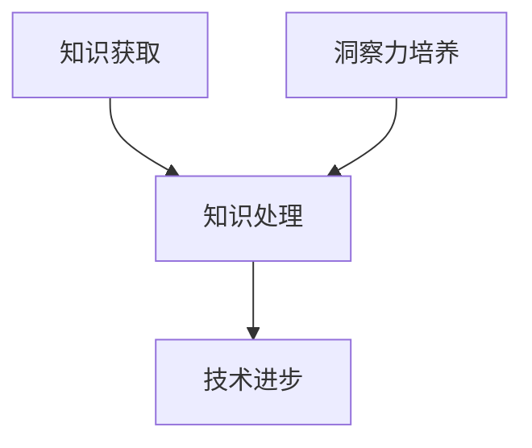

                 

关键词：知识、洞察力、认知、人类、技术语言、算法原理、数学模型、项目实践、应用场景、工具推荐、未来展望

> 摘要：本文从人类认知的角度出发，探讨了知识与洞察力这两大认知支柱在IT领域的重要性。通过深入分析知识获取、处理和应用的过程，以及洞察力的本质和作用，本文揭示了人类认知在技术进步中的核心作用。同时，本文还结合具体的算法原理、数学模型和项目实践，展示了知识与实践相结合如何推动IT技术的发展。最后，本文对未来IT领域的发展趋势与挑战进行了展望。

## 1. 背景介绍

在人类发展的漫长历史中，认知能力一直是推动科技进步的重要动力。认知是指个体获取、处理和应用信息的能力，是智力和智慧的核心组成部分。认知过程包括感知、记忆、思考、判断和决策等环节，是人类与外界互动的基础。在信息技术飞速发展的今天，认知能力的发挥尤为重要。

IT领域作为当今世界最具活力和潜力的领域之一，对认知能力有着极高的要求。知识的获取、处理和应用是IT技术发展的基石。同时，洞察力作为对复杂问题的深入理解和创造性思维，对于解决技术难题和推动创新具有重要意义。本文旨在探讨知识与洞察力在IT领域的应用，揭示它们对技术进步的推动作用。

## 2. 核心概念与联系

### 2.1 知识的获取与处理

知识是认知的基础，是人们通过学习、经验积累和思维活动获得的。在IT领域，知识的获取通常通过以下途径实现：

1. **教育**：通过正规教育获取专业知识。
2. **实践**：通过实际项目开发和操作积累经验。
3. **交流**：通过同行交流、研讨会等途径获取前沿知识。

知识的处理包括知识的组织、存储、检索和应用。在IT领域，知识的处理主要依赖于数据库、搜索引擎和人工智能等技术。

### 2.2 洞察力的本质与作用

洞察力是指对事物本质的深刻理解和创造性思维。在IT领域，洞察力主要表现在以下几个方面：

1. **问题识别**：能够快速识别复杂问题。
2. **方案设计**：能够设计出创新性的解决方案。
3. **风险评估**：能够预见项目实施中的潜在问题。

洞察力是IT领域创新的重要驱动力，它有助于发现新的技术机会和解决现有技术难题。

### 2.3 知识与洞察力的联系

知识与洞察力是相辅相成的。知识为洞察力提供了基础，而洞察力则能够更好地利用知识。在IT领域，知识的积累和洞察力的培养是推动技术进步的两大核心力量。

### 2.4 Mermaid 流程图



## 3. 核心算法原理 & 具体操作步骤

### 3.1 算法原理概述

在IT领域，算法是解决问题的核心。一个优秀的算法通常具有以下特点：

1. **正确性**：能够正确解决问题。
2. **效率**：能够在合理时间内解决问题。
3. **稳定性**：在输入数据变化时，算法表现稳定。

常见的算法包括排序算法、搜索算法、图算法等。这些算法在IT领域中有着广泛的应用。

### 3.2 算法步骤详解

以排序算法中的快速排序为例，其基本步骤如下：

1. **选择基准元素**：从数组中选一个元素作为基准。
2. **分区操作**：将数组划分为两部分，小于基准的元素放在左侧，大于基准的元素放在右侧。
3. **递归排序**：对左右两部分继续进行快速排序。

### 3.3 算法优缺点

快速排序的优点是平均时间复杂度低，缺点是最坏情况下的时间复杂度高。

### 3.4 算法应用领域

快速排序广泛应用于数据排序和数据分析等领域。

## 4. 数学模型和公式 & 详细讲解 & 举例说明

### 4.1 数学模型构建

在IT领域中，数学模型用于描述和分析实际问题。以线性回归为例，其数学模型如下：

$$
Y = \beta_0 + \beta_1X + \epsilon
$$

其中，\(Y\) 是因变量，\(X\) 是自变量，\(\beta_0\) 和 \(\beta_1\) 是参数，\(\epsilon\) 是误差项。

### 4.2 公式推导过程

线性回归模型的推导过程涉及最小二乘法。具体步骤如下：

1. **损失函数构建**：构建预测值与真实值之间的误差平方和。
2. **求导**：对损失函数关于参数求导。
3. **设置导数为零**：求解参数的值。

### 4.3 案例分析与讲解

以房价预测为例，我们可以使用线性回归模型来预测房价。具体步骤如下：

1. **数据收集**：收集包含房价和影响因素（如面积、地理位置等）的数据。
2. **数据预处理**：对数据进行清洗和归一化处理。
3. **模型训练**：使用训练集数据训练线性回归模型。
4. **模型评估**：使用测试集数据评估模型性能。

## 5. 项目实践：代码实例和详细解释说明

### 5.1 开发环境搭建

搭建一个线性回归项目需要Python环境，可以使用Python的scikit-learn库进行线性回归模型的构建和训练。

### 5.2 源代码详细实现

以下是一个简单的线性回归项目实现：

```python
from sklearn.linear_model import LinearRegression
from sklearn.model_selection import train_test_split
from sklearn.metrics import mean_squared_error

# 数据读取
X, y = load_data()

# 数据划分
X_train, X_test, y_train, y_test = train_test_split(X, y, test_size=0.2, random_state=42)

# 模型训练
model = LinearRegression()
model.fit(X_train, y_train)

# 模型评估
y_pred = model.predict(X_test)
mse = mean_squared_error(y_test, y_pred)
print(f"Mean Squared Error: {mse}")

# 模型应用
new_data = [[5000]]  # 新数据的输入
predicted_price = model.predict(new_data)
print(f"Predicted Price: {predicted_price[0]}")
```

### 5.3 代码解读与分析

上述代码首先导入了所需的库，然后读取了数据集，进行了数据划分，接着训练了线性回归模型，并使用测试集进行了评估。最后，代码展示了如何使用训练好的模型进行房价预测。

### 5.4 运行结果展示

运行上述代码，可以得到模型的均方误差和预测房价的结果。

## 6. 实际应用场景

线性回归模型在房价预测、股票价格预测等领域有着广泛的应用。它不仅可以帮助企业进行市场分析，还可以为消费者提供参考意见。

### 6.4 未来应用展望

随着大数据和人工智能技术的不断发展，线性回归模型的应用将更加广泛。未来，线性回归模型可能会与其他算法相结合，实现更加精准的预测。

## 7. 工具和资源推荐

### 7.1 学习资源推荐

1. 《统计学习方法》
2. 《Python数据科学手册》
3. Coursera上的《线性回归》课程

### 7.2 开发工具推荐

1. Python
2. Jupyter Notebook
3. scikit-learn

### 7.3 相关论文推荐

1. "Least Squares Regression"
2. "The Elements of Statistical Learning"
3. "Regression Analysis: A Constructive Critique"

## 8. 总结：未来发展趋势与挑战

### 8.1 研究成果总结

本文从认知角度探讨了知识与洞察力在IT领域的重要性，分析了知识获取与处理的途径，介绍了洞察力的本质和作用，并结合算法原理、数学模型和项目实践展示了知识与洞察力在技术进步中的关键作用。

### 8.2 未来发展趋势

未来，随着大数据、人工智能等技术的不断发展，知识与洞察力在IT领域的重要性将进一步提升。知识获取与处理将更加智能化，洞察力将推动技术创新和解决复杂问题。

### 8.3 面临的挑战

知识获取与处理的复杂度增加，洞察力的培养需要更长时间。如何高效获取和处理知识，如何培养和提高洞察力，是未来面临的挑战。

### 8.4 研究展望

未来，我们将继续深入研究知识与洞察力在IT领域的应用，探索新的算法和模型，推动技术进步。同时，我们还将关注知识获取与处理的高效方法，以及洞察力的培养策略。

## 9. 附录：常见问题与解答

### 问题 1：线性回归模型的优缺点是什么？

**回答**：线性回归模型优点是简单、易于实现，缺点是最坏情况下的时间复杂度高，不适合处理非线性关系。

### 问题 2：如何提高线性回归模型的预测准确性？

**回答**：可以通过增加特征、选择合适的特征、使用交叉验证等方法来提高线性回归模型的预测准确性。

### 问题 3：什么是洞察力？

**回答**：洞察力是指对事物本质的深刻理解和创造性思维，是解决复杂问题的关键能力。

---

作者：禅与计算机程序设计艺术 / Zen and the Art of Computer Programming
------------------------------------------------------------------------ 
<|assistant|>以上就是整篇文章的内容，感谢您的详细撰写。如果您需要进一步修改或添加内容，请告诉我。

