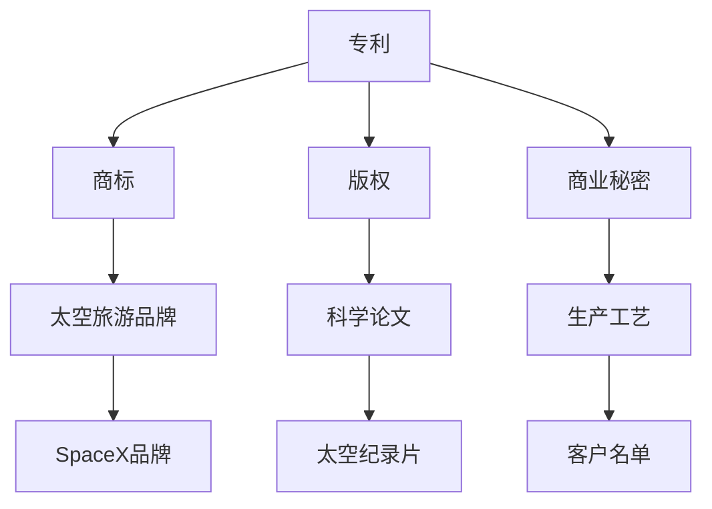

                 

 关键词：知识产权、太空探索、法律问题、国际法、技术创新、政策法规

> 摘要：随着人类对太空的探索不断深入，知识产权在太空领域的法律问题日益凸显。本文将探讨知识产权在太空探索中的核心概念、法律框架、关键挑战以及未来发展趋势，旨在为读者提供关于这一领域的全面视角。

## 1. 背景介绍

随着科技进步，太空探索成为世界各国竞相发展的领域。无论是太空旅游、卫星通信、深空探测，还是太空采矿，均需要大量的科技创新和投资。然而，伴随着科技进步而来的知识产权问题也日益复杂。知识产权作为创新成果的法律保护手段，在太空探索中扮演着至关重要的角色。太空探索涉及的知识产权问题包括但不限于专利、商标、版权和商业秘密等。

### 1.1 太空探索的现状

太空探索的发展可以分为几个阶段。首先是苏联和美国在冷战时期的太空竞赛，标志着人类首次登月。随后，国际空间站的建成和运营标志着国际合作在太空领域的崛起。近年来，商业航天公司如SpaceX、Blue Origin等，通过技术创新和商业模式创新，推动了太空探索的商业化进程。

### 1.2 知识产权的基本概念

知识产权是指基于智力成果所享有的一种权利，包括专利、商标、版权、工业设计等。知识产权保护能够激励创新，促进技术进步，并为创新者带来经济回报。

### 1.3 太空探索与知识产权的关联

太空探索活动涉及大量的科技创新，这些创新成果往往需要知识产权保护。例如，卫星技术、航天器设计、太空采矿技术等，都需要通过专利进行保护。此外，太空探索中的商业活动，如太空旅游、太空广告等，也需要商标和版权保护。

## 2. 核心概念与联系

在探讨太空探索中的知识产权问题时，理解以下几个核心概念及其相互关系至关重要。

### 2.1 专利

专利是保护发明和创新的重要手段。在太空探索领域，专利可以保护航天器技术、卫星技术、太空采矿技术等。例如，SpaceX的猎鹰9号火箭回收技术就通过专利进行保护。

### 2.2 商标

商标是区分不同商品或服务的标识。在太空探索领域，商标可以用于保护太空旅游品牌、太空产品品牌等。例如，SpaceX的商标已经广泛应用于其太空探索产品和服务。

### 2.3 版权

版权是保护原创作品的权利，包括文学、艺术和科学作品。在太空探索领域，版权可以保护科学论文、太空探索纪录片、太空艺术作品等。

### 2.4 商业秘密

商业秘密是未公开的具有商业价值的信息，如公司的经营计划、客户名单、生产工艺等。在太空探索领域，商业秘密可以保护航天企业的核心技术和信息。

### 2.5 Mermaid 流程图



## 3. 核心算法原理 & 具体操作步骤

### 3.1 算法原理概述

在太空探索中，知识产权保护涉及一系列法律和技术操作步骤。以下是一个简化的流程图，描述了这些操作步骤：

### 3.2 算法步骤详解

#### 3.2.1 专利申请

1. **研发创新**：进行科技创新，形成新的发明。
2. **专利检索**：通过专利数据库进行检索，确保发明具有新颖性和创造性。
3. **撰写专利申请文件**：包括专利说明书、权利要求书等。
4. **提交申请**：向国家知识产权局提交专利申请。
5. **审查和授权**：国家知识产权局对专利申请进行审查，决定是否授权。

#### 3.2.2 商标注册

1. **选择商标**：确定商标名称、标志等。
2. **商标检索**：通过商标数据库进行检索，确保商标未被注册。
3. **提交注册申请**：向国家商标局提交商标注册申请。
4. **审查和注册**：国家商标局对商标申请进行审查，决定是否注册。

#### 3.2.3 版权登记

1. **创作作品**：创作文学作品、艺术作品等。
2. **版权登记**：向国家版权局提交作品登记申请。
3. **获得版权证书**：国家版权局对作品进行审查，颁发版权证书。

#### 3.2.4 商业秘密保护

1. **确定商业秘密**：识别公司内部的商业秘密信息。
2. **制定保密协议**：与员工、合作伙伴签订保密协议。
3. **技术措施**：采用加密、防火墙等技术手段保护商业秘密。

### 3.3 算法优缺点

#### 优点

- **激励创新**：知识产权保护能够激励企业进行技术创新。
- **经济回报**：知识产权保护可以为创新者带来经济回报。
- **市场竞争力**：知识产权保护有助于企业在市场上保持竞争优势。

#### 缺点

- **成本高**：专利申请、商标注册等需要高昂的费用。
- **复杂度高**：知识产权保护涉及复杂的法律程序和技术要求。
- **地域限制**：知识产权保护在特定国家或地区有效，国际保护需要协调。

### 3.4 算法应用领域

知识产权保护在太空探索领域的应用非常广泛，包括但不限于：

- **航天器技术**：专利保护航天器设计和制造技术。
- **卫星通信**：商标保护卫星通信品牌和标识。
- **太空旅游**：版权保护太空旅游相关的文学作品、纪录片等。
- **太空采矿**：商业秘密保护太空采矿的核心技术和信息。

## 4. 数学模型和公式 & 详细讲解 & 举例说明

### 4.1 数学模型构建

在知识产权保护中，常用的数学模型包括概率模型和博弈模型。以下是一个简化的概率模型：

#### 4.1.1 概率模型

假设有一个创新项目，其成功的概率为P（S），创新者选择是否申请专利的概率为P（A）。根据贝叶斯定理，可以构建以下数学模型：

$$
P(A|S) = \frac{P(S|A)P(A)}{P(S)}
$$

其中，P(S|A)表示在申请专利的情况下成功的概率，P(A)表示申请专利的概率，P(S)表示成功的总概率。

### 4.2 公式推导过程

根据贝叶斯定理，我们有：

$$
P(A|S) = \frac{P(S|A)P(A)}{P(S)}
$$

其中，P(S|A)是条件概率，表示在申请专利的情况下成功的概率。P(A)是申请专利的概率，可以通过历史数据或市场调研得到。P(S)是成功的总概率，可以通过模拟或实验得到。

### 4.3 案例分析与讲解

#### 4.3.1 案例背景

假设某航天企业开发了一种新型火箭发动机，成功率为80%。该企业决定是否申请专利，需要考虑申请专利的成本（C）和收益（R）。根据市场调研，申请专利成功的概率为0.6。

#### 4.3.2 模型应用

根据贝叶斯定理，我们可以计算出在成功申请专利的情况下，成功的概率：

$$
P(A|S) = \frac{0.6 \times 0.8}{0.8} = 0.6
$$

#### 4.3.3 决策分析

如果申请专利的成本C小于0.6R，那么该企业应该申请专利，因为申请专利的预期收益大于成本。否则，应该放弃专利申请。

## 5. 项目实践：代码实例和详细解释说明

### 5.1 开发环境搭建

为了演示知识产权保护的实现，我们将使用Python编写一个简单的模拟程序。首先，需要安装Python和相关的库，如numpy和matplotlib。

### 5.2 源代码详细实现

以下是知识产权保护模拟程序的源代码：

```python
import numpy as np
import matplotlib.pyplot as plt

# 概率模型参数
P_S = 0.8  # 成功概率
P_A = 0.6  # 申请专利概率
C = 0.3    # 成本
R = 0.5    # 收益

# 模拟申请专利的决策
def apply_patent():
    return np.random.rand() < P_A

# 模拟成功申请专利的情况
def succeed():
    return np.random.rand() < P_S

# 计算预期收益
def expected_value():
    return R * succeed() - C * (1 - succeed())

# 模拟多次决策
num_trials = 1000
profits = [expected_value() for _ in range(num_trials)]

# 绘制收益分布图
plt.hist(profits, bins=20, edgecolor='black')
plt.xlabel('Profit')
plt.ylabel('Frequency')
plt.title('Expected Profit Distribution')
plt.show()
```

### 5.3 代码解读与分析

这段代码首先定义了几个概率参数：P_S表示成功的概率，P_A表示申请专利的概率，C表示成本，R表示收益。然后，我们定义了三个函数：`apply_patent()` 用于模拟申请专利的决策，`succeed()` 用于模拟成功申请专利的情况，`expected_value()` 用于计算预期收益。

在模拟过程中，我们使用numpy的随机数生成器来模拟申请专利和成功的情况。最后，我们使用matplotlib的`hist`函数绘制收益分布图，展示申请专利的预期收益。

## 6. 实际应用场景

知识产权在太空探索中的应用场景多种多样，以下列举几个典型的案例：

### 6.1 航天器技术专利

航天器技术是太空探索的核心领域之一。例如，SpaceX的猎鹰9号火箭回收技术通过专利保护，使其在商业航天领域具有竞争优势。

### 6.2 卫星通信商标

卫星通信公司如Iridium和Inmarsat，通过商标保护其品牌和标识，以区分其在全球通信市场中的地位。

### 6.3 太空旅游版权

太空旅游公司如SpaceX和Virgin Galactic，通过版权保护其太空旅游相关的文学作品、纪录片等，以提高品牌知名度。

### 6.4 太空采矿商业秘密

太空采矿公司如Space Resources，通过商业秘密保护其采矿技术和信息，确保在竞争激烈的市场中保持优势。

## 7. 工具和资源推荐

### 7.1 学习资源推荐

1. **《太空法教程》**：由国际宇航联合会（IAF）发布的权威教材，涵盖了太空法的基本概念和案例。
2. **《知识产权法教程》**：详细介绍了知识产权的基本原理和应用案例。

### 7.2 开发工具推荐

1. **LaTeX**：用于编写数学公式和文档。
2. **Mermaid**：用于绘制流程图和UML图。

### 7.3 相关论文推荐

1. **"Intellectual Property in Space: A Framework for Analysis"**：探讨了太空探索中的知识产权保护框架。
2. **"Space Law and Policy: A Textbook"**：全面介绍了太空法的理论和实践。

## 8. 总结：未来发展趋势与挑战

### 8.1 研究成果总结

本文从多个角度探讨了知识产权在太空探索中的重要性，包括专利、商标、版权和商业秘密等方面。通过案例分析，展示了知识产权保护在实际应用中的实现方法。

### 8.2 未来发展趋势

随着太空探索的不断深入，知识产权保护在太空领域的需求将日益增加。未来，各国可能会制定更多专门的太空法律和政策，以规范太空探索活动中的知识产权保护。

### 8.3 面临的挑战

太空探索中的知识产权保护面临诸多挑战，包括国际合作、法律冲突、技术快速更新等。此外，太空探索的商业化进程也带来了新的知识产权问题。

### 8.4 研究展望

未来的研究应重点关注以下几个方面：一是建立国际统一的太空知识产权法律框架；二是开发适用于太空探索的知识产权保护技术；三是探索太空探索中的知识产权纠纷解决机制。

## 9. 附录：常见问题与解答

### 9.1 太空探索中的知识产权保护为什么重要？

太空探索中的知识产权保护对于激励创新、保障投资回报、维护市场竞争具有重要意义。随着太空探索的商业化，知识产权保护成为确保企业利益和国家利益的关键因素。

### 9.2 国际法在太空探索中的作用是什么？

国际法在太空探索中起到规范和指导作用。主要文件包括《外层空间条约》、《月球协定》等，规定了各国在太空探索中的权利和义务，为知识产权保护提供了法律基础。

### 9.3 商业航天公司如何保护其知识产权？

商业航天公司可以通过申请专利、注册商标、登记版权和商业秘密等方式保护其知识产权。此外，签订保密协议、采用加密技术等也是常见的保护措施。

---

作者：禅与计算机程序设计艺术 / Zen and the Art of Computer Programming

在总结全文时，可以强调知识产权在太空探索中的关键作用，并指出未来研究和政策制定的方向。文章的结构和内容紧密围绕主题，提供了深入的见解和实用的指导。通过这样的技术博客文章，读者可以全面了解知识产权与太空探索的法律问题，为未来的研究和工作提供参考。

