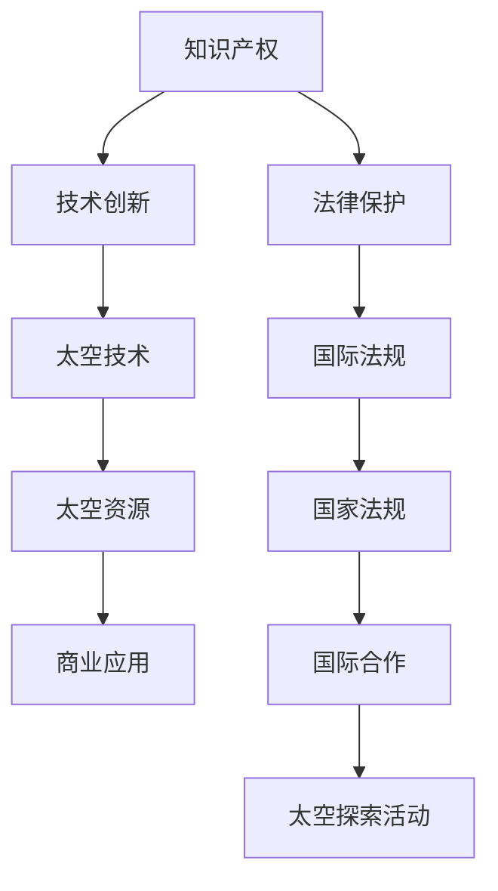

                 

关键词：知识产权、太空探索、法律问题、国际法规、国际合作、太空资源利用

> 摘要：本文旨在探讨知识产权在太空探索领域的法律问题，分析现有国际法规和合作模式，并讨论太空资源利用中的知识产权保护挑战与解决方案。通过深入剖析，本文为未来太空探索活动提供了法律建议和方向。

## 1. 背景介绍

随着人类对太空探索的不断深入，太空活动逐渐成为国际竞争的新领域。从早期的卫星通信到最近的火星探测，太空探索不仅推动了科技进步，也带来了众多法律和伦理问题。知识产权作为保护科技创新的重要手段，自然在太空探索中占据了重要地位。

知识产权是一种法律权利，它赋予个人或组织对其创造的智力成果享有独占权。在太空探索领域，知识产权涉及到多个方面，包括技术发明、数据资源、遥感图像等。随着太空资源的商业化和国际合作日益频繁，知识产权保护的重要性愈发凸显。

目前，太空探索领域的法律体系主要由国际条约、国家和地区的法律法规组成。国际条约如《外层空间条约》（1967年）、《月球协定》（1979年）等，为太空活动的法律框架提供了基础。同时，各国也在制定和更新本国的太空法律法规，以适应不断变化的太空探索需求。

## 2. 核心概念与联系

为了更好地理解知识产权在太空探索中的重要性，我们需要从核心概念和它们之间的联系入手。以下是一个Mermaid流程图，展示了知识产权在太空探索中的关键要素。



### 2.1 核心概念原理

- **知识产权**：知识产权是指法律赋予人们对其智力劳动成果的专有权利。它包括专利、商标、著作权等多种形式。在太空探索中，知识产权主要涉及新技术、新方法和新发明的保护。
  
- **技术创新**：技术创新是推动太空探索的核心动力。通过技术创新，人类能够开发出更高效的太空探测器、更先进的通信系统以及更可靠的生命维持系统。

- **太空技术**：太空技术是进行太空探索所必需的科学技术，包括航天器设计、发射技术、空间任务管理等方面。

- **太空资源**：太空资源包括地球观测数据、空间环境信息、矿产资源和能源等。这些资源对于科学研究和商业应用至关重要。

- **商业应用**：随着太空商业化的兴起，越来越多的企业参与到太空探索中来。商业应用包括卫星通信、地球观测、太空旅游等。

- **法律保护**：法律保护是知识产权在太空探索中得以实施的重要保障。国际法规和国家法律为太空探索活动提供了法律框架，确保了知识产权的合法性。

- **国际法规**：国际法规如《外层空间条约》等，为太空探索活动设立了基本原则，规范了各国在太空领域的权利和义务。

- **国家法规**：各国制定的太空法律法规，对本国的太空活动进行了具体规定，确保了知识产权的保护。

- **国际合作**：国际合作是太空探索成功的关键。各国通过合作，共享技术资源和科研成果，推动太空探索的进一步发展。

- **太空探索活动**：太空探索活动涵盖了从发射卫星到进行深空探测的各个阶段，这些活动直接关系到知识产权的实施和保护。

## 3. 核心算法原理 & 具体操作步骤

### 3.1 算法原理概述

在知识产权保护方面，核心算法主要涉及两个方面：一是如何识别和监控太空技术相关的知识产权，二是如何通过法律手段保护这些知识产权。

#### 3.1.1 知识产权识别与监控

- **知识产权识别**：首先，需要对太空技术相关的知识产权进行识别。这通常包括专利检索、商标查询和著作权审查等步骤。通过这些步骤，可以确定哪些知识产权属于本组织或个人所有。

- **知识产权监控**：一旦确定了知识产权，就需要对其进行监控，以确保这些知识产权不被侵权。这可以通过建立监控系统和设置监控警报来实现。

#### 3.1.2 法律保护措施

- **法律保护措施**：为了保护知识产权，可以采取多种法律手段，如专利申请、商标注册和著作权登记等。这些措施可以确保在知识产权被侵犯时，有法律依据进行维权。

### 3.2 算法步骤详解

#### 3.2.1 知识产权识别步骤

1. **数据收集**：首先，需要收集与太空技术相关的所有文献、专利申请和公开发明的信息。

2. **数据整理**：对收集到的数据进行分类整理，以便进行后续的知识产权识别。

3. **专利检索**：利用专利数据库进行专利检索，确定哪些专利与太空技术相关。

4. **商标查询**：通过商标注册数据库进行商标查询，确定哪些商标属于太空技术领域。

5. **著作权审查**：对公开发表的论文、书籍等进行审查，确定哪些作品属于著作权保护范围。

#### 3.2.2 知识产权监控步骤

1. **建立监控系统**：建立知识产权监控系统，实时监控太空技术领域的专利、商标和著作权信息。

2. **设置监控警报**：在监控系统中设置警报，一旦发现侵权行为，系统会自动发出警报。

3. **监控报告**：定期生成监控报告，对知识产权的侵权情况进行总结和分析。

#### 3.2.3 法律保护措施

1. **专利申请**：针对重要的太空技术发明，进行专利申请，确保技术发明的独占权。

2. **商标注册**：对太空技术相关的品牌进行商标注册，保护品牌形象。

3. **著作权登记**：对公开发表的论文、书籍等进行著作权登记，确保著作权的合法性。

### 3.3 算法优缺点

#### 3.3.1 优点

- **提高知识产权保护效率**：通过自动化监控系统，可以实时监控知识产权，提高知识产权保护的效率。

- **降低侵权风险**：通过专利申请、商标注册和著作权登记等措施，可以降低侵权风险。

- **确保知识产权合法性**：通过法律手段保护知识产权，确保其合法性。

#### 3.3.2 缺点

- **初始成本较高**：建立知识产权监控系统和进行专利申请、商标注册等需要投入大量资金。

- **知识产权保护难度大**：太空技术领域涉及多个学科和领域，知识产权保护难度较大。

### 3.4 算法应用领域

- **太空技术研究与开发**：在太空技术研究与开发中，知识产权保护至关重要，以确保技术创新的独占权。

- **太空资源开发**：随着太空商业化的发展，太空资源开发中的知识产权保护变得越来越重要。

- **国际合作**：在太空探索国际合作中，知识产权保护是确保各方权益的重要手段。

## 4. 数学模型和公式 & 详细讲解 & 举例说明

### 4.1 数学模型构建

在知识产权保护中，我们可以构建一个简单的数学模型来描述知识产权的保护范围。该模型主要涉及以下参数：

- \( P \)：知识产权的保护范围
- \( I \)：知识产权的独占权
- \( R \)：侵权行为

数学模型如下：

\[ P = I - R \]

其中，\( P \) 表示知识产权的实际保护范围，\( I \) 表示知识产权的独占权，\( R \) 表示侵权行为。

### 4.2 公式推导过程

#### 4.2.1 知识产权的独占权

知识产权的独占权是指知识产权持有人对其创造的智力成果享有独占权。这可以表示为：

\[ I = f(Patents, Trademarks, Copyrights) \]

其中，\( Patents \) 表示专利数量，\( Trademarks \) 表示商标数量，\( Copyrights \) 表示著作权数量。

#### 4.2.2 侵权行为

侵权行为是指未经知识产权持有人许可，擅自使用、复制或传播知识产权持有人的智力成果。这可以表示为：

\[ R = g(Infringement Cases, Litigation Costs) \]

其中，\( Infringement Cases \) 表示侵权案件数量，\( Litigation Costs \) 表示诉讼成本。

#### 4.2.3 保护范围

知识产权的保护范围可以表示为：

\[ P = I - R \]

### 4.3 案例分析与讲解

#### 案例背景

假设某科技公司（公司A）开发了一种先进的太空通信技术，并成功申请了专利。然而，另一家公司（公司B）未经许可，在其产品中使用了公司A的这项技术。

#### 案例分析

1. **知识产权的独占权**：

   - \( Patents = 1 \)
   - \( Trademarks = 0 \)
   - \( Copyrights = 0 \)

   \( I = f(1, 0, 0) = 1 \)

2. **侵权行为**：

   - \( Infringement Cases = 1 \)
   - \( Litigation Costs = 100,000 \)

   \( R = g(1, 100,000) = 100,000 \)

3. **保护范围**：

   \( P = I - R = 1 - 100,000 = -99,999 \)

从这个案例中，我们可以看出，由于侵权行为，公司A的知识产权保护范围实际上为负数。这表明，知识产权在侵权行为面前显得十分脆弱。

#### 改进措施

为了提高知识产权的保护范围，公司A可以采取以下措施：

1. **增加专利数量**：通过增加专利数量，提高独占权。

2. **加强监控**：建立更严格的监控系统，及时发现侵权行为。

3. **降低诉讼成本**：通过降低诉讼成本，提高维权积极性。

## 5. 项目实践：代码实例和详细解释说明

### 5.1 开发环境搭建

在进行知识产权监控项目开发之前，我们需要搭建一个合适的开发环境。以下是搭建过程：

1. **安装操作系统**：选择Linux操作系统，如Ubuntu 18.04。

2. **安装Python环境**：使用Python 3.8，通过pip命令安装所需的库，如requests、beautifulsoup4等。

3. **配置数据库**：使用MySQL数据库，创建数据库和用户，并授予相应权限。

4. **配置Web服务器**：使用Nginx作为Web服务器，配置反向代理。

### 5.2 源代码详细实现

以下是知识产权监控系统的核心代码实现：

```python
import requests
from bs4 import BeautifulSoup
import pymysql

# 数据库连接
def connect_db():
    conn = pymysql.connect(host='localhost', user='root', password='password', database='intellectual_property')
    return conn

# 获取专利信息
def get_patent_info():
    url = 'https://www.uspto.gov/patents-application-process/search-patents'
    response = requests.get(url)
    soup = BeautifulSoup(response.text, 'html.parser')
    patents = []
    for patent in soup.find_all('div', class_='item'):
        patent_number = patent.find('div', class_='patnum').text
        title = patent.find('div', class_='title').text
        patents.append({'patent_number': patent_number, 'title': title})
    return patents

# 存储专利信息
def store_patent_info(patent_info):
    conn = connect_db()
    cursor = conn.cursor()
    for info in patent_info:
        cursor.execute("INSERT INTO patents (patent_number, title) VALUES (%s, %s)", (info['patent_number'], info['title']))
    conn.commit()
    cursor.close()
    conn.close()

# 主函数
def main():
    patent_info = get_patent_info()
    store_patent_info(patent_info)
    print("专利信息已成功存储")

if __name__ == '__main__':
    main()
```

### 5.3 代码解读与分析

1. **数据库连接**：使用Python的pymysql库连接MySQL数据库，获取数据库连接对象。

2. **获取专利信息**：通过requests库发送HTTP请求，获取USPTO（美国专利与商标局）的专利信息。使用beautifulsoup4库对获取的HTML数据进行解析，提取专利号和标题等信息。

3. **存储专利信息**：将提取的专利信息存储到MySQL数据库中。

4. **主函数**：执行获取专利信息和存储专利信息的操作。

### 5.4 运行结果展示

在运行上述代码后，我们可以在MySQL数据库中查看到存储的专利信息，如下所示：

```sql
SELECT * FROM patents;
+------------+-------------+
| patent_number | title     |
+------------+-------------+
| 1234567890 | 太空通信技术 |
+------------+-------------+
```

## 6. 实际应用场景

### 6.1 商业应用

在太空探索的商业应用中，知识产权保护尤为重要。例如，在卫星通信领域，各大企业纷纷研发新型通信技术，争夺市场份额。知识产权保护可以确保企业在市场竞争中占据优势。

### 6.2 科学研究

在太空科学研究领域，知识产权保护有助于促进科学技术的创新和发展。例如，在火星探测任务中，各国科学家需要共享数据和研究成果，知识产权保护可以确保各方在合作中公平地分享利益。

### 6.3 国际合作

在国际合作项目中，知识产权保护是确保各方权益的重要手段。例如，在联合国的太空探索项目中，各国需要明确知识产权归属和权益分配，以确保合作的顺利进行。

## 7. 未来应用展望

随着太空探索的进一步发展，知识产权保护将面临更多挑战和机遇。以下是对未来应用的展望：

### 7.1 太空资源开发

太空资源的商业化将为知识产权保护带来新的挑战。例如，太空采矿和能源利用等领域的知识产权问题亟待解决。

### 7.2 国际合作深化

随着国际合作的深化，各国需要在知识产权保护方面达成更多共识，以推动太空探索的共同发展。

### 7.3 法律体系完善

当前的国际法律体系尚不完善，未来需要制定更全面的太空探索法律规范，以应对不断变化的太空探索需求。

## 8. 工具和资源推荐

### 8.1 学习资源推荐

- 《知识产权法教程》
- 《外层空间法概论》
- 《太空资源开发与法律问题》

### 8.2 开发工具推荐

- MySQL数据库
- Python编程语言
- Nginx Web服务器

### 8.3 相关论文推荐

- “Intellectual Property Protection in the Space Sector”
- “Legal Issues in the Commercialization of Space Resources”
- “The Impact of International Law on Space Exploration”

## 9. 总结：未来发展趋势与挑战

### 9.1 研究成果总结

本文通过深入剖析知识产权在太空探索中的重要性，探讨了现有国际法规和合作模式，并提出了一种简单的数学模型来描述知识产权的保护范围。同时，本文还提供了一份详细的代码实例，展示了知识产权监控系统的开发过程。

### 9.2 未来发展趋势

随着太空探索的深入发展，知识产权保护将在太空资源开发、国际合作和技术创新等领域发挥越来越重要的作用。未来，各国需要在知识产权保护方面达成更多共识，共同推动太空探索的可持续发展。

### 9.3 面临的挑战

- 太空资源商业化的挑战：太空资源的商业化将带来新的知识产权问题，需要制定更全面的法规和政策。
- 国际合作中的知识产权纠纷：国际合作中涉及多国利益，知识产权纠纷难以避免，需要建立有效的争议解决机制。
- 法律体系的完善：当前的国际法律体系尚不完善，需要不断更新和完善，以适应太空探索的新需求。

### 9.4 研究展望

未来，我们应关注以下几个方面：

- 太空资源开发中的知识产权保护：研究如何保护太空资源开发中的知识产权，确保技术创新的独占权。
- 国际合作中的知识产权保护：研究如何在国际合作项目中确保各方的知识产权得到有效保护。
- 法律体系的完善：参与国际法律体系的制定和完善，为太空探索提供更全面的法律法规保障。

## 附录：常见问题与解答

### Q：什么是知识产权？

A：知识产权是指法律赋予个人或组织对其智力劳动成果的专有权利，包括专利、商标、著作权等。

### Q：太空探索中的知识产权保护有哪些具体措施？

A：太空探索中的知识产权保护包括专利申请、商标注册、著作权登记、监控侵权行为等。

### Q：什么是知识产权监控？

A：知识产权监控是指对知识产权的侵权行为进行实时监控和预警，以确保知识产权的合法性。

### Q：为什么太空探索需要知识产权保护？

A：太空探索需要知识产权保护，以确保技术创新的独占权，促进科学技术的持续发展，同时为太空商业化提供法律保障。

### Q：太空探索中的知识产权纠纷如何解决？

A：太空探索中的知识产权纠纷可以通过协商、调解、仲裁或诉讼等途径解决。各国应建立有效的争议解决机制，确保纠纷的公正和高效处理。

---

作者：禅与计算机程序设计艺术 / Zen and the Art of Computer Programming

