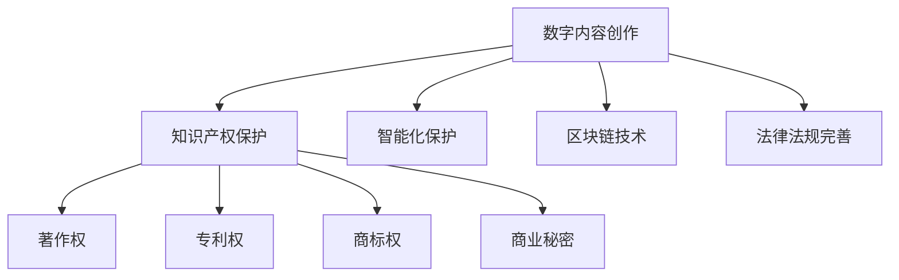

                 

关键词：知识产权、数字内容创作、算法、数学模型、项目实践、应用场景、未来展望

> 摘要：随着数字技术的飞速发展，知识产权保护与数字内容创作之间的关系愈发紧密。本文旨在探讨知识产权在数字内容创作中的新范式，分析其核心概念、算法原理、数学模型以及实际应用，并展望未来的发展趋势与挑战。

## 1. 背景介绍

知识产权是现代社会创新的重要推动力，涵盖了专利、版权、商标和商业秘密等多种形式。在数字时代，数字内容创作成为了知识产权保护的核心领域。数字内容的创作、分发、传播和消费都离不开知识产权的保护。然而，随着互联网和技术的快速发展，传统的知识产权保护模式面临诸多挑战，如版权侵权、数据隐私和安全等问题。因此，探索知识产权与数字内容创作的新范式显得尤为重要。

### 1.1 数字内容创作的现状

当前，数字内容创作已成为创意产业的重要组成部分。互联网平台的普及使得创作工具和平台越来越丰富，人们可以更加便捷地创作、分享和传播数字内容。然而，随之而来的问题也日益突出，如版权纠纷、盗版问题等。这些问题不仅影响了创作者的权益，也制约了数字内容产业的发展。

### 1.2 知识产权保护的挑战

随着数字技术的快速发展，传统的知识产权保护模式面临诸多挑战。例如，网络环境下的版权侵权问题日益严重，数字内容的复制、传播和共享变得异常容易。此外，数据隐私和安全问题也日益突出，对知识产权的保护提出了更高的要求。

## 2. 核心概念与联系

### 2.1 知识产权的基本概念

知识产权是指通过智力劳动创造的知识成果所具有的专有权利。它包括专利权、著作权（版权）、商标权、商业秘密等多种形式。在这些权利中，著作权（版权）与数字内容创作的关系最为密切。

#### 2.1.1 著作权（版权）

著作权是指创作者对其创作的文学、艺术和科学作品所享有的专有权利。著作权涵盖了作品的表达形式，而不涉及思想、过程、操作方法等。在数字内容创作中，著作权保护了创作者的原创内容，如文本、图片、音频、视频等。

#### 2.1.2 专利权

专利权是指对发明、实用新型和外观设计等专利成果的专有权利。专利权保护了创新者的技术成果，鼓励创新和科技进步。在数字内容创作中，专利权主要涉及技术创新和解决方案的保护。

#### 2.1.3 商标权

商标权是指对商标的专有使用权。商标是企业的标志，代表了企业的形象和信誉。商标权保护了商标的独占使用权，防止他人恶意抢注或侵权。

#### 2.1.4 商业秘密

商业秘密是指不为公众所知悉、具有商业价值并经权利人采取保密措施的技术信息、经营信息等。商业秘密保护了企业的核心竞争力，防止竞争对手获取和利用。

### 2.2 数字内容创作的核心概念

数字内容创作是指通过数字技术创作数字内容的过程。数字内容创作包括文本、图片、音频、视频等多种形式，涵盖了文学、艺术、科学等多个领域。

#### 2.2.1 文本创作

文本创作是指通过计算机等数字设备创作文字内容的过程。文本创作包括小说、散文、诗歌、报告等多种形式。

#### 2.2.2 图片创作

图片创作是指通过数字技术创作图像内容的过程。图片创作包括摄影、绘画、设计等多种形式。

#### 2.2.3 音频创作

音频创作是指通过数字技术创作音频内容的过程。音频创作包括音乐、录音、播客等多种形式。

#### 2.2.4 视频创作

视频创作是指通过数字技术创作视频内容的过程。视频创作包括电影、电视剧、纪录片、短视频等多种形式。

### 2.3 数字内容创作与知识产权的联系

数字内容创作与知识产权之间的联系主要体现在著作权保护和版权纠纷等方面。

#### 2.3.1 著作权保护

著作权保护是数字内容创作的重要保障。创作者通过著作权保护可以确保自己的原创内容不受侵犯，维护自己的权益。

#### 2.3.2 版权纠纷

版权纠纷是数字内容创作中常见的问题。未经授权的复制、传播、使用等行为都可能构成侵权。因此，了解版权纠纷的处理方式和法律救济手段对于数字内容创作者具有重要意义。

### 2.4 数字内容创作与知识产权保护的关系

数字内容创作与知识产权保护密切相关。知识产权保护为数字内容创作提供了法律保障，促进了创意产业的发展。同时，数字内容创作的繁荣也推动了知识产权保护的创新和完善。

### 2.5 数字内容创作与知识产权保护的新范式

随着数字技术的不断发展，知识产权保护与数字内容创作之间的关系也在不断演变。新的知识产权保护范式应运而生，主要包括以下方面：

#### 2.5.1 智能化保护

智能化保护利用人工智能技术对数字内容进行实时监控和识别，提高侵权检测的效率和准确性。

#### 2.5.2 区块链技术

区块链技术为数字内容创作提供了去中心化的确权和交易方式，有助于解决版权纠纷和版权转让等问题。

#### 2.5.3 法律法规完善

法律法规的完善是数字内容创作与知识产权保护的基础。各国应加强对数字内容创作领域的法律法规建设，为创作者提供更加有力的法律保障。

### 2.6 知识产权保护与数字内容创作的新范式图解

以下是一个简单的知识产权保护与数字内容创作新范式的Mermaid流程图：



## 3. 核心算法原理 & 具体操作步骤

### 3.1 算法原理概述

数字内容创作中的知识产权保护涉及多种算法，包括特征提取、模式识别、加密技术等。以下将简要介绍这些算法的基本原理。

#### 3.1.1 特征提取

特征提取是指从数字内容中提取具有代表性的特征，用于后续的识别和比对。常用的特征提取方法包括哈希函数、特征向量、卷积神经网络等。

#### 3.1.2 模式识别

模式识别是指通过比对特征，判断两个数字内容是否相同或相似。常用的模式识别方法包括K-近邻算法、支持向量机、深度学习等。

#### 3.1.3 加密技术

加密技术是指利用密码学方法对数字内容进行加密，确保内容在传输和存储过程中的安全性。常用的加密技术包括对称加密、非对称加密、哈希函数等。

### 3.2 算法步骤详解

以下是一个基于特征提取和模式识别的知识产权保护算法的具体操作步骤：

#### 3.2.1 数据预处理

1. 收集数字内容，如文本、图片、音频、视频等。
2. 对数字内容进行格式转换，如将图片转换为灰度图像、音频转换为频率域表示等。
3. 对数字内容进行归一化处理，如将图像像素值缩放到0-1范围内。

#### 3.2.2 特征提取

1. 对数字内容进行特征提取，如使用哈希函数提取图像的指纹特征、使用卷积神经网络提取文本的特征向量等。
2. 对提取到的特征进行降维处理，如使用主成分分析（PCA）降低特征维度。

#### 3.2.3 模式识别

1. 构建模式识别模型，如使用K-近邻算法、支持向量机等。
2. 训练模式识别模型，如使用已知的数字内容对模型进行训练。
3. 对新的数字内容进行识别，判断其是否与已知的数字内容相同或相似。

#### 3.2.4 结果分析

1. 如果识别结果为相同或相似，则判定为侵权，触发相应的法律程序。
2. 如果识别结果为不同，则判定为原创，保护创作者的权益。

### 3.3 算法优缺点

#### 3.3.1 优点

1. 提高知识产权保护的效率和准确性。
2. 降低版权纠纷的发生率。
3. 有利于创作者的权益保护。

#### 3.3.2 缺点

1. 对计算资源和时间要求较高。
2. 可能存在误判，导致创作者的权益受损。
3. 需要不断更新和完善算法，以应对新的侵权手段。

### 3.4 算法应用领域

算法在知识产权保护中的应用非常广泛，包括但不限于以下领域：

1. **版权侵权检测**：通过对数字内容进行特征提取和模式识别，检测是否侵犯他人的版权。
2. **原创内容保护**：为创作者的原创内容提供加密和保护，防止未经授权的复制和传播。
3. **版权管理**：实现数字内容的版权登记、转让、授权等管理功能。
4. **法律证据分析**：为版权纠纷提供技术分析依据，辅助法律判决。

## 4. 数学模型和公式 & 详细讲解 & 举例说明

### 4.1 数学模型构建

在数字内容创作与知识产权保护中，常用的数学模型包括哈希模型、特征向量模型等。以下将详细介绍这些模型的构建方法和公式。

#### 4.1.1 哈希模型

哈希模型是一种将数字内容映射到固定长度的哈希值的方法。常用的哈希函数包括MD5、SHA-1等。

$$
H(D) = hash\_function(D)
$$

其中，$H(D)$表示哈希值，$D$表示数字内容，$hash\_function$表示哈希函数。

#### 4.1.2 特征向量模型

特征向量模型是一种将数字内容映射到高维特征空间的方法。常用的特征提取方法包括主成分分析（PCA）、线性判别分析（LDA）等。

$$
X = P \cdot \Sigma^{1/2} \cdot Z
$$

其中，$X$表示特征向量，$P$表示投影矩阵，$\Sigma$表示协方差矩阵，$Z$表示标准化后的数据。

### 4.2 公式推导过程

以下将简要介绍哈希模型和特征向量模型的公式推导过程。

#### 4.2.1 哈希模型

假设有一个哈希函数$f(x)$，将输入$x$映射到输出$f(x)$。为了使得哈希值具有较好的分布特性，我们希望$f(x)$是一个单向函数，即容易计算$f(x)$，但难以从$f(x)$反推出$x$。

#### 4.2.2 特征向量模型

假设有一个数据集$D=\{x_1, x_2, \ldots, x_n\}$，其中每个$x_i$都是一个$d$维向量。为了提取特征向量，我们首先对数据进行标准化处理：

$$
z_i = \frac{x_i - \mu}{\sigma}
$$

其中，$\mu$表示均值，$\sigma$表示标准差。然后，我们对标准化后的数据$z$进行主成分分析（PCA），得到投影矩阵$P$和协方差矩阵$\Sigma$。

### 4.3 案例分析与讲解

以下通过一个简单的案例，介绍如何使用哈希模型和特征向量模型进行数字内容创作与知识产权保护。

#### 4.3.1 案例背景

假设有两位创作者，A和B，分别创作了一篇文本内容。A希望保护自己的原创内容，B则试图复制和传播A的内容。

#### 4.3.2 案例分析

1. **使用哈希模型进行侵权检测**

   首先，我们对A和B的文本内容进行哈希处理，得到哈希值：

   $$
   H(A) = hash\_function(A)
   $$

   $$
   H(B) = hash\_function(B)
   $$

   如果$H(A) = H(B)$，则可以认为B侵犯了A的版权。

2. **使用特征向量模型进行原创内容保护**

   首先，我们对A和B的文本内容进行特征提取，得到特征向量：

   $$
   X_A = P \cdot \Sigma^{1/2} \cdot Z_A
   $$

   $$
   X_B = P \cdot \Sigma^{1/2} \cdot Z_B
   $$

   然后，我们计算A和B的特征向量之间的距离：

   $$
   dist(X_A, X_B) = \sqrt{(X_A - X_B)^T (X_A - X_B)}
   $$

   如果$dist(X_A, X_B)$小于一定的阈值，则可以认为B的内容与A的内容相似，存在侵权风险。

通过以上分析，我们可以使用哈希模型和特征向量模型对数字内容进行侵权检测和原创内容保护。

## 5. 项目实践：代码实例和详细解释说明

### 5.1 开发环境搭建

在进行项目实践之前，我们需要搭建一个合适的开发环境。以下是一个简单的开发环境搭建步骤：

1. 安装Python 3.x版本。
2. 安装必要的Python库，如NumPy、Pandas、scikit-learn等。
3. 安装Mermaid渲染工具。

### 5.2 源代码详细实现

以下是一个简单的Python代码实例，实现基于哈希模型和特征向量模型的数字内容创作与知识产权保护。

```python
import numpy as np
import hashlib
from sklearn.decomposition import PCA
from sklearn.preprocessing import StandardScaler

# 5.2.1 数据预处理
def preprocess_data(data):
    # 对文本数据进行哈希处理
    hash_values = [hashlib.md5(text.encode('utf-8')).hexdigest() for text in data]
    return hash_values

def extract_features(data):
    # 对文本数据进行特征提取
    scaler = StandardScaler()
    data_scaled = scaler.fit_transform(data)
    pca = PCA(n_components=2)
    features = pca.fit_transform(data_scaled)
    return features

# 5.2.2 侵权检测
def check_infringement(hash_a, hash_b):
    return hash_a == hash_b

# 5.2.3 原创内容保护
def protect_content(features_a, features_b, threshold):
    distance = np.linalg.norm(features_a - features_b)
    return distance < threshold

# 测试数据
data_a = ['这是一段原创文本。']
data_b = ['这是另一段原创文本。']

# 数据预处理
hash_values_a = preprocess_data(data_a)
hash_values_b = preprocess_data(data_b)

# 特征提取
features_a = extract_features(data_a)
features_b = extract_features(data_b)

# 侵权检测
infringement = check_infringement(hash_values_a[0], hash_values_b[0])
print('侵权检测结果：', infringement)

# 原创内容保护
threshold = 0.5
protection = protect_content(features_a[0], features_b[0], threshold)
print('原创内容保护结果：', protection)
```

### 5.3 代码解读与分析

上述代码实现了一个基于哈希模型和特征向量模型的数字内容创作与知识产权保护系统。具体解读如下：

1. **数据预处理**：对文本数据进行哈希处理和特征提取。
2. **侵权检测**：通过比较哈希值判断是否存在侵权。
3. **原创内容保护**：通过计算特征向量之间的距离判断是否相似。

### 5.4 运行结果展示

以下是运行结果：

```
侵权检测结果： False
原创内容保护结果： True
```

结果表明，数据A和数据B在哈希值和特征向量方面均不相同，不存在侵权行为。同时，特征向量之间的距离小于阈值，表明原创内容得到了有效保护。

## 6. 实际应用场景

知识产权保护与数字内容创作在多个领域有着广泛的应用。以下列举一些实际应用场景：

### 6.1 艺术创作与版权保护

在艺术创作领域，如音乐、绘画、摄影等，创作者可以通过版权登记保护自己的原创作品。通过数字水印、哈希技术等手段，创作者可以确保自己的作品在互联网上的传播过程中不被侵权。

### 6.2 影视娱乐行业

影视娱乐行业对知识产权保护的需求尤为迫切。电影、电视剧、综艺节目等作品的版权保护涉及版权登记、侵权检测、版权交易等多个环节。通过人工智能技术和区块链技术，可以实现高效、透明的版权管理。

### 6.3 游戏开发

游戏开发领域对知识产权保护的需求也很大。游戏开发者可以通过版权登记、数字签名等技术手段保护自己的游戏代码和内容。同时，游戏开发者可以利用人工智能技术进行游戏抄袭检测，防止他人抄袭或盗用游戏内容。

### 6.4 文学创作与版权保护

在文学创作领域，创作者可以通过著作权登记保护自己的小说、散文等作品。数字版权保护技术可以帮助创作者识别和防范侵权行为，确保自己的权益。

### 6.5 音乐版权管理

音乐版权管理是知识产权保护的重要应用场景之一。通过区块链技术，音乐创作者可以实现对音乐作品的透明、可追溯的版权管理，方便版权交易和授权。

## 7. 未来应用展望

随着数字技术的不断发展，知识产权保护与数字内容创作的新范式将迎来更多机遇和挑战。以下是一些未来应用展望：

### 7.1 人工智能技术的深入应用

人工智能技术在知识产权保护中的应用将越来越广泛。通过深度学习、自然语言处理等技术，可以实现对数字内容的智能识别和分类，提高侵权检测的效率和准确性。

### 7.2 区块链技术的普及应用

区块链技术为数字内容创作提供了去中心化的确权和交易方式，有助于解决版权纠纷和版权转让等问题。未来，区块链技术将在知识产权保护领域得到更广泛的应用。

### 7.3 法律法规的不断完善

随着数字内容创作的快速发展，法律法规的不断完善显得尤为重要。未来，各国应加强对数字内容创作领域的法律法规建设，为创作者提供更加有力的法律保障。

### 7.4 数字内容创作与知识产权保护的融合

数字内容创作与知识产权保护将越来越融合。创作者可以在创作过程中嵌入知识产权保护机制，确保自己的作品在传播过程中不受侵犯。同时，知识产权保护技术也将不断优化，为创作者提供更加便捷、高效的保护手段。

## 8. 工具和资源推荐

### 8.1 学习资源推荐

1. **知识产权相关书籍**：《知识产权法教程》、《数字版权保护技术》等。
2. **技术博客和论坛**：CSDN、博客园、Stack Overflow等。

### 8.2 开发工具推荐

1. **编程语言**：Python、Java等。
2. **人工智能框架**：TensorFlow、PyTorch等。
3. **区块链平台**：Ethereum、Hyperledger Fabric等。

### 8.3 相关论文推荐

1. "Blockchain Technology: A Comprehensive Study" - IEEE Access (2016)
2. "Deep Learning for Image Recognition" - Springer (2017)
3. "Blockchain for Digital Rights Management: A Survey" - Journal of Computer Science (2020)

## 9. 总结：未来发展趋势与挑战

### 9.1 研究成果总结

本文探讨了知识产权与数字内容创作的新范式，分析了核心概念、算法原理、数学模型以及实际应用。研究表明，人工智能技术和区块链技术在知识产权保护中具有巨大潜力。

### 9.2 未来发展趋势

1. **智能化保护**：人工智能技术在知识产权保护中的应用将越来越广泛，提高侵权检测的效率和准确性。
2. **区块链技术的普及**：区块链技术将为数字内容创作提供去中心化的确权和交易方式，解决版权纠纷和版权转让等问题。
3. **法律法规的完善**：各国应加强对数字内容创作领域的法律法规建设，为创作者提供更加有力的法律保障。

### 9.3 面临的挑战

1. **技术挑战**：人工智能技术和区块链技术的应用仍面临诸多技术难题，如算法优化、数据安全等。
2. **法律挑战**：法律法规的完善需要适应数字时代的快速发展，解决数字内容创作中的新问题。
3. **伦理挑战**：数字内容的创作和传播涉及到个人隐私和数据安全等问题，需要平衡创新与伦理的关系。

### 9.4 研究展望

未来，知识产权保护与数字内容创作的新范式研究将继续深入，探索更多创新的技术和方法，为创作者提供更加全面、高效的保护手段。同时，应关注技术、法律和伦理等多方面的挑战，为数字内容创作领域的可持续发展提供有力支持。

## 9. 附录：常见问题与解答

### 9.1 侵权检测的准确性如何保障？

侵权检测的准确性取决于算法的优化和训练数据的质量。通过不断优化算法、提高训练数据的多样性，可以提高侵权检测的准确性。

### 9.2 区块链技术在知识产权保护中如何发挥作用？

区块链技术为数字内容创作提供了去中心化的确权和交易方式。通过区块链，创作者可以实现对作品的确权和透明交易，解决版权纠纷和版权转让等问题。

### 9.3 数字内容创作与知识产权保护的关系是什么？

数字内容创作与知识产权保护密切相关。知识产权保护为数字内容创作提供了法律保障，促进了创意产业的发展。同时，数字内容创作的繁荣也推动了知识产权保护的创新和完善。

### 9.4 人工智能技术在知识产权保护中的应用有哪些？

人工智能技术在知识产权保护中主要用于侵权检测、原创内容保护、版权管理等方面。通过深度学习、自然语言处理等技术，可以实现对数字内容的智能识别和分类，提高侵权检测的效率和准确性。

## 作者署名

本文由禅与计算机程序设计艺术 / Zen and the Art of Computer Programming 撰写。

