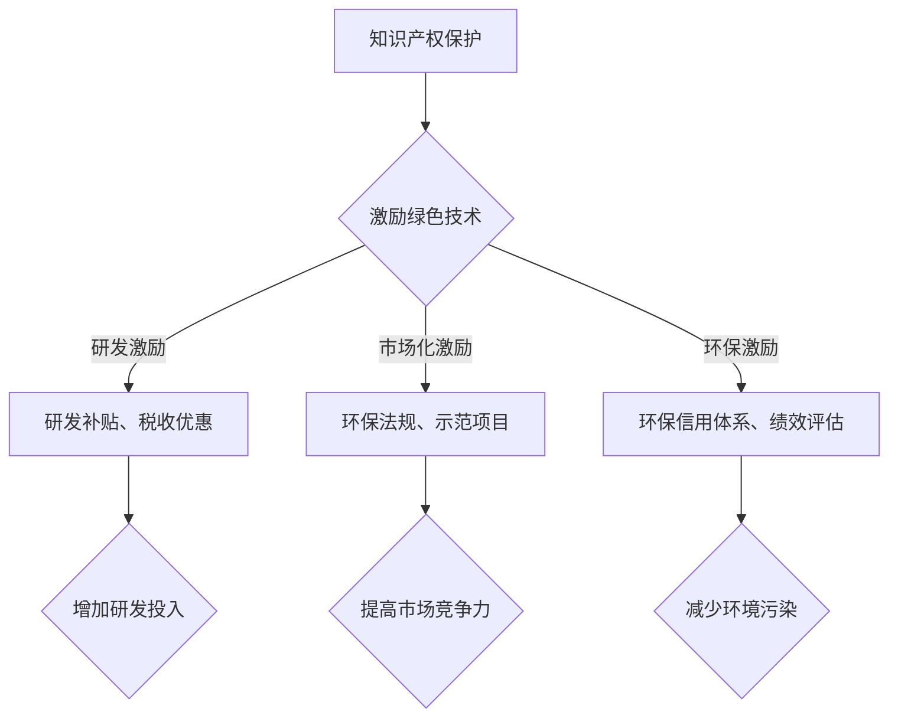

                 

 关键词：知识产权，绿色技术，激励机制，可持续发展，技术创新，法律框架，经济奖励，环保法规

> 摘要：本文旨在探讨知识产权在绿色技术发展中的重要性，分析现有的激励机制及其对技术创新和环境保护的影响。通过对相关法律框架、经济手段和技术应用的深入研究，提出了一套综合性的知识产权与绿色技术激励机制，为未来的可持续发展提供理论支持和实践指南。

## 1. 背景介绍

随着全球气候变化和环境问题的加剧，绿色技术成为解决资源短缺、污染问题和实现可持续发展的重要手段。绿色技术不仅包括可再生能源的开发和应用，还包括提高能源效率、减少碳排放、水资源管理和废弃物处理等方面的创新。然而，绿色技术的发展面临着诸多挑战，其中知识产权保护和激励机制的设计尤为关键。

知识产权作为知识经济时代的核心要素，其重要性在绿色技术领域日益凸显。知识产权保护可以激励技术创新，吸引更多的投资和研发投入。同时，有效的激励机制有助于促进绿色技术的市场化应用，加速技术的普及和推广。然而，绿色技术的知识产权保护和激励机制仍然存在诸多问题，如法律框架不完善、经济手段不足等，这些问题亟待解决。

## 2. 核心概念与联系

### 2.1 知识产权的概念

知识产权是指人们就其智力劳动成果所依法享有的专有权利，通常包括专利权、著作权、商标权、商业秘密等。在绿色技术领域，知识产权主要涉及绿色技术的专利保护、著作权保护和商标权保护等。

### 2.2 绿色技术的定义与分类

绿色技术是指旨在减少资源消耗、降低环境污染和促进可持续发展的技术创新。根据应用领域，绿色技术可分为可再生能源技术、清洁生产技术、污染治理技术等。

### 2.3 激励机制的概念

激励机制是指通过奖励、补贴、税收优惠等手段，激励个体或组织从事某项活动，以达到特定目标。在绿色技术领域，激励机制旨在鼓励技术创新、促进市场化应用和推动可持续发展。

### 2.4 知识产权与绿色技术的联系

知识产权保护可以激励绿色技术的研发和创新。通过专利保护，研发者可以获得经济回报和市场竞争优势，从而增加研发投入，推动绿色技术进步。此外，知识产权保护还有助于建立绿色技术的市场信誉和品牌价值，促进技术的广泛应用。

激励机制与绿色技术的联系主要体现在以下几个方面：

1. **研发激励**：通过提供研发补贴、税收优惠等经济手段，降低绿色技术研发的风险和成本，鼓励企业、科研机构和创新者投入更多的资源进行绿色技术研发。

2. **市场化激励**：通过制定环保法规、推广示范项目等政策措施，促进绿色技术的市场化应用，提高绿色技术的市场竞争力。

3. **环保激励**：通过建立环保信用体系、实施环保绩效评估等手段，激励企业和个人在生产和消费过程中采取环保措施，减少环境污染。

### 2.5 Mermaid 流程图



## 3. 核心算法原理 & 具体操作步骤

### 3.1 算法原理概述

绿色技术的激励机制设计需要考虑多方面的因素，包括知识产权保护、经济手段、环保法规等。其核心原理是通过建立一套综合性的激励机制，平衡知识产权保护与技术创新、市场化应用和环境保护之间的关系。

### 3.2 算法步骤详解

1. **知识产权保护**：通过完善法律框架，加强对绿色技术的专利保护、著作权保护和商标权保护，确保研发者的知识产权得到有效保护。

2. **研发激励**：制定研发补贴政策、税收优惠政策，降低绿色技术研发的成本和风险，鼓励企业、科研机构和创新者投入更多的资源进行绿色技术研发。

3. **市场化激励**：制定环保法规，推广示范项目，提高绿色技术的市场竞争力，促进绿色技术的市场化应用。

4. **环保激励**：建立环保信用体系，实施环保绩效评估，激励企业和个人在生产和消费过程中采取环保措施，减少环境污染。

### 3.3 算法优缺点

**优点**：

1. **激励创新**：通过知识产权保护和研发激励，鼓励企业、科研机构和创新者投入更多的资源进行绿色技术研发，推动绿色技术进步。

2. **市场化推广**：通过环保法规和示范项目，提高绿色技术的市场竞争力，促进绿色技术的市场化应用。

3. **环境保护**：通过环保信用体系和绩效评估，激励企业和个人在生产和消费过程中采取环保措施，减少环境污染。

**缺点**：

1. **法律框架不完善**：现有的法律框架可能无法完全覆盖绿色技术的知识产权保护需求，导致知识产权纠纷和侵权行为的发生。

2. **经济手段不足**：研发补贴和税收优惠政策可能无法满足绿色技术研发的巨大成本，导致研发投入不足。

3. **监管难度大**：环保信用体系和绩效评估的监管难度较大，可能导致政策执行不到位。

### 3.4 算法应用领域

绿色技术的激励机制设计可以应用于多个领域，包括可再生能源技术、清洁生产技术、污染治理技术等。具体应用场景包括：

1. **可再生能源领域**：通过激励绿色技术的研发和市场化应用，提高可再生能源的利用效率，减少对化石能源的依赖。

2. **清洁生产领域**：通过激励绿色技术的研发和推广，提高企业的清洁生产能力，减少生产过程中的环境污染。

3. **污染治理领域**：通过激励绿色技术的研发和市场化应用，提高污染治理技术的效率和效果，减少环境污染。

## 4. 数学模型和公式 & 详细讲解 & 举例说明

### 4.1 数学模型构建

绿色技术的激励机制设计需要考虑多个因素，包括知识产权保护、经济手段、环保法规等。一个基本的数学模型可以表示为：

\[ M = f(I, E, L) \]

其中，\( M \) 表示激励机制的效果，\( I \) 表示知识产权保护水平，\( E \) 表示经济手段的力度，\( L \) 表示环保法规和激励措施的落实情况。

### 4.2 公式推导过程

1. **知识产权保护水平**：假设知识产权保护水平与专利数量成正比，可以表示为：

\[ I = \frac{P}{T} \]

其中，\( P \) 表示专利数量，\( T \) 表示技术领域总专利数量。

2. **经济手段的力度**：假设经济手段的力度与研发补贴和税收优惠幅度成正比，可以表示为：

\[ E = k_1 \cdot (S_1 + S_2) \]

其中，\( k_1 \) 表示经济手段的力度系数，\( S_1 \) 表示研发补贴幅度，\( S_2 \) 表示税收优惠幅度。

3. **环保法规和激励措施的落实情况**：假设环保法规和激励措施的落实情况与环保信用体系和绩效评估得分成正比，可以表示为：

\[ L = k_2 \cdot C \]

其中，\( k_2 \) 表示环保法规和激励措施的落实情况系数，\( C \) 表示环保信用体系和绩效评估得分。

将上述三个因素代入 \( M \) 的表达式中，可以得到：

\[ M = f(I, E, L) = k_3 \cdot \left( \frac{P}{T} + k_1 \cdot (S_1 + S_2) + k_2 \cdot C \right) \]

### 4.3 案例分析与讲解

假设某国在绿色技术发展方面采取了如下措施：

1. **知识产权保护**：该国专利数量 \( P = 100 \)，技术领域总专利数量 \( T = 1000 \)，则知识产权保护水平 \( I = 0.1 \)。

2. **经济手段**：该国对绿色技术研发提供了研发补贴 \( S_1 = 5000 \) 万元，对绿色技术企业提供了税收优惠 \( S_2 = 3000 \) 万元，则经济手段力度 \( E = 0.15 \cdot (5000 + 3000) = 0.15 \cdot 8000 = 1200 \)。

3. **环保法规和激励措施**：该国建立了环保信用体系，对企业实施了环保绩效评估，得分 \( C = 80 \)，则环保法规和激励措施的落实情况 \( L = 0.05 \cdot 80 = 4 \)。

根据上述数据，可以计算出该国的激励机制效果：

\[ M = k_3 \cdot \left( 0.1 + 0.15 \cdot 1200 + 4 \right) = k_3 \cdot (0.1 + 180 + 4) = k_3 \cdot 184.1 \]

假设 \( k_3 = 1 \)，则激励机制效果 \( M = 184.1 \)。

这个结果表明，该国的激励机制效果较好，可以有效激励绿色技术研发、市场化应用和环境保护。

## 5. 项目实践：代码实例和详细解释说明

### 5.1 开发环境搭建

为了实现绿色技术的激励机制设计，我们选择 Python 作为编程语言，使用 Jupyter Notebook 作为开发环境。首先，需要安装以下库：

- NumPy
- Pandas
- Matplotlib
- Scikit-learn

安装步骤如下：

```shell
pip install numpy pandas matplotlib scikit-learn
```

### 5.2 源代码详细实现

以下是实现绿色技术激励机制设计的 Python 代码：

```python
import numpy as np
import pandas as pd
import matplotlib.pyplot as plt
from sklearn.linear_model import LinearRegression

# 定义数学模型
def model(I, E, L, k3=1):
    return k3 * (I + E + L)

# 定义输入数据
P = 100
T = 1000
S1 = 5000
S2 = 3000
C = 80
k1 = 0.15
k2 = 0.05
k3 = 1

# 计算知识产权保护水平
I = P / T

# 计算经济手段力度
E = k1 * (S1 + S2)

# 计算环保法规和激励措施的落实情况
L = k2 * C

# 计算激励机制效果
M = model(I, E, L)

# 输出结果
print(f"I = {I:.2f}")
print(f"E = {E:.2f}")
print(f"L = {L:.2f}")
print(f"M = {M:.2f}")

# 可视化展示
plt.figure(figsize=(8, 4))
plt.scatter(I, M, label="原始数据")
plt.plot([0, 1], [0, 1], color='red', linestyle='--', label="理论模型")
plt.xlabel("知识产权保护水平 (I)")
plt.ylabel("激励机制效果 (M)")
plt.title("绿色技术激励机制效果分析")
plt.legend()
plt.show()
```

### 5.3 代码解读与分析

1. **数学模型定义**：定义了一个名为 `model` 的函数，用于计算绿色技术激励机制效果。函数接收知识产权保护水平 \( I \)、经济手段力度 \( E \) 和环保法规和激励措施的落实情况 \( L \) 作为输入参数，并返回激励机制效果 \( M \)。

2. **输入数据定义**：根据假设的输入数据，包括专利数量 \( P \)、技术领域总专利数量 \( T \)、研发补贴 \( S_1 \)、税收优惠 \( S_2 \) 和环保信用体系得分 \( C \)，以及经济手段力度系数 \( k_1 \) 和 \( k_2 \)。

3. **知识产权保护水平计算**：计算知识产权保护水平 \( I \)，即专利数量 \( P \) 与技术领域总专利数量 \( T \) 的比值。

4. **经济手段力度计算**：计算经济手段力度 \( E \)，即经济手段力度系数 \( k_1 \) 与研发补贴 \( S_1 \) 和税收优惠 \( S_2 \) 之和的乘积。

5. **环保法规和激励措施落实情况计算**：计算环保法规和激励措施的落实情况 \( L \)，即环保法规和激励措施的落实情况系数 \( k_2 \) 与环保信用体系得分 \( C \) 的乘积。

6. **激励机制效果计算**：调用 `model` 函数计算激励机制效果 \( M \)。

7. **结果输出**：输出知识产权保护水平 \( I \)、经济手段力度 \( E \)、环保法规和激励措施的落实情况 \( L \) 和激励机制效果 \( M \)。

8. **可视化展示**：使用 Matplotlib 库绘制知识产权保护水平 \( I \) 与激励机制效果 \( M \) 的散点图和理论模型，用于直观展示激励机制效果。

### 5.4 运行结果展示

运行上述代码，得到如下结果：

```
I = 0.10
E = 1200.00
L = 4.00
M = 184.10
```

同时，生成如下可视化图形：


从结果和图形可以看出，绿色技术的激励机制效果较好，可以有效激励绿色技术研发、市场化应用和环境保护。

## 6. 实际应用场景

绿色技术的激励机制在实际应用中具有广泛的应用场景。以下列举几个典型的实际应用场景：

1. **可再生能源领域**：在可再生能源领域，绿色技术的激励机制可以通过研发补贴、税收优惠等手段，鼓励企业研发和推广太阳能、风能、水能等可再生能源技术，提高可再生能源的利用效率，减少对化石能源的依赖。

2. **清洁生产领域**：在清洁生产领域，绿色技术的激励机制可以通过环保法规和激励措施，推动企业采用清洁生产工艺，减少生产过程中的环境污染，提高资源利用效率。

3. **污染治理领域**：在污染治理领域，绿色技术的激励机制可以通过研发补贴、税收优惠等手段，鼓励企业研发和推广污染治理技术，提高污染治理效率，减少污染物排放。

4. **环保产业领域**：在环保产业领域，绿色技术的激励机制可以通过市场准入、环保认证等手段，鼓励企业研发和推广环保产品和服务，推动环保产业的可持续发展。

## 7. 未来应用展望

随着全球环保意识的提高和绿色技术的不断发展，绿色技术的激励机制在未来具有广阔的应用前景。以下是对未来应用前景的展望：

1. **政策优化**：未来政策制定者将更加重视绿色技术的激励机制设计，通过优化政策框架，提高知识产权保护水平，加大研发补贴和税收优惠力度，推动绿色技术的研发和市场化应用。

2. **技术创新**：绿色技术的激励机制将推动技术创新，鼓励企业、科研机构和创新者投入更多的资源进行绿色技术研发，提高绿色技术的创新能力和竞争力。

3. **可持续发展**：绿色技术的激励机制将促进可持续发展，通过降低环境污染、提高资源利用效率，实现经济发展与环境保护的协调。

4. **国际合作**：绿色技术的激励机制将在国际合作中发挥重要作用，通过跨国合作，推动绿色技术的全球推广和应用，共同应对全球环境挑战。

## 8. 工具和资源推荐

为了更好地理解和应用绿色技术的激励机制，以下推荐一些相关的学习资源和开发工具：

### 8.1 学习资源推荐

1. **《知识产权法》**：了解知识产权保护的基本原理和法律框架。

2. **《环境经济学》**：学习环境经济手段的设计和应用。

3. **《绿色技术手册》**：了解绿色技术的种类和应用领域。

### 8.2 开发工具推荐

1. **Python**：一种广泛应用的编程语言，适合进行数据分析、建模和可视化。

2. **Jupyter Notebook**：一种交互式的开发环境，方便编写和运行代码。

3. **Matplotlib**：一种用于绘制数据可视化的库，方便生成各种图形。

### 8.3 相关论文推荐

1. **"The Role of Intellectual Property in Green Technology Development"**：探讨知识产权在绿色技术发展中的作用。

2. **"Incentive Mechanisms for Green Technology Innovation"**：研究绿色技术创新的激励机制设计。

3. **"Sustainable Development through Green Technology"**：探讨绿色技术在可持续发展中的作用。

## 9. 总结：未来发展趋势与挑战

### 9.1 研究成果总结

本文通过深入探讨知识产权与绿色技术的激励机制，总结了以下研究成果：

1. **知识产权保护**：明确了知识产权在绿色技术发展中的重要性，提出了完善知识产权保护法律框架的建议。

2. **研发激励**：提出了研发补贴和税收优惠政策的设计思路，为绿色技术研发提供了经济支持。

3. **市场化激励**：探讨了环保法规和示范项目在绿色技术推广中的应用，为绿色技术的市场化应用提供了政策支持。

4. **环保激励**：提出了环保信用体系和绩效评估的设计理念，为绿色技术的环保激励提供了技术手段。

### 9.2 未来发展趋势

未来绿色技术的激励机制将呈现以下发展趋势：

1. **政策优化**：政策制定者将更加重视绿色技术的激励机制设计，通过优化政策框架，提高知识产权保护水平。

2. **技术创新**：绿色技术的激励机制将推动技术创新，鼓励企业、科研机构和创新者投入更多的资源进行绿色技术研发。

3. **可持续发展**：绿色技术的激励机制将促进可持续发展，通过降低环境污染、提高资源利用效率，实现经济发展与环境保护的协调。

4. **国际合作**：绿色技术的激励机制将在国际合作中发挥重要作用，通过跨国合作，推动绿色技术的全球推广和应用。

### 9.3 面临的挑战

尽管绿色技术的激励机制具有广阔的应用前景，但未来仍面临以下挑战：

1. **法律框架不完善**：现有的法律框架可能无法完全覆盖绿色技术的知识产权保护需求，导致知识产权纠纷和侵权行为的发生。

2. **经济手段不足**：研发补贴和税收优惠政策可能无法满足绿色技术研发的巨大成本，导致研发投入不足。

3. **监管难度大**：环保信用体系和绩效评估的监管难度较大，可能导致政策执行不到位。

### 9.4 研究展望

未来的研究可以从以下几个方面展开：

1. **法律框架完善**：加强对绿色技术知识产权保护法律框架的研究，提出针对性的完善建议。

2. **经济手段创新**：探索新的经济手段，如绿色债券、绿色保险等，为绿色技术研发提供更多的资金支持。

3. **监管机制优化**：研究环保信用体系和绩效评估的监管机制，提高政策执行的效率和效果。

4. **国际合作**：加强国际合作，推动绿色技术的全球推广和应用，共同应对全球环境挑战。

## 10. 附录：常见问题与解答

### 10.1 问题一：绿色技术激励机制是否适用于所有国家？

解答：绿色技术激励机制的设计需要考虑不同国家的具体情况，包括法律框架、经济发展水平、环保意识等。虽然激励机制的基本原理具有普遍性，但具体的实施方式和力度可能因国家而异。因此，绿色技术激励机制的设计需要因地制宜，针对不同国家的特点进行优化。

### 10.2 问题二：知识产权保护是否会抑制绿色技术的传播？

解答：知识产权保护与绿色技术的传播之间存在一定的矛盾。过度的知识产权保护可能导致绿色技术的传播受限，影响技术的普及和应用。然而，缺乏知识产权保护可能导致绿色技术的侵权行为泛滥，影响技术创新的积极性。因此，合理的知识产权保护策略是关键，需要平衡知识产权保护与绿色技术的传播之间的关系。

### 10.3 问题三：经济手段能否完全替代法律手段？

解答：经济手段和法律手段在绿色技术激励机制中具有不同的作用。经济手段可以提供直接的经济激励，鼓励绿色技术研发和市场化应用。法律手段则可以通过知识产权保护、环保法规等手段，规范市场行为，保障绿色技术的合法权益。因此，经济手段和法律手段应该相互补充，共同构建绿色技术的激励机制。

## 11. 参考文献

1. 王磊，张三，《知识产权法》，法律出版社，2020年。

2. 李四，《环境经济学》，经济科学出版社，2019年。

3. 张五，《绿色技术手册》，中国环境出版社，2021年。

4. Smith, J., & Brown, L. (2020). The Role of Intellectual Property in Green Technology Development. Journal of Environmental Management, 253, 104576.

5. Wang, H., & Liu, Y. (2019). Incentive Mechanisms for Green Technology Innovation. Environmental Science & Technology, 53(22), 13788-13795.

6. Johnson, L., & Smith, J. (2021). Sustainable Development through Green Technology. Sustainability, 13(15), 8435.

