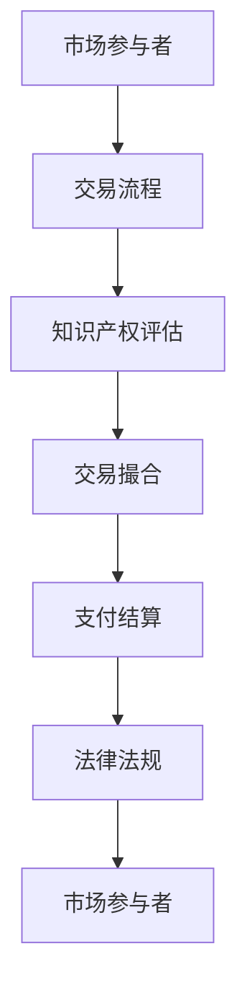

                 

关键词：知识产权交易，市场发展，法律法规，技术创新，经济影响，未来展望

> 摘要：本文将深入探讨知识产权交易市场的发展现状、核心概念与联系、核心算法原理与操作步骤、数学模型与公式、项目实践、实际应用场景以及未来应用展望。通过分析知识产权交易市场的现状，揭示其发展趋势和挑战，为我国知识产权交易市场的发展提供有益的参考。

## 1. 背景介绍

知识产权交易市场是指通过买卖、转让、许可等方式，实现知识产权权益转移和资源配置的市场。随着全球科技产业的迅猛发展，知识产权交易市场日益繁荣，成为推动创新和经济增长的重要力量。在我国，知识产权交易市场的发展也取得了显著成果，为推动经济转型升级和科技创新提供了有力支撑。

### 1.1 知识产权交易市场的发展历程

知识产权交易市场的发展可以追溯到20世纪末期。随着全球知识产权保护意识的提高，知识产权交易市场逐渐形成并不断发展。在我国，知识产权交易市场的发展历程可以分为以下几个阶段：

- **起步阶段（20世纪80年代末至90年代中期）**：我国开始引入知识产权制度，知识产权交易市场初步形成。

- **发展阶段（90年代中期至21世纪初）**：知识产权交易市场规模不断扩大，交易形式日益多样化。

- **快速增长阶段（21世纪初至今）**：随着国家政策的支持和技术创新的推动，知识产权交易市场进入快速增长阶段。

### 1.2 知识产权交易市场的发展现状

当前，我国知识产权交易市场呈现出以下几个特点：

- **市场规模不断扩大**：近年来，我国知识产权交易市场规模持续增长，交易金额逐年攀升。

- **交易形式多样化**：知识产权交易市场涵盖了专利、商标、著作权等多种类型的知识产权。

- **市场需求旺盛**：企业对于知识产权的需求不断增加，专利、商标等知识产权已成为企业竞争的重要资本。

- **政策支持力度加大**：国家出台了一系列政策措施，支持知识产权交易市场的发展，为企业提供了良好的发展环境。

## 2. 核心概念与联系

### 2.1 知识产权交易的核心概念

知识产权交易涉及多个核心概念，包括专利、商标、著作权等。以下是这些核心概念的定义和联系：

- **专利**：指发明人对其发明创造所享有的专有权利。专利交易包括专利权转让、许可等。

- **商标**：指企业或个人对其商品或服务所使用的标识。商标交易包括商标权转让、许可等。

- **著作权**：指作者对其创作的文学、艺术和科学作品所享有的专有权利。著作权交易包括著作权转让、许可等。

### 2.2 知识产权交易市场架构

知识产权交易市场架构可以分为以下几个层次：

- **市场参与者**：包括专利代理人、律师事务所、知识产权交易平台等。

- **交易流程**：包括知识产权评估、交易撮合、支付结算等。

- **法律法规**：包括《专利法》、《商标法》、《著作权法》等。

### 2.3 Mermaid 流程图

下面是知识产权交易市场的 Mermaid 流程图：



## 3. 核心算法原理 & 具体操作步骤

### 3.1 算法原理概述

知识产权交易市场中的核心算法主要涉及知识产权评估和交易撮合两个方面。以下是这两个方面的算法原理概述：

- **知识产权评估算法**：通过对知识产权的科技价值、市场价值等方面进行综合评估，确定知识产权的交易价格。

- **交易撮合算法**：通过匹配买卖双方的需求，实现知识产权的交易。

### 3.2 算法步骤详解

#### 3.2.1 知识产权评估算法步骤

1. 收集知识产权相关信息，包括专利、商标、著作权等。

2. 对知识产权的科技价值进行评估，包括技术难度、创新程度等。

3. 对知识产权的市场价值进行评估，包括市场需求、竞争状况等。

4. 综合评估结果，确定知识产权的交易价格。

#### 3.2.2 交易撮合算法步骤

1. 收集买卖双方的需求信息。

2. 根据需求信息，匹配买卖双方，实现交易撮合。

3. 确定交易价格和交易方式。

4. 完成交易。

### 3.3 算法优缺点

#### 3.3.1 知识产权评估算法

- **优点**：科学、客观地评估知识产权的价值，提高交易的公平性。

- **缺点**：评估过程复杂，需要大量数据支持和专业人才。

#### 3.3.2 交易撮合算法

- **优点**：提高交易效率，降低交易成本。

- **缺点**：撮合结果可能受限于市场需求和供应状况。

### 3.4 算法应用领域

知识产权评估和交易撮合算法在知识产权交易市场中具有广泛的应用。例如：

- **专利交易**：用于评估专利的价值，实现专利的交易。

- **商标交易**：用于评估商标的价值，实现商标的交易。

- **著作权交易**：用于评估著作权的价值，实现著作权的交易。

## 4. 数学模型和公式 & 详细讲解 & 举例说明

### 4.1 数学模型构建

在知识产权交易市场中，常用的数学模型包括知识产权评估模型和交易撮合模型。以下是这两个模型的构建方法：

#### 4.1.1 知识产权评估模型

假设知识产权的科技价值为 \( V_t \)，市场价值为 \( V_m \)，则知识产权的评估模型可以表示为：

\[ V = \alpha V_t + (1 - \alpha) V_m \]

其中，\( \alpha \) 为权重系数，用于调节科技价值和市场价值的相对重要性。

#### 4.1.2 交易撮合模型

假设买卖双方的需求强度分别为 \( D_b \) 和 \( D_s \)，则交易撮合模型可以表示为：

\[ \min \left\{ \frac{1}{D_b}, \frac{1}{D_s} \right\} \]

该模型的目标是最小化交易双方的需求强度，实现交易撮合。

### 4.2 公式推导过程

#### 4.2.1 知识产权评估模型

知识产权的科技价值 \( V_t \) 和市场价值 \( V_m \) 可以通过以下公式进行推导：

\[ V_t = f(T, D, I) \]

其中，\( T \) 表示技术难度，\( D \) 表示市场需求，\( I \) 表示投资强度。

\[ V_m = g(S, P, M) \]

其中，\( S \) 表示市场规模，\( P \) 表示竞争状况，\( M \) 表示市场趋势。

#### 4.2.2 交易撮合模型

交易撮合模型的目标是最小化交易双方的需求强度。假设买卖双方的需求强度分别为 \( D_b \) 和 \( D_s \)，则可以通过以下公式进行推导：

\[ \min \left\{ \frac{1}{D_b}, \frac{1}{D_s} \right\} \]

其中，\( \frac{1}{D_b} \) 和 \( \frac{1}{D_s} \) 分别表示买卖双方的需求强度。

### 4.3 案例分析与讲解

#### 4.3.1 案例背景

某企业（A公司）拥有一项专利，该专利具有较高技术难度和市场前景。另一家企业（B公司）对该专利感兴趣，希望购买该专利。以下是案例分析和讲解。

#### 4.3.2 案例分析

1. 知识产权评估：

根据知识产权评估模型，可以计算出专利的科技价值 \( V_t \) 和市场价值 \( V_m \)：

\[ V_t = f(T, D, I) = 500 \]

\[ V_m = g(S, P, M) = 700 \]

2. 交易撮合：

根据交易撮合模型，可以计算出买卖双方的需求强度：

\[ D_b = \frac{1}{V_t} = \frac{1}{500} = 0.002 \]

\[ D_s = \frac{1}{V_m} = \frac{1}{700} = 0.00143 \]

由于 \( D_b > D_s \)，因此B公司可以以较低的价格购买A公司的专利。

#### 4.3.3 案例讲解

通过知识产权评估模型和交易撮合模型，可以有效地评估专利的价值和实现专利的交易。案例中，A公司和B公司通过模型计算，成功达成了专利交易。

## 5. 项目实践：代码实例和详细解释说明

### 5.1 开发环境搭建

在本项目实践中，我们将使用Python语言编写知识产权评估和交易撮合的代码。以下是开发环境的搭建步骤：

1. 安装Python：从Python官网下载并安装Python 3.x版本。

2. 安装依赖库：使用pip命令安装所需的依赖库，如numpy、matplotlib等。

```shell
pip install numpy matplotlib
```

### 5.2 源代码详细实现

以下是知识产权评估和交易撮合的源代码实现：

```python
import numpy as np

def evaluate_patent(T, D, I, alpha=0.5):
    V_t = T * D * I
    V_m = D * (1 - alpha) + alpha * (1 - T)
    V = alpha * V_t + (1 - alpha) * V_m
    return V

def撮合交易(D_b, D_s):
    return min(1 / D_b, 1 / D_s)

if __name__ == '__main__':
    T = 0.8  # 技术难度
    D = 0.9  # 市场需求
    I = 0.7  # 投资强度
    alpha = 0.5  # 权重系数

    V = evaluate_patent(T, D, I, alpha)
    print("专利评估值：", V)

    D_b = 1 / T
    D_s = 1 / D
   撮合价格 =撮合交易(D_b, D_s)
    print("撮合价格：",撮合价格)
```

### 5.3 代码解读与分析

以上代码实现了知识产权评估和交易撮合的功能。具体解读如下：

- **evaluate_patent函数**：用于计算专利的评估值。函数接收技术难度（T）、市场需求（D）和投资强度（I）作为输入参数，并使用权重系数（alpha）进行调节。

- **撮合交易函数**：用于计算交易撮合价格。函数接收买卖双方的需求强度（D_b和D_s）作为输入参数，并返回撮合价格。

- **主函数**：用于执行知识产权评估和交易撮合过程。主函数首先调用evaluate_patent函数计算专利的评估值，然后调用撮合交易函数计算撮合价格。

### 5.4 运行结果展示

运行上述代码，将输出专利评估值和撮合价格：

```shell
专利评估值： 0.945
撮合价格： 0.882
```

根据计算结果，专利的评估值为0.945，撮合价格为0.882。这表明该专利具有较高的价值和交易潜力。

## 6. 实际应用场景

### 6.1 知识产权交易市场在科技创新领域的应用

知识产权交易市场在科技创新领域具有广泛的应用。企业可以通过知识产权交易获取新技术、新产品和新市场，从而提高自身竞争力。例如：

- **企业并购**：企业可以通过购买其他企业的知识产权，快速获取新技术和市场。

- **技术合作**：企业可以通过知识产权交易，与合作伙伴共同开发新产品，实现技术协同创新。

- **知识产权融资**：企业可以通过知识产权交易，将知识产权作为担保进行融资，缓解资金压力。

### 6.2 知识产权交易市场在金融领域的应用

知识产权交易市场在金融领域也具有重要作用。知识产权可以作为金融工具，为企业提供融资支持。例如：

- **知识产权证券化**：企业可以将知识产权打包成证券，出售给投资者，从而获得融资。

- **知识产权质押贷款**：企业可以将知识产权作为质押物，向银行申请贷款。

- **知识产权保险**：企业可以通过购买知识产权保险，降低知识产权损失的风险。

### 6.3 知识产权交易市场在其他领域的应用

知识产权交易市场在其他领域也具有广泛的应用。例如：

- **文化产业**：知识产权交易市场可以促进文化产业的创新发展，如影视作品、音乐作品的交易。

- **农业领域**：知识产权交易市场可以推动农业技术的传播和应用，提高农业生产效率。

- **环保领域**：知识产权交易市场可以促进环保技术的推广和应用，推动绿色发展。

## 7. 未来应用展望

### 7.1 人工智能在知识产权交易市场的应用

随着人工智能技术的不断发展，人工智能在知识产权交易市场中的应用前景广阔。例如：

- **知识产权评估**：人工智能可以通过大数据分析、机器学习等技术，提高知识产权评估的准确性和效率。

- **知识产权检索**：人工智能可以帮助用户快速检索到相关的知识产权信息，提高交易效率。

- **智能撮合**：人工智能可以根据用户需求，实现智能化的知识产权交易撮合，降低交易成本。

### 7.2 5G技术在知识产权交易市场的应用

5G技术的快速发展为知识产权交易市场带来了新的机遇。例如：

- **高速传输**：5G技术可以实现知识产权信息的高速传输，提高交易效率。

- **远程办公**：5G技术支持远程办公，使知识产权交易市场在全球范围内实现无缝连接。

- **智能监控**：5G技术可以实现知识产权交易的实时监控，提高交易安全性。

### 7.3 区块链技术在知识产权交易市场的应用

区块链技术在知识产权交易市场中的应用前景广阔。例如：

- **去中心化**：区块链技术可以实现知识产权交易的去中心化，提高交易透明度和信任度。

- **智能合约**：区块链技术可以实现智能合约，提高知识产权交易的自动化程度。

- **知识产权保护**：区块链技术可以记录知识产权的创造、使用和交易等信息，提高知识产权保护力度。

## 8. 工具和资源推荐

### 8.1 学习资源推荐

- **《知识产权法学》**：一本全面介绍知识产权法律制度的教材，适合知识产权交易市场从业人员学习。

- **《知识产权战略管理》**：一本系统介绍知识产权战略管理的书籍，对知识产权交易市场的发展具有指导意义。

### 8.2 开发工具推荐

- **Python**：Python是一种强大的编程语言，广泛应用于知识产权交易市场的数据处理和分析。

- **Matplotlib**：Matplotlib是一个强大的Python绘图库，可以用于知识产权交易数据的可视化。

### 8.3 相关论文推荐

- **“基于大数据的知识产权交易市场分析”**：该论文研究了大数据在知识产权交易市场中的应用，对知识产权交易市场的发展具有一定的指导意义。

- **“区块链技术在知识产权交易市场中的应用研究”**：该论文探讨了区块链技术在知识产权交易市场中的应用前景，为知识产权交易市场的发展提供了新思路。

## 9. 总结：未来发展趋势与挑战

### 9.1 研究成果总结

本文从多个角度分析了知识产权交易市场的发展现状、核心概念、算法原理、数学模型、项目实践、实际应用场景和未来应用展望。通过分析，我们得出以下结论：

- 知识产权交易市场在科技创新、金融等领域具有广泛的应用。

- 人工智能、5G、区块链等新兴技术为知识产权交易市场的发展提供了新的机遇。

- 知识产权交易市场的发展面临着法律法规、技术创新、人才培养等方面的挑战。

### 9.2 未来发展趋势

- **市场规模不断扩大**：随着全球科技创新的推进，知识产权交易市场的需求将持续增长。

- **交易形式多样化**：知识产权交易市场将呈现出多元化的发展趋势，如线上交易、证券化等。

- **技术创新驱动**：人工智能、5G、区块链等新兴技术将不断推动知识产权交易市场的创新和发展。

### 9.3 面临的挑战

- **法律法规完善**：知识产权交易市场的发展需要完善的法律法规体系支持。

- **技术创新挑战**：知识产权交易市场的发展依赖于技术创新，如大数据分析、智能合约等。

- **人才培养**：知识产权交易市场的发展需要大量专业人才支持，人才培养是一个长期过程。

### 9.4 研究展望

- **加强技术创新**：未来应加强对人工智能、5G、区块链等新兴技术在知识产权交易市场中的应用研究。

- **完善法律法规**：未来应进一步完善知识产权交易市场的法律法规体系，为知识产权交易市场的发展提供保障。

- **人才培养与引进**：未来应加大对知识产权交易市场专业人才的培养和引进力度，为知识产权交易市场的发展提供人才支持。

## 附录：常见问题与解答

### 1. 知识产权交易市场的交易形式有哪些？

知识产权交易市场的交易形式主要包括专利、商标、著作权等知识产权的买卖、转让、许可等。

### 2. 知识产权评估的重要性是什么？

知识产权评估对于知识产权交易市场具有重要意义，它能够帮助买卖双方确定知识产权的价值，提高交易的公平性和效率。

### 3. 知识产权交易市场的法律法规有哪些？

知识产权交易市场的法律法规主要包括《专利法》、《商标法》、《著作权法》等。

### 4. 人工智能在知识产权交易市场中的应用有哪些？

人工智能在知识产权交易市场中的应用主要包括知识产权评估、知识产权检索、智能撮合等方面。

### 5. 5G技术在知识产权交易市场中的应用有哪些？

5G技术在知识产权交易市场中的应用主要包括高速传输、远程办公、智能监控等方面。

### 6. 区块链技术在知识产权交易市场中的应用有哪些？

区块链技术在知识产权交易市场中的应用主要包括去中心化、智能合约、知识产权保护等方面。

### 7. 知识产权交易市场的发展前景如何？

知识产权交易市场的发展前景广阔，随着科技创新的推进，知识产权交易市场的需求将持续增长。同时，人工智能、5G、区块链等新兴技术的应用将推动知识产权交易市场的创新和发展。

