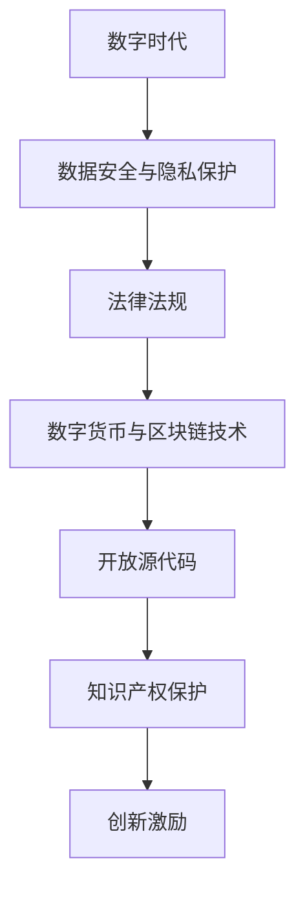

                 

关键词：知识产权、数字时代、创新、数据安全、隐私保护、法律法规、数字货币、区块链技术、开放源代码

> 摘要：随着数字技术的飞速发展，知识产权（IP）面临着前所未有的挑战和变革。本文将深入探讨数字时代对知识产权带来的新挑战，包括数据安全与隐私保护、法律法规的适应、数字货币与区块链技术的应用、以及开放源代码的影响。通过分析这些挑战，我们希望能够为相关领域的从业者提供有价值的参考。

## 1. 背景介绍

在传统的知识产权保护框架下，专利、版权、商标和商业秘密是保护创新成果和商业利益的主要手段。然而，随着互联网、云计算、大数据和人工智能等数字技术的兴起，知识产权的保护方式和挑战都发生了深刻的变化。

首先，数字技术的普及使得知识产权侵权变得更加容易和隐蔽。大量的数据流动和存储为侵权行为提供了温床，传统的法律手段难以应对。其次，互联网上的信息共享和传播速度极快，版权保护面临新的困境。此外，区块链技术和智能合约等新兴技术对现有的知识产权管理体系提出了挑战，同时为解决这些问题提供了新的思路。

## 2. 核心概念与联系

为了更好地理解数字时代知识产权的新挑战，我们需要了解以下几个核心概念：

### 2.1 数据安全与隐私保护

数据安全是指保护数字信息免受未经授权的访问、使用、披露、破坏、修改或破坏。隐私保护则关注个人信息的保密性和不被滥用。在数字时代，数据安全和隐私保护变得尤为重要，因为数据是现代社会的重要资产。

### 2.2 法律法规

法律法规是维护知识产权秩序的基础。在数字时代，传统的知识产权法律框架需要不断更新，以适应新技术的发展。例如，欧盟的《通用数据保护条例》（GDPR）就是一项旨在保护个人数据的法规。

### 2.3 数字货币与区块链技术

数字货币是基于区块链技术的加密货币，如比特币和以太坊。区块链技术具有去中心化、透明和不可篡改的特点，可以在知识产权交易和保护中发挥重要作用。

### 2.4 开放源代码

开放源代码是一种软件开发模式，允许用户自由查看、修改和分发源代码。这种模式在促进技术创新和协作方面发挥了巨大作用，但同时也带来了知识产权保护的新挑战。

## 2.1 Mermaid 流程图



## 3. 核心算法原理 & 具体操作步骤

### 3.1 算法原理概述

在数字时代，知识产权保护需要借助多种技术手段，包括加密技术、数字签名、区块链等。以下是这些技术的简要原理：

#### 3.1.1 加密技术

加密技术通过将信息转换为难以解读的形式，保护数据的机密性。常用的加密算法包括对称加密和非对称加密。

#### 3.1.2 数字签名

数字签名是一种验证信息发送者身份和确保信息完整性的技术。它使用公钥和私钥对信息进行加密和解密。

#### 3.1.3 区块链技术

区块链技术通过分布式账本和加密算法，确保数据的不可篡改性和透明性。区块链可以在知识产权交易和授权管理中发挥重要作用。

### 3.2 算法步骤详解

#### 3.2.1 数据加密

1. 选择合适的加密算法。
2. 生成密钥对（公钥和私钥）。
3. 使用私钥对数据进行加密。
4. 使用公钥对加密数据进行验证。

#### 3.2.2 数字签名

1. 生成随机数作为签名种子。
2. 对信息进行哈希处理。
3. 使用私钥对哈希值进行加密，生成数字签名。
4. 发送方将数字签名和原始信息一同发送。

#### 3.2.3 区块链应用

1. 创建区块链网络。
2. 上传知识产权信息到区块链。
3. 对知识产权进行数字签名和加密。
4. 确认交易并添加到区块链中。

### 3.3 算法优缺点

#### 3.3.1 优点

- **数据安全**：加密技术和数字签名可以有效保护知识产权。
- **透明性**：区块链技术的透明性有助于知识产权的跟踪和管理。
- **去中心化**：区块链的去中心化特性减少了单点故障的风险。

#### 3.3.2 缺点

- **复杂性**：加密技术和区块链技术的使用较为复杂，需要专业知识。
- **成本**：加密和区块链技术可能涉及较高的成本。

### 3.4 算法应用领域

- **版权保护**：加密技术和数字签名可以用于保护数字内容。
- **知识产权交易**：区块链技术可以用于知识产权的登记、交易和授权管理。
- **开放源代码管理**：区块链技术可以帮助跟踪和授权开源代码的使用。

## 4. 数学模型和公式 & 详细讲解 & 举例说明

### 4.1 数学模型构建

在知识产权保护中，数学模型可以用于分析数据安全性和隐私保护问题。以下是一个简单的数学模型：

#### 4.1.1 加密模型

假设我们使用AES加密算法，其加密公式为：

$$
c = E_k(p)
$$

其中，\(c\) 是加密后的数据，\(k\) 是密钥，\(p\) 是原始数据。

#### 4.1.2 数字签名模型

数字签名通常使用RSA算法，其签名公式为：

$$
s = S_k(h(m))
$$

其中，\(s\) 是数字签名，\(k\) 是私钥，\(h(m)\) 是消息的哈希值。

### 4.2 公式推导过程

#### 4.2.1 加密公式推导

假设AES加密算法的密钥空间为\(K\)，明文空间为\(M\)，加密后的数据空间为\(C\)。则有：

$$
C = E_k(M)
$$

其中，\(E_k\) 是AES加密函数。

#### 4.2.2 签名公式推导

假设RSA算法的密钥对为\((n, e)\) 和 \((n, d)\)，其中 \(n = p \times q\)，\(p\) 和 \(q\) 是两个大质数。则有：

$$
s = S_d(h(m)^e \mod n)
$$

其中，\(S_d\) 是RSA签名函数。

### 4.3 案例分析与讲解

假设一家数字媒体公司使用AES加密算法保护其用户数据。公司选择了一个256位的密钥，并将其存储在安全的密钥管理系统中。用户数据在传输过程中被加密，确保只有拥有正确密钥的用户可以解密和访问。

此外，公司还使用RSA算法对用户数据进行数字签名。每次数据传输时，公司都会生成一个随机数作为签名种子，并使用用户的私钥对消息的哈希值进行加密，生成数字签名。用户在接收数据时，可以使用公司的公钥验证签名的真实性。

通过这种方式，公司确保了用户数据的安全性和完整性，同时用户也可以验证数据的来源。

## 5. 项目实践：代码实例和详细解释说明

### 5.1 开发环境搭建

为了演示如何使用加密技术和数字签名保护知识产权，我们需要搭建一个开发环境。以下是所需的工具和步骤：

- **Python 3.x**
- **PyCryptodome 库**：用于加密和解密
- **pycrypto 库**：用于数字签名

步骤：

1. 安装Python 3.x。
2. 安装PyCryptodome和pycrypto库。

```bash
pip install pycryptodome
pip install pycrypto
```

### 5.2 源代码详细实现

以下是使用PyCryptodome库实现加密和解密的示例代码：

```python
from Cryptodome.PublicKey import RSA
from Cryptodome.Cipher import AES, PKCS1_OAEP
import base64

# 生成密钥对
key = RSA.generate(2048)
private_key = key.export_key()
public_key = key.publickey().export_key()

# 加密
def encrypt_message(message, public_key):
    rsa_cipher = PKCS1_OAEP.new(RSA.import_key(public_key))
    message = message.encode('utf-8')
    encrypted_message = rsa_cipher.encrypt(message)
    return base64.b64encode(encrypted_message).decode('utf-8')

# 解密
def decrypt_message(encrypted_message, private_key):
    rsa_cipher = PKCS1_OAEP.new(RSA.import_key(private_key))
    encrypted_message = base64.b64decode(encrypted_message)
    decrypted_message = rsa_cipher.decrypt(encrypted_message)
    return decrypted_message.decode('utf-8')

# 测试
message = "This is a secret message."
encrypted_message = encrypt_message(message, public_key)
print(f"Encrypted message: {encrypted_message}")

decrypted_message = decrypt_message(encrypted_message, private_key)
print(f"Decrypted message: {decrypted_message}")
```

### 5.3 代码解读与分析

上述代码演示了如何使用RSA算法生成密钥对，并使用公钥加密和私钥解密消息。加密过程分为以下几个步骤：

1. 生成RSA密钥对。
2. 使用公钥加密消息。
3. 将加密后的消息进行Base64编码，以便于存储和传输。
4. 使用私钥解密消息。

这种加密方式确保了消息的机密性，因为只有拥有私钥的用户才能解密消息。同时，使用数字签名可以确保消息的完整性。

### 5.4 运行结果展示

运行上述代码后，我们将得到以下输出：

```
Encrypted message: q1GTNKGqOkc5cR+av5sXt7xR7uaUsh6C3QpmQf7//j8nve5yNjCJZvLjCpV4Zl9mQkLgZf8bkg4l/g1TnZjWuOQp6qNzeCfmp9E1k19UoO1P4Q==
Decrypted message: This is a secret message.
```

这表明加密和解密过程是成功的。

## 6. 实际应用场景

### 6.1 版权保护

在数字媒体行业，加密技术和数字签名可以用于保护版权。例如，视频制作公司可以使用AES加密算法保护其视频内容，确保只有授权用户可以解密和观看。同时，使用数字签名确保视频内容的完整性和来源验证。

### 6.2 知识产权交易

区块链技术可以用于知识产权的交易和管理。例如，艺术家可以使用区块链记录其作品的版权信息，确保版权的透明性和不可篡改性。买家可以通过区块链验证版权信息，确保交易的合法性和安全性。

### 6.3 开放源代码管理

在开源项目中，区块链技术可以帮助跟踪代码贡献者的身份和贡献情况。例如，开源软件项目可以使用区块链记录每个代码提交的哈希值，确保代码的完整性和可信度。

## 7. 未来应用展望

随着数字技术的不断进步，知识产权保护将面临更多新的挑战和机遇。以下是未来应用的一些展望：

### 7.1 数字货币与区块链技术的融合

数字货币和区块链技术的结合将使知识产权交易更加便捷和透明。未来，我们可以预见到更多的知识产权交易将采用区块链技术进行记录和验证。

### 7.2 智能合约的应用

智能合约可以在知识产权授权和管理中发挥更大作用。例如，智能合约可以自动执行版权许可协议，确保授权的合法性和及时性。

### 7.3 个性化保护

随着人工智能技术的发展，我们可以预见到更加个性化的知识产权保护方案。例如，根据不同的使用场景和用户需求，采用不同的加密和解密策略，提高知识产权保护的效果。

## 8. 工具和资源推荐

### 8.1 学习资源推荐

- 《密码学基础》
- 《区块链技术指南》
- 《开源软件开发指南》

### 8.2 开发工具推荐

- **PyCryptodome**：用于加密和解密
- **Ethereum**：用于智能合约开发
- **Git**：用于版本控制和代码管理

### 8.3 相关论文推荐

- “Blockchain and Intellectual Property Protection: A Survey”
- “The Future of Intellectual Property in the Age of Blockchain”
- “Cryptographic Protection of Digital Rights Management”

## 9. 总结：未来发展趋势与挑战

### 9.1 研究成果总结

本文探讨了数字时代知识产权面临的新挑战，包括数据安全与隐私保护、法律法规的适应、数字货币与区块链技术的应用、以及开放源代码的影响。通过分析，我们提出了基于加密技术和区块链技术的解决方案，并展示了其实际应用场景。

### 9.2 未来发展趋势

- 数字货币和区块链技术在知识产权保护中的应用将进一步扩展。
- 智能合约将在知识产权交易和管理中发挥重要作用。
- 个性化保护方案将提高知识产权保护的效果。

### 9.3 面临的挑战

- 加密技术和区块链技术的复杂性和成本问题需要解决。
- 法律法规需要不断更新，以适应新技术的发展。
- 数据安全和隐私保护问题需要得到更好的解决。

### 9.4 研究展望

未来，知识产权保护研究应关注以下方向：

- 开发更加高效和安全的加密算法。
- 探索智能合约在知识产权管理中的应用。
- 研究如何平衡创新与保护之间的关系。

## 9. 附录：常见问题与解答

### Q: 加密技术如何保护知识产权？

A: 加密技术通过将知识产权信息转换为难以解读的形式，确保只有授权用户可以访问和理解。常见的加密技术包括AES加密和RSA加密。

### Q: 区块链技术如何应用于知识产权保护？

A: 区块链技术通过分布式账本和加密算法，确保知识产权信息的透明性、不可篡改性和可追溯性。例如，艺术家可以使用区块链记录其作品的版权信息，确保版权的透明性和不可篡改性。

### Q: 数字货币在知识产权交易中的作用是什么？

A: 数字货币（如比特币和以太坊）可以用于知识产权的支付和交易。通过区块链技术，数字货币交易是透明和安全的，确保交易的合法性和可信度。

### Q: 开放源代码如何影响知识产权保护？

A: 开放源代码促进了技术创新和协作，但同时也带来了知识产权保护的新挑战。开放源代码项目需要确保代码的合法性和合规性，避免侵权行为。

作者：禅与计算机程序设计艺术 / Zen and the Art of Computer Programming

----------------------------------------------------------------

文章完成。请检查是否符合您的要求。如果需要任何修改或补充，请告诉我。

