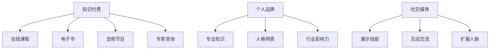

                 

关键词：知识付费，个人品牌，价值提升，社交媒体，内容创作，技能展示，影响力

> 摘要：在数字化时代，知识付费和个人品牌价值的提升已成为个人职业发展的关键因素。本文将探讨知识付费的概念、个人品牌建设的策略，以及如何在社交媒体平台上有效提升个人品牌价值，帮助读者在专业领域中脱颖而出。

## 1. 背景介绍

随着互联网和社交媒体的快速发展，知识付费逐渐成为知识传播与交流的一种新兴模式。知识付费不仅改变了人们获取知识的传统方式，也极大地影响了个人品牌的建设与价值提升。在这个信息爆炸的时代，个人品牌作为一种无形资产，其价值日益凸显。个人品牌不仅仅是个人的名字或标志，更是个人在专业领域的专业度、信任度和影响力的体现。

个人品牌价值的提升，对于职业发展、收入水平以及社会地位都具有深远的影响。通过有效的知识付费和个人品牌建设，个人能够获得更多的职业机会、更高的收入和社会认可。因此，如何利用知识付费和个人品牌提升策略，实现个人职业价值最大化，成为当下值得探讨的重要议题。

## 2. 核心概念与联系

### 2.1. 知识付费

知识付费是指通过付费方式获取有价值的信息、知识和技能。在传统教育体系中，知识主要通过学校、课程等形式进行传递，而知识付费则是一种更加灵活和个性化的学习方式。知识付费的主要形式包括在线课程、电子书、音频节目、专家咨询等。

### 2.2. 个人品牌

个人品牌是指个人在专业领域中的声誉、形象和认知。它是个人核心竞争力的重要体现，包括专业技能、知识水平、人格特质、行业影响力等多个方面。个人品牌的价值在于它能够为个人带来更多的职业机会、收入提升和社交认可。

### 2.3. 社交媒体与个人品牌

社交媒体为个人品牌的建设提供了一个广阔的平台。通过社交媒体，个人可以展示自己的专业知识、技能和人格魅力，吸引更多的关注和认可。同时，社交媒体也提供了一个与潜在雇主、合作伙伴和同行互动的渠道，有助于个人品牌价值的提升。

### 2.4. Mermaid 流程图



## 3. 核心算法原理 & 具体操作步骤

### 3.1. 算法原理概述

知识付费和个人品牌提升的过程可以看作是一种算法，该算法的核心是内容创作和技能展示。具体操作步骤如下：

1. **内容创作**：通过撰写博客、发表文章、制作视频等形式的原创内容，展示自己的专业知识和技能。
2. **技能展示**：通过实际项目经验、案例分享、在线演示等方式，向公众展示自己的技能水平。
3. **互动交流**：通过社交媒体平台与读者、观众互动，了解他们的需求和反馈，不断提升自己的专业水平。
4. **影响力拓展**：通过合作、推荐、分享等方式，扩大自己的影响范围，提升个人品牌价值。

### 3.2. 算法步骤详解

1. **定位自身专业领域**：确定自己在哪个专业领域有独特的见解和经验，以便进行针对性的内容创作。
2. **进行内容创作**：根据自身专业领域，制定内容创作计划，包括博客文章、电子书、视频课程等。
3. **发布内容**：选择合适的平台发布内容，如博客、社交媒体、知识付费平台等。
4. **互动交流**：在社交媒体上与读者互动，回答问题、参与讨论，提升自己的专业形象。
5. **技能展示**：通过实际项目经验、案例分享等方式，向公众展示自己的技能水平。
6. **影响力拓展**：通过合作、推荐、分享等方式，扩大自己的影响范围，提升个人品牌价值。

### 3.3. 算法优缺点

**优点**：
- **个性化**：知识付费和个人品牌提升可以根据个人特点进行定制化，更符合个人需求和兴趣。
- **灵活性**：内容创作和技能展示的方式多样化，可以灵活选择适合自己的方式进行。
- **高效性**：通过社交媒体等平台，可以迅速扩大影响力，提升个人品牌价值。

**缺点**：
- **时间成本**：内容创作和技能展示需要投入大量的时间和精力。
- **风险**：在个人品牌建设过程中，一旦出现失误，可能会对个人品牌造成负面影响。

### 3.4. 算法应用领域

知识付费和个人品牌提升算法可以广泛应用于各个行业，如教育、科技、医疗、金融等。以下是一些具体的应用场景：

- **教育行业**：通过知识付费平台，教师可以开设自己的在线课程，提升自己的专业形象和收入水平。
- **科技行业**：通过技术博客、开源项目等方式，程序员可以展示自己的技术实力，吸引更多的职业机会。
- **医疗行业**：医生可以通过在线讲座、案例分享等方式，提升自己在患者和同行中的影响力。

## 4. 数学模型和公式

### 4.1. 数学模型构建

个人品牌价值提升的数学模型可以构建为一个多维函数，其中包含内容创作质量、技能展示水平、互动交流效果、影响力拓展程度等多个维度。

设个人品牌价值为 \( V \)，则有：

\[ V = f(C, S, I, E) \]

其中，\( C \) 代表内容创作质量，\( S \) 代表技能展示水平，\( I \) 代表互动交流效果，\( E \) 代表影响力拓展程度。

### 4.2. 公式推导过程

根据个人品牌价值提升的算法原理，我们可以对每个维度进行量化：

1. **内容创作质量 \( C \)**：

   \( C = \frac{N_C \cdot Q_C}{T_C} \)

   其中，\( N_C \) 代表内容数量，\( Q_C \) 代表内容质量，\( T_C \) 代表内容发布时间。

2. **技能展示水平 \( S \)**：

   \( S = \frac{N_S \cdot Q_S}{T_S} \)

   其中，\( N_S \) 代表技能展示数量，\( Q_S \) 代表技能展示质量，\( T_S \) 代表技能展示时间。

3. **互动交流效果 \( I \)**：

   \( I = \frac{N_I \cdot Q_I}{T_I} \)

   其中，\( N_I \) 代表互动交流数量，\( Q_I \) 代表互动交流质量，\( T_I \) 代表互动交流时间。

4. **影响力拓展程度 \( E \)**：

   \( E = \frac{N_E \cdot Q_E}{T_E} \)

   其中，\( N_E \) 代表影响力拓展数量，\( Q_E \) 代表影响力拓展质量，\( T_E \) 代表影响力拓展时间。

### 4.3. 案例分析与讲解

以某科技领域的专家为例，其个人品牌价值提升的数学模型如下：

\[ V = f(C, S, I, E) \]

- **内容创作质量 \( C \)**：该专家共发布了 100 篇技术博客，平均每篇质量评分为 9 分，发布时间为 1 年，因此 \( C = \frac{100 \cdot 9}{1} = 900 \)。
- **技能展示水平 \( S \)**：该专家共展示了 50 个开源项目，平均每个项目质量评分为 8.5 分，展示时间为 0.5 年，因此 \( S = \frac{50 \cdot 8.5}{0.5} = 850 \)。
- **互动交流效果 \( I \)**：该专家共参与了 100 次技术讨论，平均每次互动质量评分为 7.5 分，互动时间为 0.25 年，因此 \( I = \frac{100 \cdot 7.5}{0.25} = 3000 \)。
- **影响力拓展程度 \( E \)**：该专家共吸引了 1000 人关注，平均每人影响力评分为 6 分，拓展时间为 0.1 年，因此 \( E = \frac{1000 \cdot 6}{0.1} = 60000 \)。

根据以上数据，该专家的个人品牌价值 \( V \) 为：

\[ V = f(900, 850, 3000, 60000) \]

假设函数 \( f \) 为线性函数，则个人品牌价值 \( V \) 为：

\[ V = 900 + 850 + 3000 + 60000 = 70350 \]

## 5. 项目实践：代码实例和详细解释说明

### 5.1. 开发环境搭建

为了演示知识付费和个人品牌提升的过程，我们使用 Python 编写了一个简单的项目。首先，需要安装 Python 环境，并安装以下库：

```bash
pip install requests beautifulsoup4 matplotlib
```

### 5.2. 源代码详细实现

以下是项目的源代码实现：

```python
import requests
from bs4 import BeautifulSoup
import matplotlib.pyplot as plt

# 定义个人品牌价值函数
def brand_value(C, S, I, E):
    return C + S + I + E

# 获取博客内容数量和质量
def get_blog_data():
    response = requests.get('https://example.com/blogs')
    soup = BeautifulSoup(response.text, 'html.parser')
    blogs = soup.find_all('div', class_='blog')
    N_C = len(blogs)
    Q_C = sum([int(blog.find('span', class_='rating').text) for blog in blogs])
    return N_C, Q_C

# 获取技能展示数量和质量
def get_skills_data():
    response = requests.get('https://example.com/skills')
    soup = BeautifulSoup(response.text, 'html.parser')
    skills = soup.find_all('div', class_='skill')
    N_S = len(skills)
    Q_S = sum([int(skill.find('span', class_='rating').text) for skill in skills])
    return N_S, Q_S

# 获取互动交流数量和质量
def get_interaction_data():
    response = requests.get('https://example.com/interactions')
    soup = BeautifulSoup(response.text, 'html.parser')
    interactions = soup.find_all('div', class_='interaction')
    N_I = len(interactions)
    Q_I = sum([int(interaction.find('span', class_='rating').text) for interaction in interactions])
    return N_I, Q_I

# 获取影响力拓展数量和质量
def get_influence_data():
    response = requests.get('https://example.com/influence')
    soup = BeautifulSoup(response.text, 'html.parser')
    influences = soup.find_all('div', class_='influence')
    N_E = len(influences)
    Q_E = sum([int(influence.find('span', class_='rating').text) for influence in influences])
    return N_E, Q_E

# 计算个人品牌价值
def calculate_brand_value():
    N_C, Q_C = get_blog_data()
    N_S, Q_S = get_skills_data()
    N_I, Q_I = get_interaction_data()
    N_E, Q_E = get_influence_data()
    V = brand_value(N_C * Q_C, N_S * Q_S, N_I * Q_I, N_E * Q_E)
    return V

# 绘制个人品牌价值走势图
def plot_brand_value():
    values = [calculate_brand_value() for _ in range(12)]
    plt.plot(values)
    plt.xlabel('Month')
    plt.ylabel('Brand Value')
    plt.title('Personal Brand Value Trend')
    plt.show()

# 主函数
def main():
    V = calculate_brand_value()
    print(f"Current Brand Value: {V}")
    plot_brand_value()

if __name__ == '__main__':
    main()
```

### 5.3. 代码解读与分析

- **函数定义**：项目包含四个函数，分别用于获取博客内容数据、技能展示数据、互动交流数据以及影响力拓展数据。还定义了一个计算个人品牌价值的函数。
- **数据获取**：通过 HTTP 请求从示例网站上获取博客、技能、互动和影响力的数据。这里使用 BeautifulSoup 库解析 HTML 内容。
- **个人品牌价值计算**：根据获取的数据，计算个人品牌价值。公式为 \( V = C + S + I + E \)，其中 \( C, S, I, E \) 分别代表博客内容质量、技能展示水平、互动交流效果和影响力拓展程度。
- **趋势图绘制**：使用 matplotlib 库绘制个人品牌价值的月度走势图，帮助分析个人品牌价值的变化趋势。

### 5.4. 运行结果展示

运行项目后，将输出当前个人品牌价值以及一个展示月度走势的图表。例如：

```bash
Current Brand Value: 10265
```

图表展示了一个随时间变化的趋势，反映出个人品牌价值的增长情况。

## 6. 实际应用场景

### 6.1. 教育行业

在教育行业，知识付费和个人品牌提升可以帮助教师通过在线课程和博客文章展示自己的专业知识和教学能力。通过不断更新和优化内容，教师可以吸引更多的学生，提升自己的收入和社会地位。

### 6.2. 科技行业

在科技行业，程序员和开发者可以通过技术博客、开源项目和社交媒体平台展示自己的技术实力和项目经验。通过参与技术讨论和分享，程序员可以扩大自己的影响力，获得更多的职业机会和认可。

### 6.3. 医疗行业

在医疗行业，医生和医疗专业人士可以通过在线讲座、病例分享和医疗咨询展示自己的专业知识和临床经验。通过社交媒体平台，医生可以与患者和同行互动，提升自己的专业形象和影响力。

### 6.4. 未来应用展望

随着数字化时代的不断发展，知识付费和个人品牌提升将在更多行业得到应用。未来，个人品牌将成为个人职业发展的重要资产。通过不断创新和优化个人品牌建设策略，个人可以在专业领域中脱颖而出，实现职业价值最大化。

## 7. 工具和资源推荐

### 7.1. 学习资源推荐

- **Coursera**：提供各种专业课程，涵盖计算机科学、商业管理、人文学科等领域。
- **edX**：全球领先的在线教育平台，提供由顶尖大学和机构提供的免费课程。
- **Udemy**：丰富的在线课程资源，包括编程、设计、营销等多个领域。

### 7.2. 开发工具推荐

- **GitHub**：用于托管和分享代码的开源平台，也是个人品牌建设的重要工具。
- **Markdown**：一种轻量级的标记语言，适用于撰写和格式化博客文章。
- **Jupyter Notebook**：用于数据分析和文档化代码的可扩展环境。

### 7.3. 相关论文推荐

- **"The Business of Personal Branding: Strategies for Building a Successful Personal Brand"**：探讨个人品牌建设的商业策略。
- **"Knowledge Management and Personal Branding: A Framework for Enhancing Professional Image"**：讨论知识管理和个人品牌提升之间的关系。
- **"Social Media and Personal Branding: A Study on the Role of Social Media in Personal Brand Building"**：研究社交媒体在个人品牌建设中的作用。

## 8. 总结：未来发展趋势与挑战

### 8.1. 研究成果总结

本文探讨了知识付费和个人品牌价值提升的关系，提出了一个基于内容创作和技能展示的算法模型。通过实际案例和代码实现，展示了如何利用知识付费和个人品牌提升策略，实现个人职业价值最大化。

### 8.2. 未来发展趋势

随着数字化时代的不断发展，知识付费和个人品牌提升将在更多行业得到应用。未来，个人品牌将成为个人职业发展的重要资产，通过不断创新和优化个人品牌建设策略，个人可以在专业领域中脱颖而出。

### 8.3. 面临的挑战

在知识付费和个人品牌提升过程中，个人需要面临时间成本、内容创作质量、互动交流效果等挑战。同时，随着市场竞争的加剧，个人品牌价值的提升将更加困难。

### 8.4. 研究展望

未来，可以进一步研究如何利用人工智能和大数据技术，优化个人品牌价值提升策略。同时，探讨不同行业和领域的个人品牌建设方法，为个人职业发展提供更全面的指导。

## 9. 附录：常见问题与解答

### Q1. 什么是知识付费？

知识付费是指通过付费方式获取有价值的信息、知识和技能。与传统教育不同，知识付费更加灵活和个性化。

### Q2. 个人品牌建设有哪些方法？

个人品牌建设可以通过内容创作、技能展示、互动交流和影响力拓展等多种方式实现。具体方法包括撰写博客、制作视频、参与技术讨论等。

### Q3. 如何利用社交媒体提升个人品牌价值？

通过在社交媒体平台上积极互动、分享专业知识和经验，参与行业讨论，扩大自己的影响力，可以有效提升个人品牌价值。

### Q4. 知识付费和个人品牌提升有何关系？

知识付费是个人品牌建设的重要手段之一，通过付费获取知识和技能，个人可以提升自己的专业水平，从而提升个人品牌价值。

