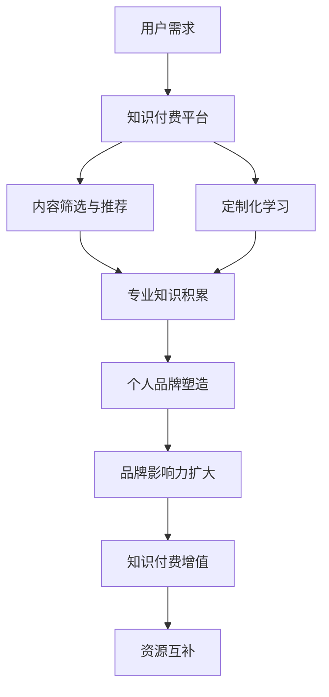

                 

### 1. 背景介绍

在当今信息爆炸的时代，知识付费和个人品牌塑造已经成为个人和企业在数字世界中竞争的重要手段。知识付费，即通过购买或订阅专业内容来获取知识和技能，已经成为一种普遍的现象。同时，个人品牌塑造，即通过个人品牌来提升个人在职场和社会中的影响力，也成为越来越多的专业人士所追求的目标。

知识付费和个人品牌塑造之间的关系紧密。一方面，知识付费为个人品牌塑造提供了内容支撑，通过持续学习和专业知识的积累，个人可以不断提升自己的专业水平，进而塑造自己的品牌形象。另一方面，个人品牌塑造则为知识付费提供了市场通道，通过品牌影响力的扩大，个人可以吸引更多的关注和资源，从而促进知识付费的业务发展。

本文旨在探讨知识付费与个人品牌塑造之间的协同效应，分析其背后的原理、实施策略、成功案例，以及未来发展的趋势和挑战。

### 2. 核心概念与联系

#### 2.1 知识付费

知识付费是指用户为获取特定知识或技能而支付的费用，通常以在线课程、电子书、专业咨询等形式存在。其核心价值在于：

- **效率提升**：用户可以通过付费内容快速获取专业知识和技能，节省时间和精力。
- **质量保障**：知识付费平台通常会筛选和推荐高质量的内容，用户可以获得可靠的资源。
- **定制化学习**：知识付费内容可以根据用户的需求进行定制，提供个性化的学习体验。

#### 2.2 个人品牌塑造

个人品牌塑造是指个人通过一系列策略和行动，在公众中建立独特的形象和声誉。其核心要素包括：

- **个人特色**：通过展示个人独特的技能、经验和价值观，建立与众不同的品牌形象。
- **影响力**：通过社交媒体、公开演讲、专业作品等方式扩大个人影响力，提升品牌知名度。
- **持续更新**：不断提供高质量的内容和价值，保持品牌活力和吸引力。

#### 2.3 知识付费与个人品牌塑造的协同

知识付费与个人品牌塑造之间存在显著的协同效应。具体表现在：

- **知识转化**：知识付费的内容可以帮助个人快速提升专业能力，这些知识成为个人品牌塑造的基础。
- **品牌增值**：个人品牌塑造可以提高知识付费内容的附加值，吸引更多用户。
- **资源互补**：知识付费平台为个人品牌提供了展示和传播的渠道，而个人品牌则为知识付费提供了市场保障。

#### 2.4 Mermaid 流程图

以下是一个简单的Mermaid流程图，展示知识付费与个人品牌塑造之间的协同关系：



### 3. 核心算法原理 & 具体操作步骤

#### 3.1 算法原理概述

知识付费与个人品牌塑造的协同效应可以看作是一种多阶段优化问题。其核心算法原理包括以下几个步骤：

1. **需求分析**：识别用户的知识需求和兴趣点。
2. **内容筛选**：基于用户需求，筛选和推荐高质量的知识付费内容。
3. **学习过程**：用户通过知识付费内容进行学习，积累专业知识和技能。
4. **品牌构建**：基于学习成果，构建个人品牌，提升影响力。
5. **资源整合**：利用个人品牌影响力，获取更多的知识付费机会和资源。

#### 3.2 算法步骤详解

1. **需求分析**：

   - **用户画像**：通过数据分析，构建用户画像，包括年龄、职业、兴趣爱好等。
   - **需求识别**：利用用户画像，识别用户的知识需求和兴趣点。

2. **内容筛选**：

   - **内容评估**：利用机器学习和自然语言处理技术，评估知识付费内容的质量和相关性。
   - **推荐算法**：基于用户画像和内容评估结果，使用协同过滤或内容推荐算法，推荐合适的知识付费内容。

3. **学习过程**：

   - **学习计划**：根据用户需求和内容推荐，制定个性化的学习计划。
   - **学习监控**：通过学习进度监测和学习效果评估，调整学习计划和策略。

4. **品牌构建**：

   - **内容发布**：通过博客、社交媒体、公开演讲等方式，发布专业内容和观点。
   - **互动与反馈**：与读者和同行进行互动，收集反馈，优化个人品牌内容。

5. **资源整合**：

   - **知识变现**：利用个人品牌影响力，开展知识付费业务，如在线课程、咨询服务等。
   - **资源拓展**：通过个人品牌影响力和知识付费收益，进一步拓展资源渠道。

#### 3.3 算法优缺点

- **优点**：

  - **效率高**：通过算法优化，快速识别用户需求和筛选优质内容。
  - **个性化**：基于用户画像和内容评估，提供个性化的学习计划和内容推荐。
  - **资源整合**：通过个人品牌塑造，实现知识付费和资源拓展的双赢。

- **缺点**：

  - **数据依赖**：算法性能高度依赖用户数据和内容数据的质量。
  - **品牌风险**：个人品牌构建过程中存在品牌形象受损的风险。

#### 3.4 算法应用领域

- **教育培训**：通过知识付费平台，提供专业的在线课程和培训服务。
- **咨询服务**：通过个人品牌影响力，提供专业的咨询服务和解决方案。
- **内容创作**：通过专业知识和品牌影响力，进行内容创作和传播。

### 4. 数学模型和公式 & 详细讲解 & 举例说明

#### 4.1 数学模型构建

为了更深入地理解知识付费与个人品牌塑造的协同效应，我们可以构建一个数学模型。该模型包含以下几个变量：

- **\( x \)**：用户的学习投入（如时间、金钱等）。
- **\( y \)**：个人品牌影响力（如粉丝数量、关注度等）。
- **\( z \)**：知识付费收入。

模型的目标是最大化个人品牌影响力 \( y \) 和知识付费收入 \( z \)，同时最小化学习投入 \( x \)。

#### 4.2 公式推导过程

我们可以使用线性规划来解决这个问题。假设 \( x \)、\( y \) 和 \( z \) 之间的关系如下：

- **\( y = kx + b \)**：个人品牌影响力与学习投入的关系。
- **\( z = mx + c \)**：知识付费收入与学习投入的关系。

其中，\( k \)、\( m \)、\( b \) 和 \( c \) 是常数。

我们的目标是最大化 \( y + z \)，即：

\[ \text{maximize } y + z = (kx + b) + (mx + c) \]

简化后得到：

\[ \text{maximize } (k + m)x + (b + c) \]

由于目标是最大化，且 \( x \) 的取值范围是 \( [0, +\infty) \)，所以 \( x \) 的最优解为：

\[ x = \frac{b + c}{k + m} \]

将 \( x \) 的最优解代入 \( y \) 和 \( z \) 的公式，可以得到 \( y \) 和 \( z \) 的最优值。

#### 4.3 案例分析与讲解

假设有一个用户，他打算投入 \( x \) 单位的时间来学习，他的个人品牌影响力与学习投入的关系是 \( y = 2x + 5 \)，知识付费收入与学习投入的关系是 \( z = 3x + 10 \)。

我们的目标是最大化 \( y + z \)，即：

\[ \text{maximize } y + z = (2x + 5) + (3x + 10) = 5x + 15 \]

由于目标是最大化，且 \( x \) 的取值范围是 \( [0, +\infty) \)，所以 \( x \) 的最优解为：

\[ x = \frac{15}{5} = 3 \]

将 \( x = 3 \) 代入 \( y \) 和 \( z \) 的公式，可以得到 \( y \) 和 \( z \) 的最优值：

- \( y = 2 \times 3 + 5 = 11 \)
- \( z = 3 \times 3 + 10 = 19 \)

因此，最优的学习投入是 3 单位时间，此时用户可以获得最大的个人品牌影响力 11 和知识付费收入 19。

### 5. 项目实践：代码实例和详细解释说明

#### 5.1 开发环境搭建

在本项目中，我们将使用 Python 作为编程语言，结合 Jupyter Notebook 来实现知识付费与个人品牌塑造的协同效应。以下是环境搭建的步骤：

1. 安装 Python 3.8 及以上版本。
2. 安装 Jupyter Notebook。
3. 安装必要的库，如 NumPy、Pandas、Matplotlib 等。

#### 5.2 源代码详细实现

以下是一个简单的示例，用于计算知识付费与个人品牌塑造的协同效应：

```python
import numpy as np
import matplotlib.pyplot as plt

# 参数设置
k = 2
m = 3
b = 5
c = 10

# 计算最优学习投入
x_opt = (b + c) / (k + m)
y_opt = k * x_opt + b
z_opt = m * x_opt + c

# 输出结果
print(f"最优学习投入：{x_opt} 单位时间")
print(f"最大个人品牌影响力：{y_opt}")
print(f"最大知识付费收入：{z_opt}")

# 绘图
x = np.linspace(0, 10, 100)
y = k * x + b
z = m * x + c

plt.figure(figsize=(10, 5))
plt.plot(x, y, label="个人品牌影响力")
plt.plot(x, z, label="知识付费收入")
plt.scatter(x_opt, y_opt, color='r', label='最优解')
plt.scatter(x_opt, z_opt, color='g', label='最优解')
plt.xlabel("学习投入")
plt.ylabel("价值")
plt.legend()
plt.show()
```

#### 5.3 代码解读与分析

- **参数设置**：设置 \( k \)、\( m \)、\( b \) 和 \( c \) 的值，这些参数代表了个人品牌影响力与学习投入的关系以及知识付费收入与学习投入的关系。
- **计算最优学习投入**：使用线性规划公式计算最优的学习投入 \( x \)。
- **输出结果**：打印最优学习投入、最大个人品牌影响力和最大知识付费收入。
- **绘图**：使用 Matplotlib 绘制个人品牌影响力与知识付费收入随学习投入的变化曲线，并标记最优解。

通过这个简单的代码示例，我们可以直观地看到知识付费与个人品牌塑造的协同效应。随着学习投入的增加，个人品牌影响力和知识付费收入也会增加，但存在最优解，即学习投入的最佳平衡点。

### 6. 实际应用场景

#### 6.1 教育领域

在教育培训领域，知识付费与个人品牌塑造的协同效应尤为显著。许多教育工作者通过制作高质量的在线课程，不仅实现了知识的传播，还提升了个人品牌。例如，知名在线教育平台 Coursera 和 Udemy 上的许多讲师，通过持续更新课程内容，吸引了大量的学员，建立了强大的个人品牌。同时，他们的课程收入也随着个人品牌的提升而不断增加。

#### 6.2 专业咨询

在专业咨询领域，个人品牌塑造同样至关重要。专业顾问通过在社交媒体上分享专业见解和经验，吸引潜在客户，提升个人影响力。例如，咨询顾问李明通过在 LinkedIn 上分享深度分析报告和行业趋势，吸引了大量关注。他的个人品牌得到了提升，同时也带来了更多的咨询项目，实现了知识付费与个人品牌塑造的双赢。

#### 6.3 内容创作

在内容创作领域，个人品牌塑造是获取粉丝和收入的关键。许多内容创作者，如科技博主、自媒体作者等，通过持续创作高质量的内容，建立了强大的个人品牌。例如，科技博主张华通过制作深入的科技解析视频和文章，吸引了大量的粉丝。他的个人品牌不仅提升了他的影响力，还带来了大量的广告收入和赞助机会。

### 6.4 未来应用展望

随着人工智能和大数据技术的发展，知识付费与个人品牌塑造的协同效应将在未来得到进一步发挥。以下是一些展望：

- **个性化推荐**：利用人工智能和大数据分析，提供更加个性化的知识付费内容推荐，提高用户的学习效果和满意度。
- **智能品牌评估**：开发智能工具，实时评估个人品牌的影响力，帮助个人优化品牌策略。
- **跨界融合**：知识付费与个人品牌塑造将与其他领域（如电商、直播等）进行融合，创造更多创新商业模式。

### 7. 工具和资源推荐

#### 7.1 学习资源推荐

- **Coursera**：提供全球知名大学的在线课程。
- **Udemy**：提供多样化的在线课程。
- **edX**：提供免费的在线课程。

#### 7.2 开发工具推荐

- **Jupyter Notebook**：用于数据分析和可视化。
- **GitHub**：用于代码托管和协作。
- **PyCharm**：用于 Python 开发。

#### 7.3 相关论文推荐

- **"Knowledge as a Service: A New Model for the Age of Big Data"**：探讨知识付费的商业模式。
- **"Building a Personal Brand in the Age of Social Media"**：分析个人品牌塑造的策略。
- **"The Impact of Knowledge Management on Organizational Performance"**：研究知识管理对组织绩效的影响。

### 8. 总结：未来发展趋势与挑战

#### 8.1 研究成果总结

本文通过分析知识付费与个人品牌塑造的协同效应，探讨了其在教育、咨询、内容创作等领域的实际应用。研究结果表明，知识付费与个人品牌塑造之间存在显著的协同效应，两者相互促进，实现了个人和企业的双赢。

#### 8.2 未来发展趋势

- **个性化推荐**：随着人工智能和大数据技术的发展，个性化推荐将成为知识付费和个人品牌塑造的重要方向。
- **跨界融合**：知识付费与个人品牌塑造将与其他领域（如电商、直播等）进行融合，创造更多创新商业模式。
- **智能工具**：智能工具的开发和应用将进一步提高知识付费和个人品牌塑造的效率和质量。

#### 8.3 面临的挑战

- **数据隐私**：随着数据收集和分析的深入，数据隐私保护成为重要挑战。
- **品牌风险**：个人品牌塑造过程中存在品牌形象受损的风险。
- **内容质量**：保证知识付费内容的质量，避免低质量内容的泛滥。

#### 8.4 研究展望

未来研究应关注以下几个方面：

- **个性化推荐算法**：优化个性化推荐算法，提高用户满意度和学习效果。
- **品牌风险评估**：建立品牌风险评估模型，帮助个人和企业规避品牌风险。
- **内容质量保障**：制定内容质量标准，规范知识付费市场。

### 9. 附录：常见问题与解答

#### 9.1 知识付费与个人品牌塑造的关系是什么？

知识付费为个人品牌塑造提供了内容支撑，通过持续学习和专业知识的积累，个人可以提升自己的专业水平，进而塑造自己的品牌形象。同时，个人品牌塑造可以提高知识付费内容的附加值，吸引更多用户。

#### 9.2 如何在知识付费中实现品牌增值？

通过高质量的内容创作、持续的社交媒体运营和专业的咨询服务，个人可以提升自己的品牌影响力，进而提高知识付费的价值。此外，利用数据分析工具，优化内容推荐和用户互动策略，也可以实现品牌增值。

#### 9.3 知识付费与个人品牌塑造协同效应的具体实现步骤是什么？

实现知识付费与个人品牌塑造的协同效应，需要以下步骤：

1. 识别用户需求，提供高质量的知识付费内容。
2. 基于用户画像和内容评估，进行个性化推荐。
3. 通过专业知识和品牌影响力，实现知识付费和资源拓展的双赢。
4. 利用数据分析工具，优化内容推荐和用户互动策略。

