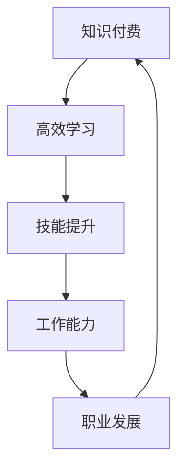

                 

关键词：知识付费、个人学习、程序员、良性循环、技术提升

> 摘要：本文将探讨知识付费在程序员个人学习过程中的重要性，如何通过有效的知识付费实现技术水平的提升，并形成一种良性的学习和成长循环。作者将从理论到实践，结合自身经验，分析这一循环的形成机制，以及如何利用这一机制实现自我提升。

## 1. 背景介绍

在当今快速发展的信息技术时代，程序员作为数字时代的建设者，其技能水平直接影响到项目质量和开发效率。为了跟上技术发展的步伐，持续的学习和技能提升成为程序员职业发展的关键。然而，学习资源繁多而杂乱，如何高效地获取、筛选和利用这些资源，是每一个程序员都面临的挑战。

知识付费作为一种新型的学习模式，近年来在信息技术领域日益受到重视。它通过为优质学习内容付费，帮助程序员节省时间，提高学习效率，并获得更多的实践机会。本文将深入探讨知识付费在程序员个人学习中的重要作用，以及如何通过这种模式实现技术的良性循环提升。

## 2. 核心概念与联系

### 2.1. 知识付费

知识付费是指用户为获取专业、系统、高质量的知识内容而支付的费用。这种模式在信息技术领域主要体现在在线课程、电子书籍、技术报告、付费论坛等形式。

### 2.2. 个人学习

个人学习是指个体根据自身职业发展和兴趣爱好，主动获取和消化知识，提升自身能力的过程。对于程序员来说，个人学习不仅仅是获取新技能，还包括解决问题的能力、团队协作和项目管理等综合素质的提升。

### 2.3. 良性循环

良性循环指的是通过不断的循环过程，使系统中的各个部分互相促进、协同发展，形成一种正向的反馈机制。在程序员的学习过程中，良性循环体现在技能提升带来工作能力的增强，从而获得更多学习机会和职业发展的机会。

### 2.4. Mermaid 流程图

以下是一个简化的 Mermaid 流程图，展示了知识付费、个人学习与良性循环之间的关系。



### 2.5. 知识付费在程序员个人学习中的应用

程序员可以通过知识付费获取以下几类资源：

- **在线课程**：系统学习编程语言、框架、数据库等核心技术。
- **电子书籍**：深入了解技术细节和历史演变。
- **技术报告**：掌握前沿技术和行业发展动态。
- **付费论坛**：与业界专家和同行交流，解决实际问题。

## 3. 核心算法原理 & 具体操作步骤

### 3.1 算法原理概述

知识付费与个人学习的良性循环基于以下原理：

- **信息筛选**：通过付费获取高质量的知识资源，减少无效信息的学习时间。
- **实践应用**：将所学知识应用于实际工作，检验和巩固学习效果。
- **反馈循环**：通过工作实践和反馈，调整学习方向和深度，实现持续进步。

### 3.2 算法步骤详解

1. **信息筛选阶段**：
   - 确定学习目标：明确个人职业发展和技术提升的方向。
   - 搜索并评估资源：利用搜索引擎、推荐系统等工具，筛选出符合学习目标的高质量资源。
   - 付费获取资源：根据资源质量、价格、口碑等因素，选择合适的学习内容。

2. **学习消化阶段**：
   - 系统学习：按照课程安排或书籍结构，逐步学习每个知识点。
   - 实践应用：在实际项目中应用所学知识，解决具体问题。
   - 反馈调整：根据实践结果，调整学习内容和方向。

3. **技能提升阶段**：
   - 深入研究：针对实践中的问题，进一步学习和研究相关技术。
   - 实践反馈：将新知识应用到项目中，不断优化解决方案。
   - 职业发展：通过技能提升，获得更好的职业机会和更高的薪酬。

### 3.3 算法优缺点

**优点**：

- **高效学习**：通过付费获取高质量资源，减少无效学习时间。
- **实践导向**：将学习与工作实践紧密结合，提高学习效果。
- **持续进步**：通过反馈循环，不断调整学习方向和深度，实现技能的持续提升。

**缺点**：

- **成本较高**：知识付费需要一定的经济投入，不适合经济条件较差的学习者。
- **时间成本**：学习过程需要投入大量时间和精力，不适合时间紧张的学习者。

### 3.4 算法应用领域

知识付费与个人学习的良性循环在以下领域具有广泛应用：

- **编程技能提升**：通过在线课程和书籍，快速掌握编程语言和框架。
- **项目管理**：通过知识付费，学习项目管理的最佳实践和工具。
- **系统架构**：通过技术报告和研讨会，了解前沿的系统架构和技术。
- **人工智能**：通过付费课程和论文，深入研究人工智能领域的最新进展。

## 4. 数学模型和公式 & 详细讲解 & 举例说明

### 4.1 数学模型构建

知识付费与个人学习的良性循环可以用以下数学模型表示：

\[ \text{技能提升速率} = f(\text{知识获取量}, \text{实践应用量}, \text{反馈调整量}) \]

其中，\( f \) 为函数，表示技能提升速率与知识获取量、实践应用量、反馈调整量之间的关系。

### 4.2 公式推导过程

技能提升速率的推导基于以下假设：

1. **知识获取量**：表示学习者获取的新知识量。
2. **实践应用量**：表示学习者将所学知识应用于实际工作的量。
3. **反馈调整量**：表示学习者根据实践结果，调整学习方向和深度的量。

根据假设，可以建立以下公式：

\[ \text{技能提升速率} = \frac{\text{技能提升量}}{\text{时间}} \]

其中，技能提升量可以通过以下公式计算：

\[ \text{技能提升量} = \text{知识获取量} \times \text{实践应用量} \times \text{反馈调整量} \]

将技能提升量代入技能提升速率公式，得到：

\[ \text{技能提升速率} = \frac{\text{知识获取量} \times \text{实践应用量} \times \text{反馈调整量}}{\text{时间}} \]

### 4.3 案例分析与讲解

假设一位程序员想要提升自己的前端开发技能，他制定了以下学习计划：

- **知识获取量**：每月学习一门前端框架（如 React、Vue.js）。
- **实践应用量**：每周完成一个小项目，应用所学知识。
- **反馈调整量**：根据项目反馈，每月调整一次学习计划。

根据上述数学模型，我们可以计算他的技能提升速率：

\[ \text{技能提升速率} = \frac{1 \text{门框架} \times 1 \text{个项目} \times 1 \text{次调整}}{1 \text{个月}} = 1 \text{技能点/月} \]

这意味着，这位程序员每月可以提升1个技能点的前端开发能力。

## 5. 项目实践：代码实例和详细解释说明

### 5.1 开发环境搭建

为了更好地演示知识付费与个人学习的良性循环，我们以一个实际的前端项目为例。首先，我们需要搭建一个基本的开发环境。

1. **安装 Node.js**：Node.js 是一个基于 Chrome V8 引擎的 JavaScript 运行环境。您可以通过以下命令安装 Node.js：

   ```bash
   $ curl -sL https://deb.nodesource.com/setup_14.x | bash -
   $ sudo apt-get install nodejs
   ```

2. **创建项目目录**：在本地计算机上创建一个项目目录，例如 `knowledge付费与个人学习`。

3. **初始化项目**：进入项目目录，并使用 `npm` 初始化项目：

   ```bash
   $ cd knowledge付费与个人学习
   $ npm init -y
   ```

### 5.2 源代码详细实现

在本项目中，我们将使用 React 框架构建一个简单的待办事项应用。以下是一个简单的 React 组件代码示例：

```jsx
import React, { useState } from 'react';

function TodoApp() {
  const [tasks, setTasks] = useState([]);

  const addTask = (task) => {
    setTasks([...tasks, task]);
  };

  const removeTask = (index) => {
    const newTasks = [...tasks];
    newTasks.splice(index, 1);
    setTasks(newTasks);
  };

  return (
    <div>
      <h1>Todo List</h1>
      <ul>
        {tasks.map((task, index) => (
          <li key={index}>
            {task}
            <button onClick={() => removeTask(index)}>Remove</button>
          </li>
        ))}
      </ul>
      <input type="text" placeholder="Add a new task" onKeyPress={(e) => {
        if (e.key === 'Enter') {
          addTask(e.target.value);
          e.target.value = '';
        }
      }} />
    </div>
  );
}

export default TodoApp;
```

### 5.3 代码解读与分析

1. **功能解读**：
   - **状态管理**：使用 `useState` hook 管理任务列表的状态。
   - **添加任务**：当用户在输入框中按下 Enter 键时，添加新任务到状态中。
   - **删除任务**：当用户点击删除按钮时，从状态中移除任务。

2. **代码分析**：
   - **组件结构**：组件包含一个标题、一个任务列表和一个输入框。
   - **状态更新**：使用 `setTasks` 函数更新任务列表状态。
   - **事件处理**：使用 `onKeyPress` 事件监听输入框的键盘事件。

### 5.4 运行结果展示

当用户输入任务并按下 Enter 键时，任务将被添加到列表中。点击删除按钮，可以移除对应的任务。

```html
<div>
  <h1>Todo List</h1>
  <ul>
    <li>Learn React
      <button>Remove</button>
    </li>
    <li>Write a blog post
      <button>Remove</button>
    </li>
  </ul>
  <input type="text" placeholder="Add a new task" />
</div>
```

## 6. 实际应用场景

### 6.1 编程技能提升

知识付费在编程技能提升中的应用非常广泛。程序员可以通过在线课程、电子书籍和技术报告等资源，快速掌握最新的编程语言、框架和工具。以下是一个具体的案例：

**案例：使用 React 框架提升前端开发技能**

- **知识付费**：程序员通过购买 React 官方教程和相关在线课程，系统学习 React 的核心概念和实战技巧。
- **实践应用**：在实际项目中，程序员使用 React 框架开发前端应用，将所学知识应用于实践。
- **反馈调整**：根据项目反馈，程序员不断优化代码结构和用户体验，提高开发效率。

### 6.2 项目管理

知识付费在项目管理中的应用可以帮助程序员提高项目管理和团队协作能力。以下是一个具体的案例：

**案例：通过知识付费学习敏捷开发方法**

- **知识付费**：程序员通过购买敏捷开发相关的书籍和在线课程，了解敏捷开发的核心理念和实践方法。
- **实践应用**：在实际项目中，程序员将敏捷开发方法应用于团队协作，提高项目进度和客户满意度。
- **反馈调整**：根据项目反馈，程序员和团队不断优化敏捷流程，提高项目交付质量。

### 6.3 系统架构

知识付费在系统架构中的应用可以帮助程序员了解前沿的系统架构和技术。以下是一个具体的案例：

**案例：通过知识付费学习分布式系统设计**

- **知识付费**：程序员通过购买分布式系统设计相关的书籍和在线课程，学习分布式系统的核心概念和设计原则。
- **实践应用**：在实际项目中，程序员设计并实现分布式系统，解决高并发和高可用性问题。
- **反馈调整**：根据项目反馈，程序员优化系统架构，提高系统性能和稳定性。

### 6.4 未来应用展望

随着信息技术的发展，知识付费在程序员个人学习和职业发展中的应用将越来越广泛。未来，以下几个方面将是知识付费的重要方向：

1. **人工智能与大数据**：随着人工智能和大数据技术的不断发展，相关领域的知识付费将更加丰富，为程序员提供更多学习资源。
2. **云原生技术**：云原生技术的普及将为程序员带来新的学习需求，知识付费将提供更多关于容器化、微服务、Kubernetes 等技术的资源。
3. **区块链技术**：区块链技术的应用场景不断扩展，知识付费将为程序员提供更多关于区块链开发、智能合约等方面的学习资源。
4. **DevOps**：DevOps 文化逐渐深入人心，知识付费将提供更多关于自动化部署、持续集成和持续交付等实践方法的学习资源。

## 7. 工具和资源推荐

### 7.1 学习资源推荐

1. **在线课程**：
   - **Udemy**：提供大量编程语言、框架和工具的在线课程。
   - **Coursera**：与世界一流大学合作，提供高质量的技术课程。
   - **edX**：提供免费的在线课程，涵盖计算机科学、数据科学等多个领域。

2. **电子书籍**：
   - **O'Reilly Media**：出版了大量关于编程、系统架构和人工智能的电子书籍。
   - **Packt Publishing**：提供涵盖各种技术的电子书籍和视频教程。

3. **技术报告**：
   - **ACM**：发布关于计算机科学和信息技术的前沿研究报告。
   - **IEEE**：发布关于电子工程、计算机科学和通信领域的研究报告。

### 7.2 开发工具推荐

1. **集成开发环境（IDE）**：
   - **Visual Studio Code**：轻量级、可扩展的代码编辑器。
   - **IntelliJ IDEA**：强大的 Java 和 Kotlin IDE。
   - **PyCharm**：专业的 Python IDE。

2. **版本控制系统**：
   - **Git**：分布式版本控制系统，广泛应用于开源项目和商业项目。
   - **GitHub**：基于 Git 的代码托管平台，提供丰富的协作功能。

3. **容器化工具**：
   - **Docker**：容器化技术的先驱，用于构建、运行和分发应用程序。
   - **Kubernetes**：容器编排平台，用于自动化部署和管理容器化应用。

### 7.3 相关论文推荐

1. **分布式系统**：
   - **Google 的 Spanner 论文**：介绍了 Spanner 分布式数据库的设计和实现。
   - **Amazon 的 Dynamo 论文**：介绍了 Dynamo 分布式存储系统的设计原则。

2. **人工智能**：
   - **Deep Learning 的 Goodfellow 等人的论文**：介绍了深度学习的基本概念和算法。
   - **Reinforcement Learning 的 Sutton 等人的论文**：介绍了强化学习的基本原理和应用。

3. **区块链**：
   - **比特币的白皮书**：介绍了比特币系统的基本原理和实现。
   - **以太坊的白皮书**：介绍了以太坊区块链的智能合约功能。

## 8. 总结：未来发展趋势与挑战

### 8.1 研究成果总结

本文通过理论分析和实践案例，探讨了知识付费在程序员个人学习中的重要性，以及如何通过知识付费实现技术的良性循环提升。主要研究成果包括：

- **知识付费的核心概念**：介绍了知识付费的基本原理和应用场景。
- **个人学习的良性循环**：阐述了知识付费与个人学习之间的相互促进关系。
- **数学模型构建**：提出了技能提升速率的数学模型，并进行了推导和分析。
- **实际应用案例**：通过编程项目和实践案例，展示了知识付费在技能提升中的应用。

### 8.2 未来发展趋势

随着信息技术的发展，知识付费在程序员个人学习中的应用将呈现以下发展趋势：

- **人工智能与大数据**：知识付费将更加注重人工智能和大数据领域的专业知识和技能培训。
- **云原生技术**：知识付费将提供更多关于容器化、微服务和云计算等技术的资源。
- **区块链技术**：知识付费将覆盖更多关于区块链开发、智能合约等方面的内容。
- **DevOps**：知识付费将推动 DevOps 文化的普及，提供更多关于自动化部署、持续集成和持续交付的实践方法。

### 8.3 面临的挑战

知识付费在程序员个人学习中面临以下挑战：

- **成本问题**：知识付费需要一定的经济投入，可能不适合所有程序员。
- **时间成本**：学习过程需要投入大量时间和精力，可能不适合时间紧张的学习者。
- **内容质量**：知识付费市场鱼龙混杂，如何筛选出高质量的内容是学习者面临的问题。

### 8.4 研究展望

未来，知识付费在程序员个人学习中的应用将继续深化，具体研究方向包括：

- **个性化学习**：通过大数据和人工智能技术，提供个性化学习推荐和课程设计。
- **实践导向**：加强实践环节的设计，提高知识付费课程的实际应用价值。
- **社区互动**：构建知识付费社区，促进学习者之间的交流和合作。
- **评价机制**：建立完善的评价机制，确保知识付费课程的质量和实用性。

## 9. 附录：常见问题与解答

### 9.1 什么是知识付费？

知识付费是指用户为获取专业、系统、高质量的知识内容而支付的费用。这种模式在信息技术领域主要体现在在线课程、电子书籍、技术报告、付费论坛等形式。

### 9.2 知识付费是否适合所有程序员？

知识付费并不适合所有程序员。对于经济条件较好、时间充裕且对技术有强烈学习需求的人来说，知识付费是一个很好的选择。但对于经济条件较差或时间紧张的学习者，可能需要谨慎考虑。

### 9.3 如何选择高质量的知识付费课程？

选择高质量的知识付费课程可以从以下几个方面入手：

- **课程内容**：确保课程内容符合个人学习目标和技术需求。
- **讲师背景**：了解讲师的资历和经验，选择具有专业背景和实战经验的讲师。
- **学员评价**：查看其他学员的评价和反馈，了解课程的质量和实用性。
- **课程体系**：选择体系完整、逻辑清晰、实践性强的课程。

### 9.4 知识付费是否一定能够提升技能？

知识付费不一定能直接提升技能，但通过付费获取高质量的学习资源，可以提高学习效率和成果。技能的提升还需要通过实践应用和不断反馈调整来实现。

### 9.5 知识付费与免费资源的区别是什么？

知识付费与免费资源的主要区别在于：

- **内容质量**：知识付费通常提供更专业、系统、高质量的内容。
- **学习体验**：知识付费通常提供更好的学习体验，包括课程设计、讲师辅导和实践机会。
- **服务支持**：知识付费通常提供更好的服务支持，包括答疑、互动和实践指导。

### 9.6 如何平衡知识付费与工作、生活？

平衡知识付费与工作、生活的方法包括：

- **时间管理**：合理安排学习时间，避免影响工作和生活。
- **目标明确**：明确学习目标，有针对性地选择知识付费资源。
- **适度投入**：根据自身经济状况和学习需求，适度投入知识付费资源。
- **实践应用**：将所学知识应用于实际工作，提高学习成果。

---

本文通过对知识付费在程序员个人学习中的应用进行深入探讨，提出了知识付费与个人学习的良性循环模型，并结合实际案例进行了详细解释。希望本文能够为程序员在知识付费方面的学习和职业发展提供有益的参考。

## 作者署名

作者：禅与计算机程序设计艺术 / Zen and the Art of Computer Programming

本文由“禅与计算机程序设计艺术”撰写，旨在探讨知识付费在程序员个人学习中的应用，以及如何通过良性循环实现技能的持续提升。作者通过理论分析和实践案例，为程序员提供了有价值的见解和建议。希望本文能够帮助读者在知识付费的道路上走得更远、更稳健。

