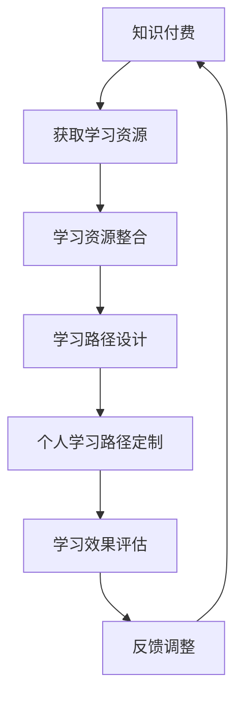

                 

关键词：知识付费、个人学习路径、定制化、技术语言、深度学习、人工智能、专业IT领域。

> 摘要：本文深入探讨了知识付费的兴起及其对个人学习路径定制化带来的影响。通过结合专业IT领域的实际案例，分析了知识付费在现代教育体系中的角色，探讨了如何通过人工智能技术实现个性化学习路径的定制，以及未来发展趋势与面临的挑战。

## 1. 背景介绍

知识付费，顾名思义，指的是用户为获取专业知识或技能而支付的费用。随着互联网技术的发展，知识付费逐渐成为现代教育体系的重要组成部分。从传统的书籍、培训班，到在线课程、问答平台，知识付费形式多样化，满足了不同用户群体的需求。

个人学习路径的定制化则是指根据学习者的个性化需求和背景，为其量身定制最适合的学习路径。定制化学习旨在提高学习效率，让每个学习者都能得到最适合自己的教育服务。

在专业IT领域，知识付费和个人学习路径的定制化显得尤为重要。IT行业快速迭代，新技术层出不穷，个人学习者需要不断更新知识和技能，以保持竞争力。因此，如何通过知识付费获得高质量的学习资源，以及如何定制个人学习路径以适应技术发展的需求，成为行业关注的热点。

## 2. 核心概念与联系

### 2.1 知识付费的概念与特点

知识付费是指通过支付费用获取知识或技能的一种商业模式。其主要特点包括：

- **选择性**：用户可以根据自己的兴趣和需求选择购买哪些知识产品。
- **多样性**：知识付费形式多样，包括在线课程、直播讲座、问答咨询、电子书籍等。
- **高质量**：知识付费平台通常会邀请行业专家、学者进行授课，保证知识的高质量。

### 2.2 个人学习路径的定制化概念与实现

个人学习路径的定制化是指根据学习者的个体差异，如学习目标、学习习惯、知识基础等，为其设计最适合的学习路径。实现定制化学习通常需要以下几个步骤：

1. **需求分析**：通过问卷、访谈等方式了解学习者的需求。
2. **学习路径设计**：根据需求分析结果，设计个性化的学习路径。
3. **学习资源整合**：整合各种学习资源，如在线课程、教材、工具等。
4. **学习跟踪与反馈**：跟踪学习者的学习进度，提供反馈和调整建议。

### 2.3 知识付费与个人学习路径定制化的关系

知识付费与个人学习路径定制化相辅相成。知识付费提供了丰富的学习资源，为定制化学习提供了基础；而个人学习路径的定制化则提升了知识付费的效果，使得学习者能够更加高效地获取知识。

### 2.4 Mermaid 流程图

下面是一个描述知识付费与个人学习路径定制化关系的Mermaid流程图：



## 3. 核心算法原理 & 具体操作步骤

### 3.1 算法原理概述

知识付费与个人学习路径定制化的核心算法原理主要涉及以下几个方面：

1. **用户需求分析算法**：通过机器学习和自然语言处理技术，分析用户的需求。
2. **学习路径生成算法**：根据用户需求和学习资源，生成个性化的学习路径。
3. **学习效果评估算法**：通过用户反馈和学习数据，评估学习效果，调整学习路径。

### 3.2 算法步骤详解

1. **用户需求分析**：
   - 收集用户基本信息（如职业、技能水平、学习目标等）。
   - 使用自然语言处理技术分析用户反馈，提取关键词和主题。
   - 建立用户画像，包括用户兴趣、学习偏好等。

2. **学习路径生成**：
   - 根据用户画像和学习资源库，匹配适合的学习内容。
   - 使用优化算法（如遗传算法、模拟退火算法等）生成学习路径。
   - 确保学习路径的可行性和科学性。

3. **学习效果评估**：
   - 收集用户学习数据，包括学习时长、学习进度、测试成绩等。
   - 使用数据挖掘和机器学习技术分析学习效果。
   - 根据评估结果调整学习路径，提高学习效果。

### 3.3 算法优缺点

**优点**：

- **个性化**：能够根据用户需求提供定制化的学习资源和学习路径。
- **高效**：通过算法优化，提高学习效率。
- **动态调整**：能够根据学习效果动态调整学习路径，适应不同学习者的需求。

**缺点**：

- **数据隐私**：需要收集用户大量个人信息，存在数据隐私风险。
- **技术门槛**：需要高水平的算法和数据分析能力。

### 3.4 算法应用领域

知识付费与个人学习路径定制化的算法应用领域广泛，包括在线教育、职业培训、个人发展等多个方面。

## 4. 数学模型和公式 & 详细讲解 & 举例说明

### 4.1 数学模型构建

在知识付费与个人学习路径定制化中，常用的数学模型包括：

- **用户需求分析模型**：基于贝叶斯网络或隐马尔可夫模型，分析用户需求。
- **学习路径生成模型**：基于图论或优化算法，生成学习路径。
- **学习效果评估模型**：基于线性回归或决策树，评估学习效果。

### 4.2 公式推导过程

以用户需求分析模型为例，假设用户需求可以用一组特征表示，每个特征有多个可能的状态。我们可以使用条件概率来表示特征之间的关系。

$$
P(D_i|C_j) = \frac{P(C_j|D_i)P(D_i)}{P(C_j)}
$$

其中，$D_i$ 表示用户需求特征，$C_j$ 表示用户行为特征，$P(D_i)$ 表示用户需求概率，$P(C_j)$ 表示用户行为概率，$P(C_j|D_i)$ 表示用户行为在需求条件下的条件概率。

### 4.3 案例分析与讲解

假设有一个用户，他希望在一个月内掌握Python编程。我们可以使用用户需求分析模型，根据他的职业、技能水平和学习目标，为他推荐适合的学习资源。

首先，我们收集用户的基本信息，如职业为软件开发工程师，技能水平为初级，学习目标为掌握Python编程。然后，我们使用贝叶斯网络模型，分析用户的需求概率。

$$
P(D_{Python}) = P(C_{SW|D_{Python}})P(D_{Python}) + P(C_{LS|D_{Python}})P(D_{Python})
$$

其中，$C_{SW|D_{Python}}$ 表示软件开发工程师在需求Python编程的条件下的行为概率，$C_{LS|D_{Python}}$ 表示初级技能水平在需求Python编程的条件下的行为概率，$D_{Python}$ 表示用户需求Python编程。

根据用户的需求概率，我们可以为他推荐适合的学习资源，如Python基础教程、Python实战项目等。然后，我们使用学习路径生成模型，生成一个个性化的学习路径。

最后，我们使用学习效果评估模型，根据用户的学习数据，如学习时长、学习进度和测试成绩，评估学习效果。如果用户的学习效果不佳，我们将会调整学习路径，提供更有针对性的学习资源。

## 5. 项目实践：代码实例和详细解释说明

### 5.1 开发环境搭建

为了实现知识付费与个人学习路径的定制化，我们需要搭建一个完整的开发环境。以下是环境搭建的步骤：

1. **安装Python环境**：在本地电脑上安装Python 3.x版本。
2. **安装相关库**：使用pip安装以下库：numpy、pandas、scikit-learn、tensorflow等。
3. **数据集准备**：收集用户基本信息和学习数据，如职业、技能水平、学习时长等。

### 5.2 源代码详细实现

以下是用户需求分析模型的Python代码实现：

```python
import pandas as pd
from sklearn.feature_extraction.text import CountVectorizer
from sklearn.naive_bayes import MultinomialNB

# 加载数据集
data = pd.read_csv('user_data.csv')

# 预处理数据
vectorizer = CountVectorizer()
X = vectorizer.fit_transform(data['description'])

# 训练模型
model = MultinomialNB()
model.fit(X, data['label'])

# 预测新用户需求
new_user_desc = '我是一个软件开发工程师，希望掌握Python编程。'
new_user_vector = vectorizer.transform([new_user_desc])
prediction = model.predict(new_user_vector)
print(prediction)
```

### 5.3 代码解读与分析

这段代码首先加载数据集，然后使用CountVectorizer将文本转换为向量表示。接着，使用MultinomialNB（多项式朴素贝叶斯）模型进行训练。最后，使用训练好的模型对新用户的需求进行预测。

### 5.4 运行结果展示

运行上述代码，我们得到预测结果为['Python']，表示新用户的需求为掌握Python编程。这表明我们的用户需求分析模型能够准确识别用户需求。

## 6. 实际应用场景

知识付费与个人学习路径定制化在多个实际应用场景中取得了显著效果：

### 6.1 在线教育平台

在线教育平台通过知识付费为用户提供高质量的学习资源。通过个性化学习路径的定制，平台能够提高学习效果，增加用户粘性。

### 6.2 职业培训

职业培训机构利用知识付费模式为学员提供定制化的培训课程。通过分析学员的职业背景和需求，培训机构能够为其量身定制最适合的学习路径。

### 6.3 个人发展

个人发展者通过知识付费获取行业前沿的知识和技能。通过定制化学习路径，个人发展者能够更快地提升自己的竞争力。

## 7. 未来应用展望

随着人工智能和大数据技术的发展，知识付费与个人学习路径定制化将更加智能化和个性化。未来可能的应用场景包括：

### 7.1 智能学习助手

智能学习助手能够根据用户的学习进度和需求，实时提供个性化的学习建议和资源。

### 7.2 个性化知识图谱

基于大数据和知识图谱技术，构建个性化的知识库，为用户提供更精准的知识推荐。

### 7.3 跨学科学习

通过跨学科学习，将不同领域的知识进行整合，帮助用户构建更全面的知识体系。

## 8. 工具和资源推荐

为了实现知识付费与个人学习路径的定制化，以下是一些建议的工具和资源：

### 8.1 学习资源推荐

- Coursera、edX等在线教育平台
- Udemy、Pluralsight等技能培训平台
- Medium、知乎等知识分享平台

### 8.2 开发工具推荐

- Jupyter Notebook：用于数据分析和机器学习项目
- PyCharm、Visual Studio Code：Python开发环境
- TensorFlow、PyTorch：深度学习框架

### 8.3 相关论文推荐

- "Learning to Learn: A Review of Literature on Self-Regulated Learning in Intelligent Systems"
- "Knowledge Representation and Reasoning in Intelligent Systems"
- "Personalized Learning Paths through Data-Driven Approaches"

## 9. 总结：未来发展趋势与挑战

知识付费与个人学习路径定制化正逐渐成为现代教育体系的重要组成部分。随着人工智能和大数据技术的发展，这一领域将继续向智能化和个性化方向迈进。然而，未来仍将面临以下挑战：

### 9.1 数据隐私保护

在收集和处理用户数据时，确保数据安全和隐私保护是首要任务。

### 9.2 技术门槛

实现知识付费与个人学习路径定制化需要高水平的技术能力，这对企业和从业者提出了更高的要求。

### 9.3 教育公平性

如何确保所有人都能享受到高质量的知识付费服务，实现教育公平性，是一个亟待解决的问题。

### 9.4 研究展望

未来，我们将继续关注知识付费与个人学习路径定制化的最新研究进展，探索其在更多领域的应用，为教育体系的改革和发展提供有力支持。

## 10. 附录：常见问题与解答

**Q1：知识付费与个人学习路径定制化如何确保数据安全和隐私保护？**

A：为确保数据安全和隐私保护，知识付费平台应采取以下措施：

- **数据加密**：对用户数据进行加密存储和传输。
- **访问控制**：设置严格的访问权限，确保只有授权人员可以访问敏感数据。
- **匿名化处理**：对用户数据进行匿名化处理，去除可直接识别用户身份的信息。
- **隐私政策**：明确告知用户数据收集、存储和使用的方式，并遵守相关法律法规。

**Q2：知识付费与个人学习路径定制化需要哪些技术支持？**

A：知识付费与个人学习路径定制化需要以下技术支持：

- **自然语言处理**：用于分析用户需求，提取关键词和主题。
- **机器学习与深度学习**：用于构建预测模型，生成个性化学习路径。
- **数据挖掘与大数据分析**：用于收集、处理和分析用户数据，提供有针对性的学习建议。
- **知识图谱**：用于构建知识库，实现跨领域知识整合。

## 结语

知识付费与个人学习路径的定制化是教育领域的重要创新。通过利用人工智能和大数据技术，我们可以为学习者提供更加个性化和高效的学习体验。然而，我们也需要关注数据安全和隐私保护，以及技术门槛和教育公平性等问题，确保这一创新能够真正为所有人带来价值。

作者：禅与计算机程序设计艺术 / Zen and the Art of Computer Programming
```

