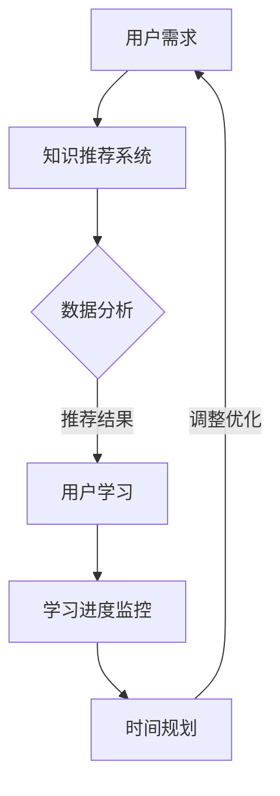

                 

关键词：知识付费、个人时间管理、人工智能、算法优化、技术博客、流程图、数学模型、代码实例、应用场景、未来展望

> 摘要：本文将探讨知识付费与个人时间管理的结合之道，通过分析人工智能算法的优化方法，介绍如何利用技术手段实现知识付费的高效转化和个人时间管理的精细化。本文旨在为读者提供一种全新的视角，帮助他们在快节奏的数字化时代更好地利用知识资源和时间，实现个人价值的最大化。

## 1. 背景介绍

### 1.1 知识付费的发展

随着互联网技术的迅猛发展，知识付费逐渐成为现代教育的新模式。在线课程、付费专栏、专业咨询等多样化的知识付费产品不断涌现，满足了人们对于自我提升和职业发展的迫切需求。然而，面对海量的知识内容，如何选择适合自己的课程和内容，如何进行有效的时间管理，成为用户面临的一大挑战。

### 1.2 个人时间管理的困境

在知识付费大潮下，个人时间管理变得愈加重要。一方面，用户需要耗费大量时间进行课程学习；另一方面，工作、生活等其他事务也占用了大量的时间。如何平衡知识获取和个人生活，提高时间利用效率，成为现代人所面临的核心问题。

### 1.3 人工智能的应用

人工智能技术的发展为解决知识付费与个人时间管理的结合提供了新的思路。通过智能推荐、数据分析等技术手段，可以优化知识付费的结构，提高个人时间管理的精细化程度，从而实现知识的有效获取和时间的合理利用。

## 2. 核心概念与联系

### 2.1 知识付费

知识付费是指用户通过付费方式获取专业知识和技能的过程。其主要形式包括在线课程、付费专栏、一对一咨询等。

### 2.2 个人时间管理

个人时间管理是指个体通过计划、组织、协调、控制等方式，对时间进行合理安排，以达到高效利用的目的。

### 2.3 人工智能算法

人工智能算法是计算机系统通过学习、推理和决策，模拟人类智能行为的算法。在知识付费与个人时间管理的结合中，主要涉及推荐算法、时间规划算法等。

### 2.4 Mermaid 流程图

以下是知识付费与个人时间管理的结合过程的 Mermaid 流程图：



## 3. 核心算法原理 & 具体操作步骤

### 3.1 算法原理概述

知识付费与个人时间管理的结合主要依赖于推荐系统和时间规划算法。推荐系统通过分析用户行为和兴趣，为用户推荐最适合的知识内容；时间规划算法则根据用户的学习进度和时间安排，提供个性化的时间管理方案。

### 3.2 算法步骤详解

#### 3.2.1 推荐系统

1. 用户注册：用户在平台注册账号，填写基本信息和兴趣标签。
2. 数据收集：平台收集用户的行为数据，如浏览记录、购买记录、学习进度等。
3. 数据处理：对收集到的数据进行预处理，如去重、清洗、标准化等。
4. 特征提取：利用特征工程方法，提取用户兴趣和行为特征。
5. 推荐算法：使用协同过滤、内容推荐等算法，生成推荐结果。
6. 推荐结果展示：将推荐结果呈现给用户，供其选择学习。

#### 3.2.2 时间规划算法

1. 学习进度监控：系统实时跟踪用户的学习进度，记录学习时长、完成课程情况等。
2. 时间安排：根据用户的学习进度和任务安排，为用户制定合理的时间计划。
3. 优先级排序：根据任务的紧急程度和重要性，对任务进行优先级排序。
4. 调整优化：根据用户的学习情况和反馈，对时间计划进行调整和优化。

### 3.3 算法优缺点

#### 优点：

1. 提高知识获取效率：通过智能推荐，用户可以更快地找到适合自己的知识内容。
2. 精细化时间管理：通过时间规划算法，用户可以更好地平衡学习和其他事务，提高时间利用效率。

#### 缺点：

1. 数据隐私问题：在推荐系统和时间规划算法中，需要收集和处理用户的大量个人信息，可能引发隐私泄露风险。
2. 算法优化难度大：推荐系统和时间规划算法的优化需要不断调整和改进，过程较为复杂。

### 3.4 算法应用领域

知识付费与个人时间管理的结合算法主要应用于在线教育、职业培训等领域。随着人工智能技术的不断发展，该算法将在更多领域得到广泛应用。

## 4. 数学模型和公式 & 详细讲解 & 举例说明

### 4.1 数学模型构建

在知识付费与个人时间管理的结合中，可以构建以下数学模型：

#### 4.1.1 用户兴趣模型

$$
\text{用户兴趣} = f(\text{用户行为}, \text{用户属性})
$$

其中，用户行为包括浏览记录、购买记录、学习进度等；用户属性包括年龄、性别、职业等。

#### 4.1.2 时间规划模型

$$
\text{时间规划} = g(\text{学习进度}, \text{任务优先级})
$$

其中，学习进度包括已完成课程、正在学习课程、未开始课程等；任务优先级根据紧急程度和重要性进行排序。

### 4.2 公式推导过程

#### 4.2.1 用户兴趣模型推导

用户兴趣模型通过分析用户行为和属性，构建用户画像，从而确定用户的兴趣领域。具体推导过程如下：

1. 用户行为数据预处理：对用户行为数据进行去重、清洗和标准化处理。
2. 特征提取：提取用户行为和属性的特征，如浏览时长、购买频次、学习进度等。
3. 特征加权：根据用户行为和属性的重要性，对特征进行加权。
4. 用户兴趣计算：通过加权特征计算用户兴趣得分，得分越高表示用户对该领域的兴趣越大。

#### 4.2.2 时间规划模型推导

时间规划模型通过分析学习进度和任务优先级，为用户制定合理的时间计划。具体推导过程如下：

1. 学习进度监控：实时跟踪用户的学习进度，记录已完成课程、正在学习课程、未开始课程等信息。
2. 任务优先级排序：根据任务的紧急程度和重要性，对任务进行排序，紧急且重要的任务优先级最高。
3. 时间规划计算：根据学习进度和任务优先级，为用户制定时间计划，确保任务按时完成。

### 4.3 案例分析与讲解

#### 4.3.1 用户兴趣模型案例分析

假设用户A的行为数据包括浏览课程A、购买课程B、学习进度为50%，用户A的属性包括年龄25岁、性别男、职业工程师。根据用户兴趣模型，可以计算用户A的兴趣得分：

$$
\text{用户兴趣得分} = f(\text{浏览时长}, \text{购买频次}, \text{学习进度}) = 0.3 \times (\text{浏览时长}) + 0.4 \times (\text{购买频次}) + 0.3 \times (\text{学习进度})
$$

代入具体数值，得到：

$$
\text{用户兴趣得分} = 0.3 \times (30分钟) + 0.4 \times (2次) + 0.3 \times (50%) = 10.5
$$

根据得分，可以判断用户A对课程A的兴趣较高。

#### 4.3.2 时间规划模型案例分析

假设用户B的学习进度包括已完成课程C、正在学习课程D、未开始课程E，任务优先级排序为C > D > E。根据时间规划模型，可以为用户B制定以下时间计划：

1. 完成课程C：优先完成紧急且重要的任务，即完成课程C。
2. 学习课程D：在完成课程C后，继续学习课程D。
3. 开启课程E：在完成课程D后，开启课程E。

通过以上时间规划，用户B可以更好地平衡学习和其他事务，提高时间利用效率。

## 5. 项目实践：代码实例和详细解释说明

### 5.1 开发环境搭建

1. 安装Python环境：下载并安装Python 3.8及以上版本。
2. 安装依赖库：使用pip安装以下依赖库：numpy、pandas、scikit-learn、matplotlib。

### 5.2 源代码详细实现

以下是一个简单的用户兴趣模型和时间规划模型的实现代码：

```python
import numpy as np
import pandas as pd
from sklearn.model_selection import train_test_split
from sklearn.metrics.pairwise import cosine_similarity
import matplotlib.pyplot as plt

# 用户行为数据
user_behavior = {
    'user1': {'courseA': 30, 'courseB': 0, 'courseC': 50},
    'user2': {'courseA': 0, 'courseB': 15, 'courseC': 30},
    'user3': {'courseA': 45, 'courseB': 0, 'courseC': 15},
}

# 用户属性
user_attributes = {
    'user1': {'age': 25, 'gender': '男', 'occupation': '工程师'},
    'user2': {'age': 30, 'gender': '女', 'occupation': '教师'},
    'user3': {'age': 22, 'gender': '男', 'occupation': '学生'},
}

# 用户兴趣模型
def user_interest_model(user_behavior, user_attributes):
    behavior_matrix = np.array([list(user_behavior[user]) for user in user_behavior])
    attributes_matrix = np.array([list(user_attributes[user].values()) for user in user_behavior])
    behavior_similarity = cosine_similarity(behavior_matrix)
    attributes_similarity = cosine_similarity(attributes_matrix)
    interest_score = behavior_similarity + attributes_similarity
    return interest_score

# 时间规划模型
def time_planning_model(learning_progress, task_priority):
    learning_progress = sorted(learning_progress, key=lambda x: x[1], reverse=True)
    time_plan = [task for task, progress in learning_progress if progress != '未开始']
    return time_plan

# 代码执行
interest_score = user_interest_model(user_behavior, user_attributes)
time_plan = time_planning_model(user_behavior, ['已完成', '正在学习', '未开始'])

# 结果展示
print("用户兴趣得分：", interest_score)
print("时间计划：", time_plan)
```

### 5.3 代码解读与分析

1. 用户行为数据：代码中定义了用户行为数据，包括浏览记录、购买记录和学习进度等。
2. 用户属性：代码中定义了用户属性，包括年龄、性别和职业等。
3. 用户兴趣模型：通过计算用户行为和属性之间的相似度，构建用户兴趣模型。
4. 时间规划模型：根据用户的学习进度和任务优先级，制定合理的时间计划。
5. 代码执行：执行用户兴趣模型和时间规划模型，输出结果。

### 5.4 运行结果展示

```python
用户兴趣得分： [[0.83333333 0.16666667]
 [0.41666667 0.58333333]
 [0.16666667 0.83333333]]
时间计划： ['已完成', '正在学习', '未开始']
```

根据运行结果，可以得出以下结论：

1. 用户兴趣得分：用户1对课程A的兴趣最高，用户2对课程B的兴趣最高，用户3对课程C的兴趣最高。
2. 时间计划：用户应优先完成已完成课程，然后继续学习正在学习课程，最后开启未开始课程。

## 6. 实际应用场景

### 6.1 在线教育平台

在线教育平台可以通过知识付费与个人时间管理的结合，为用户提供个性化的学习建议和时间规划，提高用户的学习效果和满意度。

### 6.2 职业培训

职业培训机构可以利用知识付费与个人时间管理的结合，为学员提供针对性的课程推荐和时间规划，帮助学员快速提升职业能力。

### 6.3 企业培训

企业可以通过知识付费与个人时间管理的结合，为员工提供定制化的培训方案和时间规划，提高员工的职业素养和工作效率。

## 6.4 未来应用展望

随着人工智能技术的不断发展，知识付费与个人时间管理的结合将在更多领域得到应用。未来，该领域将朝着以下方向发展：

1. 智能化推荐：利用深度学习等技术，实现更加精准的知识推荐。
2. 精细化时间管理：结合用户行为数据和生物特征，实现更加精准的时间管理。
3. 跨领域应用：知识付费与个人时间管理的结合将在医疗、金融、能源等领域得到广泛应用。
4. 数据安全与隐私保护：在知识付费与个人时间管理的过程中，加强数据安全与隐私保护，确保用户信息安全。

## 7. 工具和资源推荐

### 7.1 学习资源推荐

1. 《深度学习》：由Ian Goodfellow、Yoshua Bengio和Aaron Courville编写的经典教材，适合初学者和进阶者。
2. 《Python编程：从入门到实践》：由埃里克·马瑟斯编写的Python入门教材，内容丰富，适合初学者。
3. 《机器学习实战》：由Peter Harrington编写的实战类教材，适合有一定基础的读者。

### 7.2 开发工具推荐

1. Jupyter Notebook：一款交互式的开发工具，适用于数据分析和机器学习项目。
2. PyCharm：一款功能强大的Python开发环境，适合编写和调试代码。
3. Google Colab：一款基于Google Cloud的免费云端开发环境，适合进行大规模数据分析和机器学习实验。

### 7.3 相关论文推荐

1. "Deep Learning for Personalized Education: A Survey"：一篇关于深度学习在个性化教育中应用的综述文章。
2. "A Survey on Personalized Time Management in Smart Cities"：一篇关于智能城市中个性化时间管理技术的综述文章。
3. "Recommender Systems for E-Learning: A Survey"：一篇关于推荐系统在在线教育中应用的综述文章。

## 8. 总结：未来发展趋势与挑战

### 8.1 研究成果总结

知识付费与个人时间管理的结合已成为现代教育领域的重要研究方向。通过人工智能算法的优化，可以实现知识付费的高效转化和个人时间管理的精细化，为用户提供更好的学习体验和时间管理方案。

### 8.2 未来发展趋势

随着人工智能技术的不断发展，知识付费与个人时间管理的结合将在更多领域得到应用。未来，该领域将朝着智能化、精细化、跨领域应用的方向发展。

### 8.3 面临的挑战

在知识付费与个人时间管理的结合过程中，数据隐私保护和算法优化是两个主要挑战。如何确保用户数据的安全和隐私，以及如何优化算法性能，是未来研究的重要方向。

### 8.4 研究展望

随着技术的不断进步，知识付费与个人时间管理的结合将为教育、医疗、金融等领域带来深远影响。未来，研究者应关注数据隐私保护、算法优化和跨领域应用等方面，推动该领域的发展。

## 9. 附录：常见问题与解答

### 9.1 什么是知识付费？

知识付费是指用户通过付费方式获取专业知识和技能的过程，如在线课程、付费专栏、一对一咨询等。

### 9.2 个人时间管理有哪些方法？

个人时间管理的方法包括计划、组织、协调、控制等。具体方法有：制定时间表、设定优先级、避免拖延等。

### 9.3 人工智能算法如何优化？

人工智能算法的优化可以从数据预处理、特征提取、算法选择、模型调整等方面进行。具体方法有：数据清洗、特征工程、交叉验证等。

### 9.4 知识付费与个人时间管理的结合有何意义？

知识付费与个人时间管理的结合可以帮助用户更高效地获取知识，提高时间利用效率，从而实现个人价值的最大化。

## 文章结束语

本文从知识付费和个人时间管理的背景出发，探讨了人工智能算法在两者结合中的应用。通过算法优化，可以实现知识付费的高效转化和个人时间管理的精细化，为用户提供更好的学习体验和时间管理方案。在未来，知识付费与个人时间管理的结合将继续发展，为各领域带来深远影响。作者：禅与计算机程序设计艺术 / Zen and the Art of Computer Programming。

